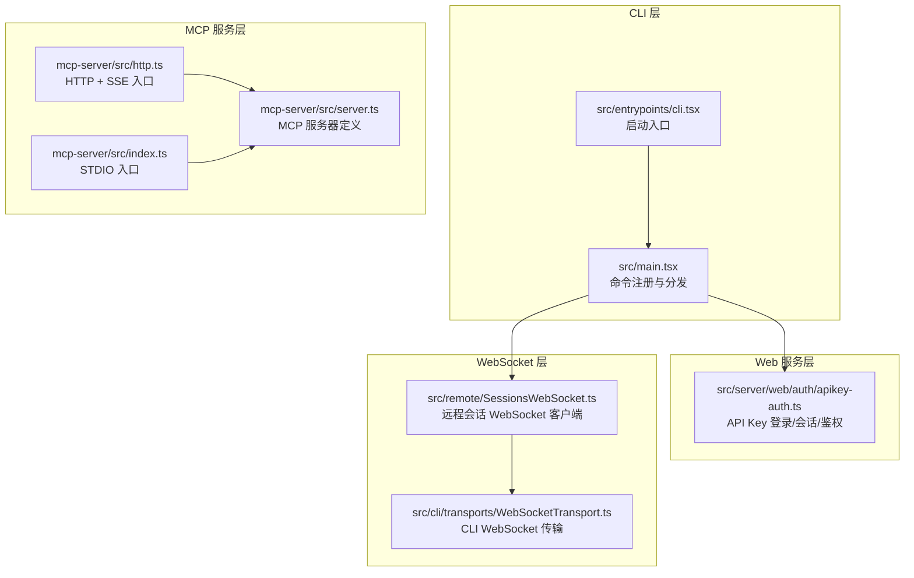
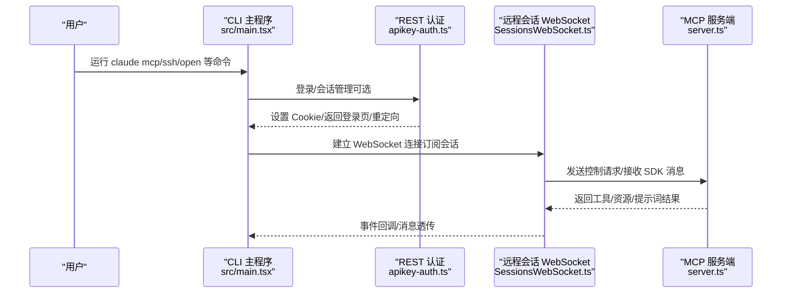
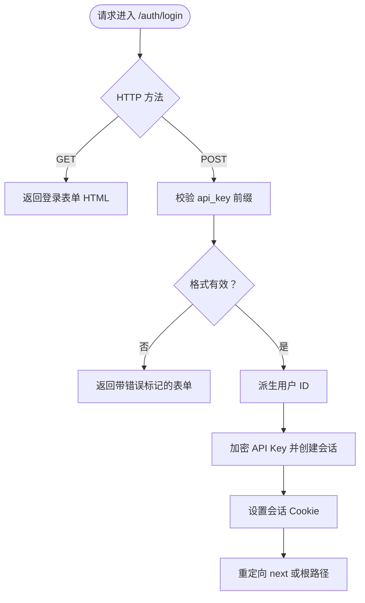
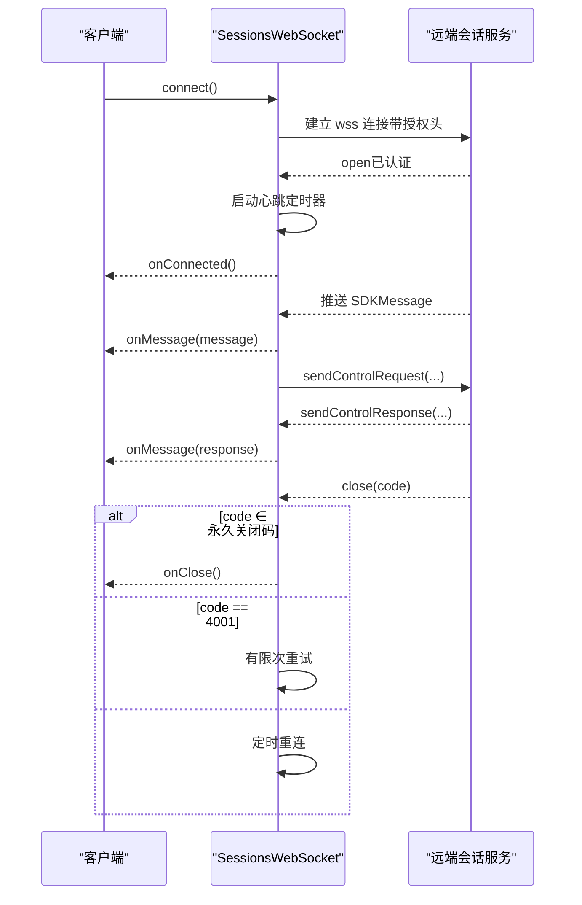
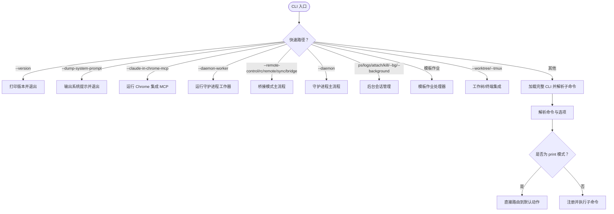
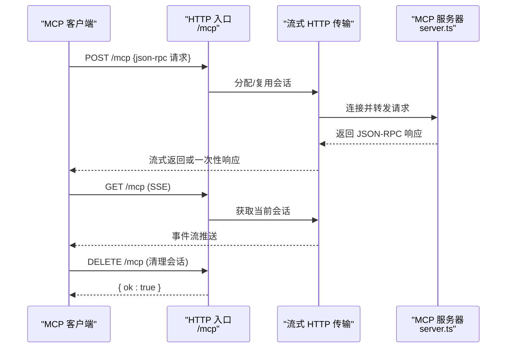
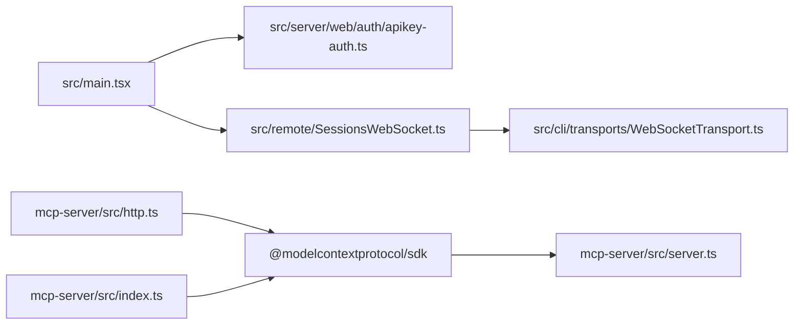

# API 参考

<cite>
**本文引用的文件**
- [src/main.tsx](file://src/main.tsx)
- [src/entrypoints/cli.tsx](file://src/entrypoints/cli.tsx)
- [src/server/web/auth/apikey-auth.ts](file://src/server/web/auth/apikey-auth.ts)
- [src/remote/SessionsWebSocket.ts](file://src/remote/SessionsWebSocket.ts)
- [src/cli/transports/WebSocketTransport.ts](file://src/cli/transports/WebSocketTransport.ts)
- [mcp-server/src/index.ts](file://mcp-server/src/index.ts)
- [mcp-server/src/http.ts](file://mcp-server/src/http.ts)
- [mcp-server/src/server.ts](file://mcp-server/src/server.ts)
- [src/constants/errorIds.ts](file://src/constants/errorIds.ts)
</cite>

## 目录
1. [简介](#简介)
2. [项目结构](#项目结构)
3. [核心组件](#核心组件)
4. [架构总览](#架构总览)
5. [详细组件分析](#详细组件分析)
6. [依赖关系分析](#依赖关系分析)
7. [性能考量](#性能考量)
8. [故障排查指南](#故障排查指南)
9. [结论](#结论)
10. [附录](#附录)

## 简介
本文件为 Claude Code 的全面 API 参考，覆盖以下接口与能力：
- REST API：HTTP 方法、URL 模式、请求/响应模式与认证方式
- WebSocket API：连接流程、消息格式、事件类型与实时交互模式
- CLI 接口：命令、参数、选项与使用示例
- MCP API：协议规范、消息类型与集成指南
并补充错误处理策略、安全考虑、速率限制与版本信息；提供常见用例与性能优化建议。

## 项目结构
围绕 API 的关键模块与入口如下：
- CLI 入口与子命令注册：src/main.tsx、src/entrypoints/cli.tsx
- REST 认证与会话：src/server/web/auth/apikey-auth.ts
- WebSocket 会话与控制：src/remote/SessionsWebSocket.ts、src/cli/transports/WebSocketTransport.ts
- MCP 服务端（STDIO/HTTP）：mcp-server/src/index.ts、mcp-server/src/http.ts、mcp-server/src/server.ts
- 错误标识常量：src/constants/errorIds.ts

图表来源
- [src/main.tsx:3800-4100](file://src/main.tsx#L3800-L4100)
- [src/entrypoints/cli.tsx:1-304](file://src/entrypoints/cli.tsx#L1-L304)
- [src/server/web/auth/apikey-auth.ts:1-231](file://src/server/web/auth/apikey-auth.ts#L1-L231)
- [src/remote/SessionsWebSocket.ts:1-406](file://src/remote/SessionsWebSocket.ts#L1-L406)
- [src/cli/transports/WebSocketTransport.ts:701-735](file://src/cli/transports/WebSocketTransport.ts#L701-L735)
- [mcp-server/src/index.ts:1-25](file://mcp-server/src/index.ts#L1-L25)
- [mcp-server/src/http.ts:1-173](file://mcp-server/src/http.ts#L1-L173)
- [mcp-server/src/server.ts:1-800](file://mcp-server/src/server.ts#L1-L800)

章节来源
- [src/main.tsx:3800-4100](file://src/main.tsx#L3800-L4100)
- [src/entrypoints/cli.tsx:1-304](file://src/entrypoints/cli.tsx#L1-L304)
- [src/server/web/auth/apikey-auth.ts:1-231](file://src/server/web/auth/apikey-auth.ts#L1-L231)
- [src/remote/SessionsWebSocket.ts:1-406](file://src/remote/SessionsWebSocket.ts#L1-L406)
- [src/cli/transports/WebSocketTransport.ts:701-735](file://src/cli/transports/WebSocketTransport.ts#L701-L735)
- [mcp-server/src/index.ts:1-25](file://mcp-server/src/index.ts#L1-L25)
- [mcp-server/src/http.ts:1-173](file://mcp-server/src/http.ts#L1-L173)
- [mcp-server/src/server.ts:1-800](file://mcp-server/src/server.ts#L1-L800)

## 核心组件
- CLI 子命令体系：mcp、server、open、auth 等，支持调试、verbose、输出格式等选项
- REST 鉴权：基于 Cookie 的会话与 API Key 登录，支持 JSON 与表单提交
- WebSocket：远程会话订阅、心跳保活、断线重连、控制请求/响应
- MCP：STDIO 与 HTTP（JSON-RPC/SSE）两种传输，提供资源、工具、提示词能力

章节来源
- [src/main.tsx:3875-3909](file://src/main.tsx#L3875-L3909)
- [src/server/web/auth/apikey-auth.ts:56-122](file://src/server/web/auth/apikey-auth.ts#L56-L122)
- [src/remote/SessionsWebSocket.ts:82-205](file://src/remote/SessionsWebSocket.ts#L82-L205)
- [mcp-server/src/http.ts:29-44](file://mcp-server/src/http.ts#L29-L44)

## 架构总览
下图展示从 CLI 到 MCP 服务端以及远程会话 WebSocket 的整体调用链路。

图表来源
- [src/main.tsx:3892-4096](file://src/main.tsx#L3892-L4096)
- [src/server/web/auth/apikey-auth.ts:56-122](file://src/server/web/auth/apikey-auth.ts#L56-L122)
- [src/remote/SessionsWebSocket.ts:82-205](file://src/remote/SessionsWebSocket.ts#L82-L205)
- [mcp-server/src/server.ts:148-158](file://mcp-server/src/server.ts#L148-L158)

## 详细组件分析

### REST API（Web 认证与会话）
- 路由与方法
  - GET /auth/login：渲染登录表单（HTML）
  - POST /auth/login：校验 API Key，创建加密会话并设置 Cookie，支持 next 参数跳转
  - POST /auth/logout：销毁会话并清理 Cookie，重定向到登录页
- 请求/响应
  - 表单提交：application/x-www-form-urlencoded，字段 api_key
  - JSON 响应：当 accept 包含 application/json 时返回 { error: "Unauthorized" }
- 认证方式
  - 会话 Cookie：服务端存储加密后的 API Key，派生用户 ID
  - 用户标识：基于 API Key 的哈希前缀派生稳定用户 ID
- 安全考虑
  - API Key 仅在服务端解密后用于子进程环境变量注入，不回传浏览器
  - 支持 ADMIN_USERS 环境变量配置管理员用户集合
- 版本信息
  - 登录页内联 HTML 提供页面标题与提示链接

图表来源
- [src/server/web/auth/apikey-auth.ts:56-122](file://src/server/web/auth/apikey-auth.ts#L56-L122)

章节来源
- [src/server/web/auth/apikey-auth.ts:56-122](file://src/server/web/auth/apikey-auth.ts#L56-L122)
- [src/server/web/auth/apikey-auth.ts:137-144](file://src/server/web/auth/apikey-auth.ts#L137-L144)

### WebSocket API（远程会话）
- 连接处理
  - 端点：wss://{BASE_API_URL}/v1/sessions/ws/{sessionId}/subscribe?organization_uuid={org}
  - 认证：Authorization: Bearer <access_token>，anthropic-version 头部
  - 代理与 TLS：支持代理与 mTLS 配置
- 消息格式
  - SDKMessage、SDKControlRequest/Response、SDKControlCancelRequest
  - 严格类型校验：仅接受带字符串 type 字段的消息
- 事件类型与交互
  - onMessage：接收 SDK 流式消息
  - onConnected/onReconnecting/onClose：连接状态回调
  - 心跳：每 30 秒 ping，异常检测与断线重连
  - 控制：sendControlRequest/sendControlResponse
- 断线与恢复
  - 4001（会话不存在）有限次重试
  - 永久关闭码（如 4003）不再重连
  - 最多重连次数与指数退避

图表来源
- [src/remote/SessionsWebSocket.ts:82-205](file://src/remote/SessionsWebSocket.ts#L82-L205)
- [src/remote/SessionsWebSocket.ts:234-288](file://src/remote/SessionsWebSocket.ts#L234-L288)
- [src/remote/SessionsWebSocket.ts:328-357](file://src/remote/SessionsWebSocket.ts#L328-L357)

章节来源
- [src/remote/SessionsWebSocket.ts:82-205](file://src/remote/SessionsWebSocket.ts#L82-L205)
- [src/remote/SessionsWebSocket.ts:234-288](file://src/remote/SessionsWebSocket.ts#L234-L288)
- [src/remote/SessionsWebSocket.ts:328-357](file://src/remote/SessionsWebSocket.ts#L328-L357)

### CLI 接口
- 入口与快速路径
  - 版本查询：-v/--version 直接输出版本号，零模块加载
  - 系统提示词导出：--dump-system-prompt 输出渲染后的系统提示
  - 特性门控：根据 feature 标志启用/隐藏功能
- 子命令与选项
  - mcp：配置与管理 MCP 服务器（serve/list/get/add/remove/reset）
  - server：启动本地会话服务器（端口、主机、令牌、Unix 套接字、工作目录、空闲超时、最大并发）
  - open：连接远程服务器（cc:// URL），支持 -p/headless 模式与输出格式
  - ssh：在远程主机上运行（通过 SSH 部署与隧道）
  - auth：认证管理
- 使用示例
  - 启动 MCP 服务：claude mcp serve [-d/--debug] [--verbose]
  - 连接远程：claude open cc://... [-p/--print] [--output-format text|json|stream-json]

图表来源
- [src/entrypoints/cli.tsx:33-299](file://src/entrypoints/cli.tsx#L33-L299)
- [src/main.tsx:3875-3909](file://src/main.tsx#L3875-L3909)

章节来源
- [src/entrypoints/cli.tsx:33-299](file://src/entrypoints/cli.tsx#L33-L299)
- [src/main.tsx:3892-4096](file://src/main.tsx#L3892-L4096)

### MCP API（STDIO 与 HTTP）
- 协议与传输
  - STDIO：标准输入输出，适合本地集成（Claude Desktop/Claude Code）
  - HTTP：JSON-RPC（POST /mcp）与 SSE（GET /mcp），支持会话持久化与清理
- 认证
  - 可选 Bearer 令牌（MCP_API_KEY），健康检查 /health 跳过鉴权
- 资源与工具
  - 资源：架构概览、工具清单、命令清单、源文件读取
  - 工具：列出工具/命令、读取源文件、搜索源码、目录浏览、架构总览
  - 提示词：解释工具/命令、架构总览、对比工具、通用问题
- 版本信息
  - 服务端元数据包含名称与版本（例如 1.1.0）

图表来源
- [mcp-server/src/http.ts:50-104](file://mcp-server/src/http.ts#L50-L104)
- [mcp-server/src/http.ts:110-132](file://mcp-server/src/http.ts#L110-L132)
- [mcp-server/src/http.ts:138-167](file://mcp-server/src/http.ts#L138-L167)
- [mcp-server/src/server.ts:148-158](file://mcp-server/src/server.ts#L148-L158)

章节来源
- [mcp-server/src/http.ts:1-173](file://mcp-server/src/http.ts#L1-L173)
- [mcp-server/src/server.ts:148-800](file://mcp-server/src/server.ts#L148-L800)
- [mcp-server/src/index.ts:1-25](file://mcp-server/src/index.ts#L1-L25)

## 依赖关系分析
- CLI 依赖
  - 命令注册与帮助排序：createSortedHelpConfig、program.command(...)
  - 子命令处理器按需动态导入，避免不必要的模块评估
- WebSocket 依赖
  - SessionsWebSocket 依赖 OAuth 配置、代理与 TLS、JSON 序列化
  - CLI 侧 WebSocketTransport 依赖心跳与挂起检测逻辑
- MCP 依赖
  - @modelcontextprotocol/sdk 提供 STDIO/HTTP/SSE 传输与请求/响应模型
  - server.ts 定义资源、工具与提示词能力

图表来源
- [src/main.tsx:3892-4096](file://src/main.tsx#L3892-L4096)
- [src/remote/SessionsWebSocket.ts:1-406](file://src/remote/SessionsWebSocket.ts#L1-L406)
- [src/cli/transports/WebSocketTransport.ts:701-735](file://src/cli/transports/WebSocketTransport.ts#L701-L735)
- [mcp-server/src/http.ts:15-20](file://mcp-server/src/http.ts#L15-L20)
- [mcp-server/src/index.ts:10-11](file://mcp-server/src/index.ts#L10-L11)
- [mcp-server/src/server.ts:8-21](file://mcp-server/src/server.ts#L8-L21)

章节来源
- [src/main.tsx:3892-4096](file://src/main.tsx#L3892-L4096)
- [src/remote/SessionsWebSocket.ts:1-406](file://src/remote/SessionsWebSocket.ts#L1-L406)
- [src/cli/transports/WebSocketTransport.ts:701-735](file://src/cli/transports/WebSocketTransport.ts#L701-L735)
- [mcp-server/src/http.ts:15-20](file://mcp-server/src/http.ts#L15-L20)
- [mcp-server/src/index.ts:10-11](file://mcp-server/src/index.ts#L10-L11)
- [mcp-server/src/server.ts:8-21](file://mcp-server/src/server.ts#L8-L21)

## 性能考量
- CLI 启动优化
  - 快速路径：--version 与 --dump-system-prompt 零模块加载
  - 动态导入：子命令处理器延迟加载，减少冷启动时间
  - 特性门控：feature() 在构建期裁剪未启用功能
- WebSocket 连接
  - 心跳间隔 30 秒，ping/pong 保活；进程挂起检测（tick 间隙阈值）触发主动重连
  - 断线重连采用有限次数与延迟策略，避免风暴
- MCP 传输
  - HTTP 会话复用：通过 mcp-session-id 复用传输实例，降低握手开销
  - SSE 与 JSON-RPC 并存：兼容旧客户端的同时提供流式体验

章节来源
- [src/entrypoints/cli.tsx:33-299](file://src/entrypoints/cli.tsx#L33-L299)
- [src/cli/transports/WebSocketTransport.ts:701-735](file://src/cli/transports/WebSocketTransport.ts#L701-L735)
- [mcp-server/src/http.ts:50-104](file://mcp-server/src/http.ts#L50-L104)

## 故障排查指南
- 401 未授权
  - REST：确认 Authorization 头或 Cookie 是否正确；JSON 请求返回 { error: "Unauthorized" }
  - MCP：检查 MCP_API_KEY 是否设置且匹配 Bearer 令牌
- 400 会话无效
  - HTTP：/mcp GET 缺少或无效的 mcp-session-id；DELETE 清理会话失败
  - WebSocket：4001（会话不存在）为瞬时状态，等待有限次重试
- 连接中断
  - WebSocket：永久关闭码（如 4003）不再重连；非 4001 关闭进行有限重连
  - CLI 侧：心跳检测到进程挂起（tick 间隙过大）主动触发重连
- 错误追踪
  - 使用错误标识常量定位日志来源，便于生产环境问题溯源

章节来源
- [src/server/web/auth/apikey-auth.ts:109-122](file://src/server/web/auth/apikey-auth.ts#L109-L122)
- [mcp-server/src/http.ts:29-44](file://mcp-server/src/http.ts#L29-L44)
- [src/remote/SessionsWebSocket.ts:246-288](file://src/remote/SessionsWebSocket.ts#L246-L288)
- [src/constants/errorIds.ts:1-15](file://src/constants/errorIds.ts#L1-L15)

## 结论
本参考文档梳理了 Claude Code 的 REST、WebSocket、CLI 与 MCP 四类接口，明确了认证方式、消息格式、连接与重连策略、命令与选项、以及错误处理与性能优化要点。建议在生产环境中：
- 使用 HTTPS 与受控代理访问 WebSocket 与 HTTP 接口
- 为 MCP 配置 Bearer 令牌并在公网部署中启用鉴权
- 合理设置 CLI 与 MCP 的会话超时与最大并发
- 利用错误标识与日志进行问题定位与回归分析

## 附录
- 版本信息
  - CLI 版本：通过 --version 输出（宏内联）
  - MCP 服务端版本：1.1.0（来自服务端元数据）
- 环境变量
  - MCP_API_KEY：HTTP/MCP 鉴权令牌
  - PORT：HTTP 服务监听端口（默认 3000）
  - CLAUDE_CODE_SRC_ROOT：MCP 源码根目录（默认指向仓库 src）
- 常见用例
  - 本地开发：STDIO 入口（mcp-server/src/index.ts）
  - 远程托管：HTTP + SSE（mcp-server/src/http.ts）
  - 远程会话：WebSocket 订阅（src/remote/SessionsWebSocket.ts）
  - 命令行操作：mcp、server、open、ssh、auth 等子命令