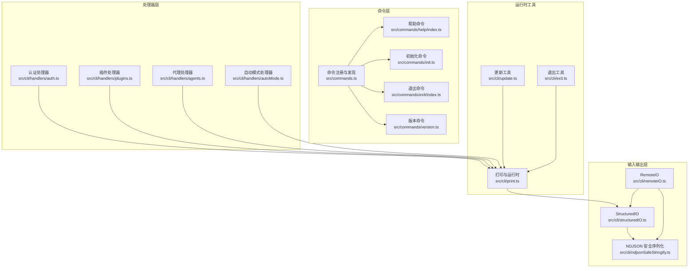
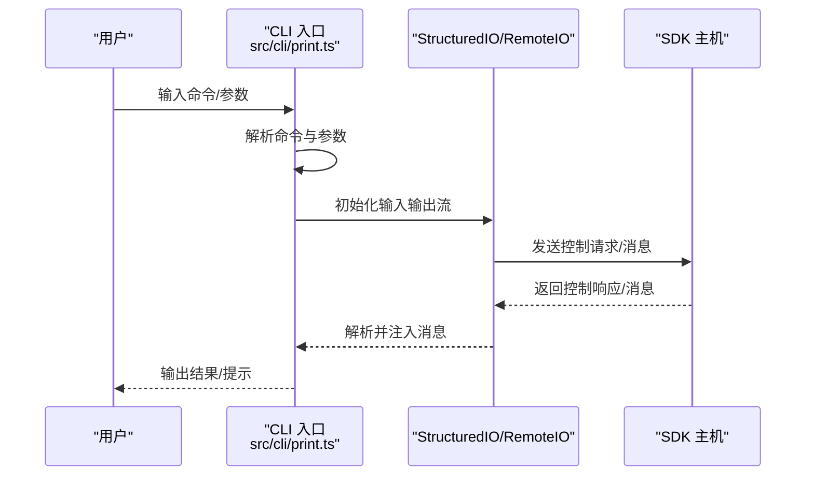
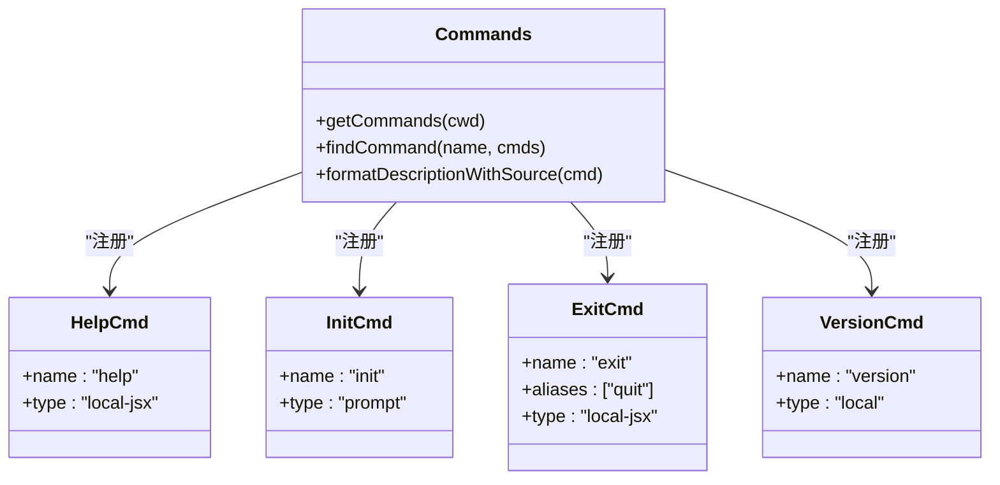
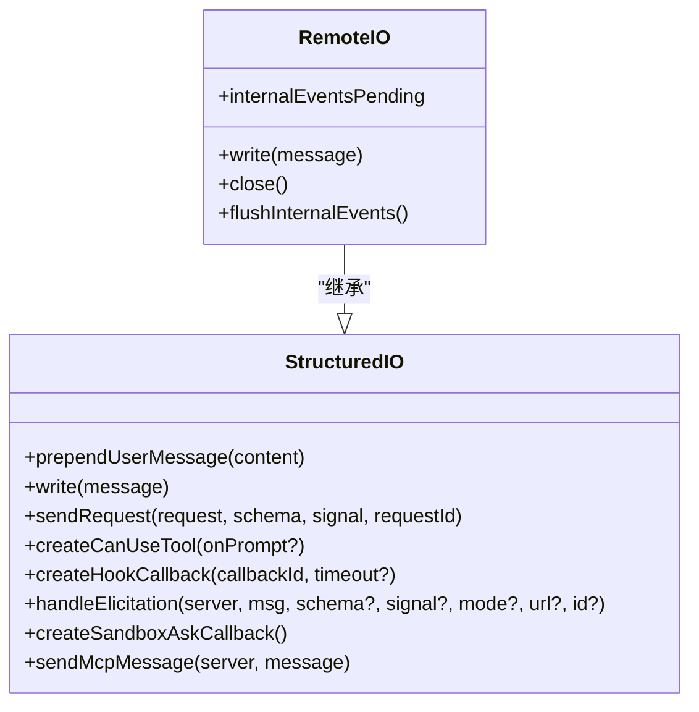
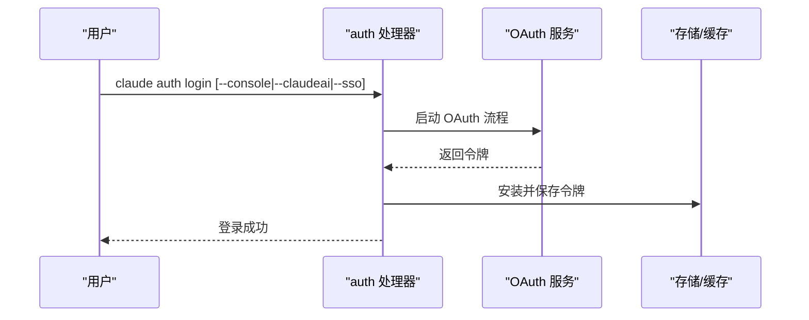
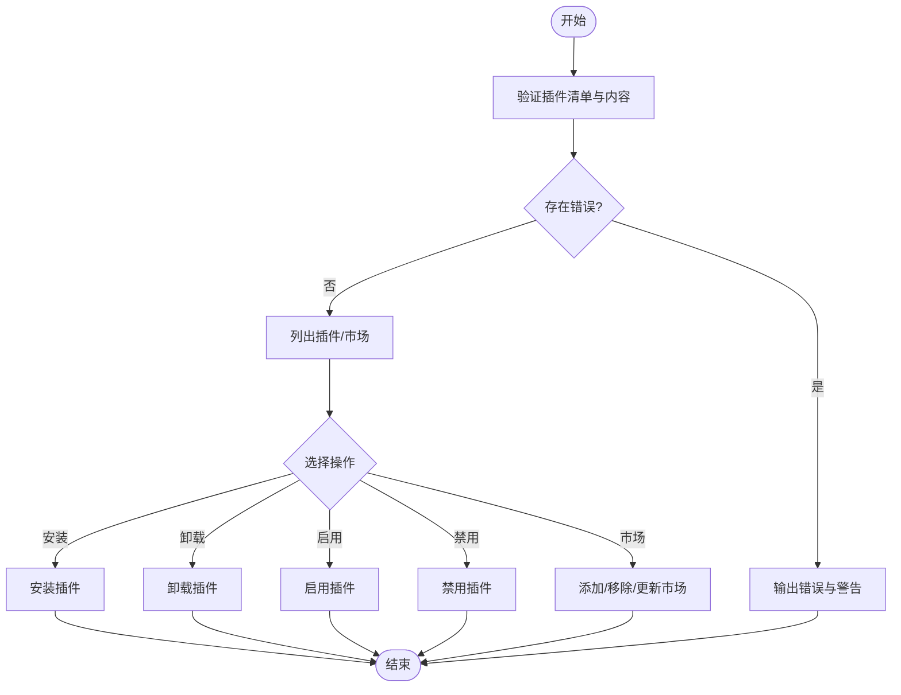
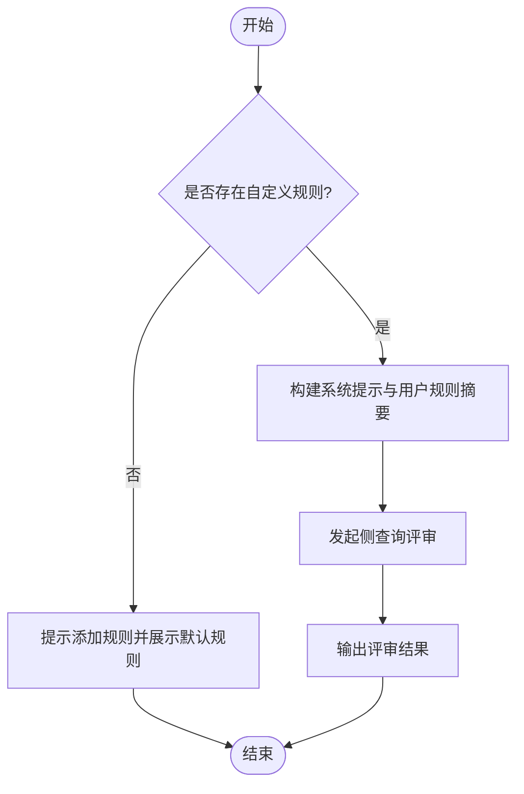
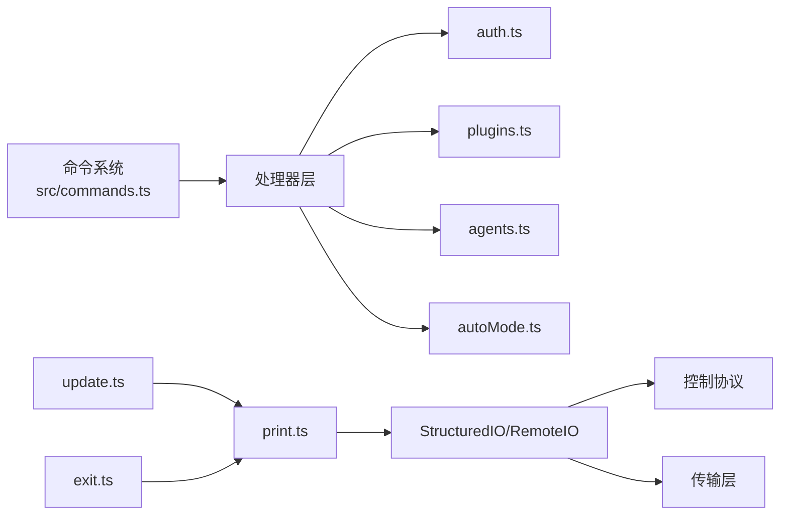

# CLI 接口

<cite>
**本文档引用的文件**
- [src/cli/print.ts](file://src/cli/print.ts)
- [src/cli/structuredIO.ts](file://src/cli/structuredIO.ts)
- [src/cli/remoteIO.ts](file://src/cli/remoteIO.ts)
- [src/cli/ndjsonSafeStringify.ts](file://src/cli/ndjsonSafeStringify.ts)
- [src/cli/exit.ts](file://src/cli/exit.ts)
- [src/cli/update.ts](file://src/cli/update.ts)
- [src/cli/handlers/auth.ts](file://src/cli/handlers/auth.ts)
- [src/cli/handlers/plugins.ts](file://src/cli/handlers/plugins.ts)
- [src/cli/handlers/agents.ts](file://src/cli/handlers/agents.ts)
- [src/cli/handlers/autoMode.ts](file://src/cli/handlers/autoMode.ts)
- [src/commands.ts](file://src/commands.ts)
- [src/commands/help/index.ts](file://src/commands/help/index.ts)
- [src/commands/version.ts](file://src/commands/version.ts)
- [src/commands/init.ts](file://src/commands/init.ts)
- [src/commands/exit/index.ts](file://src/commands/exit/index.ts)
</cite>

## 目录
1. [简介](#简介)
2. [项目结构](#项目结构)
3. [核心组件](#核心组件)
4. [架构总览](#架构总览)
5. [详细组件分析](#详细组件分析)
6. [依赖关系分析](#依赖关系分析)
7. [性能考虑](#性能考虑)
8. [故障排除指南](#故障排除指南)
9. [结论](#结论)
10. [附录](#附录)

## 简介
本文件为 Claude Code 的 CLI 接口权威文档，覆盖命令行命令、参数选项、使用示例与交互模式；详述启动参数、配置选项、输出格式与批处理能力；包含命令别名、快捷方式与批量操作；提供完整的命令语法参考、参数组合示例与错误处理指南；记录环境变量配置、配置文件格式与全局设置；并提供自动化脚本示例与 CI/CD 集成方案。

## 项目结构
CLI 子系统由以下关键模块组成：
- 命令注册与发现：集中于命令清单与动态加载机制
- 输入输出协议：StructuredIO/RemoteIO 实现 SDK 控制协议与双向流
- 命令处理器：按子命令拆分，如 auth、plugins、agents、auto-mode
- 运行时工具：打印、更新、退出等辅助模块

**图表来源**
- [src/commands.ts:1-759](file://src/commands.ts#L1-L759)
- [src/cli/structuredIO.ts:1-862](file://src/cli/structuredIO.ts#L1-L862)
- [src/cli/remoteIO.ts:1-258](file://src/cli/remoteIO.ts#L1-L258)
- [src/cli/ndjsonSafeStringify.ts:1-35](file://src/cli/ndjsonSafeStringify.ts#L1-L35)
- [src/cli/print.ts:1-800](file://src/cli/print.ts#L1-L800)
- [src/cli/handlers/auth.ts:1-333](file://src/cli/handlers/auth.ts#L1-L333)
- [src/cli/handlers/plugins.ts:1-881](file://src/cli/handlers/plugins.ts#L1-L881)
- [src/cli/handlers/agents.ts:1-73](file://src/cli/handlers/agents.ts#L1-L73)
- [src/cli/handlers/autoMode.ts:1-173](file://src/cli/handlers/autoMode.ts#L1-L173)

**章节来源**
- [src/commands.ts:1-759](file://src/commands.ts#L1-L759)
- [src/cli/structuredIO.ts:1-862](file://src/cli/structuredIO.ts#L1-L862)
- [src/cli/remoteIO.ts:1-258](file://src/cli/remoteIO.ts#L1-L258)
- [src/cli/ndjsonSafeStringify.ts:1-35](file://src/cli/ndjsonSafeStringify.ts#L1-L35)
- [src/cli/print.ts:1-800](file://src/cli/print.ts#L1-L800)

## 核心组件
- 命令系统
  - 统一命令类型与元数据，支持别名、描述、可用性与启用状态
  - 动态加载与缓存，支持技能、插件、工作流等扩展来源
- StructuredIO
  - 解析/写入 SDK 控制消息（stdin/stdout），支持权限请求、钩子回调、MCP 消息
  - 支持重复用户消息回放与控制请求取消
- RemoteIO
  - 在远程/桥接场景下通过传输层（SSE/WebSocket）与 SDK 主机通信
  - 内部事件持久化与生命周期上报
- 输出序列化
  - NDJSON 安全序列化，避免行终止符导致的消息截断
- 工具与运行时
  - 打印与运行时控制、退出工具、更新工具

**章节来源**
- [src/commands.ts:257-520](file://src/commands.ts#L257-L520)
- [src/cli/structuredIO.ts:135-774](file://src/cli/structuredIO.ts#L135-L774)
- [src/cli/remoteIO.ts:35-255](file://src/cli/remoteIO.ts#L35-L255)
- [src/cli/ndjsonSafeStringify.ts:18-32](file://src/cli/ndjsonSafeStringify.ts#L18-L32)
- [src/cli/print.ts:455-793](file://src/cli/print.ts#L455-L793)

## 架构总览
CLI 启动后，命令系统加载内置与动态命令，进入交互或非交互模式。在非交互模式下，StructuredIO/RemoteIO 负责与 SDK 主机通信，处理权限请求与内部事件；在交互模式下，命令处理器直接输出结果。

**图表来源**
- [src/cli/print.ts:455-793](file://src/cli/print.ts#L455-L793)
- [src/cli/structuredIO.ts:465-531](file://src/cli/structuredIO.ts#L465-L531)
- [src/cli/remoteIO.ts:231-242](file://src/cli/remoteIO.ts#L231-L242)

## 详细组件分析

### 命令系统与命令别名
- 命令注册
  - 内置命令集合与动态来源（技能、插件、工作流）统一注册
  - 可根据可用性与启用状态过滤命令
- 别名与查找
  - 支持别名匹配与命令查找
- 示例命令
  - help、init、exit、version 等

**图表来源**
- [src/commands.ts:257-520](file://src/commands.ts#L257-L520)
- [src/commands/help/index.ts:3-8](file://src/commands/help/index.ts#L3-L8)
- [src/commands/init.ts:226-254](file://src/commands/init.ts#L226-L254)
- [src/commands/exit/index.ts:3-9](file://src/commands/exit/index.ts#L3-L9)
- [src/commands/version.ts:12-20](file://src/commands/version.ts#L12-L20)

**章节来源**
- [src/commands.ts:257-520](file://src/commands.ts#L257-L520)
- [src/commands/help/index.ts:3-8](file://src/commands/help/index.ts#L3-L8)
- [src/commands/init.ts:226-254](file://src/commands/init.ts#L226-L254)
- [src/commands/exit/index.ts:3-9](file://src/commands/exit/index.ts#L3-L9)
- [src/commands/version.ts:12-20](file://src/commands/version.ts#L12-L20)

### StructuredIO 与 RemoteIO
- StructuredIO
  - 读取 stdin 控制消息，解析并注入到主循环
  - 发送控制请求，等待响应；支持权限请求与钩子回调
  - 支持 MCP 消息转发与沙箱网络访问请求
- RemoteIO
  - 在远程/桥接场景下建立传输连接，转发消息
  - 写入事件到 CCR v2 或传输层，支持内部事件持久化

**图表来源**
- [src/cli/structuredIO.ts:135-774](file://src/cli/structuredIO.ts#L135-L774)
- [src/cli/remoteIO.ts:35-255](file://src/cli/remoteIO.ts#L35-L255)

**章节来源**
- [src/cli/structuredIO.ts:135-774](file://src/cli/structuredIO.ts#L135-L774)
- [src/cli/remoteIO.ts:35-255](file://src/cli/remoteIO.ts#L35-L255)

### 认证与登录流程
- 登录
  - 支持 claude.ai、Console、SSO 等多种登录方式
  - 支持从环境变量使用刷新令牌直登
- 状态
  - 输出当前登录状态与认证来源
- 注销
  - 清理会话与缓存

**图表来源**
- [src/cli/handlers/auth.ts:112-230](file://src/cli/handlers/auth.ts#L112-L230)
- [src/cli/handlers/auth.ts:232-318](file://src/cli/handlers/auth.ts#L232-L318)
- [src/cli/handlers/auth.ts:321-330](file://src/cli/handlers/auth.ts#L321-L330)

**章节来源**
- [src/cli/handlers/auth.ts:112-230](file://src/cli/handlers/auth.ts#L112-L230)
- [src/cli/handlers/auth.ts:232-318](file://src/cli/handlers/auth.ts#L232-L318)
- [src/cli/handlers/auth.ts:321-330](file://src/cli/handlers/auth.ts#L321-L330)

### 插件与市场管理
- 验证
  - 验证插件清单与内容，输出错误与警告
- 列表
  - 输出已安装插件与会话内插件，支持 JSON 与可用插件列表
- 市场
  - 添加/列出/移除/更新市场源
- 安装/卸载/启用/禁用
  - 支持作用域（user/project/local）与 cowork 模式

**图表来源**
- [src/cli/handlers/plugins.ts:100-154](file://src/cli/handlers/plugins.ts#L100-L154)
- [src/cli/handlers/plugins.ts:156-444](file://src/cli/handlers/plugins.ts#L156-L444)
- [src/cli/handlers/plugins.ts:446-665](file://src/cli/handlers/plugins.ts#L446-L665)
- [src/cli/handlers/plugins.ts:667-737](file://src/cli/handlers/plugins.ts#L667-L737)
- [src/cli/handlers/plugins.ts:740-800](file://src/cli/handlers/plugins.ts#L740-L800)

**章节来源**
- [src/cli/handlers/plugins.ts:100-154](file://src/cli/handlers/plugins.ts#L100-L154)
- [src/cli/handlers/plugins.ts:156-444](file://src/cli/handlers/plugins.ts#L156-L444)
- [src/cli/handlers/plugins.ts:446-665](file://src/cli/handlers/plugins.ts#L446-L665)
- [src/cli/handlers/plugins.ts:667-737](file://src/cli/handlers/plugins.ts#L667-L737)
- [src/cli/handlers/plugins.ts:740-800](file://src/cli/handlers/plugins.ts#L740-L800)

### 自动模式规则与评审
- 默认规则
  - 输出外部默认自动模式规则
- 配置规则
  - 输出合并后的有效规则（用户设置优先）
- 规则评审
  - 使用侧查询对自定义规则进行评审

**图表来源**
- [src/cli/handlers/autoMode.ts:24-47](file://src/cli/handlers/autoMode.ts#L24-L47)
- [src/cli/handlers/autoMode.ts:73-149](file://src/cli/handlers/autoMode.ts#L73-L149)

**章节来源**
- [src/cli/handlers/autoMode.ts:24-47](file://src/cli/handlers/autoMode.ts#L24-L47)
- [src/cli/handlers/autoMode.ts:73-149](file://src/cli/handlers/autoMode.ts#L73-L149)

### 更新与诊断
- 更新检查
  - 检测安装类型、多实例、包管理器、开发构建等
  - 支持原生与 JS/NPM 两种更新路径
- 诊断
  - 输出警告与修复建议，必要时引导 doctor

**章节来源**
- [src/cli/update.ts:30-422](file://src/cli/update.ts#L30-L422)

## 依赖关系分析
- 命令系统依赖
  - 命令注册与动态加载依赖于技能、插件、工作流等扩展
- I/O 层依赖
  - StructuredIO/RemoteIO 依赖控制协议与传输层
- 处理器依赖
  - 认证、插件、代理、自动模式处理器依赖各自的服务与工具

**图表来源**
- [src/commands.ts:257-520](file://src/commands.ts#L257-L520)
- [src/cli/structuredIO.ts:135-774](file://src/cli/structuredIO.ts#L135-L774)
- [src/cli/remoteIO.ts:35-255](file://src/cli/remoteIO.ts#L35-L255)
- [src/cli/print.ts:455-793](file://src/cli/print.ts#L455-L793)
- [src/cli/update.ts:30-422](file://src/cli/update.ts#L30-L422)
- [src/cli/exit.ts:18-31](file://src/cli/exit.ts#L18-L31)

**章节来源**
- [src/commands.ts:257-520](file://src/commands.ts#L257-L520)
- [src/cli/structuredIO.ts:135-774](file://src/cli/structuredIO.ts#L135-L774)
- [src/cli/remoteIO.ts:35-255](file://src/cli/remoteIO.ts#L35-L255)
- [src/cli/print.ts:455-793](file://src/cli/print.ts#L455-L793)
- [src/cli/update.ts:30-422](file://src/cli/update.ts#L30-L422)
- [src/cli/exit.ts:18-31](file://src/cli/exit.ts#L18-L31)

## 性能考虑
- 内存与 GC
  - 非交互模式下定期触发 GC，避免内存膨胀
- 输出安全
  - NDJSON 序列化转义行终止符，确保流式解析稳定
- 权限与钩子
  - 权限请求与钩子并发执行，以最快速度决出结果
- 远程保活
  - 桥接模式下定时发送 keep_alive，避免空闲超时

**章节来源**
- [src/cli/print.ts:547-551](file://src/cli/print.ts#L547-L551)
- [src/cli/ndjsonSafeStringify.ts:18-32](file://src/cli/ndjsonSafeStringify.ts#L18-L32)
- [src/cli/structuredIO.ts:567-657](file://src/cli/structuredIO.ts#L567-L657)
- [src/cli/remoteIO.ts:184-196](file://src/cli/remoteIO.ts#L184-L196)

## 故障排除指南
- 退出工具
  - 提供统一的错误与成功退出接口，便于测试与调试
- 错误输出
  - 认证处理器与插件处理器统一错误输出与退出码
- 更新失败
  - 输出可能原因与修复建议，必要时引导 doctor

**章节来源**
- [src/cli/exit.ts:18-31](file://src/cli/exit.ts#L18-L31)
- [src/cli/handlers/auth.ts:178-186](file://src/cli/handlers/auth.ts#L178-L186)
- [src/cli/handlers/plugins.ts:146-153](file://src/cli/handlers/plugins.ts#L146-L153)
- [src/cli/update.ts:277-305](file://src/cli/update.ts#L277-L305)

## 结论
本 CLI 接口以命令系统为核心，结合 StructuredIO/RemoteIO 实现与 SDK 主机的稳定通信；通过认证、插件、代理与自动模式等处理器提供丰富的功能；配合更新与诊断工具保障运行时健康。文档提供了命令语法、参数组合、输出格式与错误处理的完整参考，并给出自动化与 CI/CD 集成建议。

## 附录

### 命令语法参考与示例
- 帮助
  - 语法：claude help
  - 说明：显示帮助与可用命令
- 初始化
  - 语法：claude init
  - 说明：生成 CLAUDE.md 与可选技能/钩子
- 退出
  - 语法：claude exit 或 claude quit
  - 说明：退出 REPL
- 版本
  - 语法：claude version
  - 说明：打印当前会话版本信息
- 认证
  - 登录：claude auth login [--console|--claudeai|--sso] [--email]
  - 状态：claude auth status [--json|--text]
  - 注销：claude auth logout
- 插件
  - 验证：claude plugin validate <manifest-path> [--cowork]
  - 列表：claude plugin list [--json|--available|--cowork]
  - 市场
    - 添加：claude plugin marketplace add <source> [--scope user|project|local] [--sparse]
    - 列表：claude plugin marketplace list [--json|--cowork]
    - 移除：claude plugin marketplace remove <name> [--cowork]
    - 更新：claude plugin marketplace update [<name>] [--cowork]
  - 安装/卸载/启用/禁用：claude plugin install/uninstall/enable/disable <plugin> [--scope user|project|local] [--cowork] [--keep-data]
- 代理
  - 查看：claude agents
- 自动模式
  - 默认规则：claude auto-mode defaults
  - 配置规则：claude auto-mode config
  - 评审：claude auto-mode critique [--model <model>]

**章节来源**
- [src/commands/help/index.ts:3-8](file://src/commands/help/index.ts#L3-L8)
- [src/commands/init.ts:226-254](file://src/commands/init.ts#L226-L254)
- [src/commands/exit/index.ts:3-9](file://src/commands/exit/index.ts#L3-L9)
- [src/commands/version.ts:12-20](file://src/commands/version.ts#L12-L20)
- [src/cli/handlers/auth.ts:112-230](file://src/cli/handlers/auth.ts#L112-L230)
- [src/cli/handlers/auth.ts:232-318](file://src/cli/handlers/auth.ts#L232-L318)
- [src/cli/handlers/auth.ts:321-330](file://src/cli/handlers/auth.ts#L321-L330)
- [src/cli/handlers/plugins.ts:100-154](file://src/cli/handlers/plugins.ts#L100-L154)
- [src/cli/handlers/plugins.ts:156-444](file://src/cli/handlers/plugins.ts#L156-L444)
- [src/cli/handlers/plugins.ts:446-665](file://src/cli/handlers/plugins.ts#L446-L665)
- [src/cli/handlers/plugins.ts:667-737](file://src/cli/handlers/plugins.ts#L667-L737)
- [src/cli/handlers/plugins.ts:740-800](file://src/cli/handlers/plugins.ts#L740-L800)
- [src/cli/handlers/agents.ts:32-70](file://src/cli/handlers/agents.ts#L32-L70)
- [src/cli/handlers/autoMode.ts:24-47](file://src/cli/handlers/autoMode.ts#L24-L47)
- [src/cli/handlers/autoMode.ts:73-149](file://src/cli/handlers/autoMode.ts#L73-L149)

### 参数组合示例
- 登录组合
  - claude auth login --console --email user@example.com
  - claude auth login --claudeai
  - claude auth login --sso
- 插件作用域
  - claude plugin install my-plugin --scope user
  - claude plugin enable my-plugin --scope project
- 市场稀疏路径
  - claude plugin marketplace add owner/repo --sparse path1 path2 --scope user

**章节来源**
- [src/cli/handlers/auth.ts:112-230](file://src/cli/handlers/auth.ts#L112-L230)
- [src/cli/handlers/plugins.ts:667-737](file://src/cli/handlers/plugins.ts#L667-L737)
- [src/cli/handlers/plugins.ts:446-524](file://src/cli/handlers/plugins.ts#L446-L524)

### 输出格式与交互模式
- 输出格式
  - 文本：默认输出人类可读文本
  - JSON：部分命令支持 --json 输出结构化数据
- 交互模式
  - REPL 交互与非交互批处理模式
  - 远程/桥接模式通过 RemoteIO 与 SDK 主机通信

**章节来源**
- [src/cli/handlers/plugins.ts:195-347](file://src/cli/handlers/plugins.ts#L195-L347)
- [src/cli/remoteIO.ts:231-242](file://src/cli/remoteIO.ts#L231-L242)

### 环境变量与配置
- 环境变量
  - CLAUDE_CODE_OAUTH_REFRESH_TOKEN：使用刷新令牌直登
  - CLAUDE_CODE_OAUTH_SCOPES：刷新令牌所需的作用域
  - CLAUDE_CODE_ENVIRONMENT_RUNNER_VERSION：环境运行器版本
  - CLAUDE_CODE_USE_CCR_V2：启用 CCR v2
  - CLAUDE_CODE_ENVIRONMENT_KIND：环境种类（如 bridge）
  - USER_TYPE：用户类型（如 ant）
- 配置文件
  - 全局配置与安装方法记录
  - 市场与插件配置

**章节来源**
- [src/cli/handlers/auth.ts:140-186](file://src/cli/handlers/auth.ts#L140-L186)
- [src/cli/remoteIO.ts:65-85](file://src/cli/remoteIO.ts#L65-L85)
- [src/cli/update.ts:76-106](file://src/cli/update.ts#L76-L106)

### 自动化脚本与 CI/CD 集成
- 自动化脚本
  - 使用非交互模式与 --print 输出，结合管道与 JSON 解析
  - 使用 --output-format=stream-json 与 --verbose 进行流式输出
- CI/CD 集成
  - 在流水线中调用 claude auth login（推荐使用刷新令牌与作用域）
  - 使用 claude plugin list --json 获取插件状态
  - 使用 claude update 检查并更新 CLI 版本

**章节来源**
- [src/cli/print.ts:587-793](file://src/cli/print.ts#L587-L793)
- [src/cli/handlers/auth.ts:140-186](file://src/cli/handlers/auth.ts#L140-L186)
- [src/cli/handlers/plugins.ts:195-347](file://src/cli/handlers/plugins.ts#L195-L347)
- [src/cli/update.ts:30-422](file://src/cli/update.ts#L30-L422)