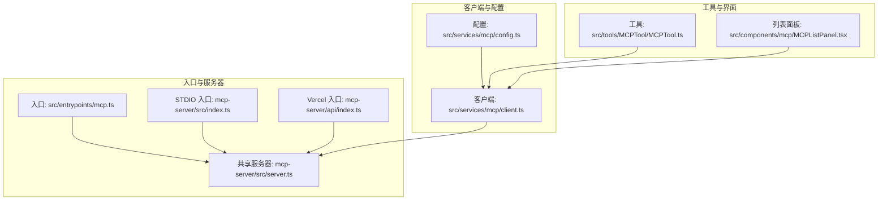
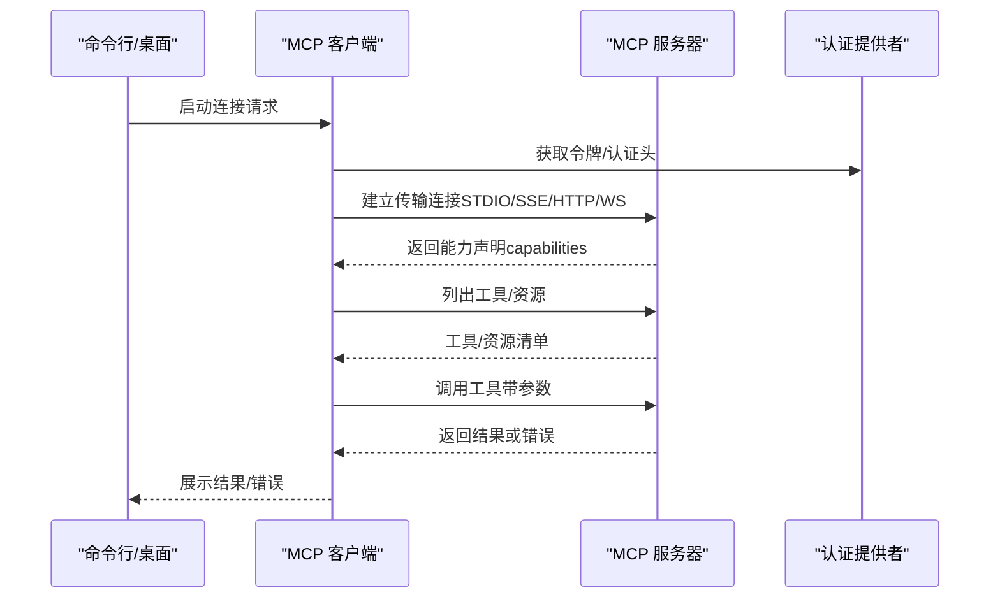
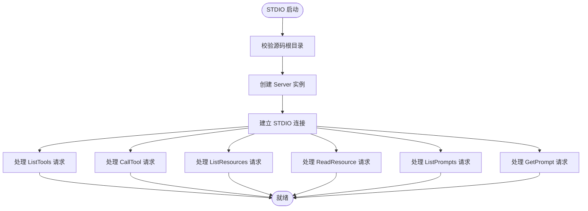
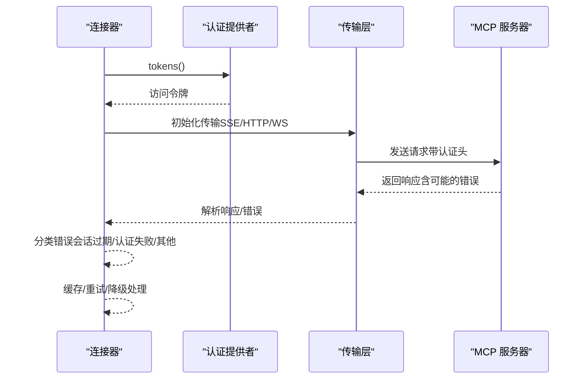
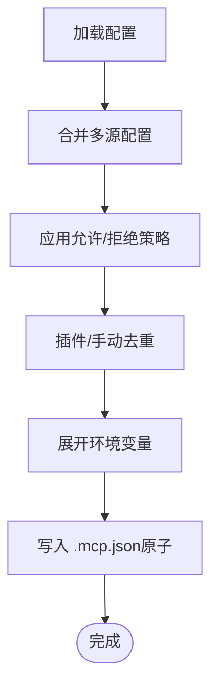
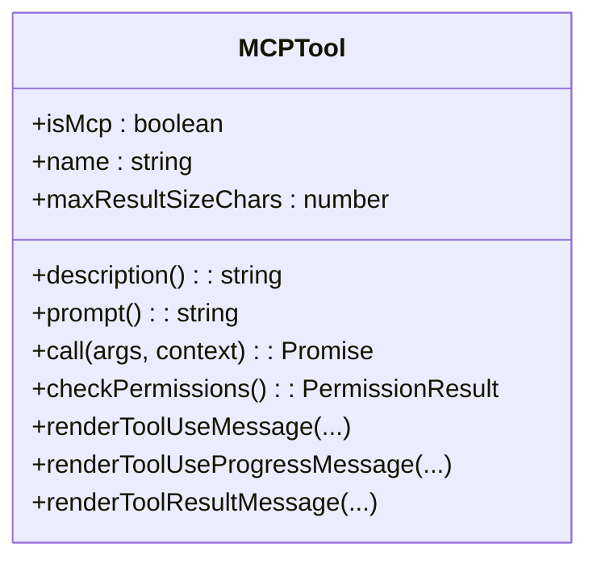
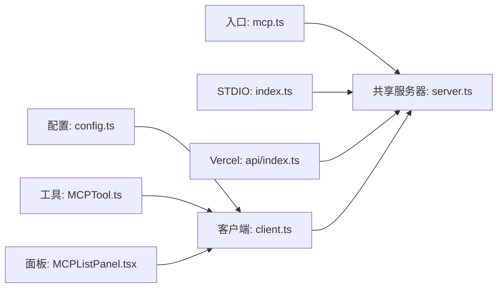

# MCP API

<cite>
**本文引用的文件**
- [mcp.ts](file://src/entrypoints/mcp.ts)
- [index.ts](file://mcp-server/src/index.ts)
- [server.ts](file://mcp-server/src/server.ts)
- [client.ts](file://src/services/mcp/client.ts)
- [config.ts](file://src/services/mcp/config.ts)
- [MCPTool.ts](file://src/tools/MCPTool/MCPTool.ts)
- [MCPListPanel.tsx](file://src/components/mcp/MCPListPanel.tsx)
- [api/index.ts](file://mcp-server/api/index.ts)
</cite>

## 目录
1. [简介](#简介)
2. [项目结构](#项目结构)
3. [核心组件](#核心组件)
4. [架构总览](#架构总览)
5. [详细组件分析](#详细组件分析)
6. [依赖关系分析](#依赖关系分析)
7. [性能考虑](#性能考虑)
8. [故障排除指南](#故障排除指南)
9. [结论](#结论)
10. [附录](#附录)

## 简介
本文件系统性梳理 Claude Code 中的 MCP（Model Context Protocol）API 实现与使用方式，覆盖协议规范、消息类型、服务器与客户端集成、工具注册、认证与错误处理、性能与安全配置、以及故障排除与扩展开发建议。文档以仓库中现有实现为依据，结合 UI 组件与服务层逻辑，帮助开发者快速理解并集成 MCP。

## 项目结构
围绕 MCP 的相关模块主要分布在以下位置：
- 入口与本地服务器：src/entrypoints/mcp.ts、mcp-server/src/index.ts、mcp-server/src/server.ts、mcp-server/api/index.ts
- 客户端连接与管理：src/services/mcp/client.ts、src/services/mcp/config.ts
- 工具与 UI：src/tools/MCPTool/MCPTool.ts、src/components/mcp/MCPListPanel.tsx

**图表来源**
- [mcp.ts:1-198](file://src/entrypoints/mcp.ts#L1-L198)
- [index.ts:1-25](file://mcp-server/src/index.ts#L1-L25)
- [server.ts:1-959](file://mcp-server/src/server.ts#L1-L959)
- [client.ts:1-3350](file://src/services/mcp/client.ts#L1-L3350)
- [config.ts:1-1580](file://src/services/mcp/config.ts#L1-L1580)
- [MCPTool.ts:1-79](file://src/tools/MCPTool/MCPTool.ts#L1-L79)
- [MCPListPanel.tsx:1-505](file://src/components/mcp/MCPListPanel.tsx#L1-L505)

**章节来源**
- [mcp.ts:1-198](file://src/entrypoints/mcp.ts#L1-L198)
- [index.ts:1-25](file://mcp-server/src/index.ts#L1-L25)
- [server.ts:1-959](file://mcp-server/src/server.ts#L1-L959)

## 核心组件
- MCP 本地服务器（STDIO）：通过 STDIO 传输启动，暴露工具与资源能力，支持列出工具、调用工具、读取资源等。
- MCP 探索型服务器：在共享服务器中提供工具清单、资源清单、提示词模板等，用于探索与学习 Claude Code 源码结构。
- MCP 客户端：负责连接远程或本地 MCP 服务器，管理认证、超时、批量连接、会话过期检测、错误分类与重试策略。
- MCP 配置与策略：解析与合并多源配置，支持企业级允许/拒绝策略、去重、签名匹配、环境变量展开。
- MCP 工具封装：将外部 MCP 工具包装为 Claude Code 内部工具，统一权限与 UI 渲染。
- MCP 列表面板：展示已配置与已连接的 MCP 服务器状态，支持导航与选择。

**章节来源**
- [server.ts:148-648](file://mcp-server/src/server.ts#L148-L648)
- [client.ts:1-3350](file://src/services/mcp/client.ts#L1-L3350)
- [config.ts:1-1580](file://src/services/mcp/config.ts#L1-L1580)
- [MCPTool.ts:1-79](file://src/tools/MCPTool/MCPTool.ts#L1-L79)
- [MCPListPanel.tsx:1-505](file://src/components/mcp/MCPListPanel.tsx#L1-L505)

## 架构总览
下图展示了 MCP 服务器与客户端的整体交互：客户端通过不同传输（STDIO、SSE、HTTP、WebSocket）连接到 MCP 服务器；服务器提供工具与资源能力；客户端负责认证、超时、批量连接与错误处理。

**图表来源**
- [client.ts:595-800](file://src/services/mcp/client.ts#L595-L800)
- [server.ts:148-648](file://mcp-server/src/server.ts#L148-L648)

## 详细组件分析

### 本地 MCP 服务器（STDIO）
- 启动入口：STDIO 入口负责验证源码根目录、创建服务器实例并通过 STDIO 连接。
- 能力与处理：
  - 列出工具：返回工具清单（名称、描述、输入模式）。
  - 调用工具：根据名称路由到具体工具实现，执行并返回文本内容。
  - 资源与提示词：提供资源清单、资源模板、提示词清单与模板。
- 安全与路径控制：严格限制相对路径在源码根目录内，防止路径穿越。

**图表来源**
- [index.ts:13-24](file://mcp-server/src/index.ts#L13-L24)
- [server.ts:148-648](file://mcp-server/src/server.ts#L148-L648)

**章节来源**
- [index.ts:1-25](file://mcp-server/src/index.ts#L1-L25)
- [server.ts:1-959](file://mcp-server/src/server.ts#L1-L959)

### MCP 客户端与连接管理
- 传输支持：STDIO、SSE、HTTP、WebSocket、IDE 特定传输（sse-ide、ws-ide）、SDK 占位（sdk）。
- 认证与授权：支持基于 OAuth 的认证提供者、代理与 mTLS 配置、Claude.ai 代理通道。
- 超时与请求控制：对非 GET 请求设置固定超时，保证每个请求独立超时信号；确保 Streamable HTTP 规范所需的 Accept 头。
- 批量连接与缓存：按服务器类型统计与批处理连接，连接结果缓存与去重。
- 错误处理：区分“会话过期”（HTTP 404 + JSON-RPC -32001）、认证失败、网络错误等，并进行相应处理与重试。

**图表来源**
- [client.ts:595-800](file://src/services/mcp/client.ts#L595-L800)
- [client.ts:1-3350](file://src/services/mcp/client.ts#L1-L3350)

**章节来源**
- [client.ts:1-3350](file://src/services/mcp/client.ts#L1-L3350)

### MCP 配置与策略
- 配置来源：项目级 .mcp.json、用户全局配置、本地项目配置、动态注入、企业策略文件。
- 策略与去重：支持企业级允许/拒绝策略，按名称、命令数组、URL 模式匹配；插件与手动配置去重，优先级明确。
- 环境变量展开：对命令、URL、头部等进行环境变量展开，缺失变量可被报告。
- 写入与原子更新：.mcp.json 写入采用临时文件 + 原子重命名，保留文件权限。

**图表来源**
- [config.ts:1-1580](file://src/services/mcp/config.ts#L1-L1580)

**章节来源**
- [config.ts:1-1580](file://src/services/mcp/config.ts#L1-L1580)

### MCP 工具封装与 UI
- 工具定义：MCPTool 作为通用工具封装，输入输出模式由外部 MCP 服务器定义，内部工具负责渲染与权限。
- UI 渲染：提供工具使用消息、进度消息与结果消息的渲染函数，便于在终端/界面中展示。

**图表来源**
- [MCPTool.ts:1-79](file://src/tools/MCPTool/MCPTool.ts#L1-L79)

**章节来源**
- [MCPTool.ts:1-79](file://src/tools/MCPTool/MCPTool.ts#L1-L79)

### MCP 列表面板与状态展示
- 面板功能：按作用域（项目/用户/本地/企业/内置）分组展示 MCP 服务器，显示连接状态（已禁用/已连接/连接中/需要认证/失败），支持导航与选择。
- 信息来源：来自客户端连接状态与配置，支持调试模式下的错误日志提示与帮助链接。

**章节来源**
- [MCPListPanel.tsx:1-505](file://src/components/mcp/MCPListPanel.tsx#L1-L505)

## 依赖关系分析
- 入口与服务器：入口文件与 STDIO 入口均委托给共享服务器模块，避免重复实现。
- 客户端依赖：客户端依赖 MCP SDK 的传输层与类型定义，同时集成认证、代理、mTLS、超时控制与错误分类。
- 配置依赖：配置模块依赖设置系统、插件系统与企业策略，提供去重与签名匹配能力。
- 工具与 UI：工具封装依赖渲染函数与权限模型，UI 面板依赖客户端状态与配置。

**图表来源**
- [mcp.ts:1-198](file://src/entrypoints/mcp.ts#L1-L198)
- [index.ts:1-25](file://mcp-server/src/index.ts#L1-L25)
- [server.ts:1-959](file://mcp-server/src/server.ts#L1-L959)
- [client.ts:1-3350](file://src/services/mcp/client.ts#L1-L3350)
- [config.ts:1-1580](file://src/services/mcp/config.ts#L1-L1580)
- [MCPTool.ts:1-79](file://src/tools/MCPTool/MCPTool.ts#L1-L79)
- [MCPListPanel.tsx:1-505](file://src/components/mcp/MCPListPanel.tsx#L1-L505)

**章节来源**
- [mcp.ts:1-198](file://src/entrypoints/mcp.ts#L1-L198)
- [index.ts:1-25](file://mcp-server/src/index.ts#L1-L25)
- [server.ts:1-959](file://mcp-server/src/server.ts#L1-L959)
- [client.ts:1-3350](file://src/services/mcp/client.ts#L1-L3350)
- [config.ts:1-1580](file://src/services/mcp/config.ts#L1-L1580)
- [MCPTool.ts:1-79](file://src/tools/MCPTool/MCPTool.ts#L1-L79)
- [MCPListPanel.tsx:1-505](file://src/components/mcp/MCPListPanel.tsx#L1-L505)

## 性能考虑
- 连接批处理：批量连接数量可通过环境变量配置，避免并发过多导致资源争用。
- 请求超时：对非 GET 请求设置固定超时，避免单次超时信号复用导致后续请求立即失败。
- 缓存与去重：连接结果与认证状态缓存，减少重复认证与连接开销；插件与手动配置去重，避免重复连接同一后端。
- 输出截断：对长输出进行截断与提示，避免超大响应影响性能与稳定性。

**章节来源**
- [client.ts:552-561](file://src/services/mcp/client.ts#L552-L561)
- [client.ts:463-550](file://src/services/mcp/client.ts#L463-L550)
- [client.ts:60-120](file://src/services/mcp/client.ts#L60-L120)

## 故障排除指南
- 认证失败：当服务器返回 401 或需要认证时，客户端会记录并缓存“需要认证”状态，随后通过认证提供者刷新令牌或引导用户完成认证。
- 会话过期：识别 HTTP 404 + JSON-RPC -32001 的组合，清理连接缓存并要求重新建立连接。
- 网络与代理：检查代理配置与 mTLS 设置，确保 WebSocket/HTTP/SSE 传输可用。
- 超时问题：确认请求超时设置与网络状况，必要时调整超时阈值。
- 日志与调试：启用调试模式查看详细日志，面板提供帮助链接与错误提示。

**章节来源**
- [client.ts:193-206](file://src/services/mcp/client.ts#L193-L206)
- [client.ts:340-361](file://src/services/mcp/client.ts#L340-L361)
- [client.ts:463-550](file://src/services/mcp/client.ts#L463-L550)
- [MCPListPanel.tsx:425-431](file://src/components/mcp/MCPListPanel.tsx#L425-L431)

## 结论
本仓库中的 MCP 实现覆盖了从本地 STDIO 服务器、远程 HTTP/WebSocket 服务器到客户端连接、认证、错误处理与配置策略的完整链路。通过统一的工具封装与 UI 面板，开发者可以便捷地集成与管理 MCP 服务器，满足本地探索与远程协作场景。

## 附录

### MCP 协议要点与消息类型
- 能力声明：tools、resources、prompts
- 请求类型：ListTools、CallTool、ListResources、ReadResource、ListResourceTemplates、ListPrompts、GetPrompt
- 响应类型：ListToolsResult、CallToolResult、ListResourcesResult、ListPromptsResult、GetPromptResult
- 传输：STDIO、SSE、HTTP、WebSocket、IDE 专用传输

**章节来源**
- [server.ts:148-648](file://mcp-server/src/server.ts#L148-L648)
- [client.ts:1-3350](file://src/services/mcp/client.ts#L1-L3350)

### 服务器配置与集成步骤
- 本地服务器（STDIO）：通过 STDIO 入口启动，自动连接并暴露工具与资源。
- 远程服务器（HTTP/WebSocket）：在配置中添加服务器条目，指定类型、URL、认证头与代理设置。
- 插件与企业策略：通过插件注入服务器，或使用企业策略文件控制允许/拒绝范围。

**章节来源**
- [index.ts:1-25](file://mcp-server/src/index.ts#L1-L25)
- [config.ts:1-1580](file://src/services/mcp/config.ts#L1-L1580)

### 工具注册与调用流程
- 工具注册：服务器通过 ListTools 返回工具清单；客户端可进一步查询工具详情与权限。
- 工具调用：客户端发送 CallTool 请求，服务器执行并返回文本内容；错误结果携带元数据以便上层处理。

**章节来源**
- [server.ts:257-648](file://mcp-server/src/server.ts#L257-L648)
- [client.ts:1-3350](file://src/services/mcp/client.ts#L1-L3350)

### 认证机制与安全配置
- 认证提供者：支持 OAuth 令牌与 Claude.ai 代理通道，自动刷新与重试。
- 传输安全：支持 mTLS、代理与自定义头部；确保 Streamable HTTP 规范的 Accept 头。
- 会话管理：识别会话过期并清理缓存，要求重新建立连接。

**章节来源**
- [client.ts:1-3350](file://src/services/mcp/client.ts#L1-L3350)
- [client.ts:463-550](file://src/services/mcp/client.ts#L463-L550)

### 错误处理与调试
- 错误分类：会话过期、认证失败、网络错误、工具错误等。
- 调试工具：调试模式下显示错误日志，面板提供帮助链接与状态提示。

**章节来源**
- [client.ts:193-206](file://src/services/mcp/client.ts#L193-L206)
- [MCPListPanel.tsx:425-431](file://src/components/mcp/MCPListPanel.tsx#L425-L431)