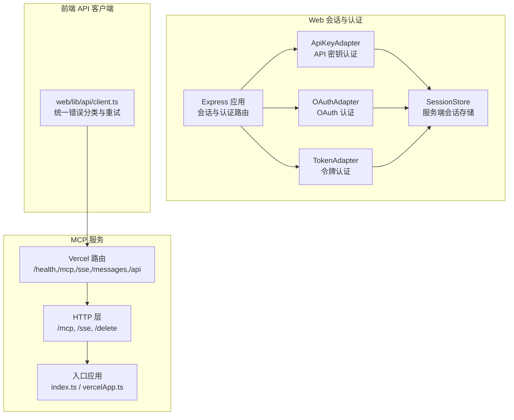
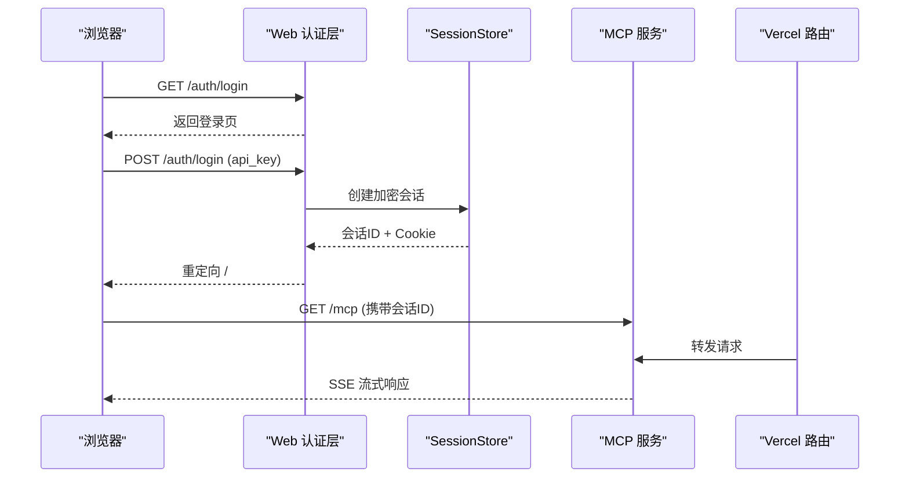
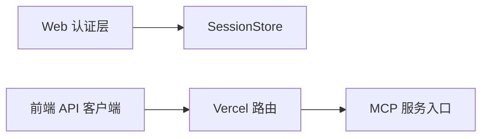

# REST API

<cite>
**本文引用的文件**
- [apikey-auth.ts](file://src/server/web/auth/apikey-auth.ts)
- [adapter.ts](file://src/server/web/auth/adapter.ts)
- [oauth-auth.ts](file://src/server/web/auth/oauth-auth.ts)
- [token-auth.ts](file://src/server/web/auth/token-auth.ts)
- [pty-server.ts](file://src/server/web/pty-server.ts)
- [http.ts](file://mcp-server/src/http.ts)
- [index.ts](file://mcp-server/api/index.ts)
- [vercelApp.ts](file://mcp-server/api/vercelApp.ts)
- [client.ts](file://web/lib/api/client.ts)
- [filesApi.ts](file://src/services/api/filesApi.ts)
- [claude.ts](file://src/services/api/claude.ts)
- [errors.ts](file://src/services/api/errors.ts)
- [errorUtils.ts](file://src/services/api/errorUtils.ts)
- [claudeAiLimits.ts](file://src/services/claudeAiLimits.ts)
- [vercel.json](file://vercel.json)
</cite>

## 目录
1. [简介](#简介)
2. [项目结构](#项目结构)
3. [核心组件](#核心组件)
4. [架构总览](#架构总览)
5. [详细组件分析](#详细组件分析)
6. [依赖关系分析](#依赖关系分析)
7. [性能考量](#性能考量)
8. [故障排查指南](#故障排查指南)
9. [结论](#结论)
10. [附录](#附录)

## 简介
本文件为 Claude Code 的 REST API 文档，覆盖会话管理、文件操作、用户认证与系统配置相关接口。内容基于仓库中的服务端与前端 API 客户端实现进行整理，重点说明：
- 所有 HTTP 端点：方法、路径、请求参数、响应格式与状态码
- 认证机制：API 密钥、OAuth 令牌、会话 Cookie
- 错误处理模式与速率限制策略
- 请求/响应示例（成功与失败）
- 数据校验规则、安全考虑与最佳实践
- 客户端集成指南与常见用例

## 项目结构
本项目包含两类主要 API 接口：
- Web 会话与认证服务：基于 Express 的登录、登出、会话存储与中间件
- MCP 服务（模型上下文协议）：Vercel 部署的 Node 服务，提供健康检查、消息流、SSE 等端点

图表来源
- [apikey-auth.ts:56-107](file://src/server/web/auth/apikey-auth.ts#L56-L107)
- [adapter.ts:79-221](file://src/server/web/auth/adapter.ts#L79-L221)
- [http.ts:83-121](file://mcp-server/src/http.ts#L83-L121)
- [index.ts](file://mcp-server/api/index.ts)
- [vercelApp.ts](file://mcp-server/api/vercelApp.ts)
- [client.ts:64-90](file://web/lib/api/client.ts#L64-L90)

章节来源
- [apikey-auth.ts:56-107](file://src/server/web/auth/apikey-auth.ts#L56-L107)
- [adapter.ts:79-221](file://src/server/web/auth/adapter.ts#L79-L221)
- [http.ts:83-121](file://mcp-server/src/http.ts#L83-L121)
- [index.ts](file://mcp-server/api/index.ts)
- [vercelApp.ts](file://mcp-server/api/vercelApp.ts)
- [client.ts:64-90](file://web/lib/api/client.ts#L64-L90)

## 核心组件
- 会话与认证适配器
  - ApiKeyAdapter：基于浏览器表单提交的 API 密钥登录，加密存储于服务端会话
  - OAuthAdapter：OAuth 登录流程与回调处理
  - TokenAdapter：基于令牌的认证（如 Bearer）
  - SessionStore：服务端会话存储，支持 AES-256-GCM 加密敏感字段，HMAC 签名 Cookie
- MCP 服务
  - /mcp：SSE 流式传输端点
  - /sse：兼容旧版 SSE
  - /messages：消息通道
  - /api：通用 API 入口
  - /health：健康检查
- 前端 API 客户端
  - 统一错误类型分类（认证、未找到、速率限制、服务器等），支持 Retry-After 解析

章节来源
- [apikey-auth.ts:24-122](file://src/server/web/auth/apikey-auth.ts#L24-L122)
- [adapter.ts:79-221](file://src/server/web/auth/adapter.ts#L79-L221)
- [http.ts:83-121](file://mcp-server/src/http.ts#L83-L121)
- [client.ts:64-90](file://web/lib/api/client.ts#L64-L90)

## 架构总览
下图展示从浏览器到 MCP 服务与认证系统的交互路径。

图表来源
- [apikey-auth.ts:59-98](file://src/server/web/auth/apikey-auth.ts#L59-L98)
- [adapter.ts:171-183](file://src/server/web/auth/adapter.ts#L171-L183)
- [http.ts:83-92](file://mcp-server/src/http.ts#L83-L92)
- [vercel.json:12-19](file://vercel.json#L12-L19)

## 详细组件分析

### 会话与认证接口
- 登录
  - 方法与路径：GET /auth/login；POST /auth/login
  - 请求体：表单字段 api_key（必填，需以 sk-ant- 开头）
  - 成功响应：设置 HttpOnly Cookie cc_session，重定向 next 或根路径
  - 失败响应：返回登录页 HTML，并在页面内提示错误
  - 状态码：200（成功）、400（格式错误）、3xx（重定向）
- 登出
  - 方法与路径：POST /auth/logout
  - 行为：销毁会话并清除 Cookie，重定向至 /auth/login
  - 状态码：302（重定向）
- 中间件鉴权
  - requireAuth：对浏览器客户端返回 401 JSON 或重定向 /auth/login；对 API 客户端返回 401 JSON

章节来源
- [apikey-auth.ts:59-106](file://src/server/web/auth/apikey-auth.ts#L59-L106)
- [adapter.ts:109-122](file://src/server/web/auth/adapter.ts#L109-L122)

### 文件操作接口（Files API）
- 下载文件内容
  - 方法与路径：GET /v1/files/{file_id}/content
  - 认证：Authorization: Bearer {oauth_token}
  - 请求头：anthropic-version、anthropic-beta（含 files-api-2025-04-14,oauth-2025-04-20）
  - 成功响应：二进制字节流（文件内容）
  - 失败响应：401（无效或缺失密钥）、403（访问被拒绝）、404（文件不存在）
  - 状态码：200（成功）、401/403/404（错误）
- 列举会话创建后的文件
  - 方法与路径：GET /v1/files?after_created_at={timestamp}[&after_id={cursor}]
  - 分页：has_more 为真时使用 after_id 游标继续
  - 成功响应：文件元数据数组（filename、id、size_bytes）
  - 失败响应：401/403
  - 状态码：200（成功）、401/403（错误）
- 上传文件（BYOC 模式）
  - 方法与路径：POST /v1/files
  - 请求体：multipart/form-data，包含 file 与 purpose=user_data
  - 成功响应：包含 id、size_bytes
  - 失败响应：401/403/413（过大）
  - 状态码：200/201（成功）、401/403/413（错误）

章节来源
- [filesApi.ts:132-180](file://src/services/api/filesApi.ts#L132-L180)
- [filesApi.ts:617-709](file://src/services/api/filesApi.ts#L617-L709)
- [filesApi.ts:378-552](file://src/services/api/filesApi.ts#L378-L552)

### MCP 服务端点
- 健康检查
  - 方法与路径：GET /health
  - 响应：200 OK
- SSE 会话
  - 方法与路径：GET /mcp
  - 请求头：mcp-session-id（必填）
  - 成功响应：SSE 流
  - 失败响应：400（无效或缺失会话ID）
  - 状态码：200（成功）、400（错误）
- 会话清理
  - 方法与路径：DELETE /mcp
  - 请求头：mcp-session-id（可选）
  - 成功响应：{"ok": true}
  - 状态码：200（成功）
- 旧版 SSE（兼容）
  - 方法与路径：GET /sse
  - 行为：启动 SSE 服务器并建立连接
  - 状态码：200（成功）

章节来源
- [http.ts:83-121](file://mcp-server/src/http.ts#L83-L121)
- [vercel.json:12-19](file://vercel.json#L12-L19)

### 前端 API 客户端错误处理
- 错误类型分类
  - 认证错误：401
  - 未找到：404
  - 速率限制：429（解析 Retry-After）
  - 服务器错误：>=500
  - 其他：客户端错误
- 错误对象属性
  - status、message、type（auth/not_found/rate_limit/server/client）、retryAfterMs（可选）

章节来源
- [client.ts:64-90](file://web/lib/api/client.ts#L64-L90)

### 认证机制与安全
- API 密钥认证（ApiKeyAdapter）
  - 用户通过表单提交 API 密钥，服务端派生用户 ID 并加密存储于会话
  - 登录成功后设置 HttpOnly Cookie，避免 XSS 泄露
- OAuth 认证（OAuthAdapter）
  - 支持授权码流程与回调，校验 state 防止 CSRF
- 令牌认证（TokenAdapter）
  - 支持 Bearer 令牌
- 会话存储（SessionStore）
  - 使用 AES-256-GCM 加密敏感信息，HMAC 签名 Cookie，定时清理过期会话

章节来源
- [apikey-auth.ts:24-122](file://src/server/web/auth/apikey-auth.ts#L24-L122)
- [adapter.ts:79-221](file://src/server/web/auth/adapter.ts#L79-L221)

### 速率限制与配额
- 早期预警与显示名称
  - 提供五小时与七日窗口的早期预警配置与显示名称映射
- 限额类型与阈值
  - 包含五小时、七日、Opus、Sonnet、超量等类型
- 客户端侧处理
  - 429 响应时解析 Retry-After 并转换为毫秒级重试时间

章节来源
- [claudeAiLimits.ts:43-89](file://src/services/claudeAiLimits.ts#L43-L89)
- [client.ts:84-87](file://web/lib/api/client.ts#L84-L87)

## 依赖关系分析
- Web 认证层依赖 SessionStore 进行会话持久化与加密存储
- MCP 服务通过 Vercel 路由统一转发到入口应用
- 前端 API 客户端依赖 Vercel 路由提供的端点

图表来源
- [adapter.ts:79-221](file://src/server/web/auth/adapter.ts#L79-L221)
- [vercel.json:12-19](file://vercel.json#L12-L19)
- [client.ts:64-90](file://web/lib/api/client.ts#L64-L90)

章节来源
- [adapter.ts:79-221](file://src/server/web/auth/adapter.ts#L79-L221)
- [vercel.json:12-19](file://vercel.json#L12-L19)
- [client.ts:64-90](file://web/lib/api/client.ts#L64-L90)

## 性能考量
- 文件下载/上传采用指数回退与并发限制，避免瞬时峰值
- SSE 流式传输减少长连接开销
- 会话存储定期清理过期项，降低内存占用

## 故障排查指南
- 认证失败
  - API 密钥格式不正确：确认以 sk-ant- 开头
  - OAuth 回调 state 不匹配：检查 state 参数一致性
- 速率限制
  - 429 响应：根据 Retry-After 等待后重试
  - 早期预警：关注配额窗口与利用率
- 文件操作
  - 401/403：检查 OAuth 令牌有效性与权限
  - 413：文件超过最大大小限制
- 错误分类
  - 前端客户端将 401/404/429/5xx 映射为不同错误类型，便于 UI 反馈

章节来源
- [apikey-auth.ts:72-81](file://src/server/web/auth/apikey-auth.ts#L72-L81)
- [oauth-auth.ts](file://src/server/web/auth/oauth-auth.ts)
- [client.ts:64-90](file://web/lib/api/client.ts#L64-L90)
- [claudeAiLimits.ts:43-89](file://src/services/claudeAiLimits.ts#L43-L89)
- [filesApi.ts:162-170](file://src/services/api/filesApi.ts#L162-L170)
- [filesApi.ts:491-517](file://src/services/api/filesApi.ts#L491-L517)

## 结论
本 REST API 文档梳理了 Claude Code 的认证、会话与 MCP 服务端点，明确了请求/响应规范、错误处理与速率限制策略。建议在生产环境中：
- 使用 HTTPS 与 HttpOnly Cookie 保护会话
- 对外部输入进行严格校验与路径规范化
- 合理利用 SSE 与指数回退提升稳定性
- 基于 Retry-After 实现幂等重试

## 附录

### 常见用例与集成步骤
- 使用 API 密钥登录并获取会话
  - 步骤：访问 /auth/login，提交 api_key，接收 cc_session Cookie
  - 参考：[apikey-auth.ts:59-98](file://src/server/web/auth/apikey-auth.ts#L59-L98)
- 通过 OAuth 获取令牌并发起 MCP 会话
  - 步骤：完成授权码流程，回调校验 state，随后访问 /mcp
  - 参考：[oauth-auth.ts](file://src/server/web/auth/oauth-auth.ts)
- 下载/上传文件
  - 步骤：使用 OAuth 令牌访问 /v1/files/{file_id}/content 或 /v1/files
  - 参考：[filesApi.ts:132-180](file://src/services/api/filesApi.ts#L132-L180), [filesApi.ts:378-552](file://src/services/api/filesApi.ts#L378-L552)
- 前端错误处理
  - 步骤：捕获 ApiError，按 type 与 retryAfterMs 控制 UI 与重试
  - 参考：[client.ts:64-90](file://web/lib/api/client.ts#L64-L90)