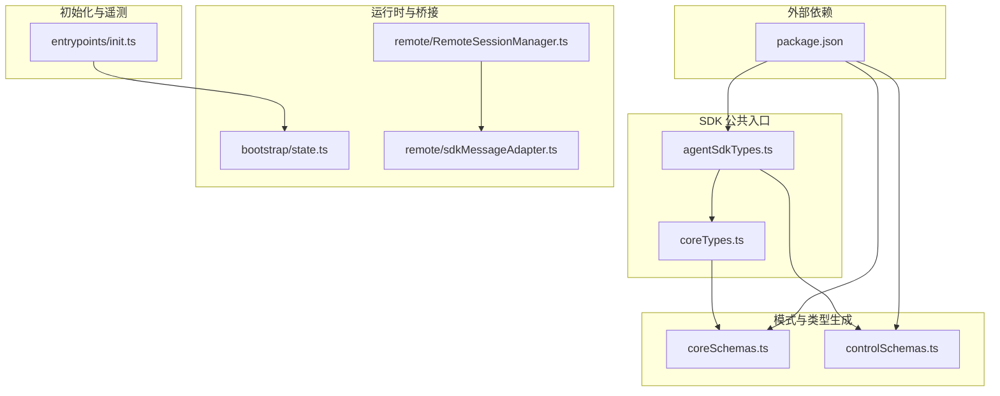
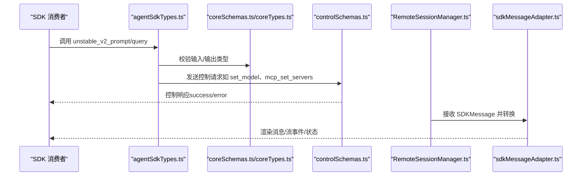
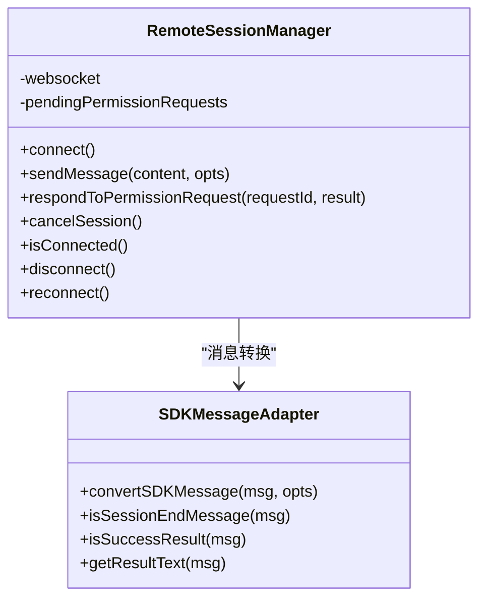
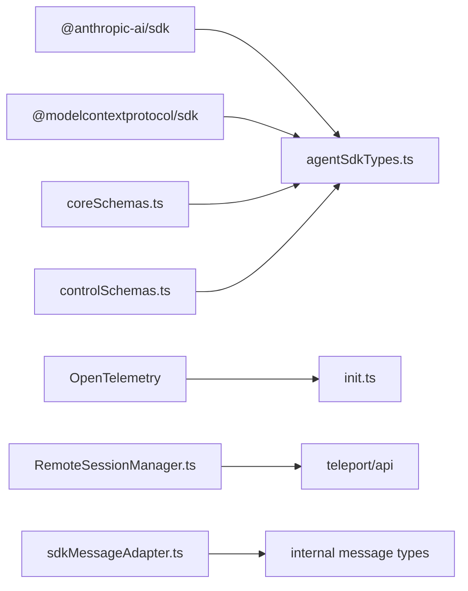

# SDK 参考

<cite>
**本文引用的文件**
- [package.json](file://package.json)
- [README.md](file://README.md)
- [src/entrypoints/sdk/coreSchemas.ts](file://src/entrypoints/sdk/coreSchemas.ts)
- [src/entrypoints/sdk/controlSchemas.ts](file://src/entrypoints/sdk/controlSchemas.ts)
- [src/entrypoints/sdk/coreTypes.ts](file://src/entrypoints/sdk/coreTypes.ts)
- [src/entrypoints/agentSdkTypes.ts](file://src/entrypoints/agentSdkTypes.ts)
- [src/bootstrap/state.ts](file://src/bootstrap/state.ts)
- [src/remote/sdkMessageAdapter.ts](file://src/remote/sdkMessageAdapter.ts)
- [src/remote/RemoteSessionManager.ts](file://src/remote/RemoteSessionManager.ts)
- [src/entrypoints/init.ts](file://src/entrypoints/init.ts)
</cite>

## 目录
1. [简介](#简介)
2. [项目结构](#项目结构)
3. [核心组件](#核心组件)
4. [架构总览](#架构总览)
5. [详细组件分析](#详细组件分析)
6. [依赖分析](#依赖分析)
7. [性能考虑](#性能考虑)
8. [故障排查指南](#故障排查指南)
9. [结论](#结论)
10. [附录](#附录)

## 简介
本参考文档面向 Claude Code 的 SDK 用户与构建者，系统梳理 SDK 的接口、类型定义、控制协议与运行时行为，覆盖初始化流程、配置选项、消息与钩子模型、远程会话桥接、权限与 MCP 集成等主题。文档同时提供跨语言使用建议、最佳实践、版本兼容性与迁移指引，并给出单元测试、集成测试与性能基准的实践思路。

## 项目结构
SDK 相关代码主要位于以下位置：
- 入口与公共类型：src/entrypoints/agentSdkTypes.ts
- 核心类型与 Zod 模式：src/entrypoints/sdk/coreSchemas.ts、src/entrypoints/sdk/coreTypes.ts
- 控制协议（CLI 交互）：src/entrypoints/sdk/controlSchemas.ts
- 运行时状态与全局指标：src/bootstrap/state.ts
- 远程会话桥接与消息适配：src/remote/RemoteSessionManager.ts、src/remote/sdkMessageAdapter.ts
- 初始化与遥测：src/entrypoints/init.ts
- 依赖与包信息：package.json

图表来源
- [src/entrypoints/agentSdkTypes.ts:1-445](file://src/entrypoints/agentSdkTypes.ts#L1-L445)
- [src/entrypoints/sdk/coreTypes.ts:1-64](file://src/entrypoints/sdk/coreTypes.ts#L1-L64)
- [src/entrypoints/sdk/coreSchemas.ts:1-800](file://src/entrypoints/sdk/coreSchemas.ts#L1-L800)
- [src/entrypoints/sdk/controlSchemas.ts:1-665](file://src/entrypoints/sdk/controlSchemas.ts#L1-L665)
- [src/bootstrap/state.ts:1-800](file://src/bootstrap/state.ts#L1-L800)
- [src/remote/RemoteSessionManager.ts:1-345](file://src/remote/RemoteSessionManager.ts#L1-L345)
- [src/remote/sdkMessageAdapter.ts:1-304](file://src/remote/sdkMessageAdapter.ts#L1-L304)
- [src/entrypoints/init.ts:1-342](file://src/entrypoints/init.ts#L1-L342)
- [package.json:1-95](file://package.json#L1-L95)

章节来源
- [package.json:1-95](file://package.json#L1-L95)
- [src/entrypoints/agentSdkTypes.ts:1-445](file://src/entrypoints/agentSdkTypes.ts#L1-L445)

## 核心组件
- SDK 公共类型与函数入口：在 agentSdkTypes.ts 中导出公共 API，包括会话管理、工具定义、查询与远程控制等。
- 核心数据模型与序列化：coreSchemas.ts 定义了模型用量、输出格式、配置作用域、MCP 服务器配置、权限规则、钩子事件等 Zod 模式；coreTypes.ts 基于这些模式生成 TS 类型并导出。
- 控制协议：controlSchemas.ts 定义 SDK 与 CLI 之间的控制请求/响应、环境变量更新、心跳、MCP 设置与状态查询等协议。
- 运行时状态：bootstrap/state.ts 提供会话 ID、统计计数器、遥测句柄、代理颜色映射、计划缩略缓存等全局状态。
- 远程会话桥接：RemoteSessionManager 负责 WebSocket 订阅、HTTP 发送用户消息、权限请求处理与中断；sdkMessageAdapter 将 SDK 消息转换为 REPL 内部消息类型。
- 初始化与遥测：init.ts 提供初始化流程与遥测初始化钩子，支持信任后的遥测延迟加载与指标创建。

章节来源
- [src/entrypoints/agentSdkTypes.ts:1-445](file://src/entrypoints/agentSdkTypes.ts#L1-L445)
- [src/entrypoints/sdk/coreSchemas.ts:1-800](file://src/entrypoints/sdk/coreSchemas.ts#L1-L800)
- [src/entrypoints/sdk/coreTypes.ts:1-64](file://src/entrypoints/sdk/coreTypes.ts#L1-L64)
- [src/entrypoints/sdk/controlSchemas.ts:1-665](file://src/entrypoints/sdk/controlSchemas.ts#L1-L665)
- [src/bootstrap/state.ts:1-800](file://src/bootstrap/state.ts#L1-L800)
- [src/remote/RemoteSessionManager.ts:1-345](file://src/remote/RemoteSessionManager.ts#L1-L345)
- [src/remote/sdkMessageAdapter.ts:1-304](file://src/remote/sdkMessageAdapter.ts#L1-L304)
- [src/entrypoints/init.ts:1-342](file://src/entrypoints/init.ts#L1-L342)

## 架构总览
SDK 采用“公共类型 + 控制协议 + 运行时桥接”的分层设计：
- 公共入口（agentSdkTypes.ts）暴露高层 API（如 unstable_v2_prompt、unstable_v2_createSession 等），供 SDK 消费者调用。
- 核心模式（coreSchemas.ts）与类型（coreTypes.ts）确保数据结构一致与可验证。
- 控制协议（controlSchemas.ts）定义 SDK 与 CLI 的双向通信契约，用于设置模型、权限模式、MCP 服务器、上下文使用情况查询、任务停止等。
- 运行时桥接（RemoteSessionManager + sdkMessageAdapter）负责远程会话的消息收发、权限请求处理与消息渲染适配。
- 初始化与遥测（init.ts + bootstrap/state.ts）提供启动阶段的网络与代理配置、遥测延迟初始化与指标工厂。

图表来源
- [src/entrypoints/agentSdkTypes.ts:1-445](file://src/entrypoints/agentSdkTypes.ts#L1-L445)
- [src/entrypoints/sdk/coreSchemas.ts:1-800](file://src/entrypoints/sdk/coreSchemas.ts#L1-L800)
- [src/entrypoints/sdk/controlSchemas.ts:1-665](file://src/entrypoints/sdk/controlSchemas.ts#L1-L665)
- [src/remote/RemoteSessionManager.ts:1-345](file://src/remote/RemoteSessionManager.ts#L1-L345)
- [src/remote/sdkMessageAdapter.ts:1-304](file://src/remote/sdkMessageAdapter.ts#L1-L304)

## 详细组件分析

### 组件 A：SDK 公共类型与函数入口（agentSdkTypes.ts）
- 导出内容
  - 控制协议类型（SDKControlRequest/Response）供 SDK 构建者使用
  - 核心类型（消息、配置、会话信息等）
  - 运行时类型（回调、接口、会话对象等）
  - 工具定义与 MCP 服务器创建函数
  - 会话生命周期 API：unstable_v2_createSession、unstable_v2_resumeSession、unstable_v2_prompt
  - 会话查询与管理：getSessionMessages、listSessions、getSessionInfo、renameSession、tagSession、forkSession
  - 远程控制与计划任务相关内部类型（供守护进程或桥接使用）

- 关键点
  - 所有导出函数当前为占位实现（抛出错误），实际能力由宿主实现提供
  - 提供工具定义与 MCP 服务器创建接口，便于在同进程内扩展工具集
  - 会话管理 API 支持多轮对话、分支与重命名标签

章节来源
- [src/entrypoints/agentSdkTypes.ts:1-445](file://src/entrypoints/agentSdkTypes.ts#L1-L445)

### 组件 B：核心数据模型与类型（coreSchemas.ts、coreTypes.ts）
- 核心模式
  - 模型用量（inputTokens、outputTokens、cacheReadInputTokens、cacheCreationInputTokens、webSearchRequests、costUSD、contextWindow、maxOutputTokens）
  - 输出格式（json_schema）
  - 配置作用域（local/user/project）、SDK Beta 标识
  - 思维策略（adaptive/enabled/disabled）
  - MCP 服务器配置（stdio/sse/http/sdk/claudeai-proxy）
  - 权限规则与决策（addRules/replaceRules/removeRules/setMode/addDirectories/removeDirectories）
  - 钩子事件集合与输入结构（PreToolUse、PostToolUse、PermissionRequest、SessionStart/End、Stop/StopFailure、SubagentStart/Stop、PreCompact/PostCompact、TeammateIdle、TaskCreated/Completed、Elicitation/ElicitationResult、ConfigChange、InstructionsLoaded、WorktreeCreate/Remove、CwdChanged、FileChanged）
  - 退出原因枚举
  - 异步钩子 JSON 输出结构

- 类型生成
  - coreTypes.ts 从 coreSchemas.ts 生成 TS 类型并导出，同时导出沙箱配置与工具实用类型
  - 提供常量数组（HOOK_EVENTS、EXIT_REASONS）用于运行时校验与提示

章节来源
- [src/entrypoints/sdk/coreSchemas.ts:1-800](file://src/entrypoints/sdk/coreSchemas.ts#L1-L800)
- [src/entrypoints/sdk/coreTypes.ts:1-64](file://src/entrypoints/sdk/coreTypes.ts#L1-L64)

### 组件 C：控制协议（controlSchemas.ts）
- 协议范围
  - 初始化：initialize（钩子匹配、MCP 服务器、系统提示、代理、输出样式等）
  - 权限：can_use_tool、set_permission_mode
  - 模型与思维：set_model、set_max_thinking_tokens
  - MCP：mcp_status、mcp_set_servers、mcp_message、mcp_reconnect、mcp_toggle
  - 上下文：get_context_usage
  - 文件回滚：rewind_files
  - 异步消息：cancel_async_message
  - 缓存种子：seed_read_state
  - 插件重载：reload_plugins
  - 任务：stop_task
  - 设置：apply_flag_settings、get_settings
  - 用户输入：elicitation（表单/URL）
  - 环境变量：update_environment_variables
  - 心跳：keep_alive

- 数据结构
  - 请求/响应包装对象（type='control_request'/'control_response'）
  - 错误响应携带 pending_permission_requests
  - StdoutMessage/StdinMessage 聚合消息类型

章节来源
- [src/entrypoints/sdk/controlSchemas.ts:1-665](file://src/entrypoints/sdk/controlSchemas.ts#L1-L665)

### 组件 D：运行时状态与全局指标（bootstrap/state.ts）
- 全局状态
  - 会话标识、项目根目录、工作目录、原始工作目录
  - 成本与耗时统计（总成本、API 总耗时、工具耗时、令牌用量、Web 搜索次数）
  - 钩子与分类器耗时统计、回合计数
  - 遥测句柄（Meter、LoggerProvider、TracerProvider）、计数器工厂
  - 代理颜色映射、计划缩略缓存
  - 最后一次 API 请求与消息、自动模式分类器请求缓存、CLAUDE.md 内容缓存
  - 会话内插件、频道允许列表、快速模式/AFK 模式/缓存编辑头部锁
  - 提示 ID、最后主请求 ID、最后 API 完成时间、紧凑标记

- 方法族
  - 会话切换、项目目录设置、统计累加、计数器工厂、交互时间刷新、令牌预算快照等

章节来源
- [src/bootstrap/state.ts:1-800](file://src/bootstrap/state.ts#L1-L800)

### 组件 E：远程会话桥接与消息适配（RemoteSessionManager.ts、sdkMessageAdapter.ts）
- RemoteSessionManager
  - WebSocket 订阅远程会话消息
  - HTTP 发送用户消息到远程会话
  - 处理控制请求（主要是权限请求）并维护挂起队列
  - 发送控制响应（允许/拒绝）与中断信号
  - 连接状态回调（已连接/断开/重连中/错误）

- sdkMessageAdapter
  - 将 SDKMessage 转换为 REPL 内部消息类型（Assistant/System/StreamEvent）
  - 支持历史事件转换、工具结果渲染、状态消息与紧凑边界消息
  - 提供会话结束判断、成功结果提取等辅助方法

图表来源
- [src/remote/RemoteSessionManager.ts:1-345](file://src/remote/RemoteSessionManager.ts#L1-L345)
- [src/remote/sdkMessageAdapter.ts:1-304](file://src/remote/sdkMessageAdapter.ts#L1-L304)

章节来源
- [src/remote/RemoteSessionManager.ts:1-345](file://src/remote/RemoteSessionManager.ts#L1-L345)
- [src/remote/sdkMessageAdapter.ts:1-304](file://src/remote/sdkMessageAdapter.ts#L1-L304)

### 组件 F：初始化与遥测（init.ts）
- 初始化流程
  - 启用配置系统、应用安全环境变量、预连接 Anthropic API、配置全局 mTLS/代理
  - 异步初始化 1P 事件日志与 GrowthBook 刷新回调
  - 注册优雅退出、LSP 管理器关闭、团队清理等清理逻辑
  - 可选初始化上游代理（CCR 场景）

- 遥测初始化
  - initializeTelemetryAfterTrust 在获得信任后延迟初始化遥测
  - setMeterState 创建指标工厂与计数器（会话计数器、LOC/PR/Commit/Cost/Token 等）
  - 通过 getTelemetryAttributes 合并属性，避免重复初始化

章节来源
- [src/entrypoints/init.ts:1-342](file://src/entrypoints/init.ts#L1-L342)

## 依赖分析
- 外部依赖
  - @anthropic-ai/sdk：与 Claude API 交互
  - @modelcontextprotocol/sdk：MCP 协议支持
  - OpenTelemetry 生态：指标、日志、追踪
  - 其他工具库：终端、文件系统、网络、类型校验等

- 内部模块耦合
  - agentSdkTypes.ts 依赖 coreSchemas.ts 与 controlSchemas.ts 的类型
  - RemoteSessionManager 依赖 controlTypes（控制请求/响应）与 telepor API
  - sdkMessageAdapter 依赖内部消息类型与工具函数
  - init.ts 与 bootstrap/state.ts 协作提供全局状态与遥测

图表来源
- [package.json:1-95](file://package.json#L1-L95)
- [src/entrypoints/agentSdkTypes.ts:1-445](file://src/entrypoints/agentSdkTypes.ts#L1-L445)
- [src/entrypoints/sdk/controlSchemas.ts:1-665](file://src/entrypoints/sdk/controlSchemas.ts#L1-L665)
- [src/remote/RemoteSessionManager.ts:1-345](file://src/remote/RemoteSessionManager.ts#L1-L345)
- [src/remote/sdkMessageAdapter.ts:1-304](file://src/remote/sdkMessageAdapter.ts#L1-L304)

章节来源
- [package.json:1-95](file://package.json#L1-L95)

## 性能考虑
- 启动阶段优化
  - 延迟加载遥测与 MCP 协议相关模块，减少冷启动时间
  - 预连接 Anthropic API，缩短首次请求等待
  - 全局 mTLS/代理配置一次性完成，避免后续请求重复握手
- 运行时优化
  - 使用计数器工厂统一上报指标，避免频繁创建对象
  - 令牌预算快照与回合统计，帮助诊断长会话的上下文膨胀
  - 远程会话消息转换按需进行，忽略不必要类型以降低开销
- 资源管理
  - 优雅退出注册清理 LSP、团队与临时资源
  - WebSocket 断线重连与取消权限请求，避免悬挂请求

## 故障排查指南
- 权限请求未响应
  - 检查 RemoteSessionManager 是否正确接收 control_request 并维护 pendingPermissionRequests
  - 确认 respondToPermissionRequest 是否发送了正确的 control_response
- 远程会话消息不显示
  - 使用 sdkMessageAdapter 的 convertSDKMessage 并确认消息类型被接受
  - 对于历史事件转换，检查 convertToolResults 与 convertUserTextMessages 选项
- 遥测未初始化
  - 确保 initializeTelemetryAfterTrust 在信任后调用
  - 检查 setMeterState 是否成功创建 Meter 与计数器
- 上下文使用异常
  - 使用 get_context_usage 获取细粒度使用情况，定位过高的类别（系统提示、工具、附件等）

章节来源
- [src/remote/RemoteSessionManager.ts:1-345](file://src/remote/RemoteSessionManager.ts#L1-L345)
- [src/remote/sdkMessageAdapter.ts:1-304](file://src/remote/sdkMessageAdapter.ts#L1-L304)
- [src/entrypoints/init.ts:1-342](file://src/entrypoints/init.ts#L1-L342)

## 结论
本 SDK 以清晰的类型体系与控制协议为核心，结合运行时桥接与初始化流程，为多语言与多场景下的集成提供了稳定基础。建议在生产环境中：
- 严格遵循 coreSchemas.ts 的数据模型进行输入校验
- 使用 controlSchemas.ts 的控制协议与 CLI 保持一致性
- 通过 RemoteSessionManager 与 sdkMessageAdapter 实现可靠的远程会话体验
- 在信任后初始化遥测，确保性能与可观测性的平衡

## 附录

### A. 初始化与配置选项
- 初始化要点
  - 启用配置系统与安全环境变量应用
  - 预连接 Anthropic API、配置 mTLS/代理
  - 异步初始化 1P 事件日志与 GrowthBook 刷新
  - 注册清理逻辑与可选上游代理
- 遥测初始化
  - initializeTelemetryAfterTrust 在信任后延迟初始化
  - setMeterState 创建指标工厂与计数器

章节来源
- [src/entrypoints/init.ts:1-342](file://src/entrypoints/init.ts#L1-L342)

### B. TypeScript 类型与泛型使用
- 工具定义
  - tool 函数接受名称、描述、输入 Zod 模式与处理器，返回 SdkMcpToolDefinition
  - 支持 annotations、searchHint、alwaysLoad 等额外参数
- MCP 服务器
  - createSdkMcpServer 接受 name/version 与工具数组，返回 McpSdkServerConfigWithInstance
- 查询与会话
  - query 支持内部与公开 Options 两种签名
  - unstable_v2_createSession/unstable_v2_resumeSession/unstable_v2_prompt 提供 V2 API 占位

章节来源
- [src/entrypoints/agentSdkTypes.ts:73-165](file://src/entrypoints/agentSdkTypes.ts#L73-L165)

### C. 接口规范与控制协议
- 控制请求/响应
  - 包含 initialize、interrupt、can_use_tool、set_permission_mode、set_model、set_max_thinking_tokens、mcp_status、mcp_set_servers、get_context_usage、rewind_files、cancel_async_message、seed_read_state、mcp_message、reload_plugins、mcp_reconnect、mcp_toggle、stop_task、apply_flag_settings、get_settings、elicitation、update_environment_variables、keep_alive
- 错误处理
  - error 响应包含 request_id 与错误信息，并可携带 pending_permission_requests

章节来源
- [src/entrypoints/sdk/controlSchemas.ts:552-665](file://src/entrypoints/sdk/controlSchemas.ts#L552-L665)

### D. 使用示例（路径指引）
- 单次提示（V2）
  - 参考：[src/entrypoints/agentSdkTypes.ts:160-165](file://src/entrypoints/agentSdkTypes.ts#L160-L165)
- 创建/恢复会话（V2）
  - 参考：[src/entrypoints/agentSdkTypes.ts:129-145](file://src/entrypoints/agentSdkTypes.ts#L129-L145)
- 会话管理（列出/读取/重命名/打标签/分支）
  - 参考：[src/entrypoints/agentSdkTypes.ts:204-273](file://src/entrypoints/agentSdkTypes.ts#L204-L273)
- 工具定义与 MCP 服务器
  - 参考：[src/entrypoints/agentSdkTypes.ts:73-107](file://src/entrypoints/agentSdkTypes.ts#L73-L107)

### E. 最佳实践
- 输入校验
  - 使用 coreSchemas.ts 的模式对输入进行运行时校验
- 权限与安全
  - 优先使用 set_permission_mode 控制权限模式
  - 对危险操作（文件写入、删除）采用 ask/allow/deny 策略
- 远程会话
  - 使用 RemoteSessionManager 管理连接与权限请求
  - 通过 sdkMessageAdapter 将消息转换为本地渲染格式
- 遥测与可观测性
  - 在信任后初始化遥测，统一上报指标
  - 使用 get_context_usage 与统计接口监控上下文使用

### F. 版本兼容性与升级指南
- 当前版本
  - package.json 显示版本号与依赖版本范围
- 升级建议
  - 更新 @anthropic-ai/sdk 与 @modelcontextprotocol/sdk 至兼容版本
  - 若 coreSchemas.ts 有变更，需重新生成 coreTypes.ts 并同步客户端类型
  - 控制协议如有新增字段，需在 SDK 构建端兼容旧版本

章节来源
- [package.json:1-95](file://package.json#L1-L95)

### G. 单元测试、集成测试与性能基准
- 单元测试
  - 建议针对 coreSchemas.ts 的模式编写校验用例，覆盖边界值与非法输入
- 集成测试
  - 使用 controlSchemas.ts 的请求/响应进行端到端测试，模拟 CLI 交互
  - 通过 RemoteSessionManager 测试权限请求与消息转换链路
- 性能基准
  - 使用 bootstrap/state.ts 的统计接口测量回合耗时、工具耗时与令牌用量
  - 对比不同模型与思维策略的上下文使用情况