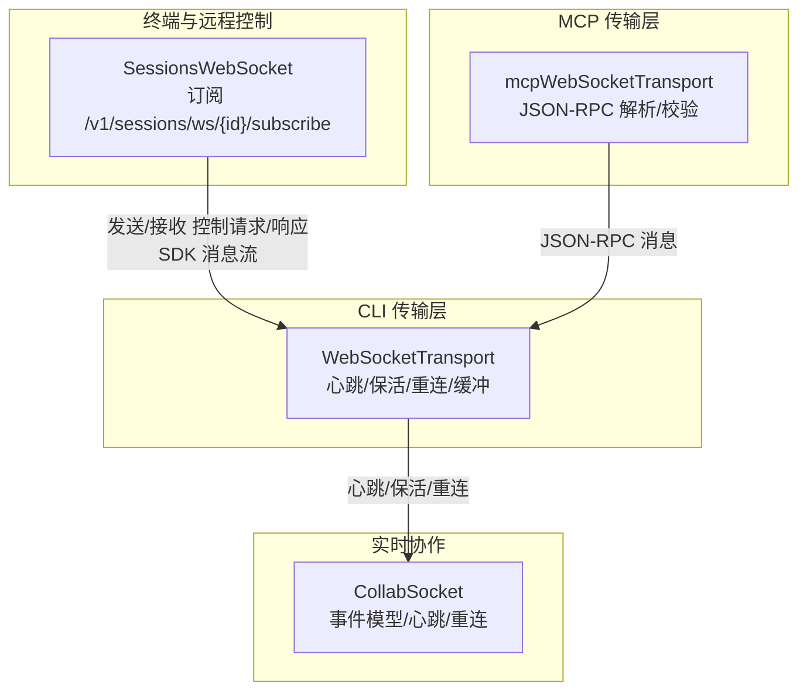
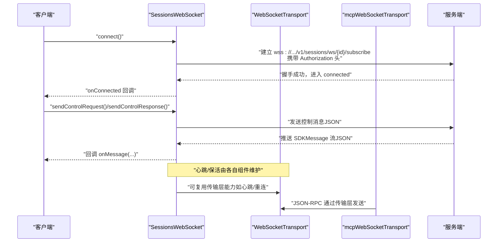
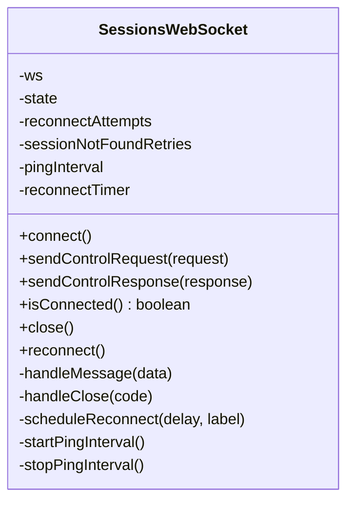
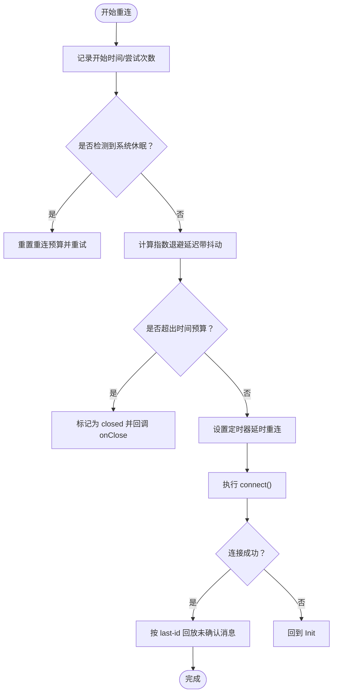
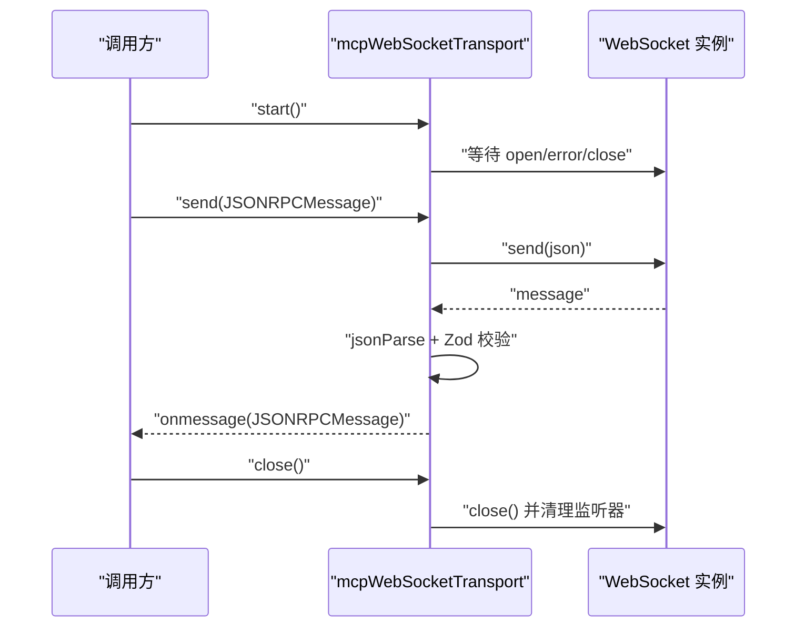
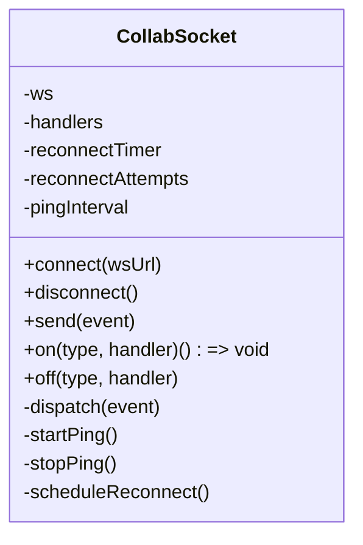
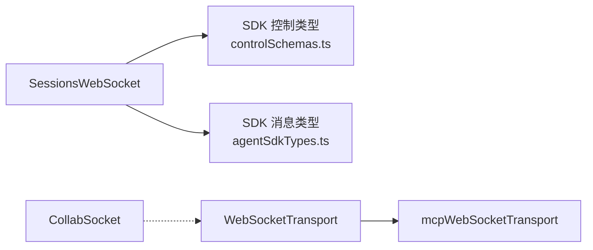

# WebSocket API

<cite>
**本文引用的文件**
- [SessionsWebSocket.ts](file://src/remote/SessionsWebSocket.ts)
- [WebSocketTransport.ts（CLI 传输）](file://src/cli/transports/WebSocketTransport.ts)
- [mcpWebSocketTransport.ts](file://src/utils/mcpWebSocketTransport.ts)
- [socket.ts（协作 Socket）](file://web/lib/collaboration/socket.ts)
- [controlSchemas.ts](file://src/entrypoints/sdk/controlSchemas.ts)
- [agentSdkTypes.ts](file://src/entrypoints/agentSdkTypes.ts)
- [bridgeMessaging.ts](file://src/bridge/bridgeMessaging.ts)
</cite>

## 目录
1. [简介](#简介)
2. [项目结构与角色定位](#项目结构与角色定位)
3. [核心组件](#核心组件)
4. [架构总览](#架构总览)
5. [详细组件分析](#详细组件分析)
6. [依赖关系分析](#依赖关系分析)
7. [性能与可靠性特性](#性能与可靠性特性)
8. [故障排查指南](#故障排查指南)
9. [结论](#结论)
10. [附录：消息格式与事件类型](#附录消息格式与事件类型)

## 简介
本文件系统性梳理 Claude Code 的 WebSocket API 设计与实现，覆盖以下方面：
- 连接建立流程与认证方式
- 消息格式与事件类型
- 心跳与保活机制
- 重连策略与退避算法
- 错误处理与状态管理
- 终端会话、远程控制与实时协作的接口差异与共性
- 客户端连接示例与消息收发模式
- 性能优化建议、并发连接管理与安全考虑

## 项目结构与角色定位
- 终端会话与远程控制：通过 SessionsWebSocket 建立到 /v1/sessions/ws/{id}/subscribe 的订阅通道，支持控制请求/响应与 SDK 消息流。
- CLI 传输层：WebSocketTransport 提供通用的 WebSocket 传输抽象，内置心跳、保活、指数退避重连、消息缓冲与去重等能力。
- MCP 传输：mcpWebSocketTransport 面向 MCP JSON-RPC 协议，封装消息解析、错误处理与监听器清理。
- 实时协作：web/lib/collaboration/socket.ts 提供协作会话的事件模型与客户端 Socket 封装，含心跳与指数退避重连。

**图表来源**
- [SessionsWebSocket.ts:82-205](file://src/remote/SessionsWebSocket.ts#L82-L205)
- [WebSocketTransport.ts（CLI 传输）:74-193](file://src/cli/transports/WebSocketTransport.ts#L74-L193)
- [mcpWebSocketTransport.ts:22-70](file://src/utils/mcpWebSocketTransport.ts#L22-L70)
- [socket.ts（协作 Socket）:208-264](file://web/lib/collaboration/socket.ts#L208-L264)

**章节来源**
- [SessionsWebSocket.ts:82-205](file://src/remote/SessionsWebSocket.ts#L82-L205)
- [WebSocketTransport.ts（CLI 传输）:74-193](file://src/cli/transports/WebSocketTransport.ts#L74-L193)
- [mcpWebSocketTransport.ts:22-70](file://src/utils/mcpWebSocketTransport.ts#L22-L70)
- [socket.ts（协作 Socket）:208-264](file://web/lib/collaboration/socket.ts#L208-L264)

## 核心组件
- SessionsWebSocket：面向终端会话订阅的 WebSocket 客户端，负责连接、认证、消息分发、控制请求/响应、心跳与重连。
- WebSocketTransport（CLI）：通用传输层，提供心跳检测、保活帧、指数退避重连、消息缓冲与去重、睡眠/挂起检测。
- mcpWebSocketTransport：面向 MCP JSON-RPC 的传输适配，负责消息解析、错误处理与监听器清理。
- CollabSocket（协作）：前端协作会话的 Socket 封装，定义事件类型、心跳与指数退避重连。

**章节来源**
- [SessionsWebSocket.ts:82-205](file://src/remote/SessionsWebSocket.ts#L82-L205)
- [WebSocketTransport.ts（CLI 传输）:74-193](file://src/cli/transports/WebSocketTransport.ts#L74-L193)
- [mcpWebSocketTransport.ts:22-70](file://src/utils/mcpWebSocketTransport.ts#L22-L70)
- [socket.ts（协作 Socket）:208-264](file://web/lib/collaboration/socket.ts#L208-L264)

## 架构总览
下图展示从客户端到服务端的关键交互路径与状态流转：

**图表来源**
- [SessionsWebSocket.ts:100-205](file://src/remote/SessionsWebSocket.ts#L100-L205)
- [WebSocketTransport.ts（CLI 传输）:135-193](file://src/cli/transports/WebSocketTransport.ts#L135-L193)
- [mcpWebSocketTransport.ts:142-169](file://src/utils/mcpWebSocketTransport.ts#L142-L169)

## 详细组件分析

### 终端会话订阅（SessionsWebSocket）
- 连接与认证
  - 使用 wss:// 基础地址与 /v1/sessions/ws/{sessionId}/subscribe 路径。
  - 通过 Authorization 头传递访问令牌；同时设置 Anthropic 版本头。
  - 支持 Bun 原生 WebSocket 与 Node ws 包两种运行时。
- 消息处理
  - 解析入站 JSON，按类型分发给回调；仅转发符合 SDK 消息结构的消息。
- 控制消息
  - 发送控制请求：自动注入 request_id，并封装为 control_request。
  - 发送控制响应：直接发送 control_response。
- 心跳与保活
  - 定期触发 ping（若底层支持），用于检测死连接。
- 重连策略
  - 指数退避（固定基础延迟与最大尝试次数）。
  - 对特定关闭码（如 4001、4003）采用有限重试或永久关闭策略。
  - 会话不存在（4001）在短暂窗口内进行有限重试，避免瞬时状态导致的永久断开。
- 关闭与清理
  - 清理定时器、停止心跳、移除事件监听，确保资源释放。

**图表来源**
- [SessionsWebSocket.ts:82-205](file://src/remote/SessionsWebSocket.ts#L82-L205)
- [SessionsWebSocket.ts:290-323](file://src/remote/SessionsWebSocket.ts#L290-L323)
- [SessionsWebSocket.ts:325-377](file://src/remote/SessionsWebSocket.ts#L325-L377)

**章节来源**
- [SessionsWebSocket.ts:100-205](file://src/remote/SessionsWebSocket.ts#L100-L205)
- [SessionsWebSocket.ts:210-288](file://src/remote/SessionsWebSocket.ts#L210-L288)
- [SessionsWebSocket.ts:290-323](file://src/remote/SessionsWebSocket.ts#L290-L323)
- [SessionsWebSocket.ts:325-377](file://src/remote/SessionsWebSocket.ts#L325-L377)

### CLI 传输层（WebSocketTransport）
- 通用传输抽象
  - 统一 Bun 与 Node 的事件模型，支持移除监听器以避免内存泄漏。
  - 维护连接状态（idle/connected/reconnecting/closing/closed）。
- 心跳与保活
  - 定期发送 ping，若未收到 pong 则判定连接死亡并触发重连。
  - 保活帧（keep_alive）周期性发送，用于穿透代理空闲超时。
  - 睡眠/挂起检测：若心跳间隔异常大，立即重连。
- 重连策略
  - 指数退避，上限与时间预算控制（默认约 10 分钟）。
  - 支持系统休眠检测，重置重连预算并重新尝试。
  - 对永久关闭码（如 4001/4003/1002）直接终止重连。
  - 4003 时可刷新头部（如新令牌）后继续重连。
- 消息缓冲与去重
  - 有 UUID 的消息写入环形缓冲区，重连后按服务端确认点回放。
  - 服务器通过 last-id 机制告知已确认消息，客户端据此裁剪缓冲。
- 生命周期管理
  - 明确的连接/断开/错误处理回调，支持外部关闭与取消重连。

**图表来源**
- [WebSocketTransport.ts（CLI 传输）:397-554](file://src/cli/transports/WebSocketTransport.ts#L397-L554)
- [WebSocketTransport.ts（CLI 传输）:574-634](file://src/cli/transports/WebSocketTransport.ts#L574-L634)

**章节来源**
- [WebSocketTransport.ts（CLI 传输）:135-193](file://src/cli/transports/WebSocketTransport.ts#L135-L193)
- [WebSocketTransport.ts（CLI 传输）:296-329](file://src/cli/transports/WebSocketTransport.ts#L296-L329)
- [WebSocketTransport.ts（CLI 传输）:397-554](file://src/cli/transports/WebSocketTransport.ts#L397-L554)
- [WebSocketTransport.ts（CLI 传输）:574-634](file://src/cli/transports/WebSocketTransport.ts#L574-L634)

### MCP 传输（mcpWebSocketTransport）
- 用途
  - 为 MCP JSON-RPC 消息提供 WebSocket 传输适配，负责消息解析、类型校验与错误处理。
- 关键行为
  - 等待连接打开后 attach 事件监听。
  - 解析入站消息并使用 Zod Schema 校验，失败时触发错误回调。
  - 发送消息时序列化为 JSON，并在 Node 环境等待发送回调。
  - 关闭时清理监听器，确保无泄漏。

**图表来源**
- [mcpWebSocketTransport.ts:22-70](file://src/utils/mcpWebSocketTransport.ts#L22-L70)
- [mcpWebSocketTransport.ts:142-169](file://src/utils/mcpWebSocketTransport.ts#L142-L169)
- [mcpWebSocketTransport.ts:173-199](file://src/utils/mcpWebSocketTransport.ts#L173-L199)

**章节来源**
- [mcpWebSocketTransport.ts:22-70](file://src/utils/mcpWebSocketTransport.ts#L22-L70)
- [mcpWebSocketTransport.ts:142-169](file://src/utils/mcpWebSocketTransport.ts#L142-L169)
- [mcpWebSocketTransport.ts:173-199](file://src/utils/mcpWebSocketTransport.ts#L173-L199)

### 实时协作（CollabSocket）
- 事件模型
  - 定义丰富的协作事件类型（消息增删、工具使用、光标/打字、权限变更、会话状态等）。
  - 出站事件为入站事件的子集（不含时间戳与会话标识），便于客户端发送。
- 连接与认证
  - 通过查询参数携带 sessionId 与 token。
  - 连接成功后启动心跳，断开后指数退避重连。
- 心跳与重连
  - 定期发送 ping；断线后按 2^N 延迟重连，最多 N 次。

**图表来源**
- [socket.ts（协作 Socket）:208-264](file://web/lib/collaboration/socket.ts#L208-L264)
- [socket.ts（协作 Socket）:302-321](file://web/lib/collaboration/socket.ts#L302-L321)

**章节来源**
- [socket.ts（协作 Socket）:208-264](file://web/lib/collaboration/socket.ts#L208-L264)
- [socket.ts（协作 Socket）:302-321](file://web/lib/collaboration/socket.ts#L302-L321)

## 依赖关系分析
- SessionsWebSocket 依赖 SDK 控制类型与消息类型，用于构造/解析控制请求/响应与 SDKMessage。
- WebSocketTransport 作为通用传输层，被 CLI 与 MCP 传输复用，提供统一的心跳、保活与重连能力。
- mcpWebSocketTransport 依赖 MCP SDK 的 JSON-RPC 类型与 Zod 校验。
- CollabSocket 为前端协作模块，独立于后端 SDK 协议，但共享心跳与重连模式。

**图表来源**
- [SessionsWebSocket.ts:4-9](file://src/remote/SessionsWebSocket.ts#L4-L9)
- [controlSchemas.ts:578-627](file://src/entrypoints/sdk/controlSchemas.ts#L578-L627)
- [agentSdkTypes.ts:38-42](file://src/entrypoints/agentSdkTypes.ts#L38-L42)
- [WebSocketTransport.ts（CLI 传输）:74-133](file://src/cli/transports/WebSocketTransport.ts#L74-L133)
- [mcpWebSocketTransport.ts:22-27](file://src/utils/mcpWebSocketTransport.ts#L22-L27)
- [socket.ts（协作 Socket）:208-226](file://web/lib/collaboration/socket.ts#L208-L226)

**章节来源**
- [SessionsWebSocket.ts:4-9](file://src/remote/SessionsWebSocket.ts#L4-L9)
- [controlSchemas.ts:578-627](file://src/entrypoints/sdk/controlSchemas.ts#L578-L627)
- [agentSdkTypes.ts:38-42](file://src/entrypoints/agentSdkTypes.ts#L38-L42)
- [WebSocketTransport.ts（CLI 传输）:74-133](file://src/cli/transports/WebSocketTransport.ts#L74-L133)
- [mcpWebSocketTransport.ts:22-27](file://src/utils/mcpWebSocketTransport.ts#L22-L27)
- [socket.ts（协作 Socket）:208-226](file://web/lib/collaboration/socket.ts#L208-L226)

## 性能与可靠性特性
- 心跳与保活
  - SessionsWebSocket：定期 ping，日志记录 pong 收到情况。
  - WebSocketTransport：周期性 ping 检测死连接；保活帧防止代理空闲断开。
  - CollabSocket：定时发送 ping，维持长连接活跃。
- 指数退避与抖动
  - WebSocketTransport 在重连中加入 ±25% 抖动，避免风暴效应。
- 消息去重与回放
  - WebSocketTransport 通过 UUID 与 last-id 机制在重连后回放未确认消息，减少丢失。
- 睡眠/挂起检测
  - WebSocketTransport 通过心跳间隔异常判断进程挂起，立即重连，避免 NAT 映射过期导致的无效等待。
- 代理与 TLS 支持
  - 传输层支持代理与 TLS 选项，提升网络穿越能力。

**章节来源**
- [SessionsWebSocket.ts:301-323](file://src/remote/SessionsWebSocket.ts#L301-L323)
- [WebSocketTransport.ts（CLI 传输）:697-758](file://src/cli/transports/WebSocketTransport.ts#L697-L758)
- [WebSocketTransport.ts（CLI 传输）:767-792](file://src/cli/transports/WebSocketTransport.ts#L767-L792)
- [WebSocketTransport.ts（CLI 传输）:476-488](file://src/cli/transports/WebSocketTransport.ts#L476-L488)
- [WebSocketTransport.ts（CLI 传输）:514-518](file://src/cli/transports/WebSocketTransport.ts#L514-L518)
- [WebSocketTransport.ts（CLI 传输）:574-634](file://src/cli/transports/WebSocketTransport.ts#L574-L634)

## 故障排查指南
- 常见关闭码与处理
  - 4001（会话不存在/过期）：短期有限重试；超过阈值则不再重连。
  - 4003（未授权）：尝试刷新头部（如新令牌）后重连；否则永久关闭。
  - 1002（协议错误）：永久关闭，不重连。
- 日志与诊断
  - 各组件均输出调试日志与诊断事件，便于定位连接失败、发送错误、心跳超时等问题。
- 重连预算耗尽
  - WebSocketTransport 在默认 10 分钟预算后停止重连并回调 onClose，需检查网络/代理/凭证问题。
- 监听器清理
  - 传输层在断开前移除所有事件监听，避免内存泄漏；如出现“幽灵回调”，优先检查是否正确调用 close。

**章节来源**
- [SessionsWebSocket.ts:246-288](file://src/remote/SessionsWebSocket.ts#L246-L288)
- [WebSocketTransport.ts（CLI 传输）:423-455](file://src/cli/transports/WebSocketTransport.ts#L423-L455)
- [WebSocketTransport.ts（CLI 传输）:457-554](file://src/cli/transports/WebSocketTransport.ts#L457-L554)

## 结论
- SessionsWebSocket 与 WebSocketTransport 共同构成了终端会话与远程控制的可靠通信基石，前者专注会话订阅与控制协议，后者提供通用的心跳、保活与重连能力。
- mcpWebSocketTransport 为 MCP JSON-RPC 提供了稳健的传输适配，配合类型校验与错误处理，保障跨进程/跨环境的稳定交互。
- CollabSocket 展示了前端协作场景下的事件模型与连接策略，与后端 SDK 协议解耦，便于扩展。

## 附录：消息格式与事件类型

### 终端会话消息与控制协议要点
- 认证
  - 通过 Authorization 头传递访问令牌；Anthropic 版本头随连接一起发送。
- 控制请求/响应
  - 控制请求包含 request_id 与具体请求体；控制响应包含 subtype（success/error）与 request_id。
  - 可选字段 pending_permission_requests 用于权限相关场景。
- keep_alive
  - 用于保持连接活跃，穿透代理空闲超时。

**章节来源**
- [SessionsWebSocket.ts:113-118](file://src/remote/SessionsWebSocket.ts#L113-L118)
- [controlSchemas.ts:578-627](file://src/entrypoints/sdk/controlSchemas.ts#L578-L627)
- [WebSocketTransport.ts（CLI 传输）:20-28](file://src/cli/transports/WebSocketTransport.ts#L20-L28)

### 协作事件类型（CollabSocket）
- 消息类：message_added、message_streaming
- 工具使用：tool_use_pending、tool_use_approved、tool_use_denied
- 用户与存在：user_joined、user_left、presence_sync
- 输入与标注：cursor_update、typing_start、typing_stop、annotation_added、annotation_resolved、annotation_reply
- 权限与状态：role_changed、access_revoked、ownership_transferred、session_state
- 错误：error

**章节来源**
- [socket.ts（协作 Socket）:18-199](file://web/lib/collaboration/socket.ts#L18-L199)

### SDK 消息类型（SessionsWebSocket）
- SDKMessage 及其相关类型由 SDK 核心类型导出，SessionsWebSocket 通过类型守卫识别并分发。

**章节来源**
- [agentSdkTypes.ts:38-42](file://src/entrypoints/agentSdkTypes.ts#L38-L42)
- [bridgeMessaging.ts:36-70](file://src/bridge/bridgeMessaging.ts#L36-L70)