# MCP 协议规范

<cite>
**本文引用的文件**
- [mcp.ts](file://src/entrypoints/mcp.ts)
- [index.ts](file://mcp-server/src/index.ts)
- [test-mcp.ts](file://scripts/test-mcp.ts)
- [mcpValidation.ts](file://src/utils/mcpValidation.ts)
- [mcpWebSocketTransport.ts](file://src/utils/mcpWebSocketTransport.ts)
- [mcpOutputStorage.ts](file://src/utils/mcpOutputStorage.ts)
- [mcpInstructionsDelta.ts](file://src/utils/mcpInstructionsDelta.ts)
- [mcp.tsx](file://src/commands/mcp/mcp.tsx)
- [mcpServerApproval.tsx](file://src/services/mcpServerApproval.tsx)
</cite>

## 目录
1. [引言](#引言)
2. [项目结构](#项目结构)
3. [核心组件](#核心组件)
4. [架构总览](#架构总览)
5. [详细组件分析](#详细组件分析)
6. [依赖关系分析](#依赖关系分析)
7. [性能考量](#性能考量)
8. [故障排查指南](#故障排查指南)
9. [结论](#结论)
10. [附录](#附录)

## 引言
本文件面向 MCP（Model Context Protocol）协议的实现与使用，系统化梳理其核心概念、消息格式、请求-响应模式、状态管理、服务器与客户端角色分工、能力协商与连接建立流程，并结合仓库中的具体实现，解释在 AI 工具生态中的标准化作用、与现有 API 标准的关系、版本兼容性与安全考虑。读者可据此快速理解并集成 MCP 服务，或基于仓库实现进行二次开发。

## 项目结构
本仓库中与 MCP 直接相关的关键位置如下：
- 客户端入口与工具暴露：src/entrypoints/mcp.ts
- MCP 服务器子项目入口：mcp-server/src/index.ts
- 测试脚本（演示客户端-服务器交互）：scripts/test-mcp.ts
- 输出截断与内容大小估算：src/utils/mcpValidation.ts
- WebSocket 传输适配器：src/utils/mcpWebSocketTransport.ts
- 大输出落盘与格式描述：src/utils/mcpOutputStorage.ts
- 连接服务器的用户交互与设置命令：src/commands/mcp/mcp.tsx
- 服务器批准与多选对话框：src/services/mcpServerApproval.tsx
- 指令增量广播（仅在特定开关下启用）：src/utils/mcpInstructionsDelta.ts

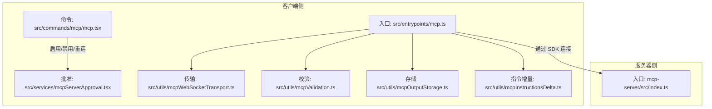

**图表来源**
- [mcp.ts:35-196](file://src/entrypoints/mcp.ts#L35-L196)
- [index.ts:13-19](file://mcp-server/src/index.ts#L13-L19)
- [mcp.tsx:63-84](file://src/commands/mcp/mcp.tsx#L63-L84)
- [mcpServerApproval.tsx:15-40](file://src/services/mcpServerApproval.tsx#L15-L40)
- [mcpWebSocketTransport.ts:22-200](file://src/utils/mcpWebSocketTransport.ts#L22-L200)
- [mcpValidation.ts:26-47](file://src/utils/mcpValidation.ts#L26-L47)
- [mcpOutputStorage.ts:13-28](file://src/utils/mcpOutputStorage.ts#L13-L28)
- [mcpInstructionsDelta.ts:55-130](file://src/utils/mcpInstructionsDelta.ts#L55-L130)

**章节来源**
- [mcp.ts:35-196](file://src/entrypoints/mcp.ts#L35-L196)
- [index.ts:13-19](file://mcp-server/src/index.ts#L13-L19)
- [test-mcp.ts:43-175](file://scripts/test-mcp.ts#L43-L175)
- [mcp.tsx:63-84](file://src/commands/mcp/mcp.tsx#L63-L84)
- [mcpServerApproval.tsx:15-40](file://src/services/mcpServerApproval.tsx#L15-L40)
- [mcpWebSocketTransport.ts:22-200](file://src/utils/mcpWebSocketTransport.ts#L22-L200)
- [mcpValidation.ts:26-47](file://src/utils/mcpValidation.ts#L26-L47)
- [mcpOutputStorage.ts:13-28](file://src/utils/mcpOutputStorage.ts#L13-L28)
- [mcpInstructionsDelta.ts:55-130](file://src/utils/mcpInstructionsDelta.ts#L55-L130)

## 核心组件
- MCP 客户端服务器（内嵌）：在客户端侧以标准输入/输出（stdio）方式启动，注册工具列表与调用处理器，使用 MCP SDK 的 Server 与 StdioServerTransport。
- MCP 服务器（独立子项目）：作为外部进程通过 stdio 启动，提供资源、提示词等能力（由 server.js 中的能力声明决定）。
- MCP 客户端（SDK）：在测试脚本中演示了通过 StdioClientTransport 连接服务器、列出工具、调用工具、列举/读取资源与提示词。
- 传输层适配：支持 stdio 与 WebSocket 两种传输；WebSocketTransport 实现了统一的 JSON-RPC 消息收发与错误处理。
- 输出截断与内容大小估算：根据令牌数阈值与字符上限对 MCP 工具输出进行截断与提示。
- 大输出落盘与格式描述：将二进制或大文本输出保存到本地工具结果目录，生成可读的格式描述与读取指引。
- 用户交互与设置：命令 /mcp 提供启用/禁用/重连 MCP 服务器的交互；首次连接时弹出批准对话框。
- 指令增量广播：在特定开关下，将已连接服务器的“指令”以增量附件形式广播，避免重复与遗漏。

**章节来源**
- [mcp.ts:47-96](file://src/entrypoints/mcp.ts#L47-L96)
- [index.ts:10-19](file://mcp-server/src/index.ts#L10-L19)
- [test-mcp.ts:70-82](file://scripts/test-mcp.ts#L70-L82)
- [mcpWebSocketTransport.ts:22-200](file://src/utils/mcpWebSocketTransport.ts#L22-L200)
- [mcpValidation.ts:26-47](file://src/utils/mcpValidation.ts#L26-L47)
- [mcpOutputStorage.ts:13-28](file://src/utils/mcpOutputStorage.ts#L13-L28)
- [mcp.tsx:63-84](file://src/commands/mcp/mcp.tsx#L63-L84)
- [mcpServerApproval.tsx:15-40](file://src/services/mcpServerApproval.tsx#L15-L40)
- [mcpInstructionsDelta.ts:55-130](file://src/utils/mcpInstructionsDelta.ts#L55-L130)

## 架构总览
MCP 在本仓库中的运行时架构如下：
- 客户端侧通过入口文件启动 MCP Server，注册工具列表与调用处理器；同时可选择使用 WebSocketTransport 进行连接。
- 服务器侧通过独立入口启动，提供资源与提示词等能力。
- 客户端 SDK 用于测试脚本中演示连接、列举工具、调用工具、列举/读取资源与提示词。
- 输出侧通过截断与落盘策略保障上下文窗口与用户体验。

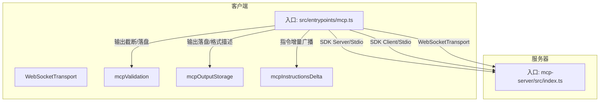

**图表来源**
- [mcp.ts:47-96](file://src/entrypoints/mcp.ts#L47-L96)
- [index.ts:10-19](file://mcp-server/src/index.ts#L10-L19)
- [mcpWebSocketTransport.ts:22-200](file://src/utils/mcpWebSocketTransport.ts#L22-L200)
- [mcpValidation.ts:26-47](file://src/utils/mcpValidation.ts#L26-L47)
- [mcpOutputStorage.ts:13-28](file://src/utils/mcpOutputStorage.ts#L13-L28)
- [mcpInstructionsDelta.ts:55-130](file://src/utils/mcpInstructionsDelta.ts#L55-L130)

## 详细组件分析

### 客户端入口与工具暴露（src/entrypoints/mcp.ts）
- 角色与职责
  - 创建 MCP Server，声明能力（如 tools），注册 ListTools 与 CallTool 请求处理器。
  - 将本地工具集合转换为 MCP 可识别的工具清单，含输入/输出 Schema。
  - 使用工具执行上下文（包含命令、模型、调试参数等），并将结果封装为 MCP 内容块。
- 关键点
  - 工具列表转换：将工具的 Zod Schema 转换为 JSON Schema，并过滤根级别 union 类型以满足 SDK 要求。
  - 工具调用：校验输入、执行工具、记录错误并返回标准化内容块；支持字符串或结构化数据。
  - 传输：默认使用 StdioServerTransport，也可通过 WebSocketTransport 切换。
- 错误处理
  - 捕获工具执行异常，拼接错误信息并标记 isError 返回。

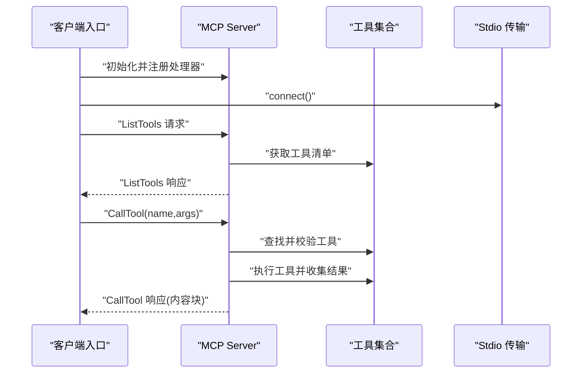

**图表来源**
- [mcp.ts:47-96](file://src/entrypoints/mcp.ts#L47-L96)
- [mcp.ts:99-188](file://src/entrypoints/mcp.ts#L99-L188)

**章节来源**
- [mcp.ts:47-96](file://src/entrypoints/mcp.ts#L47-L96)
- [mcp.ts:99-188](file://src/entrypoints/mcp.ts#L99-L188)

### 服务器入口（mcp-server/src/index.ts）
- 角色与职责
  - 作为独立进程通过 stdio 启动 MCP 服务器，验证源码根路径后创建并连接 Server。
- 运行方式
  - 支持通过环境变量指定源码根目录，便于本地开发与桌面应用集成。

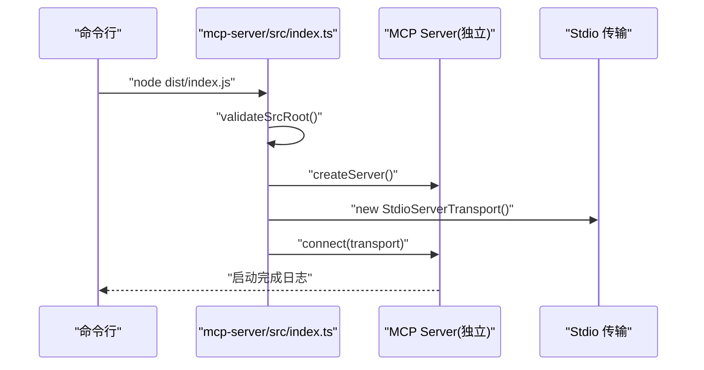

**图表来源**
- [index.ts:13-19](file://mcp-server/src/index.ts#L13-L19)

**章节来源**
- [index.ts:13-19](file://mcp-server/src/index.ts#L13-L19)

### 客户端 SDK 测试脚本（scripts/test-mcp.ts）
- 角色与职责
  - 演示完整的客户端-服务器交互流程：启动服务器进程、创建 SDK 客户端、连接、列举工具、调用工具、列举/读取资源与提示词。
- 关键点
  - 通过 StdioClientTransport 连接服务器进程。
  - 展示 listTools、callTool、listResources、readResource、listPrompts 等典型 RPC 调用。

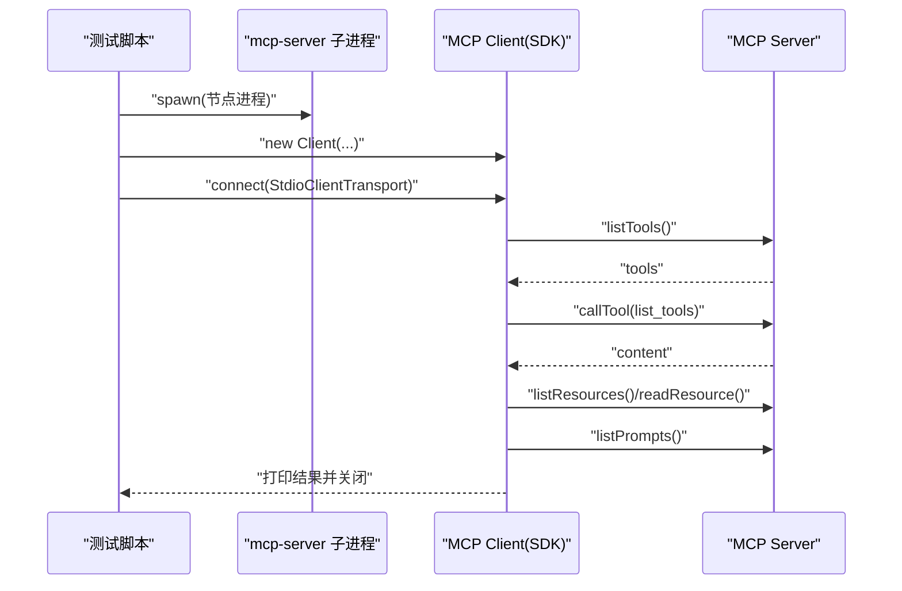

**图表来源**
- [test-mcp.ts:43-175](file://scripts/test-mcp.ts#L43-L175)

**章节来源**
- [test-mcp.ts:43-175](file://scripts/test-mcp.ts#L43-L175)

### WebSocket 传输适配（src/utils/mcpWebSocketTransport.ts）
- 角色与职责
  - 封装 WebSocket 连接，实现 JSON-RPC 消息的发送与接收，处理错误与关闭事件。
- 关键点
  - 兼容 Bun 与 Node 环境的事件监听与消息解析。
  - 对 readyState 进行检查，确保连接状态正确。
  - 解析 JSONRPCMessage 并触发 onmessage 回调。

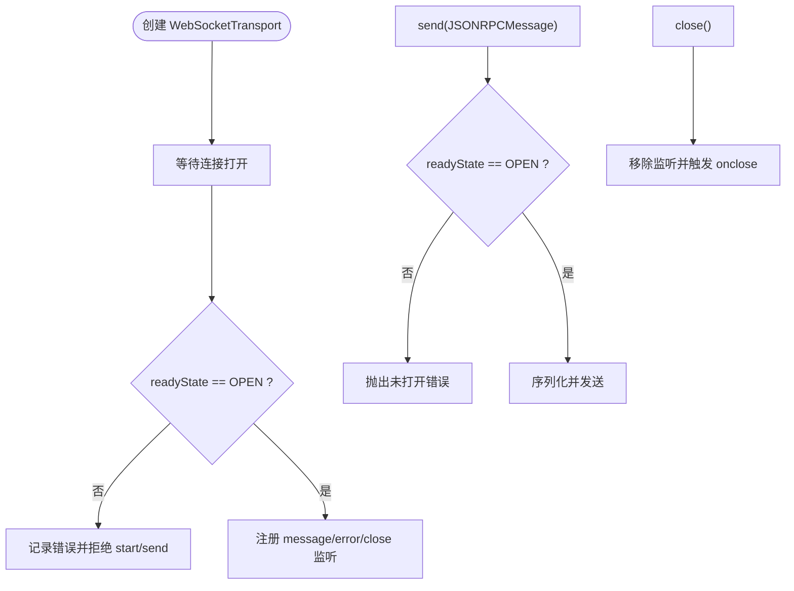

**图表来源**
- [mcpWebSocketTransport.ts:22-200](file://src/utils/mcpWebSocketTransport.ts#L22-L200)

**章节来源**
- [mcpWebSocketTransport.ts:22-200](file://src/utils/mcpWebSocketTransport.ts#L22-L200)

### 输出截断与内容大小估算（src/utils/mcpValidation.ts）
- 角色与职责
  - 估算内容大小（字符串按字符估算，内容块按文本与图像估算），判断是否需要截断。
  - 截断策略：字符串直接截断；内容块按剩余字符预算逐项拼接，图像尝试压缩后放入。
- 配置
  - 通过环境变量或特性门控配置最大输出令牌数，再换算为字符上限。
  - 截断后追加提示语句，指导用户分页或过滤以获取完整结果。

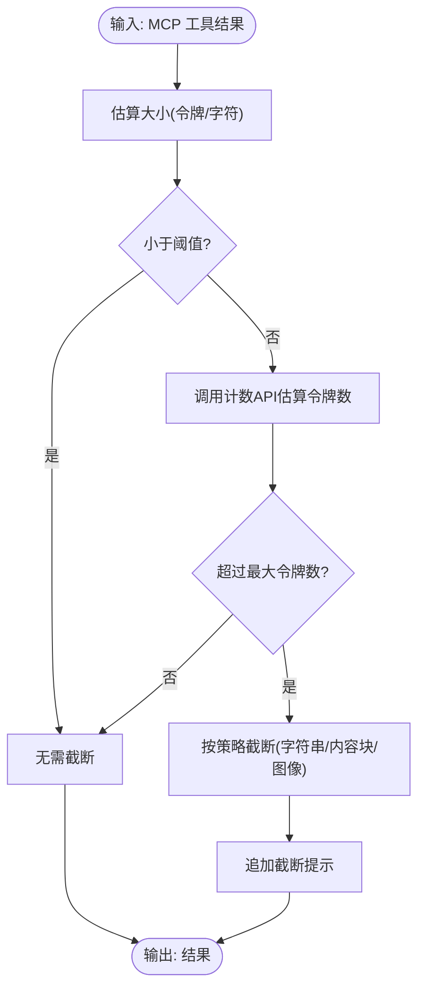

**图表来源**
- [mcpValidation.ts:26-47](file://src/utils/mcpValidation.ts#L26-L47)
- [mcpValidation.ts:151-178](file://src/utils/mcpValidation.ts#L151-L178)
- [mcpValidation.ts:180-208](file://src/utils/mcpValidation.ts#L180-L208)

**章节来源**
- [mcpValidation.ts:26-47](file://src/utils/mcpValidation.ts#L26-L47)
- [mcpValidation.ts:151-178](file://src/utils/mcpValidation.ts#L151-L178)
- [mcpValidation.ts:180-208](file://src/utils/mcpValidation.ts#L180-L208)

### 大输出落盘与格式描述（src/utils/mcpOutputStorage.ts）
- 角色与职责
  - 将二进制内容写入工具结果目录，依据 MIME 类型推导扩展名，便于后续工具读取。
  - 生成“格式描述”与“读取指令”，指导模型从文件中顺序读取并避免截断。
- 关键点
  - MIME 映射覆盖常见文本、图片、音频、视频、办公文档等类型。
  - 对未知类型保守地使用二进制扩展名，避免误判。
  - 记录分析事件，统计保存的大小与类型分布。

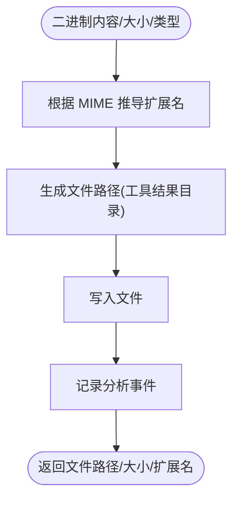

**图表来源**
- [mcpOutputStorage.ts:138-174](file://src/utils/mcpOutputStorage.ts#L138-L174)

**章节来源**
- [mcpOutputStorage.ts:13-28](file://src/utils/mcpOutputStorage.ts#L13-L28)
- [mcpOutputStorage.ts:138-174](file://src/utils/mcpOutputStorage.ts#L138-L174)

### 用户交互与设置命令（src/commands/mcp/mcp.tsx）
- 角色与职责
  - 提供 /mcp 命令入口，支持启用/禁用/重连 MCP 服务器，以及跳转到设置界面。
- 关键点
  - 通过全局状态获取当前 MCP 客户端列表，按目标筛选后批量切换。
  - 对于首次连接的服务器，弹出批准对话框，确保用户知情同意。

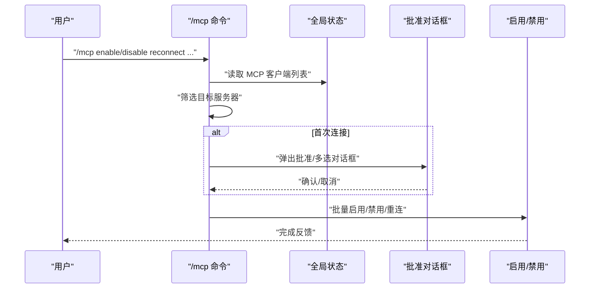

**图表来源**
- [mcp.tsx:63-84](file://src/commands/mcp/mcp.tsx#L63-L84)
- [mcpServerApproval.tsx:15-40](file://src/services/mcpServerApproval.tsx#L15-L40)

**章节来源**
- [mcp.tsx:63-84](file://src/commands/mcp/mcp.tsx#L63-L84)
- [mcpServerApproval.tsx:15-40](file://src/services/mcpServerApproval.tsx#L15-L40)

### 指令增量广播（src/utils/mcpInstructionsDelta.ts）
- 角色与职责
  - 在特定开关下，将已连接服务器的“指令”以增量附件形式广播，避免重复与遗漏。
- 关键点
  - 通过扫描历史消息中的增量附件，维护已宣告服务器集合。
  - 新增/移除的服务器名称与指令块会被记录并上报分析事件。

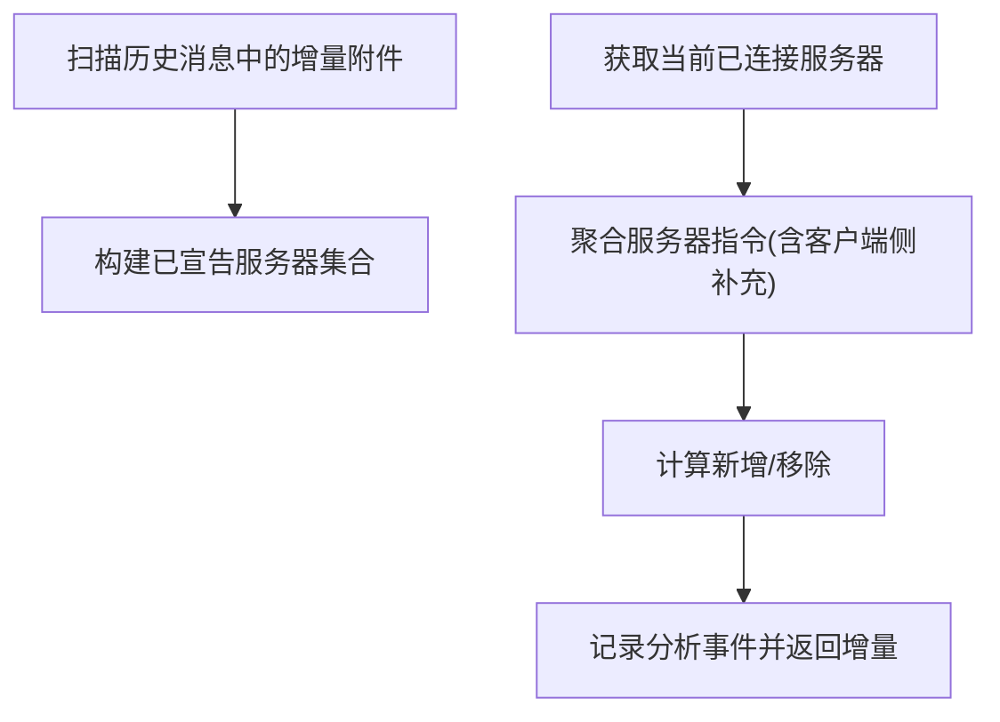

**图表来源**
- [mcpInstructionsDelta.ts:55-130](file://src/utils/mcpInstructionsDelta.ts#L55-L130)

**章节来源**
- [mcpInstructionsDelta.ts:55-130](file://src/utils/mcpInstructionsDelta.ts#L55-L130)

## 依赖关系分析
- 客户端入口依赖 MCP SDK 的 Server 与 StdioServerTransport，负责工具注册与请求处理。
- 服务器入口依赖独立的 server.js（能力声明由其实现），通过 stdio 与客户端交互。
- 传输层适配器抽象了 WebSocket 与 stdio 的差异，统一 JSON-RPC 消息格式。
- 输出侧通过截断与落盘策略解耦大输出，提升稳定性与可读性。
- 用户交互与设置命令负责服务器生命周期管理与首次连接审批。

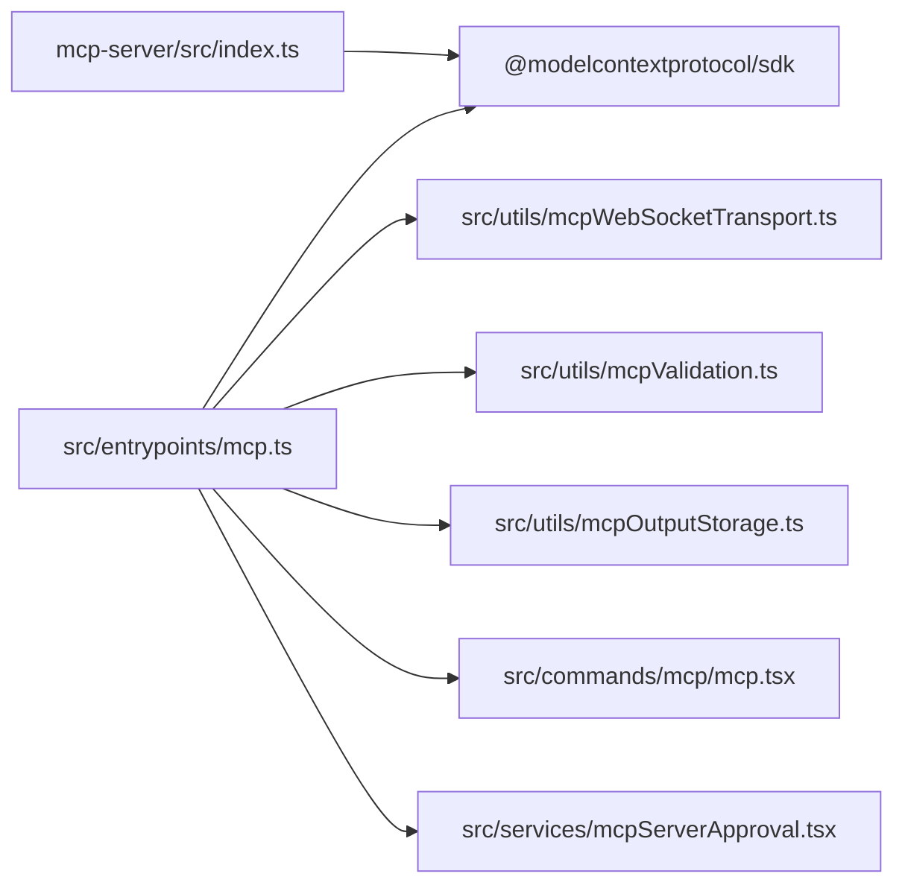

**图表来源**
- [mcp.ts:47-96](file://src/entrypoints/mcp.ts#L47-L96)
- [index.ts:10-19](file://mcp-server/src/index.ts#L10-L19)
- [mcpWebSocketTransport.ts:22-200](file://src/utils/mcpWebSocketTransport.ts#L22-L200)
- [mcpValidation.ts:26-47](file://src/utils/mcpValidation.ts#L26-L47)
- [mcpOutputStorage.ts:13-28](file://src/utils/mcpOutputStorage.ts#L13-L28)
- [mcp.tsx:63-84](file://src/commands/mcp/mcp.tsx#L63-L84)
- [mcpServerApproval.tsx:15-40](file://src/services/mcpServerApproval.tsx#L15-L40)

**章节来源**
- [mcp.ts:47-96](file://src/entrypoints/mcp.ts#L47-L96)
- [index.ts:10-19](file://mcp-server/src/index.ts#L10-L19)
- [mcpWebSocketTransport.ts:22-200](file://src/utils/mcpWebSocketTransport.ts#L22-L200)
- [mcpValidation.ts:26-47](file://src/utils/mcpValidation.ts#L26-L47)
- [mcpOutputStorage.ts:13-28](file://src/utils/mcpOutputStorage.ts#L13-L28)
- [mcp.tsx:63-84](file://src/commands/mcp/mcp.tsx#L63-L84)
- [mcpServerApproval.tsx:15-40](file://src/services/mcpServerApproval.tsx#L15-L40)

## 性能考量
- 工具列表转换与 Schema 生成
  - 使用缓存限制的文件状态读取，避免内存无限增长。
  - 过滤根级 union 类型，减少无效 Schema 导致的解析开销。
- 输出截断与估算
  - 采用启发式阈值避免不必要的昂贵计数 API 调用；仅在必要时进行精确令牌计数。
  - 图像内容按预估字符预算处理，必要时压缩后再写入，平衡体积与质量。
- 传输层
  - WebSocketTransport 在不同运行时环境（Bun/Node）下优化事件监听与发送路径，降低延迟与异常风险。
- I/O 与落盘
  - 大输出优先落盘并提供读取指令，减少上下文占用，提高吞吐。

**章节来源**
- [mcp.ts:40-46](file://src/entrypoints/mcp.ts#L40-L46)
- [mcpValidation.ts:151-178](file://src/utils/mcpValidation.ts#L151-L178)
- [mcpValidation.ts:180-208](file://src/utils/mcpValidation.ts#L180-L208)
- [mcpWebSocketTransport.ts:22-200](file://src/utils/mcpWebSocketTransport.ts#L22-L200)
- [mcpOutputStorage.ts:138-174](file://src/utils/mcpOutputStorage.ts#L138-L174)

## 故障排查指南
- 连接失败
  - 检查传输层 readyState 与错误回调，确认连接已打开且未被提前关闭。
  - 对于 WebSocket，关注连接失败与消息解析错误的日志。
- 工具调用异常
  - 查看工具执行日志与错误拼接结果，确认输入校验与权限检查是否通过。
  - 若出现截断提示，建议使用分页/过滤工具或调整查询范围。
- 输出过大
  - 确认是否已启用截断与落盘策略；检查工具结果目录是否存在对应文件。
  - 对图像等二进制内容，确认 MIME 映射与扩展名正确。
- 首次连接未显示批准
  - 确认项目级 MCP 配置与状态，检查批准对话框是否被触发。
- 指令未广播
  - 检查增量广播开关与历史消息中的增量附件，确认服务器名称集合是否正确更新。

**章节来源**
- [mcpWebSocketTransport.ts:117-137](file://src/utils/mcpWebSocketTransport.ts#L117-L137)
- [mcp.ts:170-186](file://src/entrypoints/mcp.ts#L170-L186)
- [mcpValidation.ts:180-208](file://src/utils/mcpValidation.ts#L180-L208)
- [mcpOutputStorage.ts:138-174](file://src/utils/mcpOutputStorage.ts#L138-L174)
- [mcpServerApproval.tsx:15-40](file://src/services/mcpServerApproval.tsx#L15-L40)
- [mcpInstructionsDelta.ts:55-130](file://src/utils/mcpInstructionsDelta.ts#L55-L130)

## 结论
本仓库实现了 MCP 协议在客户端侧的完整闭环：从工具注册、请求-响应处理、传输适配、输出截断与落盘，到用户交互与服务器批准，形成了一套可扩展、可观察、可运维的 MCP 生态集成方案。通过 SDK 的标准接口与统一的 JSON-RPC 消息格式，MCP 在 AI 工具生态中承担了“标准化上下文访问与工具调用”的关键角色，既兼容现有 API 标准，又为未来能力扩展与版本演进提供了清晰路径。

## 附录
- 版本与兼容性
  - 客户端服务器版本号来源于宏定义，随构建注入；服务器入口通过环境变量控制源码根路径，便于多环境部署。
- 安全与权限
  - 工具调用前进行输入校验与权限检查；首次连接弹出批准对话框，确保用户知情同意。
- 未来方向
  - 增强资源与提示词能力的动态发现与更新；完善指令增量广播的稳定性与可观测性；探索更多传输方式与能力协商机制。