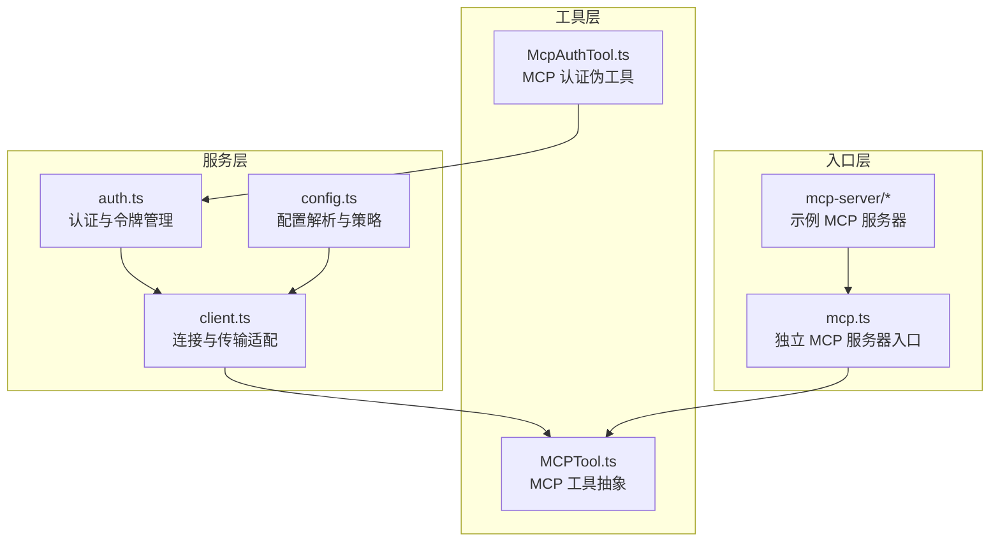
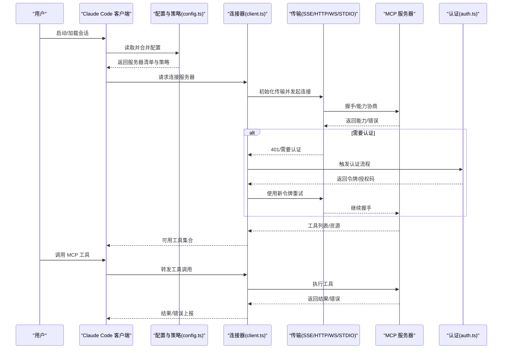
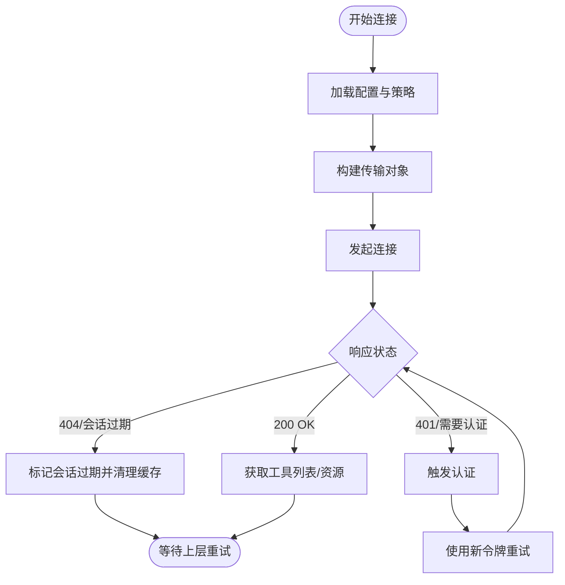
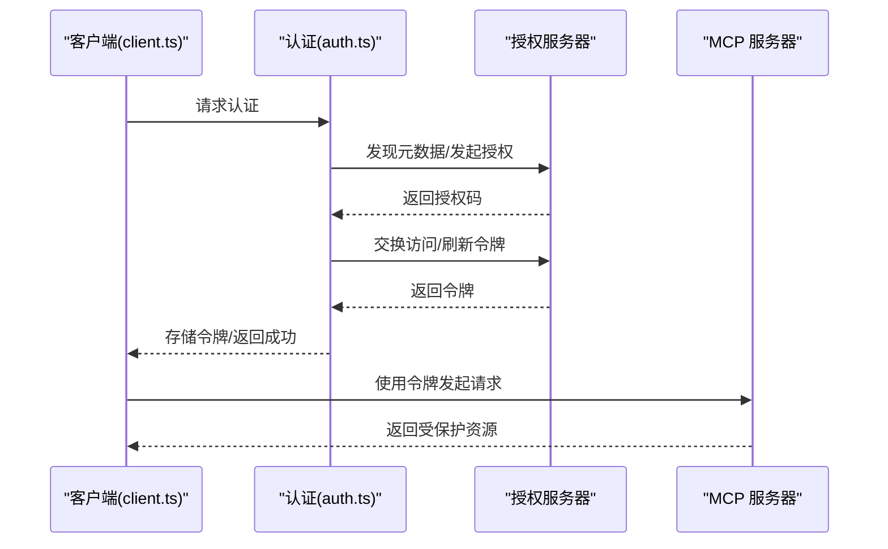
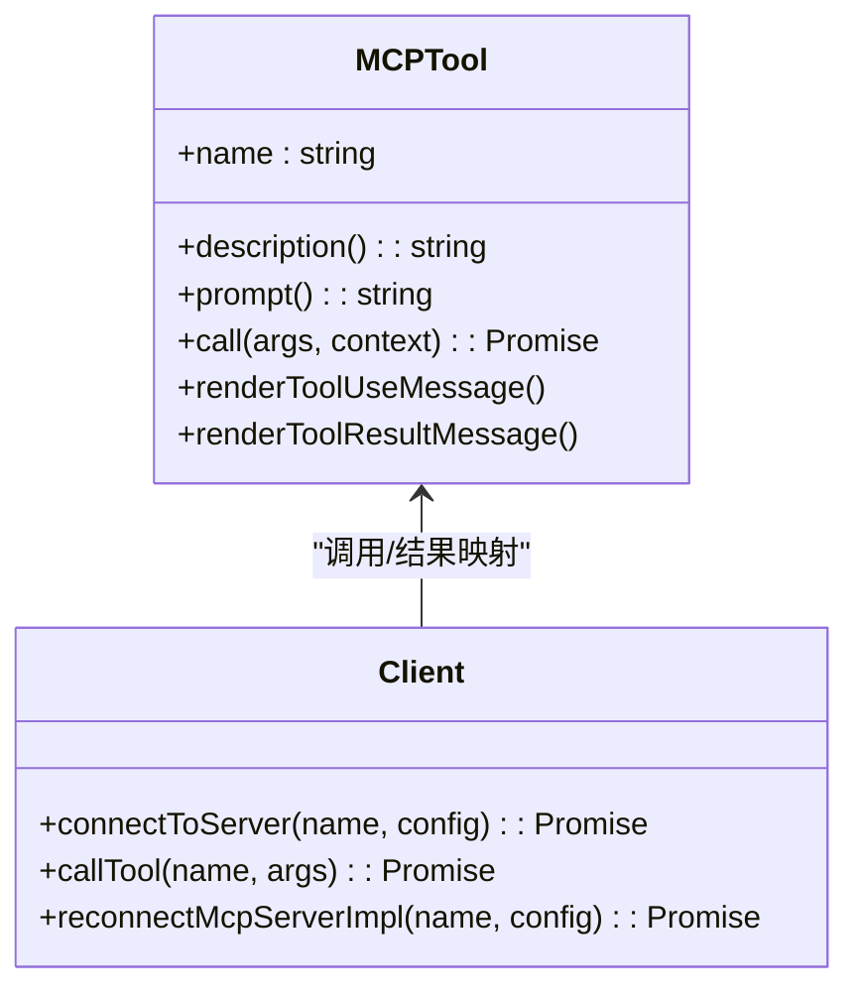
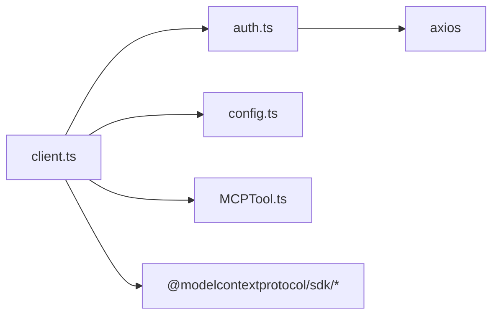

# MCP 客户端集成

<cite>
**本文引用的文件**
- [mcp.ts](file://src/entrypoints/mcp.ts)
- [client.ts](file://src/services/mcp/client.ts)
- [config.ts](file://src/services/mcp/config.ts)
- [auth.ts](file://src/services/mcp/auth.ts)
- [MCPTool.ts](file://src/tools/MCPTool/MCPTool.ts)
- [McpAuthTool.ts](file://src/tools/McpAuthTool/McpAuthTool.ts)
- [index.ts](file://mcp-server/src/index.ts)
- [server.ts](file://mcp-server/src/server.ts)
- [http.ts](file://mcp-server/src/http.ts)
</cite>

## 目录
1. [简介](#简介)
2. [项目结构](#项目结构)
3. [核心组件](#核心组件)
4. [架构总览](#架构总览)
5. [详细组件分析](#详细组件分析)
6. [依赖关系分析](#依赖关系分析)
7. [性能考量](#性能考量)
8. [故障排查指南](#故障排查指南)
9. [结论](#结论)
10. [附录](#附录)

## 简介
本指南面向在 Claude Code 中集成 MCP（Model Context Protocol）客户端的开发者，系统讲解如何在 Claude Code 中实现 MCP 客户端功能，覆盖以下主题：
- 客户端初始化、连接管理与会话控制
- 认证流程、令牌管理与安全策略
- 与 MCP 服务器的通信协议、消息传递、错误处理与重连机制
- 配置项、性能调优与监控方法
- 与其他 MCP 客户端的互操作性与兼容性测试
- 完整的客户端集成示例与常见问题解决方案

## 项目结构
Claude Code 的 MCP 客户端由“服务层”和“工具层”共同构成：
- 服务层：负责与 MCP 服务器建立连接、传输协议适配、认证与令牌管理、批量连接、缓存与超时控制等
- 工具层：将 MCP 工具暴露为 Claude Code 的通用工具接口，支持权限检查、结果渲染与截断处理
- 入口层：提供独立的 MCP 服务器入口（用于被外部 MCP 客户端调用），以及本地 MCP 工具入口

**图表来源**
- [client.ts](file://src/services/mcp/client.ts)
- [config.ts](file://src/services/mcp/config.ts)
- [auth.ts](file://src/services/mcp/auth.ts)
- [MCPTool.ts](file://src/tools/MCPTool/MCPTool.ts)
- [McpAuthTool.ts](file://src/tools/McpAuthTool/McpAuthTool.ts)
- [mcp.ts](file://src/entrypoints/mcp.ts)
- [index.ts](file://mcp-server/src/index.ts)

**章节来源**
- [client.ts](file://src/services/mcp/client.ts)
- [config.ts](file://src/services/mcp/config.ts)
- [auth.ts](file://src/services/mcp/auth.ts)
- [MCPTool.ts](file://src/tools/MCPTool/MCPTool.ts)
- [McpAuthTool.ts](file://src/tools/McpAuthTool/McpAuthTool.ts)
- [mcp.ts](file://src/entrypoints/mcp.ts)
- [index.ts](file://mcp-server/src/index.ts)

## 核心组件
- 连接与传输适配（client.ts）
  - 支持 SSE、HTTP、WebSocket、STDIO、SDK 控制等多种传输方式
  - 提供连接超时、请求超时、Accept 头规范化、代理与 mTLS 配置
  - 实现批量连接、连接缓存键生成、会话过期检测与清理
- 配置与策略（config.ts）
  - 解析 .mcp.json、用户与项目级配置，合并插件注入的服务器配置
  - 去重策略：基于命令或 URL 的签名去重，避免重复连接
  - 企业策略：允许/拒绝列表，名称/命令/URL 模式匹配
- 认证与令牌管理（auth.ts）
  - OAuth 发现、授权码/PKCE 流程、刷新与撤销
  - 跨应用访问（XAA）流程：统一 IdP 登录后进行 RFC 8693 交换
  - 敏感参数脱敏日志、锁文件并发控制、失败事件分析
- MCP 工具抽象（MCPTool.ts）
  - 将 MCP 工具调用映射到 Claude Code 工具接口
  - 输入输出模式化、权限检查、结果截断与 UI 渲染
- MCP 认证伪工具（McpAuthTool.ts）
  - 当服务器处于“需要认证”状态时，以伪工具形式提示用户启动认证
  - 触发认证流程并在完成后自动替换为真实工具集

**章节来源**
- [client.ts](file://src/services/mcp/client.ts)
- [config.ts](file://src/services/mcp/config.ts)
- [auth.ts](file://src/services/mcp/auth.ts)
- [MCPTool.ts](file://src/tools/MCPTool/MCPTool.ts)
- [McpAuthTool.ts](file://src/tools/McpAuthTool/McpAuthTool.ts)

## 架构总览
下图展示了 Claude Code 作为 MCP 客户端与多种 MCP 服务器的交互关系，以及认证与工具调用的关键路径。

**图表来源**
- [client.ts](file://src/services/mcp/client.ts)
- [auth.ts](file://src/services/mcp/auth.ts)
- [config.ts](file://src/services/mcp/config.ts)

## 详细组件分析

### 客户端初始化与连接管理
- 初始化要点
  - 通过配置模块加载服务器清单，应用去重与企业策略过滤
  - 为每种传输类型构造传输对象（SSE、HTTP、WS、STDIO、SDK）
  - 设置超时、Accept 头、代理与 mTLS 参数，确保符合 MCP 规范
- 连接缓存与批量连接
  - 使用缓存键（名称+配置序列化）避免重复连接
  - 支持批量连接（本地与远程分别有批大小环境变量）
- 会话控制
  - 会话过期检测：通过 HTTP 404 + JSON-RPC -32001 判断
  - 过期后清理连接缓存，要求上层重新获取客户端并重试

**图表来源**
- [client.ts](file://src/services/mcp/client.ts)
- [config.ts](file://src/services/mcp/config.ts)

**章节来源**
- [client.ts](file://src/services/mcp/client.ts)
- [config.ts](file://src/services/mcp/config.ts)

### 认证流程、令牌管理与安全策略
- OAuth 发现与授权
  - 支持 RFC 9728 → RFC 8414 自动发现，或用户指定元数据 URL
  - 授权码 + PKCE 流程，支持自定义回调端口与浏览器打开控制
- 刷新与撤销
  - 刷新令牌失败时进行重试与失效处理
  - 撤销顺序：先刷新令牌再访问令牌；支持 RFC 7009 兼容回退
- 跨应用访问（XAA）
  - 统一 IdP 登录，随后进行 RFC 8693 + RFC 7523 交换
  - 错误阶段可归因（IdP 登录/发现/交换/JWT Bearer）
- 安全与合规
  - 敏感 OAuth 参数脱敏日志
  - 并发控制：锁文件与写链保证缓存一致性
  - 企业策略：允许/拒绝列表，名称/命令/URL 模式匹配

**图表来源**
- [auth.ts](file://src/services/mcp/auth.ts)
- [client.ts](file://src/services/mcp/client.ts)

**章节来源**
- [auth.ts](file://src/services/mcp/auth.ts)
- [client.ts](file://src/services/mcp/client.ts)

### MCP 工具抽象与调用
- 工具注册
  - 将 MCP 工具描述转换为 Claude Code 工具，支持输入/输出模式化
  - 权限检查与 UI 渲染桥接
- 工具调用
  - 将工具调用转发至 MCP 服务器，捕获错误并转换为标准错误格式
  - 对大结果进行截断与持久化存储，避免内存膨胀
- 结果处理
  - 文本/二进制内容处理，图像尺寸调整与安全清洗
  - 结果持久化与后续读取优化

**图表来源**
- [MCPTool.ts](file://src/tools/MCPTool/MCPTool.ts)
- [client.ts](file://src/services/mcp/client.ts)

**章节来源**
- [MCPTool.ts](file://src/tools/MCPTool/MCPTool.ts)
- [client.ts](file://src/services/mcp/client.ts)

### 与 MCP 服务器的通信协议
- 传输适配
  - SSE：长连接事件流，区分请求超时与流式连接
  - HTTP：严格遵循 MCP Streamable HTTP 规范，Accept 头必须包含 JSON 与 SSE
  - WebSocket：支持 mTLS 与代理，协议头包含 mcp
  - STDIO：子进程通信，适用于本地工具
  - SDK 控制：SDK 内部占位，不实际发起网络连接
- 协议规范
  - 工具调用超时默认约 27.8 小时，可通过环境变量覆盖
  - 请求超时默认 60 秒，GET 请求除外（SSE 流）
  - 会话过期错误通过 HTTP 404 + JSON-RPC -32001 识别

**章节来源**
- [client.ts](file://src/services/mcp/client.ts)

### 配置选项、性能调优与监控
- 关键环境变量
  - MCP_TIMEOUT：连接超时（毫秒，默认 30000）
  - MCP_TOOL_TIMEOUT：工具调用超时（毫秒，默认约 27.8 小时）
  - MCP_REQUEST_TIMEOUT_MS：单请求超时（毫秒，默认 60000）
  - MCP_SERVER_CONNECTION_BATCH_SIZE：本地服务器连接批大小
  - MCP_REMOTE_SERVER_CONNECTION_BATCH_SIZE：远程服务器连接批大小
- 性能优化建议
  - 合理设置批大小，避免过多并发导致资源争用
  - 使用连接缓存键避免重复连接
  - 对大结果启用持久化与截断，防止内存峰值
- 监控与分析
  - 认证失败与刷新失败事件埋点，便于定位问题
  - 日志脱敏与最小化敏感信息暴露

**章节来源**
- [client.ts](file://src/services/mcp/client.ts)
- [config.ts](file://src/services/mcp/config.ts)

### 与其他 MCP 客户端的互操作性与兼容性测试
- 互操作性
  - 传输协议与头部规范遵循 MCP 规范，兼容主流 MCP 服务器
  - 通过去重策略避免重复连接同一服务器的不同别名
- 兼容性测试建议
  - 使用示例 MCP 服务器进行端到端测试（SSE/HTTP/WS/STDIO）
  - 验证认证流程（OAuth/XAA）、错误处理与重连逻辑
  - 在不同网络环境下测试超时与代理行为

**章节来源**
- [index.ts](file://mcp-server/src/index.ts)
- [server.ts](file://mcp-server/src/server.ts)
- [http.ts](file://mcp-server/src/http.ts)

## 依赖关系分析
- 组件耦合
  - client.ts 依赖 auth.ts 与 config.ts，形成“连接器-认证-配置”的清晰分层
  - 工具层通过 MCPTool.ts 与 client.ts 解耦，便于扩展与替换
- 外部依赖
  - MCP SDK 提供传输与协议抽象
  - Axios 用于令牌撤销等 HTTP 请求
  - Lodash-es 提供常用函数式工具

**图表来源**
- [client.ts](file://src/services/mcp/client.ts)
- [auth.ts](file://src/services/mcp/auth.ts)
- [config.ts](file://src/services/mcp/config.ts)
- [MCPTool.ts](file://src/tools/MCPTool/MCPTool.ts)

**章节来源**
- [client.ts](file://src/services/mcp/client.ts)
- [auth.ts](file://src/services/mcp/auth.ts)
- [config.ts](file://src/services/mcp/config.ts)
- [MCPTool.ts](file://src/tools/MCPTool/MCPTool.ts)

## 性能考量
- 连接与请求超时
  - 单请求超时避免信号复用导致的“过期”问题
  - 工具调用超时默认极长，适合长时间任务，但应按需调整
- 批量连接
  - 本地与远程服务器分别支持批大小控制，避免资源争用
- 缓存与去重
  - 连接缓存键与认证缓存 TTL 减少重复开销
  - 基于签名的去重避免重复连接相同服务器
- 结果处理
  - 大输出截断与持久化降低内存占用
  - 图像尺寸调整与 Unicode 清洗提升稳定性

[本节为通用指导，无需特定文件来源]

## 故障排查指南
- 连接失败
  - 检查超时设置与代理配置，确认 Accept 头是否正确
  - 确认服务器 URL 与传输类型匹配
- 认证失败
  - 查看认证失败事件与原因，确认 OAuth 元数据发现与授权码流程
  - 若为 XAA，检查 IdP 配置与交换阶段
- 会话过期
  - 捕获 HTTP 404 + JSON-RPC -32001，清理缓存并重新获取客户端
- 工具调用错误
  - 捕获 McpToolCallError，保留 _meta 以便诊断
  - 检查输入校验与输出截断策略

**章节来源**
- [client.ts](file://src/services/mcp/client.ts)
- [auth.ts](file://src/services/mcp/auth.ts)

## 结论
Claude Code 的 MCP 客户端通过清晰的服务层与工具层分离，提供了对多传输、多认证方式的完整支持，并内置了企业策略、性能优化与可观测性能力。按照本指南的步骤进行集成与调优，可在复杂环境中稳定运行 MCP 客户端并与各类 MCP 服务器实现互操作。

[本节为总结，无需特定文件来源]

## 附录

### 客户端集成步骤（示例）
- 步骤 1：准备配置
  - 在 .mcp.json 或用户/项目配置中添加服务器条目（支持 stdio/sse/http/ws）
  - 应用企业策略与去重规则
- 步骤 2：初始化客户端
  - 加载配置并构建传输对象
  - 设置超时、代理与 mTLS 参数
- 步骤 3：建立连接
  - 发起连接并处理 401/需要认证
  - 成功后获取工具列表与资源
- 步骤 4：调用工具
  - 将工具调用转发至 MCP 服务器
  - 处理错误与大结果截断
- 步骤 5：监控与维护
  - 观察认证与刷新事件
  - 定期清理过期会话与缓存

**章节来源**
- [config.ts](file://src/services/mcp/config.ts)
- [client.ts](file://src/services/mcp/client.ts)
- [auth.ts](file://src/services/mcp/auth.ts)