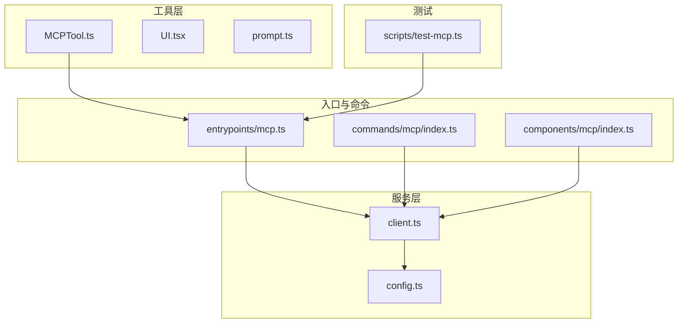
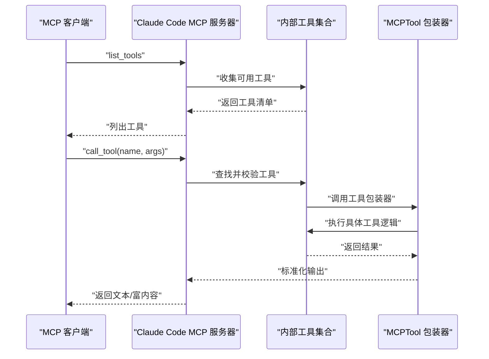
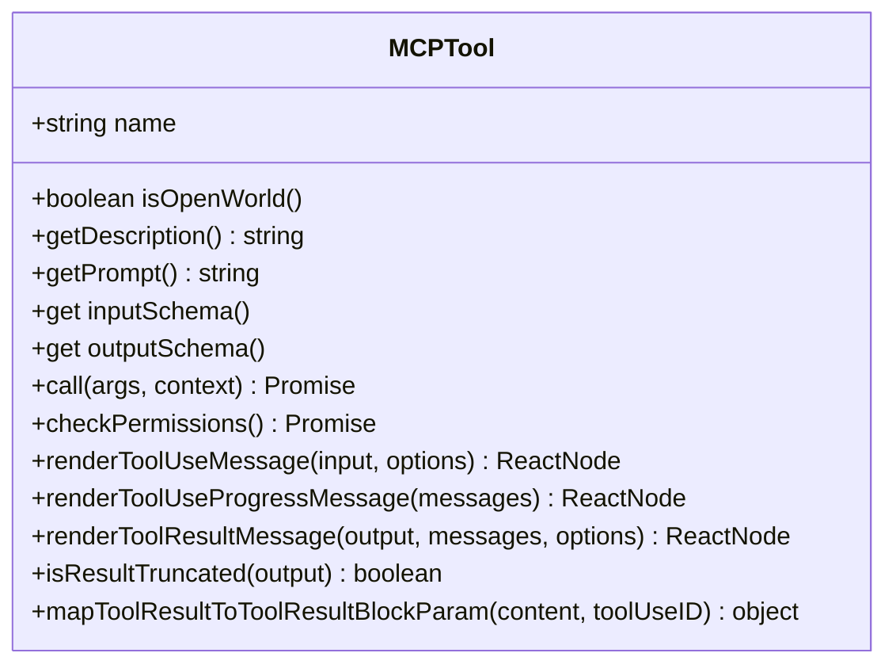
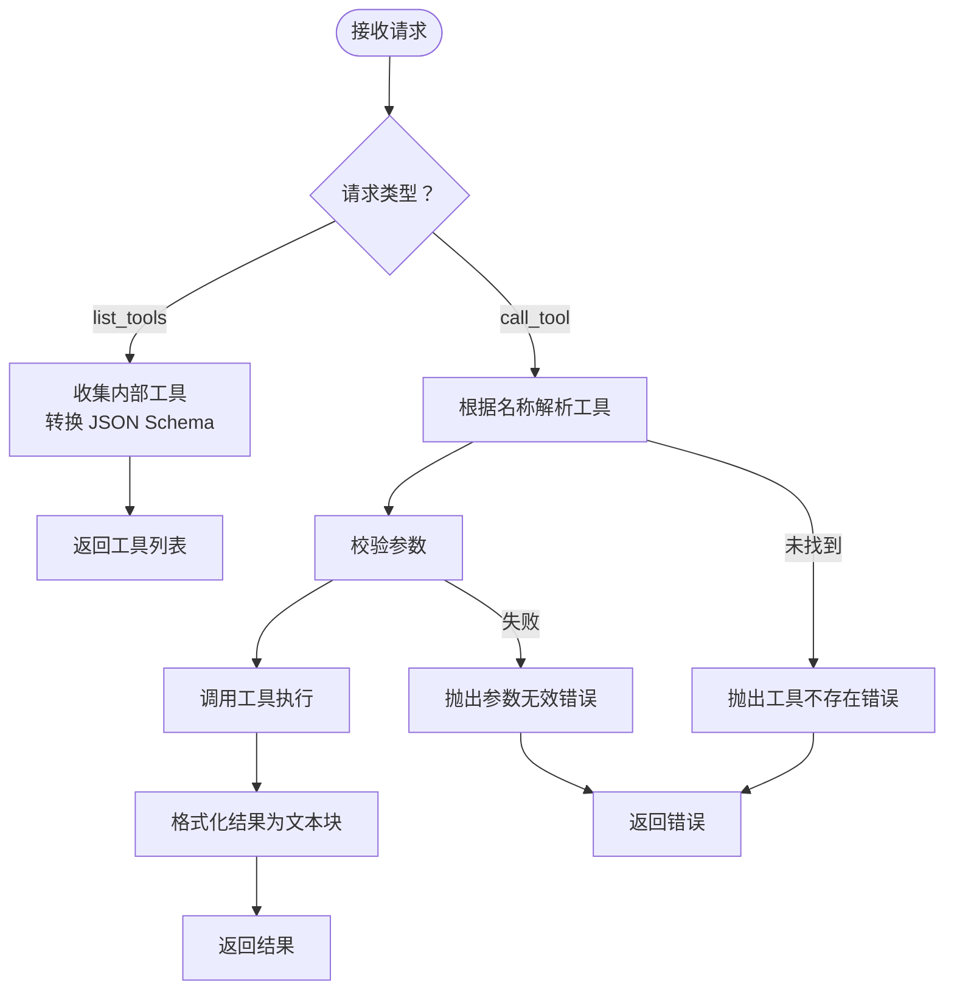
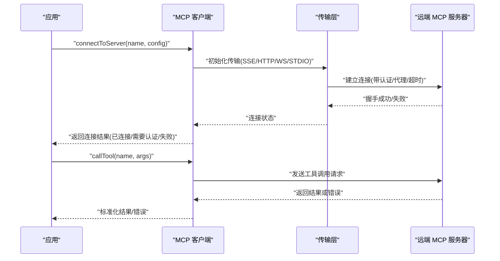
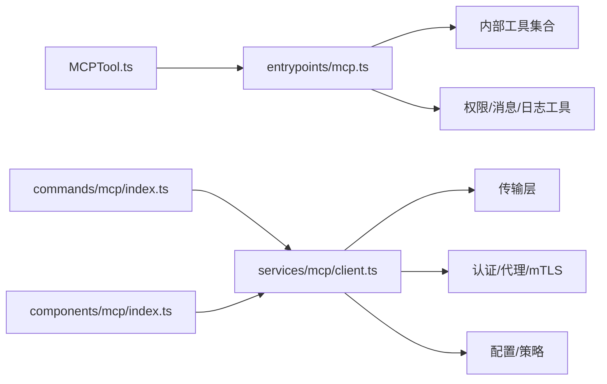

# MCP 工具开发

<cite>
**本文档引用的文件**
- [src/tools/MCPTool/MCPTool.ts](file://src/tools/MCPTool/MCPTool.ts)
- [src/tools/MCPTool/UI.tsx](file://src/tools/MCPTool/UI.tsx)
- [src/tools/MCPTool/prompt.ts](file://src/tools/MCPTool/prompt.ts)
- [src/entrypoints/mcp.ts](file://src/entrypoints/mcp.ts)
- [scripts/test-mcp.ts](file://scripts/test-mcp.ts)
- [src/services/mcp/client.ts](file://src/services/mcp/client.ts)
- [src/services/mcp/config.ts](file://src/services/mcp/config.ts)
- [src/components/mcp/index.ts](file://src/components/mcp/index.ts)
- [src/commands/mcp/index.ts](file://src/commands/mcp/index.ts)
</cite>

## 目录
1. [简介](#简介)
2. [项目结构](#项目结构)
3. [核心组件](#核心组件)
4. [架构总览](#架构总览)
5. [详细组件分析](#详细组件分析)
6. [依赖关系分析](#依赖关系分析)
7. [性能考量](#性能考量)
8. [故障排查指南](#故障排查指南)
9. [结论](#结论)
10. [附录](#附录)

## 简介
本文件面向希望在 Claude Code 中开发与集成 MCP（Model Context Protocol）工具的工程师与技术作者。内容涵盖：
- 如何将现有 Claude Code 工具适配为 MCP 工具：工具包装、参数转换、结果处理
- MCP 工具的标准接口规范：工具定义、参数校验、错误处理
- 开发框架与最佳实践：工具注册、元数据管理、版本控制
- 测试方法、调试技巧与性能优化
- 与 Claude Code 原生工具的对比分析与迁移指南
- 完整的工具开发示例与集成测试案例

## 项目结构
围绕 MCP 的相关模块主要分布在以下路径：
- 工具层：src/tools/MCPTool
- 服务层：src/services/mcp
- 入口与服务器：src/entrypoints/mcp.ts
- 命令与 UI 组件：src/commands/mcp、src/components/mcp
- 集成测试脚本：scripts/test-mcp.ts

**图表来源**
- [src/tools/MCPTool/MCPTool.ts:1-79](file://src/tools/MCPTool/MCPTool.ts#L1-L79)
- [src/tools/MCPTool/UI.tsx:1-404](file://src/tools/MCPTool/UI.tsx#L1-L404)
- [src/entrypoints/mcp.ts:1-198](file://src/entrypoints/mcp.ts#L1-L198)
- [src/services/mcp/client.ts:1-800](file://src/services/mcp/client.ts#L1-L800)
- [src/services/mcp/config.ts:1-800](file://src/services/mcp/config.ts#L1-L800)
- [src/commands/mcp/index.ts:1-15](file://src/commands/mcp/index.ts#L1-L15)
- [src/components/mcp/index.ts:1-11](file://src/components/mcp/index.ts#L1-L11)
- [scripts/test-mcp.ts:1-181](file://scripts/test-mcp.ts#L1-L181)

**章节来源**
- [src/tools/MCPTool/MCPTool.ts:1-79](file://src/tools/MCPTool/MCPTool.ts#L1-L79)
- [src/entrypoints/mcp.ts:1-198](file://src/entrypoints/mcp.ts#L1-L198)
- [src/services/mcp/client.ts:1-800](file://src/services/mcp/client.ts#L1-L800)
- [src/services/mcp/config.ts:1-800](file://src/services/mcp/config.ts#L1-L800)
- [src/commands/mcp/index.ts:1-15](file://src/commands/mcp/index.ts#L1-L15)
- [src/components/mcp/index.ts:1-11](file://src/components/mcp/index.ts#L1-L11)
- [scripts/test-mcp.ts:1-181](file://scripts/test-mcp.ts#L1-L181)

## 核心组件
- MCPTool：MCP 工具的统一抽象与默认实现，负责输入输出模式、权限检查、UI 渲染与截断策略。
- 入口服务器：基于 MCP SDK 的 Server 实现，暴露 list_tools 与 call_tool 能力，并桥接 Claude Code 内部工具生态。
- 服务客户端：封装 MCP 连接、认证、超时、传输（stdio/sse/http/ws）、资源与提示词管理等。
- 配置与策略：企业级策略（允许/拒绝列表）、签名去重、环境变量展开、配置写入与原子更新。
- 命令与 UI：CLI 命令“mcp”、MCP 服务器管理面板与工具详情视图。

**章节来源**
- [src/tools/MCPTool/MCPTool.ts:27-77](file://src/tools/MCPTool/MCPTool.ts#L27-L77)
- [src/entrypoints/mcp.ts:35-196](file://src/entrypoints/mcp.ts#L35-L196)
- [src/services/mcp/client.ts:595-800](file://src/services/mcp/client.ts#L595-L800)
- [src/services/mcp/config.ts:625-761](file://src/services/mcp/config.ts#L625-L761)
- [src/commands/mcp/index.ts:1-15](file://src/commands/mcp/index.ts#L1-L15)
- [src/components/mcp/index.ts:1-11](file://src/components/mcp/index.ts#L1-L11)

## 架构总览
下图展示从 MCP 客户端到 Claude Code 工具调用的整体流程，以及关键组件间的交互关系。

**图表来源**
- [src/entrypoints/mcp.ts:59-188](file://src/entrypoints/mcp.ts#L59-L188)
- [src/tools/MCPTool/MCPTool.ts:27-77](file://src/tools/MCPTool/MCPTool.ts#L27-L77)

## 详细组件分析

### MCPTool 组件
- 角色与职责
  - 提供 MCP 工具的统一接口：名称、描述、输入输出模式、权限检查、UI 渲染、截断检测与结果映射。
  - 作为“包装器”，将 Claude Code 内部工具无缝接入 MCP 协议。
- 关键点
  - 输入 schema 使用 passthrough，允许 MCP 工具自定义参数结构。
  - 输出 schema 为字符串，便于 MCP SDK 的 JSON Schema 转换。
  - 权限检查行为为“passthrough”，实际权限由上层工具决定。
  - UI 渲染通过独立模块实现，支持进度条、富文本与大结果警告。
- 适用场景
  - 将任意 Claude Code 工具快速暴露为 MCP 工具，无需修改原工具逻辑。

**图表来源**
- [src/tools/MCPTool/MCPTool.ts:27-77](file://src/tools/MCPTool/MCPTool.ts#L27-L77)

**章节来源**
- [src/tools/MCPTool/MCPTool.ts:1-79](file://src/tools/MCPTool/MCPTool.ts#L1-L79)
- [src/tools/MCPTool/UI.tsx:41-150](file://src/tools/MCPTool/UI.tsx#L41-L150)

### MCP 入口服务器（entrypoints/mcp.ts）
- 功能概述
  - 初始化 MCP Server，声明工具能力。
  - 实现 list_tools：将内部工具转换为 MCP 工具描述，进行 JSON Schema 转换与过滤。
  - 实现 call_tool：解析参数、校验输入、调用工具、捕获错误并格式化返回。
  - 支持缓存与上下文注入，确保工具调用在 Claude Code 主循环中运行。
- 关键流程
  - 列表阶段：遍历工具，使用 zodToJsonSchema 转换输入/输出模式；过滤不兼容的根类型。
  - 调用阶段：构建 ToolUseContext，调用工具 validateInput 与 call，最终以文本块返回。
  - 错误处理：记录日志、拆分错误信息、标记 isError 并返回。

**图表来源**
- [src/entrypoints/mcp.ts:59-188](file://src/entrypoints/mcp.ts#L59-L188)

**章节来源**
- [src/entrypoints/mcp.ts:35-196](file://src/entrypoints/mcp.ts#L35-L196)

### MCP 服务客户端（services/mcp/client.ts）
- 连接与传输
  - 支持 SSE、HTTP、WebSocket、本地 stdio、IDE 特定传输等。
  - 自动注入认证头、代理、mTLS、用户代理与超时控制。
- 认证与会话
  - 处理 claude.ai 代理认证、OAuth 刷新、会话过期检测与缓存。
  - 对“会话未找到”错误进行识别与特殊处理。
- 批量与并发
  - 提供批量连接大小配置，避免一次性过多连接导致资源紧张。
- 结果处理
  - 统一封装工具调用结果，支持二进制持久化、内容截断与 UI 展示。

**图表来源**
- [src/services/mcp/client.ts:595-800](file://src/services/mcp/client.ts#L595-L800)

**章节来源**
- [src/services/mcp/client.ts:1-800](file://src/services/mcp/client.ts#L1-L800)

### MCP 配置与策略（services/mcp/config.ts）
- 配置来源与合并
  - 支持项目级、用户级、本地配置与插件注入的合并。
  - 写入 .mcp.json 采用临时文件 + 原子重命名，保留文件权限。
- 策略与去重
  - 企业策略：允许/拒绝列表，支持名称、命令、URL 模式匹配。
  - 插件与手动配置去重：按签名去重，优先级为手动 > 插件 > 第一个加载。
- 环境变量展开与校验
  - 在配置加载时展开环境变量，记录缺失项以便诊断。

**章节来源**
- [src/services/mcp/config.ts:88-131](file://src/services/mcp/config.ts#L88-L131)
- [src/services/mcp/config.ts:223-266](file://src/services/mcp/config.ts#L223-L266)
- [src/services/mcp/config.ts:417-508](file://src/services/mcp/config.ts#L417-L508)
- [src/services/mcp/config.ts:618-616](file://src/services/mcp/config.ts#L618-L616)

### 命令与 UI（commands/mcp/index.ts、components/mcp/index.ts）
- 命令“mcp”
  - 类型为本地 JSX，立即执行，提供启用/禁用服务器等操作。
- MCP UI 组件
  - 提供服务器列表、设置、重连、远程/本地菜单与工具详情视图等。

**章节来源**
- [src/commands/mcp/index.ts:1-15](file://src/commands/mcp/index.ts#L1-L15)
- [src/components/mcp/index.ts:1-11](file://src/components/mcp/index.ts#L1-L11)

## 依赖关系分析
- MCPTool 依赖工具抽象与 UI 渲染模块，向入口服务器暴露统一接口。
- 入口服务器依赖工具集合、权限与消息工具，将内部工具桥接到 MCP 协议。
- 服务客户端依赖传输层、认证与配置模块，负责连接生命周期管理。
- 命令与 UI 为用户提供 MCP 服务器管理界面与快捷入口。

**图表来源**
- [src/tools/MCPTool/MCPTool.ts:1-79](file://src/tools/MCPTool/MCPTool.ts#L1-L79)
- [src/entrypoints/mcp.ts:1-198](file://src/entrypoints/mcp.ts#L1-L198)
- [src/services/mcp/client.ts:1-800](file://src/services/mcp/client.ts#L1-L800)
- [src/services/mcp/config.ts:1-800](file://src/services/mcp/config.ts#L1-L800)
- [src/commands/mcp/index.ts:1-15](file://src/commands/mcp/index.ts#L1-L15)
- [src/components/mcp/index.ts:1-11](file://src/components/mcp/index.ts#L1-L11)

**章节来源**
- [src/tools/MCPTool/MCPTool.ts:1-79](file://src/tools/MCPTool/MCPTool.ts#L1-L79)
- [src/entrypoints/mcp.ts:1-198](file://src/entrypoints/mcp.ts#L1-L198)
- [src/services/mcp/client.ts:1-800](file://src/services/mcp/client.ts#L1-L800)
- [src/services/mcp/config.ts:1-800](file://src/services/mcp/config.ts#L1-L800)
- [src/commands/mcp/index.ts:1-15](file://src/commands/mcp/index.ts#L1-L15)
- [src/components/mcp/index.ts:1-11](file://src/components/mcp/index.ts#L1-L11)

## 性能考量
- 连接与批处理
  - 通过批量连接大小参数限制并发连接数，避免资源争用。
- 缓存与内存
  - 文件状态缓存限制大小，防止无界增长；UI 渲染对大响应进行警告与截断估算。
- 传输与超时
  - 为每个请求设置独立超时信号，避免单次 AbortSignal 超时导致后续请求失败。
- 序列化与转换
  - JSON Schema 转换仅接受根类型为对象的模式，避免 union/discriminatedUnion 导致的复杂性。

[本节为通用指导，无需特定文件引用]

## 故障排查指南
- 工具不可用或未找到
  - 确认工具是否启用；检查入口服务器的工具列表是否包含目标工具。
- 参数校验失败
  - 查看工具 validateInput 返回的错误信息；确认参数类型与范围。
- 认证问题
  - 检查服务端返回的“需要认证”状态；查看认证缓存与 OAuth token 刷新流程。
- 会话过期
  - 捕获“会话未找到”错误，重新获取客户端并重试。
- 大结果与截断
  - UI 会对大响应给出警告；必要时调整输出样式或分页处理。

**章节来源**
- [src/entrypoints/mcp.ts:136-186](file://src/entrypoints/mcp.ts#L136-L186)
- [src/services/mcp/client.ts:193-206](file://src/services/mcp/client.ts#L193-L206)
- [src/services/mcp/client.ts:340-361](file://src/services/mcp/client.ts#L340-L361)
- [src/tools/MCPTool/UI.tsx:110-149](file://src/tools/MCPTool/UI.tsx#L110-L149)

## 结论
通过 MCP 工具包装器与入口服务器，Claude Code 能够以最小改动将内部工具暴露为标准 MCP 工具，同时借助服务端的传输、认证与策略模块，实现安全、可扩展与可运维的 MCP 生态集成。配合完善的测试脚本与 UI 管理界面，开发者可以高效完成工具开发、测试与上线。

[本节为总结，无需特定文件引用]

## 附录

### MCP 工具开发框架与最佳实践
- 工具注册
  - 将工具纳入 getTools 返回集合，确保入口服务器可发现。
- 元数据管理
  - 使用 prompt/description 生成工具描述；保持输入输出模式简洁明确。
- 版本控制
  - 通过工具名称与参数版本化，避免破坏性变更影响现有工作流。
- 权限与安全
  - 在工具层实现 checkPermissions；结合企业策略与认证缓存控制访问。

**章节来源**
- [src/entrypoints/mcp.ts:61-95](file://src/entrypoints/mcp.ts#L61-L95)
- [src/tools/MCPTool/MCPTool.ts:56-66](file://src/tools/MCPTool/MCPTool.ts#L56-L66)
- [src/services/mcp/config.ts:417-508](file://src/services/mcp/config.ts#L417-L508)

### MCP 工具适配步骤（从现有 Claude Code 工具）
- 步骤一：创建 MCPTool 包装器
  - 复用现有工具的 call 逻辑，设置合适的输入输出模式与 UI 渲染。
- 步骤二：参数转换
  - 将工具参数映射到 MCP 的 arguments；必要时增加校验与默认值。
- 步骤三：结果处理
  - 统一输出为文本或富内容；对大结果进行截断与警告。
- 步骤四：权限与错误
  - 在工具层实现权限检查；捕获并格式化错误，保证 MCP 返回体一致。

**章节来源**
- [src/tools/MCPTool/MCPTool.ts:27-77](file://src/tools/MCPTool/MCPTool.ts#L27-L77)
- [src/entrypoints/mcp.ts:136-186](file://src/entrypoints/mcp.ts#L136-L186)

### 测试方法与集成测试案例
- 单元测试
  - 使用 scripts/test-mcp.ts 启动本地 MCP 服务器，连接客户端并调用工具。
- 集成测试
  - 覆盖 list_tools、call_tool、资源列举与读取、提示词列举等场景。
- 调试技巧
  - 设置调试标志与详细日志；观察 stderr 输出；逐步缩小问题范围。

**章节来源**
- [scripts/test-mcp.ts:43-175](file://scripts/test-mcp.ts#L43-L175)

### 与 Claude Code 原生工具对比与迁移指南
- 对比维度
  - 接口：MCP 使用标准协议，原生工具使用内部抽象。
  - 参数：MCP 强制 JSON Schema；原生工具更灵活。
  - 错误：MCP 明确的错误返回体；原生工具可能抛出异常。
- 迁移建议
  - 优先将稳定工具迁移到 MCP；保持工具名与参数向后兼容。
  - 在入口服务器中保留原生工具，逐步引导用户切换至 MCP。

**章节来源**
- [src/entrypoints/mcp.ts:59-188](file://src/entrypoints/mcp.ts#L59-L188)
- [src/tools/MCPTool/MCPTool.ts:13-19](file://src/tools/MCPTool/MCPTool.ts#L13-L19)