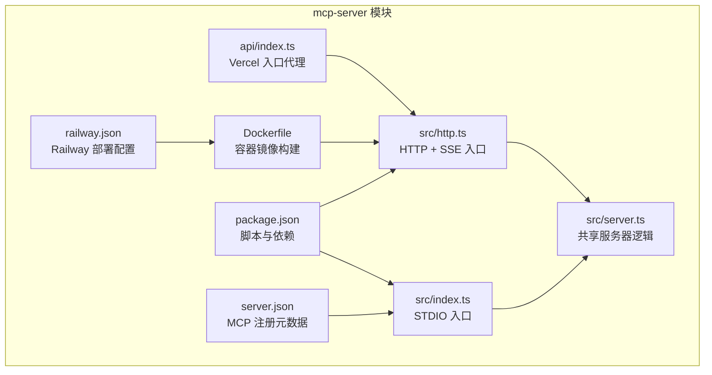
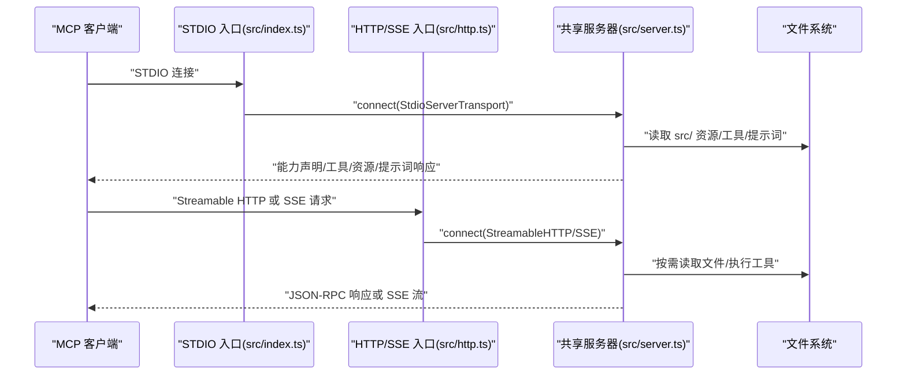
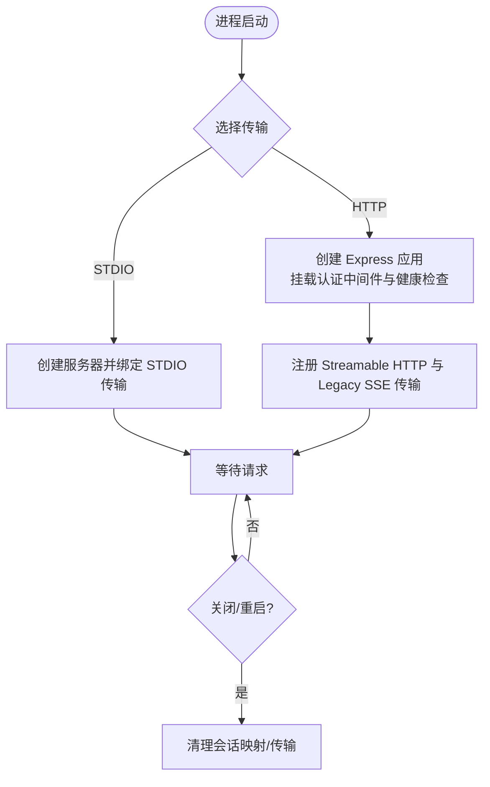
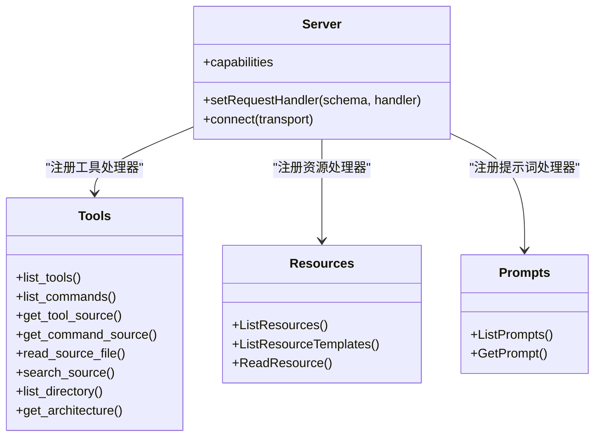
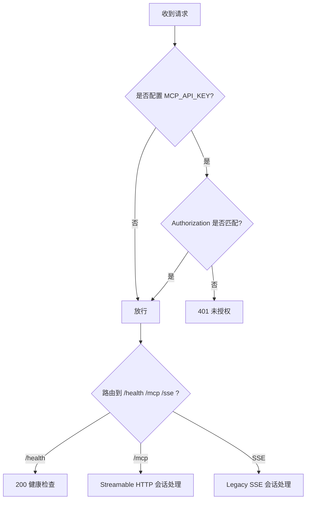
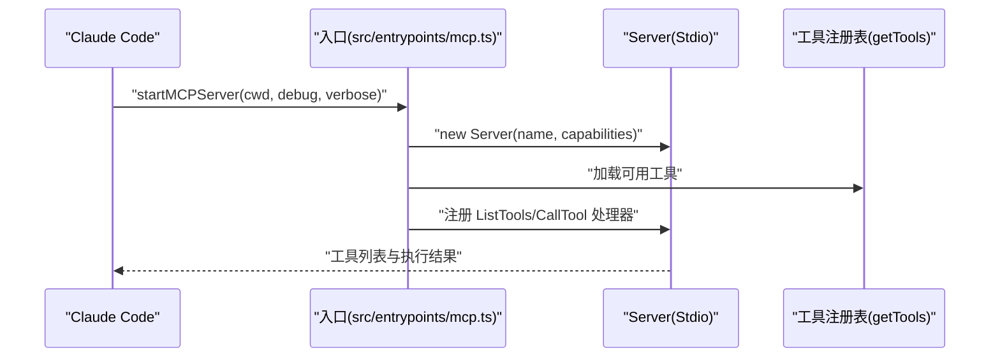
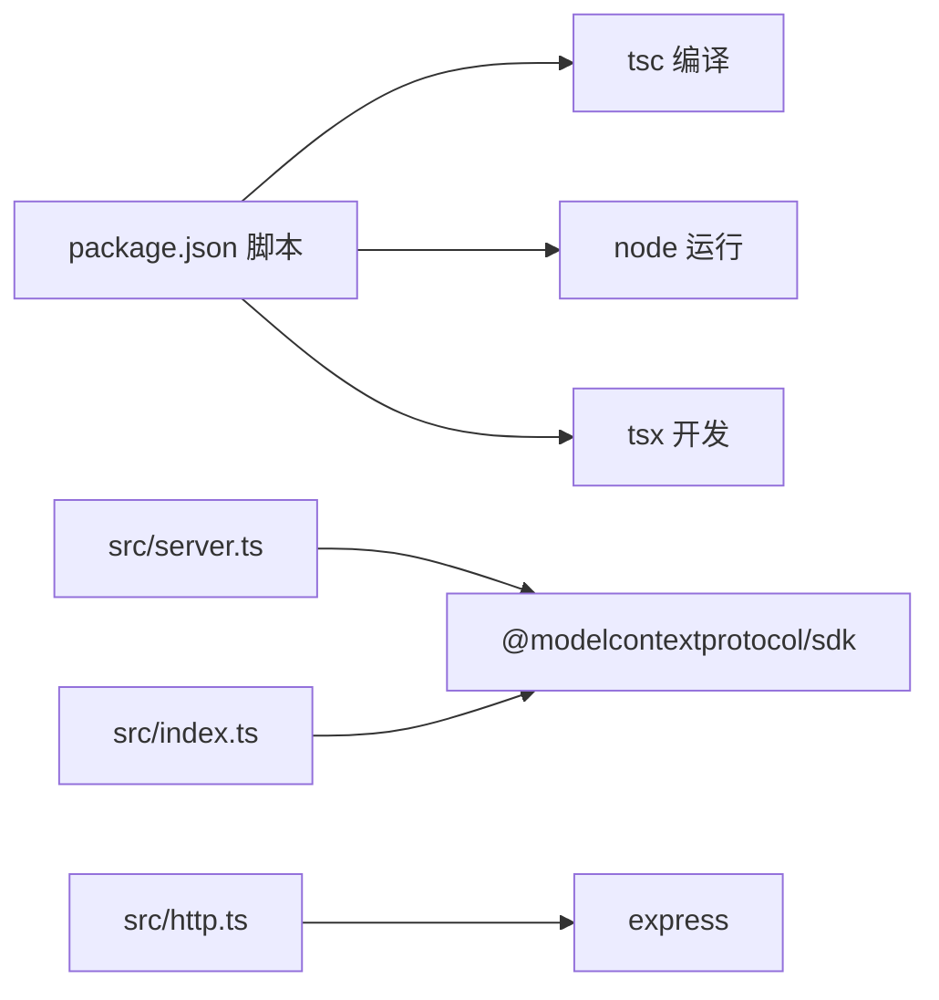

# MCP 服务器开发

<cite>
**本文引用的文件**
- [mcp-server/src/index.ts](file://mcp-server/src/index.ts)
- [mcp-server/src/server.ts](file://mcp-server/src/server.ts)
- [mcp-server/src/http.ts](file://mcp-server/src/http.ts)
- [mcp-server/api/index.ts](file://mcp-server/api/index.ts)
- [mcp-server/Dockerfile](file://mcp-server/Dockerfile)
- [mcp-server/railway.json](file://mcp-server/railway.json)
- [mcp-server/package.json](file://mcp-server/package.json)
- [mcp-server/README.md](file://mcp-server/README.md)
- [mcp-server/server.json](file://mcp-server/server.json)
- [src/entrypoints/mcp.ts](file://src/entrypoints/mcp.ts)
</cite>

## 目录
1. [简介](#简介)
2. [项目结构](#项目结构)
3. [核心组件](#核心组件)
4. [架构总览](#架构总览)
5. [详细组件分析](#详细组件分析)
6. [依赖关系分析](#依赖关系分析)
7. [性能考虑](#性能考虑)
8. [故障排除指南](#故障排除指南)
9. [结论](#结论)
10. [附录](#附录)

## 简介
本指南面向在 Claude Code 生态中实现与运行 MCP（Model Context Protocol）服务器的开发者，系统讲解如何基于仓库中的 mcp-server 模块完成服务器初始化、配置管理、生命周期控制、发现机制、能力声明、资源管理、认证与安全、部署与容器化、性能优化与监控、以及常见问题排查。文档同时覆盖客户端侧 MCP 服务器的集成方式，帮助你从零到一构建稳定、可扩展且安全的 MCP 服务。

## 项目结构
mcp-server 是一个独立的 MCP 服务器模块，支持 STDIO、Streamable HTTP、SSE 多种传输协议，既可用于本地 Claude Desktop/VS Code 集成，也可远程部署于 Railway、Vercel、Docker 等平台。其核心由以下文件构成：
- 入口与服务器定义：src/index.ts（STDIO）、src/http.ts（HTTP/SSE）、src/server.ts（共享服务器逻辑）
- 部署与发布：Dockerfile、railway.json、server.json（注册元数据）、package.json（脚本与依赖）
- 文档与示例：README.md（使用说明、配置、部署）

图表来源
- [mcp-server/src/index.ts:1-25](file://mcp-server/src/index.ts#L1-L25)
- [mcp-server/src/http.ts:1-173](file://mcp-server/src/http.ts#L1-L173)
- [mcp-server/src/server.ts:1-959](file://mcp-server/src/server.ts#L1-L959)
- [mcp-server/api/index.ts:1-22](file://mcp-server/api/index.ts#L1-L22)
- [mcp-server/Dockerfile:1-30](file://mcp-server/Dockerfile#L1-L30)
- [mcp-server/railway.json:1-14](file://mcp-server/railway.json#L1-L14)
- [mcp-server/package.json:1-34](file://mcp-server/package.json#L1-L34)
- [mcp-server/server.json:1-25](file://mcp-server/server.json#L1-L25)

章节来源
- [mcp-server/README.md:1-280](file://mcp-server/README.md#L1-L280)
- [mcp-server/package.json:1-34](file://mcp-server/package.json#L1-L34)

## 核心组件
- 服务器工厂与能力声明：共享服务器逻辑位于 src/server.ts，负责工具、资源、提示词的声明与处理，支持跨传输复用。
- STDIO 入口：src/index.ts 使用 StdioServerTransport 启动本地服务器，适合 Claude Desktop/Code/VS Code 等本地集成。
- HTTP/SSE 入口：src/http.ts 提供 Streamable HTTP（JSON-RPC + SSE）与 Legacy SSE 两种传输，支持会话管理与可选认证。
- Vercel 入口代理：api/index.ts 将请求转发给 Express 应用，注意 Vercel 的无状态限制。
- 部署与发布：Dockerfile 构建多阶段镜像；railway.json 定义构建与健康检查；server.json 用于 MCP 注册元数据。

章节来源
- [mcp-server/src/server.ts:148-648](file://mcp-server/src/server.ts#L148-L648)
- [mcp-server/src/index.ts:10-24](file://mcp-server/src/index.ts#L10-L24)
- [mcp-server/src/http.ts:15-173](file://mcp-server/src/http.ts#L15-L173)
- [mcp-server/api/index.ts:1-22](file://mcp-server/api/index.ts#L1-L22)
- [mcp-server/Dockerfile:1-30](file://mcp-server/Dockerfile#L1-L30)
- [mcp-server/railway.json:1-14](file://mcp-server/railway.json#L1-L14)
- [mcp-server/server.json:1-25](file://mcp-server/server.json#L1-L25)

## 架构总览
下图展示 MCP 服务器在不同传输下的交互流程，以及与客户端的连接方式。

图表来源
- [mcp-server/src/index.ts:13-19](file://mcp-server/src/index.ts#L13-L19)
- [mcp-server/src/http.ts:50-104](file://mcp-server/src/http.ts#L50-L104)
- [mcp-server/src/server.ts:148-648](file://mcp-server/src/server.ts#L148-L648)

## 详细组件分析

### 服务器初始化与生命周期
- 初始化入口
  - STDIO：通过 src/index.ts 创建服务器并绑定 StdioServerTransport，启动后打印源码根路径。
  - HTTP：通过 src/http.ts 创建 Express 应用，挂载认证中间件与健康检查，随后注册 Streamable HTTP 与 Legacy SSE 传输。
- 生命周期
  - 服务器在 connect 成功后进入事件循环，处理请求；HTTP 侧通过会话映射维持连接状态。
  - 关闭时清理会话映射，释放资源。

图表来源
- [mcp-server/src/index.ts:13-19](file://mcp-server/src/index.ts#L13-L19)
- [mcp-server/src/http.ts:138-173](file://mcp-server/src/http.ts#L138-L173)

章节来源
- [mcp-server/src/index.ts:10-24](file://mcp-server/src/index.ts#L10-L24)
- [mcp-server/src/http.ts:138-173](file://mcp-server/src/http.ts#L138-L173)

### 配置管理与环境变量
- 关键环境变量
  - CLAUDE_CODE_SRC_ROOT：源码根目录，默认相对路径解析至 ../src。
  - PORT：HTTP 端口，默认 3000。
  - MCP_API_KEY：可选 Bearer 认证令牌，开启后所有非 /health 请求需携带有效令牌。
- 验证与默认值
  - 启动前校验源码根目录存在性；HTTP 模式下默认监听 3000 端口。

章节来源
- [mcp-server/src/http.ts:22-24](file://mcp-server/src/http.ts#L22-L24)
- [mcp-server/src/http.ts:138-173](file://mcp-server/src/http.ts#L138-L173)
- [mcp-server/README.md:138-145](file://mcp-server/README.md#L138-L145)

### 发现机制、能力声明与资源管理
- 能力声明
  - 工具：声明 list_tools、list_commands、get_tool_source、get_command_source、read_source_file、search_source、list_directory、get_architecture 等。
  - 资源：声明 architecture、tools、commands 三类资源，以及 source 文件模板。
  - 提示词：声明 explain_tool、explain_command、architecture_overview、how_does_it_work、compare_tools 等。
- 资源与工具处理
  - 资源读取：根据 URI 返回对应内容（Markdown/JSON/文本），支持安全路径解析 block 路径穿越。
  - 工具调用：按名称分发，执行文件读取、搜索、目录列举等操作，返回结构化结果。

图表来源
- [mcp-server/src/server.ts:148-648](file://mcp-server/src/server.ts#L148-L648)

章节来源
- [mcp-server/src/server.ts:148-648](file://mcp-server/src/server.ts#L148-L648)

### 认证机制、安全策略与访问控制
- 认证策略
  - 可选 Bearer Token：当设置 MCP_API_KEY 时，所有非 /health 请求必须携带 Authorization: Bearer <token>。
  - 会话管理：Streamable HTTP 通过 mcp-session-id 维持会话；SSE 通过 sessionId 维护连接。
- 安全措施
  - 路径安全：safePath 阻止路径穿越，仅允许在 SRC_ROOT 下访问。
  - 权限与输入校验：工具调用前进行启用状态与输入校验，错误统一格式化返回。
- 最佳实践
  - 生产环境务必设置 MCP_API_KEY 并通过反向代理强制 HTTPS。
  - 对外暴露的 HTTP 端口仅开放必要路径（/mcp、/sse、/health）。

图表来源
- [mcp-server/src/http.ts:29-44](file://mcp-server/src/http.ts#L29-L44)
- [mcp-server/src/http.ts:146-153](file://mcp-server/src/http.ts#L146-L153)
- [mcp-server/src/http.ts:50-104](file://mcp-server/src/http.ts#L50-L104)
- [mcp-server/src/http.ts:110-132](file://mcp-server/src/http.ts#L110-L132)

章节来源
- [mcp-server/src/http.ts:29-44](file://mcp-server/src/http.ts#L29-L44)
- [mcp-server/src/http.ts:146-153](file://mcp-server/src/http.ts#L146-L153)
- [mcp-server/src/server.ts:84-88](file://mcp-server/src/server.ts#L84-L88)

### 部署指南：本地开发、生产与容器化
- 本地开发
  - 安装依赖并编译：npm install && npm run build
  - 本地运行 STDIO：npm start 或设置 CLAUDE_CODE_SRC_ROOT 后运行
  - 本地运行 HTTP：npm run start:http，访问 /mcp（Streamable HTTP）、/sse（Legacy SSE）、/health
- 生产环境
  - Railway：自动检测 Dockerfile，设置 MCP_API_KEY、PORT，健康检查路径 /health
  - Vercel：通过 api/index.ts 代理；注意无状态限制，建议使用持久化部署（Railway/Render/VPS）
  - 自有主机：Docker 镜像构建与运行，映射 3000 端口，设置环境变量
- 容器化
  - 多阶段构建：复制完整仓库与构建产物，运行时拷贝 src/ 以供服务器探索
  - 默认 CMD：node dist/http.js，暴露 3000 端口

章节来源
- [mcp-server/README.md:49-202](file://mcp-server/README.md#L49-L202)
- [mcp-server/Dockerfile:1-30](file://mcp-server/Dockerfile#L1-L30)
- [mcp-server/railway.json:1-14](file://mcp-server/railway.json#L1-L14)
- [mcp-server/api/index.ts:1-22](file://mcp-server/api/index.ts#L1-L22)

### 客户端侧 MCP 服务器集成（Claude Code 内部）
- 客户端服务器：src/entrypoints/mcp.ts 展示了如何在 Claude Code 内部启动一个 MCP 服务器，将现有工具重新暴露给 MCP 客户端，实现“MCP 作为客户端”模式。
- 关键点
  - 从工具注册表加载工具，转换输入/输出 Schema，注入权限上下文与执行环境。
  - 通过 StdioServerTransport 运行，便于与 IDE/桌面客户端通信。

图表来源
- [src/entrypoints/mcp.ts:35-196](file://src/entrypoints/mcp.ts#L35-L196)

章节来源
- [src/entrypoints/mcp.ts:35-196](file://src/entrypoints/mcp.ts#L35-L196)

## 依赖关系分析
- 运行时依赖
  - @modelcontextprotocol/sdk：提供 Server、Transport、JSON-RPC 类型与协议实现
  - express：HTTP/SSE 传输所需 Web 服务器
- 开发依赖
  - typescript、tsx、@types/*：类型与热重载开发体验
- 包脚本
  - build：TypeScript 编译
  - start：运行 STDIO 服务器
  - start:http：运行 HTTP/SSE 服务器
  - dev：开发模式热编译

图表来源
- [mcp-server/package.json:15-30](file://mcp-server/package.json#L15-L30)
- [mcp-server/src/server.ts:8-17](file://mcp-server/src/server.ts#L8-L17)
- [mcp-server/src/http.ts:15-19](file://mcp-server/src/http.ts#L15-L19)
- [mcp-server/src/index.ts:10-11](file://mcp-server/src/index.ts#L10-L11)

章节来源
- [mcp-server/package.json:1-34](file://mcp-server/package.json#L1-L34)

## 性能考虑
- 文件访问缓存
  - 在客户端侧 MCP 服务器中使用大小受限的 LRU 缓存减少重复读取，避免内存无限增长。
- 会话与并发
  - Streamable HTTP 通过 sessionId 维护会话，合理设置超时与清理策略。
- 搜索与遍历
  - 源码搜索限制最大结果数，按文件扩展名过滤，避免全量扫描造成延迟。
- 部署建议
  - 使用持久化部署（Railway/Render/VPS）以支持长连接与会话；对 Vercel 等无状态平台仅用于简单工具调用。

章节来源
- [src/entrypoints/mcp.ts:40-46](file://src/entrypoints/mcp.ts#L40-L46)
- [mcp-server/src/server.ts:537-545](file://mcp-server/src/server.ts#L537-L545)
- [mcp-server/README.md:191-192](file://mcp-server/README.md#L191-L192)

## 故障排除指南
- 启动失败
  - 检查 CLAUDE_CODE_SRC_ROOT 是否指向有效 src/ 目录；STDIO 模式下可通过环境变量覆盖。
  - 查看标准错误输出，确认 fatal 错误栈。
- 认证失败
  - 若设置了 MCP_API_KEY，确保请求头 Authorization: Bearer <token> 正确；/health 不需要认证。
- HTTP 端口占用
  - 修改 PORT 环境变量或释放 3000 端口。
- Vercel 无状态限制
  - Streamable HTTP 会话无法跨函数调用保持；建议使用 Railway/Render/VPS。
- 路径访问异常
  - 确认请求的资源路径在 SRC_ROOT 下，避免路径穿越尝试。

章节来源
- [mcp-server/src/index.ts:21-24](file://mcp-server/src/index.ts#L21-L24)
- [mcp-server/src/http.ts:138-173](file://mcp-server/src/http.ts#L138-L173)
- [mcp-server/src/http.ts:29-44](file://mcp-server/src/http.ts#L29-L44)
- [mcp-server/src/server.ts:84-88](file://mcp-server/src/server.ts#L84-L88)
- [mcp-server/api/index.ts:14-17](file://mcp-server/api/index.ts#L14-L17)

## 结论
本指南系统阐述了如何在 Claude Code 生态中实现与运行 MCP 服务器，涵盖初始化、配置、能力声明、资源管理、认证与安全、部署与容器化、性能优化与故障排除。通过共享服务器逻辑与多传输适配，你可以快速构建本地与远程可用的 MCP 服务，并结合客户端侧 MCP 服务器实现更广泛的工具与资源暴露。

## 附录
- 快速开始
  - 安装与构建：npm install && npm run build
  - 本地运行：npm start（STDIO）或 npm run start:http（HTTP/SSE）
  - 设置源码根：CLAUDE_CODE_SRC_ROOT=/path/to/src
  - 开启认证：MCP_API_KEY=your-secret-token
- 部署清单
  - Railway：设置 MCP_API_KEY、PORT，健康检查 /health
  - Docker：构建镜像并运行，暴露 3000 端口
  - Vercel：通过 api/index.ts 代理，注意无状态限制

章节来源
- [mcp-server/README.md:49-202](file://mcp-server/README.md#L49-L202)
- [mcp-server/server.json:1-25](file://mcp-server/server.json#L1-L25)