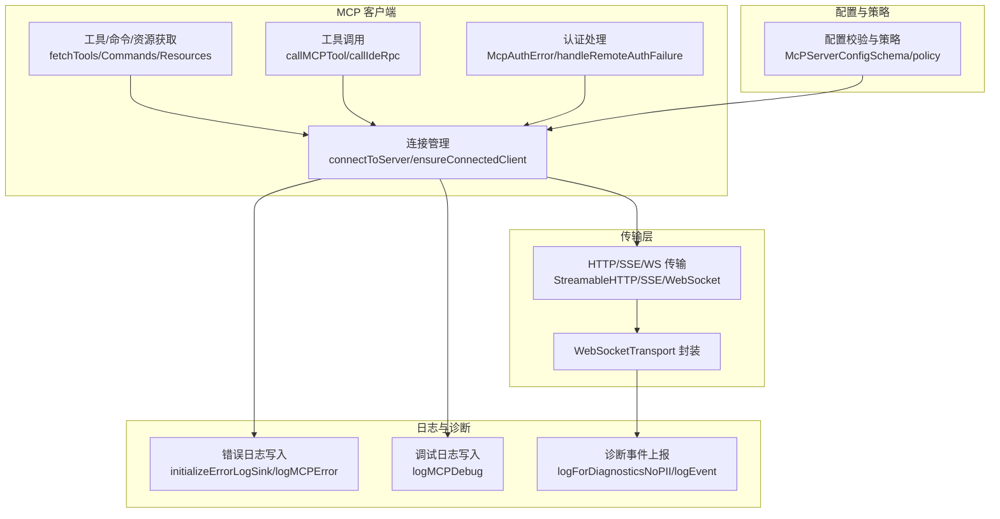
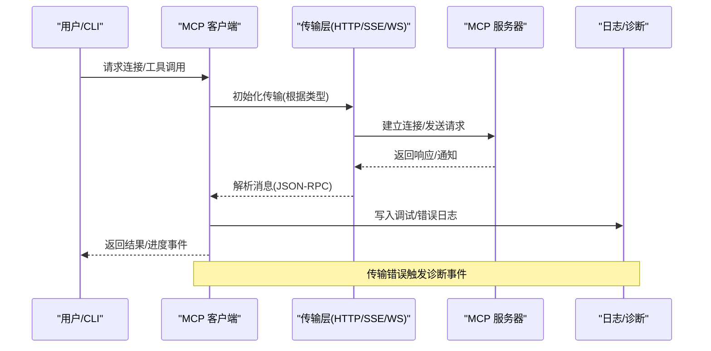
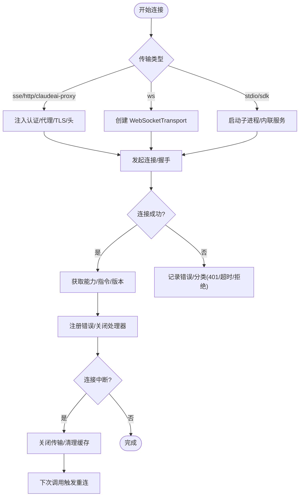
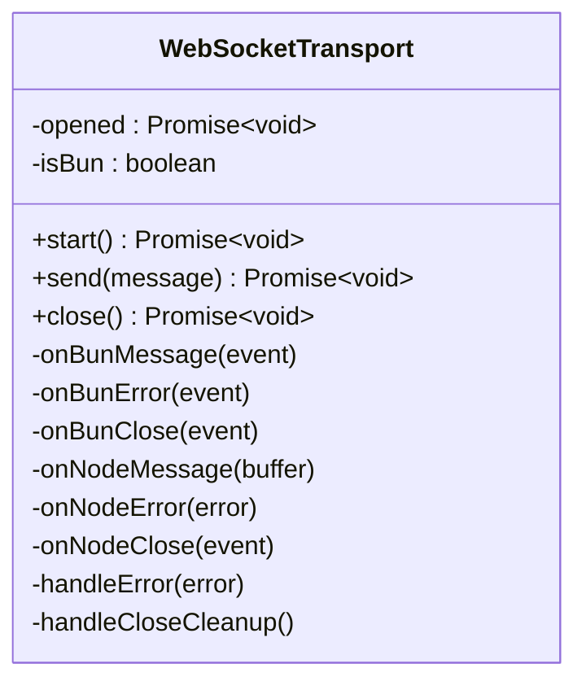
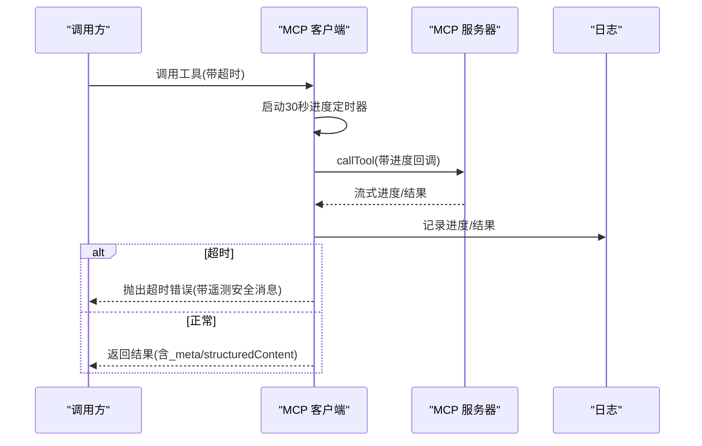
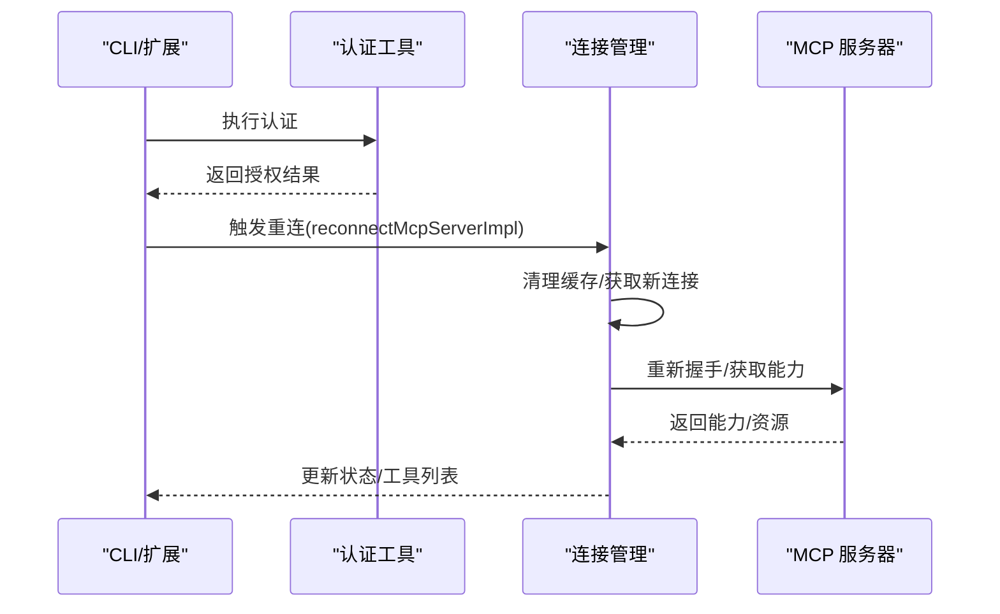
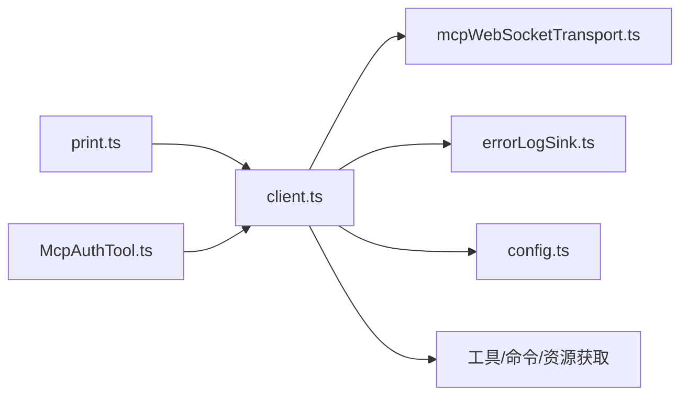

# MCP 调试与监控

<cite>
**本文档引用的文件**
- [client.ts](file://src/services/mcp/client.ts)
- [errorLogSink.ts](file://src/utils/errorLogSink.ts)
- [mcpWebSocketTransport.ts](file://src/utils/mcpWebSocketTransport.ts)
- [config.ts](file://src/services/mcp/config.ts)
- [print.ts](file://src/cli/print.ts)
- [McpAuthTool.ts](file://src/tools/McpAuthTool/McpAuthTool.ts)
</cite>

## 目录
1. [简介](#简介)
2. [项目结构](#项目结构)
3. [核心组件](#核心组件)
4. [架构总览](#架构总览)
5. [详细组件分析](#详细组件分析)
6. [依赖关系分析](#依赖关系分析)
7. [性能考量](#性能考量)
8. [故障排查指南](#故障排查指南)
9. [结论](#结论)
10. [附录](#附录)

## 简介
本指南面向 MCP（Model Context Protocol）调试与监控的专业需求，覆盖 MCP 服务器与客户端的调试工具、日志记录与诊断方法；MCP 通信的监控指标、性能分析与瓶颈识别；连接问题的排查流程（连接失败、超时、认证错误等）；MCP 服务器的健康检查与状态监控；以及 MCP 客户端的连接状态跟踪、消息流监控与异常处理。文档基于代码库中的实现进行系统化梳理，并提供可视化图表帮助理解。

## 项目结构
MCP 调试与监控相关能力主要分布在以下模块：
- 服务端连接与工具调用：src/services/mcp/client.ts
- 错误与调试日志：src/utils/errorLogSink.ts
- WebSocket 传输层：src/utils/mcpWebSocketTransport.ts
- 配置与策略校验：src/services/mcp/config.ts
- CLI 交互与重连：src/cli/print.ts
- 认证工具：src/tools/McpAuthTool/McpAuthTool.ts

**图表来源**
- [client.ts](file://src/services/mcp/client.ts)
- [errorLogSink.ts](file://src/utils/errorLogSink.ts)
- [mcpWebSocketTransport.ts](file://src/utils/mcpWebSocketTransport.ts)
- [config.ts](file://src/services/mcp/config.ts)

**章节来源**
- [client.ts](file://src/services/mcp/client.ts)
- [errorLogSink.ts](file://src/utils/errorLogSink.ts)
- [mcpWebSocketTransport.ts](file://src/utils/mcpWebSocketTransport.ts)
- [config.ts](file://src/services/mcp/config.ts)

## 核心组件
- 连接管理与缓存
  - connectToServer：统一入口，按服务器类型选择传输层并建立连接，支持超时控制与连接统计。
  - ensureConnectedClient：确保返回有效连接，用于工具/资源调用前的保障。
  - 缓存键与清理：getServerCacheKey、clearServerCache、connectToServer.memoize 清理以支持断线重连。
- 传输层
  - HTTP/SSE/WebSocket/SSE-IDE/WS-IDE：分别封装不同协议的连接与请求。
  - WebSocketTransport：对原生 WebSocket 的封装，统一事件监听、错误与关闭处理。
- 工具/命令/资源获取
  - fetchToolsForClient/fetchCommandsForClient/fetchResourcesForClient：带 LRU 缓存的获取函数，支持并发批处理。
- 认证与重连
  - handleRemoteAuthFailure：远程认证失败时标记 needs-auth 并缓存，避免重复探测。
  - reconnectMcpServerImpl：清理缓存后重建连接，重新拉取工具/命令/资源。
- 日志与诊断
  - initializeErrorLogSink：初始化错误日志写入器，支持 MCP 专用日志路径。
  - logMCPError/logMCPDebug：MCP 专属错误与调试日志，含时间戳、会话 ID、工作目录等上下文。
  - 诊断事件：mcp_websocket_connect_fail/mcp_websocket_message_fail 等无 PII 诊断事件。
- 配置与策略
  - McpServerConfigSchema：配置校验，结合企业策略（允许/拒绝列表）进行准入控制。

**章节来源**
- [client.ts](file://src/services/mcp/client.ts)
- [errorLogSink.ts](file://src/utils/errorLogSink.ts)
- [mcpWebSocketTransport.ts](file://src/utils/mcpWebSocketTransport.ts)
- [config.ts](file://src/services/mcp/config.ts)

## 架构总览
下图展示 MCP 客户端从连接到工具调用的关键流程，以及日志与诊断事件的落点。

**图表来源**
- [client.ts](file://src/services/mcp/client.ts)
- [mcpWebSocketTransport.ts](file://src/utils/mcpWebSocketTransport.ts)
- [errorLogSink.ts](file://src/utils/errorLogSink.ts)

## 详细组件分析

### 连接管理与重连机制
- 统一连接入口
  - 支持 sse/http/ws/claudeai-proxy/stdio/sdk 等多种类型，自动注入 User-Agent、代理、TLS、会话令牌等头部与参数。
  - 连接超时控制：getConnectionTimeoutMs，默认 30 秒，超时即抛出带遥测安全的消息。
- 断线检测与自动重连
  - 增强 onerror/onclose 处理：记录连接时长、错误类型；对 HTTP/代理场景识别“会话过期”（404 + JSON-RPC -32001）触发清理缓存与重连。
  - 对终端性网络错误（如 ETIMEDOUT/ECONNRESET 等）累计计数，超过阈值后主动关闭传输以触发上层重连。
- 进程清理
  - stdio 类型：通过 SIGINT/SIGTERM/SIGKILL 梯度终止子进程，配合监控确保优雅退出或强制清理。

**图表来源**
- [client.ts](file://src/services/mcp/client.ts)

**章节来源**
- [client.ts](file://src/services/mcp/client.ts)

### WebSocket 传输层封装
- 关键职责
  - 统一 readyState 管理与打开等待逻辑（Bun/Node 兼容）。
  - 统一事件监听与错误处理，错误时上报诊断事件。
  - 发送消息前校验连接状态，异常时清理监听并抛错。
- 诊断事件
  - mcp_websocket_connect_fail：连接失败。
  - mcp_websocket_message_fail：消息解析/传输错误。
  - mcp_websocket_start_not_opened / mcp_websocket_send_not_opened：生命周期状态异常。

**图表来源**
- [mcpWebSocketTransport.ts](file://src/utils/mcpWebSocketTransport.ts)

**章节来源**
- [mcpWebSocketTransport.ts](file://src/utils/mcpWebSocketTransport.ts)

### 工具调用与进度监控
- 工具调用
  - callMCPTool/callIdeRpc：封装 SDK 调用，集成超时控制（getMcpToolTimeoutMs，默认约 27.8 小时），并提供进度回调。
  - 进度日志：每 30 秒输出一次“仍在运行”的调试日志，便于定位长耗时工具。
- 异常处理
  - 对 McpSessionExpiredError 自动重试一次（清理缓存后获取新连接）。
  - 对非遥测安全错误进行包装，保留有用上下文以便遥测与日志分析。
- 结果元数据
  - 支持 _meta/structuredContent 等 MCP 规范字段透传，便于上层消费。

**图表来源**
- [client.ts](file://src/services/mcp/client.ts)

**章节来源**
- [client.ts](file://src/services/mcp/client.ts)

### 认证与重连流程
- 认证失败处理
  - 远程认证失败时，记录 needs-auth 状态并写入缓存（15 分钟 TTL），避免频繁探测。
  - 触发 tengu_mcp_server_needs_auth 事件，便于 UI 或 CLI 提示用户授权。
- 重连与刷新
  - reconnectMcpServerImpl：清理缓存、重建连接、重新拉取工具/命令/资源。
  - CLI 中的 mcp_authenticate 流程：执行 OAuth 后自动重连并更新动态状态。

**图表来源**
- [print.ts](file://src/cli/print.ts)
- [McpAuthTool.ts](file://src/tools/McpAuthTool/McpAuthTool.ts)
- [client.ts](file://src/services/mcp/client.ts)

**章节来源**
- [print.ts](file://src/cli/print.ts)
- [McpAuthTool.ts](file://src/tools/McpAuthTool/McpAuthTool.ts)
- [client.ts](file://src/services/mcp/client.ts)

### 日志与诊断
- 文件日志
  - initializeErrorLogSink：初始化错误日志写入器，MCP 专用日志按日期分文件，包含时间戳、会话 ID、工作目录等。
  - logMCPError/logMCPDebug：MCP 专属错误与调试日志，便于定位具体服务器问题。
- 诊断事件
  - mcp_websocket_connect_fail / mcp_websocket_message_fail 等无 PII 事件，用于快速识别传输层问题。
- 配置与策略
  - 配置校验与企业策略（允许/拒绝列表）在添加服务器前执行，避免无效配置进入运行时。

**章节来源**
- [errorLogSink.ts](file://src/utils/errorLogSink.ts)
- [client.ts](file://src/services/mcp/client.ts)
- [config.ts](file://src/services/mcp/config.ts)

## 依赖关系分析
- 组件耦合
  - 连接管理（client.ts）依赖传输层（mcpWebSocketTransport.ts）、日志（errorLogSink.ts）、配置（config.ts）。
  - 工具调用依赖连接管理与传输层，同时产生进度与错误日志。
  - CLI 与认证工具负责触发重连与状态更新。
- 外部依赖
  - @modelcontextprotocol/sdk：MCP 协议客户端与传输抽象。
  - ws（Node）/原生 WebSocket（Bun）：WebSocket 实现。
  - axios：错误上下文增强（提取请求 URL、状态码、服务器消息体）。

**图表来源**
- [client.ts](file://src/services/mcp/client.ts)
- [mcpWebSocketTransport.ts](file://src/utils/mcpWebSocketTransport.ts)
- [errorLogSink.ts](file://src/utils/errorLogSink.ts)
- [config.ts](file://src/services/mcp/config.ts)
- [print.ts](file://src/cli/print.ts)
- [McpAuthTool.ts](file://src/tools/McpAuthTool/McpAuthTool.ts)

**章节来源**
- [client.ts](file://src/services/mcp/client.ts)
- [mcpWebSocketTransport.ts](file://src/utils/mcpWebSocketTransport.ts)
- [errorLogSink.ts](file://src/utils/errorLogSink.ts)
- [config.ts](file://src/services/mcp/config.ts)
- [print.ts](file://src/cli/print.ts)
- [McpAuthTool.ts](file://src/tools/McpAuthTool/McpAuthTool.ts)

## 性能考量
- 连接并发与批处理
  - 本地服务器（stdio/sdk）与远程服务器（sse/http/claudeai-proxy）采用不同并发度，避免进程/网络资源争用。
  - 使用 pMap 实现更优的任务调度，单个慢服务器不会阻塞其他槽位。
- 缓存策略
  - 连接缓存：connectToServer.memoize，断线后清理以触发重连。
  - 工具/命令/资源缓存：memoizeWithLRU，限制最大条目，防止内存膨胀。
- 超时与进度
  - 连接超时（getConnectionTimeoutMs）与工具超时（getMcpToolTimeoutMs）双层控制，避免长时间挂起。
  - 工具执行进度日志（每 30 秒）帮助识别长尾任务。
- 传输优化
  - HTTP 传输强制 Accept 头（application/json, text/event-stream），确保严格模式服务器兼容。
  - WebSocketTransport 统一错误与关闭处理，减少泄漏与重复监听。

[本节为通用性能建议，不直接分析具体文件]

## 故障排查指南

### 连接失败
- 常见原因
  - 网络不可达（EHOSTUNREACH/ECONNREFUSED）、超时（ETIMEDOUT）、服务器崩溃（ECONNRESET）。
  - 401 未授权：handleRemoteAuthFailure 触发 needs-auth 状态与缓存。
  - 404 + JSON-RPC -32001：识别为“会话过期”，触发清理缓存与重连。
- 排查步骤
  - 查看连接日志：连接耗时、传输类型、URL、头信息（敏感头已脱敏）。
  - 检查诊断事件：mcp_websocket_connect_fail 等。
  - 若为 401：确认 OAuth 令牌是否有效，必要时执行认证工具重连。
  - 若为 404：确认会话 ID 是否过期，等待自动清理缓存后重试。

**章节来源**
- [client.ts](file://src/services/mcp/client.ts)
- [mcpWebSocketTransport.ts](file://src/utils/mcpWebSocketTransport.ts)

### 超时问题
- 连接超时
  - 检查 getConnectionTimeoutMs（默认 30 秒），确认网络环境与服务器响应速度。
- 工具调用超时
  - 检查 getMcpToolTimeoutMs（默认约 27.8 小时），若业务需要可设置环境变量调整。
  - 关注每 30 秒进度日志，定位长耗时工具并评估优化方案。

**章节来源**
- [client.ts](file://src/services/mcp/client.ts)

### 认证错误
- 401 未授权
  - 远程认证失败：记录 needs-auth，写入 15 分钟缓存，避免重复探测。
  - CLI 中执行认证工具后自动重连，或手动触发 reconnectMcpServerImpl。
- 令牌刷新
  - claude.ai 代理场景：内置一次性重试与令牌变更检测，避免批量 401 导致的缓存污染。

**章节来源**
- [client.ts](file://src/services/mcp/client.ts)
- [print.ts](file://src/cli/print.ts)
- [McpAuthTool.ts](file://src/tools/McpAuthTool/McpAuthTool.ts)

### 服务器健康检查与状态监控
- 连接成功/失败事件
  - tengu_mcp_server_connection_succeeded / tengu_mcp_server_connection_failed：记录连接耗时、传输类型、基础 URL 等。
- IDE 服务器
  - tengu_mcp_ide_server_connection_succeeded / tengu_mcp_ide_server_connection_failed：记录 IDE 场景连接时长。
- 认证状态
  - tengu_mcp_server_needs_auth：认证缺失或失败时触发，便于 UI/CLI 提示。

**章节来源**
- [client.ts](file://src/services/mcp/client.ts)

### 客户端连接状态跟踪与异常处理
- 连接状态
  - connected/disabled/failed/needs-auth：由 connectToServer 返回，供 UI 与 CLI 展示。
- 断线与重连
  - onerror/onclose 增强处理：记录错误类型、累计终端性错误、触发清理缓存与重连。
- 进程管理（stdio）
  - 梯度信号（SIGINT/SIGTERM/SIGKILL）与监控，确保子进程优雅退出或强制清理。

**章节来源**
- [client.ts](file://src/services/mcp/client.ts)

### MCP 调试工具使用与系统化方法
- 启动日志
  - initializeErrorLogSink 初始化后，所有 MCP 错误与调试信息将写入对应日志文件，便于离线分析。
- 环境变量
  - MCP_TIMEOUT：连接超时（毫秒）。
  - MCP_TOOL_TIMEOUT：工具调用超时（毫秒）。
  - MCP_SERVER_CONNECTION_BATCH_SIZE / MCP_REMOTE_SERVER_CONNECTION_BATCH_SIZE：本地/远程连接并发度。
  - CLAUDE_CODE_SHELL_PREFIX：stdio 命令前缀，便于调试子进程行为。
- 系统化方法
  - 步骤 1：确认配置校验通过与策略允许。
  - 步骤 2：查看连接日志与诊断事件，定位传输层问题。
  - 步骤 3：若为认证错误，执行认证工具并重连。
  - 步骤 4：观察工具调用进度日志，识别长耗时任务。
  - 步骤 5：必要时调整超时与并发度，或优化服务器端性能。

**章节来源**
- [errorLogSink.ts](file://src/utils/errorLogSink.ts)
- [config.ts](file://src/services/mcp/config.ts)
- [client.ts](file://src/services/mcp/client.ts)

## 结论
本指南基于代码库中 MCP 客户端实现，总结了连接管理、传输层封装、工具调用、认证与重连、日志与诊断、配置与策略等关键能力。通过统一的调试工具、日志记录与诊断事件，能够系统化地定位连接失败、超时与认证错误等问题，并结合性能优化建议提升整体稳定性与可观测性。

[本节为总结性内容，不直接分析具体文件]

## 附录
- 关键日志位置
  - 错误日志：CACHE_PATHS.errors + 当前日期文件。
  - MCP 日志：CACHE_PATHS.mcpLogs(serverName) + 当前日期文件。
- 诊断事件
  - mcp_websocket_connect_fail / mcp_websocket_message_fail / mcp_websocket_start_not_opened / mcp_websocket_send_not_opened

**章节来源**
- [errorLogSink.ts](file://src/utils/errorLogSink.ts)