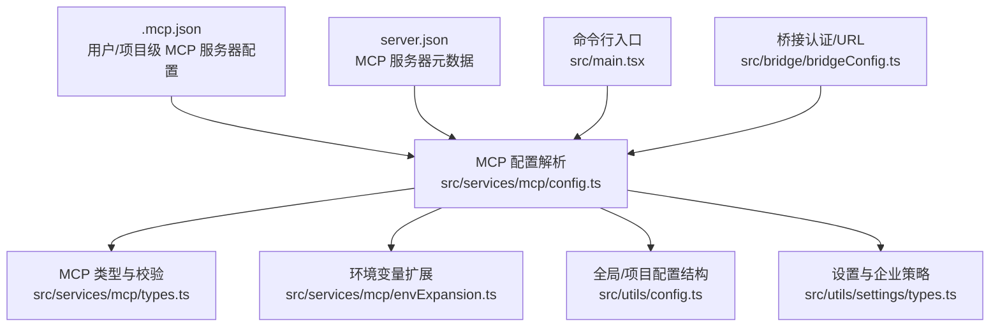
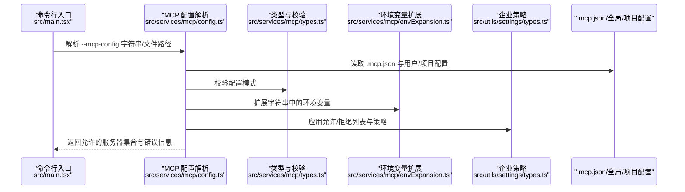
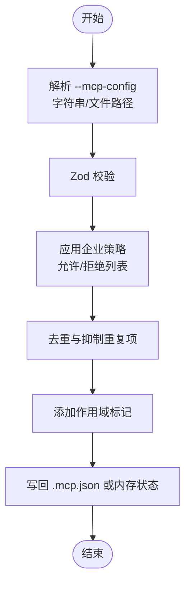
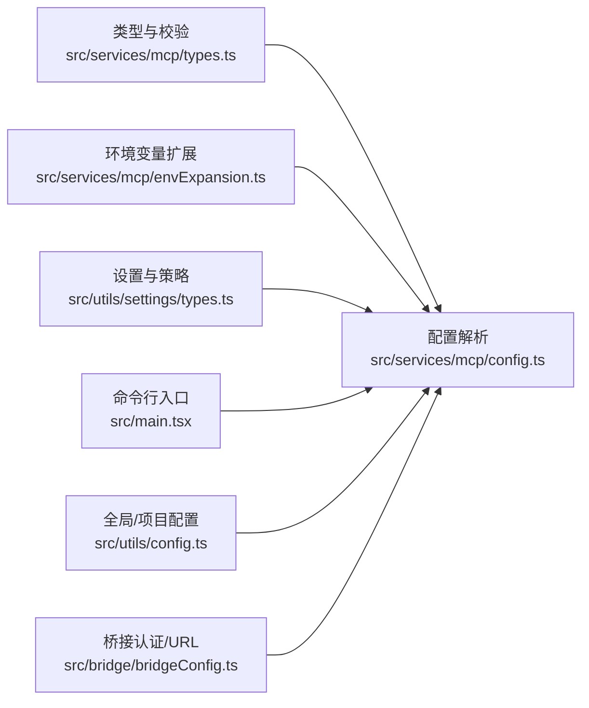

# MCP 配置管理

<cite>
**本文引用的文件**
- [.mcp.json](file://.mcp.json)
- [server.json](file://server.json)
- [src/services/mcp/config.ts](file://src/services/mcp/config.ts)
- [src/services/mcp/types.ts](file://src/services/mcp/types.ts)
- [src/services/mcp/envExpansion.ts](file://src/services/mcp/envExpansion.ts)
- [src/utils/config.ts](file://src/utils/config.ts)
- [src/utils/settings/types.ts](file://src/utils/settings/types.ts)
- [src/main.tsx](file://src/main.tsx)
- [src/bridge/bridgeConfig.ts](file://src/bridge/bridgeConfig.ts)
</cite>

## 目录
1. [简介](#简介)
2. [项目结构](#项目结构)
3. [核心组件](#核心组件)
4. [架构总览](#架构总览)
5. [详细组件分析](#详细组件分析)
6. [依赖关系分析](#依赖关系分析)
7. [性能考量](#性能考量)
8. [故障排查指南](#故障排查指南)
9. [结论](#结论)
10. [附录](#附录)

## 简介
本指南面向 Claude Code 的 MCP（Model Context Protocol）配置管理，系统性阐述 MCP 服务器与客户端的配置选项、连接参数、认证与安全策略、通道允许/拒绝列表、环境变量扩展、配置文件格式与解析、动态更新与热重载、配置验证机制，以及最佳实践与常见问题处理。同时说明 MCP 配置与 Claude Code 整体配置系统的集成方式。

## 项目结构
围绕 MCP 配置的关键目录与文件如下：
- 全局 MCP 配置文件：.mcp.json
- MCP 服务器元数据描述：server.json
- MCP 配置解析与策略：src/services/mcp/config.ts
- MCP 类型与校验：src/services/mcp/types.ts
- 环境变量扩展工具：src/services/mcp/envExpansion.ts
- 全局与项目配置结构：src/utils/config.ts
- 设置与企业策略类型：src/utils/settings/types.ts
- 命令行入口与动态配置注入：src/main.tsx
- 桥接认证与 URL 解析（间接影响 MCP 连接）：src/bridge/bridgeConfig.ts

**图表来源**
- [.mcp.json](file://.mcp.json)
- [server.json](file://server.json)
- [src/services/mcp/config.ts](file://src/services/mcp/config.ts)
- [src/services/mcp/types.ts](file://src/services/mcp/types.ts)
- [src/services/mcp/envExpansion.ts](file://src/services/mcp/envExpansion.ts)
- [src/utils/config.ts](file://src/utils/config.ts)
- [src/utils/settings/types.ts](file://src/utils/settings/types.ts)
- [src/main.tsx](file://src/main.tsx)
- [src/bridge/bridgeConfig.ts](file://src/bridge/bridgeConfig.ts)

**章节来源**
- [.mcp.json](file://.mcp.json)
- [server.json](file://server.json)
- [src/services/mcp/config.ts](file://src/services/mcp/config.ts)
- [src/services/mcp/types.ts](file://src/services/mcp/types.ts)
- [src/services/mcp/envExpansion.ts](file://src/services/mcp/envExpansion.ts)
- [src/utils/config.ts](file://src/utils/config.ts)
- [src/utils/settings/types.ts](file://src/utils/settings/types.ts)
- [src/main.tsx](file://src/main.tsx)
- [src/bridge/bridgeConfig.ts](file://src/bridge/bridgeConfig.ts)

## 核心组件
- MCP 配置解析与合并：负责从 .mcp.json、用户全局配置、本地项目配置、插件与企业策略中读取并合并 MCP 服务器配置，执行去重、策略过滤与环境变量扩展。
- MCP 类型与校验：定义服务器类型（stdio、http、ws、sse、sdk、claudeai-proxy 等）、字段约束与模式校验。
- 策略与允许/拒绝列表：支持基于名称、命令数组或 URL 模式的允许/拒绝策略，优先级与合并规则明确。
- 动态配置注入：通过命令行参数注入临时 MCP 配置，结合企业策略进行限制。
- 环境变量扩展：在字符串中解析 ${VAR} 与 ${VAR:-default} 语法，报告缺失变量。
- 企业策略与托管配置：支持仅从托管设置读取 MCP 策略、严格插件定制化等企业控制面。

**章节来源**
- [src/services/mcp/config.ts](file://src/services/mcp/config.ts)
- [src/services/mcp/types.ts](file://src/services/mcp/types.ts)
- [src/utils/settings/types.ts](file://src/utils/settings/types.ts)
- [src/services/mcp/envExpansion.ts](file://src/services/mcp/envExpansion.ts)
- [src/main.tsx](file://src/main.tsx)

## 架构总览
下图展示 MCP 配置从输入到生效的关键流程：解析、策略过滤、去重、扩展环境变量、写回与运行时使用。

**图表来源**
- [src/main.tsx](file://src/main.tsx)
- [src/services/mcp/config.ts](file://src/services/mcp/config.ts)
- [src/services/mcp/types.ts](file://src/services/mcp/types.ts)
- [src/services/mcp/envExpansion.ts](file://src/services/mcp/envExpansion.ts)
- [src/utils/settings/types.ts](file://src/utils/settings/types.ts)
- [.mcp.json](file://.mcp.json)

## 详细组件分析

### MCP 配置文件与格式
- .mcp.json：用于声明项目级 MCP 服务器，键为服务器名称，值为服务器配置对象（命令行、参数、环境变量等）。
- server.json：描述 MCP 服务器元数据（名称、标题、描述、版本、包信息等），用于分发与安装。

关键点：
- 服务器配置支持多种传输类型：stdio（命令+参数+环境变量）、http、ws、sse、sdk、claudeai-proxy。
- 支持在配置中使用环境变量扩展语法 ${VAR} 与 ${VAR:-default}。
- 允许/拒绝列表支持按名称、命令数组或 URL 模式匹配。

**章节来源**
- [.mcp.json](file://.mcp.json)
- [server.json](file://server.json)
- [src/services/mcp/types.ts](file://src/services/mcp/types.ts)
- [src/services/mcp/envExpansion.ts](file://src/services/mcp/envExpansion.ts)
- [src/utils/settings/types.ts](file://src/utils/settings/types.ts)

### MCP 服务器类型与连接参数
- stdio：通过命令与参数启动本地进程，可设置 env 环境变量。
- http/sse/ws：通过 URL 与可选 headers 连接远程服务；sse/http 可配置 oauth 子段以启用 OAuth。
- sdk：SDK 占位类型，不发起真实连接。
- claudeai-proxy：Claude.ai 代理服务器类型。

注意：
- oauth 子段支持 clientId、callbackPort、authServerMetadataUrl（必须 https）与 XAA 标志。
- headersHelper 字段可用于简化头部生成（具体行为由实现决定）。

**章节来源**
- [src/services/mcp/types.ts](file://src/services/mcp/types.ts)

### 认证与安全配置
- OAuth 支持：远程传输类型（http/sse/ws）可配置 oauth，支持 OIDC 发现与回调端口。
- XAA（Cross-App Access）：可在单个服务器上启用，但 IdP 连接细节集中配置于 settings.xaaIdp。
- 企业策略优先：denylist 优先于 allowlist；当 allowManagedMcpServersOnly 开启时，仅从托管设置读取 allowlist。
- 代理 URL 规避：对特定路径前缀的代理 URL，会从查询参数 mcp_url 中提取原始供应商 URL 以进行去重匹配。

**章节来源**
- [src/services/mcp/types.ts](file://src/services/mcp/types.ts)
- [src/utils/settings/types.ts](file://src/utils/settings/types.ts)
- [src/services/mcp/config.ts](file://src/services/mcp/config.ts)

### 允许/拒绝列表与策略
- 允许列表（allowedMcpServers）：支持 serverName、serverCommand、serverUrl 三类条目，且三者互斥。
- 拒绝列表（deniedMcpServers）：同样支持三类条目，优先级高于允许列表。
- 合并与覆盖：
  - 允许列表为空数组表示“禁止所有”。
  - denylist 总是合并自所有来源，用户可自行拒绝其个人使用的服务器。
  - 当 allowManagedMcpServersOnly 开启时，仅从托管设置读取 allowlist，其余来源被忽略。
- 名称/命令/URL 匹配：
  - 名称匹配：直接比对 serverName。
  - 命令匹配：比较命令数组是否完全一致。
  - URL 匹配：支持通配符 * 的正则转换匹配。

**章节来源**
- [src/utils/settings/types.ts](file://src/utils/settings/types.ts)
- [src/services/mcp/config.ts](file://src/services/mcp/config.ts)

### 环境变量扩展与配置验证
- 环境变量扩展：
  - 支持 ${VAR} 与 ${VAR:-default} 两种语法。
  - 未设置的变量会被记录为缺失变量，便于诊断。
- 配置验证：
  - 使用 Zod 模式校验，确保字段类型与约束正确。
  - 添加/移除服务器前先进行模式校验，再进行策略检查与去重。

**章节来源**
- [src/services/mcp/envExpansion.ts](file://src/services/mcp/envExpansion.ts)
- [src/services/mcp/types.ts](file://src/services/mcp/types.ts)
- [src/services/mcp/config.ts](file://src/services/mcp/config.ts)

### 动态更新、热重载与运行时注入
- 命令行动态配置：
  - 通过 --mcp-config 注入临时配置，支持多条字符串或文件路径。
  - 在存在企业 MCP 配置时，严格模式与非允许的动态配置会被拒绝。
- 写回策略：
  - .mcp.json 采用原子写入（临时文件 + rename），保留原文件权限，保证一致性。
- 运行时合并：
  - 将用户/项目/插件/企业策略等来源的配置合并，应用策略过滤与去重，最终形成运行时可用的服务器集合。

**图表来源**
- [src/main.tsx](file://src/main.tsx)
- [src/services/mcp/config.ts](file://src/services/mcp/config.ts)

**章节来源**
- [src/main.tsx](file://src/main.tsx)
- [src/services/mcp/config.ts](file://src/services/mcp/config.ts)

### MCP 通道的允许列表管理
- 名称级：按 serverName 匹配。
- 命令级：按 stdio 的命令数组精确匹配。
- URL 级：按 URL 模式（支持 * 通配符）匹配。
- 优先级：denylist 优先，空允许列表即“禁止所有”，否则按允许列表匹配。

**章节来源**
- [src/utils/settings/types.ts](file://src/utils/settings/types.ts)
- [src/services/mcp/config.ts](file://src/services/mcp/config.ts)

### 环境变量扩展与配置文件格式
- 扩展语法：${VAR} 与 ${VAR:-default}。
- 扩展范围：stdio 的 command/args/env、远程传输的 url/headers。
- 缺失变量收集：用于诊断与错误提示。

**章节来源**
- [src/services/mcp/envExpansion.ts](file://src/services/mcp/envExpansion.ts)
- [src/services/mcp/types.ts](file://src/services/mcp/types.ts)

### 配置与 Claude Code 整体配置系统的集成
- 全局配置结构：包含 mcpServers 字段，支持用户级 MCP 服务器。
- 项目配置结构：包含 mcpServers 字段，支持项目级 MCP 服务器。
- 设置与策略：settings.json 提供 allowedMcpServers/deniedMcpServers、allowManagedMcpServersOnly 等企业策略字段。
- 桥接认证与 URL：桥接层提供访问令牌与基础 URL 的解析，间接影响远程 MCP 服务器的连接。

**章节来源**
- [src/utils/config.ts](file://src/utils/config.ts)
- [src/utils/settings/types.ts](file://src/utils/settings/types.ts)
- [src/bridge/bridgeConfig.ts](file://src/bridge/bridgeConfig.ts)

## 依赖关系分析
- 配置解析依赖类型定义与校验，以及企业策略与环境变量扩展模块。
- 命令行入口负责动态配置注入与企业策略限制。
- 运行时使用合并后的配置，结合桥接认证与 URL 解析完成连接。

**图表来源**
- [src/services/mcp/types.ts](file://src/services/mcp/types.ts)
- [src/services/mcp/config.ts](file://src/services/mcp/config.ts)
- [src/services/mcp/envExpansion.ts](file://src/services/mcp/envExpansion.ts)
- [src/utils/settings/types.ts](file://src/utils/settings/types.ts)
- [src/main.tsx](file://src/main.tsx)
- [src/utils/config.ts](file://src/utils/config.ts)
- [src/bridge/bridgeConfig.ts](file://src/bridge/bridgeConfig.ts)

**章节来源**
- [src/services/mcp/config.ts](file://src/services/mcp/config.ts)
- [src/services/mcp/types.ts](file://src/services/mcp/types.ts)
- [src/services/mcp/envExpansion.ts](file://src/services/mcp/envExpansion.ts)
- [src/utils/settings/types.ts](file://src/utils/settings/types.ts)
- [src/main.tsx](file://src/main.tsx)
- [src/utils/config.ts](file://src/utils/config.ts)
- [src/bridge/bridgeConfig.ts](file://src/bridge/bridgeConfig.ts)

## 性能考量
- 去重与签名计算：通过命令数组或 URL 的内容签名避免重复连接，减少资源消耗。
- 通配符 URL 匹配：使用预编译正则提升匹配效率。
- 原子写入：.mcp.json 写入采用临时文件 + rename，降低并发写入风险与磁盘抖动。
- 策略合并：允许/拒绝列表合并与过滤在加载阶段完成，运行时仅做快速判定。

[本节为通用指导，无需列出具体文件来源]

## 故障排查指南
- 配置无效或未生效
  - 检查 .mcp.json 是否存在语法错误；解析器会记录非“文件不存在”的错误。
  - 确认企业策略是否阻止了该服务器（denylist 优先）。
  - 若使用动态配置，确认企业策略是否允许（存在企业 MCP 配置时，非 sdk 类型动态配置可能被拒绝）。
- 环境变量未生效
  - 检查 ${VAR} 与 ${VAR:-default} 语法是否正确。
  - 查看缺失变量列表，确认变量是否已设置。
- 远程服务器连接失败
  - 确认 URL 与 headers 正确，若使用 OAuth，确认 authServerMetadataUrl 为 https。
  - 检查网络与代理设置，必要时使用 claudeai-proxy 类型。
- 重复服务器被抑制
  - 查看去重逻辑：相同命令数组或 URL 的服务器会被抑制，确认是否为预期行为。

**章节来源**
- [src/services/mcp/config.ts](file://src/services/mcp/config.ts)
- [src/services/mcp/envExpansion.ts](file://src/services/mcp/envExpansion.ts)
- [src/services/mcp/types.ts](file://src/services/mcp/types.ts)
- [src/main.tsx](file://src/main.tsx)

## 结论
MCP 配置管理在 Claude Code 中通过严格的类型校验、企业策略与允许/拒绝列表、环境变量扩展与原子写入等机制，实现了高可靠性与可控性。动态配置与热重载能力满足灵活场景，而去重与签名机制有效避免资源浪费。建议在企业环境中配合托管策略与 XAA/OAuth 等安全特性，确保合规与安全。

[本节为总结性内容，无需列出具体文件来源]

## 附录

### 配置模板与示例
- .mcp.json 示例（项目级）
  - 键为服务器名称，值为服务器配置对象（命令/参数/环境变量等）。
- server.json 示例（服务器元数据）
  - 描述服务器名称、标题、描述、版本、包信息与传输类型等。

**章节来源**
- [.mcp.json](file://.mcp.json)
- [server.json](file://server.json)

### 最佳实践
- 安全性
  - 优先使用 https 的 authServerMetadataUrl。
  - 通过企业策略限制允许/拒绝列表，避免误用不受信任的服务器。
  - 对远程服务器使用 oauth 或 claudeai-proxy，避免明文凭据。
- 性能
  - 使用去重签名避免重复连接；合理规划服务器数量。
  - 使用通配符 URL 模式时保持简洁，避免过度复杂的匹配。
- 可靠性
  - 使用原子写入 .mcp.json，避免部分写入导致的不一致。
  - 在企业环境中开启 allowManagedMcpServersOnly，统一策略来源。
- 可维护性
  - 将敏感配置放入环境变量并通过 ${VAR} 扩展，避免硬编码。
  - 对动态配置使用 --mcp-config 时，尽量限定为 sdk 类型或受控内部类型。

[本节为通用指导，无需列出具体文件来源]