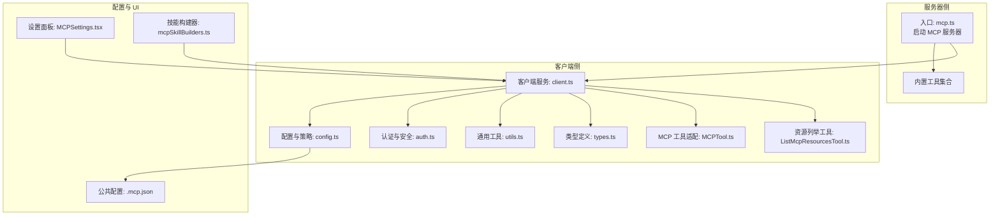
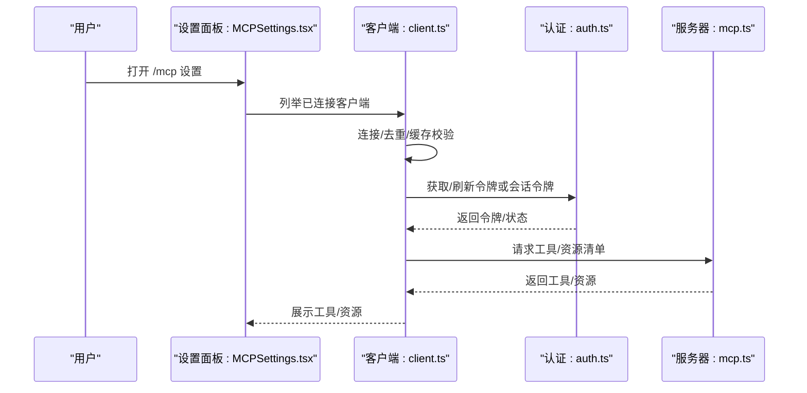
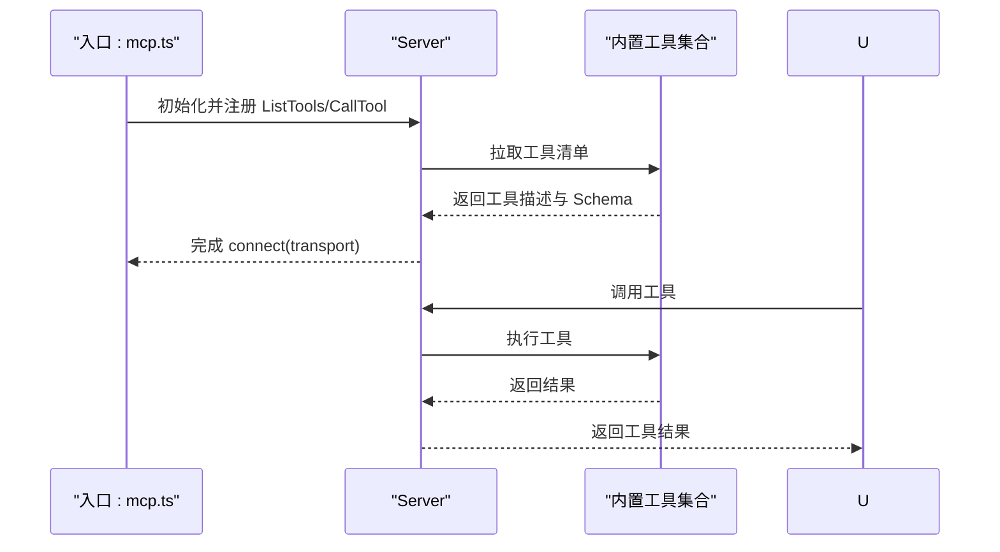
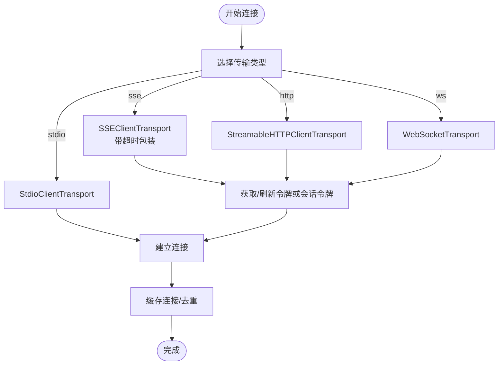
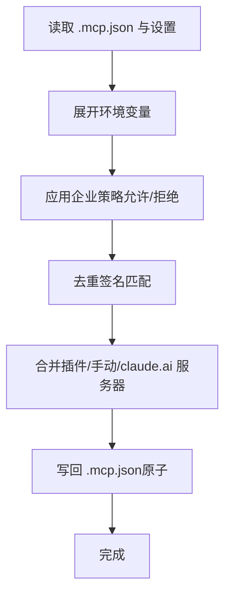
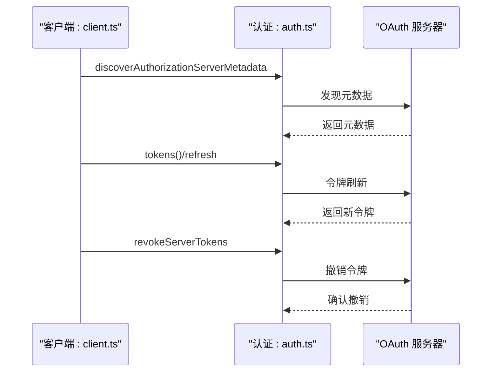
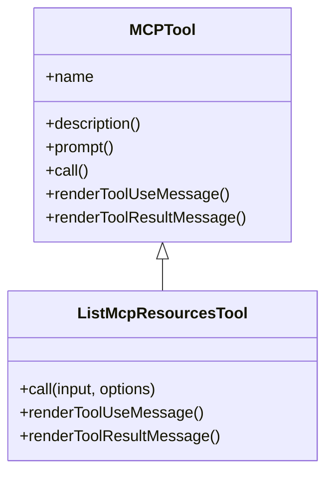
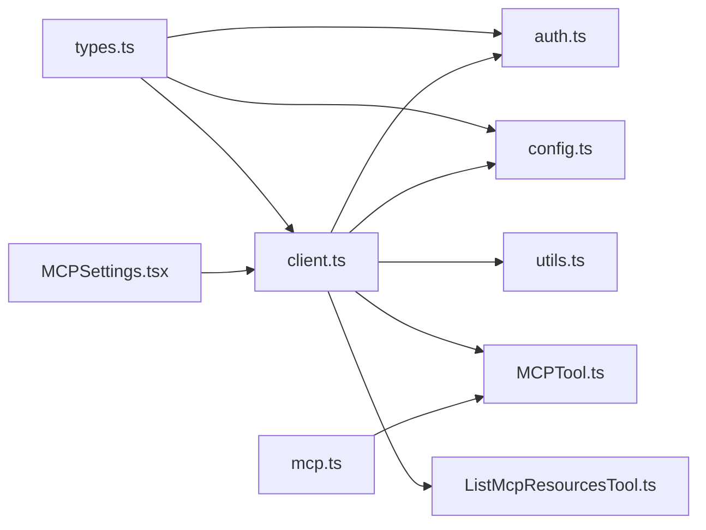

# MCP 集成

<cite>
**本文引用的文件**
- [.mcp.json](file://.mcp.json)
- [mcp.ts](file://src/entrypoints/mcp.ts)
- [client.ts](file://src/services/mcp/client.ts)
- [config.ts](file://src/services/mcp/config.ts)
- [types.ts](file://src/services/mcp/types.ts)
- [auth.ts](file://src/services/mcp/auth.ts)
- [utils.ts](file://src/services/mcp/utils.ts)
- [MCPTool.ts](file://src/tools/MCPTool/MCPTool.ts)
- [ListMcpResourcesTool.ts](file://src/tools/ListMcpResourcesTool/ListMcpResourcesTool.ts)
- [MCPSettings.tsx](file://src/components/mcp/MCPSettings.tsx)
- [mcpSkillBuilders.ts](file://src/skills/mcpSkillBuilders.ts)
</cite>

## 目录
1. [简介](#简介)
2. [项目结构](#项目结构)
3. [核心组件](#核心组件)
4. [架构总览](#架构总览)
5. [详细组件分析](#详细组件分析)
6. [依赖关系分析](#依赖关系分析)
7. [性能考量](#性能考量)
8. [故障排查指南](#故障排查指南)
9. [结论](#结论)
10. [附录](#附录)

## 简介
本文件系统性阐述 Claude Code 对 MCP（Model Context Protocol）的完整集成方案，覆盖协议工作原理、客户端与服务器实现、配置与部署、认证与安全、工具适配、调试与监控、以及在 AI 工具生态中的价值定位。文档面向开发者与运维人员，既提供代码级细节，也给出可操作的实践建议。

## 项目结构
围绕 MCP 的关键模块分布如下：
- 服务器侧入口：提供基于 MCP SDK 的本地服务器启动逻辑，将 Claude Code 内置工具暴露为 MCP 工具。
- 客户端侧服务：负责连接远端 MCP 服务器、认证、资源与工具枚举、错误处理与重连策略。
- 配置与策略：统一解析 .mcp.json、合并插件与企业策略、去重与允许/拒绝列表。
- 工具适配：将现有 Claude Code 工具桥接为 MCP 工具，并提供资源列举工具。
- UI 设置面板：可视化展示已连接服务器、工具与资源，支持菜单式交互。
- 认证与安全：OAuth 发现与刷新、令牌撤销、跨应用访问（XAA）、会话令牌透传等。
- 技能构建器：为 MCP 场景下的技能加载提供注册与解耦。

图表来源
- [mcp.ts:35-196](file://src/entrypoints/mcp.ts#L35-L196)
- [client.ts:1-800](file://src/services/mcp/client.ts#L1-L800)
- [config.ts:1-800](file://src/services/mcp/config.ts#L1-L800)
- [auth.ts:1-800](file://src/services/mcp/auth.ts#L1-L800)
- [utils.ts:1-577](file://src/services/mcp/utils.ts#L1-L577)
- [types.ts:1-260](file://src/services/mcp/types.ts#L1-L260)
- [MCPTool.ts:1-79](file://src/tools/MCPTool/MCPTool.ts#L1-L79)
- [ListMcpResourcesTool.ts:1-125](file://src/tools/ListMcpResourcesTool/ListMcpResourcesTool.ts#L1-L125)
- [.mcp.json:1-12](file://.mcp.json#L1-L12)
- [MCPSettings.tsx:1-399](file://src/components/mcp/MCPSettings.tsx#L1-L399)
- [mcpSkillBuilders.ts:1-46](file://src/skills/mcpSkillBuilders.ts#L1-L46)

章节来源
- [mcp.ts:35-196](file://src/entrypoints/mcp.ts#L35-L196)
- [client.ts:1-800](file://src/services/mcp/client.ts#L1-L800)
- [config.ts:1-800](file://src/services/mcp/config.ts#L1-L800)
- [auth.ts:1-800](file://src/services/mcp/auth.ts#L1-L800)
- [utils.ts:1-577](file://src/services/mcp/utils.ts#L1-L577)
- [types.ts:1-260](file://src/services/mcp/types.ts#L1-L260)
- [MCPTool.ts:1-79](file://src/tools/MCPTool/MCPTool.ts#L1-L79)
- [ListMcpResourcesTool.ts:1-125](file://src/tools/ListMcpResourcesTool/ListMcpResourcesTool.ts#L1-L125)
- [.mcp.json:1-12](file://.mcp.json#L1-L12)
- [MCPSettings.tsx:1-399](file://src/components/mcp/MCPSettings.tsx#L1-L399)
- [mcpSkillBuilders.ts:1-46](file://src/skills/mcpSkillBuilders.ts#L1-L46)

## 核心组件
- MCP 服务器入口：以标准 MCP SDK 启动本地服务器，动态列举并执行 Claude Code 内置工具，作为 MCP 工具提供给外部调用方。
- MCP 客户端服务：封装多种传输方式（stdio、SSE、HTTP、WebSocket），统一认证与请求超时处理，缓存与去重策略，资源与工具的拉取与展示。
- 配置与策略：解析 .mcp.json，合并插件与企业策略，进行命令/URL/名称维度的允许/拒绝过滤，签名去重，代理与 TLS 支持。
- 认证与安全：OAuth 元数据发现、令牌刷新与撤销、跨应用访问（XAA）、会话令牌透传、敏感参数脱敏日志。
- 工具适配：将现有工具转换为 MCP 工具，支持输入输出模式、权限检查、结果截断与 UI 渲染；提供资源列举工具用于聚合多服务器资源。
- UI 设置面板：按服务器维度展示工具与资源，支持菜单导航、认证状态提示与操作入口。
- 技能构建器：为 MCP 场景下的技能加载提供注册点，避免循环依赖。

章节来源
- [mcp.ts:35-196](file://src/entrypoints/mcp.ts#L35-L196)
- [client.ts:1-800](file://src/services/mcp/client.ts#L1-L800)
- [config.ts:1-800](file://src/services/mcp/config.ts#L1-L800)
- [auth.ts:1-800](file://src/services/mcp/auth.ts#L1-L800)
- [utils.ts:1-577](file://src/services/mcp/utils.ts#L1-L577)
- [types.ts:1-260](file://src/services/mcp/types.ts#L1-L260)
- [MCPTool.ts:1-79](file://src/tools/MCPTool/MCPTool.ts#L1-L79)
- [ListMcpResourcesTool.ts:1-125](file://src/tools/ListMcpResourcesTool/ListMcpResourcesTool.ts#L1-L125)
- [MCPSettings.tsx:1-399](file://src/components/mcp/MCPSettings.tsx#L1-L399)
- [mcpSkillBuilders.ts:1-46](file://src/skills/mcpSkillBuilders.ts#L1-L46)

## 架构总览
下图展示了从用户触发到 MCP 服务器/客户端交互的关键路径，以及认证与资源枚举流程。

图表来源
- [MCPSettings.tsx:1-399](file://src/components/mcp/MCPSettings.tsx#L1-L399)
- [client.ts:1-800](file://src/services/mcp/client.ts#L1-L800)
- [auth.ts:1-800](file://src/services/mcp/auth.ts#L1-L800)
- [mcp.ts:35-196](file://src/entrypoints/mcp.ts#L35-L196)

## 详细组件分析

### MCP 服务器实现（本地）
- 启动流程：通过 MCP SDK 创建 Server，声明能力（tools），注册 ListTools 与 CallTool 请求处理器。
- 工具暴露：将内置工具转换为 MCP 工具，生成输入/输出 JSON Schema，限制根级 anyOf/oneOf，确保 MCP SDK 兼容。
- 调用执行：在非交互上下文中构造工具调用上下文，执行工具并返回文本内容，异常转为 isError 结果。

图表来源
- [mcp.ts:35-196](file://src/entrypoints/mcp.ts#L35-L196)

章节来源
- [mcp.ts:35-196](file://src/entrypoints/mcp.ts#L35-L196)

### MCP 客户端服务（远程）
- 传输层：支持 stdio、SSE、HTTP、WebSocket、IDE 特殊类型（sse-ide、ws-ide）、SDK 占位、claude.ai 代理。
- 连接与认证：根据服务器类型选择传输，注入 User-Agent、代理、TLS、会话令牌；对 SSE/HTTP 使用带超时的 fetch 包装；对 WebSocket 注入协议与头部。
- 缓存与去重：按服务器名与配置哈希缓存连接；批量连接与并发控制；对 401/403 做步骤升级检测与重试。
- 资源与工具：统一缓存工具与资源，失效时自动刷新；对连接失败做降级与告警，不影响整体结果。
- 错误处理：区分会话过期（404 JSON-RPC -32001）、认证失败、网络超时等，分别上报与恢复。

图表来源
- [client.ts:619-800](file://src/services/mcp/client.ts#L619-L800)
- [client.ts:1-800](file://src/services/mcp/client.ts#L1-L800)

章节来源
- [client.ts:1-800](file://src/services/mcp/client.ts#L1-L800)

### 配置与策略（.mcp.json 与企业策略）
- 解析与写入：读取/写入 .mcp.json，保留文件权限，原子重命名；支持命令数组、URL、头信息、OAuth 配置。
- 去重与合并：插件服务器与手动服务器去重，优先手动配置；claude.ai 连接与手动配置互斥；签名匹配（命令/URL）去重。
- 企业策略：允许/拒绝列表支持名称、命令、URL 通配；动态过滤；策略来源与范围（用户/项目/企业）。
- 策略校验：Schema 校验、环境变量展开、缺失变量报告；保留/清理敏感字段。

图表来源
- [config.ts:1-800](file://src/services/mcp/config.ts#L1-L800)
- [.mcp.json:1-12](file://.mcp.json#L1-L12)

章节来源
- [config.ts:1-800](file://src/services/mcp/config.ts#L1-L800)
- [.mcp.json:1-12](file://.mcp.json#L1-L12)

### 认证与安全
- OAuth 发现与刷新：支持配置元数据 URL 或 RFC 9728/RFC 8414 自动发现；标准化非标准错误码；带超时的独立 fetch。
- 令牌撤销：先撤销刷新令牌再撤销访问令牌；支持 RFC 7009 与回退 Bearer 方案；可保留步骤升级状态。
- 跨应用访问（XAA）：一次 IdP 登录复用至所有 XAA 服务器；保存与复用令牌；失败阶段归因与清理。
- 会话令牌透传：通过会话入口 JWT 透传到远端服务器，减少重复认证。
- 敏感信息保护：脱敏日志（state/nonce/code 等），安全存储与密钥链集成。

图表来源
- [auth.ts:1-800](file://src/services/mcp/auth.ts#L1-L800)
- [client.ts:1-800](file://src/services/mcp/client.ts#L1-L800)

章节来源
- [auth.ts:1-800](file://src/services/mcp/auth.ts#L1-L800)
- [client.ts:1-800](file://src/services/mcp/client.ts#L1-L800)

### 工具适配与资源列举
- MCP 工具适配：将现有工具转换为 MCP 工具，动态设置名称/描述/输入输出 Schema，渲染工具使用消息与结果消息。
- 资源列举工具：按服务器过滤，批量拉取资源，缓存失效后自动刷新，失败降级不阻塞。

图表来源
- [MCPTool.ts:1-79](file://src/tools/MCPTool/MCPTool.ts#L1-L79)
- [ListMcpResourcesTool.ts:1-125](file://src/tools/ListMcpResourcesTool/ListMcpResourcesTool.ts#L1-L125)

章节来源
- [MCPTool.ts:1-79](file://src/tools/MCPTool/MCPTool.ts#L1-L79)
- [ListMcpResourcesTool.ts:1-125](file://src/tools/ListMcpResourcesTool/ListMcpResourcesTool.ts#L1-L125)

### UI 设置面板
- 服务器分类：按传输类型与认证状态分组展示；支持跳转到工具/资源详情。
- 认证状态：对 SSE/HTTP 服务器通过 ClaudeAuthProvider 检测令牌；结合会话令牌与工具可用性综合判断。
- 操作入口：打开服务器菜单、查看工具列表、返回上级等。

章节来源
- [MCPSettings.tsx:1-399](file://src/components/mcp/MCPSettings.tsx#L1-L399)

### 技能构建器（MCP 场景）
- 注册点：为 MCP 技能发现提供只读注册表，避免模块循环依赖，延迟初始化。
- 用途：在 MCP 服务器连接前加载技能构建器，供后续技能扫描与解析使用。

章节来源
- [mcpSkillBuilders.ts:1-46](file://src/skills/mcpSkillBuilders.ts#L1-L46)

## 依赖关系分析
- 类型与协议：MCP 类型由 SDK 提供，客户端/服务器共享；内部扩展了传输类型与连接状态类型。
- 组件耦合：客户端服务横切认证、配置、工具与资源；UI 仅消费客户端状态；服务器入口与工具集合解耦。
- 外部依赖：MCP SDK、OAuth 规范、WebSocket/SSE/HTTP 传输、安全存储与密钥链。

图表来源
- [types.ts:1-260](file://src/services/mcp/types.ts#L1-L260)
- [client.ts:1-800](file://src/services/mcp/client.ts#L1-L800)
- [auth.ts:1-800](file://src/services/mcp/auth.ts#L1-L800)
- [config.ts:1-800](file://src/services/mcp/config.ts#L1-L800)
- [utils.ts:1-577](file://src/services/mcp/utils.ts#L1-L577)
- [MCPTool.ts:1-79](file://src/tools/MCPTool/MCPTool.ts#L1-L79)
- [ListMcpResourcesTool.ts:1-125](file://src/tools/ListMcpResourcesTool/ListMcpResourcesTool.ts#L1-L125)
- [MCPSettings.tsx:1-399](file://src/components/mcp/MCPSettings.tsx#L1-L399)
- [mcp.ts:35-196](file://src/entrypoints/mcp.ts#L35-L196)

章节来源
- [types.ts:1-260](file://src/services/mcp/types.ts#L1-L260)
- [client.ts:1-800](file://src/services/mcp/client.ts#L1-L800)
- [auth.ts:1-800](file://src/services/mcp/auth.ts#L1-L800)
- [config.ts:1-800](file://src/services/mcp/config.ts#L1-L800)
- [utils.ts:1-577](file://src/services/mcp/utils.ts#L1-L577)
- [MCPTool.ts:1-79](file://src/tools/MCPTool/MCPTool.ts#L1-L79)
- [ListMcpResourcesTool.ts:1-125](file://src/tools/ListMcpResourcesTool/ListMcpResourcesTool.ts#L1-L125)
- [MCPSettings.tsx:1-399](file://src/components/mcp/MCPSettings.tsx#L1-L399)
- [mcp.ts:35-196](file://src/entrypoints/mcp.ts#L35-L196)

## 性能考量
- 连接批处理：批量连接与并发大小可配置，降低握手开销与资源竞争。
- 缓存与去重：连接缓存、资源与工具 LRU 缓存，失效策略与自动刷新，避免重复拉取。
- 超时与信号：独立请求超时，避免单次 AbortSignal 超时导致的“60 秒后立即超时”问题；SSE 流不应用短超时。
- 代理与 TLS：统一代理与 TLS 配置，减少网络往返与握手成本。
- 工具输出截断：对长输出进行截断与提示，避免消息过大影响性能与稳定性。

## 故障排查指南
- 认证失败（401/403）：
  - 检查 OAuth 元数据发现与令牌刷新流程；确认回调端口可用与浏览器弹窗。
  - 若为 XAA：检查 IdP 与 AS 配置、令牌交换阶段与失败原因。
  - 使用 needs-auth 缓存与“清除认证”入口重试。
- 会话过期（404 JSON-RPC -32001）：
  - 客户端识别并清理连接缓存，重新获取连接后重试。
- 网络与代理问题：
  - 核对 HTTP_PROXY/HTTPS_PROXY/NO_PROXY；验证 WebSocket/TLS 代理配置。
- 资源/工具为空：
  - 确认服务器已正确暴露工具与资源；检查缓存是否过期并触发刷新。
- UI 无服务器显示：
  - 使用 /doctor 排查配置与权限；检查项目/用户/企业策略是否阻止显示。

章节来源
- [client.ts:193-206](file://src/services/mcp/client.ts#L193-L206)
- [auth.ts:1-800](file://src/services/mcp/auth.ts#L1-L800)
- [utils.ts:1-577](file://src/services/mcp/utils.ts#L1-L577)

## 结论
Claude Code 的 MCP 集成以“服务器可被外部消费、客户端可被广泛接入”为核心目标，通过标准化的传输与认证、严格的策略与安全、完善的工具与资源适配，实现了与 MCP 生态的深度互通。该方案既满足个人开发者快速体验，也能满足企业级策略与合规要求，是构建 AI 工具生态的重要基础设施。

## 附录

### MCP 服务器配置与部署要点
- .mcp.json 示例：定义本地或远程服务器，含命令、URL、头信息与 OAuth 配置。
- 服务器发现：SSE/HTTP 服务器支持 OAuth 元数据自动发现；可配置固定元数据 URL。
- 传输选择：优先 stdio（本地）、SSE/HTTP（远端）、WebSocket（实时）、IDE 专用类型（sse-ide/ws-ide）。

章节来源
- [.mcp.json:1-12](file://.mcp.json#L1-L12)
- [config.ts:1-800](file://src/services/mcp/config.ts#L1-L800)
- [auth.ts:1-800](file://src/services/mcp/auth.ts#L1-L800)

### MCP 工具适配步骤
- 将现有工具转换为 MCP 工具：设置 isMcp、动态名称/描述、输入输出 Schema。
- 渲染与权限：提供 UI 渲染函数与权限检查钩子。
- 资源列举：使用 ListMcpResourcesTool 聚合多服务器资源。

章节来源
- [MCPTool.ts:1-79](file://src/tools/MCPTool/MCPTool.ts#L1-L79)
- [ListMcpResourcesTool.ts:1-125](file://src/tools/ListMcpResourcesTool/ListMcpResourcesTool.ts#L1-L125)

### MCP 客户端集成指引（第三方应用）
- 选择传输：根据服务器类型选择 stdio/SSE/HTTP/WebSocket。
- 认证流程：遵循 OAuth 元数据发现与令牌刷新；必要时使用会话令牌透传。
- 资源与工具：使用工具/资源枚举接口，结合缓存与失效策略。
- 错误处理：区分认证失败、会话过期、网络异常，分别采取重试/重连/降级策略。

章节来源
- [client.ts:1-800](file://src/services/mcp/client.ts#L1-L800)
- [auth.ts:1-800](file://src/services/mcp/auth.ts#L1-L800)
- [utils.ts:1-577](file://src/services/mcp/utils.ts#L1-L577)