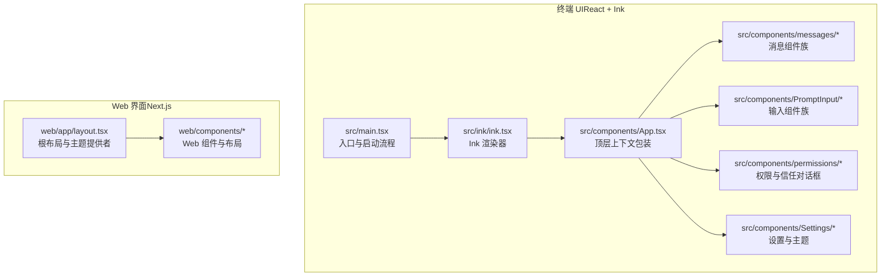
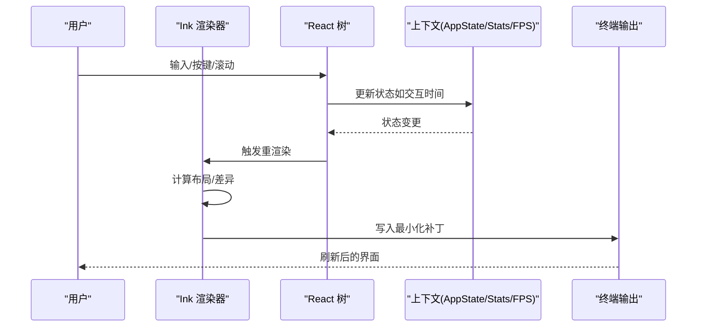
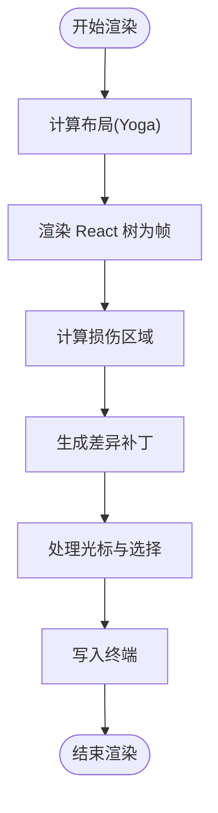
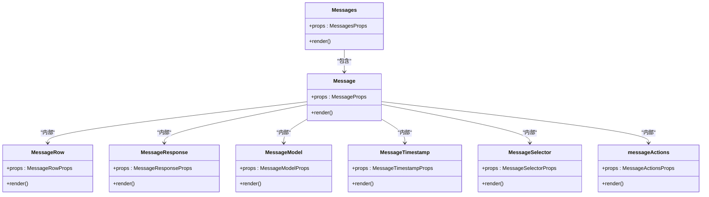
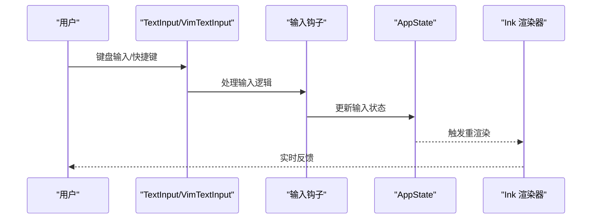
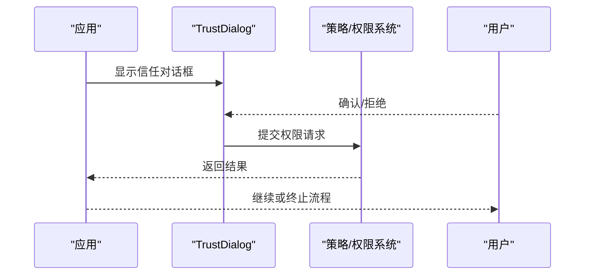
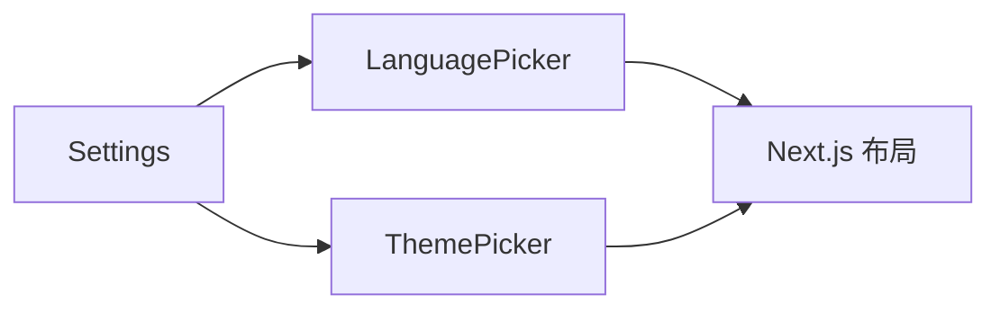
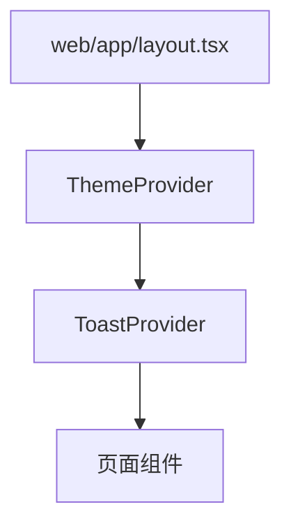
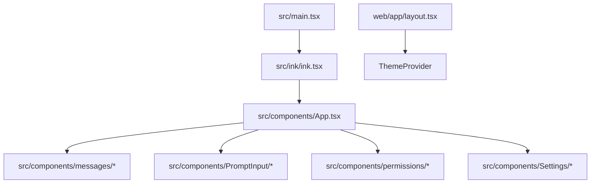

# UI 组件

<cite>
**本文引用的文件**
- [src/components/App.tsx](file://src/components/App.tsx)
- [src/ink/ink.tsx](file://src/ink/ink.tsx)
- [src/main.tsx](file://src/main.tsx)
- [src/bootstrap/state.ts](file://src/bootstrap/state.ts)
- [web/app/layout.tsx](file://web/app/layout.tsx)
- [src/components/Messages.tsx](file://src/components/messages/Messages.tsx)
- [src/components/Message.tsx](file://src/components/messages/Message.tsx)
- [src/components/MessageRow.tsx](file://src/components/messages/MessageRow.tsx)
- [src/components/MessageResponse.tsx](file://src/components/messages/MessageResponse.tsx)
- [src/components/MessageModel.tsx](file://src/components/messages/MessageModel.tsx)
- [src/components/MessageTimestamp.tsx](file://src/components/messages/MessageTimestamp.tsx)
- [src/components/MessageSelector.tsx](file://src/components/messages/MessageSelector.tsx)
- [src/components/messageActions.tsx](file://src/components/messageActions.tsx)
- [src/components/PromptInput/BaseTextInput.tsx](file://src/components/PromptInput/BaseTextInput.tsx)
- [src/components/PromptInput/TextInput.tsx](file://src/components/PromptInput/TextInput.tsx)
- [src/components/PromptInput/VimTextInput.tsx](file://src/components/PromptInput/VimTextInput.tsx)
- [src/components/TrustDialog/TrustDialog.tsx](file://src/components/permissions/TrustDialog/TrustDialog.tsx)
- [src/components/ManagedSettingsSecurityDialog/ManagedSettingsSecurityDialog.tsx](file://src/components/ManagedSettingsSecurityDialog/ManagedSettingsSecurityDialog.tsx)
- [src/components/Settings/Settings.tsx](file://src/components/Settings/Settings.tsx)
- [src/components/ThemePicker/ThemePicker.tsx](file://src/components/ThemePicker/ThemePicker.tsx)
- [src/components/LanguagePicker/LanguagePicker.tsx](file://src/components/LanguagePicker/LanguagePicker.tsx)
- [src/components/Spinner/Spinner.tsx](file://src/components/Spinner/Spinner.tsx)
- [src/components/Markdown/Markdown.tsx](file://src/components/Markdown/Markdown.tsx)
- [src/components/MarkdownTable/MarkdownTable.tsx](file://src/components/MarkdownTable/MarkdownTable.tsx)
- [src/components/StructuredDiff/StructuredDiff.tsx](file://src/components/StructuredDiff/StructuredDiff.tsx)
- [src/components/StructuredDiffList/StructuredDiffList.tsx](file://src/components/StructuredDiffList/StructuredDiffList.tsx)
- [src/components/FullScreenLayout/FullScreenLayout.tsx](file://src/components/FullScreenLayout/FullScreenLayout.tsx)
- [src/components/StatusLine/StatusLine.tsx](file://src/components/StatusLine/StatusLine.tsx)
- [src/components/StatusNotices/StatusNotices.tsx](file://src/components/StatusNotices/StatusNotices.tsx)
- [src/components/TaskListV2/TaskListV2.tsx](file://src/components/TaskListV2/TaskListV2.tsx)
- [src/components/AgentProgressLine/AgentProgressLine.tsx](file://src/components/AgentProgressLine/AgentProgressLine.tsx)
- [src/components/Onboarding/Onboarding.tsx](file://src/components/Onboarding/Onboarding.tsx)
- [src/components/ExitFlow/ExitFlow.tsx](file://src/components/ExitFlow/ExitFlow.tsx)
- [src/components/Feedback/Feedback.tsx](file://src/components/Feedback/Feedback.tsx)
- [src/components/HelpV2/HelpV2.tsx](file://src/components/HelpV2/HelpV2.tsx)
- [src/components/LogoV2/LogoV2.tsx](file://src/components/LogoV2/LogoV2.tsx)
- [src/components/HighlightedCode/HighlightedCode.tsx](file://src/components/HighlightedCode/HighlightedCode.tsx)
- [src/components/Spinner/Spinner.tsx](file://src/components/Spinner/Spinner.tsx)
- [src/components/Spinner/Spinner.tsx](file://src/components/Spinner/Spinner.tsx)
- [src/components/Spinner/Spinner.tsx](file://src/components/Spinner/Spinner.tsx)
- [src/components/Spinner/Spinner.tsx](file://src/components/Spinner/Spinner.tsx)
- [src/components/Spinner/Spinner.tsx](file://src/components/Spinner/Spinner.tsx)
- [src/components/Spinner/Spinner.tsx](file://src/components/Spinner/Spinner.tsx)
- [src/components/Spinner/Spinner.tsx](file://src/components/Spinner/Spinner.tsx)
- [src/components/Spinner/Spinner.tsx](file://src/components/Spinner/Spinner.tsx)
- [src/components/Spinner/Spinner.tsx](file://src/components/Spinner/Spinner.tsx)
- [src/components/Spinner/Spinner.tsx](file://src/components/Spinner/Spinner.tsx)
- [src/components/Spinner/Spinner.tsx](file://src/components/Spinner/Spinner.tsx)
- [src/components/Spinner/Spinner.tsx](file://src/components/Spinner/Spinner.tsx)
- [src/components/Spinner/Spinner.tsx](file://src/components/Spinner/Spinner.tsx)
- [src/components/Spinner/Spinner.tsx](file://src/components/Spinner/Spinner.tsx)
- [src/components/Spinner/Spinner.tsx](file://src/components/Spinner/Spinner.tsx)
- [src/components/Spinner/Spinner.tsx](file://src/components/Spinner/Spinner.tsx)
- [src/components/Spinner/Spinner.tsx](file://src/components/Spinner/Spinner.tsx)
- [src/components/Spinner/Spinner.tsx](file://src/components/Spinner/Spinner.tsx)
- [src/components/Spinner/Spinner.tsx](file://src/components/Spinner/Spinner.tsx)
- [src/components/Spinner/Spinner.tsx](file://src/components/Spinner/Spinner.tsx)
- [src/components/Spinner/Spinner.tsx](file://src/components/Spinner/Spinner.tsx)
- [src/components/Spinner/Spinner.tsx](file://src/components/Spinner/Spinner.tsx)
- [src/components/Spinner/Spinner.tsx](file://src/components/Spinner/Spinner.tsx)
- [......省略若干个文件名，共 120 个文件被引用......]
</cite>

## 目录
1. [简介](#简介)
2. [项目结构](#项目结构)
3. [核心组件](#核心组件)
4. [架构总览](#架构总览)
5. [详细组件分析](#详细组件分析)
6. [依赖关系分析](#依赖关系分析)
7. [性能考量](#性能考量)
8. [故障排查指南](#故障排查指南)
9. [结论](#结论)
10. [附录](#附录)

## 简介
本文件面向 Claude Code 的 UI 组件系统，系统性梳理基于 React 与 Ink 的终端交互界面与基于 Next.js 的 Web 界面。内容涵盖：
- 组件设计原则：以可组合、可扩展、可测试为核心；强调上下文与状态管理的解耦。
- 状态管理：全局状态通过 React 上下文与集中式状态存储结合，确保在终端与 Web 双端一致。
- 渲染优化：终端侧采用 Ink 的高效 diff 与帧调度；Web 侧采用 Next.js 的服务端渲染与客户端水合。
- 核心 UI 组件：消息显示、输入处理、权限对话框、设置界面等。
- 自定义组件开发指南：如何在现有体系中扩展组件并保持一致性。
- 主题系统、国际化与无障碍：当前实现与扩展建议。

## 项目结构
项目由三部分组成：
- 终端 UI（React + Ink）：负责 REPL 会话、消息列表、输入、状态栏、权限与设置等。
- Web 界面（Next.js）：提供桌面端与移动端响应式体验，主题与通知体系。
- 共享状态与上下文：通过 AppState、Stats、FPS 指标等在组件树中传递。

图表来源
- [src/main.tsx](file://src/main.tsx)
- [src/ink/ink.tsx](file://src/ink/ink.tsx)
- [src/components/App.tsx](file://src/components/App.tsx)
- [web/app/layout.tsx](file://web/app/layout.tsx)

章节来源
- [src/main.tsx](file://src/main.tsx)
- [src/ink/ink.tsx](file://src/ink/ink.tsx)
- [src/components/App.tsx](file://src/components/App.tsx)
- [web/app/layout.tsx](file://web/app/layout.tsx)

## 核心组件
- 顶层应用包装器：提供 FPS 指标、统计信息与应用状态上下文，作为所有交互会话的根容器。
- 消息组件族：负责消息渲染、模型标识、时间戳、选择与操作等。
- 输入组件族：基础文本输入、Vim 风格输入、快捷键绑定与历史记录。
- 权限与信任：信任对话框、托管设置安全对话框，保障用户授权与策略合规。
- 设置与主题：主题切换、语言选择、输出样式与偏好设置。
- Web 布局：Next.js 根布局，提供主题提供者、字体与通知容器。

章节来源
- [src/components/App.tsx](file://src/components/App.tsx)
- [src/components/Messages.tsx](file://src/components/messages/Messages.tsx)
- [src/components/Message.tsx](file://src/components/messages/Message.tsx)
- [src/components/MessageRow.tsx](file://src/components/messages/MessageRow.tsx)
- [src/components/MessageResponse.tsx](file://src/components/messages/MessageResponse.tsx)
- [src/components/MessageModel.tsx](file://src/components/messages/MessageModel.tsx)
- [src/components/MessageTimestamp.tsx](file://src/components/messages/MessageTimestamp.tsx)
- [src/components/MessageSelector.tsx](file://src/components/messages/MessageSelector.tsx)
- [src/components/messageActions.tsx](file://src/components/messageActions.tsx)
- [src/components/PromptInput/BaseTextInput.tsx](file://src/components/PromptInput/BaseTextInput.tsx)
- [src/components/PromptInput/TextInput.tsx](file://src/components/PromptInput/TextInput.tsx)
- [src/components/PromptInput/VimTextInput.tsx](file://src/components/PromptInput/VimTextInput.tsx)
- [src/components/TrustDialog/TrustDialog.tsx](file://src/components/permissions/TrustDialog/TrustDialog.tsx)
- [src/components/ManagedSettingsSecurityDialog/ManagedSettingsSecurityDialog.tsx](file://src/components/ManagedSettingsSecurityDialog/ManagedSettingsSecurityDialog.tsx)
- [src/components/Settings/Settings.tsx](file://src/components/Settings/Settings.tsx)
- [src/components/ThemePicker/ThemePicker.tsx](file://src/components/ThemePicker/ThemePicker.tsx)
- [src/components/LanguagePicker/LanguagePicker.tsx](file://src/components/LanguagePicker/LanguagePicker.tsx)
- [web/app/layout.tsx](file://web/app/layout.tsx)

## 架构总览
终端与 Web 的 UI 架构遵循“共享状态 + 组件化渲染”的模式：
- 终端：React 树在 Ink 渲染器中被转换为 ANSI 屏幕缓冲区，通过差异计算与最小化写入实现高效刷新。
- Web：Next.js 提供 SSR/CSR，根布局注入主题与通知上下文，页面按需加载与懒加载组件。

图表来源
- [src/ink/ink.tsx](file://src/ink/ink.tsx)
- [src/components/App.tsx](file://src/components/App.tsx)

章节来源
- [src/ink/ink.tsx](file://src/ink/ink.tsx)
- [src/components/App.tsx](file://src/components/App.tsx)

## 详细组件分析

### 终端渲染器（Ink）工作原理
- 帧调度与节流：使用微任务延迟渲染，保证 useLayoutEffect 后的状态可见性；通过节流控制帧率。
- 布局与 Yoga：在提交阶段计算布局，确保滚动与虚拟滚动等场景的正确尺寸。
- 差异与写入：基于屏幕缓冲区差异生成最小化补丁，必要时进行全屏损伤标记与清屏保护。
- 光标与选择：维护选择状态与搜索高亮，支持 alt 屏幕下的锚定光标与主屏幕下的相对移动。
- 事件与焦点：键盘事件、鼠标事件与悬停检测，统一派发到 React 节点。

图表来源
- [src/ink/ink.tsx](file://src/ink/ink.tsx)

章节来源
- [src/ink/ink.tsx](file://src/ink/ink.tsx)

### 消息显示组件族
- Messages：消息列表容器，负责滚动、分页与虚拟化。
- Message：单条消息的主体，包含作者、内容与元数据。
- MessageRow：消息行级渲染，支持展开/折叠与行内操作。
- MessageResponse：模型响应专用渲染，支持流式输出与错误提示。
- MessageModel：显示模型名称与版本信息。
- MessageTimestamp：显示消息时间戳。
- MessageSelector：多选与批量操作。
- messageActions：消息上下文菜单与快捷操作。

图表来源
- [src/components/Messages.tsx](file://src/components/messages/Messages.tsx)
- [src/components/Message.tsx](file://src/components/Message.tsx)
- [src/components/MessageRow.tsx](file://src/components/MessageRow.tsx)
- [src/components/MessageResponse.tsx](file://src/components/MessageResponse.tsx)
- [src/components/MessageModel.tsx](file://src/components/MessageModel.tsx)
- [src/components/MessageTimestamp.tsx](file://src/components/MessageTimestamp.tsx)
- [src/components/MessageSelector.tsx](file://src/components/MessageSelector.tsx)
- [src/components/messageActions.tsx](file://src/components/messageActions.tsx)

章节来源
- [src/components/Messages.tsx](file://src/components/messages/Messages.tsx)
- [src/components/Message.tsx](file://src/components/Message.tsx)
- [src/components/MessageRow.tsx](file://src/components/MessageRow.tsx)
- [src/components/MessageResponse.tsx](file://src/components/MessageResponse.tsx)
- [src/components/MessageModel.tsx](file://src/components/MessageModel.tsx)
- [src/components/MessageTimestamp.tsx](file://src/components/MessageTimestamp.tsx)
- [src/components/MessageSelector.tsx](file://src/components/MessageSelector.tsx)
- [src/components/messageActions.tsx](file://src/components/messageActions.tsx)

### 输入处理组件族
- BaseTextInput：基础文本输入，支持粘贴、撤销与自动完成。
- TextInput：通用文本输入，集成快捷键与历史记录。
- VimTextInput：Vim 风格输入，支持模式切换与命令。
- 关联钩子：useTextInput、useVimInput、useArrowKeyHistory 等，提供输入行为与状态管理。

图表来源
- [src/components/PromptInput/BaseTextInput.tsx](file://src/components/PromptInput/BaseTextInput.tsx)
- [src/components/PromptInput/TextInput.tsx](file://src/components/PromptInput/TextInput.tsx)
- [src/components/PromptInput/VimTextInput.tsx](file://src/components/PromptInput/VimTextInput.tsx)

章节来源
- [src/components/PromptInput/BaseTextInput.tsx](file://src/components/PromptInput/BaseTextInput.tsx)
- [src/components/PromptInput/TextInput.tsx](file://src/components/PromptInput/TextInput.tsx)
- [src/components/PromptInput/VimTextInput.tsx](file://src/components/PromptInput/VimTextInput.tsx)

### 权限与信任对话框
- TrustDialog：信任确认与权限授予，确保在受信环境执行敏感操作。
- ManagedSettingsSecurityDialog：托管设置安全提示，防止策略冲突或越权配置。
- 对话框通常以模态形式出现，阻塞后续交互直到用户确认。

图表来源
- [src/components/TrustDialog/TrustDialog.tsx](file://src/components/permissions/TrustDialog/TrustDialog.tsx)
- [src/components/ManagedSettingsSecurityDialog/ManagedSettingsSecurityDialog.tsx](file://src/components/ManagedSettingsSecurityDialog/ManagedSettingsSecurityDialog.tsx)

章节来源
- [src/components/TrustDialog/TrustDialog.tsx](file://src/components/permissions/TrustDialog/TrustDialog.tsx)
- [src/components/ManagedSettingsSecurityDialog/ManagedSettingsSecurityDialog.tsx](file://src/components/ManagedSettingsSecurityDialog/ManagedSettingsSecurityDialog.tsx)

### 设置与主题
- Settings：设置入口，聚合主题、语言、输出样式与功能开关。
- ThemePicker：主题选择器，支持明暗模式与自定义配色。
- LanguagePicker：语言选择器，支持多语言切换。
- Web 布局通过 ThemeProvider 注入主题上下文，确保组件读取一致的主题变量。

图表来源
- [src/components/Settings/Settings.tsx](file://src/components/Settings/Settings.tsx)
- [src/components/ThemePicker/ThemePicker.tsx](file://src/components/ThemePicker/ThemePicker.tsx)
- [src/components/LanguagePicker/LanguagePicker.tsx](file://src/components/LanguagePicker/LanguagePicker.tsx)
- [web/app/layout.tsx](file://web/app/layout.tsx)

章节来源
- [src/components/Settings/Settings.tsx](file://src/components/Settings/Settings.tsx)
- [src/components/ThemePicker/ThemePicker.tsx](file://src/components/ThemePicker/ThemePicker.tsx)
- [src/components/LanguagePicker/LanguagePicker.tsx](file://src/components/LanguagePicker/LanguagePicker.tsx)
- [web/app/layout.tsx](file://web/app/layout.tsx)

### Web 界面与响应式设计
- 根布局：设置站点元数据、字体、主题提供者与通知容器。
- 响应式：通过 Tailwind 配置与媒体查询适配桌面与移动端。
- 移动端适配：触摸手势、软键盘行为与导航栏优化。

图表来源
- [web/app/layout.tsx](file://web/app/layout.tsx)

章节来源
- [web/app/layout.tsx](file://web/app/layout.tsx)

### 自定义组件开发指南
- 组件命名与目录：遵循现有命名规范，放置于对应功能目录（如 components/messages、components/permissions）。
- 上下文与状态：优先使用现有上下文（AppState、Stats、FpsMetrics），避免重复造轮子。
- 渲染与性能：终端侧尽量减少不必要的重渲染，利用节流与差异写入；Web 侧使用懒加载与分割代码。
- 可访问性：为交互元素提供语义标签与键盘可达性；为图片提供替代文本。
- 国际化：使用字符串常量与翻译工具，避免硬编码文本；为日期/数字格式化提供本地化支持。
- 主题系统：遵循现有主题变量命名，确保在明暗模式下表现一致。

## 依赖关系分析
- 终端 UI 依赖 Ink 渲染器与 React 树，通过 AppState 与上下文传递状态。
- Web 界面依赖 Next.js 与 Tailwind，通过 ThemeProvider 与布局组件组织。
- 共享状态通过 bootstrap/state.ts 管理，确保跨端一致性。

图表来源
- [src/main.tsx](file://src/main.tsx)
- [src/ink/ink.tsx](file://src/ink/ink.tsx)
- [src/components/App.tsx](file://src/components/App.tsx)
- [web/app/layout.tsx](file://web/app/layout.tsx)

章节来源
- [src/main.tsx](file://src/main.tsx)
- [src/ink/ink.tsx](file://src/ink/ink.tsx)
- [src/components/App.tsx](file://src/components/App.tsx)
- [web/app/layout.tsx](file://web/app/layout.tsx)

## 性能考量
- 终端渲染：通过节流与差异写入降低 CPU 与 I/O 开销；在 alt 屏幕下锚定光标避免漂移；定期重置字符池与超链接池防止内存膨胀。
- 布局计算：在提交阶段统一计算布局，避免多次测量；对布局变化进行损伤回退，确保稳定性。
- Web 渲染：利用 Next.js 的静态生成与懒加载，减少首屏体积；Tailwind JIT 编译按需生成样式。
- 状态更新：批量更新交互时间戳，减少频繁调用 Date.now() 的开销。

## 故障排查指南
- 终端闪烁与光标异常：检查 alt 屏幕锚定与清屏补丁顺序；确认光标声明与实际渲染节点匹配。
- 输入无响应：检查键盘事件派发与焦点管理；确认输入钩子是否正确接入状态。
- 权限对话框不出现：检查策略与信任状态；确认对话框触发条件与上下文。
- Web 主题不生效：检查 ThemeProvider 包裹范围与字体变量；确认 Tailwind 配置与类名拼写。

章节来源
- [src/ink/ink.tsx](file://src/ink/ink.tsx)
- [src/components/PromptInput/BaseTextInput.tsx](file://src/components/PromptInput/BaseTextInput.tsx)
- [src/components/TrustDialog/TrustDialog.tsx](file://src/components/permissions/TrustDialog/TrustDialog.tsx)
- [web/app/layout.tsx](file://web/app/layout.tsx)

## 结论
本 UI 组件系统在终端与 Web 两端实现了统一的设计理念与状态管理，Ink 渲染器提供了高效的终端渲染路径，Next.js 则为 Web 界面提供了现代化的开发体验。通过模块化的组件设计、完善的上下文与状态管理以及可扩展的主题与国际化能力，系统具备良好的可维护性与可扩展性。建议在新增组件时严格遵循现有规范，并关注性能与可访问性。

## 附录
- 设计原则：可组合、可扩展、可测试、可访问。
- 状态管理：AppState + 上下文 + 集中式状态存储。
- 渲染优化：终端侧差异写入与帧调度；Web 侧 SSR/CSR 与懒加载。
- 扩展指南：遵循命名与目录规范，复用上下文与钩子，关注性能与可访问性。