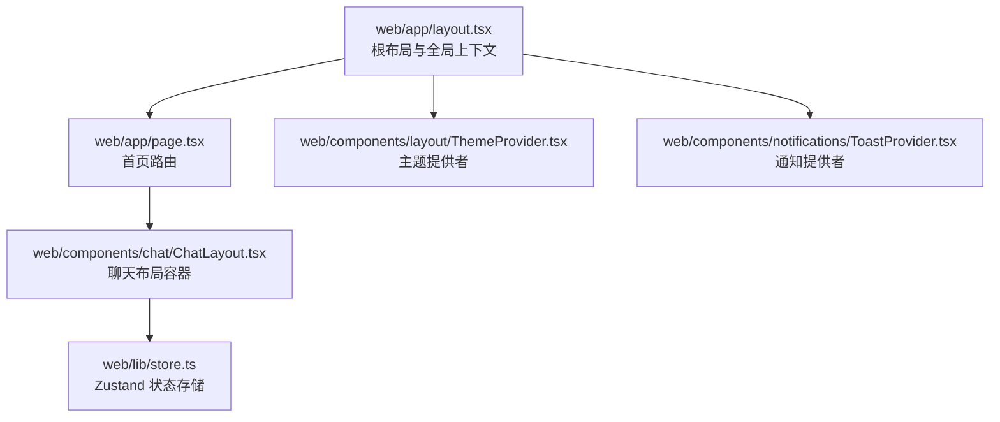
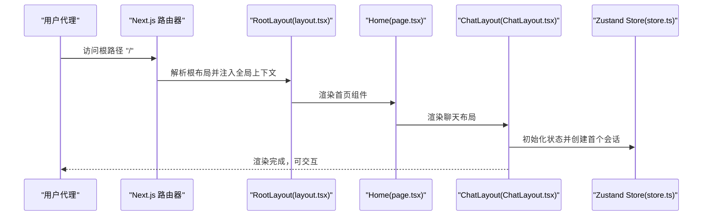
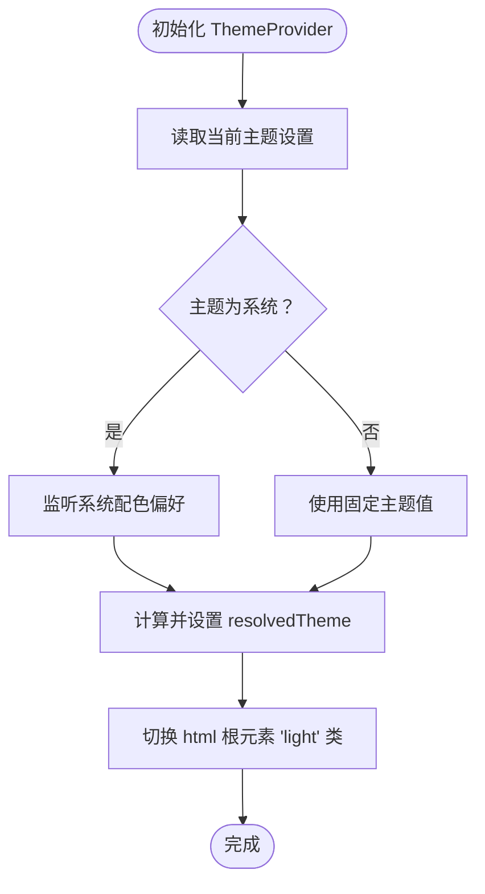
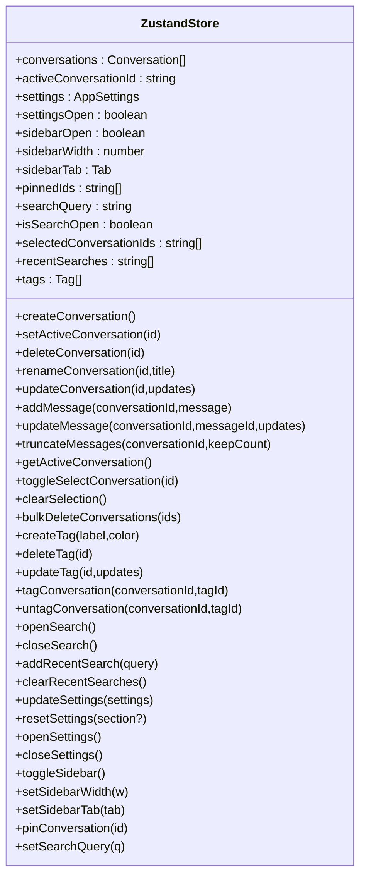
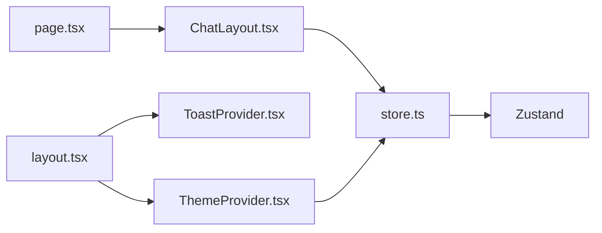

# Next.js 应用架构

<cite>
**本文引用的文件**
- [web/app/layout.tsx](file://web/app/layout.tsx)
- [web/app/page.tsx](file://web/app/page.tsx)
- [web/next.config.ts](file://web/next.config.ts)
- [web/tailwind.config.ts](file://web/tailwind.config.ts)
- [web/tsconfig.json](file://web/tsconfig.json)
- [web/package.json](file://web/package.json)
- [web/components/layout/ThemeProvider.tsx](file://web/components/layout/ThemeProvider.tsx)
- [web/components/notifications/ToastProvider.tsx](file://web/components/notifications/ToastProvider.tsx)
- [web/components/chat/ChatLayout.tsx](file://web/components/chat/ChatLayout.tsx)
- [web/lib/store.ts](file://web/lib/store.ts)
- [web/postcss.config.js](file://web/postcss.config.js)
</cite>

## 目录
1. [引言](#引言)
2. [项目结构](#项目结构)
3. [核心组件](#核心组件)
4. [架构总览](#架构总览)
5. [详细组件分析](#详细组件分析)
6. [依赖关系分析](#依赖关系分析)
7. [性能考量](#性能考量)
8. [故障排查指南](#故障排查指南)
9. [结论](#结论)
10. [附录](#附录)

## 引言
本文件面向 Claude Code 的 Next.js 前端应用，系统性梳理其基于 App Router 的现代架构：页面路由与嵌套布局、服务器组件与客户端组件的协作、中间件与静态资源管理、Tailwind CSS 主题与样式体系、TypeScript 配置与类型约束，以及启动流程、构建优化与部署要点。同时给出性能优化策略（代码分割、懒加载、缓存）与常见问题排查建议，帮助开发者快速理解并高效迭代该应用。

## 项目结构
- 应用根位于 web/ 目录，采用 Next.js App Router 结构，核心入口为 app/ 下的路由定义与全局布局。
- 根布局负责注入字体、主题提供者、通知栈等全局上下文；首页路由直接渲染聊天主界面。
- 样式体系通过 Tailwind CSS 配置与 PostCSS 插件链路统一管理；TypeScript 严格模式确保类型安全。
- 构建与运行由 Next.js 配置与脚本驱动，支持包导入优化、图像优化、Worker 支持与缓存头设置。

图表来源
- [web/app/layout.tsx:1-57](file://web/app/layout.tsx#L1-L57)
- [web/app/page.tsx:1-6](file://web/app/page.tsx#L1-L6)
- [web/components/layout/ThemeProvider.tsx:1-58](file://web/components/layout/ThemeProvider.tsx#L1-L58)
- [web/components/notifications/ToastProvider.tsx:1-13](file://web/components/notifications/ToastProvider.tsx#L1-L13)
- [web/components/chat/ChatLayout.tsx:1-49](file://web/components/chat/ChatLayout.tsx#L1-L49)
- [web/lib/store.ts:1-398](file://web/lib/store.ts#L1-L398)

章节来源
- [web/app/layout.tsx:1-57](file://web/app/layout.tsx#L1-L57)
- [web/app/page.tsx:1-6](file://web/app/page.tsx#L1-L6)
- [web/next.config.ts:1-72](file://web/next.config.ts#L1-L72)
- [web/tailwind.config.ts:1-203](file://web/tailwind.config.ts#L1-L203)
- [web/tsconfig.json:1-28](file://web/tsconfig.json#L1-L28)
- [web/package.json:1-53](file://web/package.json#L1-L53)
- [web/postcss.config.js:1-7](file://web/postcss.config.js#L1-L7)

## 核心组件
- 根布局与元数据：定义站点标题、图标、字体变量注入与全局样式链接，包裹主题与通知提供者，保证 Hydration 安全。
- 首页路由：渲染聊天主布局，作为用户进入后的默认视图。
- 主题提供者：读取设置中的主题策略（深色/浅色/系统），动态切换根元素类名以驱动 Tailwind 暗色选择器。
- 通知提供者：在根布局中注入全局 Toast 栈，确保消息提示贯穿全站。
- 聊天布局：负责侧边栏、头部、主内容区与输入区域的组合，并在首次访问时自动创建会话。
- 状态存储：基于 Zustand 的持久化状态，涵盖会话列表、活动会话、设置、标签与搜索历史等。

章节来源
- [web/app/layout.tsx:1-57](file://web/app/layout.tsx#L1-L57)
- [web/app/page.tsx:1-6](file://web/app/page.tsx#L1-L6)
- [web/components/layout/ThemeProvider.tsx:1-58](file://web/components/layout/ThemeProvider.tsx#L1-L58)
- [web/components/notifications/ToastProvider.tsx:1-13](file://web/components/notifications/ToastProvider.tsx#L1-L13)
- [web/components/chat/ChatLayout.tsx:1-49](file://web/components/chat/ChatLayout.tsx#L1-L49)
- [web/lib/store.ts:1-398](file://web/lib/store.ts#L1-L398)

## 架构总览
下图展示从浏览器请求到页面渲染的关键路径，包括路由解析、布局树、客户端组件挂载与状态初始化。

图表来源
- [web/app/layout.tsx:1-57](file://web/app/layout.tsx#L1-L57)
- [web/app/page.tsx:1-6](file://web/app/page.tsx#L1-L6)
- [web/components/chat/ChatLayout.tsx:1-49](file://web/components/chat/ChatLayout.tsx#L1-L49)
- [web/lib/store.ts:1-398](file://web/lib/store.ts#L1-L398)

## 详细组件分析

### 根布局与全局上下文
- 字体与变量：通过 Google Fonts 与本地字体注入，设置 CSS 变量以供 Tailwind 使用。
- 元数据与图标：集中声明站点标题与 favicon。
- 上下文包裹：ThemeProvider 与 ToastProvider 作为根级上下文，确保主题切换与通知在整站生效。
- Hydration 安全：通过抑制 Hydration 警告，避免首屏与 SSR 内容不一致导致的闪烁或警告。

章节来源
- [web/app/layout.tsx:1-57](file://web/app/layout.tsx#L1-L57)

### 首页路由
- 直接导出 ChatLayout，作为默认入口，简化路由层级。
- 无额外逻辑，便于后续扩展为带参数或动态段的路由。

章节来源
- [web/app/page.tsx:1-6](file://web/app/page.tsx#L1-L6)

### 主题提供者
- 主题策略：支持深色、浅色与系统跟随三种模式，系统模式根据媒体查询自动切换。
- 类名驱动：通过在 html 根节点添加/移除 "light" 类，配合 Tailwind 的暗色选择器实现主题切换。
- 设置联动：主题变更通过状态存储更新，持久化保存。

图表来源
- [web/components/layout/ThemeProvider.tsx:20-44](file://web/components/layout/ThemeProvider.tsx#L20-L44)

章节来源
- [web/components/layout/ThemeProvider.tsx:1-58](file://web/components/layout/ThemeProvider.tsx#L1-L58)

### 通知提供者
- 在根布局中注入 ToastStack，使所有页面共享同一通知队列。
- 无需额外 props 传递，天然具备全局可用性。

章节来源
- [web/components/notifications/ToastProvider.tsx:1-13](file://web/components/notifications/ToastProvider.tsx#L1-L13)

### 聊天布局
- 生命周期：在挂载时检查会话列表，若为空则自动创建首个会话。
- 结构：侧边栏、头部、主内容区与输入区组合，形成完整的聊天界面骨架。
- 可访问性：包含跳转至主内容的快捷键与 Announcer 提供者，提升无障碍体验。

章节来源
- [web/components/chat/ChatLayout.tsx:1-49](file://web/components/chat/ChatLayout.tsx#L1-L49)

### 状态存储（Zustand）
- 数据模型：包含会话列表、活动会话、设置、标签、搜索历史与 UI 状态。
- 持久化：仅持久化与用户行为相关的核心数据，UI 状态（如设置面板开关、搜索面板等）不持久化。
- 合并策略：重启后对缺失字段进行默认值回填，确保兼容性。
- 功能覆盖：会话 CRUD、消息 CRUD、批量操作、标签管理、搜索历史、设置更新与重置等。

图表来源
- [web/lib/store.ts:54-117](file://web/lib/store.ts#L54-L117)
- [web/lib/store.ts:119-397](file://web/lib/store.ts#L119-L397)

章节来源
- [web/lib/store.ts:1-398](file://web/lib/store.ts#L1-L398)

## 依赖关系分析
- 组件依赖：ChatLayout 依赖 Zustand 存储与布局组件；ThemeProvider 依赖状态存储以读取主题设置；RootLayout 依赖两者以提供全局上下文。
- 样式依赖：Tailwind 通过 darkMode 选择器与 CSS 变量实现主题切换；PostCSS 自动前缀与 Tailwind 处理器串联。
- 构建依赖：Next.js 配置启用包导入优化、图像格式与缓存头、Webpack Worker 规则与浏览器端忽略 Node 模块回退。

图表来源
- [web/app/layout.tsx:1-57](file://web/app/layout.tsx#L1-L57)
- [web/components/layout/ThemeProvider.tsx:1-58](file://web/components/layout/ThemeProvider.tsx#L1-L58)
- [web/components/notifications/ToastProvider.tsx:1-13](file://web/components/notifications/ToastProvider.tsx#L1-L13)
- [web/app/page.tsx:1-6](file://web/app/page.tsx#L1-L6)
- [web/components/chat/ChatLayout.tsx:1-49](file://web/components/chat/ChatLayout.tsx#L1-L49)
- [web/lib/store.ts:1-398](file://web/lib/store.ts#L1-L398)

章节来源
- [web/next.config.ts:1-72](file://web/next.config.ts#L1-L72)
- [web/tailwind.config.ts:1-203](file://web/tailwind.config.ts#L1-L203)
- [web/postcss.config.js:1-7](file://web/postcss.config.js#L1-L7)
- [web/package.json:1-53](file://web/package.json#L1-L53)

## 性能考量
- 代码分割与懒加载
  - App Router 默认按路由分块，减少初始包体积。
  - 建议对重型组件（如编辑器、可视化图表）采用动态导入与 Suspense 边界，按需加载。
- 图像优化
  - Next.js 图像优化已启用多种格式与缓存 TTL，建议结合占位符与尺寸适配进一步优化。
- 包导入优化
  - 已开启 optimizePackageImports，针对常用库（如图标、Radix 组件）减少打包体积。
- 缓存策略
  - 静态资源与字体设置长期缓存头，显著降低重复访问成本。
  - Web Worker 支持用于后台任务，避免主线程阻塞。
- 构建与分析
  - 可通过 ANALYZE 环境变量启用 Bundle Analyzer，定位大体积模块。
- TypeScript 严格模式
  - 严格的类型检查有助于在编译期发现潜在性能问题（如过度渲染、不必要计算）。

章节来源
- [web/next.config.ts:8-72](file://web/next.config.ts#L8-L72)
- [web/package.json:5-11](file://web/package.json#L5-L11)

## 故障排查指南
- 主题切换无效
  - 检查 html 根元素是否正确添加/移除 "light" 类；确认 ThemeProvider 是否包裹在 RootLayout 内。
  - 确认 Tailwind darkMode 选择器配置与 CSS 变量一致。
- Hydration 警告
  - 确保客户端组件在 use client 指令下渲染；避免在服务端与客户端输出不一致。
- 图片未优化或缓存异常
  - 检查 images 配置与缓存头规则；确认图片格式与尺寸。
- Worker 加载失败
  - 检查 Webpack Worker 规则与 publicPath 配置；确认 Worker 文件命名与路径。
- 构建体积过大
  - 使用 Bundle Analyzer 分析；优先拆分非关键路径组件；复用 optimizePackageImports 列表。

章节来源
- [web/components/layout/ThemeProvider.tsx:20-44](file://web/components/layout/ThemeProvider.tsx#L20-L44)
- [web/tailwind.config.ts:4-11](file://web/tailwind.config.ts#L4-L11)
- [web/next.config.ts:18-68](file://web/next.config.ts#L18-L68)

## 结论
该 Next.js 应用以 App Router 为核心，结合服务器组件与客户端组件的清晰边界、Zustand 状态持久化、Tailwind 主题系统与严格的 TypeScript 配置，形成了现代化、可维护且高性能的前端架构。通过合理的缓存策略、包导入优化与按需加载，能够在保证开发体验的同时，持续优化用户体验与性能表现。

## 附录
- 启动与构建
  - 开发：执行开发服务器脚本，监听端口并热更新。
  - 构建：生成生产包，自动应用优化与缓存头。
  - 启动：运行生产服务器，加载预构建产物。
- 部署建议
  - 使用 Next.js 推荐的托管平台或自建反向代理；确保缓存头与静态资源路径正确。
  - 对敏感环境变量进行注入，避免在客户端暴露。

章节来源
- [web/package.json:5-11](file://web/package.json#L5-L11)