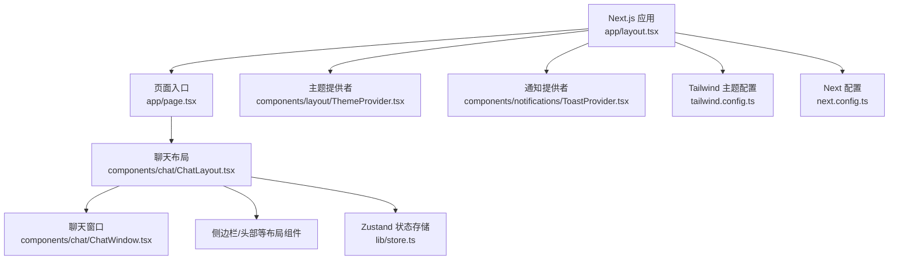
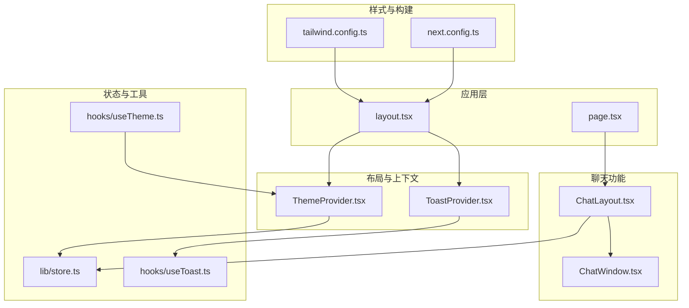
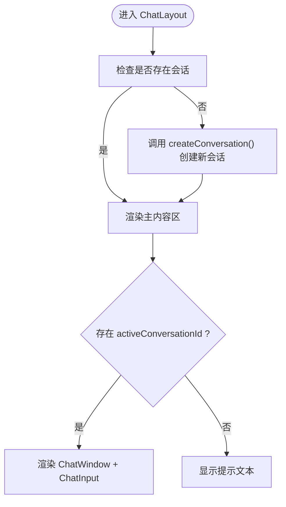
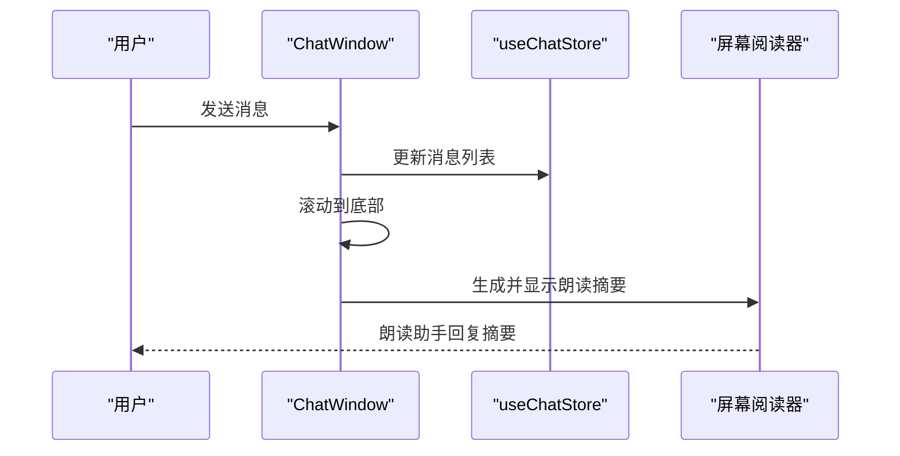
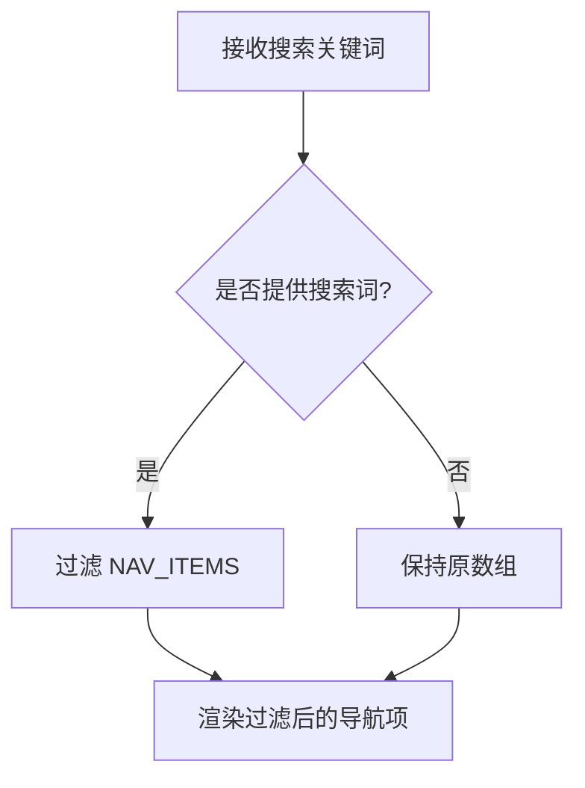
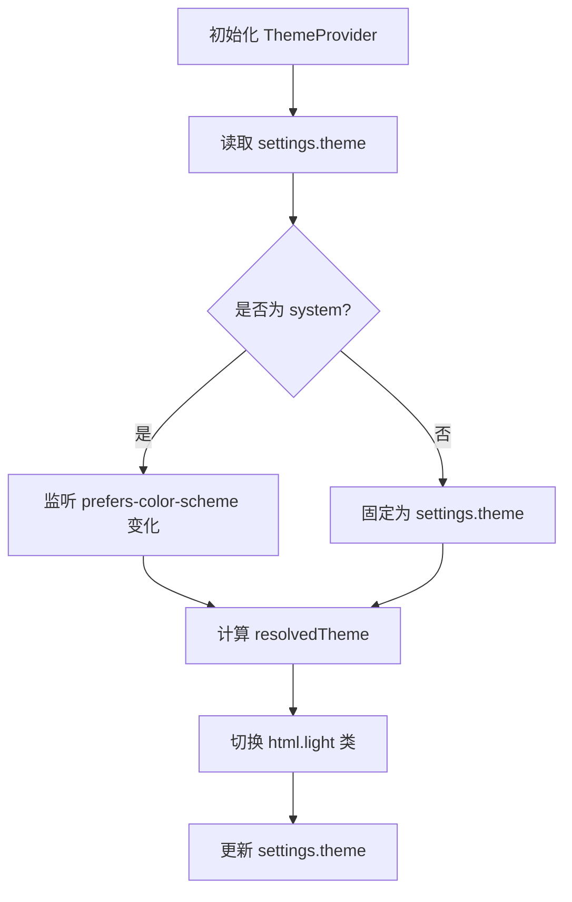
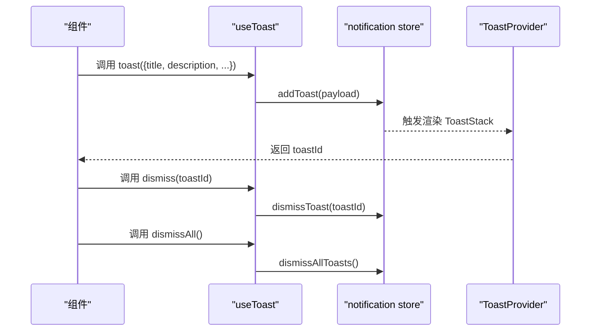
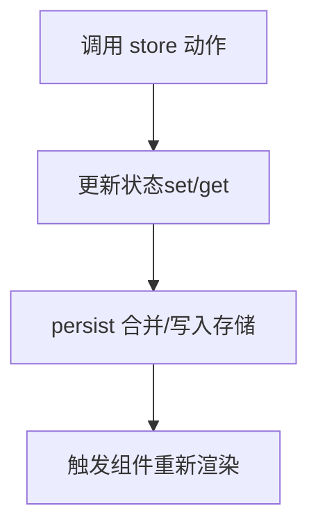
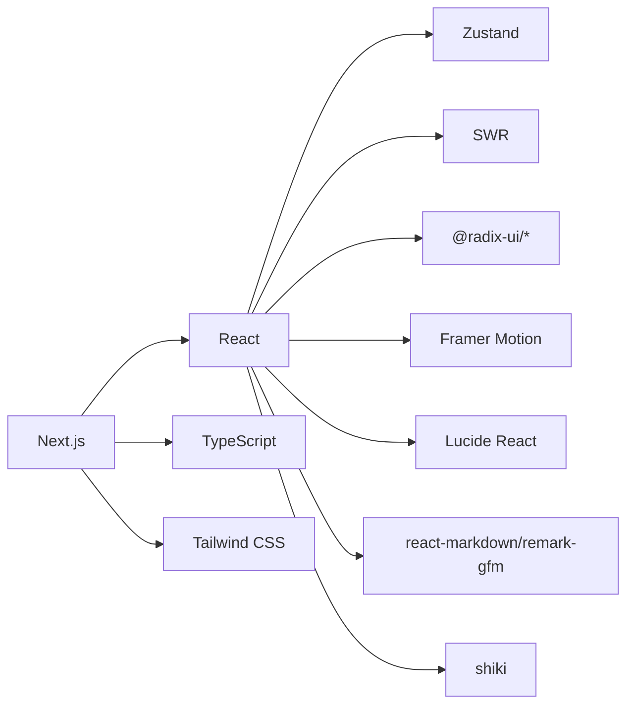

# Web 组件

<cite>
**本文引用的文件**
- [web/package.json](file://web/package.json)
- [web/next.config.ts](file://web/next.config.ts)
- [web/tsconfig.json](file://web/tsconfig.json)
- [web/tailwind.config.ts](file://web/tailwind.config.ts)
- [web/app/layout.tsx](file://web/app/layout.tsx)
- [web/app/page.tsx](file://web/app/page.tsx)
- [web/components/chat/ChatLayout.tsx](file://web/components/chat/ChatLayout.tsx)
- [web/components/chat/ChatWindow.tsx](file://web/components/chat/ChatWindow.tsx)
- [web/components/settings/SettingsNav.tsx](file://web/components/settings/SettingsNav.tsx)
- [web/lib/store.ts](file://web/lib/store.ts)
- [web/components/layout/ThemeProvider.tsx](file://web/components/layout/ThemeProvider.tsx)
- [web/components/notifications/ToastProvider.tsx](file://web/components/notifications/ToastProvider.tsx)
- [web/hooks/useTheme.ts](file://web/hooks/useTheme.ts)
- [web/hooks/useToast.ts](file://web/hooks/useToast.ts)
</cite>

## 目录
1. [简介](#简介)
2. [项目结构](#项目结构)
3. [核心组件](#核心组件)
4. [架构总览](#架构总览)
5. [详细组件分析](#详细组件分析)
6. [依赖关系分析](#依赖关系分析)
7. [性能考量](#性能考量)
8. [故障排查指南](#故障排查指南)
9. [结论](#结论)
10. [附录](#附录)

## 简介
本文件面向 Claude Code 的 Web UI 组件，围绕基于 Next.js 的前端应用进行系统化说明。内容涵盖页面路由与入口、组件组织方式、状态管理方案、核心功能组件（聊天界面、文件查看器、设置面板、通知系统）的职责与交互流程，并对响应式布局、移动端适配、主题系统、国际化与 SEO 等设计要点进行解析。同时给出性能优化策略与扩展指南，帮助开发者在现有组件库基础上进行二次开发。

## 项目结构
Web 前端位于仓库的 web 目录，采用 Next.js App Router 结构，使用 TypeScript、Tailwind CSS 作为样式基础，并通过 Zustand 进行轻量状态管理。关键目录与文件如下：
- 应用入口与全局配置：app/layout.tsx、app/page.tsx、next.config.ts、tsconfig.json、tailwind.config.ts
- 组件层：components/chat、components/settings、components/layout、components/notifications、components/ui 等
- 钩子与工具：hooks、lib（含 store、store 持久化、主题与通知等）
- 依赖与构建：package.json

图表来源
- [web/app/layout.tsx:1-57](file://web/app/layout.tsx#L1-L57)
- [web/app/page.tsx:1-6](file://web/app/page.tsx#L1-L6)
- [web/components/chat/ChatLayout.tsx:1-49](file://web/components/chat/ChatLayout.tsx#L1-L49)
- [web/components/chat/ChatWindow.tsx:1-95](file://web/components/chat/ChatWindow.tsx#L1-L95)
- [web/lib/store.ts:1-398](file://web/lib/store.ts#L1-L398)
- [web/components/layout/ThemeProvider.tsx:1-58](file://web/components/layout/ThemeProvider.tsx#L1-L58)
- [web/components/notifications/ToastProvider.tsx:1-13](file://web/components/notifications/ToastProvider.tsx#L1-L13)
- [web/tailwind.config.ts:1-203](file://web/tailwind.config.ts#L1-L203)
- [web/next.config.ts:1-72](file://web/next.config.ts#L1-L72)

章节来源
- [web/app/layout.tsx:1-57](file://web/app/layout.tsx#L1-L57)
- [web/app/page.tsx:1-6](file://web/app/page.tsx#L1-L6)
- [web/next.config.ts:1-72](file://web/next.config.ts#L1-L72)
- [web/tsconfig.json:1-28](file://web/tsconfig.json#L1-L28)
- [web/tailwind.config.ts:1-203](file://web/tailwind.config.ts#L1-L203)

## 核心组件
- 聊天布局 ChatLayout：负责初始化会话、渲染侧边栏与主内容区、承载聊天窗口与输入区域。
- 聊天窗口 ChatWindow：展示消息列表、滚动至底部、读屏朗读助手回复摘要。
- 设置导航 SettingsNav：按分组展示设置项并支持搜索过滤。
- 主题提供者 ThemeProvider：统一管理明暗主题与系统跟随逻辑。
- 通知 ToastProvider：全局挂载通知栈，配合 useToast 钩子使用。
- 状态存储 useChatStore：以 Zustand + persist 实现会话、消息、标签、设置等状态持久化。

章节来源
- [web/components/chat/ChatLayout.tsx:1-49](file://web/components/chat/ChatLayout.tsx#L1-L49)
- [web/components/chat/ChatWindow.tsx:1-95](file://web/components/chat/ChatWindow.tsx#L1-L95)
- [web/components/settings/SettingsNav.tsx:1-75](file://web/components/settings/SettingsNav.tsx#L1-L75)
- [web/components/layout/ThemeProvider.tsx:1-58](file://web/components/layout/ThemeProvider.tsx#L1-L58)
- [web/components/notifications/ToastProvider.tsx:1-13](file://web/components/notifications/ToastProvider.tsx#L1-L13)
- [web/lib/store.ts:1-398](file://web/lib/store.ts#L1-L398)

## 架构总览
整体采用“布局容器 + 功能模块 + 状态存储 + 主题/通知上下文”的分层架构。页面从 app/page.tsx 渲染 ChatLayout，后者组合 Sidebar/Header/ChatWindow/ChatInput 等组件；状态通过 useChatStore 统一管理；主题与通知分别由 ThemeProvider 和 ToastProvider 提供。

图表来源
- [web/app/layout.tsx:1-57](file://web/app/layout.tsx#L1-L57)
- [web/app/page.tsx:1-6](file://web/app/page.tsx#L1-L6)
- [web/components/layout/ThemeProvider.tsx:1-58](file://web/components/layout/ThemeProvider.tsx#L1-L58)
- [web/components/notifications/ToastProvider.tsx:1-13](file://web/components/notifications/ToastProvider.tsx#L1-L13)
- [web/components/chat/ChatLayout.tsx:1-49](file://web/components/chat/ChatLayout.tsx#L1-L49)
- [web/components/chat/ChatWindow.tsx:1-95](file://web/components/chat/ChatWindow.tsx#L1-L95)
- [web/lib/store.ts:1-398](file://web/lib/store.ts#L1-L398)
- [web/hooks/useTheme.ts:1-2](file://web/hooks/useTheme.ts#L1-L2)
- [web/hooks/useToast.ts:1-30](file://web/hooks/useToast.ts#L1-L30)
- [web/tailwind.config.ts:1-203](file://web/tailwind.config.ts#L1-L203)
- [web/next.config.ts:1-72](file://web/next.config.ts#L1-L72)

## 详细组件分析

### 聊天布局 ChatLayout
职责
- 初始化空会话（若无会话则自动创建）
- 渲染侧边栏与主内容区
- 在主内容区中根据当前会话渲染 ChatWindow 与 ChatInput
- 提供无障碍支持（跳转到主内容、朗读器）

数据流
- 从 useChatStore 读取 conversations 与 activeConversationId
- 若无活动会话，显示提示信息

图表来源
- [web/components/chat/ChatLayout.tsx:1-49](file://web/components/chat/ChatLayout.tsx#L1-L49)
- [web/lib/store.ts:139-157](file://web/lib/store.ts#L139-L157)

章节来源
- [web/components/chat/ChatLayout.tsx:1-49](file://web/components/chat/ChatLayout.tsx#L1-L49)
- [web/lib/store.ts:139-157](file://web/lib/store.ts#L139-L157)

### 聊天窗口 ChatWindow
职责
- 展示消息列表，支持滚动到底部
- 当助手最新消息完成时，向读屏朗读摘要
- 无消息时展示欢迎占位

处理逻辑
- 计算 isStreaming 以标记加载状态
- 使用 useRef 持有底部锚点，随消息数量变化平滑滚动
- 通过状态 announcement 触发读屏朗读

图表来源
- [web/components/chat/ChatWindow.tsx:1-95](file://web/components/chat/ChatWindow.tsx#L1-L95)
- [web/lib/store.ts:194-225](file://web/lib/store.ts#L194-L225)

章节来源
- [web/components/chat/ChatWindow.tsx:1-95](file://web/components/chat/ChatWindow.tsx#L1-L95)
- [web/lib/store.ts:194-225](file://web/lib/store.ts#L194-L225)

### 设置导航 SettingsNav
职责
- 将设置项按分组展示为可点击导航项
- 支持按名称过滤
- 通过 onChange 切换当前激活的设置分组

图表来源
- [web/components/settings/SettingsNav.tsx:1-75](file://web/components/settings/SettingsNav.tsx#L1-L75)

章节来源
- [web/components/settings/SettingsNav.tsx:1-75](file://web/components/settings/SettingsNav.tsx#L1-L75)

### 主题系统 ThemeProvider
职责
- 管理主题模式（暗色/亮色/系统跟随）
- 根据 resolvedTheme 切换 html 根元素的 light 类名
- 通过 useChatStore.updateSettings 更新持久化设置

图表来源
- [web/components/layout/ThemeProvider.tsx:1-58](file://web/components/layout/ThemeProvider.tsx#L1-L58)
- [web/lib/store.ts:311-315](file://web/lib/store.ts#L311-L315)

章节来源
- [web/components/layout/ThemeProvider.tsx:1-58](file://web/components/layout/ThemeProvider.tsx#L1-L58)
- [web/hooks/useTheme.ts:1-2](file://web/hooks/useTheme.ts#L1-L2)
- [web/lib/store.ts:311-315](file://web/lib/store.ts#L311-L315)

### 通知系统 ToastProvider 与 useToast
职责
- ToastProvider 全局挂载通知栈
- useToast 提供 toast()/dismiss()/dismissAll() 方法，内部使用 lib/notifications 中的状态存储

图表来源
- [web/components/notifications/ToastProvider.tsx:1-13](file://web/components/notifications/ToastProvider.tsx#L1-L13)
- [web/hooks/useToast.ts:1-30](file://web/hooks/useToast.ts#L1-L30)

章节来源
- [web/components/notifications/ToastProvider.tsx:1-13](file://web/components/notifications/ToastProvider.tsx#L1-L13)
- [web/hooks/useToast.ts:1-30](file://web/hooks/useToast.ts#L1-L30)

### 状态管理 useChatStore（Zustand）
职责
- 维护会话列表、活动会话、消息、标签、最近搜索、设置等
- 提供创建/删除/重命名会话、添加/更新消息、批量操作、标签管理、搜索历史、设置更新等动作
- 使用 persist 中间件实现本地持久化，仅持久化必要字段，避免 UI 状态被持久化

图表来源
- [web/lib/store.ts:1-398](file://web/lib/store.ts#L1-L398)

章节来源
- [web/lib/store.ts:1-398](file://web/lib/store.ts#L1-L398)

## 依赖关系分析
- 构建与运行时
  - Next.js 14（App Router、实验特性、打包分析）
  - React 18、TypeScript、Tailwind CSS
- UI 与动画
  - Radix UI 组件库、Framer Motion、Lucide React 图标
- 状态与数据
  - Zustand（状态）、SWR（数据获取，用于服务端场景）
- 工具与样式
  - Shiki（语法高亮）、React Markdown/GFM（Markdown 渲染）、clsx/tailwind-merge（类名合并）

图表来源
- [web/package.json:12-38](file://web/package.json#L12-L38)
- [web/next.config.ts:1-72](file://web/next.config.ts#L1-L72)

章节来源
- [web/package.json:1-53](file://web/package.json#L1-L53)
- [web/next.config.ts:1-72](file://web/next.config.ts#L1-L72)

## 性能考量
- 代码分割与懒加载
  - Next.js App Router 自动按路由拆分包，减少初始包体积
  - 可结合动态导入（如对话框、工具面板）进一步按需加载
- 图片与静态资源
  - Next 图片优化：AVIF/WebP 格式、缓存头配置
  - 静态资源强缓存（immutable），降低重复请求
- 打包优化
  - optimizePackageImports：仅引入需要的 Radix UI 组件，减小包体
  - Bundle Analyzer：可选开启分析包组成
- 运行时优化
  - Web Worker 支持：在 webpack 中配置 worker-loader，将耗时任务移出主线程
  - 压缩响应：开启 gzip/deflate 压缩
- 渲染性能
  - 使用虚拟滚动（如虚拟消息列表）处理长列表
  - 合理拆分组件、避免不必要的重渲染（useMemo/useCallback）

章节来源
- [web/next.config.ts:8-72](file://web/next.config.ts#L8-L72)
- [web/package.json:40-51](file://web/package.json#L40-L51)

## 故障排查指南
- 主题不生效或切换无效
  - 检查 ThemeProvider 是否包裹根组件
  - 确认 html 根元素是否正确添加/移除 light 类
  - 查看 useChatStore 中 settings.theme 的值是否被持久化覆盖
- 通知不显示
  - 确认 ToastProvider 已挂载在根节点
  - 检查 useToast 返回的 toastId 与通知存储状态
- 聊天窗口无法滚动到底部
  - 检查 ChatWindow 中 bottomRef 是否正确挂载
  - 确认消息长度变化后是否触发滚动
- 设置项无法保存
  - 检查 persist 配置是否正确合并默认值
  - 确认 updateSettings 是否被调用且未被 UI 状态覆盖

章节来源
- [web/components/layout/ThemeProvider.tsx:20-58](file://web/components/layout/ThemeProvider.tsx#L20-L58)
- [web/components/notifications/ToastProvider.tsx:1-13](file://web/components/notifications/ToastProvider.tsx#L1-L13)
- [web/hooks/useToast.ts:1-30](file://web/hooks/useToast.ts#L1-L30)
- [web/components/chat/ChatWindow.tsx:12-40](file://web/components/chat/ChatWindow.tsx#L12-L40)
- [web/lib/store.ts:372-396](file://web/lib/store.ts#L372-L396)

## 结论
该 Web UI 以 Next.js 为基础，采用清晰的分层架构与轻量状态管理，结合 Tailwind 主题系统与无障碍支持，提供了良好的可维护性与扩展性。通过合理的性能优化策略与模块化组件设计，能够支撑从聊天界面到设置面板的完整开发体验。后续可在现有组件库上继续扩展更多工具面板、文件查看器与协作能力。

## 附录

### 页面路由与入口
- app/layout.tsx：全局布局、字体加载、主题与通知上下文包裹、元数据
- app/page.tsx：首页直接渲染 ChatLayout

章节来源
- [web/app/layout.tsx:1-57](file://web/app/layout.tsx#L1-L57)
- [web/app/page.tsx:1-6](file://web/app/page.tsx#L1-L6)

### 响应式布局与移动端适配
- Tailwind darkMode 使用选择器控制暗色默认、亮色通过根元素类名启用
- 组件内使用语义化类名与相对单位，确保在不同尺寸下保持一致间距与字号
- 建议在新增组件时遵循 Tailwind 主题变量与圆角、过渡时长规范

章节来源
- [web/tailwind.config.ts:4-153](file://web/tailwind.config.ts#L4-L153)

### 国际化与 SEO
- 国际化：当前语言为英文，建议在应用层通过 i18n 库（如 next-i18next 或 react-i18next）进行多语言支持
- SEO：在 app/layout.tsx 中设置标题、描述与图标；可扩展 Open Graph、结构化数据等

章节来源
- [web/app/layout.tsx:32-38](file://web/app/layout.tsx#L32-L38)

### 自定义 Web 组件开发指南
- 新增组件建议
  - 采用受控/非受控组件模式，明确 props 与回调
  - 使用 Tailwind 主题变量与动画常量，保持视觉一致性
  - 对外暴露稳定接口，避免过度耦合 store
- 状态管理
  - 优先使用现有 useChatStore 的动作方法；仅在必要时新增独立 store
  - 对于 UI 状态（如展开/收起、焦点），避免持久化
- 主题与通知
  - 通过 ThemeProvider/useTheme 获取主题状态
  - 通过 useToast 提供用户反馈，避免直接操作 DOM
- 性能
  - 大列表使用虚拟滚动
  - 按需加载重型依赖（如 Markdown/语法高亮）
  - 合理拆分组件，避免不必要的重渲染

章节来源
- [web/lib/store.ts:1-398](file://web/lib/store.ts#L1-L398)
- [web/hooks/useTheme.ts:1-2](file://web/hooks/useTheme.ts#L1-L2)
- [web/hooks/useToast.ts:1-30](file://web/hooks/useToast.ts#L1-L30)