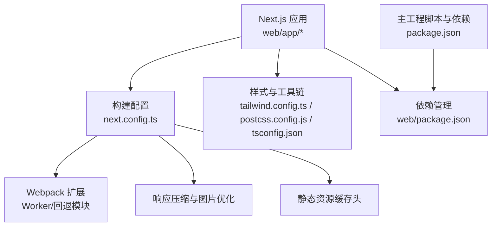
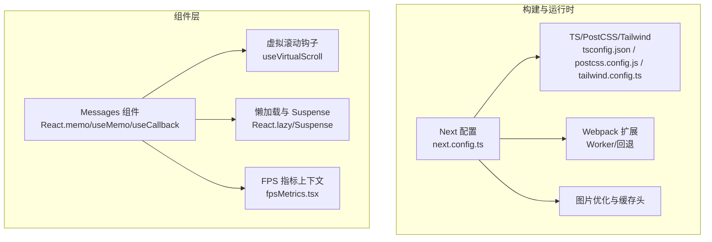
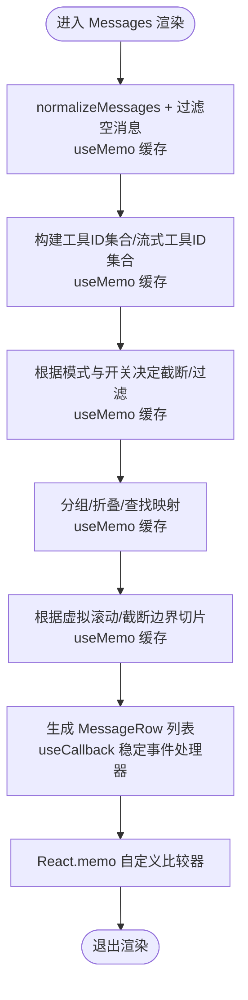
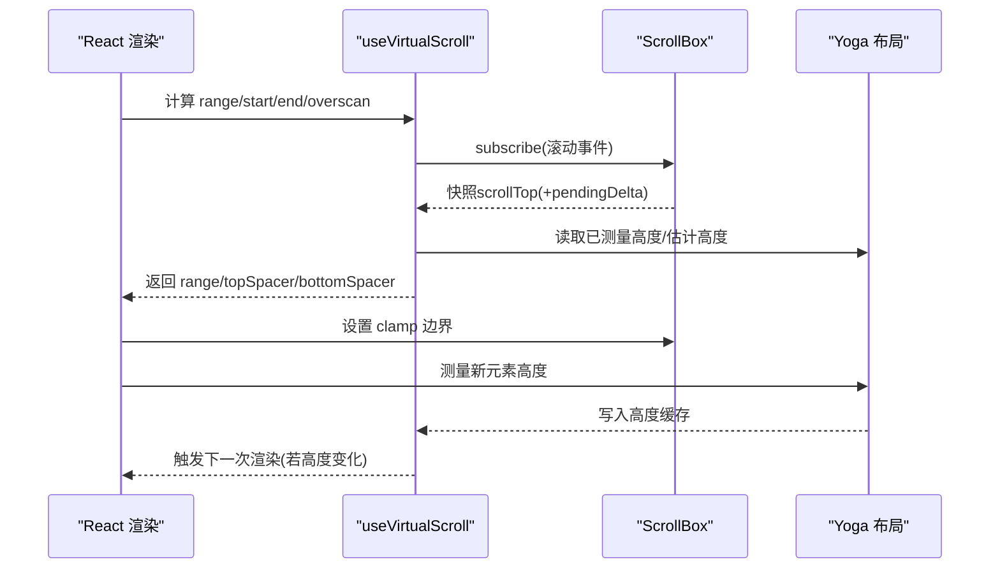
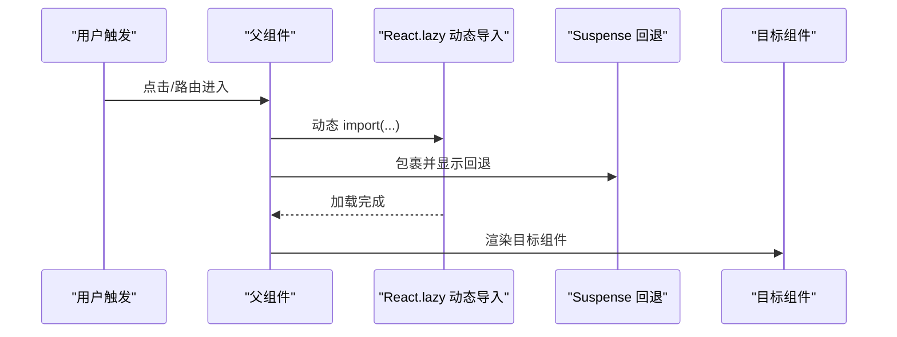
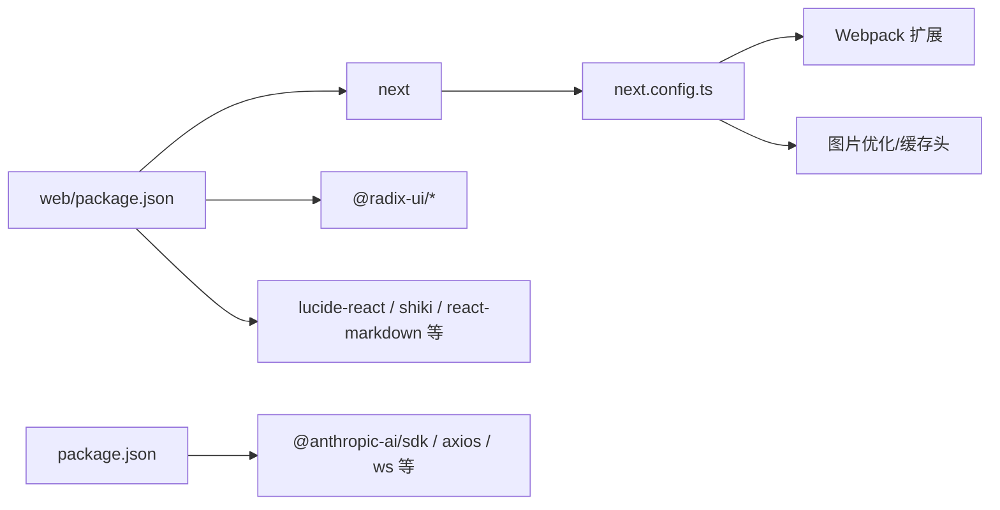

# 性能优化策略

<cite>
**本文引用的文件**
- [web/next.config.ts](file://web/next.config.ts)
- [web/package.json](file://web/package.json)
- [web/postcss.config.js](file://web/postcss.config.js)
- [web/tailwind.config.ts](file://web/tailwind.config.ts)
- [web/tsconfig.json](file://web/tsconfig.json)
- [src/components/Messages.tsx](file://src/components/Messages.tsx)
- [src/hooks/useVirtualScroll.ts](file://src/hooks/useVirtualScroll.ts)
- [src/context/fpsMetrics.tsx](file://src/context/fpsMetrics.tsx)
- [src/components/Markdown.tsx](file://src/components/Markdown.tsx)
- [src/components/HighlightedCode/Fallback.tsx](file://src/components/HighlightedCode/Fallback.tsx)
- [src/commands/ide/ide.tsx](file://src/commands/ide/ide.tsx)
- [src/commands/install-github-app/install-github-app.tsx](file://src/commands/install-github-app/install-github-app.tsx)
- [src/commands/rate-limit-options/rate-limit-options.tsx](file://src/commands/rate-limit-options/rate-limit-options.tsx)
- [src/commands/thinkback/thinkback.tsx](file://src/commands/thinkback/thinkback.tsx)
- [src/components/ConsoleOAuthFlow.tsx](file://src/components/ConsoleOAuthFlow.tsx)
- [src/cli/handlers/util.tsx](file://src/cli/handlers/util.tsx)
- [src/components/FileEditToolDiff.tsx](file://src/components/FileEditToolDiff.tsx)
- [src/components/permissions/AskUserQuestionPermissionRequest/AskUserQuestionPermissionRequest.tsx](file://src/components/permissions/AskUserQuestionPermissionRequest/AskUserQuestionPermissionRequest.tsx)
- [src/components/permissions/AskUserQuestionPermissionRequest/PreviewBox.tsx](file://src/components/permissions/AskUserQuestionPermissionRequest/PreviewBox.tsx)
- [src/components/permissions/NotebookEditPermissionRequest/NotebookEditToolDiff.tsx](file://src/components/permissions/NotebookEditPermissionRequest/NotebookEditToolDiff.tsx)
- [package.json](file://package.json)
</cite>

## 目录
1. [引言](#引言)
2. [项目结构](#项目结构)
3. [核心组件](#核心组件)
4. [架构总览](#架构总览)
5. [详细组件分析](#详细组件分析)
6. [依赖分析](#依赖分析)
7. [性能考量](#性能考量)
8. [故障排查指南](#故障排查指南)
9. [结论](#结论)
10. [附录](#附录)

## 引言
本文件面向 Claude Code 的 Web 组件与整体应用，系统梳理并实证说明其在 Next.js 环境下的性能优化策略，覆盖代码分割、懒加载与预取、组件级优化（React.memo/useMemo/useCallback）、构建期优化（Tree Shaking、Bundle 分析与资源压缩）、运行时性能监控（FPS 指标、卡顿识别与评估）、缓存策略（浏览器/服务端/CDN）以及性能测试与回归预防方法。内容基于仓库中实际配置与源码进行归纳总结，帮助读者快速理解并复用这些优化手段。

## 项目结构
Web 子项目位于 web/ 目录，采用 Next.js 14，默认使用 App Router；Tailwind CSS 提供样式基础；通过 PostCSS 进行构建期处理；Next 配置启用严格模式、图片优化、静态资源缓存头、Webpack 自定义规则（Worker 支持、Node 模块回退）与 Bundle Analyzer 开关。根目录 package.json 提供统一脚本与依赖管理。

**图表来源**
- [web/next.config.ts:1-72](file://web/next.config.ts#L1-L72)
- [web/tailwind.config.ts:1-203](file://web/tailwind.config.ts#L1-L203)
- [web/postcss.config.js:1-7](file://web/postcss.config.js#L1-L7)
- [web/tsconfig.json:1-28](file://web/tsconfig.json#L1-L28)
- [web/package.json:1-53](file://web/package.json#L1-L53)
- [package.json:1-95](file://package.json#L1-L95)

**章节来源**
- [web/next.config.ts:1-72](file://web/next.config.ts#L1-L72)
- [web/package.json:1-53](file://web/package.json#L1-L53)
- [web/postcss.config.js:1-7](file://web/postcss.config.js#L1-L7)
- [web/tailwind.config.ts:1-203](file://web/tailwind.config.ts#L1-L203)
- [web/tsconfig.json:1-28](file://web/tsconfig.json#L1-L28)
- [package.json:1-95](file://package.json#L1-L95)

## 核心组件
- 组件级优化广泛使用 React.memo、useMemo、useCallback，以减少不必要重渲染与昂贵计算。
- 虚拟滚动钩子 useVirtualScroll 将长列表渲染从 O(n) 降低到 O(视口内项数)，显著降低内存与布局开销。
- Suspense 与 React.lazy 实现按需加载与渐进式渲染，避免阻塞主线程。
- 构建期优化：Next 配置开启 optimizePackageImports、压缩响应、图片格式与缓存头；Webpack 规则支持 Web Worker 并排除浏览器无关 Node 模块。

**章节来源**
- [src/components/Messages.tsx:55-76](file://src/components/Messages.tsx#L55-L76)
- [src/hooks/useVirtualScroll.ts:142-721](file://src/hooks/useVirtualScroll.ts#L142-L721)
- [src/components/Markdown.tsx:1-93](file://src/components/Markdown.tsx#L1-L93)
- [src/components/HighlightedCode/Fallback.tsx:1-105](file://src/components/HighlightedCode/Fallback.tsx#L1-L105)
- [web/next.config.ts:8-68](file://web/next.config.ts#L8-L68)

## 架构总览
下图展示 Web 层与性能优化的关键交互：Next 构建配置驱动打包与运行时行为；组件层通过 React.memo/useMemo/useCallback 降低渲染成本；虚拟滚动与 Suspense/懒加载进一步控制内存与首屏时间；运行时通过 FPS 上下文收集指标。

**图表来源**
- [web/next.config.ts:8-68](file://web/next.config.ts#L8-L68)
- [web/tailwind.config.ts:1-203](file://web/tailwind.config.ts#L1-L203)
- [web/postcss.config.js:1-7](file://web/postcss.config.js#L1-L7)
- [web/tsconfig.json:1-28](file://web/tsconfig.json#L1-L28)
- [src/components/Messages.tsx:341-778](file://src/components/Messages.tsx#L341-L778)
- [src/hooks/useVirtualScroll.ts:142-721](file://src/hooks/useVirtualScroll.ts#L142-L721)
- [src/context/fpsMetrics.tsx:1-31](file://src/context/fpsMetrics.tsx#L1-L31)

## 详细组件分析

### 组件级优化：React.memo、useMemo、useCallback 的使用
- Messages 组件通过自定义比较器的 React.memo，避免因回调或集合变化导致的整树重渲染；对 streamingToolUses、inProgressToolUseIDs、unseenDivider、tools 等字段进行细粒度对比，仅在真正影响输出时更新。
- 大量 useMemo 缓存昂贵计算结果（如消息归一化、工具 ID 集合、截断逻辑等），并在渲染范围变更时才重新计算，显著降低滚动与状态切换时的开销。
- useCallback 用于稳定事件处理器与选择器函数，确保子组件可正确通过浅比较跳过重渲染。

**图表来源**
- [src/components/Messages.tsx:379-543](file://src/components/Messages.tsx#L379-L543)
- [src/components/Messages.tsx:564-594](file://src/components/Messages.tsx#L564-L594)
- [src/components/Messages.tsx:741-778](file://src/components/Messages.tsx#L741-L778)

**章节来源**
- [src/components/Messages.tsx:341-778](file://src/components/Messages.tsx#L341-L778)

### 虚拟滚动：useVirtualScroll 的实现与收益
- 通过估计高度与测量真实高度结合，维护顶部/底部占位框，仅挂载视口+overscan 的元素，避免全量 Fiber/布局分配。
- 使用 useSyncExternalStore 量化滚动快照，减少不必要的提交；通过 useDeferredValue 与滑动步长限制，平滑大范围滚动时的首次挂载开销。
- 提供滚动到索引、读取元素位置、高度缓存等能力，配合 Ink/ScrollBox 实现终端友好型虚拟化。

**图表来源**
- [src/hooks/useVirtualScroll.ts:228-244](file://src/hooks/useVirtualScroll.ts#L228-L244)
- [src/hooks/useVirtualScroll.ts:591-597](file://src/hooks/useVirtualScroll.ts#L591-L597)
- [src/hooks/useVirtualScroll.ts:619-645](file://src/hooks/useVirtualScroll.ts#L619-L645)

**章节来源**
- [src/hooks/useVirtualScroll.ts:142-721](file://src/hooks/useVirtualScroll.ts#L142-L721)

### 代码分割、懒加载与预取
- React.lazy 与 Suspense 用于延迟加载重型子树，避免首屏阻塞；在命令面板与设置页等场景中广泛使用。
- 通过 Next 的 typedRoutes 与 optimizePackageImports，减少未使用导出与包体积，提升打包效率。
- 构建期 Bundle Analyzer 可选开启，便于持续监控包体变化。

**图表来源**
- [src/cli/handlers/util.tsx:52-63](file://src/cli/handlers/util.tsx#L52-L63)
- [src/components/FileEditToolDiff.tsx:1-43](file://src/components/FileEditToolDiff.tsx#L1-L43)
- [web/next.config.ts:10-12](file://web/next.config.ts#L10-L12)

**章节来源**
- [src/cli/handlers/util.tsx:52-63](file://src/cli/handlers/util.tsx#L52-L63)
- [src/components/FileEditToolDiff.tsx:1-43](file://src/components/FileEditToolDiff.tsx#L1-L43)
- [web/next.config.ts:10-12](file://web/next.config.ts#L10-L12)

### 组件级优化实践清单
- 在高频交互组件中优先使用 React.memo，并提供自定义比较器，避免因回调/集合变化导致的重渲染。
- 对昂贵计算使用 useMemo，确保输入稳定时直接复用上次结果。
- 对事件处理器使用 useCallback，保证子组件浅比较有效。
- 对大型列表使用虚拟滚动钩子，限制同时挂载的节点数量。
- 对重型渲染组件（如 Markdown/高亮）使用 Suspense 与懒加载，拆分首屏与次屏内容。

**章节来源**
- [src/components/Markdown.tsx:1-93](file://src/components/Markdown.tsx#L1-L93)
- [src/components/HighlightedCode/Fallback.tsx:1-105](file://src/components/HighlightedCode/Fallback.tsx#L1-L105)
- [src/commands/ide/ide.tsx:1-560](file://src/commands/ide/ide.tsx#L1-L560)
- [src/commands/install-github-app/install-github-app.tsx:1-470](file://src/commands/install-github-app/install-github-app.tsx#L1-L470)
- [src/commands/rate-limit-options/rate-limit-options.tsx:1-200](file://src/commands/rate-limit-options/rate-limit-options.tsx#L1-L200)
- [src/commands/thinkback/thinkback.tsx:1-200](file://src/commands/thinkback/thinkback.tsx#L1-L200)
- [src/components/ConsoleOAuthFlow.tsx:1-200](file://src/components/ConsoleOAuthFlow.tsx#L1-L200)

## 依赖分析
- Next.js 14 作为运行时框架，提供 App Router、Image 优化、静态资源缓存头与压缩。
- Tailwind CSS 与 PostCSS 提供样式自动化与最小化；darkMode 与动画配置提升视觉一致性与性能。
- TypeScript 配置采用 bundler 解析与 preserve JSX，利于 Tree Shaking 与按需打包。
- 主工程与 Web 工程分别维护依赖与脚本，通过统一的构建脚本协调。

**图表来源**
- [web/package.json:12-38](file://web/package.json#L12-L38)
- [package.json:25-74](file://package.json#L25-L74)
- [web/next.config.ts:8-68](file://web/next.config.ts#L8-L68)

**章节来源**
- [web/package.json:1-53](file://web/package.json#L1-L53)
- [package.json:1-95](file://package.json#L1-L95)
- [web/next.config.ts:1-72](file://web/next.config.ts#L1-L72)

## 性能考量
- 构建期优化
  - Tree Shaking：通过 optimizePackageImports 与 bundler 模块解析，减少未使用导出。
  - Bundle 分析：ANALYZE 环境变量开启 Bundle Analyzer，持续监控包体变化。
  - 资源压缩：开启 compress 与图片 AVIF/WebP 格式，缩短传输时间。
  - 静态资源缓存：/_next/static 与 /fonts 设置 immutable 缓存头，降低重复请求。
- 运行时优化
  - 虚拟滚动：将长列表渲染复杂度从 O(n) 降至 O(视口内项数)。
  - 组件级优化：memo/useMemo/useCallback 减少无效重渲染与昂贵计算。
  - 懒加载：Suspense/React.lazy 拆分首屏与次屏，避免阻塞。
  - FPS 监控：通过 fpsMetrics.tsx 上下文暴露指标，便于定位卡顿与评估优化效果。

**章节来源**
- [web/next.config.ts:8-68](file://web/next.config.ts#L8-L68)
- [web/tailwind.config.ts:1-203](file://web/tailwind.config.ts#L1-L203)
- [web/postcss.config.js:1-7](file://web/postcss.config.js#L1-L7)
- [web/tsconfig.json:1-28](file://web/tsconfig.json#L1-L28)
- [src/hooks/useVirtualScroll.ts:142-721](file://src/hooks/useVirtualScroll.ts#L142-L721)
- [src/context/fpsMetrics.tsx:1-31](file://src/context/fpsMetrics.tsx#L1-L31)

## 故障排查指南
- 卡顿与掉帧
  - 使用 fpsMetrics.tsx 获取 FPS 指标，定位渲染热点；结合 React Profiler 或浏览器性能面板确认具体组件。
  - 检查是否遗漏 React.memo/useMemo/useCallback，或是否存在频繁重建的回调/集合。
- 长列表抖动/空白
  - 确认 useVirtualScroll 的 range、overscan、clamp 设置合理；检查高度缓存是否及时更新。
  - 若出现“黑屏/空白”，检查 heightCache 是否被错误清空，或 itemRefs 是否在卸载时丢失。
- 首屏慢
  - 使用 Bundle Analyzer 审视包体；启用 optimizePackageImports 与图片格式优化。
  - 检查 Suspense 回退是否过大，或是否存在不必要的同步依赖。
- 滚动异常
  - 确保 ScrollBox 的订阅与 setClampBounds 正确联动；注意 sticky 模式与冷启动路径的差异。

**章节来源**
- [src/context/fpsMetrics.tsx:1-31](file://src/context/fpsMetrics.tsx#L1-L31)
- [src/hooks/useVirtualScroll.ts:591-597](file://src/hooks/useVirtualScroll.ts#L591-L597)
- [src/hooks/useVirtualScroll.ts:619-645](file://src/hooks/useVirtualScroll.ts#L619-L645)
- [web/next.config.ts:15-40](file://web/next.config.ts#L15-L40)

## 结论
本项目在 Next.js 生态下，通过构建期优化（Tree Shaking、Bundle 分析、图片与缓存头）与运行时优化（虚拟滚动、组件级 memo/useMemo/useCallback、Suspense/懒加载、FPS 监控）形成完整的性能闭环。建议在后续迭代中持续使用 Bundle Analyzer 与 FPS 指标进行回归评估，并在新增重型组件时遵循上述优化范式，确保长会话与大规模数据场景下的稳定性与流畅性。

## 附录
- 性能测试与基准测试方法
  - 使用浏览器性能面板录制交互路径，关注帧时间分布与 GC 峰值。
  - 在 CI 中集成 Bundle Analyzer 报告，设定阈值告警。
  - 通过 fpsMetrics.tsx 输出指标到日志/遥测系统，建立趋势基线。
- 性能回归预防
  - 为关键组件添加单元/集成测试，覆盖渲染次数与重渲染路径。
  - 对长列表与重型渲染组件建立端到端基准，定期回归。
  - 在 PR 审查中强制检查 Bundle 大小与关键指标变化。