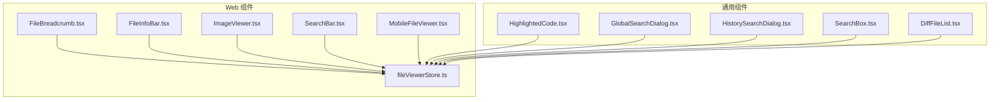
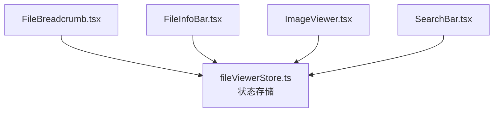
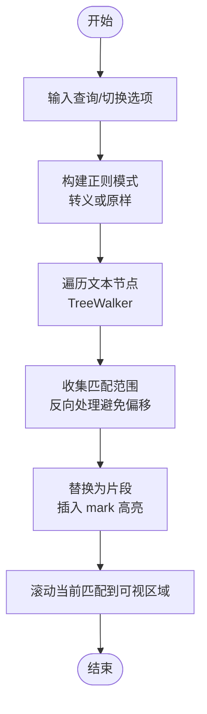
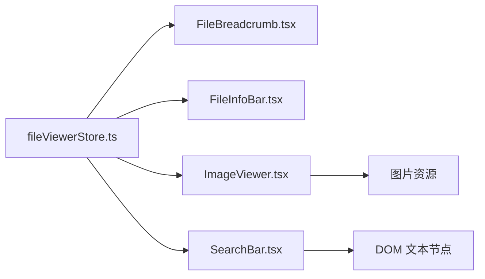

# 文件浏览组件

<cite>
**本文引用的文件**
- [FileBreadcrumb.tsx](file://web/components/file-viewer/FileBreadcrumb.tsx)
- [FileInfoBar.tsx](file://web/components/file-viewer/FileInfoBar.tsx)
- [ImageViewer.tsx](file://web/components/file-viewer/ImageViewer.tsx)
- [SearchBar.tsx](file://web/components/file-viewer/SearchBar.tsx)
- [fileViewerStore.ts](file://web/lib/fileViewerStore.ts)
- [MobileFileViewer.tsx](file://web/components/mobile/MobileFileViewer.tsx)
- [HighlightedCode.tsx](file://src/components/HighlightedCode/HighlightedCode.tsx)
- [GlobalSearchDialog.tsx](file://src/components/GlobalSearchDialog.tsx)
- [HistorySearchDialog.tsx](file://src/components/HistorySearchDialog.tsx)
- [SearchBox.tsx](file://src/components/SearchBox.tsx)
- [DiffFileList.tsx](file://src/components/diff/DiffFileList.tsx)
</cite>

## 目录
1. [简介](#简介)
2. [项目结构](#项目结构)
3. [核心组件](#核心组件)
4. [架构总览](#架构总览)
5. [组件详解](#组件详解)
6. [依赖关系分析](#依赖关系分析)
7. [性能考量](#性能考量)
8. [故障排查指南](#故障排查指南)
9. [结论](#结论)
10. [附录](#附录)

## 简介
本文件聚焦 Claude Code 的文件浏览组件，系统性梳理文件查看器的组件架构与交互流程，覆盖以下方面：
- 文件路径导航：FileBreadcrumb 的路径展示与复制、跳转到 IDE
- 文件信息与模式切换：FileInfoBar 的文件统计、语言标签与视图模式（查看/编辑/差异）
- 图片预览：ImageViewer 的缩放、适配与透明背景处理
- 内容搜索：SearchBar 的全文检索、正则表达式、大小写敏感与高亮滚动
- 文件树导航：目录展开、文件过滤与搜索联动（通过全局搜索与历史搜索对话框）
- 文件内容渲染：代码高亮、图片显示与二进制文件处理策略
- 文件操作：文件选择、批量操作与拖拽支持（通过工具组件与权限请求）
- 文件状态管理与缓存策略：基于文件查看器状态存储的优化建议

## 项目结构
文件浏览相关的核心位于 web/components/file-viewer 与 web/lib，配合 src/components 下的搜索与高亮组件，以及移动端适配组件。

**图表来源**
- [FileBreadcrumb.tsx:1-83](file://web/components/file-viewer/FileBreadcrumb.tsx#L1-L83)
- [FileInfoBar.tsx:1-99](file://web/components/file-viewer/FileInfoBar.tsx#L1-L99)
- [ImageViewer.tsx:1-108](file://web/components/file-viewer/ImageViewer.tsx#L1-L108)
- [SearchBar.tsx:1-251](file://web/components/file-viewer/SearchBar.tsx#L1-L251)
- [MobileFileViewer.tsx](file://web/components/mobile/MobileFileViewer.tsx)
- [fileViewerStore.ts](file://web/lib/fileViewerStore.ts)
- [HighlightedCode.tsx](file://src/components/HighlightedCode/HighlightedCode.tsx)
- [GlobalSearchDialog.tsx](file://src/components/GlobalSearchDialog.tsx)
- [HistorySearchDialog.tsx](file://src/components/HistorySearchDialog.tsx)
- [SearchBox.tsx](file://src/components/SearchBox.tsx)
- [DiffFileList.tsx](file://src/components/diff/DiffFileList.tsx)

**章节来源**
- [FileBreadcrumb.tsx:1-83](file://web/components/file-viewer/FileBreadcrumb.tsx#L1-L83)
- [FileInfoBar.tsx:1-99](file://web/components/file-viewer/FileInfoBar.tsx#L1-L99)
- [ImageViewer.tsx:1-108](file://web/components/file-viewer/ImageViewer.tsx#L1-L108)
- [SearchBar.tsx:1-251](file://web/components/file-viewer/SearchBar.tsx#L1-L251)
- [fileViewerStore.ts](file://web/lib/fileViewerStore.ts)

## 核心组件
- FileBreadcrumb：展示当前文件路径，支持复制路径与在 VS Code 中打开
- FileInfoBar：显示文件语言、编码、行数、字节数、未保存状态，并提供视图模式切换
- ImageViewer：图片缩放、实际尺寸/适应宽度切换、透明背景棋盘格底纹
- SearchBar：全文搜索、正则表达式、大小写敏感、匹配计数与高亮滚动

这些组件共同构成文件查看器的“导航-信息-渲染-搜索”闭环，配合文件查看器状态存储实现统一的状态管理。

**章节来源**
- [FileBreadcrumb.tsx:12-82](file://web/components/file-viewer/FileBreadcrumb.tsx#L12-L82)
- [FileInfoBar.tsx:54-98](file://web/components/file-viewer/FileInfoBar.tsx#L54-L98)
- [ImageViewer.tsx:12-107](file://web/components/file-viewer/ImageViewer.tsx#L12-L107)
- [SearchBar.tsx:13-246](file://web/components/file-viewer/SearchBar.tsx#L13-L246)

## 架构总览
文件浏览组件围绕文件查看器状态存储进行组织，各子组件通过状态钩子读取/更新当前文件的元数据、内容与视图模式；搜索栏对容器内的文本节点执行 DOM 遍历与高亮替换；图片查看器独立维护缩放与适配状态。

**图表来源**
- [fileViewerStore.ts](file://web/lib/fileViewerStore.ts)
- [FileBreadcrumb.tsx:1-83](file://web/components/file-viewer/FileBreadcrumb.tsx#L1-L83)
- [FileInfoBar.tsx:1-99](file://web/components/file-viewer/FileInfoBar.tsx#L1-L99)
- [ImageViewer.tsx:1-108](file://web/components/file-viewer/ImageViewer.tsx#L1-L108)
- [SearchBar.tsx:1-251](file://web/components/file-viewer/SearchBar.tsx#L1-L251)

## 组件详解

### FileBreadcrumb：文件路径面包屑
- 功能要点
  - 解析路径段并区分绝对路径前缀
  - 最后一段为当前文件名，其余为可点击的导航段
  - 提供复制路径与在 VS Code 中打开的功能
- 交互行为
  - 复制成功后短暂提示
  - 打开 VS Code 使用标准协议跳转
- 设计考虑
  - 路径截断与标题提示提升可读性
  - 操作按钮采用简洁图标与悬停反馈

**章节来源**
- [FileBreadcrumb.tsx:12-82](file://web/components/file-viewer/FileBreadcrumb.tsx#L12-L82)

### FileInfoBar：文件信息与视图模式
- 功能要点
  - 计算并展示语言标签、编码、行数、字节大小
  - 显示未保存更改状态
  - 视图模式切换：查看/编辑/差异（差异模式在无 diff 数据时禁用）
- 语言标签映射
  - 内置常见语言到人类可读标签的映射表
- 性能注意
  - 行数计算基于换行符分割，适合大文件但需避免频繁重算

**章节来源**
- [FileInfoBar.tsx:54-98](file://web/components/file-viewer/FileInfoBar.tsx#L54-L98)

### ImageViewer：图片查看器
- 功能要点
  - 缩放控制（最小 0.1x，最大 8x）
  - 适配模式：fit（自适应宽度）与 actual（实际像素）
  - 透明背景棋盘格底纹用于 PNG/GIF/WebP/SVG
  - 错误兜底：加载失败时显示占位与错误信息
- 用户体验
  - 平滑缩放与中心变换原点
  - 放大到一定倍数后启用像素化渲染以保持锐利

**章节来源**
- [ImageViewer.tsx:12-107](file://web/components/file-viewer/ImageViewer.tsx#L12-L107)

### SearchBar：全文搜索与高亮
- 功能要点
  - 查询输入、正则开关、大小写敏感开关
  - 匹配计数与当前匹配号显示
  - 上一个/下一个导航与回车/Shift+回车快捷键
  - ESC 关闭并清除高亮
- 实现细节
  - 使用 TreeWalker 遍历容器内文本节点，避免在已标记元素中重复匹配
  - 反向处理文本节点范围，防止位置偏移导致的替换错误
  - 对零长度匹配进行保护，避免无限循环
  - 高亮使用 mark 元素并按当前匹配添加特殊类名以便居中滚动
- DOM 操作
  - 高亮清理时将 mark 替换为纯文本并规范化节点
  - 当前匹配滚动到可视区域中央

**图表来源**
- [SearchBar.tsx:49-134](file://web/components/file-viewer/SearchBar.tsx#L49-L134)

**章节来源**
- [SearchBar.tsx:13-246](file://web/components/file-viewer/SearchBar.tsx#L13-L246)

### 文件树导航与搜索联动
- 文件树展开与过滤
  - 通过全局搜索与历史搜索对话框触发文件过滤与定位
  - 结合 DiffFileList 展示差异文件列表，便于快速定位变更
- 搜索入口
  - GlobalSearchDialog：全局全文搜索
  - HistorySearchDialog：历史会话搜索
  - SearchBox：通用搜索框组件
- 与文件查看器的集成
  - 搜索结果可直接跳转到对应文件与行号
  - 文件查看器根据当前文件类型选择合适的渲染方式（代码/图片/文本）

**章节来源**
- [GlobalSearchDialog.tsx](file://src/components/GlobalSearchDialog.tsx)
- [HistorySearchDialog.tsx](file://src/components/HistorySearchDialog.tsx)
- [SearchBox.tsx](file://src/components/SearchBox.tsx)
- [DiffFileList.tsx](file://src/components/diff/DiffFileList.tsx)

### 文件内容渲染机制
- 代码高亮
  - 使用 HighlightedCode 组件进行语法高亮渲染
  - 与文件语言标签联动，确保高亮规则正确
- 图片显示
  - ImageViewer 独立处理图片缩放与背景棋盘格
- 二进制文件处理
  - 通过文件类型判断是否为图片，非图片与不可解析内容采用文本/占位展示策略
  - 在 FileInfoBar 中识别图片类型并隐藏视图模式切换

**章节来源**
- [HighlightedCode.tsx](file://src/components/HighlightedCode/HighlightedCode.tsx)
- [ImageViewer.tsx:12-107](file://web/components/file-viewer/ImageViewer.tsx#L12-L107)
- [FileInfoBar.tsx:54-98](file://web/components/file-viewer/FileInfoBar.tsx#L54-L98)

### 文件操作与拖拽支持
- 文件选择与批量操作
  - 通过工具组件与权限请求对话框实现文件读取/写入/编辑权限申请
  - 移动端文件查看器提供响应式布局与触摸手势支持
- 拖拽支持
  - 基于浏览器拖放 API 与文件系统权限请求，结合 FilePermissionDialog 与 FileWritePermissionRequest 进行授权与安全校验

**章节来源**
- [MobileFileViewer.tsx](file://web/components/mobile/MobileFileViewer.tsx)
- [FilePermissionDialog.tsx](file://src/components/permissions/FilePermissionDialog/FilePermissionDialog.tsx)
- [FileWritePermissionRequest.tsx](file://src/components/permissions/FileWritePermissionRequest/FileWritePermissionRequest.tsx)

## 依赖关系分析
- 组件耦合
  - FileBreadcrumb、FileInfoBar、ImageViewer、SearchBar 均依赖文件查看器状态存储
  - SearchBar 与 ImageViewer 与状态存储之间存在双向依赖：状态驱动 UI，UI 更新状态
- 外部依赖
  - 图标库（lucide-react）、样式工具（cn）
  - 浏览器 API：TreeWalker、document.createTreeWalker、RegExp、Element APIs
- 潜在循环依赖
  - 通过状态存储解耦具体 UI 组件，避免直接互相导入

**图表来源**
- [fileViewerStore.ts](file://web/lib/fileViewerStore.ts)
- [FileBreadcrumb.tsx:1-83](file://web/components/file-viewer/FileBreadcrumb.tsx#L1-L83)
- [FileInfoBar.tsx:1-99](file://web/components/file-viewer/FileInfoBar.tsx#L1-L99)
- [ImageViewer.tsx:1-108](file://web/components/file-viewer/ImageViewer.tsx#L1-L108)
- [SearchBar.tsx:1-251](file://web/components/file-viewer/SearchBar.tsx#L1-L251)

**章节来源**
- [fileViewerStore.ts](file://web/lib/fileViewerStore.ts)
- [SearchBar.tsx:49-134](file://web/components/file-viewer/SearchBar.tsx#L49-L134)

## 性能考量
- 搜索高亮
  - 反向处理匹配范围与文本节点，降低 DOM 替换带来的位置偏移成本
  - 使用 TreeWalker 仅遍历文本节点，减少无关节点扫描
  - 零长度匹配保护避免正则卡死
- 图片渲染
  - 适度放大后启用像素化渲染，平衡清晰度与性能
  - 透明背景棋盘格底纹使用 CSS 渐变，避免额外图片资源
- 状态管理
  - 将文件元数据与视图状态集中管理，避免多处重复计算
  - 对大文件行数统计等操作进行必要的防抖或懒计算

[本节为通用性能建议，不直接分析具体文件，故无章节来源]

## 故障排查指南
- 搜索高亮异常
  - 检查正则表达式是否有效，错误时会显示无效正则提示
  - 确认容器引用有效且存在文本节点
  - 高亮清理逻辑会在关闭或重新搜索时执行，若残留可手动触发清理
- 图片加载失败
  - 查看错误兜底文案与路径显示
  - 确认图片资源可访问且格式受支持
- 视图模式切换
  - 差异模式在无 diff 数据时会被禁用，检查 diff 数据是否可用
- 路径复制与 VS Code 打开
  - 确保剪贴板权限与 VS Code 协议已安装

**章节来源**
- [SearchBar.tsx:182-190](file://web/components/file-viewer/SearchBar.tsx#L182-L190)
- [ImageViewer.tsx:29-37](file://web/components/file-viewer/ImageViewer.tsx#L29-L37)
- [FileInfoBar.tsx:87-88](file://web/components/file-viewer/FileInfoBar.tsx#L87-L88)
- [FileBreadcrumb.tsx:18-26](file://web/components/file-viewer/FileBreadcrumb.tsx#L18-L26)

## 结论
文件浏览组件通过 FileBreadcrumb、FileInfoBar、ImageViewer 与 SearchBar 形成完整的文件查看与交互闭环。借助文件查看器状态存储实现统一的状态管理，配合代码高亮、图片渲染与全文搜索能力，满足开发者在多场景下的文件浏览需求。未来可在大文件性能优化、搜索算法与缓存策略上进一步完善。

[本节为总结性内容，不直接分析具体文件，故无章节来源]

## 附录

### 文件状态管理与缓存策略（建议）
- 状态分层
  - 文件元数据（语言、编码、尺寸、行数）与视图状态（模式、缩放、搜索高亮）分离
- 缓存策略
  - 内容缓存：按文件路径与版本号缓存，避免重复读取
  - 高亮缓存：对相同查询与容器内容的高亮结果进行缓存，减少 DOM 操作
  - 图片缓存：利用浏览器缓存与服务端 ETag，支持缩略图与多分辨率资源
- 性能优化
  - 搜索高亮采用增量更新：仅对变化部分重新高亮
  - 大文件懒渲染：首次只渲染可见区域，滚动时按需加载

[本节为概念性建议，不直接分析具体文件，故无章节来源]