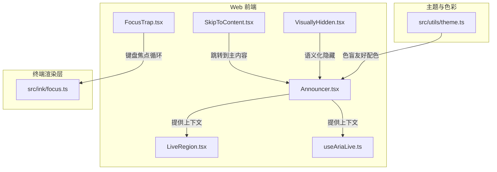
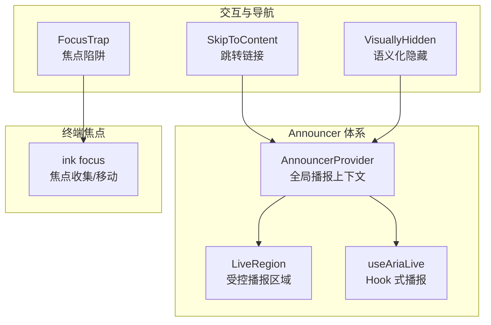
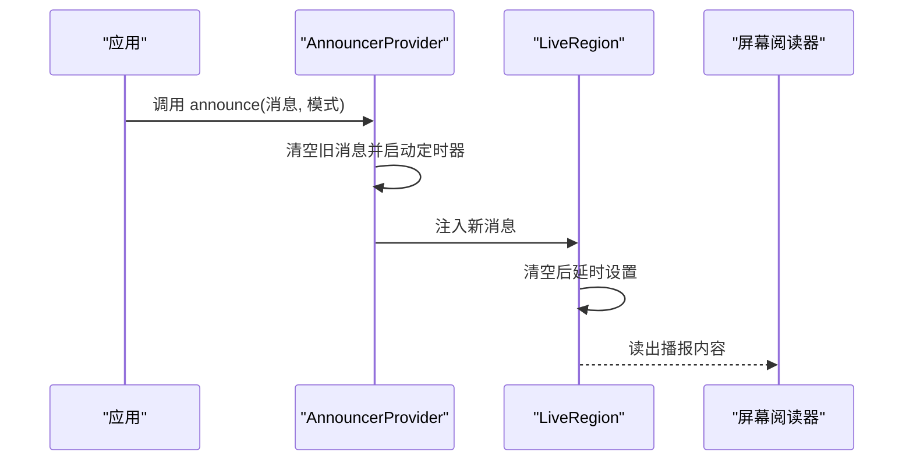
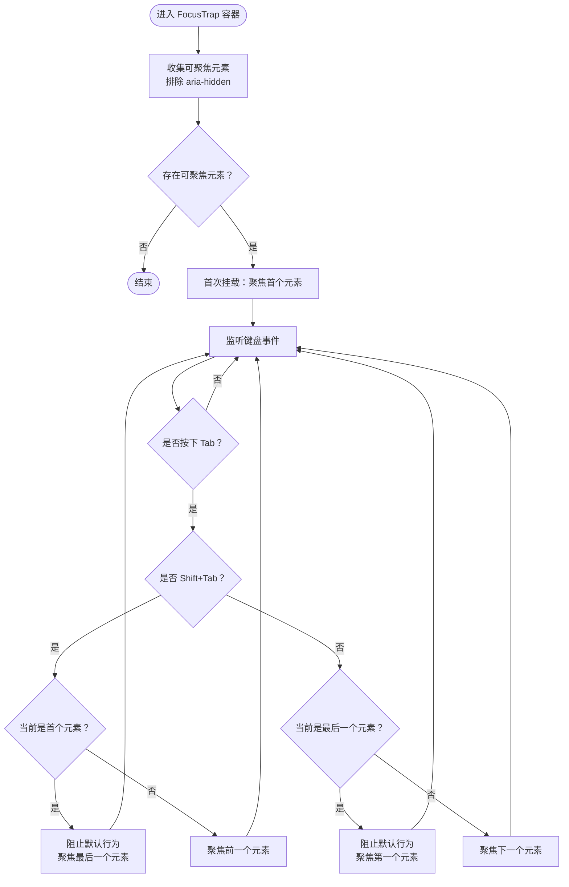
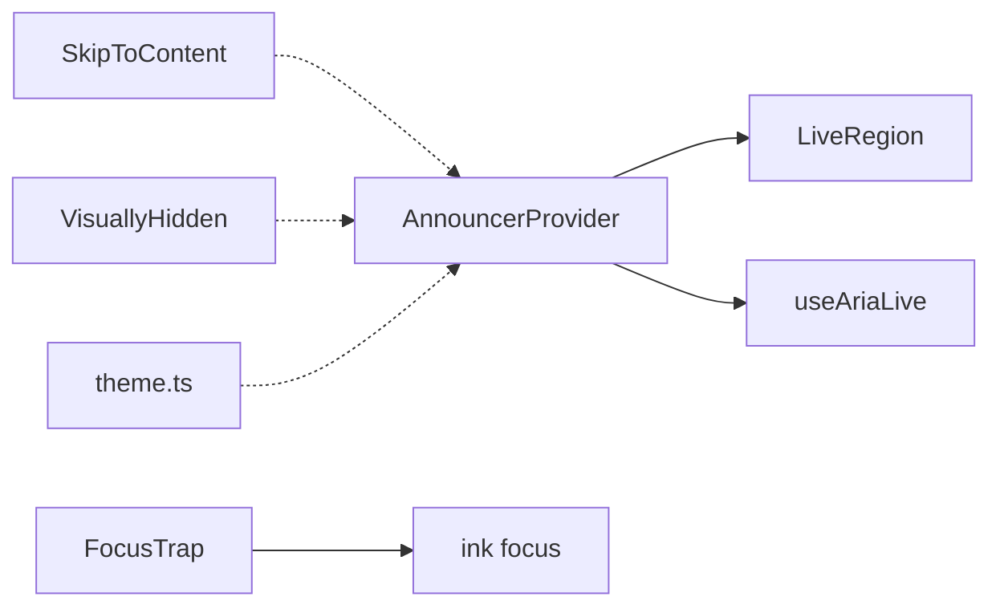

# 无障碍访问组件

<cite>
**本文引用的文件**
- [Announcer.tsx](file://web/components/a11y/Announcer.tsx)
- [LiveRegion.tsx](file://web/components/a11y/LiveRegion.tsx)
- [useAriaLive.ts](file://web/hooks/useAriaLive.ts)
- [FocusTrap.tsx](file://web/components/a11y/FocusTrap.tsx)
- [SkipToContent.tsx](file://web/components/a11y/SkipToContent.tsx)
- [VisuallyHidden.tsx](file://web/components/a11y/VisuallyHidden.tsx)
- [focus.ts](file://src/ink/focus.ts)
- [theme.ts](file://src/utils/theme.ts)
</cite>

## 目录
1. [简介](#简介)
2. [项目结构](#项目结构)
3. [核心组件](#核心组件)
4. [架构总览](#架构总览)
5. [详细组件分析](#详细组件分析)
6. [依赖关系分析](#依赖关系分析)
7. [性能考量](#性能考量)
8. [故障排查指南](#故障排查指南)
9. [结论](#结论)
10. [附录](#附录)

## 简介
本文件系统性梳理 Claude Code 中的无障碍访问（a11y）组件与实现，覆盖以下主题：
- 设计原则：ARIA 属性、语义化标签、键盘导航
- 核心无障碍组件：Announcer、LiveRegion、FocusTrap、SkipToContent 及 VisuallyHidden
- 屏幕阅读器支持：动态内容更新、焦点管理、语义化信息传递
- 视觉辅助：高对比度、缩放支持、色盲友好设计
- 测试与验证：自动化与人工测试流程
- 最佳实践与合规性标准

## 项目结构
无障碍相关代码主要分布在两个区域：
- Web 前端（Next.js）：位于 web/components/a11y 与 web/hooks 下，提供 Announcer、LiveRegion、FocusTrap、SkipToContent、VisuallyHidden 等组件与自定义 Hook
- Ink 终端渲染层：位于 src/ink，提供终端环境下的焦点管理能力
- 主题与色彩：位于 src/utils/theme.ts，提供色盲友好主题



图表来源
- [Announcer.tsx:1-69](file://web/components/a11y/Announcer.tsx#L1-L69)
- [LiveRegion.tsx:1-55](file://web/components/a11y/LiveRegion.tsx#L1-L55)
- [useAriaLive.ts:1-65](file://web/hooks/useAriaLive.ts#L1-L65)
- [FocusTrap.tsx:1-73](file://web/components/a11y/FocusTrap.tsx#L1-L73)
- [SkipToContent.tsx:1-19](file://web/components/a11y/SkipToContent.tsx#L1-L19)
- [VisuallyHidden.tsx:1-32](file://web/components/a11y/VisuallyHidden.tsx#L1-L32)
- [focus.ts:84-144](file://src/ink/focus.ts#L84-L144)
- [theme.ts:355-613](file://src/utils/theme.ts#L355-L613)

章节来源
- [Announcer.tsx:1-69](file://web/components/a11y/Announcer.tsx#L1-L69)
- [LiveRegion.tsx:1-55](file://web/components/a11y/LiveRegion.tsx#L1-L55)
- [useAriaLive.ts:1-65](file://web/hooks/useAriaLive.ts#L1-L65)
- [FocusTrap.tsx:1-73](file://web/components/a11y/FocusTrap.tsx#L1-L73)
- [SkipToContent.tsx:1-19](file://web/components/a11y/SkipToContent.tsx#L1-L19)
- [VisuallyHidden.tsx:1-32](file://web/components/a11y/VisuallyHidden.tsx#L1-L32)
- [focus.ts:84-144](file://src/ink/focus.ts#L84-L144)
- [theme.ts:355-613](file://src/utils/theme.ts#L355-L613)

## 核心组件
- Announcer：通过 React Context 提供全局“屏幕阅读器播报”能力，支持“温和/断言”两种播报策略，并以视觉隐藏的方式注入 aria-live 区域
- LiveRegion：受控的 aria-live 区域组件，接收 message 后清空并延时注入，确保重复消息可被重新播报
- useAriaLive：Hook 风格的 aria-live 管理器，返回当前 announcement 字符串与触发函数，以及可直接展开到容器上的 ARIA 属性
- FocusTrap：在激活状态下拦截 Tab 键，将焦点在可聚焦子元素间循环，常用于模态、抽屉等覆盖层
- SkipToContent：提供“跳转到主内容”的链接，仅在聚焦时可见，提升键盘用户的导航效率
- VisuallyHidden：语义化隐藏内容，保留给屏幕阅读器，适合图标按钮或补充说明
- Ink focus：终端渲染层的焦点管理工具，支持收集可聚焦节点、前后移动焦点、启用/禁用等

章节来源
- [Announcer.tsx:1-69](file://web/components/a11y/Announcer.tsx#L1-L69)
- [LiveRegion.tsx:1-55](file://web/components/a11y/LiveRegion.tsx#L1-L55)
- [useAriaLive.ts:1-65](file://web/hooks/useAriaLive.ts#L1-L65)
- [FocusTrap.tsx:1-73](file://web/components/a11y/FocusTrap.tsx#L1-L73)
- [SkipToContent.tsx:1-19](file://web/components/a11y/SkipToContent.tsx#L1-L19)
- [VisuallyHidden.tsx:1-32](file://web/components/a11y/VisuallyHidden.tsx#L1-L32)
- [focus.ts:84-144](file://src/ink/focus.ts#L84-L144)

## 架构总览
下图展示无障碍组件之间的交互关系与职责边界：



图表来源
- [Announcer.tsx:21-61](file://web/components/a11y/Announcer.tsx#L21-L61)
- [LiveRegion.tsx:19-54](file://web/components/a11y/LiveRegion.tsx#L19-L54)
- [useAriaLive.ts:38-64](file://web/hooks/useAriaLive.ts#L38-L64)
- [FocusTrap.tsx:26-69](file://web/components/a11y/FocusTrap.tsx#L26-L69)
- [SkipToContent.tsx:3-18](file://web/components/a11y/SkipToContent.tsx#L3-L18)
- [VisuallyHidden.tsx:13-31](file://web/components/a11y/VisuallyHidden.tsx#L13-L31)
- [focus.ts:110-131](file://src/ink/focus.ts#L110-L131)

## 详细组件分析

### Announcer 与 LiveRegion：屏幕阅读器播报体系
- 设计目标
  - 为全局状态变化、错误提示、成功反馈等提供可编程的屏幕阅读器播报
  - 支持“温和”（polite）与“断言”（assertive）两种优先级，前者等待用户空闲，后者立即打断
  - 通过视觉隐藏的 aria-live 容器承载播报内容，避免破坏页面布局
- 实现要点
  - AnnouncerProvider 使用 Context 暴露 announce 方法；内部维护两套定时器，分别处理温和与断言消息
  - LiveRegion 接收 message，先清空再延时设置，确保重复消息可被重新播报
  - useAriaLive 返回 announcement 字符串与 liveRegionProps，便于在任意组件中快速集成
- 使用建议
  - 在应用根部放置 AnnouncerProvider
  - 对于需要即时打断的错误或警告使用断言模式
  - 对于非关键状态更新使用温和模式



图表来源
- [Announcer.tsx:21-61](file://web/components/a11y/Announcer.tsx#L21-L61)
- [LiveRegion.tsx:19-54](file://web/components/a11y/LiveRegion.tsx#L19-L54)
- [useAriaLive.ts:38-64](file://web/hooks/useAriaLive.ts#L38-L64)

章节来源
- [Announcer.tsx:1-69](file://web/components/a11y/Announcer.tsx#L1-L69)
- [LiveRegion.tsx:1-55](file://web/components/a11y/LiveRegion.tsx#L1-L55)
- [useAriaLive.ts:1-65](file://web/hooks/useAriaLive.ts#L1-L65)

### FocusTrap：焦点陷阱与键盘导航
- 设计目标
  - 在模态、抽屉等覆盖层中限制键盘焦点在可聚焦元素内循环
  - 避免焦点逃逸至背景内容，提升键盘与屏幕阅读器可用性
- 实现要点
  - 通过选择器集合收集容器内的可聚焦元素，并排除 aria-hidden 的节点
  - 监听 Tab 键事件，Shift+Tab 实现反向循环，无元素时不执行任何操作
  - 组件挂载时自动将焦点移入第一个可聚焦元素
- 使用建议
  - 当覆盖层显示时 active=true，隐藏时 active=false
  - 与 Radix Dialog 等原生组件配合时，仅在未使用原生焦点陷阱时启用此组件



图表来源
- [FocusTrap.tsx:26-69](file://web/components/a11y/FocusTrap.tsx#L26-L69)

章节来源
- [FocusTrap.tsx:1-73](file://web/components/a11y/FocusTrap.tsx#L1-L73)

### SkipToContent：键盘直达主内容
- 设计目标
  - 为键盘与屏幕阅读器用户提供“跳过页面重复内容，直达主内容”的入口
- 实现要点
  - 提供锚点链接，仅在聚焦时以可见样式呈现
  - 采用语义化 ARIA 属性与可访问的样式类名组合
- 使用建议
  - 将该组件置于页面顶部，确保主内容锚点 id 为 #main-content

```mermaid
sequenceDiagram
participant User as "用户"
participant Link as "SkipToContent 链接"
participant Page as "页面结构"
User->>Link : Tab 到链接并回车
Link->>Page : 跳转到 #main-content
Page-->>User : 主内容获得焦点
```

图表来源
- [SkipToContent.tsx:3-18](file://web/components/a11y/SkipToContent.tsx#L3-L18)

章节来源
- [SkipToContent.tsx:1-19](file://web/components/a11y/SkipToContent.tsx#L1-L19)

### VisuallyHidden：语义化隐藏
- 设计目标
  - 将文本内容对视觉用户隐藏，但对屏幕阅读器保持可读
- 实现要点
  - 通过绝对定位与裁剪技术实现视觉隐藏
  - 支持指定渲染标签（span/div/p）
- 使用建议
  - 图标按钮的描述性文本、补充说明等场景

章节来源
- [VisuallyHidden.tsx:1-32](file://web/components/a11y/VisuallyHidden.tsx#L1-L32)

### Ink focus：终端环境焦点管理
- 设计目标
  - 在终端渲染环境中提供可聚焦元素的收集与焦点移动能力
- 实现要点
  - 支持启用/禁用、前后移动焦点、自动聚焦等
  - 通过遍历树收集具有有效 tabIndex 的节点
- 使用建议
  - 与 Ink 组件树配合，实现键盘导航与焦点控制

章节来源
- [focus.ts:84-144](file://src/ink/focus.ts#L84-L144)

## 依赖关系分析
- Announcer 与 LiveRegion：AnnouncerProvider 作为根级提供者，LiveRegion 作为受控播报区域与其协作
- useAriaLive：与 AnnouncerProvider 功能互补，适合在函数组件中快速注入 aria-live
- FocusTrap：依赖 DOM 查询与键盘事件，与 Ink focus 在终端环境下形成互补
- SkipToContent：与 Announcer 无直接依赖，但共同服务于键盘与屏幕阅读器体验
- VisuallyHidden：与 Announcer 协同，用于语义化隐藏补充信息
- theme.ts：提供色盲友好主题，间接提升视觉可达性



图表来源
- [Announcer.tsx:21-61](file://web/components/a11y/Announcer.tsx#L21-L61)
- [LiveRegion.tsx:19-54](file://web/components/a11y/LiveRegion.tsx#L19-L54)
- [useAriaLive.ts:38-64](file://web/hooks/useAriaLive.ts#L38-L64)
- [FocusTrap.tsx:26-69](file://web/components/a11y/FocusTrap.tsx#L26-L69)
- [SkipToContent.tsx:3-18](file://web/components/a11y/SkipToContent.tsx#L3-L18)
- [VisuallyHidden.tsx:13-31](file://web/components/a11y/VisuallyHidden.tsx#L13-L31)
- [focus.ts:110-131](file://src/ink/focus.ts#L110-L131)
- [theme.ts:355-613](file://src/utils/theme.ts#L355-L613)

章节来源
- [Announcer.tsx:1-69](file://web/components/a11y/Announcer.tsx#L1-L69)
- [LiveRegion.tsx:1-55](file://web/components/a11y/LiveRegion.tsx#L1-L55)
- [useAriaLive.ts:1-65](file://web/hooks/useAriaLive.ts#L1-L65)
- [FocusTrap.tsx:1-73](file://web/components/a11y/FocusTrap.tsx#L1-L73)
- [SkipToContent.tsx:1-19](file://web/components/a11y/SkipToContent.tsx#L1-L19)
- [VisuallyHidden.tsx:1-32](file://web/components/a11y/VisuallyHidden.tsx#L1-L32)
- [focus.ts:84-144](file://src/ink/focus.ts#L84-L144)
- [theme.ts:355-613](file://src/utils/theme.ts#L355-L613)

## 性能考量
- 播报延迟与重排
  - Announcer 与 LiveRegion 内部均使用定时器清空与注入，避免频繁重排
  - 建议合理设置 delay，确保区域重置后再注入新消息
- DOM 查询与事件监听
  - FocusTrap 在激活时进行一次容器内可聚焦元素查询，并在卸载时清理事件监听
  - 建议在覆盖层隐藏时将 active=false，减少不必要的事件处理
- 视觉隐藏成本
  - VisuallyHidden 仅引入样式裁剪，开销极低
- 终端焦点遍历
  - ink focus 的遍历逻辑基于 DOM 查询，建议在大型组件树中谨慎使用，必要时缓存结果

## 故障排查指南
- 屏幕阅读器未播报
  - 检查 AnnouncerProvider 是否在根部正确包裹
  - 确认 aria-live 容器未被其他元素遮挡或禁用
  - 对于重复消息，确认是否使用了 LiveRegion 或设置了合理的 delay
- 焦点逃逸或无法循环
  - 确认 FocusTrap 的 active 状态与容器引用正确
  - 检查容器内是否存在 aria-hidden 的元素导致可聚焦集合为空
  - 确保容器内至少有一个可聚焦且未禁用的元素
- 键盘导航异常
  - 在终端渲染环境中，检查 ink focus 的启用/禁用状态与 tabIndex 设置
- 色彩识别困难
  - 切换至色盲友好主题，确认颜色对比度满足可读性要求

章节来源
- [Announcer.tsx:21-61](file://web/components/a11y/Announcer.tsx#L21-L61)
- [LiveRegion.tsx:19-54](file://web/components/a11y/LiveRegion.tsx#L19-L54)
- [FocusTrap.tsx:26-69](file://web/components/a11y/FocusTrap.tsx#L26-L69)
- [focus.ts:84-144](file://src/ink/focus.ts#L84-L144)
- [theme.ts:355-613](file://src/utils/theme.ts#L355-L613)

## 结论
Claude Code 的无障碍访问组件围绕“可编程播报、焦点陷阱、直达主内容、语义化隐藏”四大支柱构建，既覆盖 Web 环境也兼顾终端渲染层。通过 Announcer/LiveRegion 体系保障动态内容的可感知性，通过 FocusTrap 与 SkipToContent 提升键盘与屏幕阅读器的导航效率，通过 VisuallyHidden 与色盲友好主题增强视觉可达性。建议在应用根部统一接入 AnnouncerProvider，并在覆盖层、表单、状态提示等关键场景中合理使用上述组件。

## 附录
- 无障碍最佳实践
  - 为所有交互元素提供语义化标签与可访问名称
  - 使用 aria-live 区域传达实时状态变化，区分温和与断言级别
  - 保证键盘可完全操控，Tab 键序清晰、焦点可见
  - 提供“跳过至主内容”的快捷入口
  - 使用高对比度与色盲友好配色，避免仅靠颜色传递信息
- 合规性标准
  - 依据 WCAG 2.1（如可感知、可操作、可理解、稳健性）进行评估
  - 关注 ARIA 角色与属性的正确使用，避免误用或冗余
- 测试与验证方法
  - 自动化测试：结合 Playwright/axe-core 等工具进行可访问性扫描与回归测试
  - 人工测试：使用 NVDA/JAWS（Windows）、VoiceOver（macOS/iOS）等屏幕阅读器，模拟真实用户路径
  - 键盘测试：仅使用键盘完成典型任务，验证焦点顺序与覆盖层行为