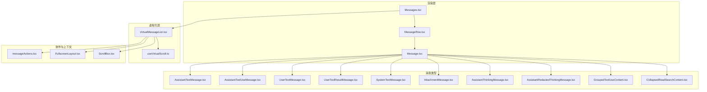
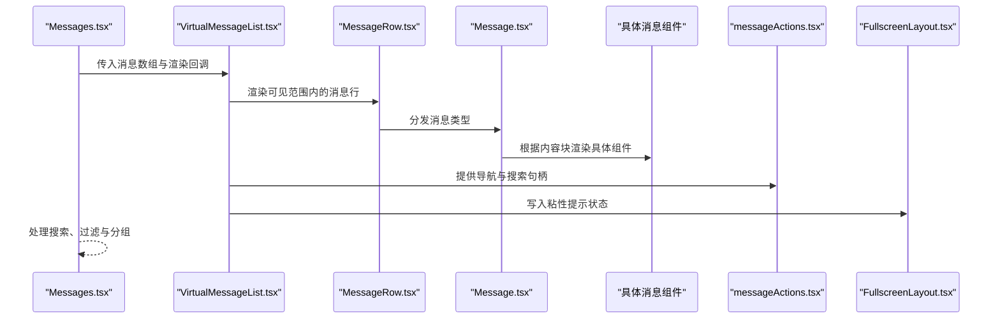
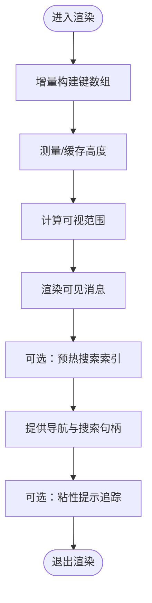
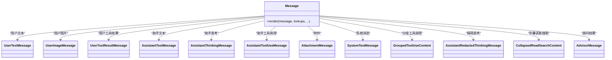
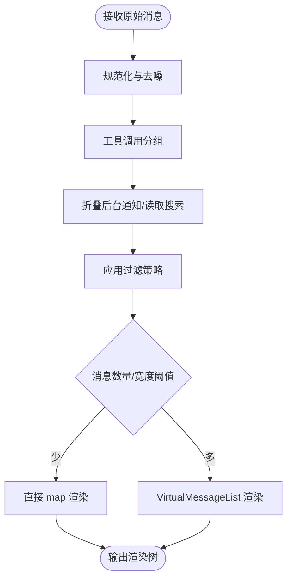
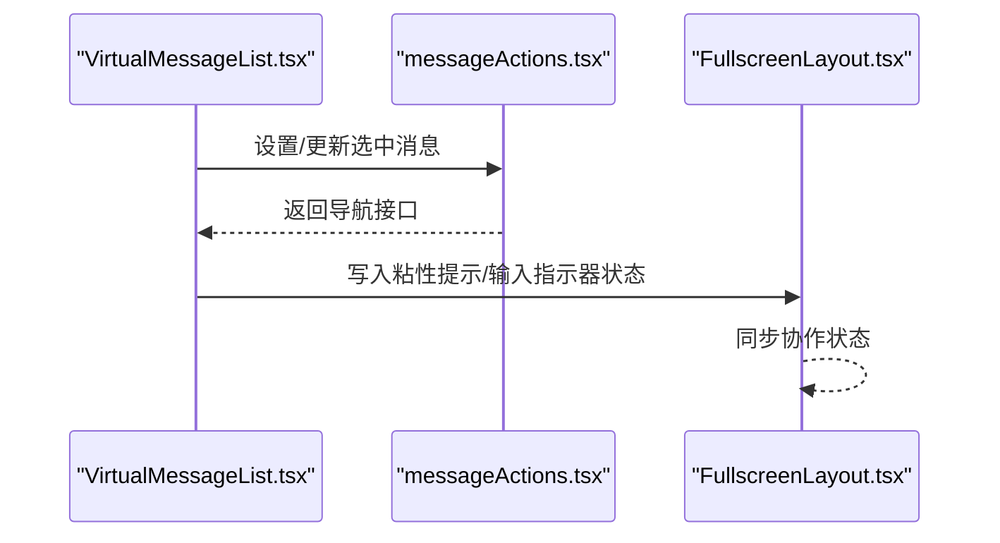
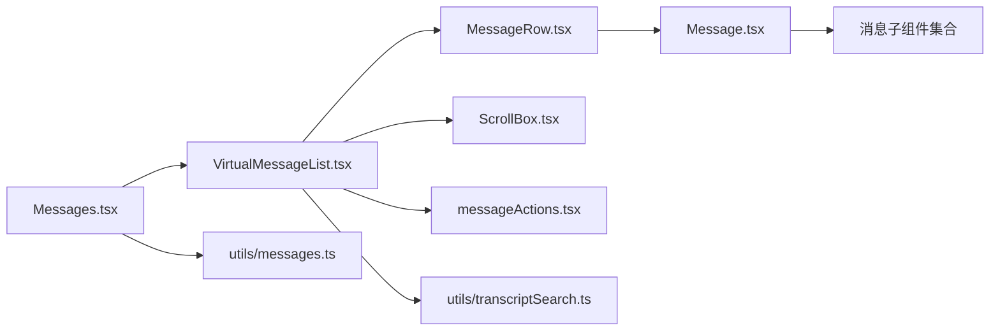

# 核心聊天组件

<cite>
**本文档引用的文件**
- [VirtualMessageList.tsx](file://src/components/VirtualMessageList.tsx)
- [Message.tsx](file://src/components/Message.tsx)
- [Messages.tsx](file://src/components/Messages.tsx)
- [MessageRow.tsx](file://src/components/MessageRow.tsx)
- [useVirtualScroll.ts](file://src/hooks/useVirtualScroll.ts)
- [messageActions.tsx](file://src/components/messageActions.tsx)
- [FullscreenLayout.tsx](file://src/components/FullscreenLayout.tsx)
- [ScrollBox.tsx](file://src/ink/components/ScrollBox.tsx)
- [transcriptSearch.ts](file://src/utils/transcriptSearch.ts)
- [messages.ts](file://src/utils/messages.ts)
- [useTerminalSize.ts](file://src/hooks/useTerminalSize.ts)
- [Markdown.tsx](file://src/components/Markdown.tsx)
- [OffscreenFreeze.tsx](file://src/components/OffscreenFreeze.tsx)
- [AdvisorMessage.tsx](file://src/components/messages/AdvisorMessage.tsx)
- [AssistantTextMessage.tsx](file://src/components/messages/AssistantTextMessage.tsx)
- [AssistantThinkingMessage.tsx](file://src/components/messages/AssistantThinkingMessage.tsx)
- [AssistantToolUseMessage.tsx](file://src/components/messages/AssistantToolUseMessage.tsx)
- [AttachmentMessage.tsx](file://src/components/messages/AttachmentMessage.tsx)
- [UserTextMessage.tsx](file://src/components/messages/UserTextMessage.tsx)
- [UserToolResultMessage.tsx](file://src/components/messages/UserToolResultMessage/UserToolResultMessage.tsx)
- [SystemTextMessage.tsx](file://src/components/messages/SystemTextMessage.tsx)
- [CompactBoundaryMessage.tsx](file://src/components/messages/CompactBoundaryMessage.tsx)
- [GroupedToolUseContent.tsx](file://src/components/messages/GroupedToolUseContent.tsx)
- [AssistantRedactedThinkingMessage.tsx](file://src/components/messages/AssistantRedactedThinkingMessage.tsx)
- [CollapsedReadSearchContent.tsx](file://src/components/messages/CollapsedReadSearchContent.tsx)
</cite>

## 目录
1. [简介](#简介)
2. [项目结构](#项目结构)
3. [核心组件](#核心组件)
4. [架构总览](#架构总览)
5. [详细组件分析](#详细组件分析)
6. [依赖关系分析](#依赖关系分析)
7. [性能考量](#性能考量)
8. [故障排除指南](#故障排除指南)
9. [结论](#结论)

## 简介
本文件面向 Claude Code 的核心聊天组件，系统性梳理并解释聊天界面的组件架构与实现细节，重点覆盖以下方面：
- 组件架构：ChatLayout、ChatWindow、MessageBubble 与 VirtualMessageList 的职责划分与协作关系
- 消息渲染机制：文本消息、工具调用结果、系统消息等不同消息类型的差异化处理
- 协作功能：实时标注、光标共享与输入指示器的实现思路
- 虚拟滚动：高性能消息列表渲染与内存管理策略
- 聊天输入：快捷键支持、自动完成与粘贴处理的交互设计
- 状态管理与消息持久化：消息状态的生命周期与存储策略

## 项目结构
围绕聊天功能的核心文件主要位于 src/components 与 src/hooks 目录中，采用“按功能域分层”的组织方式：
- 渲染层：Messages.tsx（消息容器）、Message.tsx（消息分发器）、MessageRow.tsx（行级包装）
- 虚拟化层：VirtualMessageList.tsx（虚拟消息列表）、useVirtualScroll.ts（虚拟滚动钩子）
- 消息类型：messages 子目录下的各类消息组件（AssistantTextMessage、AssistantToolUseMessage、UserTextMessage 等）
- 工具与上下文：messageActions.tsx（消息动作导航）、FullscreenLayout.tsx（全屏布局与协作状态）
- 输入与渲染：Markdown.tsx（Markdown 渲染）、OffscreenFreeze.tsx（离屏冻结）

**图表来源**
- [Messages.tsx:1-835](file://src/components/Messages.tsx#L1-L835)
- [Message.tsx:1-628](file://src/components/Message.tsx#L1-L628)
- [VirtualMessageList.tsx:1-1083](file://src/components/VirtualMessageList.tsx#L1-L1083)
- [useVirtualScroll.ts](file://src/hooks/useVirtualScroll.ts)
- [messageActions.tsx](file://src/components/messageActions.tsx)
- [FullscreenLayout.tsx](file://src/components/FullscreenLayout.tsx)
- [ScrollBox.tsx](file://src/ink/components/ScrollBox.tsx)

**章节来源**
- [Messages.tsx:1-835](file://src/components/Messages.tsx#L1-L835)
- [Message.tsx:1-628](file://src/components/Message.tsx#L1-L628)
- [VirtualMessageList.tsx:1-1083](file://src/components/VirtualMessageList.tsx#L1-L1083)

## 核心组件
- Messages.tsx：负责消息的规范化、分组与过滤，选择使用虚拟列表或普通映射渲染，并提供搜索与导航能力的入口。
- Message.tsx：根据消息类型分发到具体的消息组件，统一处理用户/助手/系统/附件等消息的渲染逻辑。
- VirtualMessageList.tsx：实现高性能虚拟滚动，仅渲染可视区域内的消息，同时提供搜索、跳转、粘性提示等功能。
- MessageRow.tsx：消息行级包装，承载点击、悬停、展开等交互行为。
- messageActions.tsx：提供消息动作导航接口（如前进后退、选中、扫描），并与协作状态联动。
- FullscreenLayout.tsx：全屏布局与协作状态（如粘性提示）的承载者。

**章节来源**
- [Messages.tsx:1-835](file://src/components/Messages.tsx#L1-L835)
- [Message.tsx:1-628](file://src/components/Message.tsx#L1-L628)
- [VirtualMessageList.tsx:1-1083](file://src/components/VirtualMessageList.tsx#L1-L1083)
- [MessageRow.tsx](file://src/components/MessageRow.tsx)
- [messageActions.tsx](file://src/components/messageActions.tsx)
- [FullscreenLayout.tsx](file://src/components/FullscreenLayout.tsx)

## 架构总览
聊天组件的整体数据流与控制流如下：

**图表来源**
- [Messages.tsx:1-835](file://src/components/Messages.tsx#L1-L835)
- [VirtualMessageList.tsx:1-1083](file://src/components/VirtualMessageList.tsx#L1-L1083)
- [Message.tsx:1-628](file://src/components/Message.tsx#L1-L628)
- [messageActions.tsx](file://src/components/messageActions.tsx)
- [FullscreenLayout.tsx](file://src/components/FullscreenLayout.tsx)

## 详细组件分析

### VirtualMessageList 虚拟消息列表
- 职责与目标
  - 在海量消息场景下，仅渲染可视区域内的消息，显著降低 DOM 数量与重排开销。
  - 提供搜索、跳转、粘性提示追踪、键盘导航等高级交互能力。
- 关键特性
  - 增量键数组：避免每次渲染重建完整键数组，减少字符串分配与比较成本。
  - 高度缓存与测量：基于列宽缓存消息高度，避免宽度变化导致的缓存失效。
  - 搜索索引预热：支持对消息文本进行预提取与索引，提升搜索性能。
  - 导航句柄：对外暴露 jumpToIndex、nextMatch、prevMatch、setAnchor 等方法。
  - 粘性提示追踪：通过 FullscreenLayout 上下文跟踪用户最近一次真实提示文本。
- 性能优化点
  - 使用 useVirtualScroll 钩子计算可视范围与偏移，避免全量渲染。
  - 通过 WeakMap 缓存消息文本提取结果，减少重复计算。
  - 仅在必要时重建键数组，其余情况增量追加。

**图表来源**
- [VirtualMessageList.tsx:1-1083](file://src/components/VirtualMessageList.tsx#L1-L1083)
- [useVirtualScroll.ts](file://src/hooks/useVirtualScroll.ts)
- [transcriptSearch.ts](file://src/utils/transcriptSearch.ts)

**章节来源**
- [VirtualMessageList.tsx:1-1083](file://src/components/VirtualMessageList.tsx#L1-L1083)

### Message 消息分发器
- 职责与目标
  - 将不同类型的消息（用户、助手、系统、附件、分组工具调用等）分发到对应的专用组件。
  - 支持紧凑模式、转录模式、静默渲染等场景的差异化展示。
- 关键特性
  - 用户消息：支持文本、图片、工具结果等多种内容块；根据是否为最新 bash 输出消息决定是否启用展开上下文。
  - 助手消息：支持文本、思考块、工具调用、顾问结果等；在转录模式下可隐藏历史思考。
  - 系统消息：支持本地命令、边界标记、紧凑边界等特殊类型。
  - 分组工具调用：将多个工具调用合并展示，减少冗余。
- 性能优化
  - 使用 React.memo 并自定义相等性比较，避免无关变更导致的重渲染。
  - 对思考块与最新 bash 输出等特定状态进行细粒度控制，减少不必要的更新。

**图表来源**
- [Message.tsx:1-628](file://src/components/Message.tsx#L1-L628)
- [UserTextMessage.tsx](file://src/components/messages/UserTextMessage.tsx)
- [UserToolResultMessage.tsx](file://src/components/messages/UserToolResultMessage/UserToolResultMessage.tsx)
- [AssistantTextMessage.tsx](file://src/components/messages/AssistantTextMessage.tsx)
- [AssistantThinkingMessage.tsx](file://src/components/messages/AssistantThinkingMessage.tsx)
- [AssistantToolUseMessage.tsx](file://src/components/messages/AssistantToolUseMessage.tsx)
- [AttachmentMessage.tsx](file://src/components/messages/AttachmentMessage.tsx)
- [SystemTextMessage.tsx](file://src/components/messages/SystemTextMessage.tsx)
- [GroupedToolUseContent.tsx](file://src/components/messages/GroupedToolUseContent.tsx)
- [AssistantRedactedThinkingMessage.tsx](file://src/components/messages/AssistantRedactedThinkingMessage.tsx)
- [CollapsedReadSearchContent.tsx](file://src/components/messages/CollapsedReadSearchContent.tsx)
- [AdvisorMessage.tsx](file://src/components/messages/AdvisorMessage.tsx)

**章节来源**
- [Message.tsx:1-628](file://src/components/Message.tsx#L1-L628)

### Messages 容器与消息管线
- 职责与目标
  - 规范化消息、应用过滤与分组策略（如工具调用分组、背景 bash 通知折叠、读取搜索折叠等）。
  - 选择渲染路径：在消息数量较少时直接 map，较多时使用 VirtualMessageList。
  - 提供搜索与导航入口，连接 VirtualMessageList 的搜索与跳转能力。
- 关键流程
  - 消息归一化与去噪：去除空消息、系统提醒、元信息等。
  - 分组与折叠：将连续的工具调用合并，折叠后台通知与读取搜索结果。
  - 过滤：在简报模式下仅保留简报工具调用及其结果。
  - 渲染：根据终端宽度与消息数量选择虚拟或非虚拟渲染路径。

**图表来源**
- [Messages.tsx:1-835](file://src/components/Messages.tsx#L1-L835)
- [messages.ts](file://src/utils/messages.ts)

**章节来源**
- [Messages.tsx:1-835](file://src/components/Messages.tsx#L1-L835)

### 协作功能：实时标注、光标共享与输入指示器
- 实时标注与搜索
  - VirtualMessageList 提供搜索查询设置、匹配计数与当前位置高亮，支持锚点与预览跳转。
- 光标共享
  - messageActions.tsx 提供导航接口（enterCursor、navigatePrev、navigateNext 等），结合 VirtualMessageList 的选中状态，实现跨端光标同步。
- 输入指示器
  - 通过 FullscreenLayout 的上下文与协作状态，将输入指示器位置写入布局状态，实现跨端显示。

**图表来源**
- [VirtualMessageList.tsx:1-1083](file://src/components/VirtualMessageList.tsx#L1-L1083)
- [messageActions.tsx](file://src/components/messageActions.tsx)
- [FullscreenLayout.tsx](file://src/components/FullscreenLayout.tsx)

**章节来源**
- [VirtualMessageList.tsx:1-1083](file://src/components/VirtualMessageList.tsx#L1-L1083)
- [messageActions.tsx](file://src/components/messageActions.tsx)
- [FullscreenLayout.tsx](file://src/components/FullscreenLayout.tsx)

### 聊天输入组件的交互设计
- 快捷键支持
  - 通过 useVirtualScroll 与 ScrollBox 的组合，支持键盘导航（如 j/k、PageUp/PageDown）与滚动定位。
- 自动完成
  - 通过 useTypeahead、usePromptSuggestion 等钩子提供上下文相关的建议与补全。
- 粘贴处理
  - 通过 usePasteHandler 与 useClipboardImageHint 等钩子，支持文本与图片的粘贴渲染与提示。

说明：上述交互设计涉及的钩子与组件在仓库中存在对应文件，但具体实现细节不在本文档引用范围内，此处提供概念性说明以帮助理解整体交互链路。

[本节为概念性说明，不直接分析具体代码文件]

## 依赖关系分析
- 组件耦合
  - Messages.tsx 与 VirtualMessageList.tsx 双向协作：前者提供消息管线，后者提供渲染与导航。
  - Message.tsx 作为分发器，依赖各消息子组件；通过 lookups 与 tools 注入上下文。
- 外部依赖
  - ink 组件库（Box、Text、ScrollBox）用于终端渲染与滚动。
  - utils 下的 messages.ts、transcriptSearch.ts 等提供消息处理与搜索能力。
- 循环依赖风险
  - 当前结构通过清晰的单向依赖（容器 -> 列表/行 -> 消息组件）避免循环依赖。

**图表来源**
- [Messages.tsx:1-835](file://src/components/Messages.tsx#L1-L835)
- [VirtualMessageList.tsx:1-1083](file://src/components/VirtualMessageList.tsx#L1-L1083)
- [Message.tsx:1-628](file://src/components/Message.tsx#L1-L628)
- [ScrollBox.tsx](file://src/ink/components/ScrollBox.tsx)
- [messageActions.tsx](file://src/components/messageActions.tsx)
- [messages.ts](file://src/utils/messages.ts)
- [transcriptSearch.ts](file://src/utils/transcriptSearch.ts)

**章节来源**
- [Messages.tsx:1-835](file://src/components/Messages.tsx#L1-L835)
- [VirtualMessageList.tsx:1-1083](file://src/components/VirtualMessageList.tsx#L1-L1083)
- [Message.tsx:1-628](file://src/components/Message.tsx#L1-L628)

## 性能考量
- 虚拟滚动
  - 仅渲染可视区域，配合高度缓存与增量键数组，显著降低 DOM 与重排成本。
- 搜索性能
  - 预热搜索索引与弱引用缓存，避免重复提取与计算。
- 渲染稳定性
  - 使用 React.memo 与自定义相等性比较，减少不必要重渲染。
- 离屏冻结
  - 对长时间未见的消息使用 OffscreenFreeze，进一步降低渲染压力。

[本节为通用性能指导，不直接分析具体代码文件]

## 故障排除指南
- 搜索无结果或跳转异常
  - 检查搜索锚点是否被手动滚动清除；确认 VirtualMessageList 的 disarmSearch 是否被触发。
  - 确认消息文本提取函数与索引是否正确初始化。
- 虚拟滚动高度错位
  - 检查列宽变化是否导致高度缓存失效；确认 columns 参数是否随终端尺寸变化而更新。
- 消息渲染卡顿
  - 检查是否频繁重建键数组；确认是否启用了增量键构建。
  - 确认是否使用了 OffscreenFreeze 对离屏消息进行冻结。

**章节来源**
- [VirtualMessageList.tsx:1-1083](file://src/components/VirtualMessageList.tsx#L1-L1083)
- [messages.ts](file://src/utils/messages.ts)

## 结论
本文档从架构与实现两个维度梳理了 Claude Code 的核心聊天组件，重点解释了：
- 虚拟消息列表的高性能渲染策略与搜索/导航能力
- 消息分发器对多种消息类型的差异化处理
- 协作功能（标注、光标共享、输入指示器）的实现路径
- 聊天输入交互（快捷键、自动完成、粘贴）的设计思路
- 状态管理与消息持久化的关键点

通过以上组件与机制的协同，系统在长会话与大规模消息场景下仍能保持流畅的交互体验。