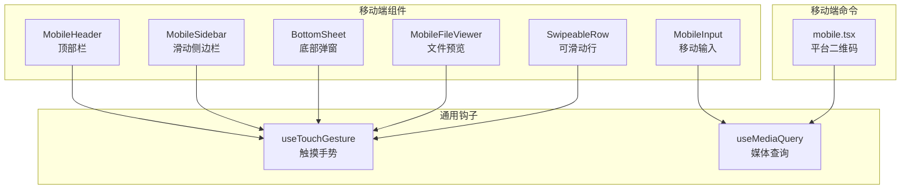
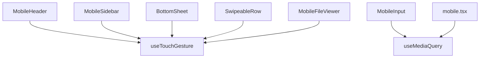
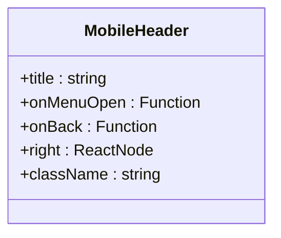
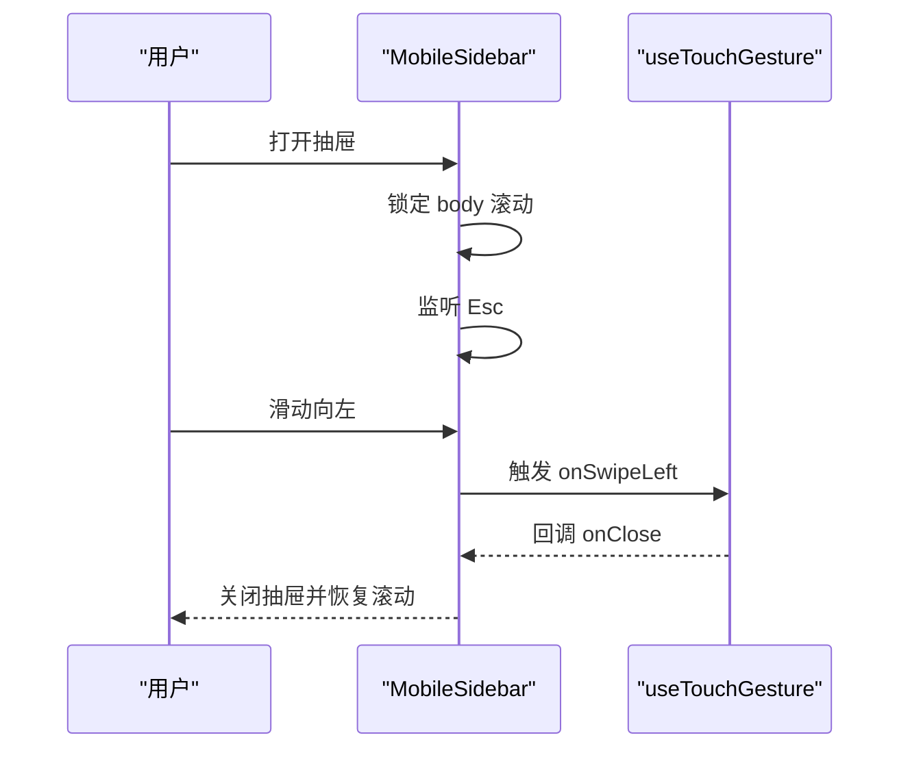
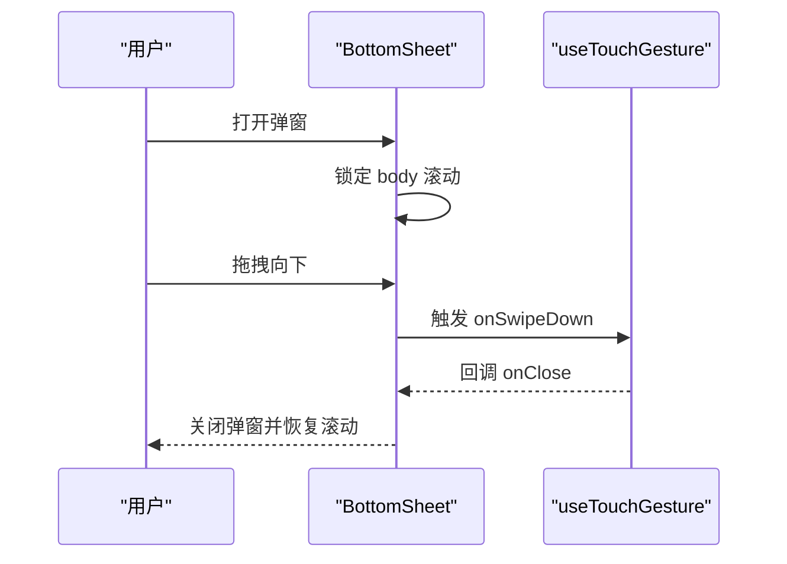
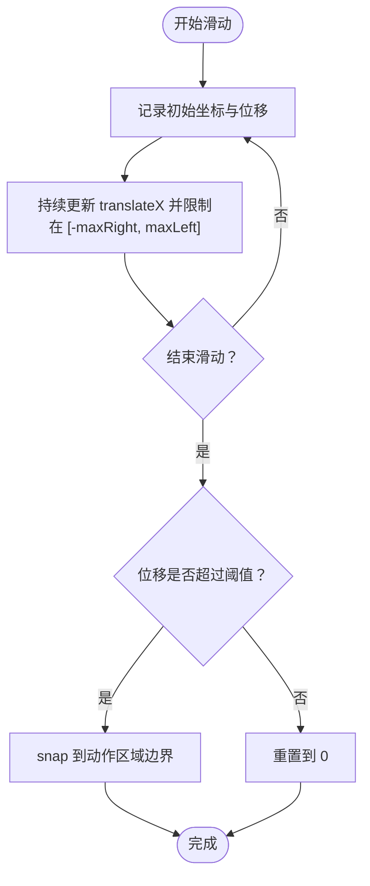
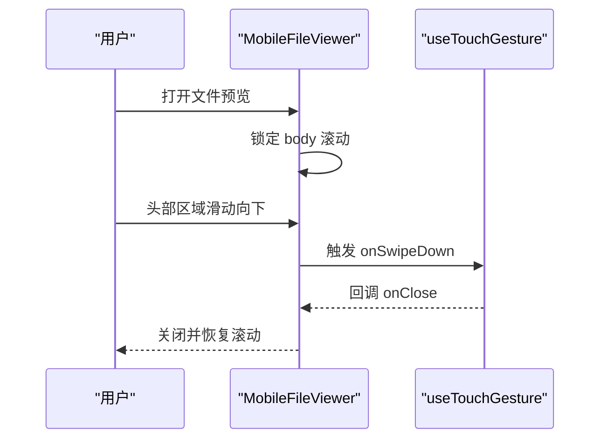
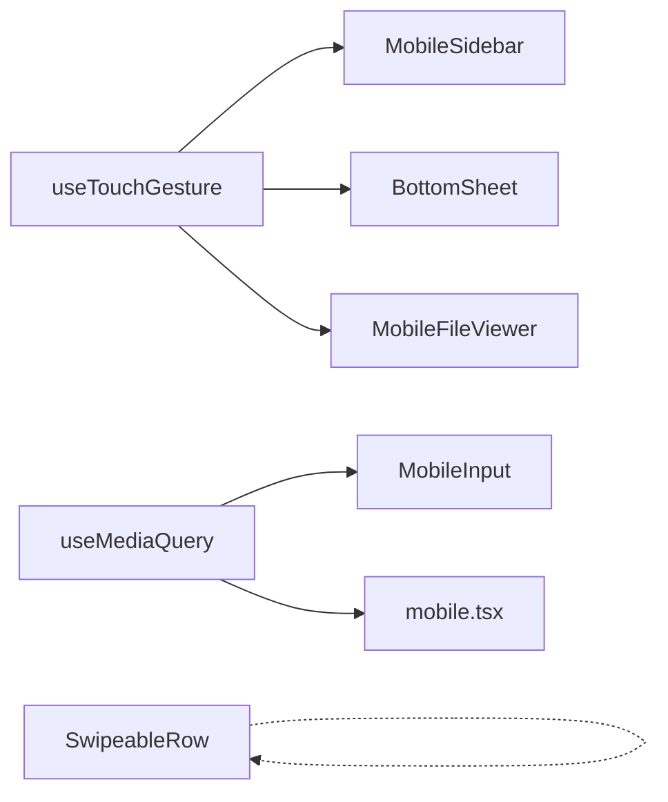

# 移动端响应式组件

<cite>
**本文引用的文件**
- [web/components/mobile/MobileHeader.tsx](file://web/components/mobile/MobileHeader.tsx)
- [web/components/mobile/MobileSidebar.tsx](file://web/components/mobile/MobileSidebar.tsx)
- [web/components/mobile/BottomSheet.tsx](file://web/components/mobile/BottomSheet.tsx)
- [web/components/mobile/SwipeableRow.tsx](file://web/components/mobile/SwipeableRow.tsx)
- [web/components/mobile/MobileInput.tsx](file://web/components/mobile/MobileInput.tsx)
- [web/components/mobile/MobileFileViewer.tsx](file://web/components/mobile/MobileFileViewer.tsx)
- [web/hooks/useTouchGesture.ts](file://web/hooks/useTouchGesture.ts)
- [web/hooks/useMediaQuery.ts](file://web/hooks/useMediaQuery.ts)
- [src/commands/mobile/mobile.tsx](file://src/commands/mobile/mobile.tsx)
</cite>

## 目录
1. [简介](#简介)
2. [项目结构](#项目结构)
3. [核心组件](#核心组件)
4. [架构总览](#架构总览)
5. [详细组件分析](#详细组件分析)
6. [依赖关系分析](#依赖关系分析)
7. [性能考量](#性能考量)
8. [故障排查指南](#故障排查指南)
9. [结论](#结论)
10. [附录](#附录)

## 简介
本文件系统性梳理 Claude Code 在 Web 端的移动端响应式组件体系，重点覆盖以下组件与能力：
- 移动端头部栏：紧凑布局、可选返回按钮与菜单按钮
- 滑动侧边栏：抽屉式导航、滑动手势与焦点管理
- 底部弹窗：iOS 风格弹出层、拖拽关闭与安全区域适配
- 可滑动行：左/右滑动触发操作（如删除），支持动作按钮宽度配置
- 移动输入：软键盘高度感知、内容区上移避免遮挡
- 文件预览：全屏文件查看器、滑动关闭与缩放手势
- 触摸手势钩子：统一的滑动识别、长按检测与速度阈值
- 媒体查询钩子：基于断点的设备类型判断
- 移动端命令：生成平台二维码、跨平台引导

目标是帮助开发者快速理解组件职责、交互流程、性能优化策略与调试方法。

## 项目结构
移动端组件主要位于 web/components/mobile 目录，配合 hooks 提供通用的触摸与断点逻辑；移动端命令位于 src/commands/mobile。

**图表来源**
- [web/components/mobile/MobileHeader.tsx:1-60](file://web/components/mobile/MobileHeader.tsx#L1-L60)
- [web/components/mobile/MobileSidebar.tsx:1-76](file://web/components/mobile/MobileSidebar.tsx#L1-L76)
- [web/components/mobile/BottomSheet.tsx:1-101](file://web/components/mobile/BottomSheet.tsx#L1-L101)
- [web/components/mobile/SwipeableRow.tsx:1-153](file://web/components/mobile/SwipeableRow.tsx#L1-L153)
- [web/components/mobile/MobileInput.tsx:1-27](file://web/components/mobile/MobileInput.tsx#L1-L27)
- [web/components/mobile/MobileFileViewer.tsx:1-108](file://web/components/mobile/MobileFileViewer.tsx#L1-L108)
- [web/hooks/useTouchGesture.ts:1-111](file://web/hooks/useTouchGesture.ts#L1-L111)
- [web/hooks/useMediaQuery.ts:1-32](file://web/hooks/useMediaQuery.ts#L1-L32)
- [src/commands/mobile/mobile.tsx:1-276](file://src/commands/mobile/mobile.tsx#L1-L276)

**章节来源**
- [web/components/mobile/MobileHeader.tsx:1-60](file://web/components/mobile/MobileHeader.tsx#L1-L60)
- [web/components/mobile/MobileSidebar.tsx:1-76](file://web/components/mobile/MobileSidebar.tsx#L1-L76)
- [web/components/mobile/BottomSheet.tsx:1-101](file://web/components/mobile/BottomSheet.tsx#L1-L101)
- [web/components/mobile/SwipeableRow.tsx:1-153](file://web/components/mobile/SwipeableRow.tsx#L1-L153)
- [web/components/mobile/MobileInput.tsx:1-27](file://web/components/mobile/MobileInput.tsx#L1-L27)
- [web/components/mobile/MobileFileViewer.tsx:1-108](file://web/components/mobile/MobileFileViewer.tsx#L1-L108)
- [web/hooks/useTouchGesture.ts:1-111](file://web/hooks/useTouchGesture.ts#L1-L111)
- [web/hooks/useMediaQuery.ts:1-32](file://web/hooks/useMediaQuery.ts#L1-L32)
- [src/commands/mobile/mobile.tsx:1-276](file://src/commands/mobile/mobile.tsx#L1-L276)

## 核心组件
- 移动端头部栏 MobileHeader：左侧返回或菜单按钮，中部标题，右侧可选操作区；符合可访问性最小点击目标尺寸。
- 滑动侧边栏 MobileSidebar：从左侧滑入抽屉式导航，支持滑动关闭、Esc 关闭、滚动锁定与焦点陷阱。
- 底部弹窗 BottomSheet：iOS 风格从底部上滑，支持拖拽关闭、点击蒙层关闭、Esc 关闭、滚动锁定与安全区域适配。
- 可滑动行 SwipeableRow：内容区域可左右滑动，暴露左侧/右侧动作按钮，支持动作宽度自定义与回弹 snap。
- 移动输入 MobileInput：根据软键盘高度动态调整内容区下边距，避免输入被遮挡。
- 文件预览 MobileFileViewer：全屏文件查看器，支持滑动关闭、头部操作区、内容区域触控缩放。
- 触摸手势 useTouchGesture：统一处理滑动方向与速度、长按检测、阈值配置。
- 媒体查询 useMediaQuery：提供移动端/平板/桌面断点判断。
- 移动端命令 mobile.tsx：生成 iOS/Android 平台二维码并提供切换与关闭快捷键。

**章节来源**
- [web/components/mobile/MobileHeader.tsx:14-59](file://web/components/mobile/MobileHeader.tsx#L14-L59)
- [web/components/mobile/MobileSidebar.tsx:13-75](file://web/components/mobile/MobileSidebar.tsx#L13-L75)
- [web/components/mobile/BottomSheet.tsx:15-100](file://web/components/mobile/BottomSheet.tsx#L15-L100)
- [web/components/mobile/SwipeableRow.tsx:22-152](file://web/components/mobile/SwipeableRow.tsx#L22-L152)
- [web/components/mobile/MobileInput.tsx:11-26](file://web/components/mobile/MobileInput.tsx#L11-L26)
- [web/components/mobile/MobileFileViewer.tsx:16-107](file://web/components/mobile/MobileFileViewer.tsx#L16-L107)
- [web/hooks/useTouchGesture.ts:28-111](file://web/hooks/useTouchGesture.ts#L28-L111)
- [web/hooks/useMediaQuery.ts:5-32](file://web/hooks/useMediaQuery.ts#L5-L32)
- [src/commands/mobile/mobile.tsx:14-276](file://src/commands/mobile/mobile.tsx#L14-L276)

## 架构总览
移动端组件围绕“手势识别 + 断点判断 + 状态控制”的模式构建，通过共享钩子实现一致的交互体验与性能优化。

**图表来源**
- [web/hooks/useTouchGesture.ts:1-111](file://web/hooks/useTouchGesture.ts#L1-L111)
- [web/hooks/useMediaQuery.ts:1-32](file://web/hooks/useMediaQuery.ts#L1-L32)
- [web/components/mobile/MobileHeader.tsx:1-60](file://web/components/mobile/MobileHeader.tsx#L1-L60)
- [web/components/mobile/MobileSidebar.tsx:1-76](file://web/components/mobile/MobileSidebar.tsx#L1-L76)
- [web/components/mobile/BottomSheet.tsx:1-101](file://web/components/mobile/BottomSheet.tsx#L1-L101)
- [web/components/mobile/SwipeableRow.tsx:1-153](file://web/components/mobile/SwipeableRow.tsx#L1-L153)
- [web/components/mobile/MobileInput.tsx:1-27](file://web/components/mobile/MobileInput.tsx#L1-L27)
- [web/components/mobile/MobileFileViewer.tsx:1-108](file://web/components/mobile/MobileFileViewer.tsx#L1-L108)
- [src/commands/mobile/mobile.tsx:1-276](file://src/commands/mobile/mobile.tsx#L1-L276)

## 详细组件分析

### 组件一：移动端头部栏 MobileHeader
- 设计要点
  - 左侧：返回按钮或菜单按钮，满足 WCAG/Apple HIG 最小点击目标尺寸
  - 中部：标题文本，支持截断
  - 右侧：可选操作区
- 交互与可访问性
  - 使用语义化按钮与 aria-label
  - 支持主题色与悬停/激活态
- 适用场景
  - 聊天页、设置页、导航页等

**图表来源**
- [web/components/mobile/MobileHeader.tsx:6-24](file://web/components/mobile/MobileHeader.tsx#L6-L24)

**章节来源**
- [web/components/mobile/MobileHeader.tsx:14-59](file://web/components/mobile/MobileHeader.tsx#L14-L59)

### 组件二：滑动侧边栏 MobileSidebar
- 设计要点
  - 抽屉式从左侧滑入，作为模态对话框
  - 支持滑动关闭、点击蒙层关闭、Esc 关闭
  - 打开时锁定 body 滚动，关闭时恢复
  - 焦点陷阱：打开时聚焦抽屉，关闭时恢复焦点
- 交互流程

**图表来源**
- [web/components/mobile/MobileSidebar.tsx:20-44](file://web/components/mobile/MobileSidebar.tsx#L20-L44)
- [web/hooks/useTouchGesture.ts:28-111](file://web/hooks/useTouchGesture.ts#L28-L111)

**章节来源**
- [web/components/mobile/MobileSidebar.tsx:13-75](file://web/components/mobile/MobileSidebar.tsx#L13-L75)

### 组件三：底部弹窗 BottomSheet
- 设计要点
  - iOS 风格从底部上滑，支持拖拽关闭、点击蒙层关闭、Esc 关闭
  - 打开时锁定 body 滚动，支持安全区域底部内边距
  - 内容区域可滚动，使用 overscroll-contain 优化滚动体验
- 交互流程

**图表来源**
- [web/components/mobile/BottomSheet.tsx:22-47](file://web/components/mobile/BottomSheet.tsx#L22-L47)
- [web/hooks/useTouchGesture.ts:28-111](file://web/hooks/useTouchGesture.ts#L28-L111)

**章节来源**
- [web/components/mobile/BottomSheet.tsx:15-100](file://web/components/mobile/BottomSheet.tsx#L15-L100)

### 组件四：可滑动行 SwipeableRow
- 设计要点
  - 内容区域支持左右滑动，暴露左侧/右侧动作按钮
  - 动作按钮宽度可配置，默认 72px
  - 支持 snap：滑过半阈值自动展开动作，否则回弹
- 交互流程

**图表来源**
- [web/components/mobile/SwipeableRow.tsx:34-74](file://web/components/mobile/SwipeableRow.tsx#L34-L74)

**章节来源**
- [web/components/mobile/SwipeableRow.tsx:22-152](file://web/components/mobile/SwipeableRow.tsx#L22-L152)

### 组件五：移动输入 MobileInput
- 设计要点
  - 根据软键盘高度设置内容区下边距，避免输入被遮挡
  - 使用过渡动画平滑变化
- 适用场景
  - 移动端聊天输入、表单输入

**章节来源**
- [web/components/mobile/MobileInput.tsx:11-26](file://web/components/mobile/MobileInput.tsx#L11-L26)

### 组件六：文件预览 MobileFileViewer
- 设计要点
  - 全屏从底部上滑，支持滑动关闭、头部操作区、内容区域触控缩放
  - 打开时锁定 body 滚动，支持安全区域底部内边距
- 交互流程

**图表来源**
- [web/components/mobile/MobileFileViewer.tsx:23-51](file://web/components/mobile/MobileFileViewer.tsx#L23-L51)
- [web/hooks/useTouchGesture.ts:28-111](file://web/hooks/useTouchGesture.ts#L28-L111)

**章节来源**
- [web/components/mobile/MobileFileViewer.tsx:16-107](file://web/components/mobile/MobileFileViewer.tsx#L16-L107)

### 组件七：触摸手势钩子 useTouchGesture
- 能力概览
  - 滑动识别：支持上下左右方向，可配置阈值与速度阈值
  - 长按检测：可配置延迟时间
  - 回调分发：统一 onTouchStart/move/end 返回处理器
- 参数与行为
  - threshold：最小滑动距离
  - velocityThreshold：最小速度
  - onSwipe/onSwipeLeft/Right/Up/Down：方向回调
  - onLongPress：长按回调
  - longPressDelay：长按延迟

**章节来源**
- [web/hooks/useTouchGesture.ts:28-111](file://web/hooks/useTouchGesture.ts#L28-L111)

### 组件八：媒体查询钩子 useMediaQuery
- 能力概览
  - useMediaQuery：通用媒体查询匹配
  - useIsMobile/useIsTablet/useIsDesktop：断点别名
- 使用建议
  - 基于断点进行条件渲染与样式切换
  - 注意监听变更事件并在卸载时清理

**章节来源**
- [web/hooks/useMediaQuery.ts:5-32](file://web/hooks/useMediaQuery.ts#L5-L32)

### 组件九：移动端命令 mobile.tsx
- 能力概览
  - 生成 iOS/Android 平台二维码，支持平台切换
  - 提供键盘快捷键：Tab 切换平台、Esc 关闭
- 适用场景
  - CLI 中展示移动端下载入口

**章节来源**
- [src/commands/mobile/mobile.tsx:14-276](file://src/commands/mobile/mobile.tsx#L14-L276)

## 依赖关系分析
- 组件对钩子的依赖
  - MobileHeader：无直接依赖
  - MobileSidebar/BottomSheet/MobileFileViewer：依赖 useTouchGesture
  - SwipeableRow：内部实现滑动逻辑，不依赖外部钩子
  - MobileInput：依赖 useMediaQuery 进行断点判断（在实际使用中）
  - 移动端命令：依赖 useMediaQuery 进行断点判断
- 依赖耦合与内聚
  - 触摸手势集中在 useTouchGesture，降低重复实现
  - 断点逻辑集中在 useMediaQuery，便于统一管理
  - 组件间低耦合，高内聚，通过 props 与回调交互

**图表来源**
- [web/hooks/useTouchGesture.ts:1-111](file://web/hooks/useTouchGesture.ts#L1-L111)
- [web/hooks/useMediaQuery.ts:1-32](file://web/hooks/useMediaQuery.ts#L1-L32)
- [web/components/mobile/MobileSidebar.tsx:1-76](file://web/components/mobile/MobileSidebar.tsx#L1-L76)
- [web/components/mobile/BottomSheet.tsx:1-101](file://web/components/mobile/BottomSheet.tsx#L1-L101)
- [web/components/mobile/MobileFileViewer.tsx:1-108](file://web/components/mobile/MobileFileViewer.tsx#L1-L108)
- [web/components/mobile/SwipeableRow.tsx:1-153](file://web/components/mobile/SwipeableRow.tsx#L1-L153)
- [web/components/mobile/MobileInput.tsx:1-27](file://web/components/mobile/MobileInput.tsx#L1-L27)
- [src/commands/mobile/mobile.tsx:1-276](file://src/commands/mobile/mobile.tsx#L1-L276)

**章节来源**
- [web/hooks/useTouchGesture.ts:1-111](file://web/hooks/useTouchGesture.ts#L1-L111)
- [web/hooks/useMediaQuery.ts:1-32](file://web/hooks/useMediaQuery.ts#L1-L32)
- [web/components/mobile/MobileSidebar.tsx:1-76](file://web/components/mobile/MobileSidebar.tsx#L1-L76)
- [web/components/mobile/BottomSheet.tsx:1-101](file://web/components/mobile/BottomSheet.tsx#L1-L101)
- [web/components/mobile/MobileFileViewer.tsx:1-108](file://web/components/mobile/MobileFileViewer.tsx#L1-L108)
- [web/components/mobile/SwipeableRow.tsx:1-153](file://web/components/mobile/SwipeableRow.tsx#L1-L153)
- [web/components/mobile/MobileInput.tsx:1-27](file://web/components/mobile/MobileInput.tsx#L1-L27)
- [src/commands/mobile/mobile.tsx:1-276](file://src/commands/mobile/mobile.tsx#L1-L276)

## 性能考量
- 触摸事件优化
  - 使用统一的 useTouchGesture，减少重复计算与内存分配
  - 合理设置阈值与速度阈值，避免误触与过度响应
  - 长按检测使用定时器，结束时及时清理
- 动画与滚动
  - 使用 transform/translate 替代改变布局属性，避免强制同步布局
  - 使用 overscroll-contain 优化滚动体验，减少滚动抖动
  - 控制过渡时长与缓动函数，保证流畅度
- 电池续航与资源
  - 打开/关闭弹窗时仅在必要时锁定 body 滚动，及时释放
  - 避免在滚动过程中频繁重排与重绘
  - 对于 QR 码生成等异步任务，采用并发与缓存策略
- 可访问性与可发现性
  - 确保最小点击目标尺寸，提升可触达性
  - 提供键盘快捷键与无障碍标签，增强可用性

[本节为通用指导，无需列出具体文件来源]

## 故障排查指南
- 手势不生效
  - 检查是否正确传入 useTouchGesture 返回的处理器
  - 确认阈值与速度阈值设置合理
  - 排查是否有其他元素阻止了触摸事件冒泡
- 弹窗无法关闭
  - 确认 onClose 回调是否正确传递
  - 检查 Esc 监听与蒙层点击事件
  - 确认 body 滚动锁定在打开/关闭时正确设置
- 滑动行动作未触发
  - 检查动作按钮的 onClick 是否正确绑定并调用 resetPosition
  - 确认动作宽度与数量计算正确
- 软键盘遮挡输入
  - 确认 MobileInput 的 keyboardHeight 正确传入
  - 检查过渡动画是否影响布局计算
- 文件预览缩放异常
  - 确认内容区域 touch-action 设置为允许平移与捏合缩放
  - 检查安全区域内边距是否正确应用

**章节来源**
- [web/hooks/useTouchGesture.ts:28-111](file://web/hooks/useTouchGesture.ts#L28-L111)
- [web/components/mobile/BottomSheet.tsx:22-47](file://web/components/mobile/BottomSheet.tsx#L22-L47)
- [web/components/mobile/MobileSidebar.tsx:20-44](file://web/components/mobile/MobileSidebar.tsx#L20-L44)
- [web/components/mobile/SwipeableRow.tsx:76-79](file://web/components/mobile/SwipeableRow.tsx#L76-L79)
- [web/components/mobile/MobileInput.tsx:17-26](file://web/components/mobile/MobileInput.tsx#L17-L26)
- [web/components/mobile/MobileFileViewer.tsx:91-101](file://web/components/mobile/MobileFileViewer.tsx#L91-L101)

## 结论
本移动端响应式组件体系以统一的触摸手势与断点逻辑为核心，结合各具特色的 UI 组件，实现了从导航、操作到内容呈现的一致体验。通过合理的性能优化与可访问性设计，能够在不同设备与网络环境下稳定运行。建议在后续迭代中持续关注手势阈值的本地化适配、动画性能的进一步优化以及可访问性的深度验证。

[本节为总结性内容，无需列出具体文件来源]

## 附录
- 断点参考
  - 移动端：< 768px
  - 平板：768px – 1023px
  - 桌面：≥ 1024px
- 最小点击目标尺寸
  - 建议 ≥ 44×44 px，确保可触达性
- 安全区域
  - 使用 env(safe-area-inset-bottom) 适配刘海屏与底部安全区域

**章节来源**
- [web/hooks/useMediaQuery.ts:19-32](file://web/hooks/useMediaQuery.ts#L19-L32)
- [web/components/mobile/MobileHeader.tsx:34-50](file://web/components/mobile/MobileHeader.tsx#L34-L50)
- [web/components/mobile/BottomSheet.tsx:95-97](file://web/components/mobile/BottomSheet.tsx#L95-L97)
- [web/components/mobile/MobileFileViewer.tsx:103-105](file://web/components/mobile/MobileFileViewer.tsx#L103-L105)