# 设置界面组件

<cite>
**本文档引用的文件**
- [Settings.tsx](file://src/components/Settings/Settings.tsx)
- [Config.tsx](file://src/components/Settings/Config.tsx)
- [Usage.tsx](file://src/components/Settings/Usage.tsx)
- [Status.tsx](file://src/components/Settings/Status.tsx)
- [ThemePicker.tsx](file://src/components/ThemePicker.tsx)
- [ModelPicker.tsx](file://src/components/ModelPicker.tsx)
- [OutputStylePicker.tsx](file://src/components/OutputStylePicker.tsx)
- [LanguagePicker.tsx](file://src/components/LanguagePicker.tsx)
- [ChannelDowngradeDialog.tsx](file://src/components/ChannelDowngradeDialog.tsx)
- [ClaudeMdExternalIncludesDialog.tsx](file://src/components/ClaudeMdExternalIncludesDialog.tsx)
- [AppState.tsx](file://src/state/AppState.tsx)
- [settings.ts](file://src/utils/settings/settings.ts)
- [config.ts](file://src/utils/config.ts)
- [permissions/PermissionMode.ts](file://src/utils/permissions/PermissionMode.ts)
- [permissions/permissionSetup.ts](file://src/utils/permissions/permissionSetup.ts)
- [fastMode.ts](file://src/utils/fastMode.ts)
- [model/model.ts](file://src/utils/model/model.ts)
- [analytics/index.ts](file://src/services/analytics/index.ts)
- [usage.ts](file://src/services/api/usage.ts)
- [keybindings/useKeybinding.tsx](file://src/keybindings/useKeybinding.tsx)
- [hooks/useTerminalSize.ts](file://src/hooks/useTerminalSize.ts)
- [hooks/useSearchInput.ts](file://src/hooks/useSearchInput.ts)
- [hooks/useAppState.ts](file://src/hooks/useAppState.ts)
- [design-system/Tabs.tsx](file://src/components/design-system/Tabs.tsx)
- [design-system/Dialog.tsx](file://src/components/design-system/Dialog.tsx)
- [design-system/ProgressBar.tsx](file://src/components/design-system/ProgressBar.tsx)
- [design-system/Byline.tsx](file://src/components/design-system/Byline.tsx)
- [CustomSelect/index.tsx](file://src/components/CustomSelect/index.tsx)
- [SearchBox.tsx](file://src/components/SearchBox.tsx)
- [ConfigurableShortcutHint.tsx](file://src/components/ConfigurableShortcutHint.tsx)
- [KeyboardShortcutHint.tsx](file://src/components/design-system/KeyboardShortcutHint.tsx)
</cite>

## 目录
1. [简介](#简介)
2. [项目结构](#项目结构)
3. [核心组件](#核心组件)
4. [架构概览](#架构概览)
5. [详细组件分析](#详细组件分析)
6. [依赖关系分析](#依赖关系分析)
7. [性能考虑](#性能考虑)
8. [故障排除指南](#故障排除指南)
9. [结论](#结论)

## 简介

Claude Code 的设置界面组件是一个完整的终端友好的配置管理系统，提供了丰富的设置选项和直观的用户交互体验。该系统采用模块化设计，支持主题系统、API 设置、数据设置、键盘设置、MCP 设置和模型设置等多个功能模块。

系统的核心特点包括：
- 响应式设计，适配不同终端尺寸
- 实时状态管理和数据绑定
- 完整的主题系统支持
- 搜索和过滤功能
- 键盘快捷键导航
- 无障碍访问支持

## 项目结构

设置界面组件位于 `src/components/Settings/` 目录下，采用模块化架构设计：

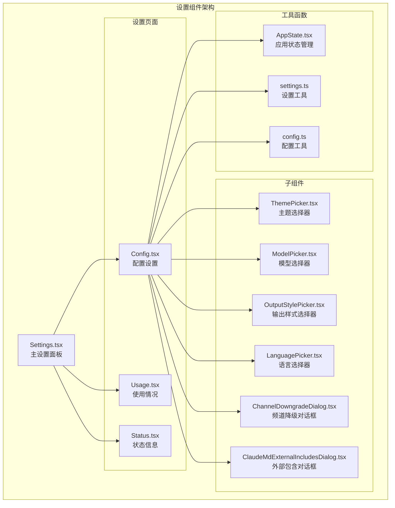

**图表来源**
- [Settings.tsx:1-138](file://src/components/Settings/Settings.tsx#L1-L138)
- [Config.tsx:1-1823](file://src/components/Settings/Config.tsx#L1-L1823)

**章节来源**
- [Settings.tsx:1-138](file://src/components/Settings/Settings.tsx#L1-L138)
- [Config.tsx:1-1823](file://src/components/Settings/Config.tsx#L1-L1823)

## 核心组件

### Settings 主组件

Settings.tsx 是整个设置界面的入口点，负责管理标签页切换和整体布局：

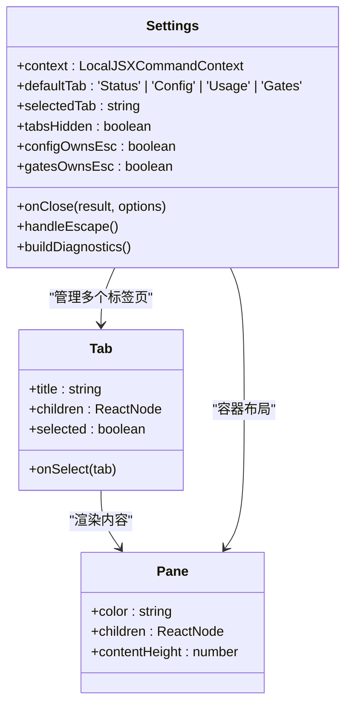

**图表来源**
- [Settings.tsx:15-30](file://src/components/Settings/Settings.tsx#L15-L30)

### Config 配置组件

Config.tsx 是最复杂的组件，实现了所有设置项的管理：

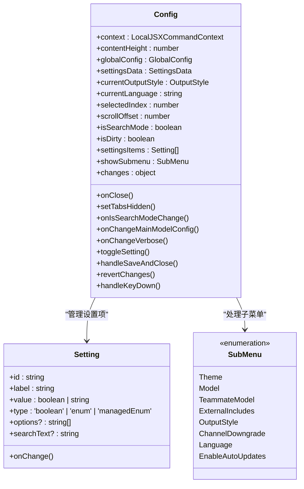

**图表来源**
- [Config.tsx:51-91](file://src/components/Settings/Config.tsx#L51-L91)
- [Config.tsx:60-84](file://src/components/Settings/Config.tsx#L60-L84)

**章节来源**
- [Settings.tsx:22-130](file://src/components/Settings/Settings.tsx#L22-L130)
- [Config.tsx:85-1822](file://src/components/Settings/Config.tsx#L85-L1822)

## 架构概览

设置界面采用了分层架构设计，确保了良好的可维护性和扩展性：

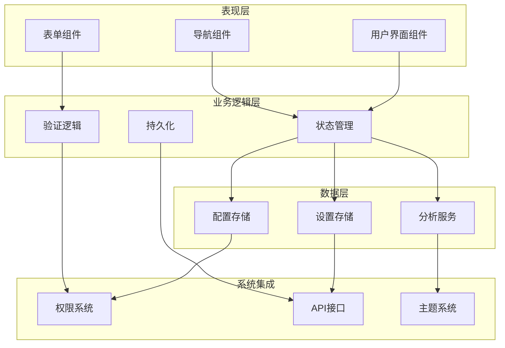

**图表来源**
- [AppState.tsx](file://src/state/AppState.tsx)
- [settings.ts](file://src/utils/settings/settings.ts)
- [config.ts](file://src/utils/config.ts)

## 详细组件分析

### 主题系统实现

Claude Code 的主题系统提供了完整的明暗模式切换和颜色定制功能：

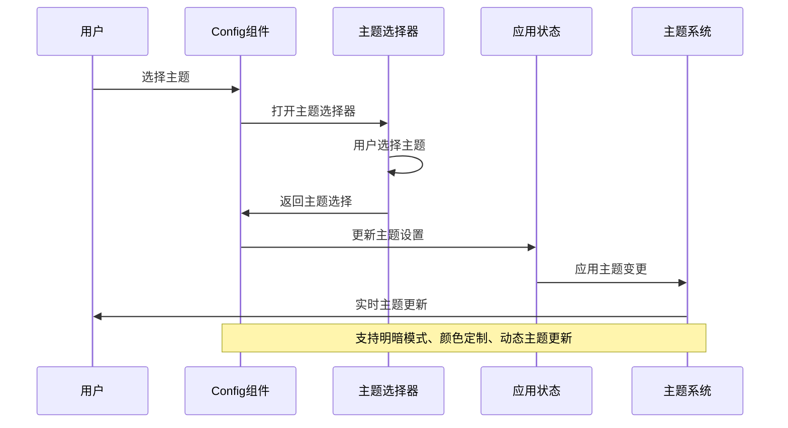

**图表来源**
- [Config.tsx:1304-1328](file://src/components/Settings/Config.tsx#L1304-L1328)
- [ThemePicker.tsx](file://src/components/ThemePicker.tsx)

主题系统的关键特性：
- **明暗模式切换**：支持自动匹配终端、深色模式、浅色模式
- **颜色定制**：支持色盲友好模式和 ANSI 颜色模式
- **动态更新**：实时应用主题变更，无需重启
- **持久化存储**：主题设置保存到全局配置中

### 设置项数据绑定和状态管理

设置系统实现了完整的数据绑定和状态管理机制：

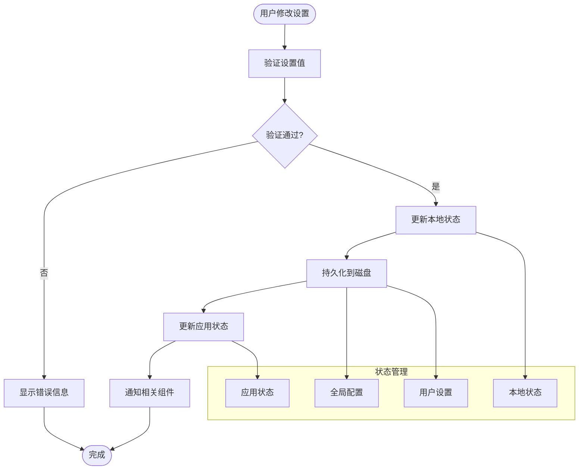

**图表来源**
- [Config.tsx:1087-1174](file://src/components/Settings/Config.tsx#L1087-L1174)
- [AppState.tsx](file://src/state/AppState.tsx)

### API 设置模块

API 设置模块管理了 Claude Code 与外部服务的连接配置：

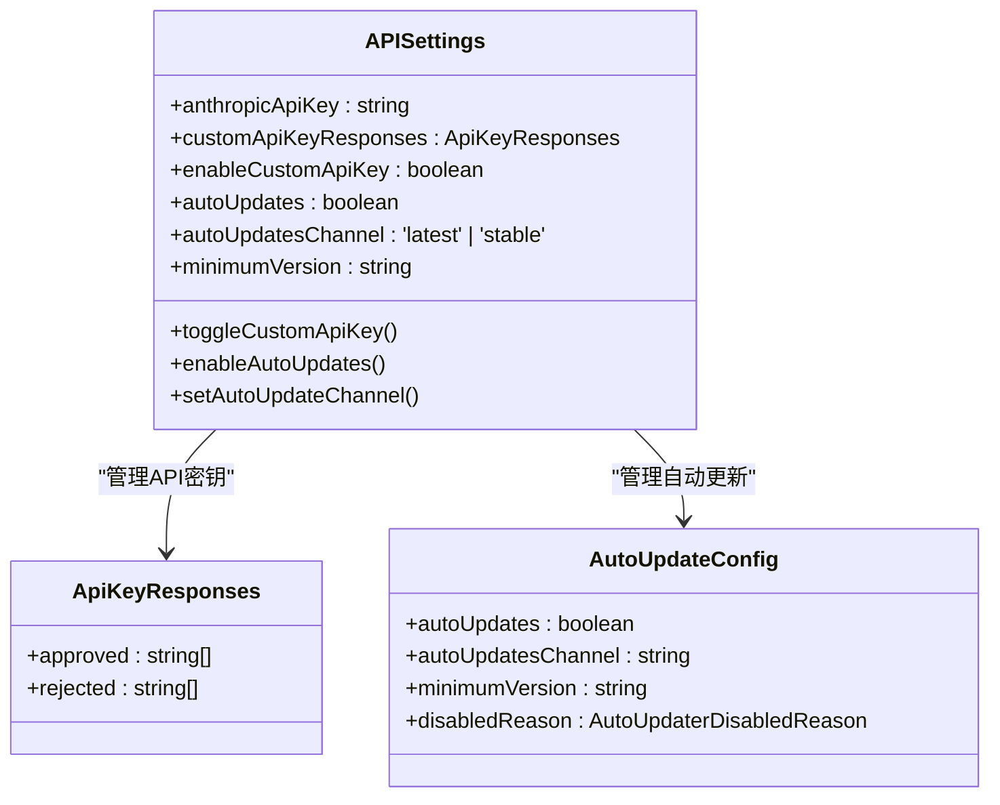

**图表来源**
- [Config.tsx:991-1045](file://src/components/Settings/Config.tsx#L991-L1045)
- [Config.tsx:1330-1359](file://src/components/Settings/Config.tsx#L1330-L1359)

### 数据设置模块

数据设置模块控制了 Claude Code 的数据处理和存储行为：

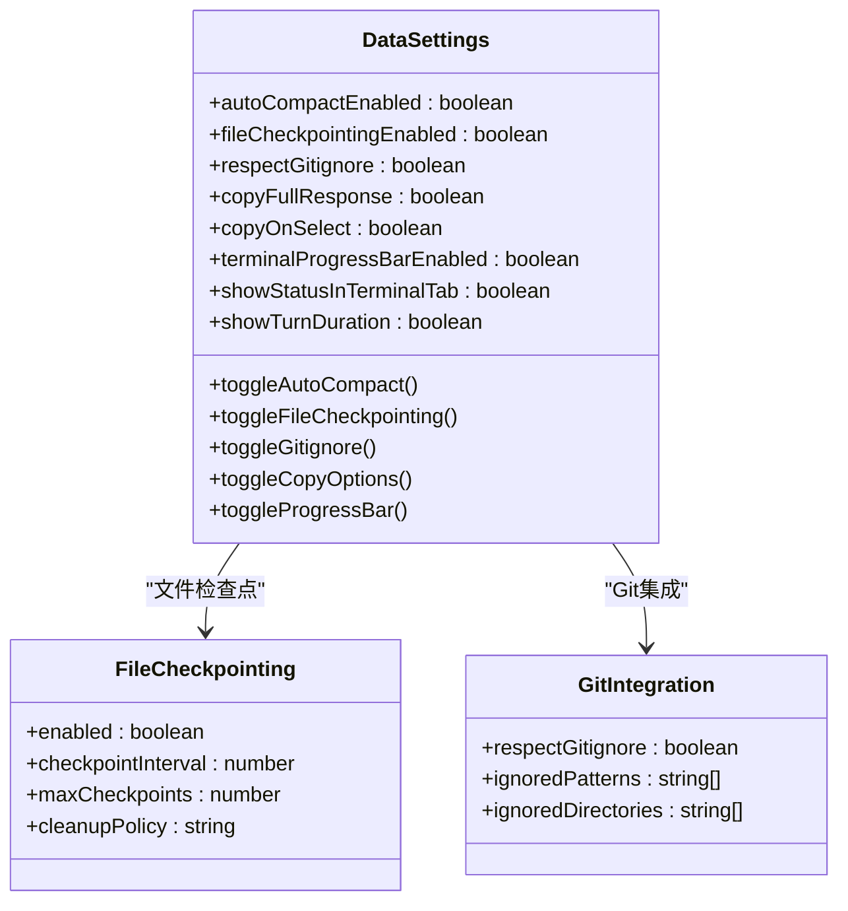

**图表来源**
- [Config.tsx:264-434](file://src/components/Settings/Config.tsx#L264-L434)
- [Config.tsx:416-434](file://src/components/Settings/Config.tsx#L416-L434)

### 键盘设置模块

键盘设置模块提供了灵活的键盘快捷键配置：

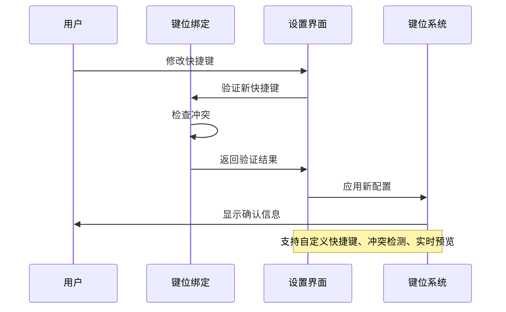

**图表来源**
- [Config.tsx:1367-1448](file://src/components/Settings/Config.tsx#L1367-L1448)
- [keybindings/useKeybinding.tsx](file://src/keybindings/useKeybinding.tsx)

### MCP 设置模块

MCP（Model Context Protocol）设置模块管理了与外部模型服务器的连接：

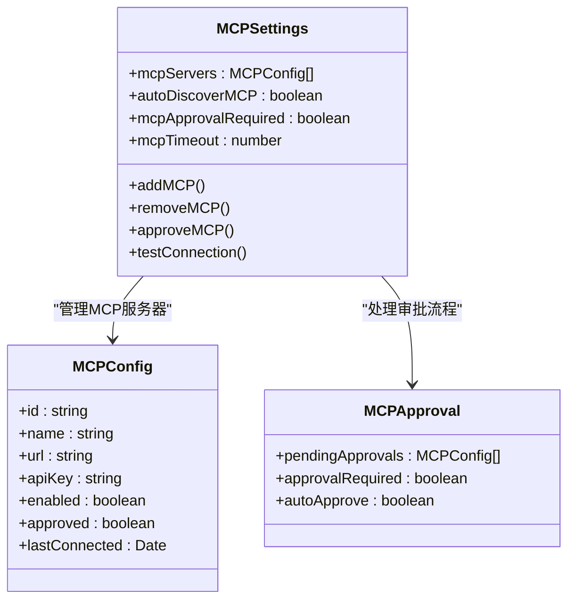

**图表来源**
- [Config.tsx:816-836](file://src/components/Settings/Config.tsx#L816-L836)
- [Config.tsx:930-928](file://src/components/Settings/Config.tsx#L930-L928)

### 模型设置模块

模型设置模块提供了多种 AI 模型的选择和配置：

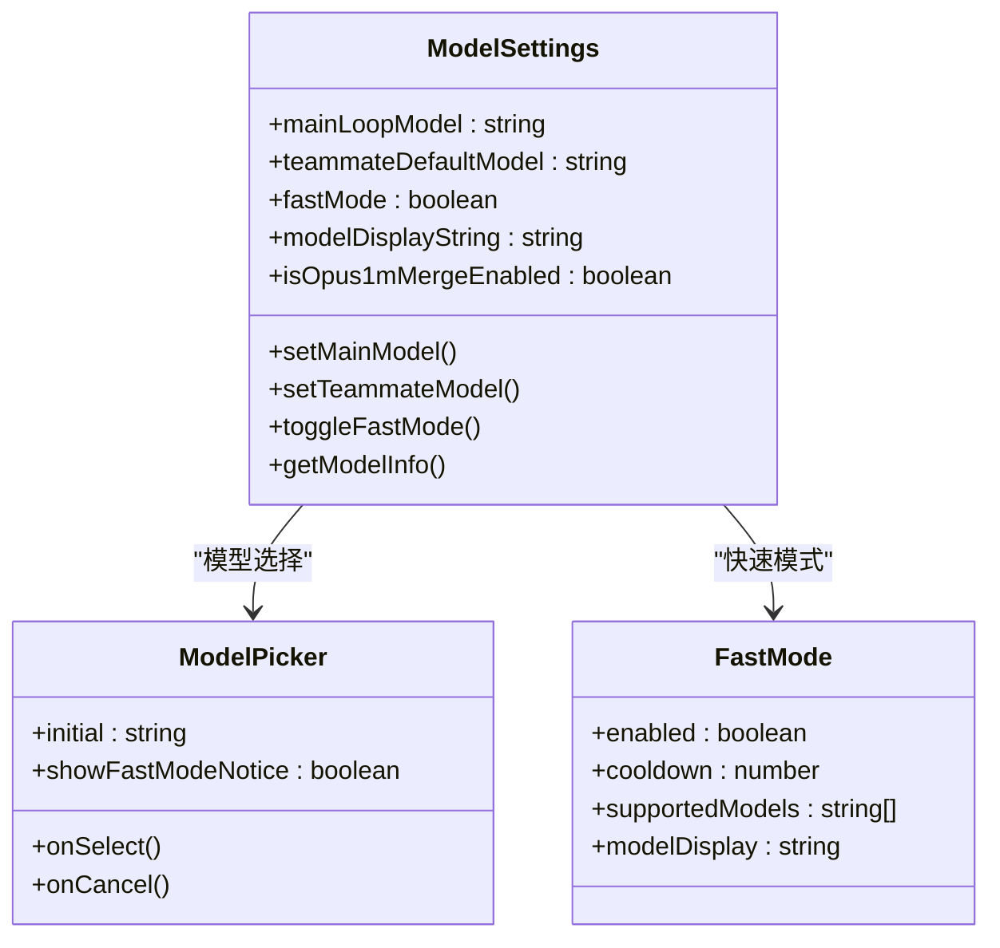

**图表来源**
- [Config.tsx:811-816](file://src/components/Settings/Config.tsx#L811-L816)
- [Config.tsx:1469-1478](file://src/components/Settings/Config.tsx#L1469-L1478)
- [model/model.ts](file://src/utils/model/model.ts)

### 设置导入导出功能

设置系统提供了完整的导入导出机制，支持配置备份和恢复：

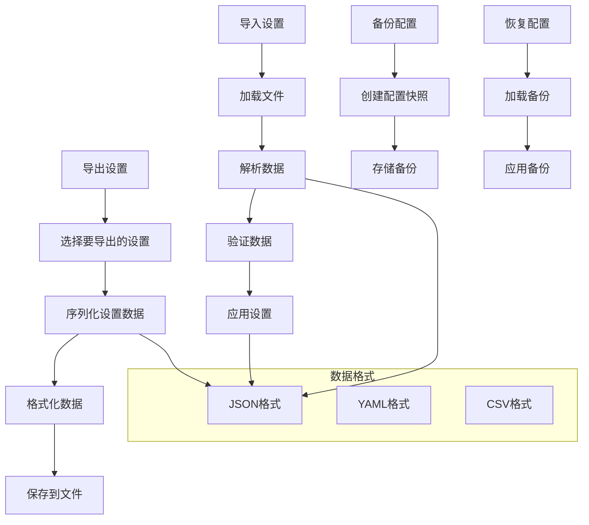

**图表来源**
- [settings.ts](file://src/utils/settings/settings.ts)
- [config.ts](file://src/utils/config.ts)

**章节来源**
- [Config.tsx:1087-1250](file://src/components/Settings/Config.tsx#L1087-L1250)
- [Usage.tsx:174-265](file://src/components/Settings/Usage.tsx#L174-L265)

## 依赖关系分析

设置界面组件之间的依赖关系如下：

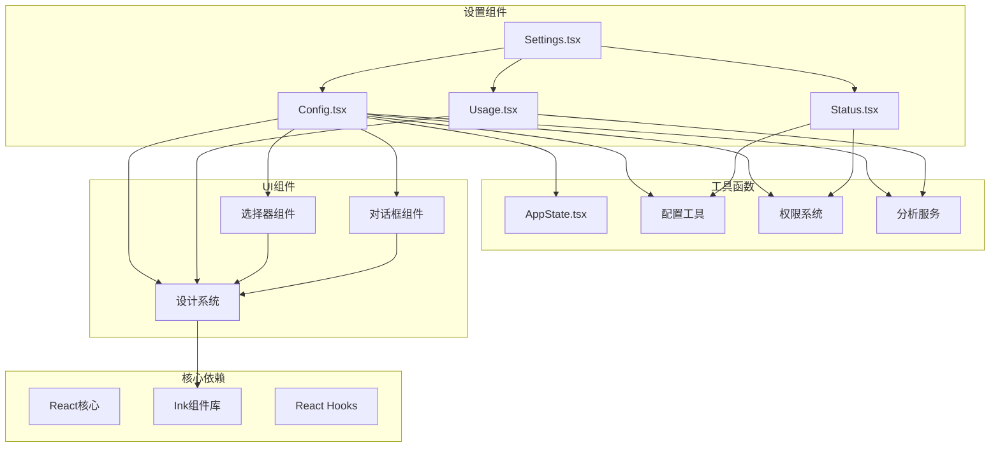

**图表来源**
- [Settings.tsx:1-15](file://src/components/Settings/Settings.tsx#L1-L15)
- [Config.tsx:1-25](file://src/components/Settings/Config.tsx#L1-L25)

**章节来源**
- [Settings.tsx:1-138](file://src/components/Settings/Settings.tsx#L1-L138)
- [Config.tsx:1-1823](file://src/components/Settings/Config.tsx#L1-L1823)

## 性能考虑

设置界面在设计时充分考虑了性能优化：

### 渲染优化
- **虚拟滚动**：使用分页机制限制同时渲染的设置项数量
- **记忆化**：对复杂计算结果进行缓存
- **条件渲染**：根据状态动态决定组件渲染

### 状态管理优化
- **局部状态**：避免不必要的全局状态更新
- **批量更新**：合并多个状态变更操作
- **懒加载**：延迟加载大型组件

### 数据持久化优化
- **增量更新**：只保存变更的设置项
- **防抖机制**：避免频繁的磁盘写入
- **缓存策略**：合理利用内存缓存

## 故障排除指南

### 常见问题及解决方案

#### 设置无法保存
1. **检查权限**：确保应用程序有写入配置文件的权限
2. **验证格式**：检查配置文件格式是否正确
3. **清理缓存**：删除损坏的缓存文件后重试

#### 主题切换失败
1. **重启应用**：某些主题变更需要重启才能生效
2. **检查兼容性**：确认终端支持所选主题
3. **重置主题**：恢复到默认主题后重新配置

#### 键盘快捷键无效
1. **检查冲突**：确认快捷键没有与其他功能冲突
2. **重新绑定**：尝试使用不同的快捷键组合
3. **重置配置**：恢复默认的快捷键设置

#### 使用情况数据不更新
1. **网络连接**：检查API连接状态
2. **认证信息**：确认API密钥有效
3. **手动刷新**：使用重试快捷键刷新数据

**章节来源**
- [Usage.tsx:202-229](file://src/components/Settings/Usage.tsx#L202-L229)
- [Config.tsx:1252-1263](file://src/components/Settings/Config.tsx#L1252-L1263)

## 结论

Claude Code 的设置界面组件展现了现代前端架构的最佳实践。通过模块化设计、完善的类型系统和强大的状态管理，该系统提供了用户友好的配置体验。

主要优势包括：
- **模块化架构**：清晰的组件分离和职责划分
- **类型安全**：完整的 TypeScript 类型定义
- **用户体验**：直观的界面设计和流畅的交互
- **可扩展性**：易于添加新的设置项和功能模块
- **可靠性**：完善的错误处理和故障恢复机制

该系统为开发者提供了强大的配置管理能力，同时保持了良好的性能和可维护性，是构建复杂桌面应用程序的优秀参考实现。