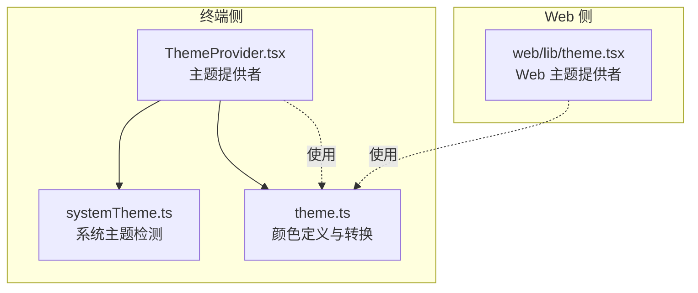
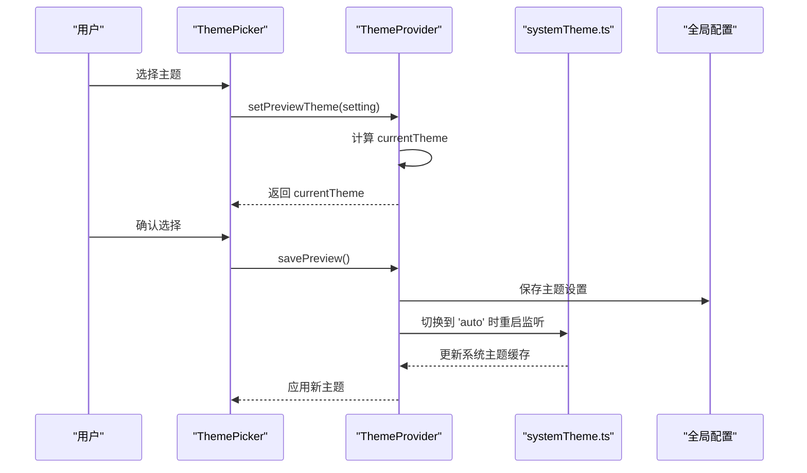
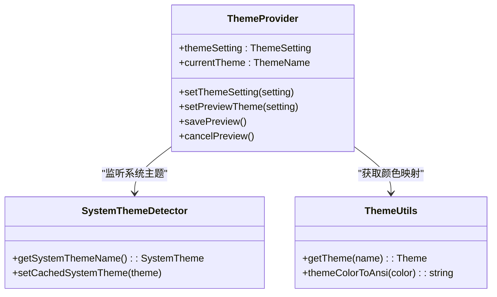
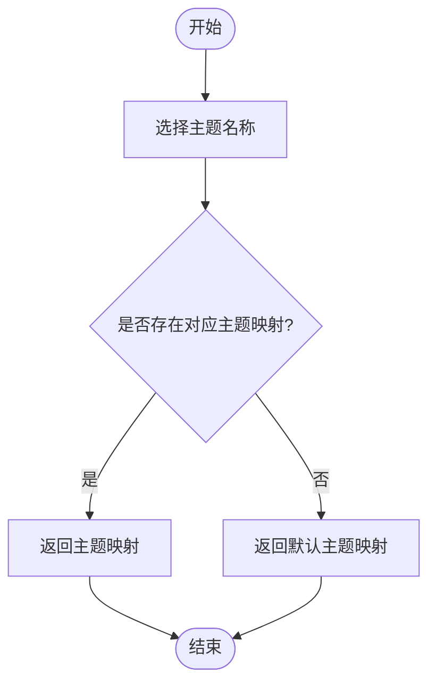
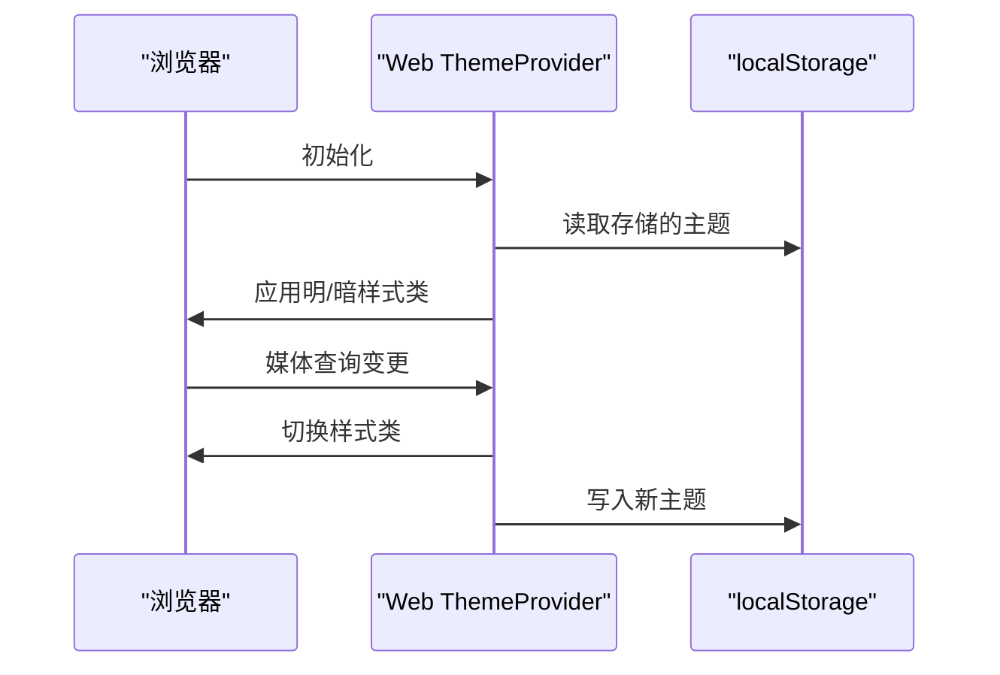
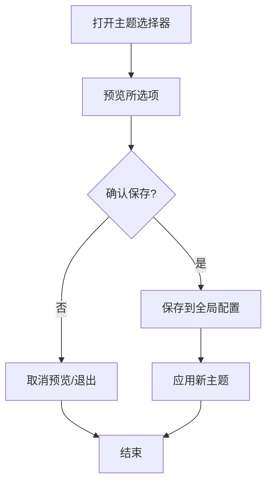
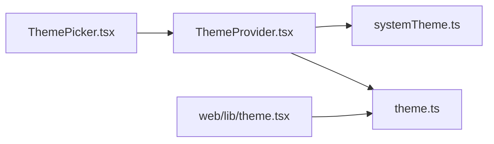

# 主题系统

<cite>
**本文档引用的文件**
- [src/components/design-system/ThemeProvider.tsx](file://src/components/design-system/ThemeProvider.tsx)
- [src/utils/theme.ts](file://src/utils/theme.ts)
- [src/components/ThemePicker.tsx](file://src/components/ThemePicker.tsx)
- [src/commands/theme/theme.tsx](file://src/commands/theme/theme.tsx)
- [src/utils/systemTheme.ts](file://src/utils/systemTheme.ts)
- [web/lib/theme.tsx](file://web/lib/theme.tsx)
</cite>

## 目录
1. [简介](#简介)
2. [项目结构](#项目结构)
3. [核心组件](#核心组件)
4. [架构总览](#架构总览)
5. [详细组件分析](#详细组件分析)
6. [依赖关系分析](#依赖关系分析)
7. [性能考虑](#性能考虑)
8. [故障排除指南](#故障排除指南)
9. [结论](#结论)
10. [附录](#附录)

## 简介
本文件系统性梳理 Claude Code 的主题系统，覆盖架构设计、主题提供者、主题切换机制、持久化存储、颜色体系（明暗主题、品牌色、语义化颜色）、跨平台（终端与 Web）实现差异与统一策略、主题定制与个性化、主题开发指南以及性能优化与动态加载等关键内容。目标是帮助开发者快速理解并高效扩展主题系统。

## 项目结构
主题系统由三部分组成：
- 终端侧主题提供者与上下文：负责解析用户偏好、自动检测系统主题、预览与保存主题设置，并通过 React Context 暴露给组件树。
- 颜色定义与转换：集中管理所有主题的颜色映射，支持真彩与 ANSI 降级方案，并提供终端渲染所需的 ANSI 转换工具。
- Web 侧主题提供者：基于浏览器媒体查询与本地存储，实现明/暗/系统跟随的切换与持久化。

**图表来源**
- [src/components/design-system/ThemeProvider.tsx:1-171](file://src/components/design-system/ThemeProvider.tsx#L1-L171)
- [src/utils/systemTheme.ts:1-119](file://src/utils/systemTheme.ts#L1-L119)
- [src/utils/theme.ts:1-641](file://src/utils/theme.ts#L1-L641)
- [web/lib/theme.tsx:1-75](file://web/lib/theme.tsx#L1-L75)

**章节来源**
- [src/components/design-system/ThemeProvider.tsx:1-171](file://src/components/design-system/ThemeProvider.tsx#L1-L171)
- [src/utils/theme.ts:1-641](file://src/utils/theme.ts#L1-L641)
- [web/lib/theme.tsx:1-75](file://web/lib/theme.tsx#L1-L75)

## 核心组件
- 终端主题提供者（ThemeProvider）
  - 职责：维护用户主题设置、预览状态、系统主题缓存；在 'auto' 模式下监听系统主题变化；将当前主题暴露给消费方。
  - 关键能力：主题设置持久化、预览与保存、自动模式下的实时监听。
- 颜色系统（Theme）
  - 职责：定义完整的颜色映射（品牌色、语义色、差异色、Agent 色、TUI V2 色等），提供真彩与 ANSI 两种渲染路径，并支持终端 ANSI 转换。
- Web 主题提供者（Web ThemeProvider）
  - 职责：基于浏览器媒体查询与本地存储，实现明/暗/系统跟随的主题切换与持久化。
- 主题选择器（ThemePicker）
  - 职责：提供交互式主题选择界面，支持预览、保存、取消、快捷键切换语法高亮等。

**章节来源**
- [src/components/design-system/ThemeProvider.tsx:1-171](file://src/components/design-system/ThemeProvider.tsx#L1-L171)
- [src/utils/theme.ts:1-641](file://src/utils/theme.ts#L1-L641)
- [src/components/ThemePicker.tsx:1-334](file://src/components/ThemePicker.tsx#L1-L334)
- [web/lib/theme.tsx:1-75](file://web/lib/theme.tsx#L1-L75)

## 架构总览
主题系统采用“提供者 + 上下文 + 工具函数”的分层架构：
- 提供者层：终端与 Web 各自的 ThemeProvider，负责状态管理与生命周期。
- 上下文层：useTheme/useThemeSetting/usePreviewTheme 等 Hook，向组件暴露主题状态与操作方法。
- 工具层：颜色定义、系统主题检测、ANSI 转换等纯函数与常量。
- 命令与 UI 层：命令行主题选择器与 TUI 交互界面。

**图表来源**
- [src/components/ThemePicker.tsx:1-334](file://src/components/ThemePicker.tsx#L1-L334)
- [src/components/design-system/ThemeProvider.tsx:61-116](file://src/components/design-system/ThemeProvider.tsx#L61-L116)
- [src/utils/systemTheme.ts:1-119](file://src/utils/systemTheme.ts#L1-L119)

## 详细组件分析

### 终端主题提供者（ThemeProvider）
- 主题设置与预览
  - 支持 'auto'、'dark'、'light' 及多种变体（如 daltonized、ansi）。通过预览状态在选择器打开期间即时生效，关闭后保存或取消。
  - 保存时调用 onThemeSave 回调，默认写入全局配置。
- 自动模式监听
  - 在启用 AUTO_THEME 特性时，通过内部查询器启动系统主题监听，实时更新缓存并驱动 currentTheme。
  - 首次启动从 $COLORFGBG 推断初始值，避免等待异步 OSC 查询。
- 渲染与消费
  - 通过 React Context 暴露 currentTheme、setThemeSetting、setPreviewTheme、savePreview、cancelPreview 等。

**图表来源**
- [src/components/design-system/ThemeProvider.tsx:1-171](file://src/components/design-system/ThemeProvider.tsx#L1-L171)
- [src/utils/systemTheme.ts:1-119](file://src/utils/systemTheme.ts#L1-L119)
- [src/utils/theme.ts:598-641](file://src/utils/theme.ts#L598-L641)

**章节来源**
- [src/components/design-system/ThemeProvider.tsx:43-116](file://src/components/design-system/ThemeProvider.tsx#L43-L116)
- [src/utils/systemTheme.ts:24-37](file://src/utils/systemTheme.ts#L24-L37)

### 颜色系统（Theme）
- 主题类型与名称
  - 定义 ThemeSetting 与 ThemeName，支持 'auto'、'dark'、'light'、'light-daltonized'、'dark-daltonized'、'light-ansi'、'dark-ansi'。
- 颜色映射
  - 包含品牌色（claude、permission 等）、语义色（success、error、warning）、差异色（diffAdded/diffRemoved）、Agent 色、TUI V2 色、Chrome 色等。
  - 提供真彩 RGB 与 ANSI 两套方案，确保在不支持真彩的终端中也能正确显示。
- ANSI 转换
  - 将主题中的 RGB 颜色转换为 ANSI 转义序列，针对 Apple Terminal 使用 256 色级别以提升兼容性。

**图表来源**
- [src/utils/theme.ts:598-613](file://src/utils/theme.ts#L598-L613)

**章节来源**
- [src/utils/theme.ts:4-89](file://src/utils/theme.ts#L4-L89)
- [src/utils/theme.ts:115-515](file://src/utils/theme.ts#L115-L515)
- [src/utils/theme.ts:626-641](file://src/utils/theme.ts#L626-L641)

### Web 主题提供者（Web ThemeProvider）
- 功能特性
  - 支持 'dark'、'light'、'system' 三种模式，系统模式基于浏览器媒体查询。
  - 使用 localStorage 存储用户选择，初始化时从存储恢复。
  - 通过为根元素添加/移除类名实现明/暗样式切换。
- 与终端实现的差异
  - 终端侧通过 OSC 11 查询与 $COLORFGBG 推断系统主题，Web 侧直接依赖浏览器媒体查询。
  - 终端侧支持 'auto' 模式与预览保存流程，Web 侧主要关注明/暗/系统跟随。

**图表来源**
- [web/lib/theme.tsx:16-68](file://web/lib/theme.tsx#L16-L68)

**章节来源**
- [web/lib/theme.tsx:1-75](file://web/lib/theme.tsx#L1-L75)

### 主题选择器（ThemePicker）
- 交互能力
  - 提供可选主题列表（含 'auto'、明/暗、色弱友好、仅 ANSI 等），支持键盘快捷键与预览。
  - 支持切换语法高亮（受环境变量与设置控制）。
- 生命周期与退出处理
  - 支持 ESC 取消并执行优雅退出或回调；支持跳过退出处理以便在特定场景复用。
- 实现要点
  - 使用 Select 组件呈现选项，结合 usePreviewTheme 与 useThemeSetting 实现预览与最终保存。

**图表来源**
- [src/components/ThemePicker.tsx:113-220](file://src/components/ThemePicker.tsx#L113-L220)

**章节来源**
- [src/components/ThemePicker.tsx:1-334](file://src/components/ThemePicker.tsx#L1-L334)

### 命令行主题选择器（ThemePickerCommand）
- 作用
  - 作为命令入口，提供主题选择的命令行界面，设置主题后回调完成状态。
- 与 TUI 主题选择器的关系
  - 共享相同的主题设置逻辑，但以命令行方式呈现与交互。

**章节来源**
- [src/commands/theme/theme.tsx:1-59](file://src/commands/theme/theme.tsx#L1-L59)

## 依赖关系分析
- 组件耦合
  - ThemeProvider 依赖 systemTheme.ts 获取系统主题缓存，依赖 theme.ts 提供颜色映射。
  - ThemePicker 依赖 ThemeProvider 的上下文与 Hook，同时依赖 Select、StructuredDiff 等 UI 组件。
- 外部依赖
  - Web 侧依赖浏览器媒体查询与 localStorage。
  - 终端侧依赖内部查询器与 $COLORFGBG 环境变量。
- 循环依赖
  - 当前实现未见循环依赖；若新增模块需注意避免 Provider 与工具函数之间的双向引用。

**图表来源**
- [src/components/ThemePicker.tsx:1-334](file://src/components/ThemePicker.tsx#L1-L334)
- [src/components/design-system/ThemeProvider.tsx:1-171](file://src/components/design-system/ThemeProvider.tsx#L1-L171)
- [src/utils/systemTheme.ts:1-119](file://src/utils/systemTheme.ts#L1-L119)
- [src/utils/theme.ts:1-641](file://src/utils/theme.ts#L1-L641)
- [web/lib/theme.tsx:1-75](file://web/lib/theme.tsx#L1-L75)

**章节来源**
- [src/components/ThemePicker.tsx:1-334](file://src/components/ThemePicker.tsx#L1-L334)
- [src/components/design-system/ThemeProvider.tsx:1-171](file://src/components/design-system/ThemeProvider.tsx#L1-L171)

## 性能考虑
- 主题切换开销
  - 预览阶段仅在内存中计算 currentTheme，不触发持久化，降低 IO 开销。
  - 'auto' 模式下通过缓存系统主题，避免每次渲染都进行昂贵的查询。
- 渲染路径优化
  - ANSI 降级路径减少真彩渲染成本，适配低配终端。
  - Apple Terminal 使用 256 色级别，平衡真彩与兼容性。
- 事件监听
  - 终端侧监听器在非 'auto' 或无查询器时不会启动，避免无效开销。
- 建议
  - 对频繁切换的场景，优先使用预览保存流程，减少不必要的全局配置写入。
  - 在 Web 侧，尽量减少对媒体查询事件的过度绑定，保持单一监听源。

[本节为通用指导，无需具体文件分析]

## 故障排除指南
- 主题未生效
  - 检查是否处于 'auto' 模式且系统主题监听已启动。
  - 确认全局配置保存回调是否被正确调用。
- 颜色异常
  - 若终端不支持真彩，检查 ANSI 降级方案是否启用。
  - Apple Terminal 下确认 ANSI 转换是否使用 256 色级别。
- Web 主题不同步
  - 检查浏览器媒体查询是否正确响应，以及 localStorage 是否被正确读写。
- 语法高亮问题
  - 检查环境变量与设置项对语法高亮的控制，必要时通过快捷键切换。

**章节来源**
- [src/components/design-system/ThemeProvider.tsx:61-116](file://src/components/design-system/ThemeProvider.tsx#L61-L116)
- [src/utils/theme.ts:615-641](file://src/utils/theme.ts#L615-L641)
- [web/lib/theme.tsx:28-61](file://web/lib/theme.tsx#L28-L61)

## 结论
Claude Code 的主题系统在终端与 Web 两端实现了统一的用户体验：终端侧通过系统主题监听与预览保存机制保证流畅切换，Web 侧通过媒体查询与本地存储实现明/暗/系统跟随。颜色系统覆盖真彩与 ANSI 两条路径，兼顾表现力与兼容性。整体架构清晰、职责分离明确，便于扩展与维护。

[本节为总结，无需具体文件分析]

## 附录

### 明暗主题与品牌色设计原则
- 明暗对比
  - 明/暗模式下文本与背景具备足够对比度，确保可读性。
- 品牌一致性
  - 品牌色（如 claude）在不同模式下保持辨识度，必要时调整亮度或饱和度。
- 语义化颜色
  - 成功/错误/警告等语义色在不同模式下传达一致含义，避免误导。

**章节来源**
- [src/utils/theme.ts:115-191](file://src/utils/theme.ts#L115-L191)
- [src/utils/theme.ts:440-515](file://src/utils/theme.ts#L440-L515)

### 跨平台实现差异与统一策略
- 终端侧
  - 通过 OSC 11 查询与 $COLORFGBG 推断系统主题，支持 'auto' 模式与预览保存。
- Web 侧
  - 基于浏览器媒体查询与本地存储，实现明/暗/系统跟随。
- 统一策略
  - 通过 ThemeProvider 抽象出一致的上下文 API，使上层组件无需关心底层实现差异。

**章节来源**
- [src/components/design-system/ThemeProvider.tsx:61-116](file://src/components/design-system/ThemeProvider.tsx#L61-L116)
- [web/lib/theme.tsx:35-61](file://web/lib/theme.tsx#L35-L61)

### 主题定制与个性化
- 用户偏好设置
  - 通过全局配置保存主题设置，支持命令行与 TUI 两种入口。
- 个性化选项
  - 支持色弱友好主题与仅 ANSI 主题，满足不同用户需求。
- 语法高亮
  - 可通过快捷键或设置项控制语法高亮开关，影响主题选择器中的语法高亮预览。

**章节来源**
- [src/commands/theme/theme.tsx:13-56](file://src/commands/theme/theme.tsx#L13-L56)
- [src/components/ThemePicker.tsx:113-220](file://src/components/ThemePicker.tsx#L113-L220)

### 主题开发指南
- 添加新主题
  - 在颜色定义文件中新增主题映射，遵循现有命名规范与分类（品牌色、语义色、差异色等）。
  - 如需 ANSI 降级，补充对应的 ANSI 方案。
- 修改现有主题
  - 优先调整语义色与对比度，确保在明/暗模式下均可用。
  - 如涉及真彩与 ANSI 的差异，需同步更新两者映射。
- 测试与验证
  - 在终端与 Web 两端分别验证主题效果，特别关注色弱友好与低配终端的显示。
  - 使用预览保存流程测试切换体验，确保无闪烁与延迟。

**章节来源**
- [src/utils/theme.ts:91-109](file://src/utils/theme.ts#L91-L109)
- [src/utils/theme.ts:598-613](file://src/utils/theme.ts#L598-L613)

### 主题性能优化与动态加载
- 预览与保存分离
  - 预览阶段不写入持久化存储，减少 IO 操作。
- 缓存系统主题
  - 首次从 $COLORFGBG 推断，后续由监听器更新缓存，避免重复查询。
- ANSI 降级
  - 在不支持真彩的环境中自动降级，保证渲染性能与一致性。
- 动态导入监听器
  - 通过特性开关按需加载系统主题监听器，减少主包体积。

**章节来源**
- [src/components/design-system/ThemeProvider.tsx:61-80](file://src/components/design-system/ThemeProvider.tsx#L61-L80)
- [src/utils/systemTheme.ts:24-37](file://src/utils/systemTheme.ts#L24-L37)
- [src/utils/theme.ts:615-641](file://src/utils/theme.ts#L615-L641)