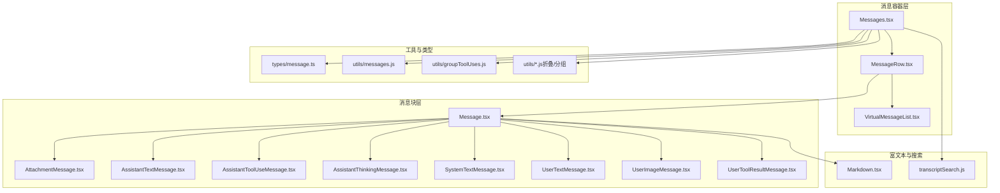
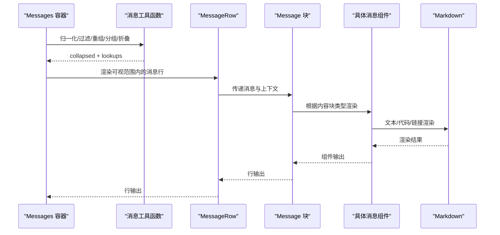
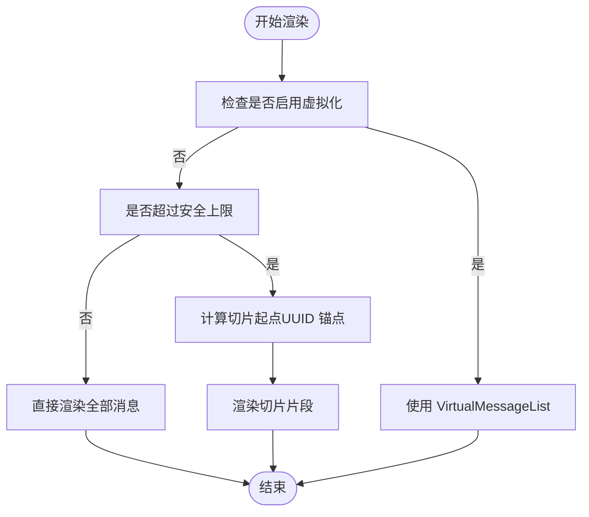
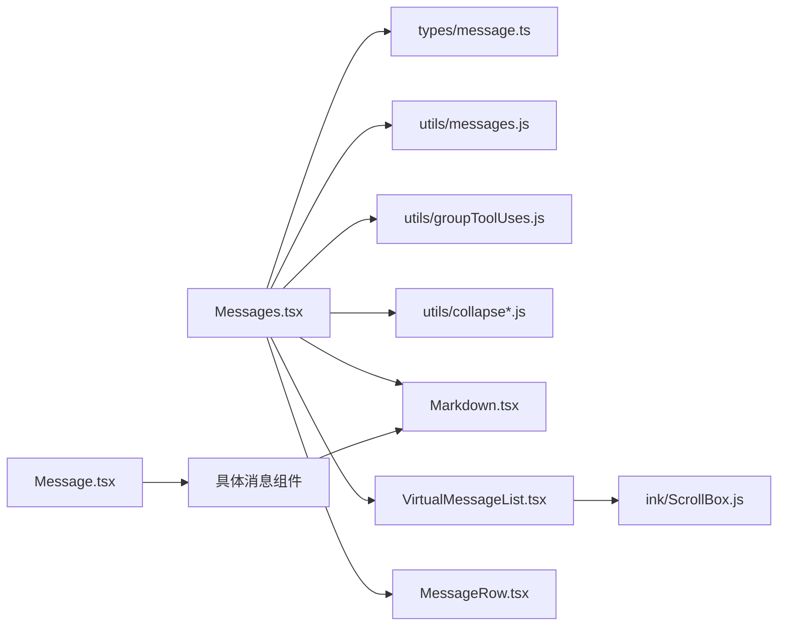

# 消息组件

<cite>
**本文引用的文件**
- [src/components/Messages.tsx](file://src/components/Messages.tsx)
- [src/components/Message.tsx](file://src/components/Message.tsx)
- [src/components/MessageRow.tsx](file://src/components/MessageRow.tsx)
- [src/components/VirtualMessageList.tsx](file://src/components/VirtualMessageList.tsx)
- [src/components/Markdown.tsx](file://src/components/Markdown.tsx)
- [src/types/message.ts](file://src/types/message.ts)
- [src/utils/messages.js](file://src/utils/messages.js)
- [src/utils/groupToolUses.js](file://src/utils/groupToolUses.js)
- [src/utils/collapseBackgroundBashNotifications.js](file://src/utils/collapseBackgroundBashNotifications.js)
- [src/utils/collapseHookSummaries.js](file://src/utils/collapseHookSummaries.js)
- [src/utils/collapseReadSearch.js](file://src/utils/collapseReadSearch.js)
- [src/utils/collapseTeammateShutdowns.js](file://src/utils/collapseTeammateShutdowns.js)
- [src/utils/transcriptSearch.js](file://src/utils/transcriptSearch.js)
- [src/constants/messages.ts](file://src/constants/messages.ts)
- [src/hooks/useVirtualScroll.ts](file://src/hooks/useVirtualScroll.ts)
- [src/ink/components/ScrollBox.js](file://src/ink/components/ScrollBox.js)
- [src/components/messages/AssistantTextMessage.tsx](file://src/components/messages/AssistantTextMessage.tsx)
- [src/components/messages/AssistantToolUseMessage.tsx](file://src/components/messages/AssistantToolUseMessage.tsx)
- [src/components/messages/AssistantThinkingMessage.tsx](file://src/components/messages/AssistantThinkingMessage.tsx)
- [src/components/messages/SystemTextMessage.tsx](file://src/components/messages/SystemTextMessage.tsx)
- [src/components/messages/AttachmentMessage.tsx](file://src/components/messages/AttachmentMessage.tsx)
- [src/components/messages/UserTextMessage.tsx](file://src/components/messages/UserTextMessage.tsx)
- [src/components/messages/UserImageMessage.tsx](file://src/components/messages/UserImageMessage.tsx)
- [src/components/messages/UserToolResultMessage/UserToolResultMessage.tsx](file://src/components/messages/UserToolResultMessage/UserToolResultMessage.tsx)
</cite>

## 目录
1. [简介](#简介)
2. [项目结构](#项目结构)
3. [核心组件](#核心组件)
4. [架构总览](#架构总览)
5. [详细组件分析](#详细组件分析)
6. [依赖关系分析](#依赖关系分析)
7. [性能考量](#性能考量)
8. [故障排查指南](#故障排查指南)
9. [结论](#结论)
10. [附录：扩展与自定义指南](#附录扩展与自定义指南)

## 简介
本文件面向 Claude Code 的消息组件系统，系统性梳理消息类型分类、渲染策略、交互处理、虚拟化滚动、富文本渲染、状态管理与批处理、实时更新等关键主题。文档同时提供扩展新消息类型的实践指南，并对性能优化与常见问题进行说明。

## 项目结构
消息组件体系由“顶层容器”“消息行”“消息块”“虚拟列表”“富文本渲染器”以及“消息工具函数”构成，采用分层解耦与按需渲染策略，确保在长会话与大量消息场景下的可维护性与性能。

图示来源
- [src/components/Messages.tsx:341-721](file://src/components/Messages.tsx#L341-L721)
- [src/components/Message.tsx:58-355](file://src/components/Message.tsx#L58-L355)
- [src/components/MessageRow.tsx](file://src/components/MessageRow.tsx)
- [src/components/VirtualMessageList.tsx](file://src/components/VirtualMessageList.tsx)
- [src/components/Markdown.tsx](file://src/components/Markdown.tsx)
- [src/utils/messages.js](file://src/utils/messages.js)
- [src/utils/groupToolUses.js](file://src/utils/groupToolUses.js)
- [src/utils/collapseBackgroundBashNotifications.js](file://src/utils/collapseBackgroundBashNotifications.js)
- [src/utils/collapseHookSummaries.js](file://src/utils/collapseHookSummaries.js)
- [src/utils/collapseReadSearch.js](file://src/utils/collapseReadSearch.js)
- [src/utils/collapseTeammateShutdowns.js](file://src/utils/collapseTeammateShutdowns.js)
- [src/utils/transcriptSearch.js](file://src/utils/transcriptSearch.js)
- [src/types/message.ts](file://src/types/message.ts)

章节来源
- [src/components/Messages.tsx:341-721](file://src/components/Messages.tsx#L341-L721)
- [src/components/Message.tsx:58-355](file://src/components/Message.tsx#L58-L355)

## 核心组件
- Messages 容器：负责消息归一化、过滤/截断、分组/折叠、查找表构建、虚拟化/非虚拟化渲染路径选择、搜索索引缓存、分隔符插入、流式内容渲染等。
- MessageRow 行：封装消息行上下文（选中态、展开键、列宽等），并作为虚拟列表项的渲染单元。
- Message 块：根据消息类型与内容块类型路由到具体渲染组件，支持思考/工具调用/文本/系统/附件/用户结果等。
- VirtualMessageList 虚拟列表：基于 ScrollBox 提供的滚动句柄，实现可视区域渲染与高度缓存。
- Markdown 富文本：统一处理 Markdown 渲染、代码高亮与链接处理。
- 工具与类型：消息类型定义、消息工具函数（归一化、查找、重组、分组、折叠）、搜索文本提取。

章节来源
- [src/components/Messages.tsx:207-275](file://src/components/Messages.tsx#L207-L275)
- [src/components/Message.tsx:32-57](file://src/components/Message.tsx#L32-L57)
- [src/components/MessageRow.tsx](file://src/components/MessageRow.tsx)
- [src/components/VirtualMessageList.tsx](file://src/components/VirtualMessageList.tsx)
- [src/components/Markdown.tsx](file://src/components/Markdown.tsx)
- [src/types/message.ts](file://src/types/message.ts)
- [src/utils/messages.js](file://src/utils/messages.js)
- [src/utils/groupToolUses.js](file://src/utils/groupToolUses.js)

## 架构总览
消息组件采用“容器-行-块-富文本”的分层架构，结合虚拟化滚动与缓存策略，保证在长会话中的流畅体验。

图示来源
- [src/components/Messages.tsx:481-529](file://src/components/Messages.tsx#L481-L529)
- [src/components/MessageRow.tsx](file://src/components/MessageRow.tsx)
- [src/components/Message.tsx:58-355](file://src/components/Message.tsx#L58-L355)
- [src/components/Markdown.tsx](file://src/components/Markdown.tsx)

## 详细组件分析

### 消息类型与分类
- 用户消息（user）
  - 文本、图片、工具结果等子块
  - 支持计划内容、时间戳、粘贴图片索引等上下文
- 助手消息（assistant）
  - 文本、思考、工具调用、服务器工具调用、顾问结果等子块
  - 支持红acted 思考、顾问模型信息、思考块定位
- 系统消息（system）
  - 包含边界标记、本地命令、紧凑边界等子类型
- 附件消息（attachment）
  - 队列命令、元数据等
- 分组/折叠消息
  - 工具调用分组、读取/搜索折叠、后台 Bash 通知折叠、Hook 汇总折叠、队友关闭折叠

章节来源
- [src/types/message.ts](file://src/types/message.ts)
- [src/components/Message.tsx:82-354](file://src/components/Message.tsx#L82-L354)
- [src/utils/collapseBackgroundBashNotifications.js](file://src/utils/collapseBackgroundBashNotifications.js)
- [src/utils/collapseHookSummaries.js](file://src/utils/collapseHookSummaries.js)
- [src/utils/collapseReadSearch.js](file://src/utils/collapseReadSearch.js)
- [src/utils/collapseTeammateShutdowns.js](file://src/utils/collapseTeammateShutdowns.js)

### 渲染策略与交互
- 路由渲染：Message 根据消息类型与内容块类型选择对应组件，避免不必要重渲染。
- 展开/收起：通过“展开键”（工具调用 ID 或消息 UUID）控制行级展开；仅在点击或悬停时触发。
- 思考块可见性：在转录模式下可隐藏历史思考块，仅保留最新或流式思考块。
- 最新 Bash 输出自动展开：识别最新用户 Bash 输出消息并自动展开。
- 速率限制提示：支持打开速率限制选项的回调。
- 搜索文本提取：优先使用工具实现的精确提取，否则回退到通用字段提取策略，并缓存小写结果以降低输入处理成本。

章节来源
- [src/components/Message.tsx:58-355](file://src/components/Message.tsx#L58-L355)
- [src/components/Messages.tsx:395-441](file://src/components/Messages.tsx#L395-L441)
- [src/utils/transcriptSearch.js](file://src/utils/transcriptSearch.js)

### 虚拟化滚动与性能
- 虚拟化开关：当传入 ScrollBox 句柄且未禁用时启用虚拟化；否则走安全上限的切片渲染路径。
- 切片锚点：使用 UUID 锚点而非计数切片，避免分组/折叠导致的消息长度波动造成滚动跳变。
- 安全上限：非虚拟化路径设置最大消息数量，防止 Fiber/布局/屏幕缓冲膨胀导致 GC 死循环。
- 搜索索引缓存：弱映射缓存搜索文本，降低每按键的分配成本。
- 进度条反馈：终端进度条根据工具执行状态动态更新。
- 帧内渲染优化：LogoHeader 等头部组件记忆化，避免长会话中频繁重建导致的全量重绘。

图示来源
- [src/components/Messages.tsx:461-473](file://src/components/Messages.tsx#L461-L473)
- [src/components/Messages.tsx:314-340](file://src/components/Messages.tsx#L314-L340)
- [src/components/Messages.tsx:531-543](file://src/components/Messages.tsx#L531-L543)

章节来源
- [src/components/Messages.tsx:277-340](file://src/components/Messages.tsx#L277-L340)
- [src/components/Messages.tsx:677-721](file://src/components/Messages.tsx#L677-L721)
- [src/hooks/useVirtualScroll.ts](file://src/hooks/useVirtualScroll.ts)
- [src/ink/components/ScrollBox.js](file://src/ink/components/ScrollBox.js)

### 富文本渲染（Markdown、代码高亮、链接处理）
- Markdown 组件统一处理文本渲染，支持代码块高亮与链接处理。
- 流式文本与思考块：在虚拟化与非虚拟化路径下分别插入流式预览与思考块，保证过渡自然。
- 搜索文本：对工具结果消息优先使用工具提供的精确提取，提升搜索命中质量。

章节来源
- [src/components/Markdown.tsx](file://src/components/Markdown.tsx)
- [src/components/Messages.tsx:703-719](file://src/components/Messages.tsx#L703-L719)
- [src/utils/transcriptSearch.js](file://src/utils/transcriptSearch.js)

### 状态管理、批处理与实时更新
- 批处理：对 streamingToolUses 与 inProgressToolUseIDs 进行预计算集合，降低渲染期比较成本。
- 实时更新：通过 React.memo 自定义比较器，避免回调/数组每次重建导致的重渲染；对 streamingThinking 等高频变化状态单独处理。
- 选中与导航：MessageActionsSelectedContext 提供选中态；VirtualMessageList 支持键盘导航与跳转。
- 速率限制与工具确认队列：在存在确认队列或选择器可见时暂停动画，保证交互一致性。

章节来源
- [src/components/Messages.tsx:741-778](file://src/components/Messages.tsx#L741-L778)
- [src/components/Messages.tsx:595-609](file://src/components/Messages.tsx#L595-L609)
- [src/components/messageActions.tsx](file://src/components/messageActions.tsx)

## 依赖关系分析

图示来源
- [src/components/Messages.tsx:20-45](file://src/components/Messages.tsx#L20-L45)
- [src/components/Message.tsx:17-31](file://src/components/Message.tsx#L17-L31)
- [src/components/VirtualMessageList.tsx](file://src/components/VirtualMessageList.tsx)
- [src/ink/components/ScrollBox.js](file://src/ink/components/ScrollBox.js)

章节来源
- [src/components/Messages.tsx:20-45](file://src/components/Messages.tsx#L20-L45)
- [src/components/Message.tsx:17-31](file://src/components/Message.tsx#L17-L31)

## 性能考量
- 避免全量 Fiber 树：非虚拟化路径设置上限，防止内存与 GC 压力。
- 切片锚点稳定性：使用 UUID 锚点避免分组/折叠导致的滚动跳变。
- 记忆化与缓存：LogoHeader、Message 组件记忆化；搜索文本弱映射缓存；Memo 比较器减少重渲染。
- 虚拟化优先：在可用时优先使用虚拟列表，将内存占用限制在可视窗口范围内。
- 终端进度反馈：根据工具执行状态更新进度条，提升用户感知。

章节来源
- [src/components/Messages.tsx:277-340](file://src/components/Messages.tsx#L277-L340)
- [src/components/Messages.tsx:314-340](file://src/components/Messages.tsx#L314-L340)
- [src/components/Message.tsx:604-625](file://src/components/Message.tsx#L604-L625)

## 故障排查指南
- 思考块显示异常
  - 检查 transcript 模式下的“隐藏历史思考”逻辑与 streamingThinking 状态。
  - 确认 lastThinkingBlockId 的生成与匹配是否正确。
- Bash 输出未自动展开
  - 核对 latestBashOutputUUID 的识别逻辑与消息 UUID 是否一致。
- 搜索结果不准确
  - 确认工具实现了 extractSearchText 并返回非空字符串；否则回退到通用提取策略。
- 虚拟化滚动跳变或卡顿
  - 检查是否启用了虚拟化；若未启用，确认是否超过安全上限；核对切片锚点是否稳定。
- 进度条不更新
  - 检查终端进度配置、远程模式判断与工具执行状态。

章节来源
- [src/components/Messages.tsx:381-419](file://src/components/Messages.tsx#L381-L419)
- [src/components/Messages.tsx:421-441](file://src/components/Messages.tsx#L421-L441)
- [src/utils/transcriptSearch.js](file://src/utils/transcriptSearch.js)
- [src/components/Messages.tsx:599-609](file://src/components/Messages.tsx#L599-L609)

## 结论
该消息组件系统通过清晰的分层架构、完善的虚拟化与缓存策略、灵活的渲染路由与交互控制，在长会话与复杂消息形态下保持了良好的性能与可维护性。建议在新增消息类型时遵循现有路由与缓存模式，确保渲染路径稳定与性能可控。

## 附录：扩展与自定义指南

### 新增消息类型步骤
- 定义类型与内容块
  - 在消息类型定义中补充新类型与内容块字段。
- 添加渲染组件
  - 在消息块层新增对应组件（如 UserNewTypeMessage.tsx），并在 Message 路由中注册。
- 处理富文本与搜索
  - 若涉及文本，复用 Markdown 组件；若需要精确搜索，实现实例方法以返回可索引文本。
- 交互与状态
  - 如需展开/收起，确保使用统一的展开键策略；如需特殊可见性控制，参考思考块的处理方式。
- 性能与缓存
  - 对高频变化的状态使用记忆化与缓存；对渲染路径进行必要的比较器优化。

章节来源
- [src/types/message.ts](file://src/types/message.ts)
- [src/components/Message.tsx:82-354](file://src/components/Message.tsx#L82-L354)
- [src/components/Markdown.tsx](file://src/components/Markdown.tsx)
- [src/utils/transcriptSearch.js](file://src/utils/transcriptSearch.js)