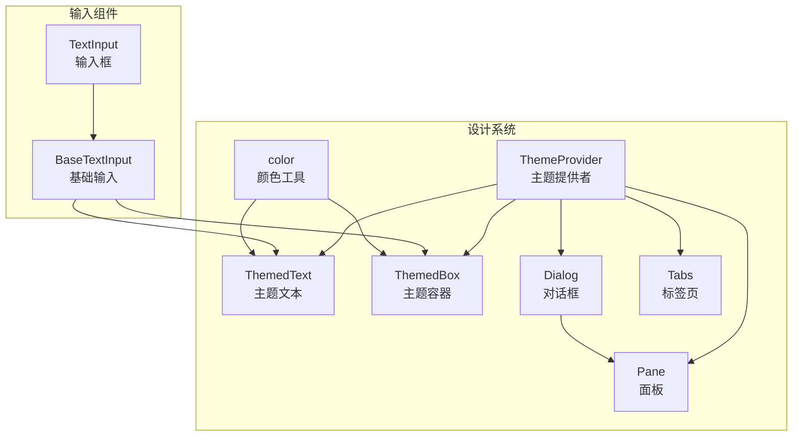
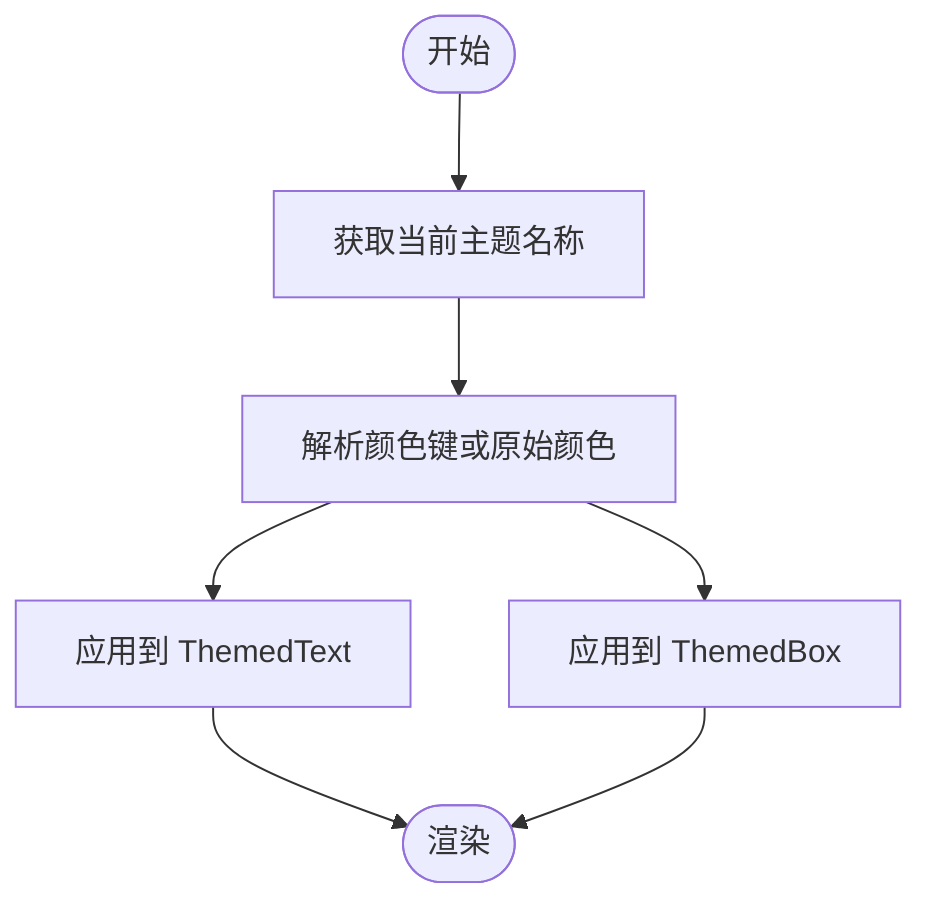
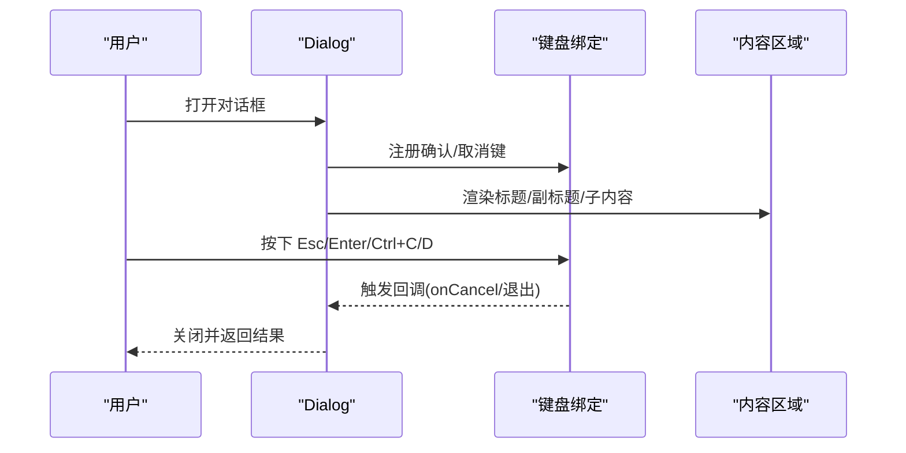
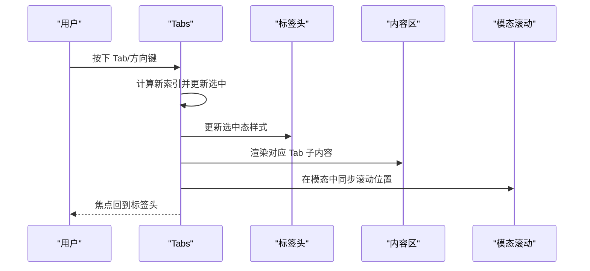
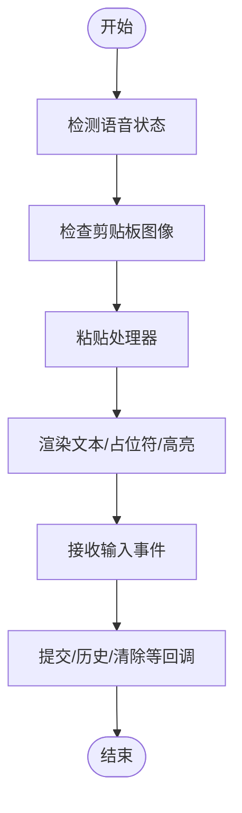
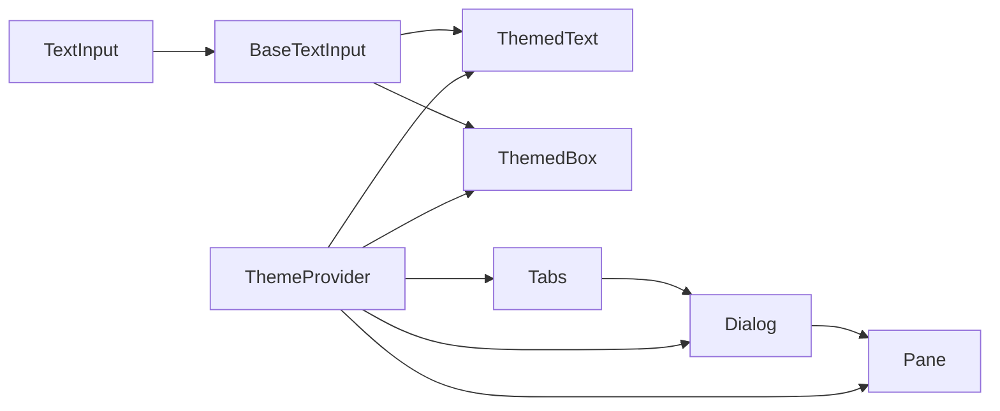

# 组件设计系统

<cite>
**本文档引用的文件**
- [Dialog.tsx](file://src/components/design-system/Dialog.tsx)
- [color.ts](file://src/components/design-system/color.ts)
- [Tabs.tsx](file://src/components/design-system/Tabs.tsx)
- [TextInput.tsx](file://src/components/TextInput.tsx)
- [ThemeProvider.tsx](file://src/components/design-system/ThemeProvider.tsx)
- [ThemedText.tsx](file://src/components/design-system/ThemedText.tsx)
- [ThemedBox.tsx](file://src/components/design-system/ThemedBox.tsx)
- [Pane.tsx](file://src/components/design-system/Pane.tsx)
- [BaseTextInput.tsx](file://src/components/BaseTextInput.tsx)
</cite>

## 目录
1. [简介](#简介)
2. [项目结构](#项目结构)
3. [核心组件](#核心组件)
4. [架构总览](#架构总览)
5. [详细组件分析](#详细组件分析)
6. [依赖分析](#依赖分析)
7. [性能考虑](#性能考虑)
8. [故障排除指南](#故障排除指南)
9. [结论](#结论)
10. [附录](#附录)

## 简介
本文件系统化梳理 Claude Code 的组件设计系统，覆盖设计原则、颜色体系、字体与排版规范、间距与断点策略，并深入解析基础 UI 组件（Dialog、Tabs、TextInput 等）的实现与使用方式。文档同时阐述可访问性设计（键盘导航、屏幕阅读器支持、色彩对比度）、组件组合与复用模式、开发最佳实践（类型验证、错误边界、性能监控），以及组件测试与文档生成的实现要点。

## 项目结构
设计系统位于 `src/components/design-system` 目录，围绕主题提供色板解析、文本与容器组件的统一风格；输入类组件位于 `src/components` 根目录，通过基础输入组件与主题系统协作，形成一致的终端交互体验。



图表来源
- [ThemeProvider.tsx:43-116](file://src/components/design-system/ThemeProvider.tsx#L43-L116)
- [ThemedText.tsx:80-123](file://src/components/design-system/ThemedText.tsx#L80-L123)
- [ThemedBox.tsx:56-154](file://src/components/design-system/ThemedBox.tsx#L56-L154)
- [Dialog.tsx:30-137](file://src/components/design-system/Dialog.tsx#L30-L137)
- [Tabs.tsx:66-242](file://src/components/design-system/Tabs.tsx#L66-L242)
- [Pane.tsx:33-76](file://src/components/design-system/Pane.tsx#L33-L76)
- [TextInput.tsx:37-123](file://src/components/TextInput.tsx#L37-L123)
- [BaseTextInput.tsx:22-135](file://src/components/BaseTextInput.tsx#L22-L135)
- [color.ts:9-30](file://src/components/design-system/color.ts#L9-L30)

章节来源
- [ThemeProvider.tsx:43-116](file://src/components/design-system/ThemeProvider.tsx#L43-L116)
- [ThemedText.tsx:80-123](file://src/components/design-system/ThemedText.tsx#L80-L123)
- [ThemedBox.tsx:56-154](file://src/components/design-system/ThemedBox.tsx#L56-L154)
- [Dialog.tsx:30-137](file://src/components/design-system/Dialog.tsx#L30-L137)
- [Tabs.tsx:66-242](file://src/components/design-system/Tabs.tsx#L66-L242)
- [Pane.tsx:33-76](file://src/components/design-system/Pane.tsx#L33-L76)
- [TextInput.tsx:37-123](file://src/components/TextInput.tsx#L37-L123)
- [BaseTextInput.tsx:22-135](file://src/components/BaseTextInput.tsx#L22-L135)
- [color.ts:9-30](file://src/components/design-system/color.ts#L9-L30)

## 核心组件
- 主题系统：通过 ThemeProvider 提供主题设置、预览与保存能力，支持自动跟随系统主题与手动切换。
- 文本与容器：ThemedText/ThemedBox 将主题键解析为具体颜色值，统一文本与布局风格。
- 对话与面板：Dialog 提供确认/取消与中断键绑定，Pane 提供带分隔线的面板容器。
- 标签页：Tabs 支持键盘导航、内容区固定高度、模态滚动等高级交互。
- 输入：TextInput 基于 BaseTextInput，集成语音状态、剪贴板图像提示、高亮与占位符渲染。

章节来源
- [ThemeProvider.tsx:43-116](file://src/components/design-system/ThemeProvider.tsx#L43-L116)
- [ThemedText.tsx:80-123](file://src/components/design-system/ThemedText.tsx#L80-L123)
- [ThemedBox.tsx:56-154](file://src/components/design-system/ThemedBox.tsx#L56-L154)
- [Dialog.tsx:30-137](file://src/components/design-system/Dialog.tsx#L30-L137)
- [Pane.tsx:33-76](file://src/components/design-system/Pane.tsx#L33-L76)
- [Tabs.tsx:66-242](file://src/components/design-system/Tabs.tsx#L66-L242)
- [TextInput.tsx:37-123](file://src/components/TextInput.tsx#L37-L123)
- [BaseTextInput.tsx:22-135](file://src/components/BaseTextInput.tsx#L22-L135)

## 架构总览
设计系统以“主题驱动”为核心，所有视觉属性（颜色、样式）由主题解析层统一处理，确保跨组件一致性与可维护性。输入组件通过基础输入抽象与主题系统解耦，便于扩展与测试。

```mermaid
sequenceDiagram
participant Provider as "ThemeProvider"
participant Text as "ThemedText"
participant Box as "ThemedBox"
participant Dialog as "Dialog"
participant Tabs as "Tabs"
participant Input as "TextInput/BaseTextInput"
Provider->>Text : 提供当前主题名称
Text->>Text : 解析主题键为颜色
Provider->>Box : 提供当前主题名称
Box->>Box : 解析边框/背景颜色
Dialog->>Provider : 读取主题色用于分隔线
Tabs->>Provider : 读取主题色用于选中态
Input->>Provider : 读取主题色用于文本
Input->>Input : 渲染高亮/占位符/粘贴处理
```

图表来源
- [ThemeProvider.tsx:82-114](file://src/components/design-system/ThemeProvider.tsx#L82-L114)
- [ThemedText.tsx:100-123](file://src/components/design-system/ThemedText.tsx#L100-L123)
- [ThemedBox.tsx:100-154](file://src/components/design-system/ThemedBox.tsx#L100-L154)
- [Dialog.tsx:50-76](file://src/components/design-system/Dialog.tsx#L50-L76)
- [Tabs.tsx:234-242](file://src/components/design-system/Tabs.tsx#L234-L242)
- [TextInput.tsx:92-123](file://src/components/TextInput.tsx#L92-L123)
- [BaseTextInput.tsx:32-135](file://src/components/BaseTextInput.tsx#L32-L135)

## 详细组件分析

### 设计系统核心：主题与颜色
- 主题解析：ThemeProvider 负责主题设置、预览与保存，支持自动跟随系统主题并在外部构建时按需引入监听器。
- 颜色工具：color 函数将主题键或原始颜色解析为 Ink 渲染可用的颜色字符串，支持前景/背景类型。
- 文本与容器：ThemedText/ThemedBox 将主题键转换为具体颜色，兼容 Ink 的样式级联，提供统一的文本与布局风格。



图表来源
- [ThemeProvider.tsx:82-114](file://src/components/design-system/ThemeProvider.tsx#L82-L114)
- [color.ts:9-30](file://src/components/design-system/color.ts#L9-L30)
- [ThemedText.tsx:66-105](file://src/components/design-system/ThemedText.tsx#L66-L105)
- [ThemedBox.tsx:42-136](file://src/components/design-system/ThemedBox.tsx#L42-L136)

章节来源
- [ThemeProvider.tsx:43-116](file://src/components/design-system/ThemeProvider.tsx#L43-L116)
- [color.ts:9-30](file://src/components/design-system/color.ts#L9-L30)
- [ThemedText.tsx:80-123](file://src/components/design-system/ThemedText.tsx#L80-L123)
- [ThemedBox.tsx:56-154](file://src/components/design-system/ThemedBox.tsx#L56-L154)

### 对话框组件：Dialog
- 功能特性：标题/副标题、输入引导、可配置的确认/取消与中断键绑定、可隐藏边框、可自定义输入提示。
- 键盘交互：通过 useExitOnCtrlCDWithKeybindings 与 useKeybinding 注册 Esc/Enter/Ctrl+C/D 等键，支持在嵌入文本输入时让渡焦点。
- 内容组织：标题与子节点组合，底部显示输入提示（默认或自定义），可包裹 Pane 以获得统一边框。



图表来源
- [Dialog.tsx:45-76](file://src/components/design-system/Dialog.tsx#L45-L76)
- [Dialog.tsx:104-113](file://src/components/design-system/Dialog.tsx#L104-L113)
- [Dialog.tsx:124-137](file://src/components/design-system/Dialog.tsx#L124-L137)

章节来源
- [Dialog.tsx:30-137](file://src/components/design-system/Dialog.tsx#L30-L137)

### 标签页组件：Tabs
- 导航与焦点：支持左右键切换标签，内容区可固定高度避免布局抖动，支持从内容区通过 Tab 切换回标签头。
- 上下文与注册：通过 TabsContext 向子 Tab 传递当前选中项与宽度，提供 useTabHeaderFocus 以在子组件中声明性地接管焦点。
- 模态与滚动：在模态场景下使用 ScrollBox 保证滚动行为与键盘事件正确传递。



图表来源
- [Tabs.tsx:125-134](file://src/components/design-system/Tabs.tsx#L125-L134)
- [Tabs.tsx:170-191](file://src/components/design-system/Tabs.tsx#L170-L191)
- [Tabs.tsx:234-242](file://src/components/design-system/Tabs.tsx#L234-L242)

章节来源
- [Tabs.tsx:66-242](file://src/components/design-system/Tabs.tsx#L66-L242)

### 输入组件：TextInput 与 BaseTextInput
- TextInput：封装了语音录制状态、剪贴板图像提示、光标反转（波形/反色）、主题文本颜色、高亮过滤与视口裁剪等能力，基于 BaseTextInput 实现。
- BaseTextInput：负责渲染、输入处理、粘贴与图片粘贴、占位符渲染、参数提示、高亮与视口偏移计算等基础逻辑。



图表来源
- [TextInput.tsx:44-119](file://src/components/TextInput.tsx#L44-L119)
- [BaseTextInput.tsx:57-102](file://src/components/BaseTextInput.tsx#L57-L102)
- [BaseTextInput.tsx:104-135](file://src/components/BaseTextInput.tsx#L104-L135)

章节来源
- [TextInput.tsx:37-123](file://src/components/TextInput.tsx#L37-L123)
- [BaseTextInput.tsx:22-135](file://src/components/BaseTextInput.tsx#L22-L135)

### 面板与分隔：Pane 与 Divider
- Pane：在非模态场景下顶部绘制分隔线，提供横向内边距与顶部间距；在模态场景下直接渲染内容，避免重复边框。
- Divider：根据主题色绘制顶部分隔线，作为 Pane 的基础构件。

章节来源
- [Pane.tsx:33-76](file://src/components/design-system/Pane.tsx#L33-L76)

## 依赖分析
- 组件间耦合：Dialog 依赖 Pane 与键盘绑定；Tabs 依赖键盘绑定与上下文；TextInput/ BaseTextInput 依赖 Ink 输入与主题系统。
- 外部依赖：颜色解析依赖 Ink 的 colorize；主题解析依赖全局配置与系统主题监听（按功能开关引入）。



图表来源
- [ThemeProvider.tsx:82-114](file://src/components/design-system/ThemeProvider.tsx#L82-L114)
- [ThemedText.tsx:100-123](file://src/components/design-system/ThemedText.tsx#L100-L123)
- [ThemedBox.tsx:100-154](file://src/components/design-system/ThemedBox.tsx#L100-L154)
- [Dialog.tsx:50-76](file://src/components/design-system/Dialog.tsx#L50-L76)
- [Tabs.tsx:234-242](file://src/components/design-system/Tabs.tsx#L234-L242)
- [Pane.tsx:50-76](file://src/components/design-system/Pane.tsx#L50-L76)
- [TextInput.tsx:92-123](file://src/components/TextInput.tsx#L92-L123)
- [BaseTextInput.tsx:32-135](file://src/components/BaseTextInput.tsx#L32-L135)

章节来源
- [ThemeProvider.tsx:43-116](file://src/components/design-system/ThemeProvider.tsx#L43-L116)
- [Dialog.tsx:30-137](file://src/components/design-system/Dialog.tsx#L30-L137)
- [Tabs.tsx:66-242](file://src/components/design-system/Tabs.tsx#L66-L242)
- [TextInput.tsx:37-123](file://src/components/TextInput.tsx#L37-L123)
- [BaseTextInput.tsx:22-135](file://src/components/BaseTextInput.tsx#L22-L135)

## 性能考虑
- 渲染优化：组件广泛使用 React 编译器缓存（$ 符号），对 props 变更进行浅比较，减少不必要的重渲染。
- 输入性能：TextInput 在语音录制且允许动画时启用帧循环，其他场景禁用以降低开销；BaseTextInput 使用视口偏移裁剪高亮，避免全量重绘。
- 主题切换：ThemeProvider 在自动模式下按需引入系统主题监听，外部构建时通过特征开关消除死代码，避免运行时开销。

章节来源
- [TextInput.tsx:52-55](file://src/components/TextInput.tsx#L52-L55)
- [BaseTextInput.tsx:98-102](file://src/components/BaseTextInput.tsx#L98-L102)
- [ThemeProvider.tsx:64-80](file://src/components/design-system/ThemeProvider.tsx#L64-L80)

## 故障排除指南
- 键盘无响应：检查 Tabs 的键盘绑定上下文是否激活（headerFocused、禁用导航、模态状态）；确认 Dialog 的 isCancelActive 是否被上层组件关闭。
- 主题不生效：确认 ThemeProvider 已包裹根组件，useTheme 返回的主题名称与预期一致；检查 color 解析函数是否传入正确的主题键。
- 输入卡顿：语音模式下开启动画会带来额外开销，可通过设置偏好禁用动画；检查高亮数量与视口偏移计算是否过大。
- 模态滚动异常：确保在模态中使用 Tabs 的 ScrollBox 并正确传递 ref 与选中索引。

章节来源
- [Tabs.tsx:135-191](file://src/components/design-system/Tabs.tsx#L135-L191)
- [Dialog.tsx:45-76](file://src/components/design-system/Dialog.tsx#L45-L76)
- [ThemeProvider.tsx:82-114](file://src/components/design-system/ThemeProvider.tsx#L82-L114)
- [TextInput.tsx:44-119](file://src/components/TextInput.tsx#L44-L119)
- [BaseTextInput.tsx:98-135](file://src/components/BaseTextInput.tsx#L98-L135)

## 结论
该设计系统以主题为中心，通过统一的颜色解析与文本/容器组件，确保终端 UI 的一致性与可维护性。对话框、标签页与输入组件在可访问性与交互细节上做了充分考虑，配合渲染优化与按需加载机制，在复杂场景下仍能保持良好性能。建议在扩展新组件时遵循主题优先、最小依赖、明确上下文的原则，并配套完善测试与文档。

## 附录
- 可访问性清单
  - 键盘导航：确保所有交互可通过 Tab/Shift+Tab、方向键、Enter、Esc 完成。
  - 屏幕阅读器：为关键元素提供语义化标签与描述，避免仅依赖颜色传达信息。
  - 色彩对比度：使用主题中的 inactive/inverse 等语义色，确保在不同主题下均满足对比度要求。
- 组件开发最佳实践
  - 类型验证：严格使用 TypeScript 接口与只读属性，避免运行时类型错误。
  - 错误边界：在顶层包裹错误边界组件，捕获并记录渲染错误。
  - 性能监控：对高频渲染组件进行性能打点，识别长任务与重渲染热点。
- 测试与文档
  - 单元测试：针对主题解析、键盘绑定、粘贴处理等关键路径编写单元测试。
  - 文档生成：为每个组件导出类型定义与示例，结合 Storybook 或文档站点自动生成 API 文档。