# Ink 渲染引擎

<cite>
**本文档引用的文件**
- [ink.tsx](file://src/ink/ink.tsx)
- [renderer.ts](file://src/ink/renderer.ts)
- [reconciler.ts](file://src/ink/reconciler.ts)
- [dom.ts](file://src/ink/dom.ts)
- [render-node-to-output.ts](file://src/ink/render-node-to-output.ts)
- [output.ts](file://src/ink/output.ts)
- [screen.ts](file://src/ink/screen.ts)
- [root.ts](file://src/ink/root.ts)
- [styles.ts](file://src/ink/styles.ts)
- [engine.ts](file://src/ink/layout/engine.ts)
</cite>

## 目录
1. [简介](#简介)
2. [项目结构](#项目结构)
3. [核心组件](#核心组件)
4. [架构总览](#架构总览)
5. [详细组件分析](#详细组件分析)
6. [依赖关系分析](#依赖关系分析)
7. [性能考虑](#性能考虑)
8. [故障排除指南](#故障排除指南)
9. [结论](#结论)

## 简介

Ink 渲染引擎是一个基于 React 的终端 UI 渲染系统，它将 React 组件树转换为 ANSI 终端输出。该引擎实现了完整的虚拟 DOM、渲染协调器（reconciler）和屏幕输出处理流程，支持复杂的布局计算、样式应用和字符渲染。

该系统的核心目标是提供高性能、低开销的终端界面渲染，通过以下关键技术实现：
- 虚拟 DOM 实现和 React 集成
- 基于 Yoga 的布局引擎
- 屏幕缓冲区管理和增量更新
- ANSI 终端输出优化
- 文本选择和搜索高亮功能

## 项目结构

Ink 渲染引擎采用模块化设计，主要分为以下几个核心模块：

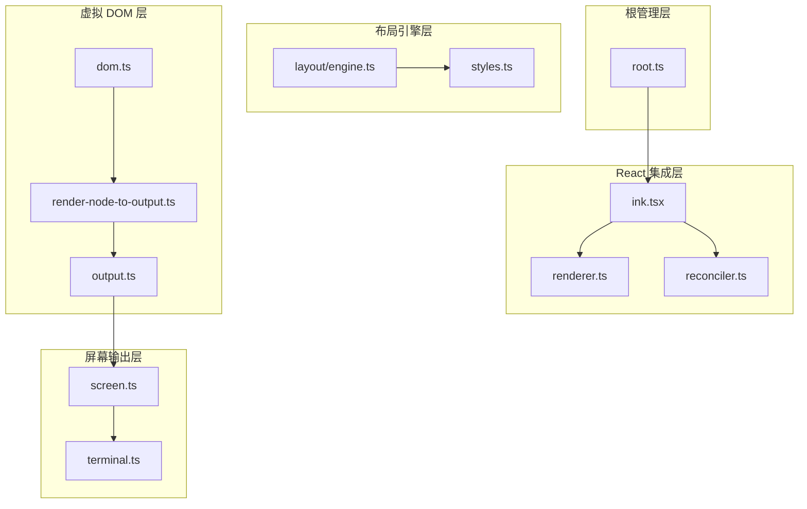

**图表来源**
- [ink.tsx:1-800](file://src/ink/ink.tsx#L1-L800)
- [renderer.ts:1-180](file://src/ink/renderer.ts#L1-L180)
- [dom.ts:1-486](file://src/ink/dom.ts#L1-L486)

**章节来源**
- [ink.tsx:1-800](file://src/ink/ink.tsx#L1-L800)
- [root.ts:1-186](file://src/ink/root.ts#L1-L186)

## 核心组件

### Ink 主类

Ink 是渲染引擎的核心控制器，负责协调整个渲染流程：

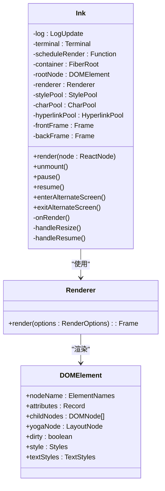

**图表来源**
- [ink.tsx:76-800](file://src/ink/ink.tsx#L76-L800)
- [renderer.ts:29-178](file://src/ink/renderer.ts#L29-L178)
- [dom.ts:31-91](file://src/ink/dom.ts#L31-L91)

### 虚拟 DOM 实现

Ink 实现了一个轻量级的虚拟 DOM 系统，支持 React 组件树的渲染：

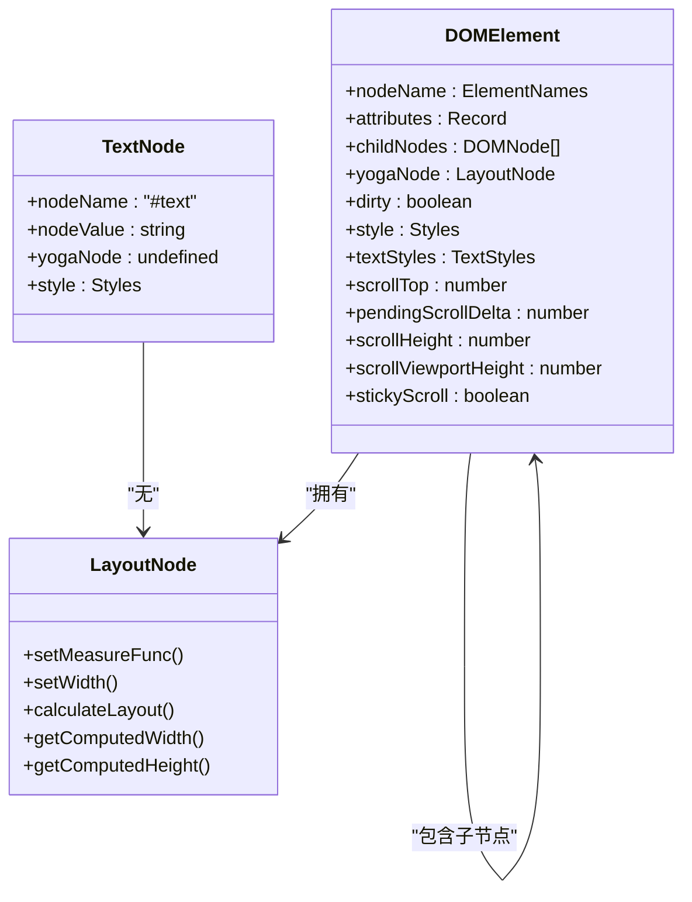

**图表来源**
- [dom.ts:31-91](file://src/ink/dom.ts#L31-L91)
- [dom.ts:93-96](file://src/ink/dom.ts#L93-L96)

**章节来源**
- [dom.ts:1-486](file://src/ink/dom.ts#L1-L486)

## 架构总览

Ink 渲染引擎采用分层架构设计，从上到下分为多个抽象层次：

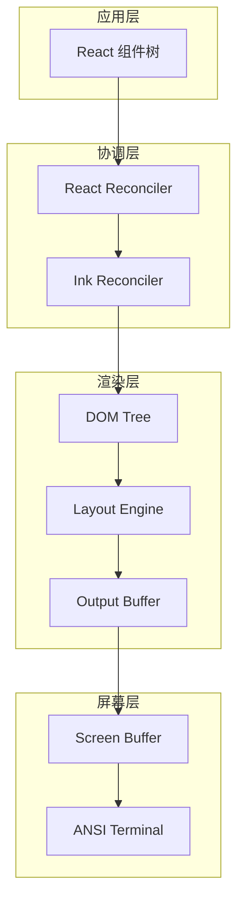

**图表来源**
- [ink.tsx:260-279](file://src/ink/ink.tsx#L260-L279)
- [reconciler.ts:224-514](file://src/ink/reconciler.ts#L224-L514)
- [renderer.ts:31-178](file://src/ink/renderer.ts#L31-L178)

### 渲染管线阶段

Ink 渲染引擎的完整渲染流程包含以下关键阶段：

1. **组件树遍历**：React 组件树转换为 DOM 树
2. **布局计算**：Yoga 布局引擎计算元素位置和尺寸
3. **差异计算**：比较当前帧与前一帧的差异
4. **DOM 更新**：应用差异到屏幕缓冲区
5. **终端输出**：将缓冲区内容输出到终端

**章节来源**
- [ink.tsx:420-789](file://src/ink/ink.tsx#L420-L789)
- [renderer.ts:38-177](file://src/ink/renderer.ts#L38-L177)

## 详细组件分析

### 渲染协调器 (Reconciler)

Ink 的渲染协调器基于 React Reconciler 构建，实现了自定义的主机配置：

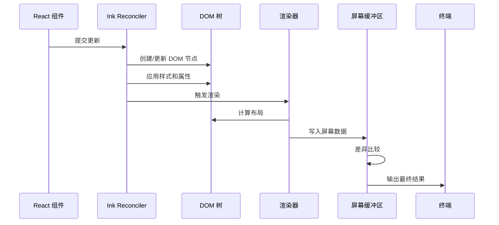

**图表来源**
- [reconciler.ts:247-315](file://src/ink/reconciler.ts#L247-L315)
- [dom.ts:110-132](file://src/ink/dom.ts#L110-L132)

协调器的关键特性包括：

1. **自定义主机配置**：实现 React Reconciler 的主机接口
2. **样式应用**：将 CSS 样式转换为终端可识别的格式
3. **事件处理**：支持键盘和鼠标事件
4. **生命周期管理**：处理组件的挂载、更新和卸载

**章节来源**
- [reconciler.ts:1-514](file://src/ink/reconciler.ts#L1-L514)

### 虚拟 DOM 实现

Ink 的虚拟 DOM 实现提供了完整的 DOM 操作能力：

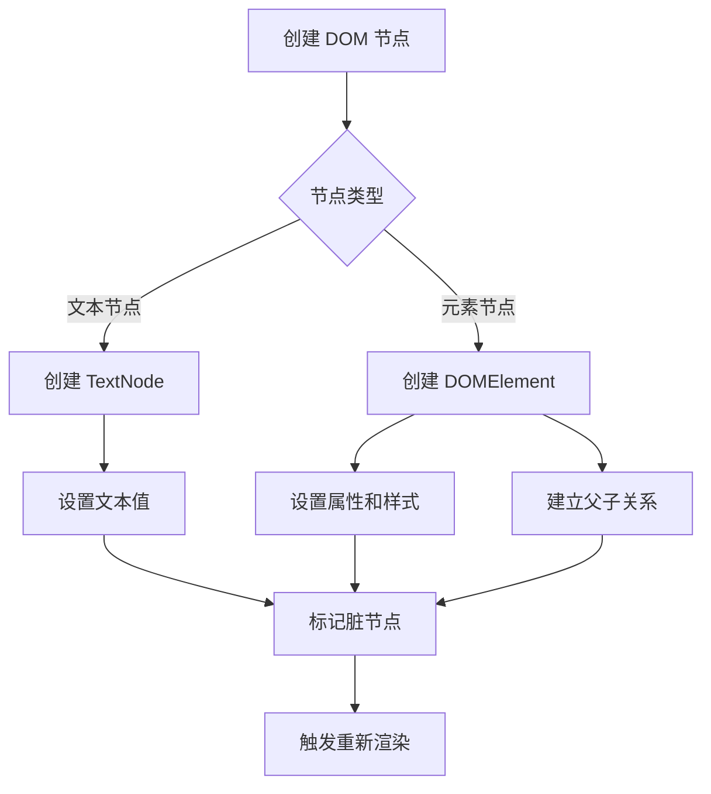

**图表来源**
- [dom.ts:110-132](file://src/ink/dom.ts#L110-L132)
- [dom.ts:134-202](file://src/ink/dom.ts#L134-L202)

**章节来源**
- [dom.ts:1-486](file://src/ink/dom.ts#L1-L486)

### 屏幕缓冲区管理

Ink 使用高效的屏幕缓冲区管理系统来优化渲染性能：

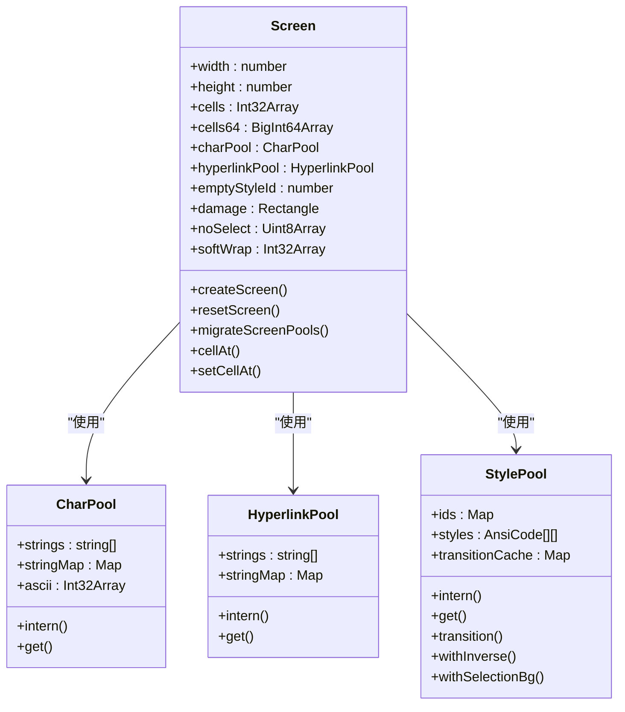

**图表来源**
- [screen.ts:451-544](file://src/ink/screen.ts#L451-L544)
- [screen.ts:21-75](file://src/ink/screen.ts#L21-L75)
- [screen.ts:112-260](file://src/ink/screen.ts#L112-L260)

**章节来源**
- [screen.ts:1-800](file://src/ink/screen.ts#L1-L800)

### 输出缓冲区 (Output Buffer)

输出缓冲区是渲染过程中的中间层，负责收集和处理渲染操作：

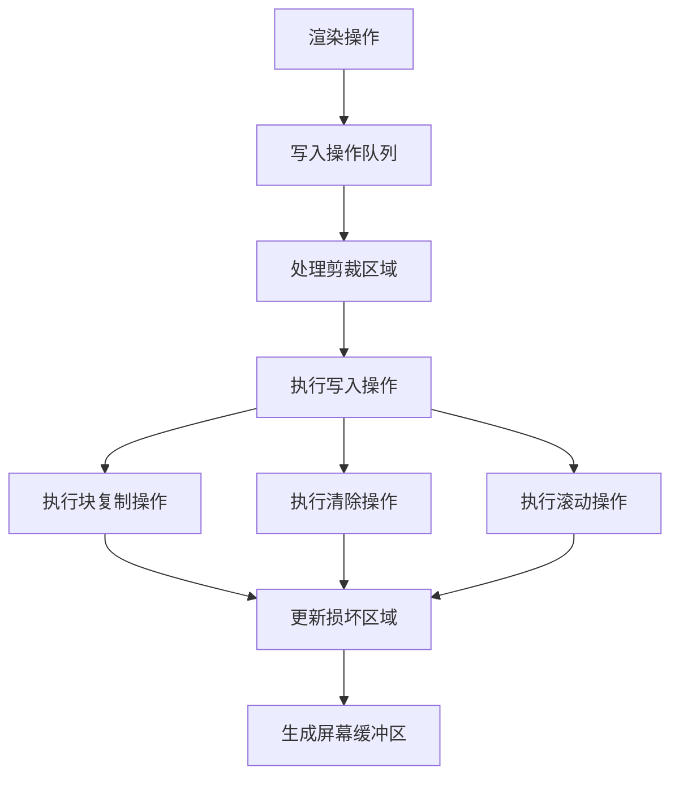

**图表来源**
- [output.ts:268-531](file://src/ink/output.ts#L268-L531)
- [output.ts:397-506](file://src/ink/output.ts#L397-L506)

**章节来源**
- [output.ts:1-799](file://src/ink/output.ts#L1-L799)

### 根管理器 (Root Manager)

Ink 提供了灵活的根管理器，支持多种渲染模式：

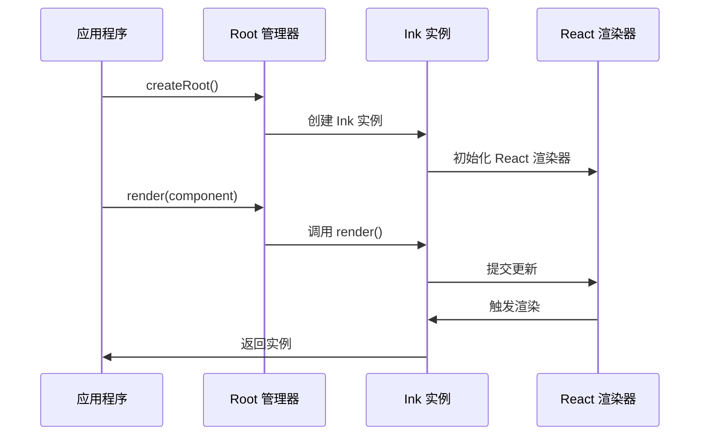

**图表来源**
- [root.ts:129-157](file://src/ink/root.ts#L129-L157)
- [root.ts:172-186](file://src/ink/root.ts#L172-L186)

**章节来源**
- [root.ts:1-186](file://src/ink/root.ts#L1-L186)

## 依赖关系分析

Ink 渲染引擎的依赖关系呈现清晰的分层结构：

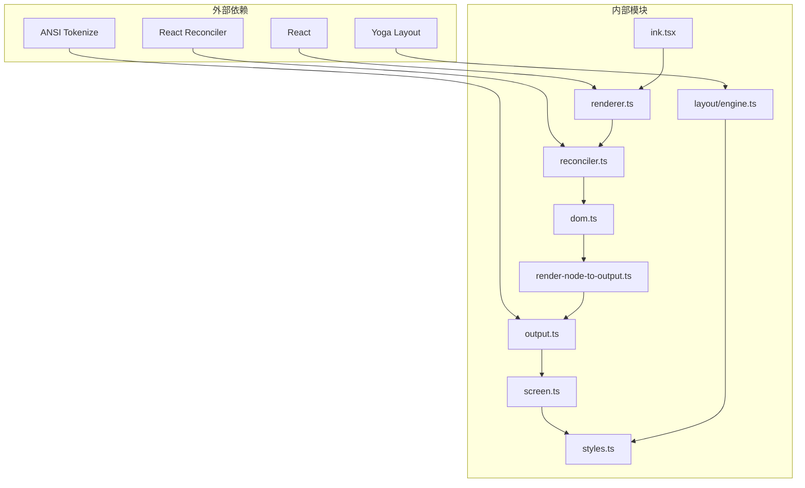

**图表来源**
- [ink.tsx:1-50](file://src/ink/ink.tsx#L1-L50)
- [renderer.ts:1-14](file://src/ink/renderer.ts#L1-L14)
- [reconciler.ts:1-28](file://src/ink/reconciler.ts#L1-L28)

### 关键依赖特性

1. **React 集成**：完全兼容 React 生态系统
2. **Yoga 布局**：提供高性能的布局计算
3. **ANSI 处理**：支持丰富的终端样式和效果
4. **内存池管理**：优化内存使用和垃圾回收

**章节来源**
- [ink.tsx:1-100](file://src/ink/ink.tsx#L1-L100)
- [dom.ts:1-11](file://src/ink/dom.ts#L1-L11)

## 性能考虑

Ink 渲染引擎在多个层面实现了性能优化：

### 内存优化策略

1. **对象池模式**：使用字符池、超链接池和样式池减少内存分配
2. **TypedArray 使用**：直接操作二进制数组避免对象创建
3. **增量更新**：只更新发生变化的部分
4. **双缓冲机制**：前后缓冲区交换避免全屏重绘

### 渲染优化技术

1. **布局缓存**：Yoga 布局结果缓存
2. **损坏区域跟踪**：精确跟踪需要更新的屏幕区域
3. **块复制优化**：大量使用块复制替代逐像素写入
4. **样式合并**：将连续的相同样式合并为单个操作

### 性能监控

Ink 提供了详细的性能指标收集：

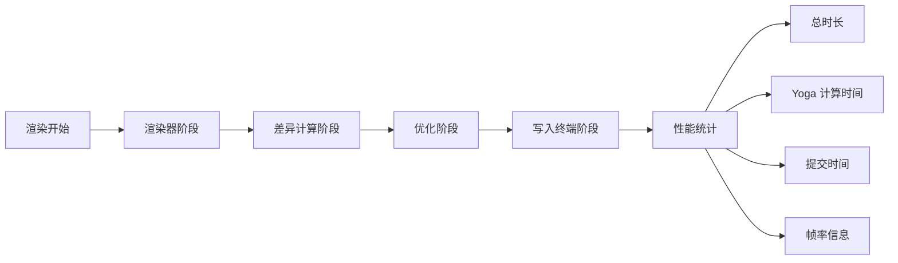

**图表来源**
- [ink.tsx:772-788](file://src/ink/ink.tsx#L772-L788)
- [reconciler.ts:200-222](file://src/ink/reconciler.ts#L200-L222)

**章节来源**
- [ink.tsx:604-789](file://src/ink/ink.tsx#L604-L789)
- [reconciler.ts:190-222](file://src/ink/reconciler.ts#L190-L222)

## 故障排除指南

### 常见问题诊断

1. **渲染闪烁问题**
   - 检查 `prevFrameContaminated` 标志
   - 验证全屏损坏区域设置
   - 确认帧间缓冲区状态

2. **布局异常**
   - 检查 Yoga 布局计算结果
   - 验证样式属性应用
   - 确认尺寸约束条件

3. **性能问题**
   - 分析各阶段耗时统计
   - 检查内存池使用情况
   - 监控损坏区域大小

### 调试工具

Ink 提供了多种调试辅助功能：

1. **调试重绘**：启用 `CLAUDE_CODE_DEBUG_REPAINTS` 环境变量
2. **提交日志**：记录 React 提交和渲染性能
3. **性能计数器**：实时监控渲染性能指标

**章节来源**
- [reconciler.ts:179-185](file://src/ink/reconciler.ts#L179-L185)
- [ink.tsx:612-618](file://src/ink/ink.tsx#L612-L618)

## 结论

Ink 渲染引擎是一个高度优化的终端 UI 渲染系统，通过以下关键特性实现了卓越的性能和用户体验：

1. **完整的 React 集成**：无缝支持 React 组件生态系统
2. **高性能渲染**：通过多层优化实现流畅的终端界面
3. **灵活的布局系统**：基于 Yoga 的强大布局引擎
4. **丰富的终端特性**：支持样式、超链接、文本选择等高级功能
5. **完善的工具链**：提供调试、监控和性能分析工具

该引擎的设计充分考虑了终端环境的特殊性，在保证功能完整性的同时最大化渲染效率，为开发者提供了构建复杂终端应用的强大基础。