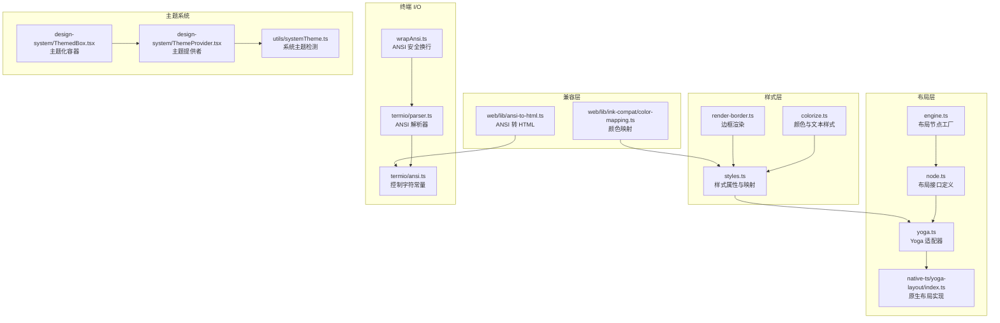
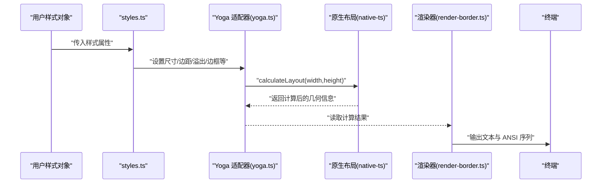
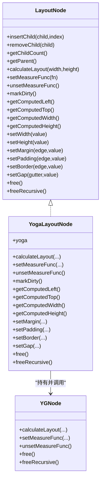
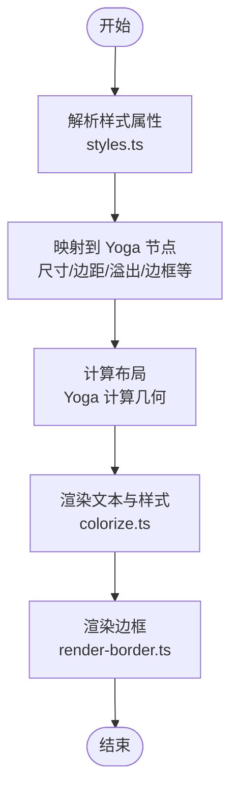
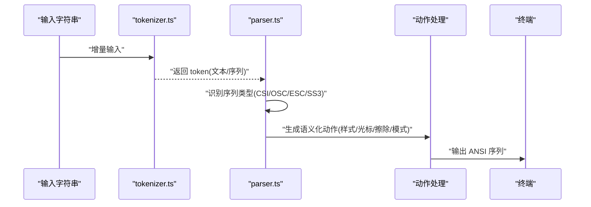
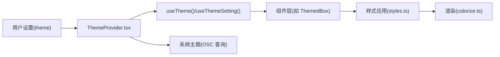
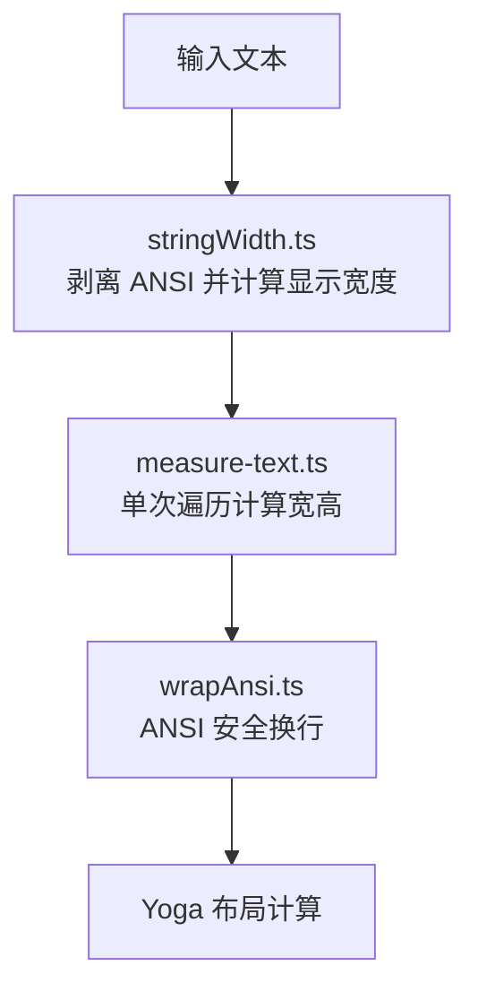
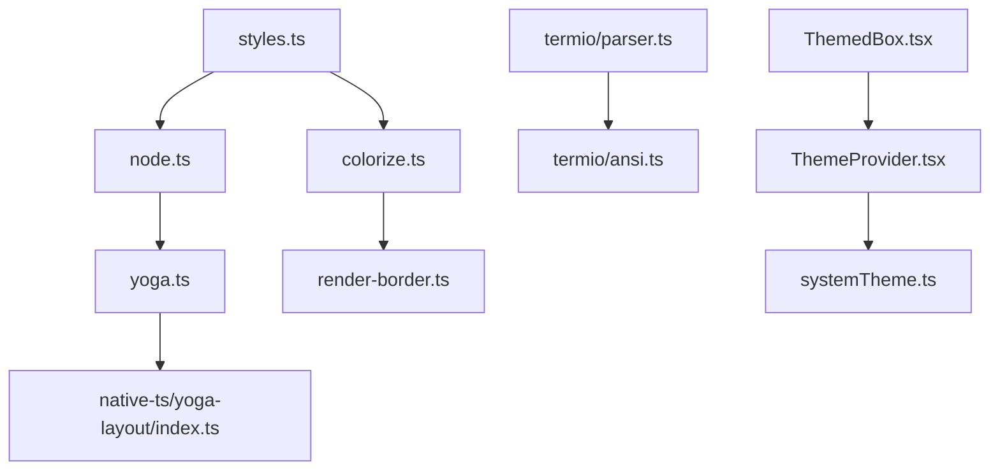

# 布局与样式系统

<cite>
**本文档引用的文件**
- [src/ink/layout/engine.ts](file://src/ink/layout/engine.ts)
- [src/ink/layout/node.ts](file://src/ink/layout/node.ts)
- [src/ink/layout/yoga.ts](file://src/ink/layout/yoga.ts)
- [src/native-ts/yoga-layout/index.ts](file://src/native-ts/yoga-layout/index.ts)
- [src/ink/styles.ts](file://src/ink/styles.ts)
- [src/ink/colorize.ts](file://src/ink/colorize.ts)
- [src/ink/termio/ansi.ts](file://src/ink/termio/ansi.ts)
- [src/ink/termio/parser.ts](file://src/ink/termio/parser.ts)
- [src/ink/render-border.ts](file://src/ink/render-border.ts)
- [src/ink/wrapAnsi.ts](file://src/ink/wrapAnsi.ts)
- [src/ink/optimizer.ts](file://src/ink/optimizer.ts)
- [src/ink/measure-text.ts](file://src/ink/measure-text.ts)
- [src/ink/stringWidth.ts](file://src/ink/stringWidth.ts)
- [src/components/design-system/ThemeProvider.tsx](file://src/components/design-system/ThemeProvider.tsx)
- [src/components/design-system/ThemedBox.tsx](file://src/components/design-system/ThemedBox.tsx)
- [src/utils/systemTheme.ts](file://src/utils/systemTheme.ts)
- [web/lib/ink-compat/color-mapping.ts](file://web/lib/ink-compat/color-mapping.ts)
- [web/lib/ansi-to-html.ts](file://web/lib/ansi-to-html.ts)
</cite>

## 目录
1. [简介](#简介)
2. [项目结构](#项目结构)
3. [核心组件](#核心组件)
4. [架构总览](#架构总览)
5. [详细组件分析](#详细组件分析)
6. [依赖关系分析](#依赖关系分析)
7. [性能考量](#性能考量)
8. [故障排查指南](#故障排查指南)
9. [结论](#结论)
10. [附录](#附录)

## 简介
本文件系统性梳理 Ink 终端布局与样式系统，覆盖以下要点：
- 布局引擎：基于 Yoga 的布局算法、几何计算与尺寸测量机制
- 样式系统：CSS 属性映射、颜色处理与终端兼容性
- ANSI 解析：转义序列解析与应用（颜色、字体样式、光标控制）
- 设计系统：主题管理、颜色规范与响应式设计原则
- 自定义指南：主题开发与样式继承规则
- 调试与优化：布局调试工具与性能优化策略

## 项目结构
Ink 的布局与样式系统主要分布在以下模块：
- 布局层：engine.ts、node.ts、yoga.ts 及原生 Yoga 实现
- 样式层：styles.ts、colorize.ts、render-border.ts
- 终端 I/O 与 ANSI：termio/*、ansi.ts、parser.ts、wrapAnsi.ts
- 主题系统：design-system/*、utils/systemTheme.ts
- 兼容层：web/lib/ink-compat/*、web/lib/ansi-to-html.ts

**图表来源**
- [src/ink/layout/engine.ts:1-6](file://src/ink/layout/engine.ts#L1-L6)
- [src/ink/layout/node.ts:1-154](file://src/ink/layout/node.ts#L1-L154)
- [src/ink/layout/yoga.ts:71-308](file://src/ink/layout/yoga.ts#L71-L308)
- [src/native-ts/yoga-layout/index.ts:925-966](file://src/native-ts/yoga-layout/index.ts#L925-L966)
- [src/ink/styles.ts:1-773](file://src/ink/styles.ts#L1-L773)
- [src/ink/colorize.ts:1-233](file://src/ink/colorize.ts#L1-L233)
- [src/ink/render-border.ts:1-233](file://src/ink/render-border.ts#L1-L233)
- [src/ink/termio/ansi.ts:1-77](file://src/ink/termio/ansi.ts#L1-L77)
- [src/ink/termio/parser.ts:1-396](file://src/ink/termio/parser.ts#L1-L396)
- [src/ink/wrapAnsi.ts:1-22](file://src/ink/wrapAnsi.ts#L1-L22)
- [src/components/design-system/ThemeProvider.tsx:1-171](file://src/components/design-system/ThemeProvider.tsx#L1-L171)
- [src/components/design-system/ThemedBox.tsx:52-106](file://src/components/design-system/ThemedBox.tsx#L52-L106)
- [src/utils/systemTheme.ts:39-68](file://src/utils/systemTheme.ts#L39-L68)
- [web/lib/ink-compat/color-mapping.ts:1-50](file://web/lib/ink-compat/color-mapping.ts#L1-L50)
- [web/lib/ansi-to-html.ts:93-120](file://web/lib/ansi-to-html.ts#L93-L120)

**章节来源**
- [src/ink/layout/engine.ts:1-6](file://src/ink/layout/engine.ts#L1-L6)
- [src/ink/layout/node.ts:1-154](file://src/ink/layout/node.ts#L1-L154)
- [src/ink/layout/yoga.ts:71-308](file://src/ink/layout/yoga.ts#L71-L308)
- [src/native-ts/yoga-layout/index.ts:925-966](file://src/native-ts/yoga-layout/index.ts#L925-L966)
- [src/ink/styles.ts:1-773](file://src/ink/styles.ts#L1-L773)
- [src/ink/colorize.ts:1-233](file://src/ink/colorize.ts#L1-L233)
- [src/ink/render-border.ts:1-233](file://src/ink/render-border.ts#L1-L233)
- [src/ink/termio/ansi.ts:1-77](file://src/ink/termio/ansi.ts#L1-L77)
- [src/ink/termio/parser.ts:1-396](file://src/ink/termio/parser.ts#L1-L396)
- [src/ink/wrapAnsi.ts:1-22](file://src/ink/wrapAnsi.ts#L1-L22)
- [src/components/design-system/ThemeProvider.tsx:1-171](file://src/components/design-system/ThemeProvider.tsx#L1-L171)
- [src/components/design-system/ThemedBox.tsx:52-106](file://src/components/design-system/ThemedBox.tsx#L52-L106)
- [src/utils/systemTheme.ts:39-68](file://src/utils/systemTheme.ts#L39-L68)
- [web/lib/ink-compat/color-mapping.ts:1-50](file://web/lib/ink-compat/color-mapping.ts#L1-L50)
- [web/lib/ansi-to-html.ts:93-120](file://web/lib/ansi-to-html.ts#L93-L120)

## 核心组件
- 布局引擎
  - engine.ts 提供布局节点工厂，委托给 Yoga 适配器
  - node.ts 定义布局节点接口，统一尺寸、边距、溢出、定位等能力
  - yoga.ts 将 Yoga 原生 API 映射到 Ink 的布局节点，支持测量函数、脏标记、计算布局等
  - 原生 Yoga 实现负责布局树遍历、缓存统计与像素对齐
- 样式系统
  - styles.ts 定义完整的样式属性集，涵盖尺寸、边距、内边距、flex、溢出、边框、背景、不透明度等，并提供样式到 Yoga 的映射函数
  - colorize.ts 处理颜色值与文本样式的应用，支持 ANSI、RGB、十六进制与 256 色彩空间，并针对 VS Code 与 tmux 环境进行降级与提升
  - render-border.ts 渲染边框，支持多种边框样式与在顶部/底部嵌入文本
- 终端 I/O 与 ANSI
  - termio/ansi.ts 定义控制字符与转义序列类型常量
  - termio/parser.ts 流式解析 ANSI 序列，生成语义化动作，维护当前文本样式状态
  - wrapAnsi.ts 提供 ANSI 安全换行，优先使用 Bun.wrapAnsi，否则回退到 npm 包
- 主题系统
  - ThemeProvider.tsx 管理用户主题设置、预览与系统主题监听
  - ThemedBox.tsx 将主题键解析为具体颜色，用于边框等样式
  - systemTheme.ts 解析 OSC 颜色查询结果以推断系统主题明暗

**章节来源**
- [src/ink/layout/engine.ts:1-6](file://src/ink/layout/engine.ts#L1-L6)
- [src/ink/layout/node.ts:1-154](file://src/ink/layout/node.ts#L1-L154)
- [src/ink/layout/yoga.ts:71-308](file://src/ink/layout/yoga.ts#L71-L308)
- [src/native-ts/yoga-layout/index.ts:925-966](file://src/native-ts/yoga-layout/index.ts#L925-L966)
- [src/ink/styles.ts:1-773](file://src/ink/styles.ts#L1-L773)
- [src/ink/colorize.ts:1-233](file://src/ink/colorize.ts#L1-L233)
- [src/ink/render-border.ts:1-233](file://src/ink/render-border.ts#L1-L233)
- [src/ink/termio/ansi.ts:1-77](file://src/ink/termio/ansi.ts#L1-L77)
- [src/ink/termio/parser.ts:1-396](file://src/ink/termio/parser.ts#L1-L396)
- [src/ink/wrapAnsi.ts:1-22](file://src/ink/wrapAnsi.ts#L1-L22)
- [src/components/design-system/ThemeProvider.tsx:1-171](file://src/components/design-system/ThemeProvider.tsx#L1-L171)
- [src/components/design-system/ThemedBox.tsx:52-106](file://src/components/design-system/ThemedBox.tsx#L52-L106)
- [src/utils/systemTheme.ts:39-68](file://src/utils/systemTheme.ts#L39-L68)

## 架构总览
Ink 的布局与样式系统采用“样式映射 + 布局计算 + 终端渲染”的分层架构：
- 样式层将结构化的样式属性映射到 Yoga 节点
- 布局层通过 Yoga 计算每个节点的几何信息（位置、宽高、边框、内边距）
- 渲染层将样式与布局结果写入终端输出，同时处理 ANSI 序列与换行

**图表来源**
- [src/ink/styles.ts:755-773](file://src/ink/styles.ts#L755-L773)
- [src/ink/layout/yoga.ts:82-104](file://src/ink/layout/yoga.ts#L82-L104)
- [src/native-ts/yoga-layout/index.ts:927-963](file://src/native-ts/yoga-layout/index.ts#L927-L963)
- [src/ink/render-border.ts:82-229](file://src/ink/render-border.ts#L82-L229)

## 详细组件分析

### 布局引擎与 Yoga 集成
- 接口抽象：node.ts 定义了插入子节点、移除子节点、计算布局、设置尺寸、边距、内边距、溢出、定位、边框、间隙等方法
- 适配器模式：yoga.ts 将 Yoga 原生节点包装为 Ink 的布局节点，提供测量函数、脏标记、计算布局与读取计算结果的能力
- 原生实现：native-ts/yoga-layout/index.ts 执行布局树遍历、缓存命中统计、像素对齐与滚动区域处理

**图表来源**
- [src/ink/layout/node.ts:93-152](file://src/ink/layout/node.ts#L93-L152)
- [src/ink/layout/yoga.ts:71-308](file://src/ink/layout/yoga.ts#L71-L308)
- [src/native-ts/yoga-layout/index.ts:925-966](file://src/native-ts/yoga-layout/index.ts#L925-L966)

**章节来源**
- [src/ink/layout/node.ts:1-154](file://src/ink/layout/node.ts#L1-L154)
- [src/ink/layout/yoga.ts:71-308](file://src/ink/layout/yoga.ts#L71-L308)
- [src/native-ts/yoga-layout/index.ts:925-966](file://src/native-ts/yoga-layout/index.ts#L925-L966)

### 样式系统与颜色处理
- 样式属性：styles.ts 定义了丰富的样式属性，包括尺寸百分比、flex 方向、对齐方式、溢出策略、边框与背景等，并提供映射函数将这些属性设置到 Yoga 节点
- 文本样式：colorize.ts 支持 ANSI、RGB、十六进制与 256 色色彩空间；针对 VS Code 与 tmux 环境进行色彩等级调整，确保在不同终端中视觉一致
- 边框渲染：render-border.ts 在已知布局尺寸后，按边框样式与颜色绘制四周边框，并支持在顶部或底部嵌入文本

**图表来源**
- [src/ink/styles.ts:755-773](file://src/ink/styles.ts#L755-L773)
- [src/ink/colorize.ts:69-233](file://src/ink/colorize.ts#L69-L233)
- [src/ink/render-border.ts:82-229](file://src/ink/render-border.ts#L82-L229)

**章节来源**
- [src/ink/styles.ts:1-773](file://src/ink/styles.ts#L1-L773)
- [src/ink/colorize.ts:1-233](file://src/ink/colorize.ts#L1-L233)
- [src/ink/render-border.ts:1-233](file://src/ink/render-border.ts#L1-L233)

### ANSI 转义序列解析与应用
- 控制字符与序列：termio/ansi.ts 定义了 C0 控制字符与转义序列类型常量
- 流式解析：termio/parser.ts 将输入流分解为文本与序列，识别 CSI/OSC/ESC/SS3 等序列，解析参数并生成语义化动作；维护当前文本样式状态（粗体、斜体、下划线、删除线、前景/背景色等）
- 换行处理：wrapAnsi.ts 提供 ANSI 安全换行，避免破坏颜色与样式编码

**图表来源**
- [src/ink/termio/parser.ts:272-396](file://src/ink/termio/parser.ts#L272-L396)
- [src/ink/termio/ansi.ts:1-77](file://src/ink/termio/ansi.ts#L1-L77)
- [src/ink/wrapAnsi.ts:14-22](file://src/ink/wrapAnsi.ts#L14-L22)

**章节来源**
- [src/ink/termio/ansi.ts:1-77](file://src/ink/termio/ansi.ts#L1-L77)
- [src/ink/termio/parser.ts:1-396](file://src/ink/termio/parser.ts#L1-L396)
- [src/ink/wrapAnsi.ts:1-22](file://src/ink/wrapAnsi.ts#L1-L22)

### 主题管理与颜色规范
- 主题提供者：ThemeProvider.tsx 管理用户主题设置（含 'auto'），支持预览与保存；在启用自动主题时监听系统主题变化并通过 OSC 查询推断明暗
- 主题化组件：ThemedBox.tsx 将主题键解析为具体颜色，用于边框等样式
- 颜色映射：web/lib/ink-compat/color-mapping.ts 将 Ink/ANSI 颜色值映射到 CSS 颜色字符串；web/lib/ansi-to-html.ts 将 ANSI 转为 HTML，支持 SGR 参数与 256 色/真彩

**图表来源**
- [src/components/design-system/ThemeProvider.tsx:43-116](file://src/components/design-system/ThemeProvider.tsx#L43-L116)
- [src/components/design-system/ThemedBox.tsx:52-106](file://src/components/design-system/ThemedBox.tsx#L52-L106)
- [src/utils/systemTheme.ts:39-68](file://src/utils/systemTheme.ts#L39-L68)
- [web/lib/ink-compat/color-mapping.ts:1-50](file://web/lib/ink-compat/color-mapping.ts#L1-L50)
- [web/lib/ansi-to-html.ts:93-120](file://web/lib/ansi-to-html.ts#L93-L120)

**章节来源**
- [src/components/design-system/ThemeProvider.tsx:1-171](file://src/components/design-system/ThemeProvider.tsx#L1-L171)
- [src/components/design-system/ThemedBox.tsx:52-106](file://src/components/design-system/ThemedBox.tsx#L52-L106)
- [src/utils/systemTheme.ts:39-68](file://src/utils/systemTheme.ts#L39-L68)
- [web/lib/ink-compat/color-mapping.ts:1-50](file://web/lib/ink-compat/color-mapping.ts#L1-L50)
- [web/lib/ansi-to-html.ts:93-120](file://web/lib/ansi-to-html.ts#L93-L120)

### 响应式设计与尺寸测量
- 尺寸测量：measure-text.ts 单次遍历计算文本宽度与高度，结合 stringWidth.ts 对 ANSI 进行宽度剥离与正确宽度计算
- 换行策略：wrapAnsi.ts 在保留 ANSI 编码的前提下进行安全换行
- 布局策略：styles.ts 支持百分比尺寸、最小/最大尺寸、flex 布局与溢出滚动，满足响应式需求

**图表来源**
- [src/ink/stringWidth.ts:20-224](file://src/ink/stringWidth.ts#L20-L224)
- [src/ink/measure-text.ts:11-45](file://src/ink/measure-text.ts#L11-L45)
- [src/ink/wrapAnsi.ts:14-22](file://src/ink/wrapAnsi.ts#L14-L22)

**章节来源**
- [src/ink/measure-text.ts:1-49](file://src/ink/measure-text.ts#L1-L49)
- [src/ink/stringWidth.ts:1-224](file://src/ink/stringWidth.ts#L1-L224)
- [src/ink/wrapAnsi.ts:1-22](file://src/ink/wrapAnsi.ts#L1-L22)

## 依赖关系分析
- 样式到布局：styles.ts 依赖 node.ts 中的布局接口，将结构化样式映射到 Yoga 节点
- 布局到渲染：yoga.ts 与 native-ts/yoga-layout/index.ts 输出几何信息，由渲染层消费
- 颜色与样式：colorize.ts 依赖 styles.ts 的颜色类型定义，渲染层依赖 colorize.ts 与 render-border.ts
- ANSI 解析：termio/parser.ts 依赖 termio/ansi.ts 常量与内部解析模块，生成的动作驱动终端输出
- 主题系统：ThemeProvider.tsx 依赖 systemTheme.ts 与配置存储，组件层依赖 ThemeProvider.tsx 提供的主题上下文

**图表来源**
- [src/ink/styles.ts:1-773](file://src/ink/styles.ts#L1-L773)
- [src/ink/layout/node.ts:1-154](file://src/ink/layout/node.ts#L1-L154)
- [src/ink/layout/yoga.ts:71-308](file://src/ink/layout/yoga.ts#L71-L308)
- [src/native-ts/yoga-layout/index.ts:925-966](file://src/native-ts/yoga-layout/index.ts#L925-L966)
- [src/ink/colorize.ts:1-233](file://src/ink/colorize.ts#L1-L233)
- [src/ink/render-border.ts:1-233](file://src/ink/render-border.ts#L1-L233)
- [src/ink/termio/parser.ts:1-396](file://src/ink/termio/parser.ts#L1-L396)
- [src/ink/termio/ansi.ts:1-77](file://src/ink/termio/ansi.ts#L1-L77)
- [src/components/design-system/ThemeProvider.tsx:1-171](file://src/components/design-system/ThemeProvider.tsx#L1-L171)
- [src/utils/systemTheme.ts:39-68](file://src/utils/systemTheme.ts#L39-L68)
- [src/components/design-system/ThemedBox.tsx:52-106](file://src/components/design-system/ThemedBox.tsx#L52-L106)

**章节来源**
- [src/ink/styles.ts:1-773](file://src/ink/styles.ts#L1-L773)
- [src/ink/layout/node.ts:1-154](file://src/ink/layout/node.ts#L1-L154)
- [src/ink/layout/yoga.ts:71-308](file://src/ink/layout/yoga.ts#L71-L308)
- [src/native-ts/yoga-layout/index.ts:925-966](file://src/native-ts/yoga-layout/index.ts#L925-L966)
- [src/ink/colorize.ts:1-233](file://src/ink/colorize.ts#L1-L233)
- [src/ink/render-border.ts:1-233](file://src/ink/render-border.ts#L1-L233)
- [src/ink/termio/parser.ts:1-396](file://src/ink/termio/parser.ts#L1-L396)
- [src/ink/termio/ansi.ts:1-77](file://src/ink/termio/ansi.ts#L1-L77)
- [src/components/design-system/ThemeProvider.tsx:1-171](file://src/components/design-system/ThemeProvider.tsx#L1-L171)
- [src/utils/systemTheme.ts:39-68](file://src/utils/systemTheme.ts#L39-L68)
- [src/components/design-system/ThemedBox.tsx:52-106](file://src/components/design-system/ThemedBox.tsx#L52-L106)

## 性能考量
- 布局性能
  - 使用原生 Yoga 实现，避免 WASM 加载与内存增长，减少初始化开销
  - 通过 measure 函数与缓存统计（布局节点访问次数、测量调用次数、缓存命中）辅助性能分析
- 文本测量
  - stringWidth.ts 优先使用 Bun.stringWidth，回退到 JavaScript 实现；对纯 ASCII 快速路径与零宽字符剔除优化
  - measure-text.ts 单次遍历计算宽高，避免重复 split('\n') 分配
- 渲染优化
  - optimizer.ts 对 diff 进行多条优化规则：去除空 stdout、合并连续光标移动、去重超链接、抵消隐藏/显示光标等
  - wrapAnsi.ts 在保留 ANSI 编码前提下进行换行，减少额外编码开销

**章节来源**
- [src/native-ts/yoga-layout/index.ts:925-966](file://src/native-ts/yoga-layout/index.ts#L925-L966)
- [src/ink/stringWidth.ts:20-224](file://src/ink/stringWidth.ts#L20-L224)
- [src/ink/measure-text.ts:11-45](file://src/ink/measure-text.ts#L11-L45)
- [src/ink/optimizer.ts:16-95](file://src/ink/optimizer.ts#L16-L95)
- [src/ink/wrapAnsi.ts:14-22](file://src/ink/wrapAnsi.ts#L14-L22)

## 故障排查指南
- 颜色异常
  - VS Code 与 tmux 环境：colorize.ts 内置针对 VS Code 的色彩等级提升与 tmux 的色彩等级降级逻辑，若出现颜色偏差，检查环境变量与终端能力
  - 颜色映射：确认 Ink/ANSI 颜色值是否正确映射到目标平台（CSS/HTML）
- ANSI 解析问题
  - 使用 termio/parser.ts 的流式解析能力，关注未知序列与参数解析错误
  - 检查 BEL、CSI、OSC、ESC、SS3 等序列识别与动作生成
- 布局错位
  - 确认样式属性映射是否正确（尺寸、边距、溢出、flex）
  - 检查 Yoga 计算布局前的测量函数与百分比尺寸设置
- 主题不生效
  - 确认 ThemeProvider.tsx 的主题设置与预览流程，以及系统主题监听是否启用
  - 检查 OSC 颜色查询返回格式与解析逻辑

**章节来源**
- [src/ink/colorize.ts:20-62](file://src/ink/colorize.ts#L20-L62)
- [src/ink/termio/parser.ts:242-240](file://src/ink/termio/parser.ts#L242-L240)
- [src/ink/styles.ts:755-773](file://src/ink/styles.ts#L755-L773)
- [src/ink/layout/yoga.ts:82-104](file://src/ink/layout/yoga.ts#L82-L104)
- [src/components/design-system/ThemeProvider.tsx:64-80](file://src/components/design-system/ThemeProvider.tsx#L64-L80)
- [src/utils/systemTheme.ts:59-66](file://src/utils/systemTheme.ts#L59-L66)

## 结论
Ink 的布局与样式系统通过清晰的分层设计实现了：
- 基于 Yoga 的高效布局计算与几何输出
- 结构化样式到布局节点的完整映射
- ANSI 解析与终端输出的语义化动作模型
- 主题驱动的颜色体系与跨平台兼容策略
配合性能优化与调试工具，可在复杂终端界面中稳定运行并保持良好体验。

## 附录
- 自定义主题开发建议
  - 使用 ThemeProvider.tsx 管理主题设置与预览，遵循系统主题监听与 OSC 查询机制
  - 在组件层使用主题键，通过 ThemedBox.tsx 等组件解析为具体颜色
  - 颜色规范参考 web/lib/ink-compat/color-mapping.ts 的映射规则
- 样式继承与覆盖
  - styles.ts 定义的样式属性可按需组合，优先使用结构化样式而非直接拼接 ANSI
  - 边框与背景的继承与覆盖可通过 Yoga 的层级关系与样式映射函数控制