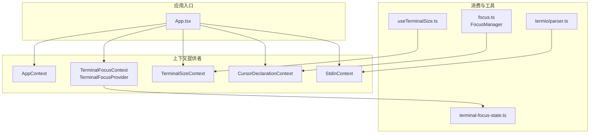
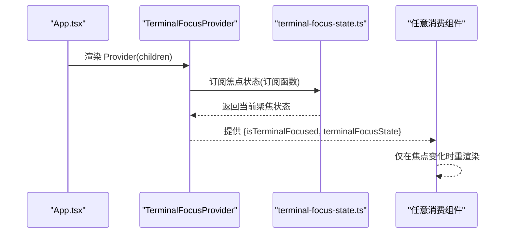
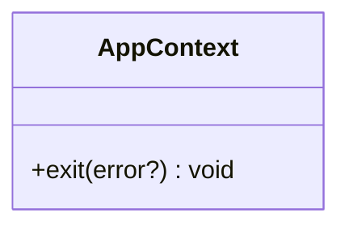
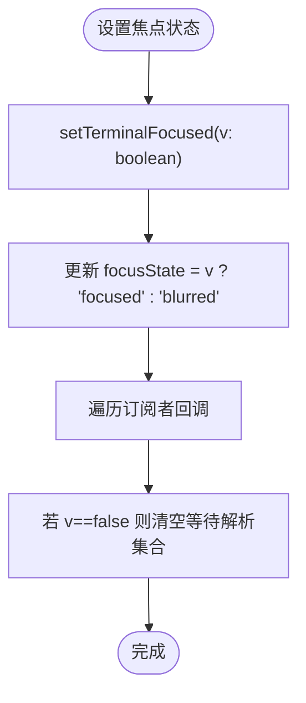
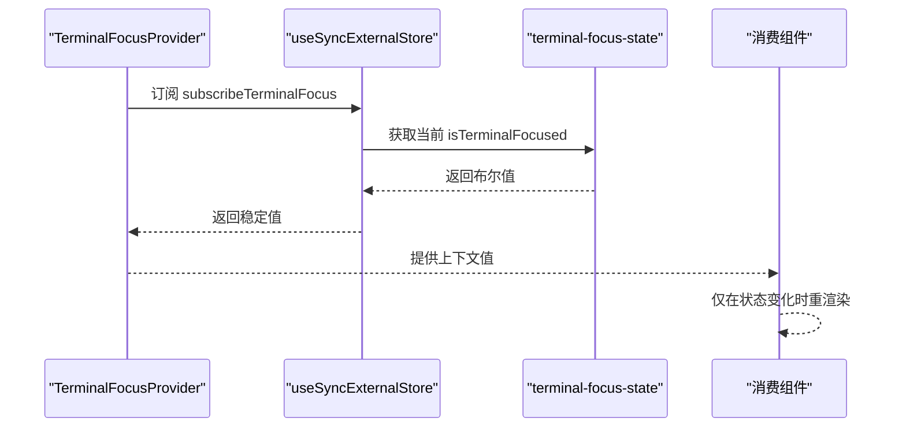
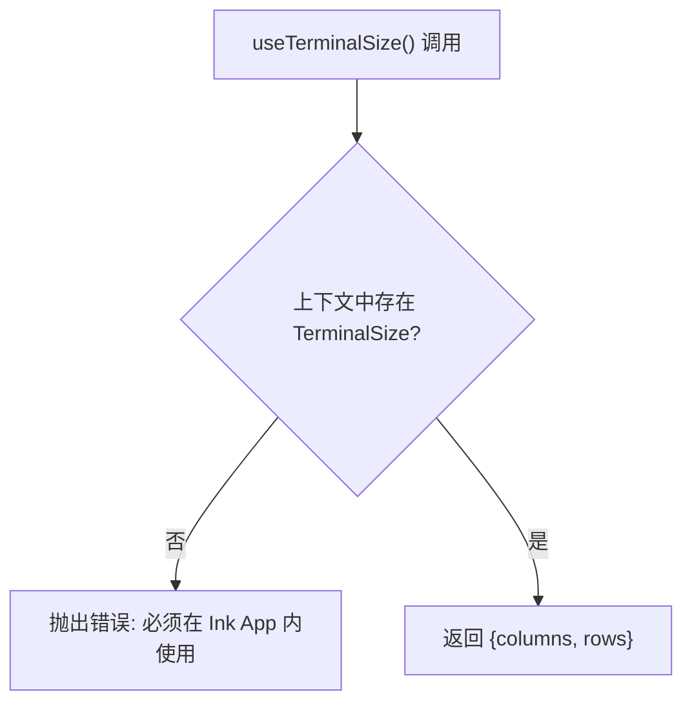
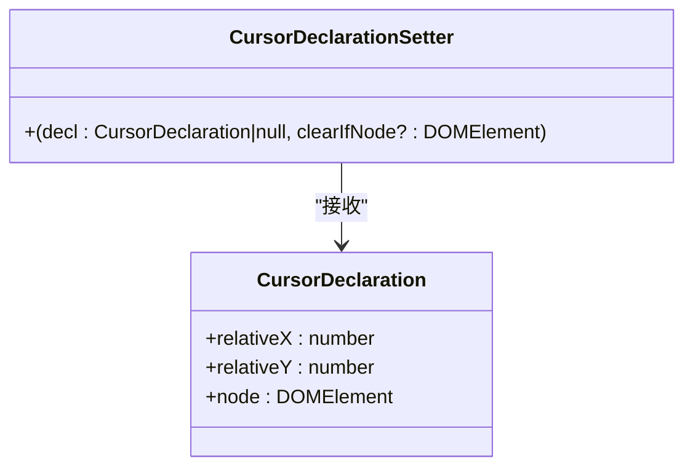
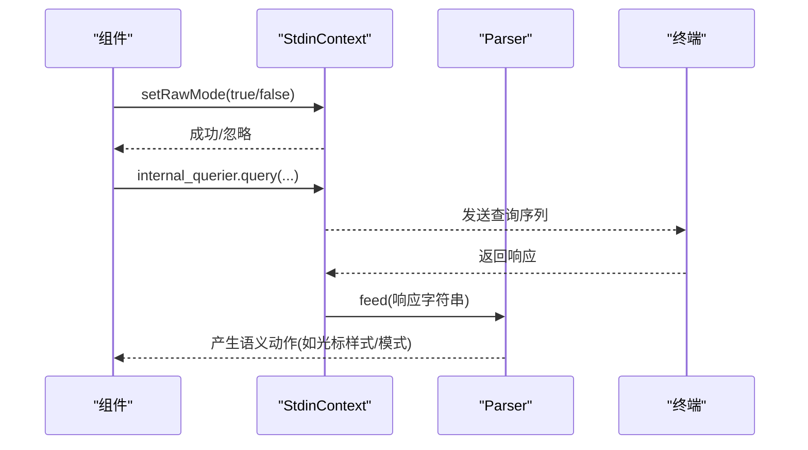
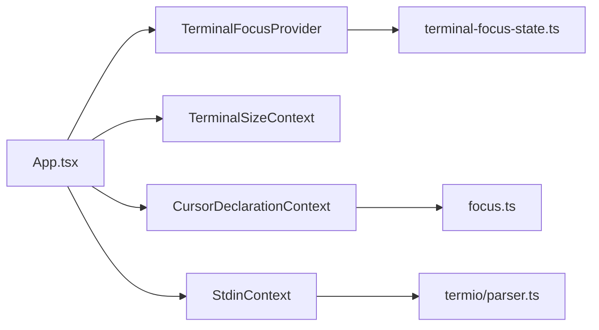

# 上下文终端组件

<cite>
**本文引用的文件**
- [AppContext.ts](file://src/ink/components/AppContext.ts)
- [TerminalFocusContext.tsx](file://src/ink/components/TerminalFocusContext.tsx)
- [TerminalSizeContext.tsx](file://src/ink/components/TerminalSizeContext.tsx)
- [CursorDeclarationContext.ts](file://src/ink/components/CursorDeclarationContext.ts)
- [StdinContext.ts](file://src/ink/components/StdinContext.ts)
- [useTerminalSize.ts](file://src/hooks/useTerminalSize.ts)
- [terminal-focus-state.ts](file://src/ink/terminal-focus-state.ts)
- [focus.ts](file://src/ink/focus.ts)
- [parser.ts](file://src/ink/termio/parser.ts)
- [App.tsx](file://src/ink/components/App.tsx)
</cite>

## 目录
1. [简介](#简介)
2. [项目结构](#项目结构)
3. [核心组件](#核心组件)
4. [架构总览](#架构总览)
5. [详细组件分析](#详细组件分析)
6. [依赖关系分析](#依赖关系分析)
7. [性能考量](#性能考量)
8. [故障排查指南](#故障排查指南)
9. [结论](#结论)
10. [附录](#附录)

## 简介
本文件系统性梳理 Claude Code 中“上下文终端组件”的设计与实现，重点覆盖以下上下文与能力：
- 应用控制：AppContext（应用退出）
- 终端焦点：TerminalFocusContext（聚焦状态与订阅）、terminal-focus-state（底层状态机）
- 终端尺寸：TerminalSizeContext（行列信息）、useTerminalSize（消费 Hook）
- 光标声明：CursorDeclarationContext（相对坐标与宿主节点）
- 标准输入：StdinContext（stdin 流、原始模式、查询器）

文档将解释上下文在组件树中的传递机制、状态管理策略、焦点与光标声明的实现细节、终端尺寸监听与响应式布局支持、以及标准输入处理与键盘事件捕获的集成方式，并提供使用模式与最佳实践。

## 项目结构
上下文终端组件主要位于 Ink 组件层与终端交互层，围绕 React Context 提供跨组件的状态共享与事件分发。关键文件分布如下：
- 组件上下文：AppContext、TerminalFocusContext、TerminalSizeContext、CursorDeclarationContext、StdinContext
- 聚合入口：App.tsx 将各上下文 Provider 包裹在根组件中
- 消费 Hook：useTerminalSize
- 终端焦点状态：terminal-focus-state（非 React 外部存储）
- 终端焦点管理：focus（DOM-like FocusManager）
- 终端输入解析：termio/parser（ANSI 解析器，支撑光标样式与模式等语义动作）

图表来源
- [App.tsx:18-28](file://src/ink/components/App.tsx#L18-L28)
- [TerminalFocusContext.tsx:1-53](file://src/ink/components/TerminalFocusContext.tsx#L1-L53)
- [TerminalSizeContext.tsx:1-8](file://src/ink/components/TerminalSizeContext.tsx#L1-L8)
- [CursorDeclarationContext.ts:1-34](file://src/ink/components/CursorDeclarationContext.ts#L1-L34)
- [StdinContext.ts:1-51](file://src/ink/components/StdinContext.ts#L1-L51)
- [useTerminalSize.ts:1-17](file://src/hooks/useTerminalSize.ts#L1-L17)
- [terminal-focus-state.ts:1-49](file://src/ink/terminal-focus-state.ts#L1-L49)
- [focus.ts:1-183](file://src/ink/focus.ts#L1-L183)
- [parser.ts:1-396](file://src/ink/termio/parser.ts#L1-L396)

章节来源
- [App.tsx:18-28](file://src/ink/components/App.tsx#L18-L28)
- [TerminalFocusContext.tsx:1-53](file://src/ink/components/TerminalFocusContext.tsx#L1-L53)
- [TerminalSizeContext.tsx:1-8](file://src/ink/components/TerminalSizeContext.tsx#L1-L8)
- [CursorDeclarationContext.ts:1-34](file://src/ink/components/CursorDeclarationContext.ts#L1-L34)
- [StdinContext.ts:1-51](file://src/ink/components/StdinContext.ts#L1-L51)
- [useTerminalSize.ts:1-17](file://src/hooks/useTerminalSize.ts#L1-L17)
- [terminal-focus-state.ts:1-49](file://src/ink/terminal-focus-state.ts#L1-L49)
- [focus.ts:1-183](file://src/ink/focus.ts#L1-L183)
- [parser.ts:1-396](file://src/ink/termio/parser.ts#L1-L396)

## 核心组件
- AppContext：提供应用级退出能力，作为顶层上下文暴露给子树使用。
- TerminalFocusContext：提供终端聚焦状态与聚焦状态枚举，通过 useSyncExternalStore 订阅外部焦点状态变化，避免无关重渲染。
- TerminalSizeContext：提供终端行列信息，用于响应式布局与渲染优化。
- CursorDeclarationContext：提供“光标声明”写入器，允许组件声明其内部相对光标位置与宿主节点，供上层布局或渲染逻辑使用。
- StdinContext：提供 stdin 流、原始模式切换、是否支持原始模式、内部事件发射器与终端查询器，统一处理输入与终端交互。

章节来源
- [AppContext.ts:1-23](file://src/ink/components/AppContext.ts#L1-L23)
- [TerminalFocusContext.tsx:1-53](file://src/ink/components/TerminalFocusContext.tsx#L1-L53)
- [TerminalSizeContext.tsx:1-8](file://src/ink/components/TerminalSizeContext.tsx#L1-L8)
- [CursorDeclarationContext.ts:1-34](file://src/ink/components/CursorDeclarationContext.ts#L1-L34)
- [StdinContext.ts:1-51](file://src/ink/components/StdinContext.ts#L1-L51)

## 架构总览
上下文在 App.tsx 中被集中注入，形成从外到内的状态流：
- 终端焦点：terminal-focus-state 作为外部状态源，TerminalFocusContext 通过 useSyncExternalStore 订阅并派发给消费者，避免 App.tsx 自身因焦点变化而重渲染。
- 终端尺寸：TerminalSizeContext 默认值为 null，由上层渲染器或监听器设置 columns/rows，useTerminalSize Hook 安全地获取当前尺寸。
- 光标声明：CursorDeclarationContext 暴露 setter，FocusManager 在 DOM 树中维护焦点栈，结合声明上下文实现“相对坐标 + 宿主节点”的定位模型。
- 标准输入：StdinContext 暴露 stdin、原始模式开关、查询器等，parser.ts 基于 ANSI 序列解析生成语义动作，驱动终端行为（如光标样式、模式切换）。

图表来源
- [App.tsx:18-28](file://src/ink/components/App.tsx#L18-L28)
- [TerminalFocusContext.tsx:20-50](file://src/ink/components/TerminalFocusContext.tsx#L20-L50)
- [terminal-focus-state.ts:35-47](file://src/ink/terminal-focus-state.ts#L35-L47)

章节来源
- [App.tsx:18-28](file://src/ink/components/App.tsx#L18-L28)
- [TerminalFocusContext.tsx:1-53](file://src/ink/components/TerminalFocusContext.tsx#L1-L53)
- [terminal-focus-state.ts:1-49](file://src/ink/terminal-focus-state.ts#L1-L49)

## 详细组件分析

### AppContext 分析
- 角色：顶层应用控制上下文，提供 exit 方法以触发应用卸载。
- 设计要点：使用 React createContext 创建默认空实现，避免未包裹时的运行时错误；displayName 便于调试。
- 使用建议：仅在需要主动退出场景使用，避免滥用导致用户体验中断。

图表来源
- [AppContext.ts:1-23](file://src/ink/components/AppContext.ts#L1-L23)

章节来源
- [AppContext.ts:1-23](file://src/ink/components/AppContext.ts#L1-L23)

### TerminalFocusContext 与 terminal-focus-state 分析
- 终端焦点状态类型：'focused' | 'blurred' | 'unknown'，unknown 表示不支持焦点上报的终端。
- 状态机与订阅：
  - setTerminalFocused(bool) 更新状态并同步通知订阅者。
  - getTerminalFocused()/getTerminalFocusState() 提供布尔与枚举查询。
  - subscribeTerminalFocus(cb) 注册订阅，返回取消函数。
  - resetTerminalFocusState() 重置为 unknown。
- Provider 实现：
  - 使用 useSyncExternalStore 订阅状态，memo 化 value 与渲染结果，确保只有消费组件重渲染。
  - 将 isTerminalFocused 与 terminalFocusState 同步注入上下文。

图表来源
- [terminal-focus-state.ts:12-24](file://src/ink/terminal-focus-state.ts#L12-L24)

图表来源
- [TerminalFocusContext.tsx:20-50](file://src/ink/components/TerminalFocusContext.tsx#L20-L50)
- [terminal-focus-state.ts:35-47](file://src/ink/terminal-focus-state.ts#L35-L47)

章节来源
- [TerminalFocusContext.tsx:1-53](file://src/ink/components/TerminalFocusContext.tsx#L1-L53)
- [terminal-focus-state.ts:1-49](file://src/ink/terminal-focus-state.ts#L1-L49)

### TerminalSizeContext 与 useTerminalSize 分析
- TerminalSizeContext：提供 columns/rows 的终端尺寸信息，默认值为 null。
- useTerminalSize：安全地从上下文中读取 TerminalSize，若未包裹 Provider 则抛出明确错误，防止静默失败。
- 使用建议：在需要按终端大小调整布局或渲染策略的组件中使用；确保在 App.tsx 中已注入 TerminalSizeContext。

图表来源
- [useTerminalSize.ts:7-15](file://src/hooks/useTerminalSize.ts#L7-L15)
- [TerminalSizeContext.tsx:1-8](file://src/ink/components/TerminalSizeContext.tsx#L1-L8)

章节来源
- [useTerminalSize.ts:1-17](file://src/hooks/useTerminalSize.ts#L1-L17)
- [TerminalSizeContext.tsx:1-8](file://src/ink/components/TerminalSizeContext.tsx#L1-L8)

### CursorDeclarationContext 分析
- CursorDeclaration：包含三要素
  - relativeX/relativeY：声明节点内的显示列与行（终端单元宽度）。
  - node：提供 Yoga 布局绝对原点的 Ink Box DOMElement。
- CursorDeclarationSetter：
  - 支持条件清空：clearIfNode 可选，仅当当前声明节点匹配时才清除，避免兄弟组件间焦点切换导致的误清空。
- 与 FocusManager 协作：
  - FocusManager 维护 activeElement 与焦点栈，结合 CursorDeclarationContext 的 setter，可实现“焦点变更 -> 光标声明更新”的联动。

图表来源
- [CursorDeclarationContext.ts:4-26](file://src/ink/components/CursorDeclarationContext.ts#L4-L26)
- [focus.ts:15-132](file://src/ink/focus.ts#L15-L132)

章节来源
- [CursorDeclarationContext.ts:1-34](file://src/ink/components/CursorDeclarationContext.ts#L1-L34)
- [focus.ts:1-183](file://src/ink/focus.ts#L1-L183)

### StdinContext 分析
- 暴露能力：
  - stdin：NodeJS.ReadStream，可替换为自定义输入流。
  - setRawMode(value)：统一的原始模式切换接口，避免直接操作 process.stdin。
  - isRawModeSupported：指示当前 stdin 是否支持原始模式。
  - internal_exitOnCtrlC/internal_eventEmitter/internal_querier：内部控制与查询能力。
- 与 ANSI 解析器协作：
  - parser.ts 将 ANSI 序列解析为语义动作，StdinContext 通过 internal_querier 发起 DECRQM/OSC 查询，parser 解析响应，驱动终端行为（如光标样式、备用屏、鼠标跟踪、焦点事件等）。

图表来源
- [StdinContext.ts:5-29](file://src/ink/components/StdinContext.ts#L5-L29)
- [parser.ts:272-396](file://src/ink/termio/parser.ts#L272-L396)

章节来源
- [StdinContext.ts:1-51](file://src/ink/components/StdinContext.ts#L1-L51)
- [parser.ts:1-396](file://src/ink/termio/parser.ts#L1-L396)

## 依赖关系分析
- App.tsx 将各上下文 Provider 组合并注入应用根节点，确保子树可访问。
- TerminalFocusContext 依赖 terminal-focus-state 的外部状态与订阅接口，通过 useSyncExternalStore 与 React 生态解耦。
- CursorDeclarationContext 与 FocusManager 协同，后者负责 DOM 焦点管理，前者负责声明式光标定位。
- StdinContext 与 termio/parser 配合，实现 ANSI 序列的语义化处理与终端行为控制。

图表来源
- [App.tsx:18-28](file://src/ink/components/App.tsx#L18-L28)
- [TerminalFocusContext.tsx:20-50](file://src/ink/components/TerminalFocusContext.tsx#L20-L50)
- [terminal-focus-state.ts:35-47](file://src/ink/terminal-focus-state.ts#L35-L47)
- [focus.ts:15-132](file://src/ink/focus.ts#L15-L132)
- [parser.ts:272-396](file://src/ink/termio/parser.ts#L272-L396)

章节来源
- [App.tsx:18-28](file://src/ink/components/App.tsx#L18-L28)
- [TerminalFocusContext.tsx:1-53](file://src/ink/components/TerminalFocusContext.tsx#L1-L53)
- [terminal-focus-state.ts:1-49](file://src/ink/terminal-focus-state.ts#L1-L49)
- [focus.ts:1-183](file://src/ink/focus.ts#L1-L183)
- [parser.ts:1-396](file://src/ink/termio/parser.ts#L1-L396)

## 性能考量
- 终端焦点：使用 useSyncExternalStore 订阅外部状态，避免 Provider 自身重渲染，仅消费组件响应变化，降低重渲染成本。
- 终端尺寸：TerminalSizeContext 默认 null，避免在未就绪时进行昂贵计算；消费侧通过 useTerminalSize 进行安全访问。
- 光标声明：CursorDeclarationSetter 支持条件清空，减少兄弟组件切换时的重复写入与布局抖动。
- ANSI 解析：parser.ts 采用流式解析与语义动作输出，避免一次性大字符串处理，利于长输出场景的实时渲染。

## 故障排查指南
- useTerminalSize 报错“必须在 Ink App 内使用”：确认已在 App.tsx 中注入 TerminalSizeContext。
- 终端焦点无变化：检查是否通过 terminal-focus-state 的 setTerminalFocused 更新状态，或终端是否支持焦点上报（unknown 时按聚焦处理）。
- 光标声明无效：确认 CursorDeclarationContext 的 setter 已在焦点变化时调用，并传入正确的 DOMElement 节点。
- 输入无响应：检查 StdinContext 的 stdin 是否正确传入，raw 模式是否开启，以及是否通过 internal_querier 发起查询。

章节来源
- [useTerminalSize.ts:10-12](file://src/hooks/useTerminalSize.ts#L10-L12)
- [terminal-focus-state.ts:12-24](file://src/ink/terminal-focus-state.ts#L12-L24)
- [CursorDeclarationContext.ts:23-26](file://src/ink/components/CursorDeclarationContext.ts#L23-L26)
- [StdinContext.ts:35-44](file://src/ink/components/StdinContext.ts#L35-L44)

## 结论
上下文终端组件通过清晰的职责划分与稳定的 React Context 机制，实现了对终端焦点、尺寸、光标声明与标准输入的统一管理。配合 useSyncExternalStore、FocusManager 与 ANSI 解析器，系统在保证性能的同时提供了灵活的终端交互能力。遵循本文的最佳实践，可在复杂终端 UI 中保持良好的可维护性与一致性。

## 附录
- 使用模式与最佳实践
  - 在 App.tsx 中统一注入所有上下文 Provider，确保子树可访问。
  - 使用 useTerminalSize 获取尺寸并在布局中做条件渲染或断点适配。
  - 通过 CursorDeclarationContext 与 FocusManager 协作，实现“焦点即光标”的直观体验。
  - 使用 StdinContext 的 setRawMode 与 internal_querier，避免直接操作底层流，提升兼容性与可测试性。
  - 对 TerminalFocusContext 的订阅尽量局部化，避免在顶层组件中过度依赖。