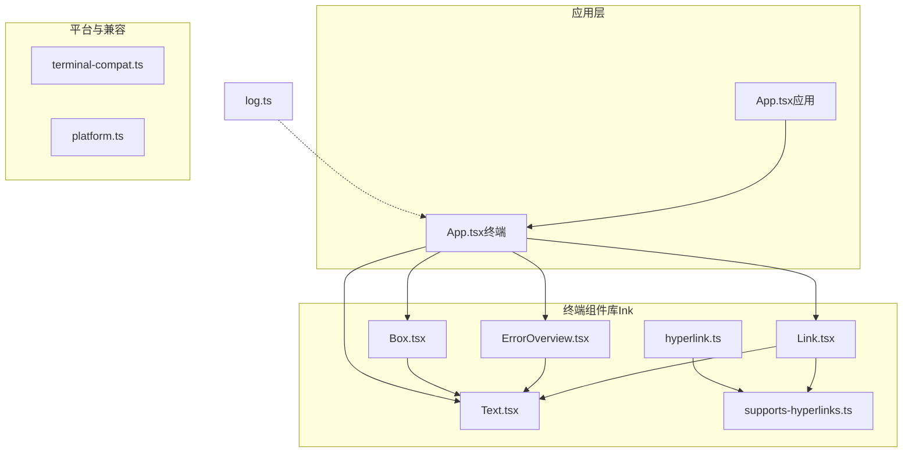
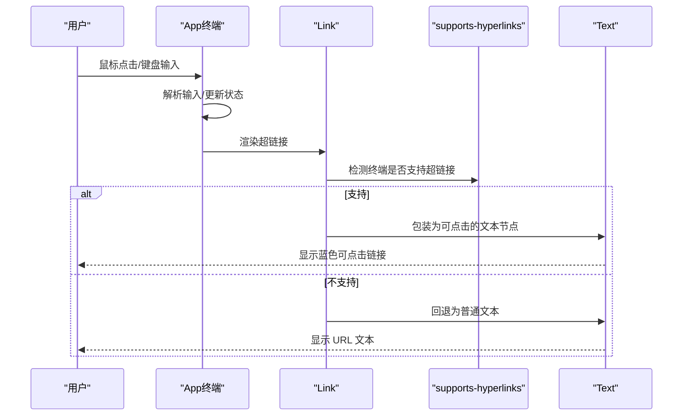
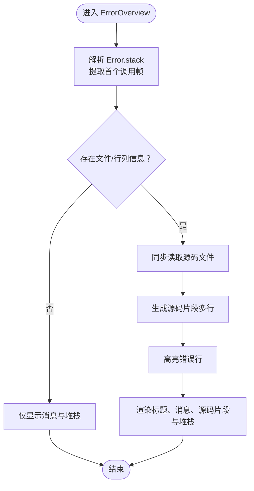
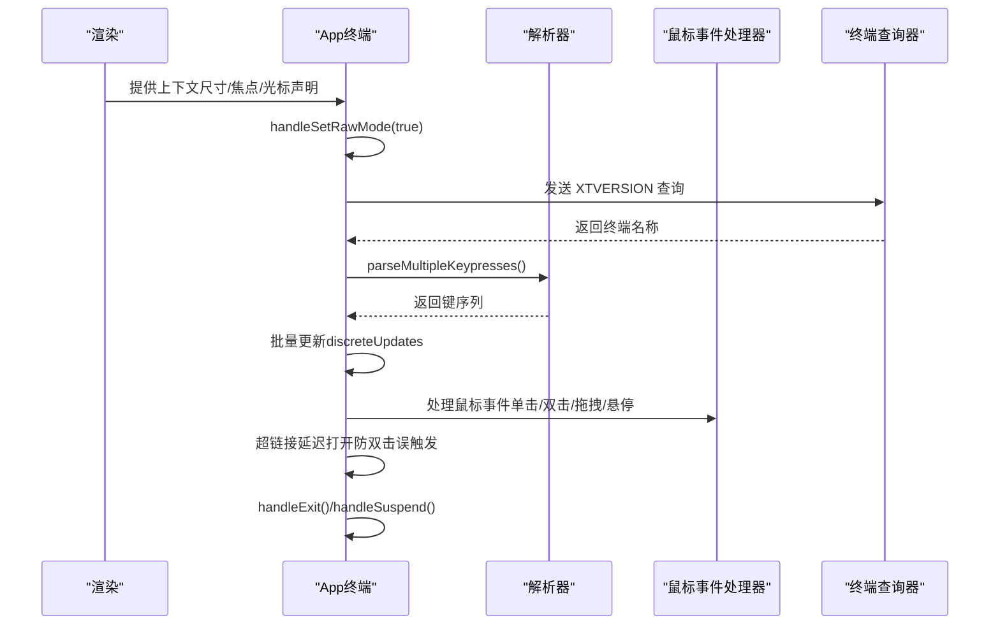
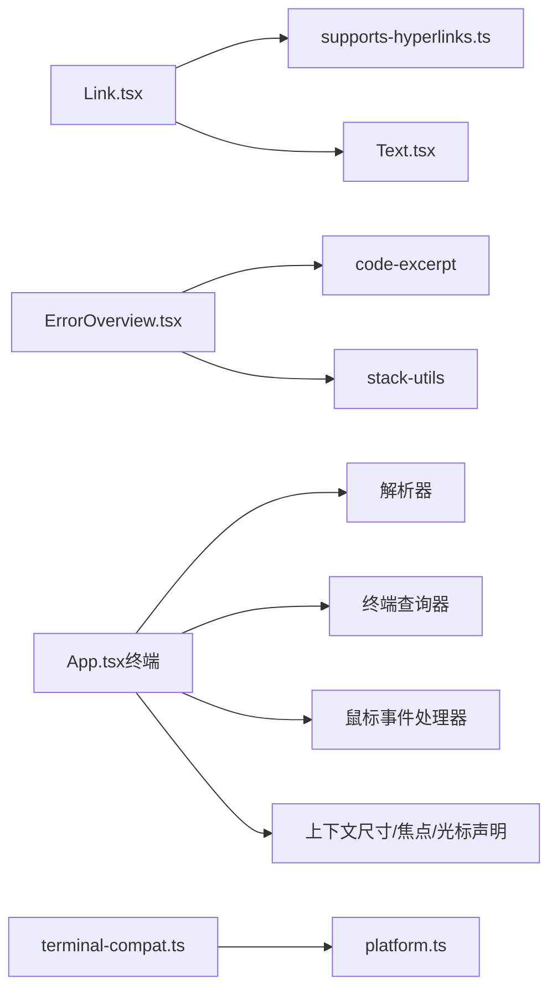

# 专用终端组件

<cite>
**本文档引用的文件**
- [ErrorOverview.tsx](file://src/ink/components/ErrorOverview.tsx)
- [Link.tsx](file://src/ink/components/Link.tsx)
- [App.tsx（终端）](file://src/ink/components/App.tsx)
- [App.tsx（应用）](file://src/components/App.tsx)
- [Text.tsx](file://src/ink/components/Text.tsx)
- [Box.tsx](file://src/ink/components/Box.tsx)
- [supports-hyperlinks.ts](file://src/ink/supports-hyperlinks.ts)
- [hyperlink.ts](file://src/utils/hyperlink.ts)
- [terminal-compat.ts](file://web/lib/terminal-compat.ts)
- [platform.ts](file://web/lib/platform.ts)
- [log.ts](file://src/utils/log.ts)
</cite>

## 目录
1. [简介](#简介)
2. [项目结构](#项目结构)
3. [核心组件](#核心组件)
4. [架构总览](#架构总览)
5. [组件深度分析](#组件深度分析)
6. [依赖关系分析](#依赖关系分析)
7. [性能考量](#性能考量)
8. [故障排除指南](#故障排除指南)
9. [结论](#结论)

## 简介
本文件面向 Claude Code 的专用终端组件，重点解析以下组件与能力：
- ErrorOverview：错误信息展示与调试辅助
- Link：超链接渲染与点击处理机制
- App（终端根组件）：初始化流程、生命周期管理与全局配置
- App（应用根组件）：顶层状态与上下文提供者包装器

目标是帮助开发者理解这些组件的实现原理、使用方法、扩展方式以及在真实场景中的最佳实践。

## 项目结构
围绕终端组件的关键目录与文件：
- 终端组件库（Ink）：src/ink/components 下的 Link、ErrorOverview、Text、Box 等
- 应用根组件：src/components/App.tsx
- 超链接支持：src/ink/supports-hyperlinks.ts、src/utils/hyperlink.ts
- 平台与兼容性：web/lib/terminal-compat.ts、web/lib/platform.ts
- 日志与错误处理：src/utils/log.ts



**图表来源**
- [Link.tsx:1-43](file://src/ink/components/Link.tsx#L1-L43)
- [ErrorOverview.tsx:1-110](file://src/ink/components/ErrorOverview.tsx#L1-L110)
- [Text.tsx:1-255](file://src/ink/components/Text.tsx#L1-L255)
- [Box.tsx:1-215](file://src/ink/components/Box.tsx#L1-L215)
- [supports-hyperlinks.ts:1-57](file://src/ink/supports-hyperlinks.ts#L1-L57)
- [hyperlink.ts:1-39](file://src/utils/hyperlink.ts#L1-L39)
- [App.tsx（应用）:1-58](file://src/components/App.tsx#L1-L58)
- [App.tsx（终端）:1-659](file://src/ink/components/App.tsx#L1-L659)
- [terminal-compat.ts:1-36](file://web/lib/terminal-compat.ts#L1-L36)
- [platform.ts:1-37](file://web/lib/platform.ts#L1-L37)
- [log.ts:96-134](file://src/utils/log.ts#L96-L134)

**章节来源**
- [Link.tsx:1-43](file://src/ink/components/Link.tsx#L1-L43)
- [ErrorOverview.tsx:1-110](file://src/ink/components/ErrorOverview.tsx#L1-L110)
- [Text.tsx:1-255](file://src/ink/components/Text.tsx#L1-L255)
- [Box.tsx:1-215](file://src/ink/components/Box.tsx#L1-L215)
- [supports-hyperlinks.ts:1-57](file://src/ink/supports-hyperlinks.ts#L1-L57)
- [hyperlink.ts:1-39](file://src/utils/hyperlink.ts#L1-L39)
- [App.tsx（应用）:1-58](file://src/components/App.tsx#L1-L58)
- [App.tsx（终端）:1-659](file://src/ink/components/App.tsx#L1-L659)
- [terminal-compat.ts:1-36](file://web/lib/terminal-compat.ts#L1-L36)
- [platform.ts:1-37](file://web/lib/platform.ts#L1-L37)
- [log.ts:96-134](file://src/utils/log.ts#L96-L134)

## 核心组件
- ErrorOverview：从 Error.stack 解析调用栈，定位源码文件与行列号，读取源码片段并高亮错误行，同时输出可复制的堆栈信息，便于快速定位问题。
- Link：根据终端是否支持超链接动态渲染，支持自定义回退内容；在不支持时以普通文本显示 URL。
- App（终端）：负责输入流解析、鼠标事件处理、超链接点击延迟打开、原始模式管理、焦点管理、终端兼容探测等。
- App（应用）：顶层状态与上下文提供者包装器，注入 FPS 指标、统计信息与应用状态。

**章节来源**
- [ErrorOverview.tsx:25-108](file://src/ink/components/ErrorOverview.tsx#L25-L108)
- [Link.tsx:6-41](file://src/ink/components/Link.tsx#L6-L41)
- [App.tsx（终端）:36-96](file://src/ink/components/App.tsx#L36-L96)
- [App.tsx（应用）:8-54](file://src/components/App.tsx#L8-L54)

## 架构总览
终端组件通过 App（终端）作为根容器，统一管理输入、渲染与交互；应用层通过 App（应用）提供状态与上下文。超链接能力由 supports-hyperlinks 与 hyperlink 工具共同支撑。



**图表来源**
- [App.tsx（终端）:154-179](file://src/ink/components/App.tsx#L154-L179)
- [Link.tsx:11-41](file://src/ink/components/Link.tsx#L11-L41)
- [supports-hyperlinks.ts:26-57](file://src/ink/supports-hyperlinks.ts#L26-L57)
- [Text.tsx:114-253](file://src/ink/components/Text.tsx#L114-L253)

## 组件深度分析

### ErrorOverview 组件
- 功能要点
  - 解析 Error.stack，提取首个调用帧并解析文件路径、行列号
  - 使用 code-excerpt 读取源码片段，高亮错误所在行
  - 输出带颜色的“ERROR”标题与错误消息
  - 展示完整堆栈，对无法解析的行进行降级显示
- 性能与健壮性
  - 同步读取源码文件，避免在渲染树中引入异步结构
  - 对文件不可读或解析失败进行容错处理，保证错误覆盖页稳定渲染
- 可扩展性
  - 可通过传入自定义错误对象扩展到不同来源的错误（如 MCP 错误）
  - 可结合日志系统统一记录与上报



**图表来源**
- [ErrorOverview.tsx:28-108](file://src/ink/components/ErrorOverview.tsx#L28-L108)

**章节来源**
- [ErrorOverview.tsx:1-110](file://src/ink/components/ErrorOverview.tsx#L1-L110)

### Link 组件
- 功能要点
  - 根据 supports-hyperlinks 判断是否支持 OSC 8 超链接
  - 支持自定义 children 或回退文本；不支持时以普通文本显示
  - 在支持时包裹为可点击的文本节点，便于在终端中直接点击打开
- 与工具的关系
  - supports-hyperlinks 提供终端能力检测
  - hyperlink 工具提供 OSC 8 序列构造与着色
- 用户体验
  - 在支持的终端中提供原生体验（点击即开），在不支持的环境中保持可用性（显示 URL）

```mermaid
classDiagram
class Link {
+props : {children?, url, fallback?}
+render() : ReactNode
}
class supportsHyperlinks {
+supportsHyperlinks(options?) : boolean
}
class Text {
+render() : ReactNode
}
Link --> supportsHyperlinks : "检测支持"
Link --> Text : "渲染文本"
```

**图表来源**
- [Link.tsx:6-41](file://src/ink/components/Link.tsx#L6-L41)
- [supports-hyperlinks.ts:26-57](file://src/ink/supports-hyperlinks.ts#L26-L57)
- [Text.tsx:114-253](file://src/ink/components/Text.tsx#L114-L253)

**章节来源**
- [Link.tsx:1-43](file://src/ink/components/Link.tsx#L1-L43)
- [hyperlink.ts:24-39](file://src/utils/hyperlink.ts#L24-L39)
- [supports-hyperlinks.ts:1-57](file://src/ink/supports-hyperlinks.ts#L1-L57)

### App（终端）组件
- 初始化与生命周期
  - 渲染阶段提供终端尺寸、应用上下文、标准输入/输出上下文、光标声明上下文
  - 组件挂载时隐藏原生光标（无障碍模式除外）
  - 组件卸载时恢复光标、清理计时器与监听器、关闭原始模式
- 输入与事件
  - 原始模式启用/禁用：统一计数，避免重复设置
  - 输入解析：基于状态机解析键值序列，批量更新以避免“最大更新深度”错误
  - 鼠标事件：双击/三击选择、拖拽扩展、悬停处理、超链接延迟打开
  - 聚焦事件：终端聚焦/失焦事件传播与焦点状态维护
- 终端兼容与调试
  - 探测终端类型（XTVERSION），用于滚轮滚动基线判断
  - 处理长间隔 stdin 恢复，重新断言鼠标跟踪等模式
  - 支持进程挂起/恢复（SIGSTOP/SIGCONT），保存/恢复原始模式与终端状态
- 全局配置
  - 通过 props 注入 stdin/stdout/stderr、退出行为、光标声明回调、超链接打开回调等
  - 通过上下文提供终端尺寸、焦点状态、时钟等



**图表来源**
- [App.tsx（终端）:154-179](file://src/ink/components/App.tsx#L154-L179)
- [App.tsx（终端）:209-280](file://src/ink/components/App.tsx#L209-L280)
- [App.tsx（终端）:309-368](file://src/ink/components/App.tsx#L309-L368)
- [App.tsx（终端）:444-512](file://src/ink/components/App.tsx#L444-L512)
- [App.tsx（终端）:515-657](file://src/ink/components/App.tsx#L515-L657)

**章节来源**
- [App.tsx（终端）:1-659](file://src/ink/components/App.tsx#L1-L659)

### App（应用）组件
- 作用：顶层包装器，向子树提供 FPS 指标、统计信息与应用状态上下文
- 结构：按序提供 FPS 指标、统计信息与应用状态 Provider，再渲染子树
- 适用场景：需要在应用层面共享全局状态与指标的交互会话

**章节来源**
- [App.tsx（应用）:1-58](file://src/components/App.tsx#L1-L58)

## 依赖关系分析
- Link 依赖 supports-hyperlinks 进行能力检测，并在支持时渲染可点击文本
- ErrorOverview 依赖 code-excerpt 与 stack-utils 解析与高亮源码片段
- App（终端）依赖解析器、终端查询器、鼠标事件处理器等模块，形成完整的输入/事件处理链路
- 平台相关：terminal-compat 与 platform 提供浏览器与终端环境的尺寸与平台检测替代方案



**图表来源**
- [Link.tsx:1-43](file://src/ink/components/Link.tsx#L1-L43)
- [supports-hyperlinks.ts:1-57](file://src/ink/supports-hyperlinks.ts#L1-L57)
- [Text.tsx:1-255](file://src/ink/components/Text.tsx#L1-L255)
- [ErrorOverview.tsx:1-110](file://src/ink/components/ErrorOverview.tsx#L1-L110)
- [App.tsx（终端）:1-659](file://src/ink/components/App.tsx#L1-L659)
- [terminal-compat.ts:1-36](file://web/lib/terminal-compat.ts#L1-L36)
- [platform.ts:1-37](file://web/lib/platform.ts#L1-L37)

**章节来源**
- [Link.tsx:1-43](file://src/ink/components/Link.tsx#L1-L43)
- [supports-hyperlinks.ts:1-57](file://src/ink/supports-hyperlinks.ts#L1-L57)
- [Text.tsx:1-255](file://src/ink/components/Text.tsx#L1-L255)
- [ErrorOverview.tsx:1-110](file://src/ink/components/ErrorOverview.tsx#L1-L110)
- [App.tsx（终端）:1-659](file://src/ink/components/App.tsx#L1-L659)
- [terminal-compat.ts:1-36](file://web/lib/terminal-compat.ts#L1-L36)
- [platform.ts:1-37](file://web/lib/platform.ts#L1-L37)

## 性能考量
- 输入批处理：通过 discreteUpdates 将一次性处理多个键序列，避免多次重渲染导致的性能问题
- 计时器与节流：超链接延迟打开与不完整转义序列刷新采用定时器，合理设置超时时间
- 原始模式管理：启用/禁用原始模式时进行计数保护，避免重复设置带来的额外开销
- 条件渲染：Link 与 Text 使用内部缓存与条件分支减少不必要的节点重建

[本节为通用指导，无需特定文件引用]

## 故障排除指南
- 终端不支持超链接
  - 现象：点击无响应或显示 URL 文本
  - 处理：确认 supports-hyperlinks 检测结果；在不支持的终端中使用回退文本
- 鼠标事件无效
  - 现象：点击/拖拽无效果
  - 处理：确保处于全屏模式且鼠标跟踪已启用；检查 handleMouseEvent 的前置条件
- 长连接断开后输入异常
  - 现象：tmux 重连/ssh 断线后按键无响应
  - 处理：利用 STDIN_RESUME_GAP_MS 检测并触发 onStdinResume 回调，重新断言终端模式
- 错误覆盖页无法显示源码片段
  - 现象：仅显示消息与堆栈，未显示源码高亮
  - 处理：确认文件可读且路径正确；解析失败时会自动降级显示

**章节来源**
- [supports-hyperlinks.ts:26-57](file://src/ink/supports-hyperlinks.ts#L26-L57)
- [App.tsx（终端）:332-368](file://src/ink/components/App.tsx#L332-L368)
- [App.tsx（终端）:515-657](file://src/ink/components/App.tsx#L515-L657)
- [ErrorOverview.tsx:34-51](file://src/ink/components/ErrorOverview.tsx#L34-L51)

## 结论
- ErrorOverview 提供了从错误到源码片段的可视化调试路径，适合在终端中快速定位问题
- Link 与 supports-hyperlinks 协作实现了跨终端的超链接体验，兼顾可用性与原生交互
- App（终端）承担了输入/事件/终端兼容的中枢职责，具备完善的生命周期与错误兜底
- App（应用）为上层交互会话提供状态与上下文支撑，便于构建复杂交互界面

[本节为总结性内容，无需特定文件引用]