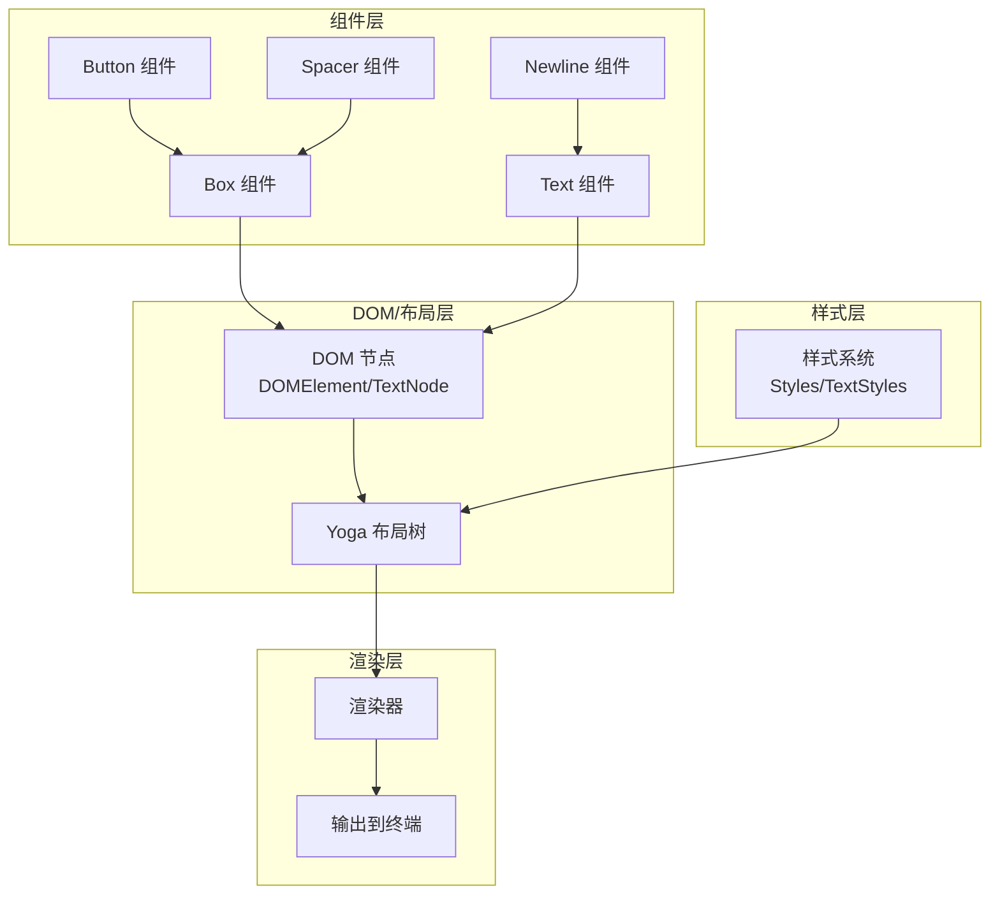
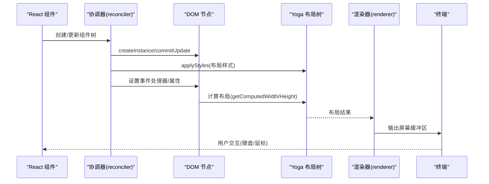
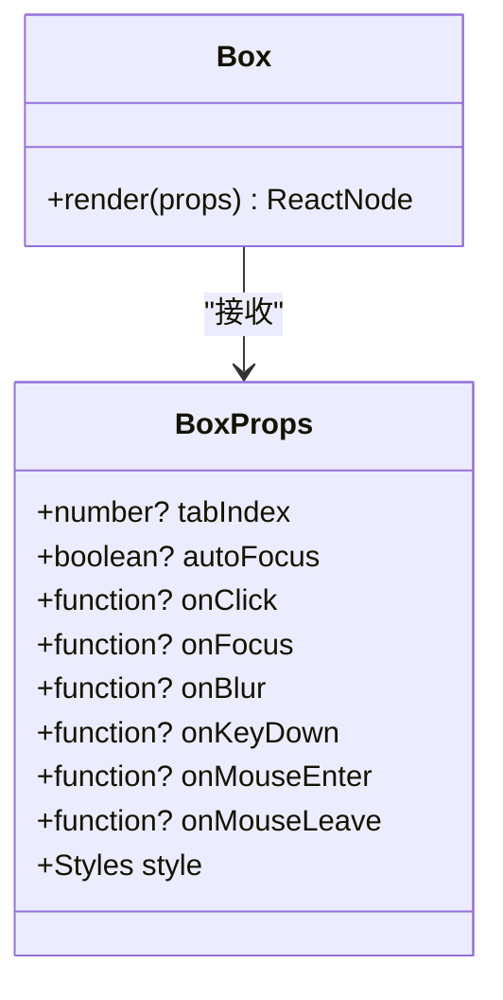
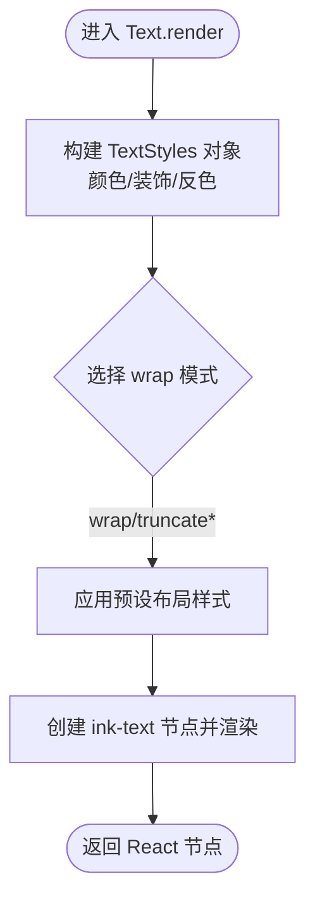
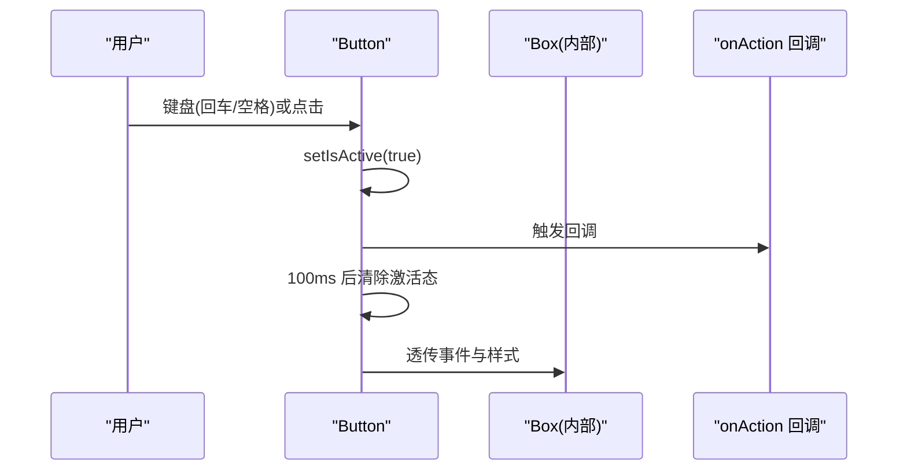
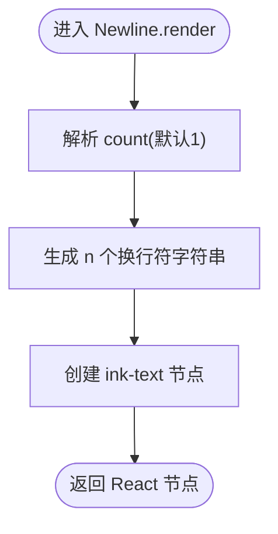
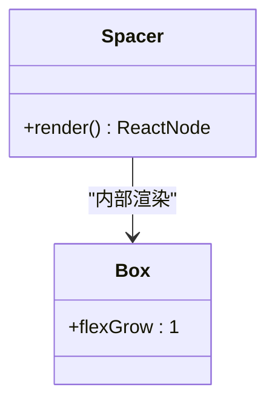

# 基础终端组件

<cite>
**本文档引用的文件**
- [Box 组件](file://src/ink/components/Box.tsx)
- [Text 组件](file://src/ink/components/Text.tsx)
- [Button 组件](file://src/ink/components/Button.tsx)
- [Newline 组件](file://src/ink/components/Newline.tsx)
- [Spacer 组件](file://src/ink/components/Spacer.tsx)
- [样式系统](file://src/ink/styles.ts)
- [DOM 节点与渲染](file://src/ink/dom.ts)
- [渲染器](file://src/ink/renderer.ts)
- [协调器](file://src/ink/reconciler.ts)
</cite>

## 目录
1. [简介](#简介)
2. [项目结构](#项目结构)
3. [核心组件](#核心组件)
4. [架构总览](#架构总览)
5. [详细组件分析](#详细组件分析)
6. [依赖关系分析](#依赖关系分析)
7. [性能考量](#性能考量)
8. [故障排查指南](#故障排查指南)
9. [结论](#结论)
10. [附录](#附录)

## 简介
本文件面向 Claude Code 的基础终端组件，系统性讲解 Box、Text、Button、Newline、Spacer 等核心组件的设计原理、属性配置、样式系统与布局行为，并说明它们与 Ink 渲染引擎的交互机制及性能优化要点。文档同时提供组件嵌套与组合技巧、常见使用场景与最佳实践，帮助开发者在终端界面中构建清晰、可维护且高性能的 UI。

## 项目结构
基础终端组件位于 Ink 子系统中，采用“组件层 + 样式层 + DOM/布局层 + 渲染层”的分层设计：
- 组件层：Box、Text、Button、Newline、Spacer 等 React 组件，负责声明式 UI。
- 样式层：Styles/TextStyles 定义布局、尺寸、间距、边框、文本样式等属性。
- DOM/布局层：DOMElement/TextNode 抽象节点，Yoga 布局树计算几何；样式应用到 Yoga 节点。
- 渲染层：渲染器将布局结果输出到终端屏幕缓冲区，支持增量刷新与虚拟滚动。

图表来源
- [Box 组件:1-215](file://src/ink/components/Box.tsx#L1-L215)
- [Text 组件:1-255](file://src/ink/components/Text.tsx#L1-L255)
- [Button 组件:1-193](file://src/ink/components/Button.tsx#L1-L193)
- [Newline 组件:1-40](file://src/ink/components/Newline.tsx#L1-L40)
- [Spacer 组件:1-21](file://src/ink/components/Spacer.tsx#L1-L21)
- [样式系统:1-773](file://src/ink/styles.ts#L1-L773)
- [DOM 节点与渲染:1-486](file://src/ink/dom.ts#L1-L486)
- [渲染器:1-180](file://src/ink/renderer.ts#L1-L180)

章节来源
- [Box 组件:1-215](file://src/ink/components/Box.tsx#L1-L215)
- [Text 组件:1-255](file://src/ink/components/Text.tsx#L1-L255)
- [Button 组件:1-193](file://src/ink/components/Button.tsx#L1-L193)
- [Newline 组件:1-40](file://src/ink/components/Newline.tsx#L1-L40)
- [Spacer 组件:1-21](file://src/ink/components/Spacer.tsx#L1-L21)
- [样式系统:1-773](file://src/ink/styles.ts#L1-L773)
- [DOM 节点与渲染:1-486](file://src/ink/dom.ts#L1-L486)
- [渲染器:1-180](file://src/ink/renderer.ts#L1-L180)

## 核心组件
本节概述五个基础组件的功能定位与典型用途：
- Box：终端布局容器，提供 Flex 布局能力（方向、伸缩、换行、对齐、间距等），支持焦点管理与鼠标事件（需在备用屏中启用）。
- Text：终端文本渲染组件，支持颜色、背景色、粗体/细体（互斥）、斜体、下划线、删除线、反色、文本换行/截断策略。
- Button：可交互按钮，内部维护聚焦/悬停/激活状态，通过 render prop 将状态暴露给子元素以实现条件样式。
- Newline：在 Text 内部插入指定数量的换行符，用于控制文本分行。
- Spacer：弹性空白占位，沿主轴自动填充剩余空间，常用于“推挤”布局。

章节来源
- [Box 组件:48-51](file://src/ink/components/Box.tsx#L48-L51)
- [Text 组件:111-113](file://src/ink/components/Text.tsx#L111-L113)
- [Button 组件:10-14](file://src/ink/components/Button.tsx#L10-L14)
- [Newline 组件:12-14](file://src/ink/components/Newline.tsx#L12-L14)
- [Spacer 组件:5-8](file://src/ink/components/Spacer.tsx#L5-L8)

## 架构总览
下面的序列图展示了从 React 组件到终端输出的关键流程：组件声明 → 协调器创建/更新 DOM 节点 → 应用样式到 Yoga → 计算布局 → 渲染器输出到终端。

图表来源
- [协调器:224-514](file://src/ink/reconciler.ts#L224-L514)
- [DOM 节点与渲染:1-486](file://src/ink/dom.ts#L1-L486)
- [渲染器:1-180](file://src/ink/renderer.ts#L1-L180)

章节来源
- [协调器:224-514](file://src/ink/reconciler.ts#L224-L514)
- [DOM 节点与渲染:1-486](file://src/ink/dom.ts#L1-L486)
- [渲染器:1-180](file://src/ink/renderer.ts#L1-L180)

## 详细组件分析

### Box 组件
- 功能：终端布局容器，提供 Flex 布局能力（flexDirection/flexGrow/flexShrink/flexWrap/justifyContent/alignItems 等），支持 margin/padding/gap/overflow 等布局属性，以及焦点与鼠标事件（需在备用屏启用）。
- 关键点：
  - 默认 flexDirection=row、flexWrap=nowrap、flexGrow=0、flexShrink=1。
  - 对 margin/padding/gap 进行整数校验，避免小数导致布局异常。
  - 将样式合并后传递给底层 ink-box 元素，再由协调器应用到 Yoga 节点。
- 事件与焦点：支持 autoFocus、tabIndex、onClick/onFocus/onBlur/onKeyDown、onMouseEnter/onMouseLeave 等，但鼠标事件仅在备用屏中生效。

图表来源
- [Box 组件:11-46](file://src/ink/components/Box.tsx#L11-L46)

章节来源
- [Box 组件:11-46](file://src/ink/components/Box.tsx#L11-L46)
- [Box 组件:106-189](file://src/ink/components/Box.tsx#L106-L189)
- [Box 组件:190-212](file://src/ink/components/Box.tsx#L190-L212)

### Text 组件
- 功能：渲染带样式的文本，支持前景/背景色、粗体/细体（互斥）、斜体、下划线、删除线、反色，以及多种文本换行/截断策略。
- 关键点：
  - 文本样式对象 TextStyles 仅包含颜色与文本装饰，不参与布局。
  - 通过 memoizedStylesForWrap 预设不同 wrap 模式下的布局样式（flexGrow/flexShrink/flexDirection/textWrap）。
  - 文本节点测量时会进行换行与宽度计算，避免不必要的重排。
- 使用限制：文本必须包裹在 <Text> 内部，否则协调器会在创建文本节点时报错。

图表来源
- [Text 组件:49-59](file://src/ink/components/Text.tsx#L49-L59)
- [Text 组件:60-109](file://src/ink/components/Text.tsx#L60-L109)
- [Text 组件:114-253](file://src/ink/components/Text.tsx#L114-L253)

章节来源
- [Text 组件:49-59](file://src/ink/components/Text.tsx#L49-L59)
- [Text 组件:60-109](file://src/ink/components/Text.tsx#L60-L109)
- [Text 组件:114-253](file://src/ink/components/Text.tsx#L114-L253)

### Button 组件
- 功能：可交互按钮，内部维护聚焦/悬停/激活状态，通过 render prop 将状态暴露给子元素，便于按状态切换样式。
- 关键点：
  - 默认 tabIndex=0，支持 autoFocus。
  - 处理键盘事件（回车/空格）与点击事件，激活态有短暂延时以反馈用户操作。
  - 内部基于 Box 实现，复用其布局与事件处理能力。
- 适用场景：命令按钮、确认/取消对话框、可切换状态的控件等。

图表来源
- [Button 组件:39-186](file://src/ink/components/Button.tsx#L39-L186)

章节来源
- [Button 组件:10-14](file://src/ink/components/Button.tsx#L10-L14)
- [Button 组件:39-186](file://src/ink/components/Button.tsx#L39-L186)

### Newline 组件
- 功能：在 <Text> 内部插入指定数量的换行符，count 默认为 1。
- 关键点：内部创建一个只含换行符的文本节点并交由 ink-text 渲染。

图表来源
- [Newline 组件:15-38](file://src/ink/components/Newline.tsx#L15-L38)

章节来源
- [Newline 组件:15-38](file://src/ink/components/Newline.tsx#L15-L38)

### Spacer 组件
- 功能：弹性占位，沿主轴自动填充剩余空间，等价于 <Box flexGrow={1}/>。
- 关键点：作为快捷方式减少显式布局声明，常用于两端对齐、推挤布局。

图表来源
- [Spacer 组件:9-18](file://src/ink/components/Spacer.tsx#L9-L18)

章节来源
- [Spacer 组件:5-8](file://src/ink/components/Spacer.tsx#L5-L8)
- [Spacer 组件:9-18](file://src/ink/components/Spacer.tsx#L9-L18)

## 依赖关系分析
- 组件到样式：Box/Text/Button/Spacer/Box 在渲染时将样式合并后传递给底层 DOM 节点；协调器在 commitUpdate 阶段将样式差异应用到 Yoga 节点。
- 样式到布局：styles.ts 将 Styles 映射到 Yoga 的位置、溢出、内外边距、flex、尺寸、显示、边框、间距等属性。
- 渲染路径：DOM 节点通过 markDirty 标记脏节点，渲染器根据 Yoga 计算结果输出到终端，支持增量刷新与虚拟滚动。

图表来源
- [协调器:426-459](file://src/ink/reconciler.ts#L426-L459)
- [样式系统:755-773](file://src/ink/styles.ts#L755-L773)
- [渲染器:31-178](file://src/ink/renderer.ts#L31-L178)

章节来源
- [协调器:426-459](file://src/ink/reconciler.ts#L426-L459)
- [样式系统:755-773](file://src/ink/styles.ts#L755-L773)
- [渲染器:31-178](file://src/ink/renderer.ts#L31-L178)

## 性能考量
- 布局与测量
  - 文本节点测量时会进行换行与宽度计算，避免重复测量可通过稳定 props 与合理设置 textWrap。
  - Yoga 布局树在 commitAfter 阶段计算，慢查询可通过调试环境变量记录与分析。
- 脏标记与增量渲染
  - DOM 层通过 markDirty 向上标记脏节点，减少不必要的重排；文本节点仅在叶子层触发 Yoga 重新测量。
  - 渲染器支持 prevScreen 复用与滚动提示，尽量保持 O(未变化) 快路径。
- 事件与交互
  - Button 的激活态有短延时，避免频繁抖动；鼠标事件仅在备用屏启用，减少非必要监听开销。
- 最佳实践
  - 合理使用 Spacer 与 flexGrow 减少复杂布局层级。
  - 将频繁变更的文本放入独立 Text 节点，避免影响整体布局树。
  - 控制嵌套层级，避免在 <Text> 中嵌套 <Box>。

章节来源
- [DOM 节点与渲染:393-413](file://src/ink/dom.ts#L393-L413)
- [渲染器:130-177](file://src/ink/renderer.ts#L130-L177)
- [协调器:276-315](file://src/ink/reconciler.ts#L276-L315)

## 故障排查指南
- 文本必须包裹在 <Text> 内部
  - 现象：创建文本节点时报错。
  - 原因：协调器在 createTextInstance 时检查上下文。
  - 解决：确保所有文本内容都在 <Text> 或 <ink-text> 内。
- <Box> 不能嵌套在 <Text> 内
  - 现象：抛出错误。
  - 原因：布局容器不应出现在文本上下文中。
  - 解决：将 <Box> 移至 <Text> 外层或使用 <ink-virtual-text>（内部逻辑）。
- 边距/内边距/间距为小数导致布局异常
  - 现象：布局尺寸出现分数，引发意外换行或溢出。
  - 原因：Box/Text 在渲染前对 margin/padding/gap 进行整数校验。
  - 解决：确保传入的数值为整数。
- 鼠标事件无效
  - 现象：onClick/onMouseEnter 等无响应。
  - 原因：仅在备用屏中启用鼠标跟踪。
  - 解决：在 <AlternateScreen> 包裹组件树。

章节来源
- [协调器:360-372](file://src/ink/reconciler.ts#L360-L372)
- [协调器:338-340](file://src/ink/reconciler.ts#L338-L340)
- [Box 组件:110-126](file://src/ink/components/Box.tsx#L110-L126)
- [Box 组件:24-45](file://src/ink/components/Box.tsx#L24-L45)

## 结论
基础终端组件围绕“声明式 UI + Yoga 布局 + 终端渲染”的架构，提供了简洁而强大的布局与文本能力。通过合理的属性配置与组合模式，开发者可以在终端环境中快速构建复杂的交互界面。遵循本文档的属性说明、嵌套规则与性能建议，可显著提升开发效率与运行性能。

## 附录

### 组件属性详解（摘要）
- Box
  - 布局：flexDirection/flexGrow/flexShrink/flexWrap/justifyContent/alignItems/flexBasis/alignSelf
  - 尺寸：width/height/minWidth/minHeight/maxWidth/maxHeight
  - 位置：position/top/left/right/bottom
  - 间距：margin/marginX/marginY/marginTop/marginBottom/marginLeft/marginRight
  - 内边距：padding/paddingX/paddingY/paddingTop/paddingBottom/paddingLeft/paddingRight
  - 溢出：overflow/overflowX/overflowY
  - 边框：borderStyle/borderTop/borderBottom/borderLeft/borderRight/borderColor 等
  - 其他：display/gap/columnGap/rowGap/backgroundColor/opaque/noSelect
  - 事件与焦点：autoFocus/tabIndex/onClick/onFocus/onBlur/onKeyDown/onMouseEnter/onMouseLeave
- Text
  - 颜色：color/backgroundColor
  - 文本装饰：bold/dim/italic/underline/strikethrough/inverse（粗体与细体互斥）
  - 换行/截断：textWrap='wrap'|'wrap-trim'|'end'|'middle'|'truncate'|'truncate-end'|'truncate-middle'|'truncate-start'
- Button
  - 行为：onAction/autoFocus/tabIndex
  - 子元素：render prop 接收 {focused, hovered, active} 状态
- Newline
  - 行数：count（默认 1）
- Spacer
  - 弹性：flexGrow=1

章节来源
- [样式系统:55-404](file://src/ink/styles.ts#L55-L404)
- [Box 组件:11-46](file://src/ink/components/Box.tsx#L11-L46)
- [Text 组件:44-59](file://src/ink/components/Text.tsx#L44-L59)
- [Button 组件:15-38](file://src/ink/components/Button.tsx#L15-L38)
- [Newline 组件:3-10](file://src/ink/components/Newline.tsx#L3-L10)
- [Spacer 组件:9-18](file://src/ink/components/Spacer.tsx#L9-L18)