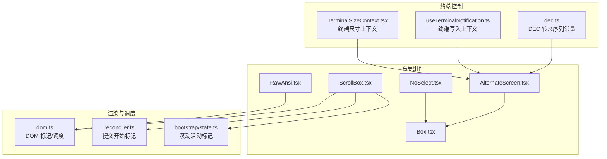
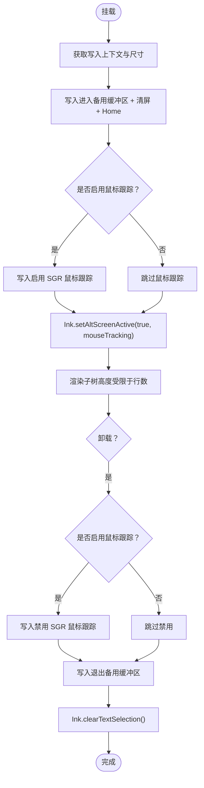
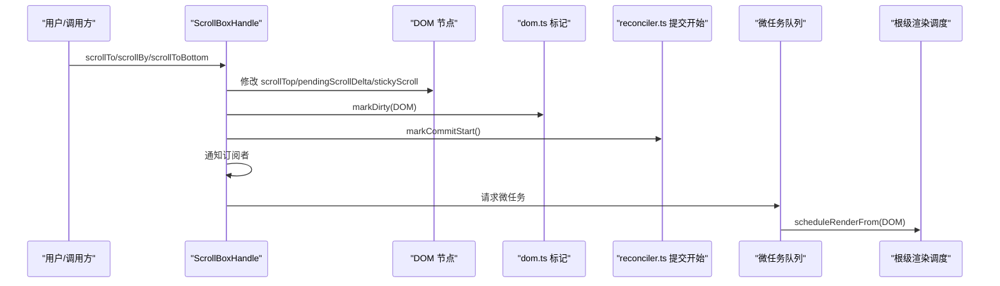
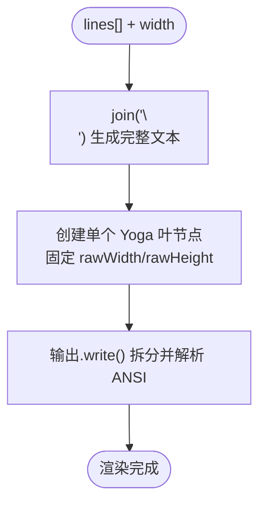
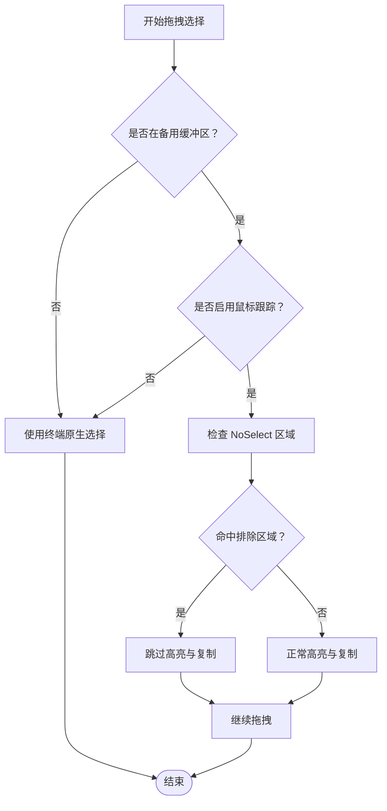
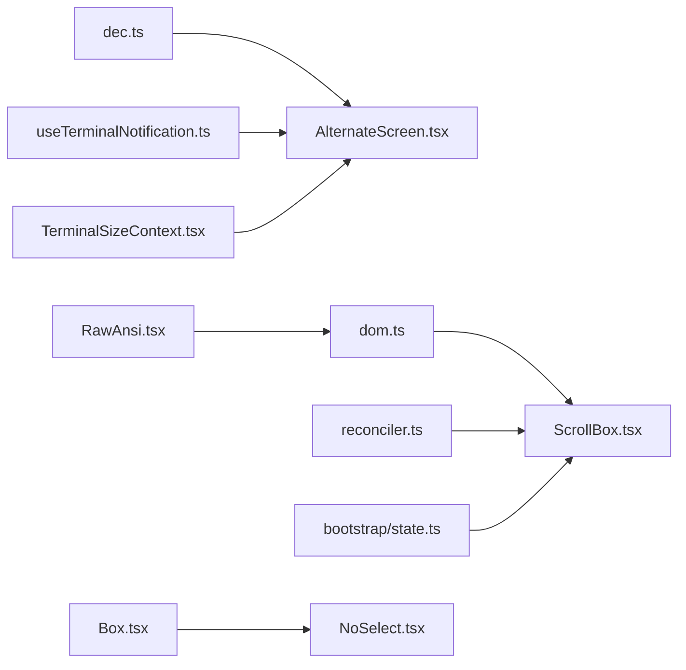

# 布局终端组件

<cite>
**本文档引用的文件**
- [src/ink/components/AlternateScreen.tsx](file://src/ink/components/AlternateScreen.tsx)
- [src/ink/components/ScrollBox.tsx](file://src/ink/components/ScrollBox.tsx)
- [src/ink/components/RawAnsi.tsx](file://src/ink/components/RawAnsi.tsx)
- [src/ink/components/NoSelect.tsx](file://src/ink/components/NoSelect.tsx)
- [src/ink/termio/dec.ts](file://src/ink/termio/dec.ts)
- [src/ink/useTerminalNotification.ts](file://src/ink/useTerminalNotification.ts)
- [src/ink/components/TerminalSizeContext.tsx](file://src/ink/components/TerminalSizeContext.tsx)
- [src/ink/components/Box.tsx](file://src/ink/components/Box.tsx)
- [src/ink/dom.ts](file://src/ink/dom.ts)
- [src/ink/reconciler.ts](file://src/ink/reconciler.ts)
- [src/bootstrap/state.ts](file://src/bootstrap/state.ts)
</cite>

## 目录
1. [简介](#简介)
2. [项目结构](#项目结构)
3. [核心组件](#核心组件)
4. [架构总览](#架构总览)
5. [详细组件分析](#详细组件分析)
6. [依赖关系分析](#依赖关系分析)
7. [性能考量](#性能考量)
8. [故障排查指南](#故障排查指南)
9. [结论](#结论)

## 简介
本文件聚焦 Claude Code 的布局终端组件，系统性解析以下关键组件的设计与实现：
- AlternateScreen：终端备用缓冲区（Alternate Screen Buffer）的进入/退出与鼠标事件处理，以及在全屏覆盖场景中的应用。
- ScrollBox：带滚动的容器，支持粘性滚动、虚拟化裁剪、滚动 API 与滚动高度计算。
- RawAnsi：对已预渲染的 ANSI 输出进行“直通”渲染，跳过 React/Yoga 重序列化开销。
- NoSelect：在备用缓冲区内禁用文本选择的区域，提升复制体验与交互清晰度。

文档将从架构、数据流、处理逻辑、集成点、错误处理与性能优化等维度展开，并提供最佳实践与排障建议。

## 项目结构
这些组件位于 Ink 渲染子系统中，围绕终端渲染管线组织：
- 终端控制与上下文：DEC 转义序列常量、写入上下文、终端尺寸上下文。
- 布局组件：Box、ScrollBox、AlternateScreen、NoSelect。
- 高性能渲染：RawAnsi、DOM/Reconciler 协作、滚动活动标记。
- 全局状态：滚动活动标记用于帧调度协调。



**图表来源**
- [src/ink/termio/dec.ts:1-200](file://src/ink/termio/dec.ts#L1-L200)
- [src/ink/useTerminalNotification.ts:1-200](file://src/ink/useTerminalNotification.ts#L1-L200)
- [src/ink/components/TerminalSizeContext.tsx:1-200](file://src/ink/components/TerminalSizeContext.tsx#L1-L200)
- [src/ink/components/Box.tsx:1-200](file://src/ink/components/Box.tsx#L1-L200)
- [src/ink/components/AlternateScreen.tsx:1-81](file://src/ink/components/AlternateScreen.tsx#L1-L81)
- [src/ink/components/ScrollBox.tsx:1-238](file://src/ink/components/ScrollBox.tsx#L1-L238)
- [src/ink/components/RawAnsi.tsx:1-58](file://src/ink/components/RawAnsi.tsx#L1-L58)
- [src/ink/components/NoSelect.tsx:1-69](file://src/ink/components/NoSelect.tsx#L1-L69)
- [src/ink/dom.ts:1-200](file://src/ink/dom.ts#L1-L200)
- [src/ink/reconciler.ts:1-200](file://src/ink/reconciler.ts#L1-L200)
- [src/bootstrap/state.ts:1-200](file://src/bootstrap/state.ts#L1-L200)

**章节来源**
- [src/ink/components/AlternateScreen.tsx:1-81](file://src/ink/components/AlternateScreen.tsx#L1-L81)
- [src/ink/components/ScrollBox.tsx:1-238](file://src/ink/components/ScrollBox.tsx#L1-L238)
- [src/ink/components/RawAnsi.tsx:1-58](file://src/ink/components/RawAnsi.tsx#L1-L58)
- [src/ink/components/NoSelect.tsx:1-69](file://src/ink/components/NoSelect.tsx#L1-L69)

## 核心组件
- AlternateScreen：进入/退出备用缓冲区，清屏并回 Home；可选启用 SGR 鼠标跟踪；在卸载时恢复主屏幕并清理选择状态。
- ScrollBox：提供滚动 API（滚动到指定位置/元素、相对滚动、底部粘性）、视口裁剪、滚动高度读取、订阅滚动变更。
- RawAnsi：接收已按宽度换行且包含 ANSI 转义码的行数组，直接生成单个 Yoga 叶节点并写入输出，避免 React/Yoga 重序列化成本。
- NoSelect：在备用缓冲区文本选择中禁用某区域的选择，支持从左边缘扩展的排除区域，提升复制体验。

**章节来源**
- [src/ink/components/AlternateScreen.tsx:13-32](file://src/ink/components/AlternateScreen.tsx#L13-L32)
- [src/ink/components/ScrollBox.tsx:72-81](file://src/ink/components/ScrollBox.tsx#L72-L81)
- [src/ink/components/RawAnsi.tsx:13-27](file://src/ink/components/RawAnsi.tsx#L13-L27)
- [src/ink/components/NoSelect.tsx:17-34](file://src/ink/components/NoSelect.tsx#L17-L34)

## 架构总览
下图展示组件间的数据流与调用关系，以及与终端控制和渲染管线的交互。

```mermaid
sequenceDiagram
participant Comp as "组件树"
participant Alt as "AlternateScreen"
participant DEC as "dec.ts"
participant Term as "useTerminalNotification.ts"
participant Ink as "Ink 实例"
participant DOM as "dom.ts"
participant Rend as "reconciler.ts"
Comp->>Alt : 挂载
Alt->>Term : 获取写入上下文
Alt->>DEC : 读取进入/退出备用缓冲区常量
Alt->>Term : writeRaw(进入备用缓冲区 + 清屏 + Home + 可选启用鼠标跟踪)
Alt->>Ink : setAltScreenActive(true, mouseTracking)
Note over Alt,Ink : 备用缓冲区激活，光标限制在视口内
Comp->>Alt : 卸载
Alt->>Ink : setAltScreenActive(false)
Alt->>Ink : clearTextSelection()
Alt->>Term : writeRaw(可选禁用鼠标跟踪 + 退出备用缓冲区)
```

**图表来源**
- [src/ink/components/AlternateScreen.tsx:44-56](file://src/ink/components/AlternateScreen.tsx#L44-L56)
- [src/ink/termio/dec.ts:1-200](file://src/ink/termio/dec.ts#L1-L200)
- [src/ink/useTerminalNotification.ts:1-200](file://src/ink/useTerminalNotification.ts#L1-L200)

## 详细组件分析

### AlternateScreen 组件
- 功能要点
  - 进入备用缓冲区：发送进入备用缓冲区转义序列，清屏并 Home。
  - 可选启用 SGR 鼠标跟踪：滚轮事件作为解析按键事件，点击/拖拽更新 Ink 选择状态。
  - 高度约束：根据终端行数设置自身高度，溢出需通过滚动或 flexbox 处理。
  - 生命周期：挂载时激活备用缓冲区，卸载时恢复主屏幕并清理选择状态。
  - 通知机制：通过 Ink 实例的回调保持光标在视口内，确保信号退出清理也能正确退出备用缓冲区。
- 关键依赖
  - DEC 转义序列常量：进入/退出备用缓冲区、启用/禁用鼠标跟踪。
  - 终端写入上下文：用于直接写入转义序列。
  - 终端尺寸上下文：获取行数以约束高度。
- 使用场景
  - 控制台对话覆盖层（如 ctrl-o 转录覆盖）。
  - 临时全屏视图，不破坏主屏幕内容。



**图表来源**
- [src/ink/components/AlternateScreen.tsx:44-56](file://src/ink/components/AlternateScreen.tsx#L44-L56)
- [src/ink/termio/dec.ts:1-200](file://src/ink/termio/dec.ts#L1-L200)
- [src/ink/useTerminalNotification.ts:1-200](file://src/ink/useTerminalNotification.ts#L1-L200)

**章节来源**
- [src/ink/components/AlternateScreen.tsx:13-32](file://src/ink/components/AlternateScreen.tsx#L13-L32)
- [src/ink/components/AlternateScreen.tsx:44-67](file://src/ink/components/AlternateScreen.tsx#L44-L67)
- [src/ink/components/TerminalSizeContext.tsx:1-200](file://src/ink/components/TerminalSizeContext.tsx#L1-L200)

### ScrollBox 组件
- 功能要点
  - 容器结构：外层视口（overflow: scroll，高度受限），内层内容（flexGrow:1，flexShrink:0）。
  - 视口裁剪：仅渲染可见窗口内的子节点，scrollTop 控制偏移并裁剪边界。
  - 滚动 API：滚动到指定位置、滚动到元素、相对滚动、滚动到底部、查询滚动高度/视口高度/粘性状态等。
  - 粘性滚动：当内容增长时自动贴底，手动滚动会清除粘性。
  - 性能优化：滚动变更直接修改 DOM scrollTop，标记脏、触发根级节流渲染，微任务合并多次滚动事件。
  - 虚拟化边界：通过 clamp 边界限制滚动范围，避免 race 条件导致空白。
- 关键流程
  - 滚动变更 -> 标记脏/提交开始 -> 通知订阅者 -> 微任务队列 -> 调度渲染。
  - 订阅者不包含由渲染器在提交后触发的粘性滚动更新，需以“到达底部”作为后备判断。
- 数据与状态
  - scrollTop/pendingScrollDelta/scrollHeight/scrollViewportHeight/scrollViewportTop/stickyScroll。
  - DOM 属性 stickyScroll 与属性观察配合首帧可用。



**图表来源**
- [src/ink/components/ScrollBox.tsx:103-117](file://src/ink/components/ScrollBox.tsx#L103-L117)
- [src/ink/dom.ts:1-200](file://src/ink/dom.ts#L1-L200)
- [src/ink/reconciler.ts:1-200](file://src/ink/reconciler.ts#L1-L200)

**章节来源**
- [src/ink/components/ScrollBox.tsx:72-81](file://src/ink/components/ScrollBox.tsx#L72-L81)
- [src/ink/components/ScrollBox.tsx:118-204](file://src/ink/components/ScrollBox.tsx#L118-L204)
- [src/ink/components/ScrollBox.tsx:217-234](file://src/ink/components/ScrollBox.tsx#L217-L234)
- [src/bootstrap/state.ts:1-200](file://src/bootstrap/state.ts#L1-L200)

### RawAnsi 组件
- 功能要点
  - 输入：已按终端宽度换行、内嵌 ANSI 转义码的字符串数组。
  - 处理：将数组连接为单个字符串，生成单个 Yoga 叶节点，固定宽度与高度。
  - 输出：直接写入输出流，由底层拆分行并解析 ANSI 到屏幕缓冲区。
  - 性能收益：绕过 <Ansi> → React 树 → Yoga → squash → 重新序列化这一昂贵链路。
- 适用场景
  - 外部渲染器（如 N-API 模块）已产出 ANSI+宽度换行的输出，避免重复解析与布局。



**图表来源**
- [src/ink/components/RawAnsi.tsx:28-56](file://src/ink/components/RawAnsi.tsx#L28-L56)

**章节来源**
- [src/ink/components/RawAnsi.tsx:13-27](file://src/ink/components/RawAnsi.tsx#L13-L27)
- [src/ink/components/RawAnsi.tsx:28-56](file://src/ink/components/RawAnsi.tsx#L28-L56)

### NoSelect 组件
- 功能要点
  - 在备用缓冲区文本选择中禁用某区域的选择，避免复制时包含装饰性内容（如行号、diff 符号、列表符号）。
  - 支持 fromLeftEdge 扩展排除区域至盒模型右边缘，适用于缩进容器内的 gutter。
  - 仅影响备用缓冲区选择（需要在 <AlternateScreen> 且启用鼠标跟踪时生效），主屏幕滚动回溯使用终端原生选择。
- 交互提示
  - 选择拖拽过程中，被标记区域不会高亮也不会进入剪贴板，视觉上更清晰。



**图表来源**
- [src/ink/components/NoSelect.tsx:17-34](file://src/ink/components/NoSelect.tsx#L17-L34)

**章节来源**
- [src/ink/components/NoSelect.tsx:17-34](file://src/ink/components/NoSelect.tsx#L17-L34)
- [src/ink/components/NoSelect.tsx:35-67](file://src/ink/components/NoSelect.tsx#L35-L67)

## 依赖关系分析
- 组件耦合
  - AlternateScreen 依赖 DEC 常量、终端写入上下文、终端尺寸上下文，生命周期与 Ink 实例紧密协作。
  - ScrollBox 与 dom.ts、reconciler.ts、bootstrap/state.ts 协作，实现滚动变更的高效渲染。
  - RawAnsi 与 DOM 渲染管线协作，直接输出文本。
  - NoSelect 依赖 Box 的 noSelect 属性，作用于备用缓冲区选择。
- 外部依赖
  - Yoga 布局引擎（通过 Ink DOM 抽象）。
  - 终端转义序列协议（DEC）。
- 潜在循环依赖
  - 组件间为单向依赖（上下文/工具函数），未见循环导入迹象。



**图表来源**
- [src/ink/termio/dec.ts:1-200](file://src/ink/termio/dec.ts#L1-L200)
- [src/ink/useTerminalNotification.ts:1-200](file://src/ink/useTerminalNotification.ts#L1-L200)
- [src/ink/components/TerminalSizeContext.tsx:1-200](file://src/ink/components/TerminalSizeContext.tsx#L1-L200)
- [src/ink/components/Box.tsx:1-200](file://src/ink/components/Box.tsx#L1-L200)
- [src/ink/components/ScrollBox.tsx:1-238](file://src/ink/components/ScrollBox.tsx#L1-L238)
- [src/ink/components/RawAnsi.tsx:1-58](file://src/ink/components/RawAnsi.tsx#L1-L58)
- [src/ink/components/NoSelect.tsx:1-69](file://src/ink/components/NoSelect.tsx#L1-L69)
- [src/ink/dom.ts:1-200](file://src/ink/dom.ts#L1-L200)
- [src/ink/reconciler.ts:1-200](file://src/ink/reconciler.ts#L1-L200)
- [src/bootstrap/state.ts:1-200](file://src/bootstrap/state.ts#L1-L200)

**章节来源**
- [src/ink/components/AlternateScreen.tsx:1-81](file://src/ink/components/AlternateScreen.tsx#L1-L81)
- [src/ink/components/ScrollBox.tsx:1-238](file://src/ink/components/ScrollBox.tsx#L1-L238)
- [src/ink/components/RawAnsi.tsx:1-58](file://src/ink/components/RawAnsi.tsx#L1-L58)
- [src/ink/components/NoSelect.tsx:1-69](file://src/ink/components/NoSelect.tsx#L1-L69)

## 性能考量
- 滚动性能
  - 直接修改 DOM scrollTop，避免 React 状态同步开销；微任务合并连续滚动事件，减少渲染次数。
  - 使用 pendingScrollDelta 累加快速滚动增量，渲染器在节流速率下消耗该值，保证中间帧可见。
  - stickyScroll 与 setClampBounds 配合，避免 race 导致空白显示。
- 渲染路径
  - ScrollBox 采用视口裁剪与 Yoga 计算，仅渲染可见区域。
  - RawAnsi 绕过 React/Yoga 重序列化，常用于长转录的语法高亮 diff。
- 调度协同
  - 滚动活动通过 markScrollActivity 通知后台任务跳过下一周期，降低滚动卡顿。
- 最佳实践
  - 长列表优先使用 ScrollBox 并开启粘性滚动，结合虚拟化范围设置。
  - 已预渲染的 ANSI 内容使用 RawAnsi，避免重复解析。
  - 在备用缓冲区中使用 NoSelect 标记装饰性区域，提升复制体验。

[本节为通用性能指导，无需特定文件引用]

## 故障排查指南
- 备用缓冲区无法退出
  - 检查卸载时是否正确调用禁用鼠标跟踪与退出备用缓冲区序列。
  - 确认 Ink 实例的 setAltScreenActive(false) 与 clearTextSelection() 是否被调用。
  - 参考：[src/ink/components/AlternateScreen.tsx:52-56](file://src/ink/components/AlternateScreen.tsx#L52-L56)
- 滚动无响应或抖动
  - 确认滚动变更是否通过 DOM 直接修改 scrollTop 并触发 markDirty/markCommitStart/scheduleRenderFrom。
  - 检查 pendingScrollDelta 是否被正确累加与消费。
  - 参考：[src/ink/components/ScrollBox.tsx:103-117](file://src/ink/components/ScrollBox.tsx#L103-L117)
- 粘性滚动不符合预期
  - 手动滚动会清除 stickyScroll；若需保持贴底，避免调用 scrollTo/scrollBy。
  - 参考：[src/ink/components/ScrollBox.tsx:153-161](file://src/ink/components/ScrollBox.tsx#L153-L161)
- ANSI 输出错位或未换行
  - 确保传入 RawAnsi 的 lines 已按 width 换行，且每行长度等于 width。
  - 参考：[src/ink/components/RawAnsi.tsx:4-11](file://src/ink/components/RawAnsi.tsx#L4-L11)
- NoSelect 无效
  - 仅在备用缓冲区且启用鼠标跟踪时生效；主屏幕使用终端原生选择。
  - fromLeftEdge 仅在需要从左边缘扩展排除区域时启用。
  - 参考：[src/ink/components/NoSelect.tsx:31-34](file://src/ink/components/NoSelect.tsx#L31-L34)

**章节来源**
- [src/ink/components/AlternateScreen.tsx:52-56](file://src/ink/components/AlternateScreen.tsx#L52-L56)
- [src/ink/components/ScrollBox.tsx:103-117](file://src/ink/components/ScrollBox.tsx#L103-L117)
- [src/ink/components/RawAnsi.tsx:4-11](file://src/ink/components/RawAnsi.tsx#L4-L11)
- [src/ink/components/NoSelect.tsx:31-34](file://src/ink/components/NoSelect.tsx#L31-L34)

## 结论
- AlternateScreen 提供了安全的备用缓冲区管理与鼠标事件桥接，适合临时全屏覆盖与转录覆盖场景。
- ScrollBox 通过 DOM 直写与视口裁剪实现了高性能滚动，结合粘性滚动与虚拟化边界，满足长内容浏览需求。
- RawAnsi 避免了昂贵的 React/Yoga 重序列化，显著降低长转录渲染成本。
- NoSelect 在备用缓冲区中提升了选择与复制的精确性，改善用户体验。
- 建议在实际工程中结合业务场景合理组合这些组件，并遵循性能与交互最佳实践。