# 核心终端组件

<cite>
**本文档引用的文件**
- [App.tsx](file://src/components/App.tsx)
- [Box.tsx](file://src/ink/components/Box.tsx)
- [Text.tsx](file://src/ink/components/Text.tsx)
- [Button.tsx](file://src/ink/components/Button.tsx)
- [ScrollBox.tsx](file://src/ink/components/ScrollBox.tsx)
- [Messages.tsx](file://src/components/Messages.tsx)
- [Message.tsx](file://src/components/Message.tsx)
</cite>

## 目录
1. [简介](#简介)
2. [项目结构](#项目结构)
3. [核心组件](#核心组件)
4. [架构概览](#架构概览)
5. [详细组件分析](#详细组件分析)
6. [依赖关系分析](#依赖关系分析)
7. [性能考虑](#性能考虑)
8. [故障排除指南](#故障排除指南)
9. [结论](#结论)

## 简介

本文档深入分析 Claude Code 的核心终端组件系统，重点介绍 Ink 组件库中的基础组件以及消息渲染机制。该系统提供了完整的终端界面解决方案，支持丰富的文本格式化、交互式组件和高性能的消息显示功能。

## 项目结构

项目采用模块化架构设计，主要分为以下几个核心部分：

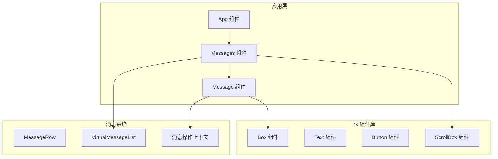

**图表来源**
- [App.tsx:19-55](file://src/components/App.tsx#L19-L55)
- [Messages.tsx:341-721](file://src/components/Messages.tsx#L341-L721)
- [Box.tsx:51-212](file://src/ink/components/Box.tsx#L51-L212)

**章节来源**
- [App.tsx:1-58](file://src/components/App.tsx#L1-L58)
- [Box.tsx:1-215](file://src/ink/components/Box.tsx#L1-L215)
- [Text.tsx:1-255](file://src/ink/components/Text.tsx#L1-L255)
- [Button.tsx:1-193](file://src/ink/components/Button.tsx#L1-L193)
- [ScrollBox.tsx:1-238](file://src/ink/components/ScrollBox.tsx#L1-L238)

## 核心组件

### App 组件 - 应用根容器

App 组件是整个应用的根容器，提供状态管理和上下文提供者：

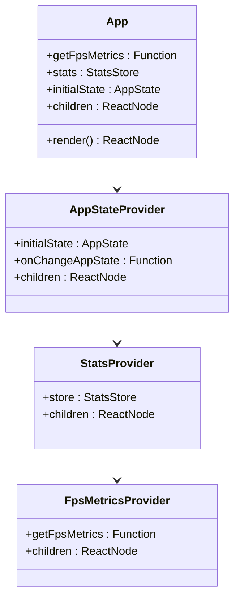

**图表来源**
- [App.tsx:8-26](file://src/components/App.tsx#L8-L26)

App 组件的主要职责：
- 提供 FPS 性能指标监控
- 管理统计信息存储
- 维护应用状态树
- 为子组件提供上下文环境

**章节来源**
- [App.tsx:15-55](file://src/components/App.tsx#L15-L55)

### Box 组件 - 布局容器

Box 组件是 Ink 组件库的基础布局组件，提供 Flexbox 布局能力：

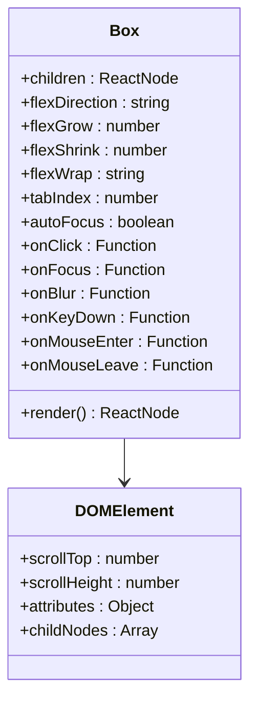

**图表来源**
- [Box.tsx:11-46](file://src/ink/components/Box.tsx#L11-L46)

Box 组件的关键特性：
- 支持完整的 Flexbox 属性
- 内置焦点管理
- 鼠标事件处理
- 样式验证和优化

**章节来源**
- [Box.tsx:48-212](file://src/ink/components/Box.tsx#L48-L212)

### Text 组件 - 文本渲染

Text 组件提供丰富的文本格式化功能：

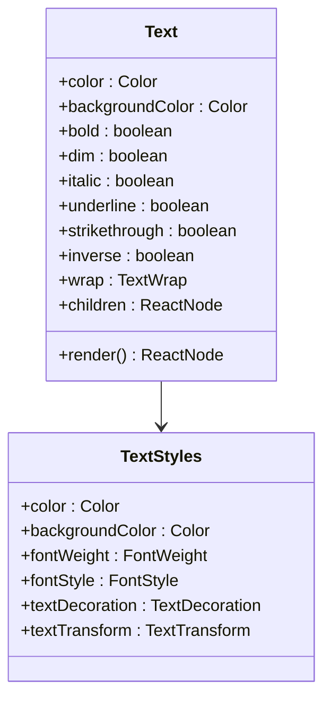

**图表来源**
- [Text.tsx:5-59](file://src/ink/components/Text.tsx#L5-L59)

Text 组件的格式化选项：
- 颜色和背景色设置
- 字体粗细和样式
- 文本装饰效果
- 自动换行控制

**章节来源**
- [Text.tsx:114-253](file://src/ink/components/Text.tsx#L114-L253)

### Button 组件 - 交互按钮

Button 组件提供可访问的按钮控件：

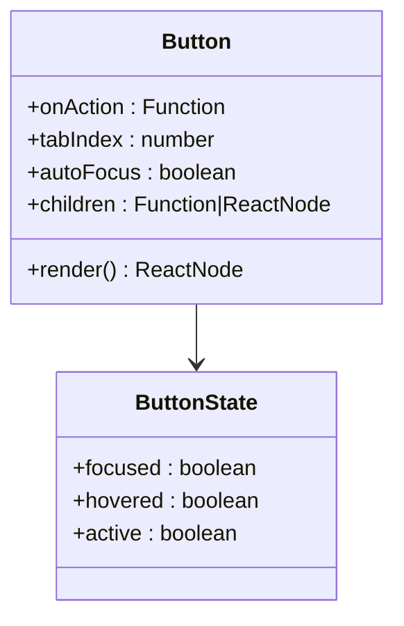

**图表来源**
- [Button.tsx:10-38](file://src/ink/components/Button.tsx#L10-L38)

Button 组件的交互特性：
- 键盘和鼠标事件支持
- 状态管理（聚焦、悬停、激活）
- 渲染回调函数
- 可访问性支持

**章节来源**
- [Button.tsx:39-186](file://src/ink/components/Button.tsx#L39-L186)

### ScrollBox 组件 - 滚动容器

ScrollBox 组件提供高性能的滚动功能：

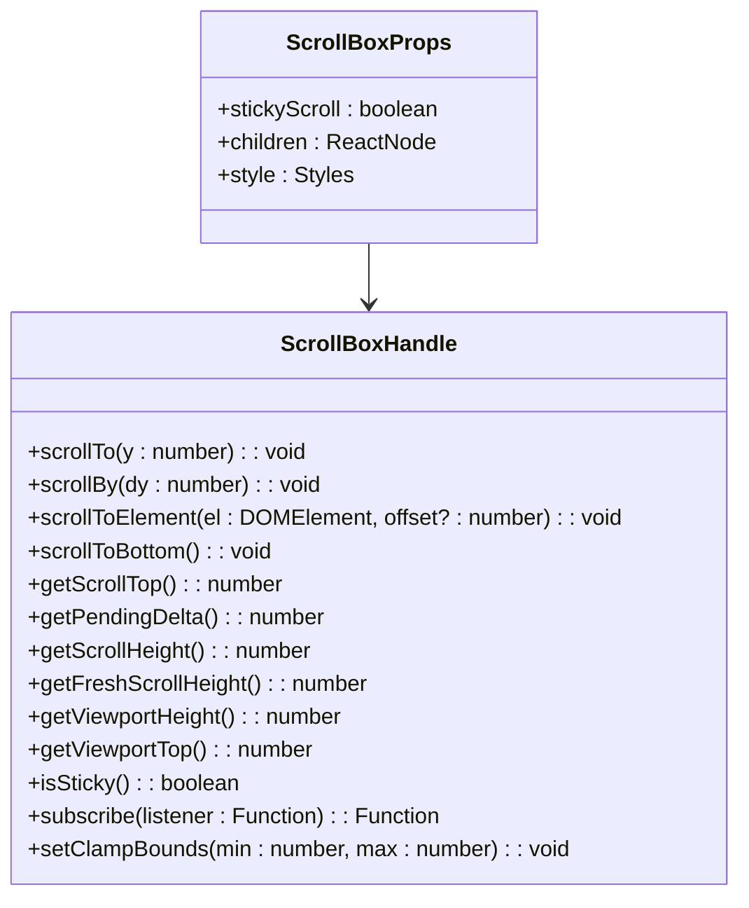

**图表来源**
- [ScrollBox.tsx:10-70](file://src/ink/components/ScrollBox.tsx#L10-L70)

ScrollBox 组件的核心功能：
- 实时滚动控制
- 视口高度计算
- 滚动粘性行为
- 性能优化的渲染策略

**章节来源**
- [ScrollBox.tsx:82-236](file://src/ink/components/ScrollBox.tsx#L82-L236)

## 架构概览

系统采用分层架构设计，从底层的 Ink 组件到上层的应用组件形成清晰的层次结构：

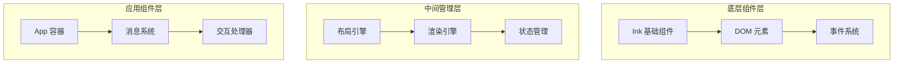

**图表来源**
- [Messages.tsx:341-721](file://src/components/Messages.tsx#L341-L721)
- [Box.tsx:51-212](file://src/ink/components/Box.tsx#L51-L212)

## 详细组件分析

### 消息渲染系统

消息渲染系统是整个终端界面的核心，负责处理各种类型的消息内容：

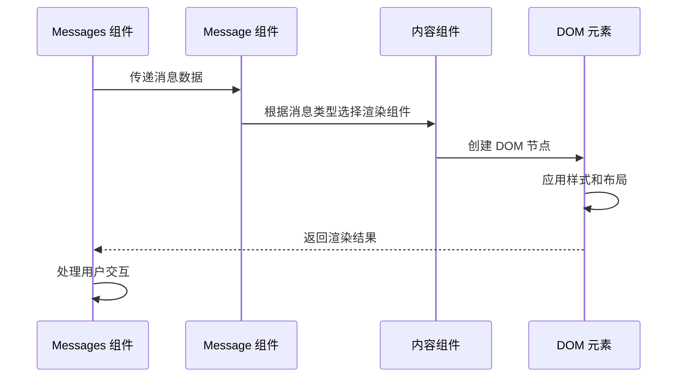

**图表来源**
- [Messages.tsx:614-637](file://src/components/Messages.tsx#L614-L637)
- [Message.tsx:58-355](file://src/components/Message.tsx#L58-L355)

消息系统的处理流程：
1. **消息预处理**：标准化消息格式，过滤空消息
2. **类型分发**：根据消息类型选择相应的渲染组件
3. **内容渲染**：生成具体的 UI 组件
4. **交互绑定**：添加事件监听器和交互逻辑

**章节来源**
- [Messages.tsx:374-721](file://src/components/Messages.tsx#L374-L721)
- [Message.tsx:58-627](file://src/components/Message.tsx#L58-L627)

### 组件组合模式

系统采用多种组件组合模式来实现复杂的功能：

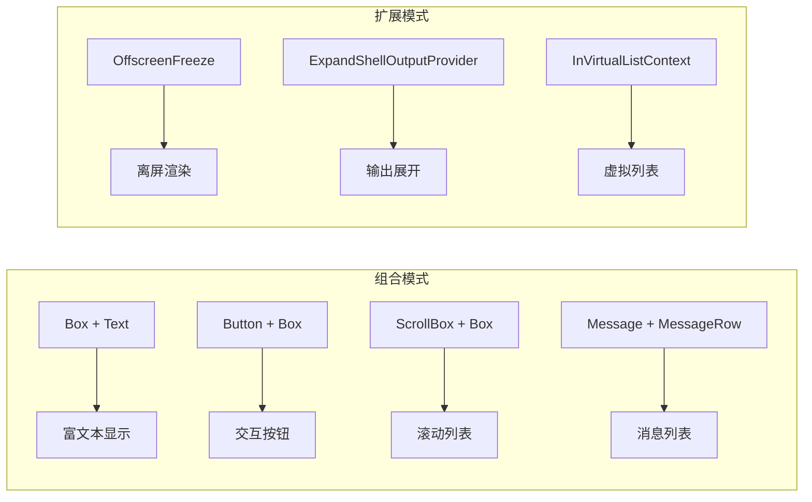

**图表来源**
- [Message.tsx:356-432](file://src/components/Message.tsx#L356-L432)
- [Messages.tsx:699-701](file://src/components/Messages.tsx#L699-L701)

**章节来源**
- [Message.tsx:356-590](file://src/components/Message.tsx#L356-L590)
- [Messages.tsx:677-720](file://src/components/Messages.tsx#L677-L720)

## 依赖关系分析

组件间的依赖关系形成了一个复杂的生态系统：

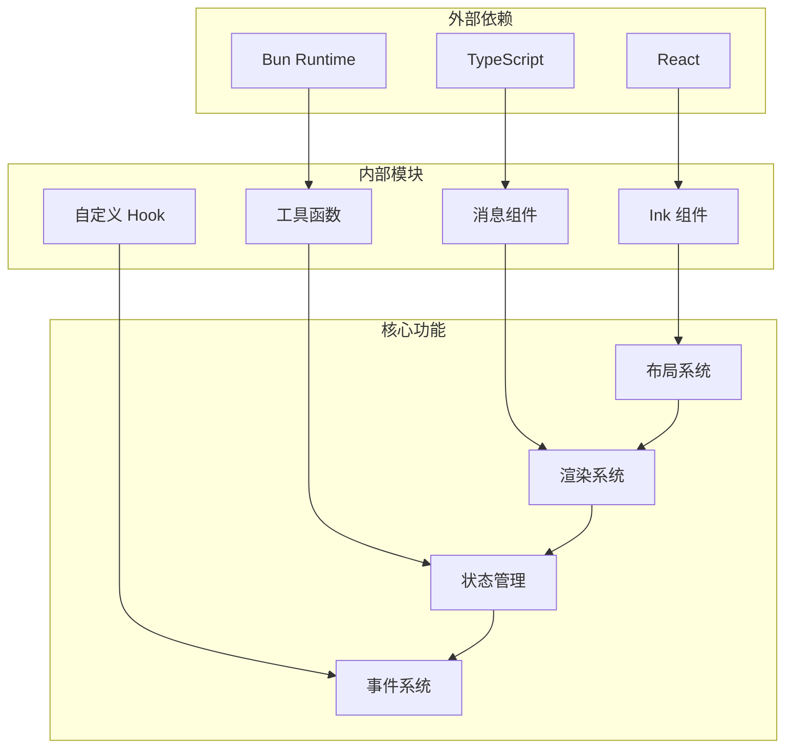

**图表来源**
- [Messages.tsx:1-46](file://src/components/Messages.tsx#L1-L46)
- [Message.tsx:1-16](file://src/components/Message.tsx#L1-L16)

**章节来源**
- [Messages.tsx:1-46](file://src/components/Messages.tsx#L1-L46)
- [Message.tsx:1-16](file://src/components/Message.tsx#L1-L16)

## 性能考虑

系统在多个层面实现了性能优化：

### 渲染优化策略

1. **虚拟滚动**：对于大量消息使用虚拟列表技术
2. **记忆化缓存**：使用 React.memo 和 useMemo 优化重渲染
3. **增量更新**：只更新发生变化的部分
4. **离屏渲染**：对不必要显示的内容进行离屏处理

### 内存管理

- **对象池模式**：复用 DOM 元素和组件实例
- **垃圾回收优化**：及时清理不再使用的引用
- **内存泄漏防护**：确保事件监听器正确移除

### 渲染性能监控

系统内置了完整的性能监控机制：

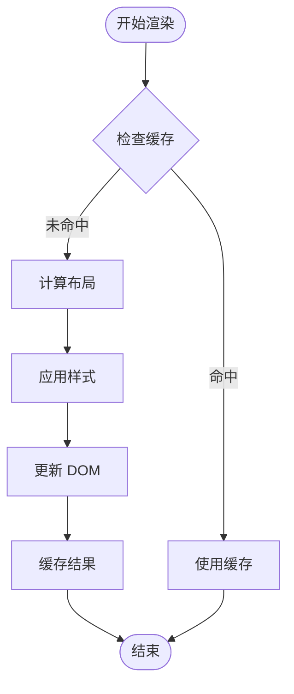

**图表来源**
- [Messages.tsx:315-340](file://src/components/Messages.tsx#L315-L340)

## 故障排除指南

### 常见问题及解决方案

**问题 1：消息渲染异常**
- 检查消息数据格式是否正确
- 验证消息类型映射表
- 确认渲染组件的 props 传递

**问题 2：滚动性能问题**
- 启用虚拟滚动功能
- 检查滚动容器的尺寸设置
- 优化消息列表的渲染频率

**问题 3：内存泄漏**
- 确保事件监听器正确清理
- 检查定时器和订阅的生命周期
- 验证组件卸载时的状态清理

**章节来源**
- [ScrollBox.tsx:103-117](file://src/ink/components/ScrollBox.tsx#L103-L117)
- [Messages.tsx:315-340](file://src/components/Messages.tsx#L315-L340)

## 结论

Claude Code 的核心终端组件系统展现了现代前端架构的最佳实践。通过精心设计的组件体系、高效的渲染机制和完善的性能优化策略，该系统能够提供流畅的终端用户体验。

关键优势包括：
- **模块化设计**：清晰的组件边界和职责分离
- **性能优化**：多层渲染优化和内存管理
- **可扩展性**：灵活的组件组合和扩展机制
- **可维护性**：完善的类型系统和错误处理

该系统为构建复杂的终端应用程序提供了坚实的技术基础，其设计理念和实现方案值得其他项目借鉴和学习。