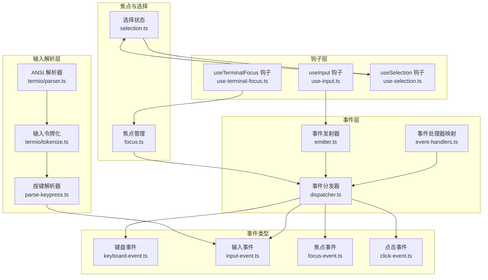
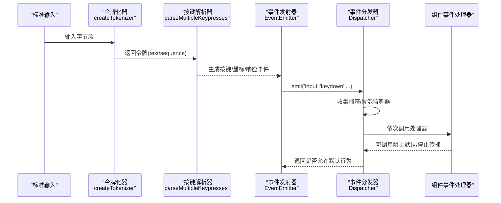
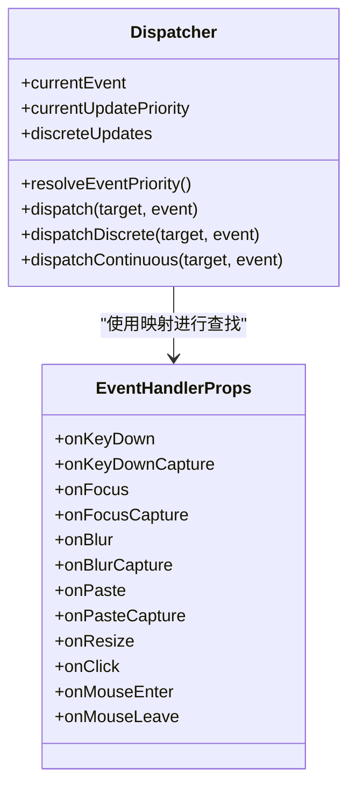
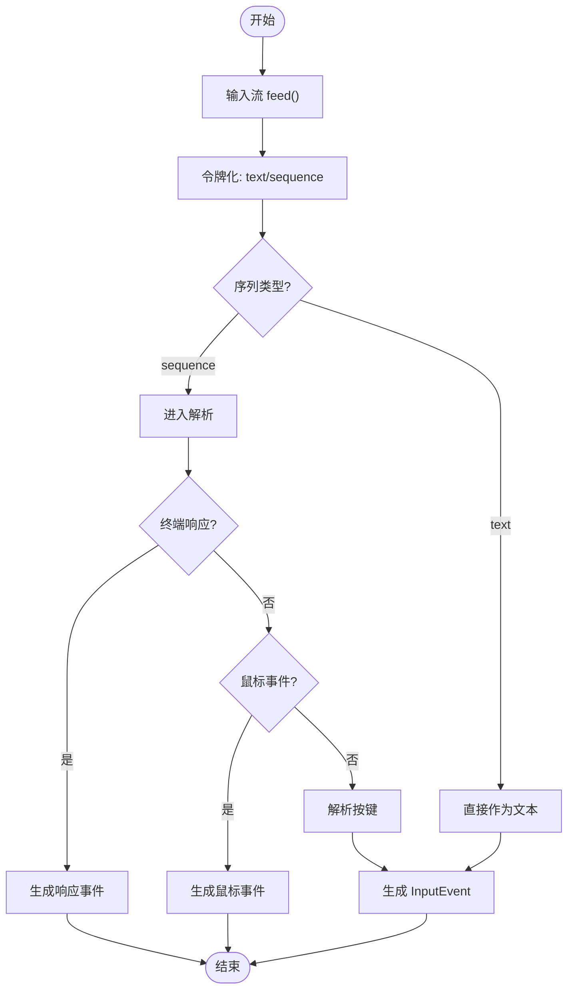
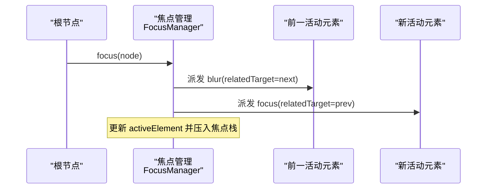
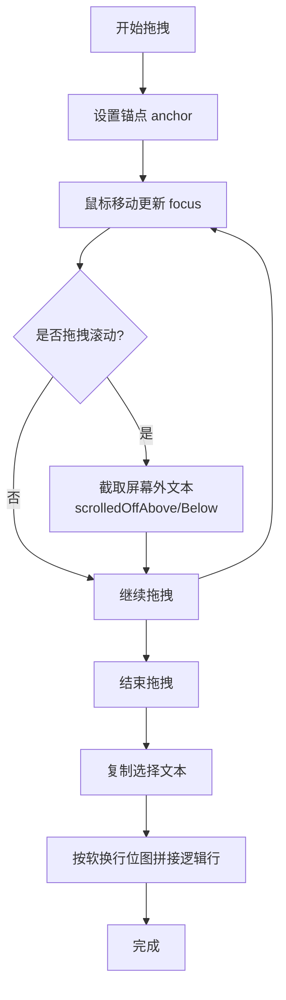
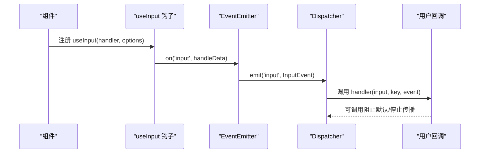
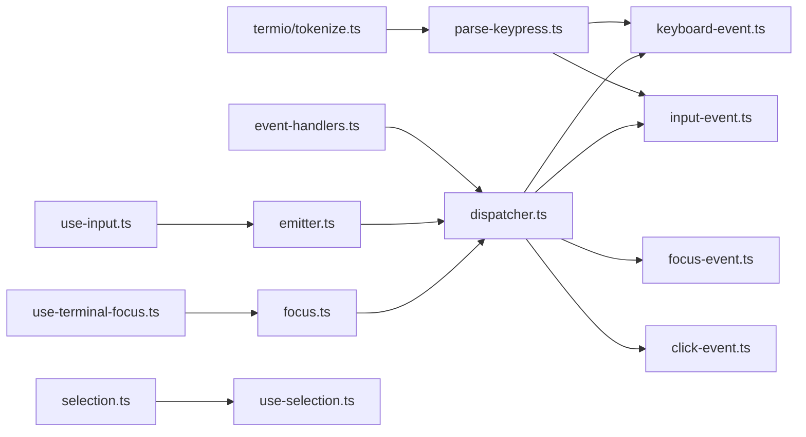

# 终端事件系统

<cite>
**本文引用的文件**
- [dispatcher.ts](file://src/ink/events/dispatcher.ts)
- [emitter.ts](file://src/ink/events/emitter.ts)
- [event-handlers.ts](file://src/ink/events/event-handlers.ts)
- [input-event.ts](file://src/ink/events/input-event.ts)
- [keyboard-event.ts](file://src/ink/events/keyboard-event.ts)
- [focus-event.ts](file://src/ink/events/focus-event.ts)
- [click-event.ts](file://src/ink/events/click-event.ts)
- [use-input.ts](file://src/ink/hooks/use-input.ts)
- [use-terminal-focus.ts](file://src/ink/hooks/use-terminal-focus.ts)
- [use-selection.ts](file://src/ink/hooks/use-selection.ts)
- [parse-keypress.ts](file://src/ink/parse-keypress.ts)
- [focus.ts](file://src/ink/focus.ts)
- [selection.ts](file://src/ink/selection.ts)
- [parser.ts](file://src/ink/termio/parser.ts)
- [tokenize.ts](file://src/ink/termio/tokenize.ts)
- [terminal-focus-state.ts](file://src/ink/terminal-focus-state.ts)
</cite>

## 目录
1. [引言](#引言)
2. [项目结构](#项目结构)
3. [核心组件](#核心组件)
4. [架构总览](#架构总览)
5. [详细组件分析](#详细组件分析)
6. [依赖关系分析](#依赖关系分析)
7. [性能考量](#性能考量)
8. [故障排查指南](#故障排查指南)
9. [结论](#结论)
10. [附录](#附录)

## 引言
本技术文档面向 Ink 终端事件系统，系统性阐述键盘事件、鼠标事件与焦点管理的实现机制，以及事件分发器、事件处理器与事件监听器的工作原理。文档还深入解析终端输入解析器对复杂键盘快捷键与特殊字符序列的处理策略，解释焦点状态管理、文本选择机制与可访问性支持，并提供事件钩子函数（如 useInput、useFocus、useSelection）的使用指南与自定义事件处理器的开发模式及性能优化建议。

## 项目结构
Ink 的事件系统主要位于 src/ink/events 与 src/ink/hooks 目录中，配合 termio 子模块完成 ANSI 序列解析与输入令牌化；焦点与选择逻辑分别在 focus.ts 与 selection.ts 中实现；钩子层通过 use-input.ts、use-terminal-focus.ts、use-selection.ts 暴露给组件使用。

图表来源
- [dispatcher.ts:161-233](file://src/ink/events/dispatcher.ts#L161-L233)
- [event-handlers.ts:44-54](file://src/ink/events/event-handlers.ts#L44-L54)
- [emitter.ts:6-39](file://src/ink/events/emitter.ts#L6-L39)
- [keyboard-event.ts:12-30](file://src/ink/events/keyboard-event.ts#L12-L30)
- [input-event.ts:192-207](file://src/ink/events/input-event.ts#L192-L207)
- [focus-event.ts:11-21](file://src/ink/events/focus-event.ts#L11-L21)
- [click-event.ts:10-39](file://src/ink/events/click-event.ts#L10-L39)
- [parse-keypress.ts:213-302](file://src/ink/parse-keypress.ts#L213-L302)
- [tokenize.ts:57-92](file://src/ink/termio/tokenize.ts#L57-L92)
- [parser.ts:272-394](file://src/ink/termio/parser.ts#L272-L394)
- [focus.ts:15-132](file://src/ink/focus.ts#L15-L132)
- [selection.ts:19-77](file://src/ink/selection.ts#L19-L77)
- [use-input.ts:42-94](file://src/ink/hooks/use-input.ts#L42-L94)
- [use-terminal-focus.ts:13-16](file://src/ink/hooks/use-terminal-focus.ts#L13-L16)
- [use-selection.ts:45-106](file://src/ink/hooks/use-selection.ts#L45-L106)

章节来源
- [dispatcher.ts:161-233](file://src/ink/events/dispatcher.ts#L161-L233)
- [parse-keypress.ts:213-302](file://src/ink/parse-keypress.ts#L213-L302)
- [focus.ts:15-132](file://src/ink/focus.ts#L15-L132)
- [selection.ts:19-77](file://src/ink/selection.ts#L19-L77)
- [use-input.ts:42-94](file://src/ink/hooks/use-input.ts#L42-L94)
- [use-terminal-focus.ts:13-16](file://src/ink/hooks/use-terminal-focus.ts#L13-L16)
- [use-selection.ts:45-106](file://src/ink/hooks/use-selection.ts#L45-L106)

## 核心组件
- 事件分发器：负责两阶段捕获/冒泡派发、优先级推断与离散更新封装，确保用户交互事件的同步高优先级执行。
- 事件处理器映射：将事件类型映射到组件属性名，供渲染器识别事件属性并存储至节点的事件处理器集合。
- 输入解析器：将原始输入流拆分为令牌，再解析为按键、鼠标与响应等语义单元，支持 Kitty 键盘协议、modifyOtherKeys、应用小键盘等多种序列。
- 事件类型：键盘事件、输入事件、焦点事件、点击事件，统一继承自终端事件基类，具备冒泡/可取消等特性。
- 焦点管理：维护活动元素与焦点栈，支持 Tab 导航、自动聚焦、节点移除后的焦点恢复。
- 文本选择：在全屏模式下跟踪锚点/焦点，支持单词/行扩展、拖拽滚动时的行截取与软换行拼接。
- 钩子函数：useInput/useTerminalFocus/useSelection 提供对底层事件与状态的便捷访问。

章节来源
- [dispatcher.ts:161-233](file://src/ink/events/dispatcher.ts#L161-L233)
- [event-handlers.ts:44-54](file://src/ink/events/event-handlers.ts#L44-L54)
- [parse-keypress.ts:213-302](file://src/ink/parse-keypress.ts#L213-L302)
- [keyboard-event.ts:12-30](file://src/ink/events/keyboard-event.ts#L12-L30)
- [input-event.ts:192-207](file://src/ink/events/input-event.ts#L192-L207)
- [focus-event.ts:11-21](file://src/ink/events/focus-event.ts#L11-L21)
- [click-event.ts:10-39](file://src/ink/events/click-event.ts#L10-L39)
- [focus.ts:15-132](file://src/ink/focus.ts#L15-L132)
- [selection.ts:19-77](file://src/ink/selection.ts#L19-L77)
- [use-input.ts:42-94](file://src/ink/hooks/use-input.ts#L42-L94)
- [use-terminal-focus.ts:13-16](file://src/ink/hooks/use-terminal-focus.ts#L13-L16)
- [use-selection.ts:45-106](file://src/ink/hooks/use-selection.ts#L45-L106)

## 架构总览
Ink 的事件系统采用“令牌化 + 语义解析 + 事件分发”的三层架构：
- 令牌化层：识别 ESC 起始的转义序列边界，区分文本与序列，支持 X10 鼠标事件的特殊消费。
- 语义解析层：将序列解释为按键、鼠标事件或终端响应，处理 Kitty 协议、modifyOtherKeys、应用小键盘等复杂场景。
- 事件分发层：基于 React 的两阶段分发模型，结合调度优先级与离散更新，保证交互的即时性与一致性。

图表来源
- [tokenize.ts:57-92](file://src/ink/termio/tokenize.ts#L57-L92)
- [parse-keypress.ts:213-302](file://src/ink/parse-keypress.ts#L213-L302)
- [emitter.ts:15-38](file://src/ink/events/emitter.ts#L15-L38)
- [dispatcher.ts:185-201](file://src/ink/events/dispatcher.ts#L185-L201)

## 详细组件分析

### 事件分发器与事件处理器
- 分发器职责：收集目标到根的捕获链与从目标到根的冒泡链，按顺序执行；支持离散更新（同步高优先级）与连续更新（滚动/鼠标移动等高频事件）。
- 处理器映射：将事件类型映射到 onXxx/onXxxCapture 属性，便于渲染器识别并存入节点的事件处理器集合。
- 事件优先级：根据事件类型推断调度优先级，保证键盘/点击/粘贴等用户交互获得同步优先级。

图表来源
- [dispatcher.ts:161-233](file://src/ink/events/dispatcher.ts#L161-L233)
- [event-handlers.ts:21-38](file://src/ink/events/event-handlers.ts#L21-L38)

章节来源
- [dispatcher.ts:161-233](file://src/ink/events/dispatcher.ts#L161-L233)
- [event-handlers.ts:44-54](file://src/ink/events/event-handlers.ts#L44-L54)

### 输入解析器与键盘事件
- 令牌化：识别 ESC 起始的序列，支持 SS3、CSI、OSC、DCS/APC 等类型；在 stdin 场景下特殊处理 X10 鼠标事件。
- 按键解析：解析 Kitty 键盘协议（CSI u）、modifyOtherKeys、应用小键盘（Ox）、功能键（Fn）与修饰键组合；将序列转换为按键对象，区分打印字符与非打印字符。
- 输入事件：将按键解析结果转换为 InputEvent，提供 keypress、key、input 字段，用于 useInput 钩子与键盘事件分发。

图表来源
- [tokenize.ts:99-319](file://src/ink/termio/tokenize.ts#L99-L319)
- [parse-keypress.ts:213-302](file://src/ink/parse-keypress.ts#L213-L302)
- [input-event.ts:27-190](file://src/ink/events/input-event.ts#L27-L190)

章节来源
- [tokenize.ts:57-92](file://src/ink/termio/tokenize.ts#L57-L92)
- [parse-keypress.ts:611-785](file://src/ink/parse-keypress.ts#L611-L785)
- [input-event.ts:27-190](file://src/ink/events/input-event.ts#L27-L190)

### 焦点管理与焦点事件
- 焦点栈：维护最近的若干个可聚焦元素，支持去重与上限控制；当节点被移除时，从栈中剔除并尝试恢复焦点。
- 导航：支持 Tab/Shift+Tab 在可聚焦元素间循环；点击含 tabIndex 的节点触发聚焦。
- 事件：focus/blur 事件在目标与前一个活动元素之间双向派发，且支持冒泡。

图表来源
- [focus.ts:27-42](file://src/ink/focus.ts#L27-L42)
- [focus-event.ts:11-21](file://src/ink/events/focus-event.ts#L11-L21)

章节来源
- [focus.ts:15-132](file://src/ink/focus.ts#L15-L132)
- [focus-event.ts:11-21](file://src/ink/events/focus-event.ts#L11-L21)

### 文本选择与可访问性
- 选择状态：以锚点与焦点表示线性选择范围，支持单词/行扩展；记录拖拽滚动时截取的屏幕外文本与软换行位图。
- 键盘扩展：支持 shift+方向键扩展选择，支持行首/行尾跳转；键盘滚动时整选跟随内容移动。
- 可访问性：通过 noSelect 标记排除装饰/行号等区域；复制时忽略宽字符的占位单元，保留逻辑行的正确拼接。

图表来源
- [selection.ts:79-134](file://src/ink/selection.ts#L79-L134)
- [selection.ts:389-421](file://src/ink/selection.ts#L389-L421)
- [selection.ts:470-565](file://src/ink/selection.ts#L470-L565)

章节来源
- [selection.ts:19-77](file://src/ink/selection.ts#L19-L77)
- [selection.ts:79-134](file://src/ink/selection.ts#L79-L134)
- [selection.ts:389-421](file://src/ink/selection.ts#L389-L421)
- [selection.ts:470-565](file://src/ink/selection.ts#L470-L565)

### 钩子函数与事件监听器
- useInput：注册输入监听，启用原始模式，过滤 Ctrl+C（若未配置退出），回调签名包含 input、key 与 InputEvent。
- useTerminalFocus：读取 DECSET 1004 聚焦状态，返回布尔值并支持订阅变更。
- useSelection：提供复制/清除/订阅等能力，支持键盘滚动与拖拽滚动的整选跟随。

图表来源
- [use-input.ts:42-94](file://src/ink/hooks/use-input.ts#L42-L94)
- [emitter.ts:15-38](file://src/ink/events/emitter.ts#L15-L38)
- [dispatcher.ts:185-201](file://src/ink/events/dispatcher.ts#L185-L201)

章节来源
- [use-input.ts:42-94](file://src/ink/hooks/use-input.ts#L42-L94)
- [use-terminal-focus.ts:13-16](file://src/ink/hooks/use-terminal-focus.ts#L13-L16)
- [use-selection.ts:45-106](file://src/ink/hooks/use-selection.ts#L45-L106)

## 依赖关系分析
- 事件层依赖于事件处理器映射与事件发射器，分发器负责两阶段派发与优先级控制。
- 输入解析层由令牌化器与解析器组成，解析器进一步产出键盘事件与输入事件。
- 焦点与选择模块独立于事件分发器，但通过事件派发与钩子暴露给上层组件。
- 钩子层依赖底层事件与状态模块，向上提供 React 友好的 API。

图表来源
- [event-handlers.ts:44-54](file://src/ink/events/event-handlers.ts#L44-L54)
- [dispatcher.ts:185-201](file://src/ink/events/dispatcher.ts#L185-L201)
- [tokenize.ts:57-92](file://src/ink/termio/tokenize.ts#L57-L92)
- [parse-keypress.ts:213-302](file://src/ink/parse-keypress.ts#L213-L302)
- [input-event.ts:192-207](file://src/ink/events/input-event.ts#L192-L207)
- [keyboard-event.ts:12-30](file://src/ink/events/keyboard-event.ts#L12-L30)
- [focus-event.ts:11-21](file://src/ink/events/focus-event.ts#L11-L21)
- [click-event.ts:10-39](file://src/ink/events/click-event.ts#L10-L39)
- [focus.ts:15-132](file://src/ink/focus.ts#L15-L132)
- [selection.ts:19-77](file://src/ink/selection.ts#L19-L77)
- [use-input.ts:42-94](file://src/ink/hooks/use-input.ts#L42-L94)
- [use-terminal-focus.ts:13-16](file://src/ink/hooks/use-terminal-focus.ts#L13-L16)
- [use-selection.ts:45-106](file://src/ink/hooks/use-selection.ts#L45-L106)

章节来源
- [dispatcher.ts:161-233](file://src/ink/events/dispatcher.ts#L161-L233)
- [parse-keypress.ts:213-302](file://src/ink/parse-keypress.ts#L213-L302)
- [focus.ts:15-132](file://src/ink/focus.ts#L15-L132)
- [selection.ts:19-77](file://src/ink/selection.ts#L19-L77)
- [use-input.ts:42-94](file://src/ink/hooks/use-input.ts#L42-L94)
- [use-terminal-focus.ts:13-16](file://src/ink/hooks/use-terminal-focus.ts#L13-L16)
- [use-selection.ts:45-106](file://src/ink/hooks/use-selection.ts#L45-L106)

## 性能考量
- 令牌化与解析：使用流式 tokenizer 与增量解析，避免一次性大块解析带来的阻塞；在 stdin 场景下谨慎启用 X10 鼠标消费，防止误吞输出序列。
- 事件分发：高频事件（resize/scroll/mousemove）使用连续优先级，低频交互（keydown/click/focus/paste）使用离散优先级，减少不必要的重渲染。
- 输入处理：useInput 在布局阶段启用原始模式，确保输入立即生效；避免在 isActive 切换时反复添加/移除监听，保持监听器稳定位置以维持 stopImmediatePropagation 的顺序。
- 选择与渲染：选择状态在拖拽滚动时仅截取必要行并缓存软换行位图，复制时按逻辑行拼接，避免重复计算与多余渲染。

## 故障排查指南
- 输入未生效：确认 useInput 已在布局阶段启用原始模式；检查内部是否因 Ctrl+C 退出而拦截了输入。
- 快捷键不识别：核对解析器对 Kitty 协议、modifyOtherKeys、应用小键盘的支持；检查序列是否被误判为终端响应或鼠标事件。
- 焦点异常：检查 tabIndex 设置与焦点栈长度；节点移除后应自动恢复焦点；若无焦点，确认焦点管理器未被禁用。
- 选择异常：确认全屏模式下的鼠标跟踪已启用；拖拽滚动时需先截取屏幕外文本；复制时注意软换行与宽字符占位单元的处理。

章节来源
- [use-input.ts:50-60](file://src/ink/hooks/use-input.ts#L50-L60)
- [parse-keypress.ts:630-673](file://src/ink/parse-keypress.ts#L630-L673)
- [focus.ts:57-82](file://src/ink/focus.ts#L57-L82)
- [selection.ts:79-134](file://src/ink/selection.ts#L79-L134)

## 结论
Ink 的终端事件系统通过清晰的分层设计与严格的优先级控制，实现了对复杂键盘快捷键、鼠标事件与焦点管理的稳健支持。输入解析器覆盖主流终端协议与序列变体，事件分发器遵循 React 的两阶段模型，钩子层提供简洁易用的 API。结合选择与焦点管理，系统在性能与可用性之间取得良好平衡，适合构建高性能、可访问的终端界面。

## 附录
- 自定义事件处理器开发模式
  - 使用事件处理器映射将事件类型绑定到组件属性，确保渲染器正确识别事件属性。
  - 在需要同步响应的交互（如键盘输入、点击）中，利用离散更新封装，确保回调在高优先级上下文中执行。
  - 对高频事件（滚动、鼠标移动）使用连续优先级，避免过度重渲染。
- 性能优化建议
  - 将昂贵的事件处理逻辑放入离散更新之外的异步任务，或使用节流/防抖。
  - 在输入处理中尽量复用解析结果，避免重复解析同一序列。
  - 选择状态的截取与拼接应限制在必要范围内，避免对整个屏幕缓冲区进行扫描。