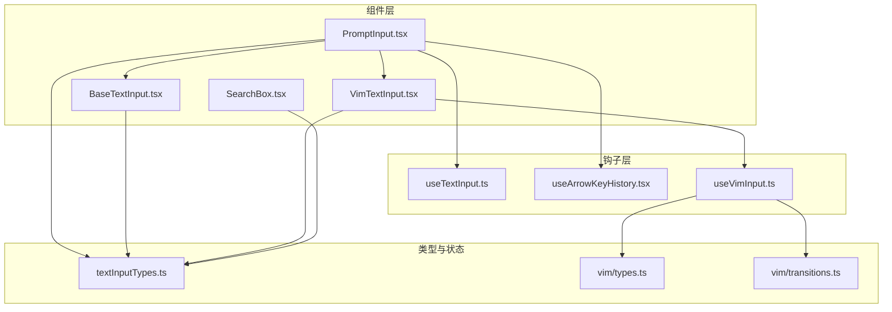
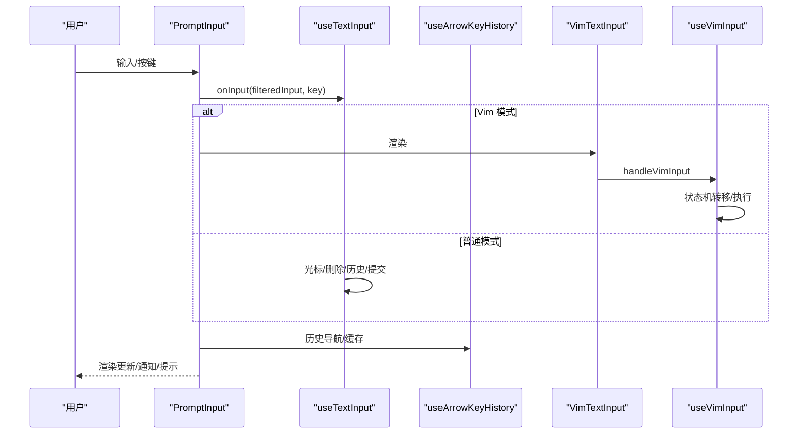
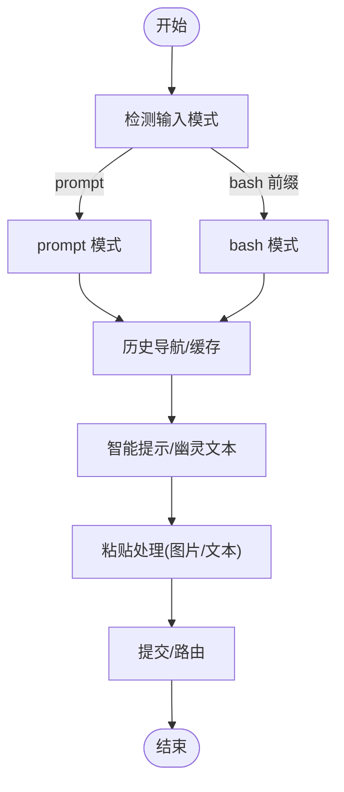
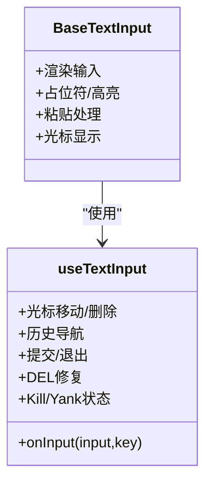
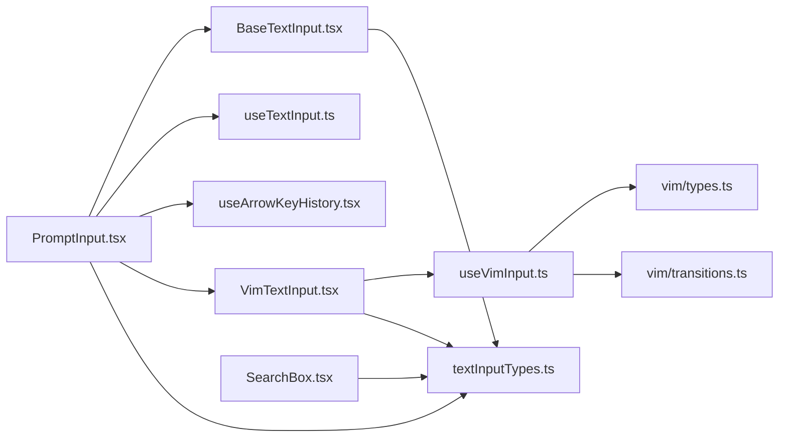

# 输入组件

<cite>
**本文引用的文件**
- [src/components/PromptInput/inputModes.ts](file://src/components/PromptInput/inputModes.ts)
- [src/components/PromptInput/PromptInput.tsx](file://src/components/PromptInput/PromptInput.tsx)
- [src/components/PromptInput/utils.ts](file://src/components/PromptInput/utils.ts)
- [src/components/BaseTextInput.tsx](file://src/components/BaseTextInput.tsx)
- [src/components/VimTextInput.tsx](file://src/components/VimTextInput.tsx)
- [src/components/SearchBox.tsx](file://src/components/SearchBox.tsx)
- [src/hooks/useTextInput.ts](file://src/hooks/useTextInput.ts)
- [src/hooks/useArrowKeyHistory.tsx](file://src/hooks/useArrowKeyHistory.tsx)
- [src/hooks/useVimInput.ts](file://src/hooks/useVimInput.ts)
- [src/types/textInputTypes.ts](file://src/types/textInputTypes.ts)
- [src/vim/types.ts](file://src/vim/types.ts)
- [src/vim/transitions.ts](file://src/vim/transitions.ts)
</cite>

## 目录
1. [引言](#引言)
2. [项目结构](#项目结构)
3. [核心组件](#核心组件)
4. [架构总览](#架构总览)
5. [详细组件分析](#详细组件分析)
6. [依赖关系分析](#依赖关系分析)
7. [性能考量](#性能考量)
8. [故障排查指南](#故障排查指南)
9. [结论](#结论)
10. [附录](#附录)

## 引言
本文件系统性梳理 Claude Code 的输入组件体系，重点覆盖 PromptInput 主输入框、基础文本输入、Vim 模式输入、搜索框与文件路径输入等模块。文档围绕以下目标展开：设计理念（多模式输入、快捷键支持、智能提示）、PromptInput 实现细节（模式切换、历史记录管理、自动完成）、特殊输入组件（Vim 模式、搜索框、文件路径输入）、输入验证与格式化（实时校验、错误提示、数据转换）、定制指南（扩展输入功能与新增输入模式）以及性能优化与用户体验提升策略。

## 项目结构
输入组件主要分布在 components 与 hooks 两个层面，并辅以 vim 状态机与类型定义支撑：

- 组件层
  - PromptInput：主输入框，负责模式切换、历史检索、智能提示、粘贴处理、快捷键路由、通知与状态管理。
  - BaseTextInput：通用基础文本输入渲染与事件处理。
  - VimTextInput：基于 useVimInput 的 Vim 编辑器模式输入。
  - SearchBox：搜索输入框，支持光标定位与占位提示。
- 钩子层
  - useTextInput：通用文本输入逻辑（光标移动、删除、粘贴、历史导航、提交）。
  - useArrowKeyHistory：箭头键历史浏览与缓存加载。
  - useVimInput：Vim 模式状态机与键盘映射。
- 类型与状态
  - textInputTypes：输入组件通用类型、模式枚举、队列命令类型等。
  - vim/types、vim/transitions：Vim 状态机类型与转移表。



图表来源
- [src/components/PromptInput/PromptInput.tsx](file://src/components/PromptInput/PromptInput.tsx)
- [src/components/BaseTextInput.tsx](file://src/components/BaseTextInput.tsx)
- [src/components/VimTextInput.tsx](file://src/components/VimTextInput.tsx)
- [src/components/SearchBox.tsx](file://src/components/SearchBox.tsx)
- [src/hooks/useTextInput.ts](file://src/hooks/useTextInput.ts)
- [src/hooks/useArrowKeyHistory.tsx](file://src/hooks/useArrowKeyHistory.tsx)
- [src/hooks/useVimInput.ts](file://src/hooks/useVimInput.ts)
- [src/types/textInputTypes.ts](file://src/types/textInputTypes.ts)
- [src/vim/types.ts](file://src/vim/types.ts)
- [src/vim/transitions.ts](file://src/vim/transitions.ts)

章节来源
- [src/components/PromptInput/PromptInput.tsx](file://src/components/PromptInput/PromptInput.tsx)
- [src/components/BaseTextInput.tsx](file://src/components/BaseTextInput.tsx)
- [src/components/VimTextInput.tsx](file://src/components/VimTextInput.tsx)
- [src/components/SearchBox.tsx](file://src/components/SearchBox.tsx)
- [src/hooks/useTextInput.ts](file://src/hooks/useTextInput.ts)
- [src/hooks/useArrowKeyHistory.tsx](file://src/hooks/useArrowKeyHistory.tsx)
- [src/hooks/useVimInput.ts](file://src/hooks/useVimInput.ts)
- [src/types/textInputTypes.ts](file://src/types/textInputTypes.ts)
- [src/vim/types.ts](file://src/vim/types.ts)
- [src/vim/transitions.ts](file://src/vim/transitions.ts)

## 核心组件
- PromptInput：多模式输入入口，支持 prompt/bash/权限通知等模式；集成历史检索、智能提示、粘贴处理、快捷键路由、通知与状态管理；通过 useTextInput/useVimInput 提供统一输入行为。
- BaseTextInput：封装渲染、占位符、高亮、光标、粘贴处理与 Ink 键盘事件绑定。
- VimTextInput：在 BaseTextInput 基础上叠加 useVimInput，提供 Vim 插入/普通模式与完整状态机。
- SearchBox：轻量搜索输入框，支持前缀、占位符、边框与光标定位。
- useTextInput：通用文本输入逻辑，涵盖 Ctrl/Meta/方向键映射、多行换行、历史导航、提交、剪贴板与粘贴内容处理。
- useArrowKeyHistory：历史记录分块加载、模式过滤、缓存与索引管理、搜索提示。
- useVimInput：Vim 模式状态机（INSERT/NORMAL），命令解析与执行、重复与寄存器、撤销重放。
- 类型系统：textInputTypes 定义输入模式、队列命令、输入状态、回调接口等；vim/types 与 vim/transitions 定义 Vim 状态机与转移规则。

章节来源
- [src/components/PromptInput/PromptInput.tsx](file://src/components/PromptInput/PromptInput.tsx)
- [src/components/BaseTextInput.tsx](file://src/components/BaseTextInput.tsx)
- [src/components/VimTextInput.tsx](file://src/components/VimTextInput.tsx)
- [src/components/SearchBox.tsx](file://src/components/SearchBox.tsx)
- [src/hooks/useTextInput.ts](file://src/hooks/useTextInput.ts)
- [src/hooks/useArrowKeyHistory.tsx](file://src/hooks/useArrowKeyHistory.tsx)
- [src/hooks/useVimInput.ts](file://src/hooks/useVimInput.ts)
- [src/types/textInputTypes.ts](file://src/types/textInputTypes.ts)
- [src/vim/types.ts](file://src/vim/types.ts)
- [src/vim/transitions.ts](file://src/vim/transitions.ts)

## 架构总览
PromptInput 作为中枢，协调各输入组件与钩子，形成“模式识别—历史检索—智能提示—提交”的闭环。VimTextInput 通过 useVimInput 将 Vim 状态机注入到通用输入流程中；BaseTextInput 负责底层渲染与事件；SearchBox 用于搜索场景；useTextInput/useArrowKeyHistory 提供一致的键盘与历史交互语义。



图表来源
- [src/components/PromptInput/PromptInput.tsx](file://src/components/PromptInput/PromptInput.tsx)
- [src/hooks/useTextInput.ts](file://src/hooks/useTextInput.ts)
- [src/hooks/useArrowKeyHistory.tsx](file://src/hooks/useArrowKeyHistory.tsx)
- [src/components/VimTextInput.tsx](file://src/components/VimTextInput.tsx)
- [src/hooks/useVimInput.ts](file://src/hooks/useVimInput.ts)

## 详细组件分析

### PromptInput 组件
- 设计理念
  - 多模式输入：通过模式识别与前缀字符切换 prompt/bash 等模式；支持权限通知与任务通知模式。
  - 快捷键支持：统一键盘事件映射，结合终端特性（如 Apple_Terminal 的 Shift 检测）与配置项（Shift+Enter、Backslash+Return）。
  - 智能提示：与 useTypeahead 协作，提供命令建议、参数提示与内联幽灵文本；在搜索历史或历史命中时高亮匹配片段。
- 关键实现
  - 模式切换：onChange 中根据输入首字符判断模式并调用 onModeChange；粘贴进入空输入时自动识别模式并剥离前缀。
  - 历史管理：useArrowKeyHistory 提供 up/down 导航、缓存分块加载、模式过滤、草稿保存与恢复、搜索提示。
  - 粘贴处理：图片粘贴生成占位符并缓存路径；长文本粘贴生成文本占位符；支持懒插入空格避免与图片 pill 连写。
  - 提交流程：onSubmit 合并建议接受、直接消息发送、图像存在性检查、队列命令编辑弹出、多代理提交路由。
  - 高亮与占位：组合多种触发词（思考关键词、ultraplan/ultrareview/buddy、@成员、斜杠命令、令牌预算、Slack 频道）的高亮与闪烁效果。
- 数据流
  - 输入值与游标偏移由外部传入并在内部跟踪；通过 insertTextRef 支持语音转写等外部插入；通过 useMaybeTruncateInput 控制输入长度与粘贴内容。
  - 队列命令与推测（speculation）在提交时参与决策，避免重复提交与吞掉 footer 打开状态。



图表来源
- [src/components/PromptInput/PromptInput.tsx](file://src/components/PromptInput/PromptInput.tsx)
- [src/hooks/useArrowKeyHistory.tsx](file://src/hooks/useArrowKeyHistory.tsx)
- [src/hooks/useTextInput.ts](file://src/hooks/useTextInput.ts)

章节来源
- [src/components/PromptInput/PromptInput.tsx](file://src/components/PromptInput/PromptInput.tsx)
- [src/components/PromptInput/inputModes.ts](file://src/components/PromptInput/inputModes.ts)
- [src/components/PromptInput/utils.ts](file://src/components/PromptInput/utils.ts)
- [src/hooks/useArrowKeyHistory.tsx](file://src/hooks/useArrowKeyHistory.tsx)
- [src/hooks/useTextInput.ts](file://src/hooks/useTextInput.ts)

### BaseTextInput 与 useTextInput
- BaseTextInput
  - 负责渲染、占位符、高亮、光标、粘贴处理与 Ink 键盘事件绑定；支持参数化反转、降色与内联幽灵文本。
- useTextInput
  - 统一键盘映射：Ctrl/Meta/方向键、Home/End/PageUp/PageDown、Enter/Newline、DEL/Backspace/Delete、Ctrl+K/U/W、Yank/Pop。
  - 多行换行：支持 Backslash+Return 与 Shift+Enter（含 Apple_Terminal 特殊处理）。
  - 历史导航：向上/向下键在禁用光标移动时委托给历史钩子。
  - 提交与退出：Enter 触发 onSubmit；Ctrl+C 双击清空并记录历史；Ctrl+D 在空输入时退出。
  - DEL 字符修复：在 SSH/tmux 环境中同步应用多个 DEL 为多次退格，避免冲突。
  - Kill/Yank 状态：维护 kill ring 与 yank 状态，支持链式 yank-pop。



图表来源
- [src/components/BaseTextInput.tsx](file://src/components/BaseTextInput.tsx)
- [src/hooks/useTextInput.ts](file://src/hooks/useTextInput.ts)

章节来源
- [src/components/BaseTextInput.tsx](file://src/components/BaseTextInput.tsx)
- [src/hooks/useTextInput.ts](file://src/hooks/useTextInput.ts)

### VimTextInput 与 useVimInput
- VimTextInput
  - 包装 BaseTextInput，注入 useVimInput 的输入状态与模式；支持初始模式设置、模式变更回调、光标偏移与输入过滤。
- useVimInput
  - 状态机：INSERT/NORMAL 两态，INSERT 跟踪最近插入文本用于 “.” 重放；NORMAL 使用命令状态机（idle/count/operator/operatorCount/find/g/replace/indent 等）。
  - 输入过滤：在 INSERT 模式应用 inputFilter，在 NORMAL 模式仅用于预处理但不改变输入字符串。
  - ESC/Enter 行为：INSERT 模式下 ESC 切换至 NORMAL；Enter 无论模式均允许提交。
  - Motion 映射：将方向键映射为 h/j/k/l；Backspace/Delete 在期望运动的状态下映射为 h/x。
  - 重放与撤销：记录最近变更，支持 onDotRepeat 与 onUndo 回调。

```mermaid
stateDiagram-v2
[*] --> INSERT
[*] --> NORMAL
state INSERT {
[*] --> Typing
Typing --> INSERT : "继续输入"
Typing --> NORMAL : "ESC"
}
state NORMAL {
[*] --> idle
idle --> count : "数字"
idle --> operator : "操作符"
idle --> find : "f/F/t/T"
idle --> g : "g"
idle --> replace : "r"
idle --> indent : "><"
operator --> operatorCount : "数字"
operator --> operatorFind : "f/F/t/T"
operator --> operatorTextObj : "a/i"
operatorCount --> execute : "motion"
operatorTextObj --> execute : "text object"
find --> execute : "char"
g --> operatorG : "g"
operatorG --> execute : "motion"
replace --> execute : "char"
indent --> execute : ">"
}
```

图表来源
- [src/hooks/useVimInput.ts](file://src/hooks/useVimInput.ts)
- [src/vim/types.ts](file://src/vim/types.ts)
- [src/vim/transitions.ts](file://src/vim/transitions.ts)

章节来源
- [src/components/VimTextInput.tsx](file://src/components/VimTextInput.tsx)
- [src/hooks/useVimInput.ts](file://src/hooks/useVimInput.ts)
- [src/vim/types.ts](file://src/vim/types.ts)
- [src/vim/transitions.ts](file://src/vim/transitions.ts)

### 搜索框与文件路径输入
- SearchBox
  - 支持前缀、占位符、边框样式、光标偏移渲染；在聚焦状态下可显示当前光标位置字符的反显。
- 文件路径输入
  - 通过 IDE @mention 机制将相对路径与行号范围插入到输入框；在非空白前插入空格保证语法正确性。

章节来源
- [src/components/SearchBox.tsx](file://src/components/SearchBox.tsx)
- [src/components/PromptInput/PromptInput.tsx](file://src/components/PromptInput/PromptInput.tsx)

### 输入验证与格式化
- 实时验证
  - 智能提示与幽灵文本在输入过程中动态计算与渲染，减少歧义。
  - 高亮系统对命令、令牌预算、Slack 频道、@成员、图片引用等进行可视化提示。
- 错误提示
  - 通过通知系统展示“Esc 再次清空”、“粘贴阈值”、“外部编辑器失败”等即时反馈。
- 数据转换
  - 粘贴文本清洗：去除 ANSI、规范化换行、制表符替换为空格；长文本转为占位符并延迟存储。
  - 图片粘贴：生成唯一 ID、缓存路径、后台落盘、插入 [Image #N] 引用；懒插入空格避免与后续字符连写。
  - 模式转换：输入首字符识别与剥离、历史条目模式解析与恢复。

章节来源
- [src/components/PromptInput/PromptInput.tsx](file://src/components/PromptInput/PromptInput.tsx)
- [src/hooks/useTextInput.ts](file://src/hooks/useTextInput.ts)
- [src/components/PromptInput/inputModes.ts](file://src/components/PromptInput/inputModes.ts)

### 定制指南
- 新增输入模式
  - 在 textInputTypes.ts 中扩展 PromptInputMode；在 inputModes.ts 中增加模式识别与值提取函数；在 PromptInput.tsx 中处理 onChange/onSubmit 的模式分支。
- 扩展快捷键
  - 在 useTextInput.ts 的 mapKey 中添加键位映射；在 PromptInput.tsx 中注册新动作处理器（如 chat:stash、chat:externalEditor 等）。
- 自定义输入过滤
  - 通过 inputFilter 参数在 useTextInput/useVimInput 中实现输入拦截与转换（如懒空格插入）。
- 集成智能提示
  - 通过 useTypeahead 注入命令、参数与目录建议；在 PromptInput 中合并提示状态与提交逻辑。
- Vim 模式扩展
  - 在 vim/types.ts 增加状态与操作类型；在 vim/transitions.ts 添加转移规则；在 useVimInput 中接入新操作上下文。

章节来源
- [src/types/textInputTypes.ts](file://src/types/textInputTypes.ts)
- [src/components/PromptInput/inputModes.ts](file://src/components/PromptInput/inputModes.ts)
- [src/components/PromptInput/PromptInput.tsx](file://src/components/PromptInput/PromptInput.tsx)
- [src/hooks/useTextInput.ts](file://src/hooks/useTextInput.ts)
- [src/hooks/useVimInput.ts](file://src/hooks/useVimInput.ts)
- [src/vim/types.ts](file://src/vim/types.ts)
- [src/vim/transitions.ts](file://src/vim/transitions.ts)

## 依赖关系分析
- 组件耦合
  - PromptInput 依赖 BaseTextInput/useTextInput/useArrowKeyHistory/VimTextInput/useVimInput，形成输入中枢。
  - VimTextInput 依赖 useVimInput，useVimInput 依赖 vim/types 与 vim/transitions。
- 外部依赖
  - Ink 渲染与键盘事件；全局配置与环境变量；历史持久化与粘贴内容存储。
- 循环依赖
  - 未发现循环依赖；各模块职责清晰，类型定义前置。



图表来源
- [src/components/PromptInput/PromptInput.tsx](file://src/components/PromptInput/PromptInput.tsx)
- [src/components/BaseTextInput.tsx](file://src/components/BaseTextInput.tsx)
- [src/components/VimTextInput.tsx](file://src/components/VimTextInput.tsx)
- [src/components/SearchBox.tsx](file://src/components/SearchBox.tsx)
- [src/hooks/useTextInput.ts](file://src/hooks/useTextInput.ts)
- [src/hooks/useArrowKeyHistory.tsx](file://src/hooks/useArrowKeyHistory.tsx)
- [src/hooks/useVimInput.ts](file://src/hooks/useVimInput.ts)
- [src/types/textInputTypes.ts](file://src/types/textInputTypes.ts)
- [src/vim/types.ts](file://src/vim/types.ts)
- [src/vim/transitions.ts](file://src/vim/transitions.ts)

章节来源
- [src/components/PromptInput/PromptInput.tsx](file://src/components/PromptInput/PromptInput.tsx)
- [src/components/BaseTextInput.tsx](file://src/components/BaseTextInput.tsx)
- [src/components/VimTextInput.tsx](file://src/components/VimTextInput.tsx)
- [src/components/SearchBox.tsx](file://src/components/SearchBox.tsx)
- [src/hooks/useTextInput.ts](file://src/hooks/useTextInput.ts)
- [src/hooks/useArrowKeyHistory.tsx](file://src/hooks/useArrowKeyHistory.tsx)
- [src/hooks/useVimInput.ts](file://src/hooks/useVimInput.ts)
- [src/types/textInputTypes.ts](file://src/types/textInputTypes.ts)
- [src/vim/types.ts](file://src/vim/types.ts)
- [src/vim/transitions.ts](file://src/vim/transitions.ts)

## 性能考量
- 历史加载批量化与缓存
  - useArrowKeyHistory 采用 HISTORY_CHUNK_SIZE 分块加载与 pendingLoad 共享，避免频繁磁盘读取与竞态。
- 渲染窗口化
  - BaseTextInput 与 useTextInput 通过 viewportCharOffset/viewportCharEnd 限制渲染范围，降低大文本重绘成本。
- 输入缓冲与去抖
  - useInputBuffer 对输入变更进行去抖与最大容量控制，平衡撤销链长度与内存占用。
- 懒插入与粘贴优化
  - 图片粘贴后懒插入空格，避免不必要的回车；长文本粘贴转为占位符，减少渲染负担。
- 终端特性适配
  - Apple_Terminal 的修饰键预热与 Shift+Enter 检测，减少键盘事件解析开销。

章节来源
- [src/hooks/useArrowKeyHistory.tsx](file://src/hooks/useArrowKeyHistory.tsx)
- [src/hooks/useTextInput.ts](file://src/hooks/useTextInput.ts)
- [src/components/BaseTextInput.tsx](file://src/components/BaseTextInput.tsx)
- [src/components/PromptInput/PromptInput.tsx](file://src/components/PromptInput/PromptInput.tsx)

## 故障排查指南
- 输入无响应或异常
  - 检查 useTextInput 的 inputFilter 是否返回空串导致事件被丢弃；确认 keybindings 是否屏蔽了特定键。
- 历史无法翻阅
  - 确认 useArrowKeyHistory 的缓存模式过滤是否与当前模式一致；检查 pendingLoad 是否被中断。
- Vim 模式行为异常
  - 检查 useVimInput 的状态机转移是否正确；确认 ESC/Enter/方向键映射是否被覆盖。
- 粘贴内容未显示
  - 检查粘贴阈值与长文本占位符生成逻辑；确认图片缓存路径是否可用。
- 快捷键冲突
  - 检查 PromptInput 中的动作处理器是否被 footer 或其他上下文接管；核对 keybindings 配置。

章节来源
- [src/hooks/useTextInput.ts](file://src/hooks/useTextInput.ts)
- [src/hooks/useArrowKeyHistory.tsx](file://src/hooks/useArrowKeyHistory.tsx)
- [src/hooks/useVimInput.ts](file://src/hooks/useVimInput.ts)
- [src/components/PromptInput/PromptInput.tsx](file://src/components/PromptInput/PromptInput.tsx)

## 结论
输入组件体系以 PromptInput 为核心，通过 BaseTextInput/useTextInput 提供统一的键盘与渲染语义，通过 useArrowKeyHistory 与 useVimInput 分别解决历史导航与 Vim 模式两大复杂场景。类型系统与状态机定义使代码具备强一致性与可扩展性。通过批量化历史加载、渲染窗口化、输入缓冲与粘贴优化等手段，系统在复杂交互下仍保持良好性能与体验。按本文定制指南可安全扩展新模式与快捷键，同时维持整体稳定性。

## 附录
- 关键类型与状态
  - PromptInputMode：prompt/bash/orphaned-permission/task-notification
  - VimMode：INSERT/NORMAL
  - QueuedCommand：携带模式、优先级、粘贴内容与来源元数据
- 建议实践
  - 新增模式时先完善类型与模式识别函数，再在 PromptInput 中接入；Vim 扩展遵循状态机最小改动原则；所有输入过滤与转换集中在 useTextInput/useVimInput，避免分散逻辑。