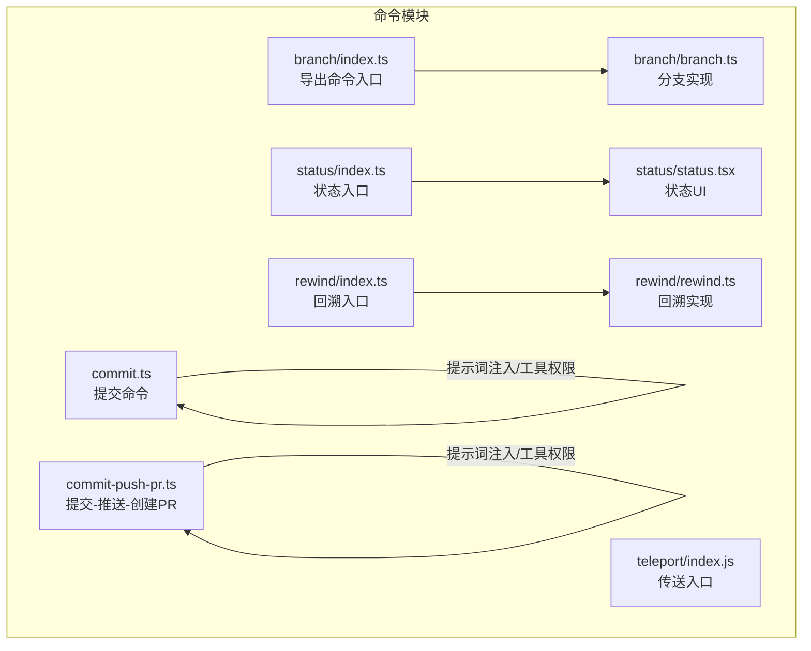
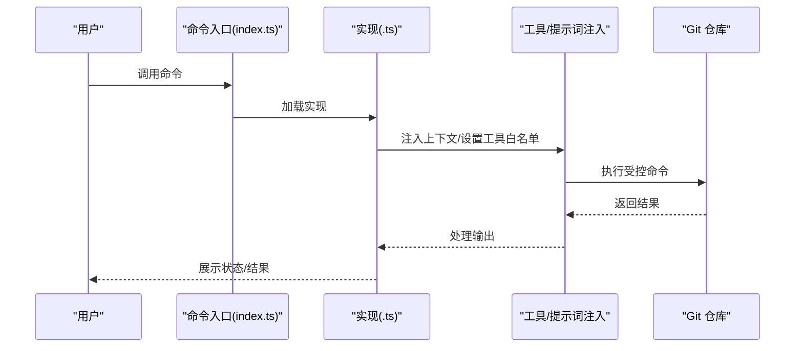
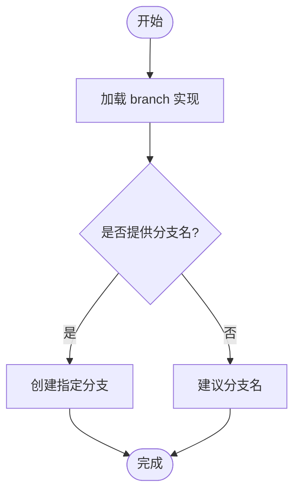
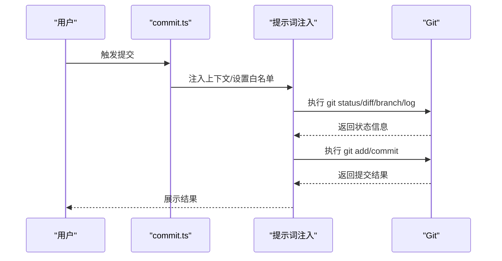
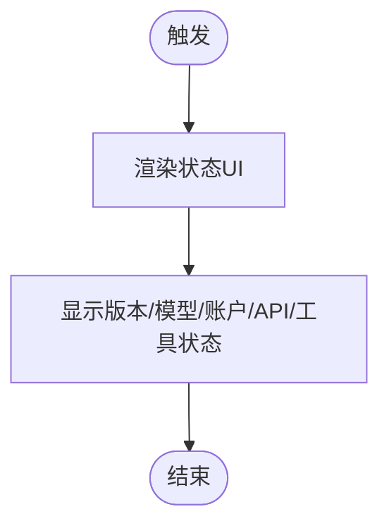
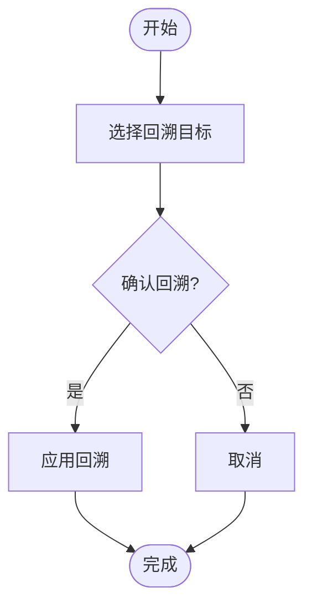
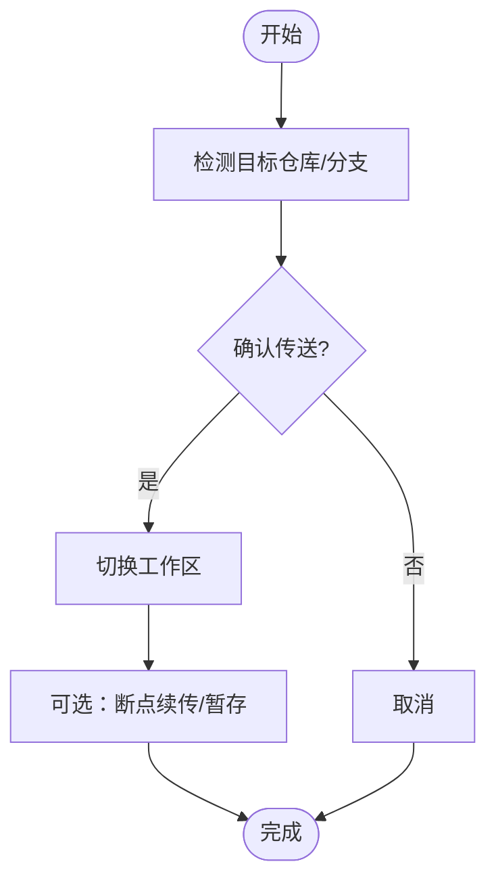
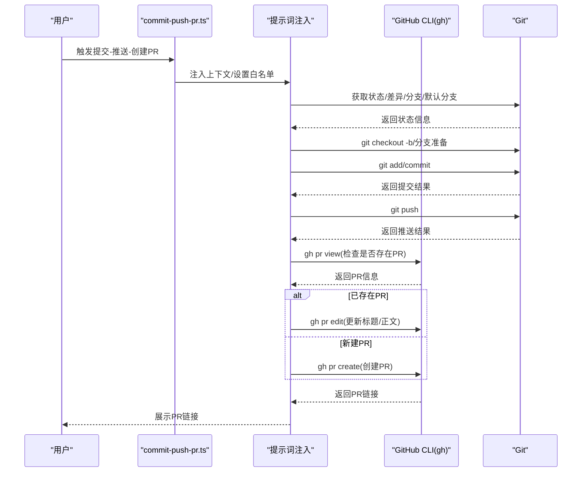
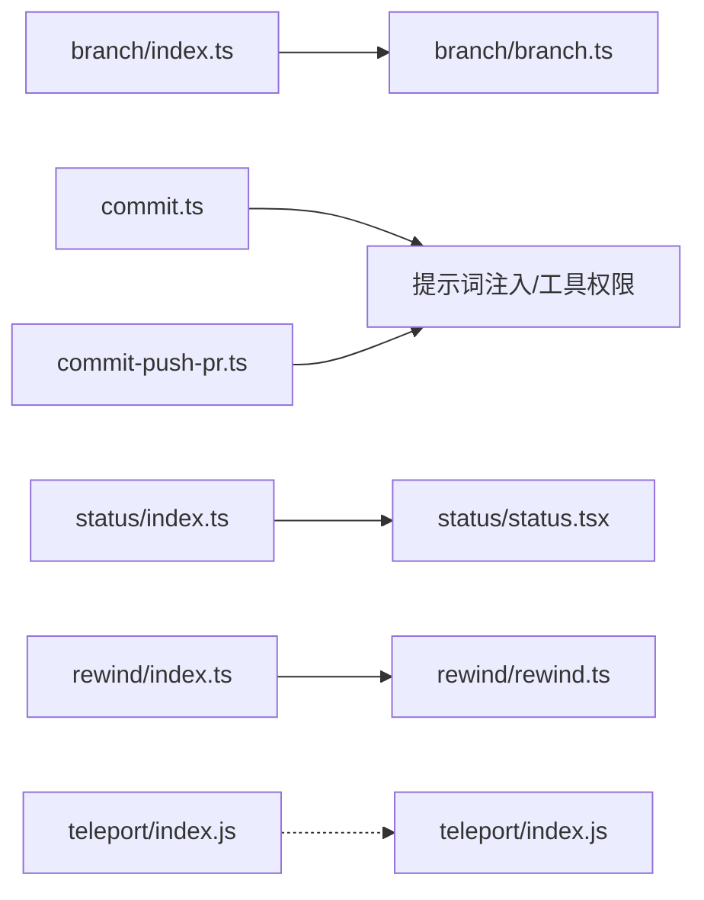

# Git 命令

<cite>
**本文引用的文件**
- [src/commands/branch/index.ts](file://src/commands/branch/index.ts)
- [src/commands/branch/branch.ts](file://src/commands/branch/branch.ts)
- [src/commands/commit.ts](file://src/commands/commit.ts)
- [src/commands/status/index.ts](file://src/commands/status/index.ts)
- [src/commands/status/status.tsx](file://src/commands/status/status.tsx)
- [src/commands/rewind/index.ts](file://src/commands/rewind/index.ts)
- [src/commands/rewind/rewind.ts](file://src/commands/rewind/rewind.ts)
- [src/commands/teleport/index.js](file://src/commands/teleport/index.js)
- [src/commands/commit-push-pr.ts](file://src/commands/commit-push-pr.ts)
</cite>

## 目录
1. [简介](#简介)
2. [项目结构](#项目结构)
3. [核心组件](#核心组件)
4. [架构总览](#架构总览)
5. [详细组件分析](#详细组件分析)
6. [依赖关系分析](#依赖关系分析)
7. [性能考量](#性能考量)
8. [故障排查指南](#故障排查指南)
9. [结论](#结论)
10. [附录](#附录)

## 简介
本文件系统性梳理与 Git 相关的命令实现，重点覆盖以下命令：branch（分支）、commit（提交）、status（状态）、rewind（回溯）、teleport（传送）、commit-push-pr（提交-推送-创建 PR）。文档从架构、数据流、处理逻辑、集成点、错误处理与性能等方面进行深入解析，并提供最佳实践与常见问题解决方案，帮助读者理解命令如何与 Git 仓库交互以及在安全方面的约束。

## 项目结构
- 命令入口统一由各命令目录下的 index.ts 导出，声明命令类型、别名、描述、加载器等元信息。
- 具体实现位于同名 .ts 文件中，部分命令还包含本地 UI 组件（如 status 的 JSX 组件）。
- 通用工具与安全协议通过工具函数与提示词注入的方式参与命令执行。

**图表来源**
- [src/commands/branch/index.ts](file://src/commands/branch/index.ts)
- [src/commands/branch/branch.ts](file://src/commands/branch/branch.ts)
- [src/commands/commit.ts](file://src/commands/commit.ts)
- [src/commands/status/index.ts](file://src/commands/status/index.ts)
- [src/commands/status/status.tsx](file://src/commands/status/status.tsx)
- [src/commands/rewind/index.ts](file://src/commands/rewind/index.ts)
- [src/commands/rewind/rewind.ts](file://src/commands/rewind/rewind.ts)
- [src/commands/teleport/index.js](file://src/commands/teleport/index.js)
- [src/commands/commit-push-pr.ts](file://src/commands/commit-push-pr.ts)

**章节来源**
- [src/commands/branch/index.ts](file://src/commands/branch/index.ts)
- [src/commands/branch/branch.ts](file://src/commands/branch/branch.ts)
- [src/commands/commit.ts](file://src/commands/commit.ts)
- [src/commands/status/index.ts](file://src/commands/status/index.ts)
- [src/commands/status/status.tsx](file://src/commands/status/status.tsx)
- [src/commands/rewind/index.ts](file://src/commands/rewind/index.ts)
- [src/commands/rewind/rewind.ts](file://src/commands/rewind/rewind.ts)
- [src/commands/teleport/index.js](file://src/commands/teleport/index.js)
- [src/commands/commit-push-pr.ts](file://src/commands/commit-push-pr.ts)

## 核心组件
- branch（分支）
  - 类型：本地 JS/JSX 命令
  - 别名：当特定特性开关开启时提供 fork 别名；否则不启用
  - 功能：在当前对话快照处创建一个新分支，用于后续独立开发或实验
  - 参数：可选分支名
  - 安全：通过命令入口控制加载，避免与 fork 子代理冲突
- commit（提交）
  - 类型：提示词驱动命令（prompt）
  - 工具白名单：仅允许 git add、git status、git commit
  - 安全协议：禁止修改配置、禁止跳过钩子、禁止 amend（除非用户明确要求）、禁止交互式命令、禁止提交敏感文件
  - 行为：动态注入上下文（状态、diff、分支、最近提交），生成一次提交的完整指令
- status（状态）
  - 类型：本地 JS/JSX 命令
  - 功能：展示 Claude Code 版本、模型、账户、API 连接性、工具状态等
  - 触发：立即执行（immediate）
- rewind（回溯）
  - 类型：本地命令
  - 别名：checkpoint
  - 功能：将代码与/或对话恢复到之前的某个时间点
  - 交互：非非交互模式（不支持自动批处理）
- teleport（传送）
  - 类型：本地命令
  - 功能：将工作区切换到指定仓库/分支，支持断点续传、暂存等
  - 交互：非非交互模式（不支持自动批处理）
- commit-push-pr（提交-推送-创建 PR）
  - 类型：提示词驱动命令（prompt）
  - 工具白名单：包含 git 分支/添加/状态/推送、git commit、gh pr create/edit/view/merge，以及 Slack 工具
  - 安全协议：禁止强制推送、禁止跳过钩子、禁止修改配置、禁止交互式命令、禁止提交敏感文件
  - 行为：默认分支检测、单次提交、推送、PR 创建/更新、可选 Slack 通知、返回 PR 链接

**章节来源**
- [src/commands/branch/index.ts](file://src/commands/branch/index.ts)
- [src/commands/commit.ts](file://src/commands/commit.ts)
- [src/commands/status/index.ts](file://src/commands/status/index.ts)
- [src/commands/status/status.tsx](file://src/commands/status/status.tsx)
- [src/commands/rewind/index.ts](file://src/commands/rewind/index.ts)
- [src/commands/teleport/index.js](file://src/commands/teleport/index.js)
- [src/commands/commit-push-pr.ts](file://src/commands/commit-push-pr.ts)

## 架构总览
命令层通过“入口 index.ts + 实现文件”的模式组织，提示词驱动命令在执行前会注入上下文并设置工具权限白名单，确保只调用受控工具。安全协议以提示词形式内嵌，结合环境变量与 undercover 模式进行条件化调整。

**图表来源**
- [src/commands/commit.ts](file://src/commands/commit.ts)
- [src/commands/commit-push-pr.ts](file://src/commands/commit-push-pr.ts)

## 详细组件分析

### branch（分支）命令
- 功能
  - 在当前对话快照处创建新分支，便于隔离实验或并行开发
  - 支持可选分支名参数
- 参数与行为
  - 可选参数：分支名
  - 别名策略：根据特性开关决定是否启用 fork 别名
- 与仓库交互
  - 通过命令加载器延迟加载实现，避免与 fork 冲突
- 安全与限制
  - 作为本地命令，不直接执行 Git 操作，具体分支创建逻辑在实现文件中定义

**图表来源**
- [src/commands/branch/index.ts](file://src/commands/branch/index.ts)
- [src/commands/branch/branch.ts](file://src/commands/branch/branch.ts)

**章节来源**
- [src/commands/branch/index.ts](file://src/commands/branch/index.ts)
- [src/commands/branch/branch.ts](file://src/commands/branch/branch.ts)

### commit（提交）命令
- 功能
  - 基于当前工作区状态与上下文，生成并执行一次 Git 提交
- 上下文注入
  - 自动注入 git status、diff、当前分支、最近提交等信息
- 工具白名单
  - git add、git status、git commit
- 安全协议
  - 禁止修改配置、禁止跳过钩子、禁止 amend（除非用户明确要求）、禁止交互式命令、禁止提交敏感文件
- 输出
  - 一次性提交，返回提交结果

**图表来源**
- [src/commands/commit.ts](file://src/commands/commit.ts)

**章节来源**
- [src/commands/commit.ts](file://src/commands/commit.ts)

### status（状态）命令
- 功能
  - 展示 Claude Code 的版本、模型、账户、API 连接性、工具状态等
- 触发方式
  - 立即执行（immediate），适合快速检查运行状态
- 与 UI 结合
  - 通过 status.tsx 组件渲染状态界面

**图表来源**
- [src/commands/status/index.ts](file://src/commands/status/index.ts)
- [src/commands/status/status.tsx](file://src/commands/status/status.tsx)

**章节来源**
- [src/commands/status/index.ts](file://src/commands/status/index.ts)
- [src/commands/status/status.tsx](file://src/commands/status/status.tsx)

### rewind（回溯）命令
- 功能
  - 将代码与/或对话恢复到之前的某个时间点
- 交互特性
  - 不支持非交互模式（不适用于自动化批处理）
- 使用场景
  - 回滚到上一个稳定状态、撤销错误变更、重置对话上下文

**图表来源**
- [src/commands/rewind/index.ts](file://src/commands/rewind/index.ts)
- [src/commands/rewind/rewind.ts](file://src/commands/rewind/rewind.ts)

**章节来源**
- [src/commands/rewind/index.ts](file://src/commands/rewind/index.ts)
- [src/commands/rewind/rewind.ts](file://src/commands/rewind/rewind.ts)

### teleport（传送）命令
- 功能
  - 将工作区切换到指定仓库/分支，支持断点续传与暂存
- 交互特性
  - 不支持非交互模式（不适用于自动化批处理）
- 使用场景
  - 快速在不同仓库/分支间切换、迁移开发环境

**图表来源**
- [src/commands/teleport/index.js](file://src/commands/teleport/index.js)

**章节来源**
- [src/commands/teleport/index.js](file://src/commands/teleport/index.js)

### commit-push-pr（提交-推送-创建 PR）命令
- 功能
  - 自动完成“提交 -> 推送 -> 创建/更新 PR”的完整流程
- 上下文注入
  - 注入当前用户、仓库状态、默认分支差异、已存在 PR 信息等
- 工具白名单
  - git 分支/添加/状态/推送、git commit、gh pr create/edit/view/merge、Slack 工具
- 安全协议
  - 禁止强制推送、禁止跳过钩子、禁止修改配置、禁止交互式命令、禁止提交敏感文件
- 流程要点
  - 默认分支检测与分支命名策略
  - 单次提交与提交信息生成
  - 推送分支至远端
  - 若已有 PR，则更新标题与正文；否则创建 PR
  - 可选 Slack 通知（基于用户指示与工具搜索结果）
  - 返回 PR 链接

**图表来源**
- [src/commands/commit-push-pr.ts](file://src/commands/commit-push-pr.ts)

**章节来源**
- [src/commands/commit-push-pr.ts](file://src/commands/commit-push-pr.ts)

## 依赖关系分析
- 命令入口与实现解耦：index.ts 仅负责声明命令元信息，实现文件负责具体逻辑，降低耦合度
- 工具白名单与提示词注入：通过工具白名单限制命令可调用的外部工具，通过提示词注入动态获取仓库上下文
- 安全协议集中化：安全规则以提示词形式内嵌，结合环境变量与 undercover 模式进行条件化调整
- UI 组件分离：状态命令包含独立的 UI 组件，便于在不同运行环境中展示一致的状态信息

**图表来源**
- [src/commands/branch/index.ts](file://src/commands/branch/index.ts)
- [src/commands/branch/branch.ts](file://src/commands/branch/branch.ts)
- [src/commands/commit.ts](file://src/commands/commit.ts)
- [src/commands/status/index.ts](file://src/commands/status/index.ts)
- [src/commands/status/status.tsx](file://src/commands/status/status.tsx)
- [src/commands/rewind/index.ts](file://src/commands/rewind/index.ts)
- [src/commands/rewind/rewind.ts](file://src/commands/rewind/rewind.ts)
- [src/commands/teleport/index.js](file://src/commands/teleport/index.js)
- [src/commands/commit-push-pr.ts](file://src/commands/commit-push-pr.ts)

**章节来源**
- [src/commands/branch/index.ts](file://src/commands/branch/index.ts)
- [src/commands/branch/branch.ts](file://src/commands/branch/branch.ts)
- [src/commands/commit.ts](file://src/commands/commit.ts)
- [src/commands/status/index.ts](file://src/commands/status/index.ts)
- [src/commands/status/status.tsx](file://src/commands/status/status.tsx)
- [src/commands/rewind/index.ts](file://src/commands/rewind/index.ts)
- [src/commands/rewind/rewind.ts](file://src/commands/rewind/rewind.ts)
- [src/commands/teleport/index.js](file://src/commands/teleport/index.js)
- [src/commands/commit-push-pr.ts](file://src/commands/commit-push-pr.ts)

## 性能考量
- 延迟加载：命令入口通过动态导入实现延迟加载，减少启动时的初始化开销
- 工具白名单：限制命令可调用的外部工具，避免不必要的系统调用与 IO 开销
- 上下文注入：按需注入仓库状态与差异，避免重复计算与冗余请求
- 非交互模式：部分命令（如 rewind、teleport）不支持非交互模式，避免在自动化场景中的阻塞等待

## 故障排查指南
- 提交失败
  - 检查安全协议：是否尝试跳过钩子、是否使用交互式命令、是否提交敏感文件
  - 检查工具白名单：确认当前环境允许调用 git add/commit
  - 检查上下文：确认 git status/diff/分支信息正确
- PR 创建/更新异常
  - 检查默认分支与差异：确认默认分支正确且差异符合预期
  - 检查 gh 工具可用性：确认 gh 工具已安装并登录
  - 检查 Slack 工具：若使用 Slack 通知，确认工具搜索与权限配置正确
- 回溯/传送失败
  - 确认非交互模式不可用：回溯与传送命令不支持非交互模式
  - 检查工作区状态：确认工作区未处于不可回溯/不可传送的状态

**章节来源**
- [src/commands/commit.ts](file://src/commands/commit.ts)
- [src/commands/commit-push-pr.ts](file://src/commands/commit-push-pr.ts)
- [src/commands/rewind/index.ts](file://src/commands/rewind/index.ts)
- [src/commands/teleport/index.js](file://src/commands/teleport/index.js)

## 结论
上述 Git 相关命令通过“入口 + 实现 + 提示词注入 + 工具白名单 + 安全协议”的设计，在保证安全性的同时提供了完整的分支、提交、状态、回溯、传送与 PR 流程自动化能力。建议在团队协作中遵循安全协议与最佳实践，合理使用这些命令以提升开发效率与一致性。

## 附录
- 最佳实践
  - 提交前先执行 status 检查状态
  - 使用 commit 前确保无敏感文件被跟踪
  - 使用 commit-push-pr 时提供清晰的 PR 标题与测试计划
  - 回溯/传送前备份重要变更
- 常见问题
  - 无法创建 PR：检查 gh 工具登录状态与权限
  - 提交被拒绝：检查安全协议与工具白名单
  - 回溯/传送无效：确认命令不支持非交互模式