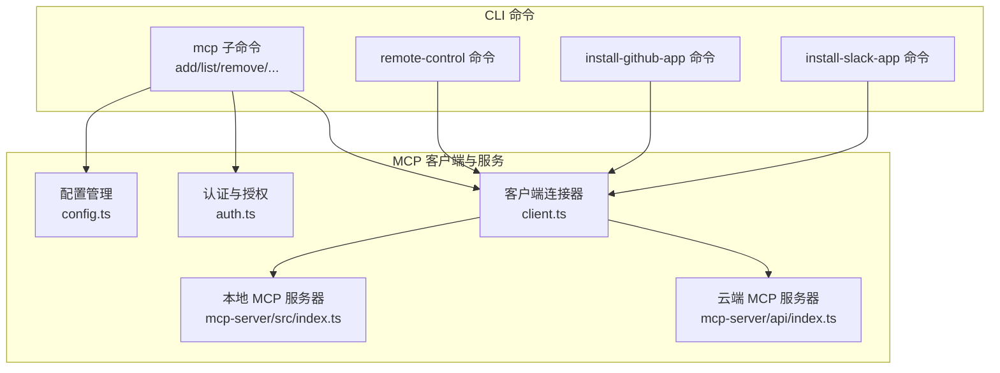
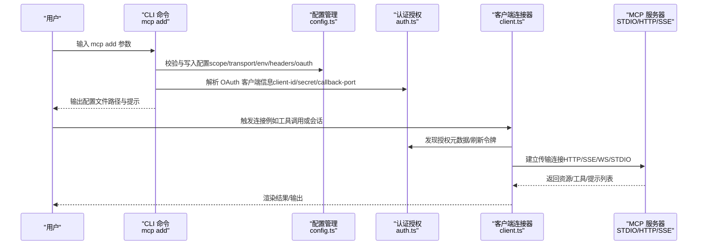
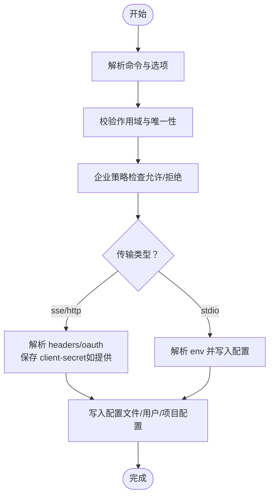
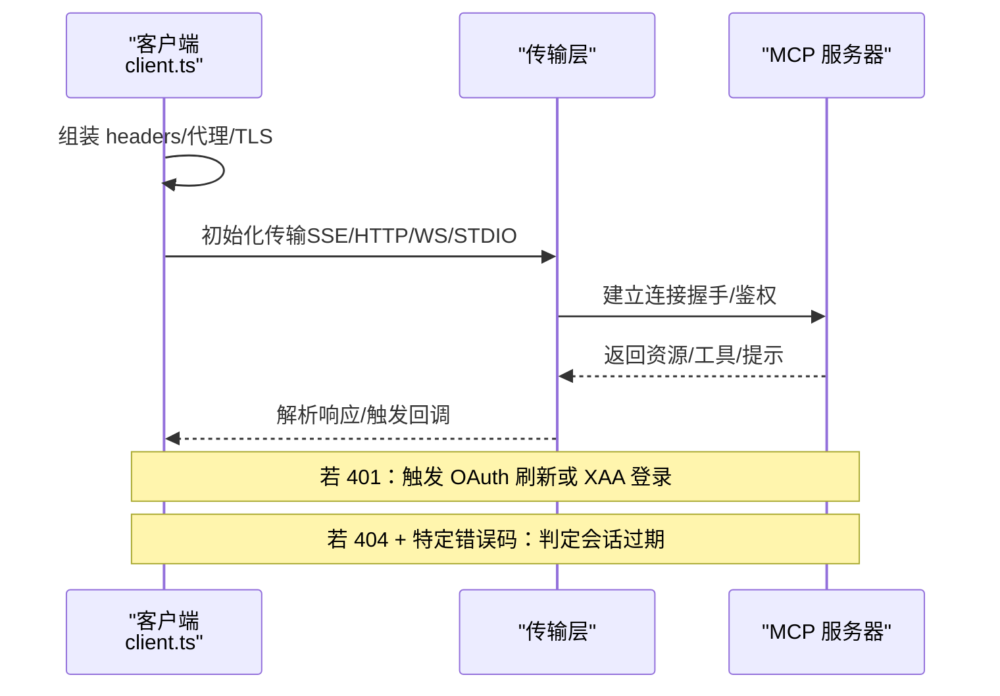
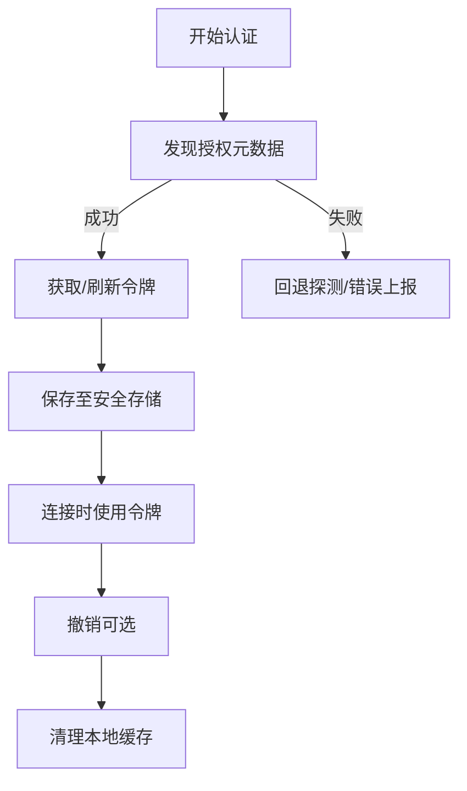
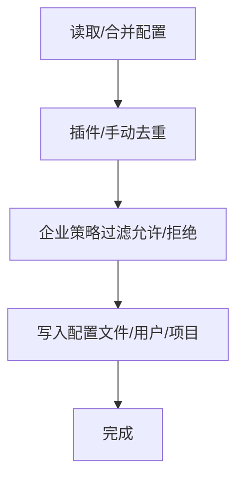
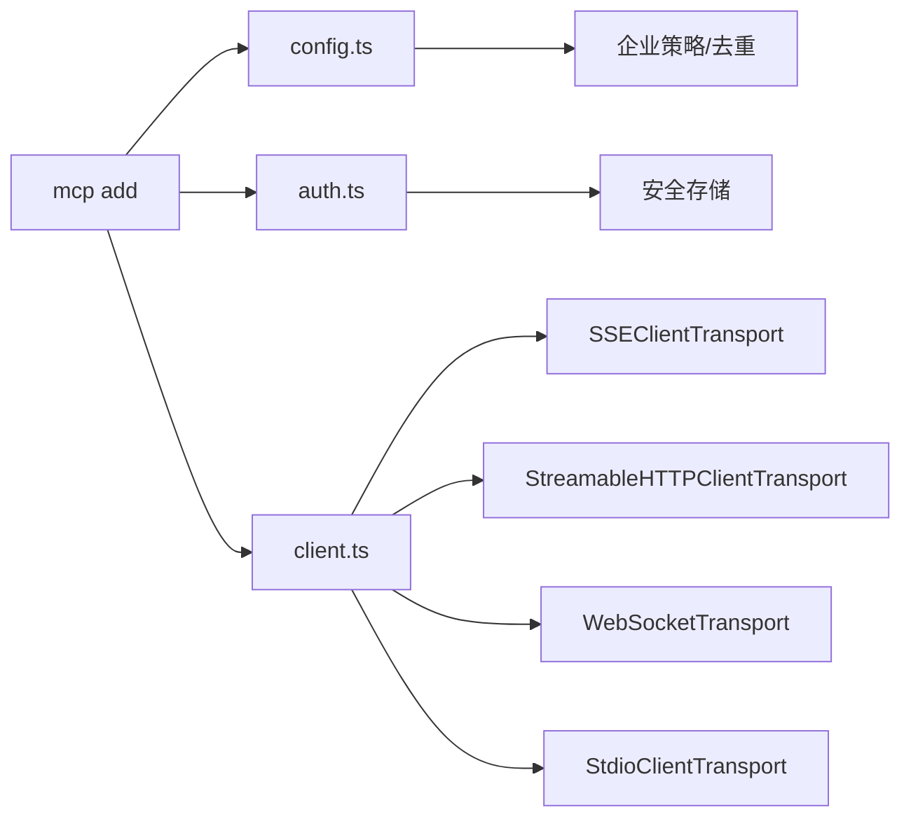

# MCP 命令

<cite>
**本文引用的文件**
- [src/commands/mcp/index.ts](file://src/commands/mcp/index.ts)
- [src/commands/mcp/addCommand.ts](file://src/commands/mcp/addCommand.ts)
- [src/commands/bridge/index.ts](file://src/commands/bridge/index.ts)
- [src/commands/install-github-app/index.ts](file://src/commands/install-github-app/index.ts)
- [src/commands/install-slack-app/index.ts](file://src/commands/install-slack-app/index.ts)
- [src/services/mcp/config.ts](file://src/services/mcp/config.ts)
- [src/services/mcp/client.ts](file://src/services/mcp/client.ts)
- [src/services/mcp/auth.ts](file://src/services/mcp/auth.ts)
- [mcp-server/src/index.ts](file://mcp-server/src/index.ts)
- [mcp-server/api/index.ts](file://mcp-server/api/index.ts)
</cite>

## 目录
1. [简介](#简介)
2. [项目结构](#项目结构)
3. [核心组件](#核心组件)
4. [架构总览](#架构总览)
5. [详细组件分析](#详细组件分析)
6. [依赖关系分析](#依赖关系分析)
7. [性能考量](#性能考量)
8. [故障排查指南](#故障排查指南)
9. [结论](#结论)
10. [附录](#附录)

## 简介
本文件面向 MCP（Model Context Protocol）相关命令与能力，系统化梳理以下内容：
- 命令：mcp、bridge、install-github-app、install-slack-app 的功能、参数、使用方式与连接流程
- MCP 服务器管理：添加、去重、策略过滤、配置写入与环境变量展开
- 客户端连接：HTTP/SSE/WebSocket/STDIO 连接、认证与授权、会话过期处理、超时与代理
- 第三方服务集成：OAuth 发现与刷新、XAA（跨应用访问）登录、Claude.ai 代理连接
- 安全机制与权限控制：企业策略（允许/拒绝列表）、凭据存储与撤销、敏感参数脱敏
- 调试与最佳实践：连接调试方法、配置示例、常见问题定位

## 项目结构
围绕 MCP 的关键模块分布如下：
- CLI 命令入口与子命令注册：commands/mcp、commands/bridge、commands/install-*
- MCP 客户端与传输层：services/mcp/client.ts、services/mcp/config.ts、services/mcp/auth.ts
- MCP 服务器示例：mcp-server/src/index.ts（STDIO）、mcp-server/api/index.ts（Vercel）
- 桥接与远程控制：commands/bridge/index.ts（remote-control）

图表来源
- [src/commands/mcp/index.ts](file://src/commands/mcp/index.ts)
- [src/commands/bridge/index.ts](file://src/commands/bridge/index.ts)
- [src/commands/install-github-app/index.ts](file://src/commands/install-github-app/index.ts)
- [src/commands/install-slack-app/index.ts](file://src/commands/install-slack-app/index.ts)
- [src/services/mcp/config.ts](file://src/services/mcp/config.ts)
- [src/services/mcp/auth.ts](file://src/services/mcp/auth.ts)
- [src/services/mcp/client.ts](file://src/services/mcp/client.ts)
- [mcp-server/src/index.ts](file://mcp-server/src/index.ts)
- [mcp-server/api/index.ts](file://mcp-server/api/index.ts)

章节来源
- [src/commands/mcp/index.ts](file://src/commands/mcp/index.ts)
- [src/commands/bridge/index.ts](file://src/commands/bridge/index.ts)
- [src/commands/install-github-app/index.ts](file://src/commands/install-github-app/index.ts)
- [src/commands/install-slack-app/index.ts](file://src/commands/install-slack-app/index.ts)
- [src/services/mcp/config.ts](file://src/services/mcp/config.ts)
- [src/services/mcp/auth.ts](file://src/services/mcp/auth.ts)
- [src/services/mcp/client.ts](file://src/services/mcp/client.ts)
- [mcp-server/src/index.ts](file://mcp-server/src/index.ts)
- [mcp-server/api/index.ts](file://mcp-server/api/index.ts)

## 核心组件
- mcp 命令：提供 MCP 服务器管理入口，当前以子命令形式暴露（如 add），支持配置作用域、传输类型、环境变量与头部注入、OAuth 客户端信息与回调端口、XAA（跨应用访问）开关等。
- bridge 命令：在启用桥接模式且已开启桥接时，提供“远程控制”能力，用于终端连接远程会话。
- install-github-app 命令：为仓库设置 Claude GitHub Actions，受环境变量开关控制是否可用。
- install-slack-app 命令：在 claude-ai 可用环境下安装 Claude Slack 应用。

章节来源
- [src/commands/mcp/index.ts](file://src/commands/mcp/index.ts)
- [src/commands/bridge/index.ts](file://src/commands/bridge/index.ts)
- [src/commands/install-github-app/index.ts](file://src/commands/install-github-app/index.ts)
- [src/commands/install-slack-app/index.ts](file://src/commands/install-slack-app/index.ts)

## 架构总览
MCP 客户端通过多种传输协议连接到远端或本地 MCP 服务器，并在需要时进行 OAuth 授权或 XAA 登录。企业策略可对服务器名称、命令或 URL 进行允许/拒绝控制；安全凭据存储于受保护的密钥链中，支持撤销与清理。

图表来源
- [src/commands/mcp/addCommand.ts](file://src/commands/mcp/addCommand.ts)
- [src/services/mcp/config.ts](file://src/services/mcp/config.ts)
- [src/services/mcp/auth.ts](file://src/services/mcp/auth.ts)
- [src/services/mcp/client.ts](file://src/services/mcp/client.ts)
- [mcp-server/src/index.ts](file://mcp-server/src/index.ts)

## 详细组件分析

### mcp 命令与子命令（mcp add）
- 功能概述
  - 添加 MCP 服务器配置，支持三种传输类型：stdio、sse、http；可选 headers、环境变量、OAuth 客户端信息、回调端口、XAA 开关。
  - 自动校验配置合法性、作用域唯一性、企业策略（允许/拒绝列表）、保留名限制、企业 MCP 配置独占控制。
  - 对于 SSE/HTTP 传输，支持将客户端密钥保存到本地配置（需显式传入）。
- 关键参数
  - --scope：local/user/project，默认 local
  - --transport/-t：stdio/sse/http，默认 stdio（若未显式指定）
  - -e/--env：环境变量键值对
  - -H/--header：WebSocket 头部（多值）
  - --client-id/--client-secret/--callback-port：OAuth 客户端信息与回调端口
  - --xaa：启用 XAA（跨应用访问），要求环境与 IdP 设置就绪
- 典型流程
  - 解析命令与选项，推断传输类型与是否显式指定
  - 校验 XAA 必要条件（环境变量、IdP 设置、client-id/secret）
  - SSE/HTTP：解析 headers，构建 oauth 配置，保存 client-secret（如提供），写入配置
  - stdio：解析 env，写入配置
  - 输出修改后的配置文件路径与提示

图表来源
- [src/commands/mcp/addCommand.ts](file://src/commands/mcp/addCommand.ts)
- [src/services/mcp/config.ts](file://src/services/mcp/config.ts)

章节来源
- [src/commands/mcp/index.ts](file://src/commands/mcp/index.ts)
- [src/commands/mcp/addCommand.ts](file://src/commands/mcp/addCommand.ts)
- [src/services/mcp/config.ts](file://src/services/mcp/config.ts)

### bridge 命令（remote-control）
- 功能概述
  - 在启用桥接模式且桥接已启用时，提供“远程控制”命令，用于连接远程会话。
  - 命令可用性由特性开关与桥接状态共同决定。
- 使用要点
  - 仅在满足条件时显示与可用
  - 作为本地 JSX 命令加载，便于与 UI/交互集成

章节来源
- [src/commands/bridge/index.ts](file://src/commands/bridge/index.ts)

### install-github-app 命令
- 功能概述
  - 为仓库设置 Claude GitHub Actions，受环境变量 DISABLE_INSTALL_GITHUB_APP_COMMAND 控制是否可用。
- 使用要点
  - 仅在非禁用状态下可用
  - 适用于 claude-ai 与 console 环境

章节来源
- [src/commands/install-github-app/index.ts](file://src/commands/install-github-app/index.ts)

### install-slack-app 命令
- 功能概述
  - 在 claude-ai 可用环境下安装 Claude Slack 应用。
- 使用要点
  - 不支持非交互式执行
  - 作为本地命令加载

章节来源
- [src/commands/install-slack-app/index.ts](file://src/commands/install-slack-app/index.ts)

### MCP 客户端连接与传输
- 支持的传输
  - SSE：长连接事件流，适合持续订阅
  - HTTP：标准 REST 风格请求响应
  - WebSocket：双向消息通道
  - STDIO：本地进程标准输入输出
- 连接流程
  - 选择传输类型与目标地址/命令
  - 组装请求头（静态 + 动态），必要时附加会话鉴权
  - 初始化传输层（SSEClientTransport/StreamableHTTPClientTransport/WebSocketTransport/StdioClientTransport）
  - 建立连接并等待握手完成
- 超时与代理
  - 请求级超时封装，避免单次信号过期导致后续请求失败
  - 代理与 TLS 选项按运行时自动注入
- 会话与错误处理
  - 识别“会话未找到”错误（HTTP 404 + 特定 JSON-RPC 错误码）
  - 认证失败时缓存“需要认证”状态，避免重复弹窗
  - Claude.ai 代理连接自动携带 OAuth Bearer 令牌并处理 401 刷新

图表来源
- [src/services/mcp/client.ts](file://src/services/mcp/client.ts)

章节来源
- [src/services/mcp/client.ts](file://src/services/mcp/client.ts)

### 认证与授权（OAuth/XAA）
- OAuth 发现与刷新
  - 自动发现授权服务器元数据（支持配置的元数据 URL 或 RFC 9728/RFC 8414 探测）
  - 请求级超时与标准化错误体（兼容部分非标准错误码）
  - 刷新令牌失败的分类统计与重试策略
- 凭据存储与撤销
  - 采用安全存储（密钥链）保存访问/刷新令牌与客户端信息
  - 支持按服务器键撤销（先刷新后访问令牌），并清理本地缓存
- XAA（跨应用访问）
  - 一次 IdP 登录复用到多个 MCP 服务器
  - 通过 RFC 8693 + RFC 7523 交换获得目标授权服务器的访问令牌
  - 失败阶段可归类（IdP 登录/发现/令牌交换/JWT Bearer），便于诊断
- Claude.ai 代理连接
  - 自动附加 OAuth Bearer 令牌，401 时触发令牌刷新并重试

图表来源
- [src/services/mcp/auth.ts](file://src/services/mcp/auth.ts)

章节来源
- [src/services/mcp/auth.ts](file://src/services/mcp/auth.ts)

### MCP 服务器管理（配置与策略）
- 配置写入
  - 支持 project/local/user 三种作用域，写入 .mcp.json 或全局配置
  - 写入前原子化处理（临时文件 + 原子重命名），保留文件权限
- 去重与策略
  - 插件与手动配置去重：基于命令数组或 URL（含 CCR 代理 URL 解包）签名匹配
  - 企业策略：允许/拒绝列表支持名称、命令（stdio）与 URL（远程）三类条目，支持通配符
  - 禁止添加保留名与企业独占配置冲突
- 环境变量展开
  - 对命令、URL、头部值中的环境变量进行展开，缺失变量记录以便提示

图表来源
- [src/services/mcp/config.ts](file://src/services/mcp/config.ts)

章节来源
- [src/services/mcp/config.ts](file://src/services/mcp/config.ts)

### MCP 服务器示例（本地与云端）
- 本地 STDIO 服务器
  - 通过 STDIO 与客户端建立协议连接，适合本地开发与调试
- 云端 HTTP 服务器（Vercel）
  - 通过 Vercel serverless 函数代理到 Express 服务器
  - 无状态函数不支持持久会话流式传输，建议使用支持会话的部署平台

章节来源
- [mcp-server/src/index.ts](file://mcp-server/src/index.ts)
- [mcp-server/api/index.ts](file://mcp-server/api/index.ts)

## 依赖关系分析
- 命令到服务
  - mcp add 依赖配置管理与认证模块，写入配置并可保存客户端密钥
  - bridge/第三方安装命令依赖客户端连接器以完成集成
- 客户端到传输
  - 客户端根据配置选择传输层，统一通过 SDK 传输抽象封装
- 企业策略与安全
  - 配置模块负责策略过滤与去重，认证模块负责凭据存储与撤销

图表来源
- [src/commands/mcp/addCommand.ts](file://src/commands/mcp/addCommand.ts)
- [src/services/mcp/config.ts](file://src/services/mcp/config.ts)
- [src/services/mcp/auth.ts](file://src/services/mcp/auth.ts)
- [src/services/mcp/client.ts](file://src/services/mcp/client.ts)

章节来源
- [src/commands/mcp/addCommand.ts](file://src/commands/mcp/addCommand.ts)
- [src/services/mcp/config.ts](file://src/services/mcp/config.ts)
- [src/services/mcp/auth.ts](file://src/services/mcp/auth.ts)
- [src/services/mcp/client.ts](file://src/services/mcp/client.ts)

## 性能考量
- 连接批大小与超时
  - 支持批量连接大小与远程连接批大小的环境变量配置
  - 请求级超时封装避免单次信号过期导致的抖动
- 缓存与去重
  - 插件与手动服务器基于签名去重，减少重复连接
- 代理与 TLS
  - 自动注入代理与 TLS 选项，降低网络层不确定性

## 故障排查指南
- 连接失败
  - 检查传输类型与 URL/命令是否正确
  - 查看配置文件路径与作用域是否匹配
  - 确认企业策略是否拦截（允许/拒绝列表）
- 认证失败
  - 观察“需要认证”状态缓存，确认是否已配置 OAuth 客户端信息与回调端口
  - 对于 XAA，确认 IdP 设置与客户端密钥是否正确
  - 使用 Claude.ai 代理时，确认 OAuth 令牌存在且未过期
- 会话过期
  - 若出现“会话未找到”，清理连接缓存并重新获取客户端实例后重试
- 日志与调试
  - 启用 MCP 调试日志，关注传输层初始化、握手与错误码
  - 检查代理与 TLS 配置，确保网络可达

章节来源
- [src/services/mcp/client.ts](file://src/services/mcp/client.ts)
- [src/services/mcp/auth.ts](file://src/services/mcp/auth.ts)
- [src/services/mcp/config.ts](file://src/services/mcp/config.ts)

## 结论
本文档系统化梳理了 MCP 相关命令与客户端能力，覆盖从命令使用、配置管理、传输连接、认证授权到企业策略与安全控制的完整链路。通过明确的参数与流程、可视化图示与排障指引，帮助开发者与运维人员高效集成与维护 MCP 服务器，安全可控地接入第三方服务。

## 附录
- 配置示例与最佳实践
  - 使用 stdio 时，建议显式指定 --transport 以避免误判 URL
  - SSE/HTTP 传输建议通过 --header 注入鉴权头，必要时通过 --client-id/--client-secret/--callback-port 配置 OAuth
  - XAA 需要先进行 IdP 设置，再为各服务器配置 --client-id 与 --client-secret
  - 企业环境中优先使用允许列表，配合拒绝列表细化限制
- 连接调试方法
  - 启用 MCP 调试日志，观察传输层初始化与握手过程
  - 使用 curl/浏览器开发者工具验证 SSE/HTTP 端点与鉴权头
  - 在 Vercel 等无状态平台仅支持无会话的工具调用，不支持持久流式传输