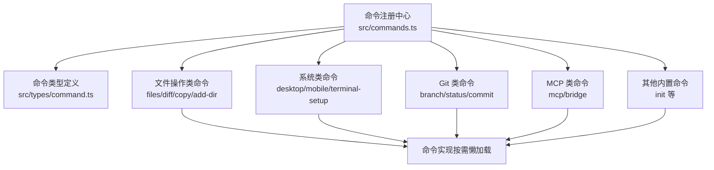
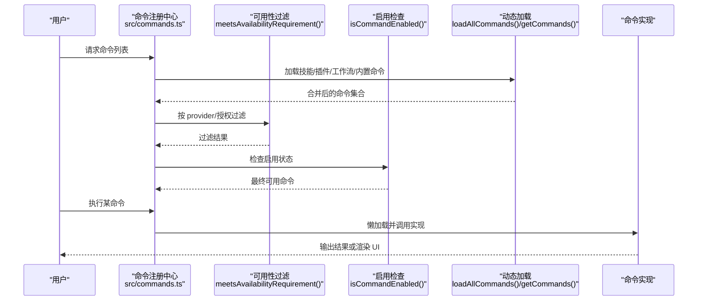
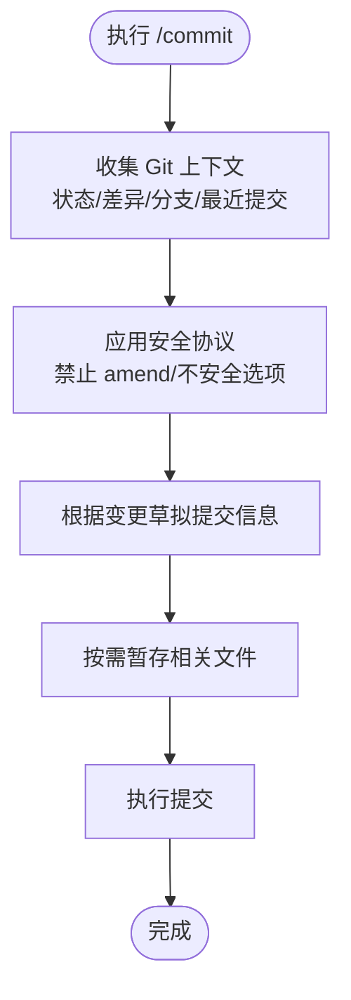
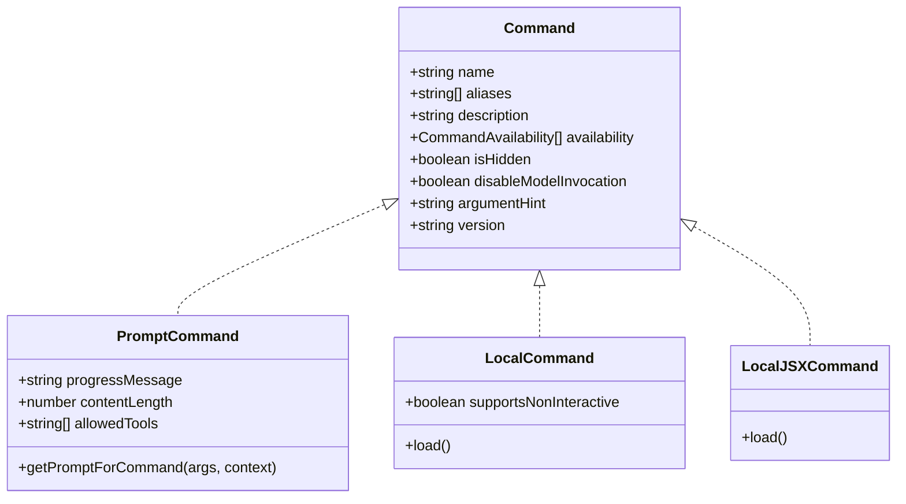

# 内置命令参考

<cite>
**本文引用的文件**
- [src/commands.ts](file://src/commands.ts)
- [src/types/command.ts](file://src/types/command.ts)
- [src/commands/files/index.ts](file://src/commands/files/index.ts)
- [src/commands/diff/index.ts](file://src/commands/diff/index.ts)
- [src/commands/copy/index.ts](file://src/commands/copy/index.ts)
- [src/commands/add-dir/index.ts](file://src/commands/add-dir/index.ts)
- [src/commands/branch/index.ts](file://src/commands/branch/index.ts)
- [src/commands/status/index.ts](file://src/commands/status/index.ts)
- [src/commands/mcp/index.ts](file://src/commands/mcp/index.ts)
- [src/commands/desktop/index.ts](file://src/commands/desktop/index.ts)
- [src/commands/mobile/index.ts](file://src/commands/mobile/index.ts)
- [src/commands/terminalSetup/index.ts](file://src/commands/terminalSetup/index.ts)
- [src/commands/commit.ts](file://src/commands/commit.ts)
- [src/commands/bridge/index.ts](file://src/commands/bridge/index.ts)
- [src/commands/init.ts](file://src/commands/init.ts)
</cite>

## 目录
1. [简介](#简介)
2. [项目结构](#项目结构)
3. [核心组件](#核心组件)
4. [架构总览](#架构总览)
5. [详细组件分析](#详细组件分析)
6. [依赖关系分析](#依赖关系分析)
7. [性能考量](#性能考量)
8. [故障排查指南](#故障排查指南)
9. [结论](#结论)
10. [附录](#附录)

## 简介
本参考文档面向 Claude Code 用户与开发者，系统梳理内置命令体系，按功能分类介绍文件操作类、系统类、Git 类、MCP 类等命令，覆盖参数说明、使用示例、预期效果、可用性要求与权限需求、历史版本与弃用状态、快捷方式与别名等。文档中的命令定义与行为均来自仓库源码与类型声明，确保准确可追溯。

## 项目结构
内置命令由统一的命令注册与发现机制集中管理，命令元数据在各子目录以“命令索引文件”形式声明，实际实现按需懒加载，减少启动开销。命令类型分为三类：
- prompt 型：通过模型生成提示词并执行工具调用
- local 型：纯本地文本输出，支持非交互
- local-jsx 型：渲染 UI 组件，通常用于终端交互

**图示来源**
- [src/commands.ts:259-348](file://src/commands.ts#L259-L348)
- [src/types/command.ts:205-206](file://src/types/command.ts#L205-L206)

**章节来源**
- [src/commands.ts:259-348](file://src/commands.ts#L259-L348)
- [src/types/command.ts:169-206](file://src/types/command.ts#L169-L206)

## 核心组件
- 命令注册与发现
  - 统一从命令注册表加载内置命令，并结合技能、插件、工作流动态扩展
  - 支持按可用性（provider/授权）过滤与启用状态检查
- 命令类型与能力
  - prompt 型：可声明允许工具、进度消息、内容长度估算、路径过滤等
  - local 型：支持非交互执行
  - local-jsx 型：支持延迟加载与 UI 渲染
- 安全与可用性
  - 可配置 availability（如 claude-ai、console），运行时动态判定
  - 提供远程模式安全命令白名单与桥接安全命令白名单

**章节来源**
- [src/commands.ts:419-445](file://src/commands.ts#L419-L445)
- [src/commands.ts:621-678](file://src/commands.ts#L621-L678)
- [src/types/command.ts:25-57](file://src/types/command.ts#L25-L57)
- [src/types/command.ts:74-78](file://src/types/command.ts#L74-L78)
- [src/types/command.ts:144-152](file://src/types/command.ts#L144-L152)

## 架构总览
下图展示命令注册、可用性过滤、动态加载与执行的关键流程：

**图示来源**
- [src/commands.ts:451-519](file://src/commands.ts#L451-L519)
- [src/commands.ts:419-445](file://src/commands.ts#L419-L445)
- [src/commands.ts:214-216](file://src/commands.ts#L214-L216)

## 详细组件分析

### 文件操作类命令
- files
  - 类型：local
  - 参数：无
  - 预期效果：列出当前上下文中跟踪的所有文件
  - 可用性：仅在特定用户类型启用
  - 快捷方式/别名：无
  - 版本/弃用：未见版本号与弃用标记
  - 权限需求：本地读取文件列表
  - 示例：/files
- diff
  - 类型：local-jsx
  - 参数：无
  - 预期效果：查看未提交变更与按轮次的差异
  - 可用性：通用
  - 快捷方式/别名：无
  - 版本/弃用：未见版本号与弃用标记
  - 权限需求：读取本地 Git 状态与差异
  - 示例：/diff
- copy
  - 类型：local-jsx
  - 参数：可选数字 N，表示复制第 N 轮之前的回复
  - 预期效果：将 Claude 的上次回复（或指定轮次）复制到剪贴板
  - 可用性：通用
  - 快捷方式/别名：无
  - 版本/弃用：未见版本号与弃用标记
  - 权限需求：写入系统剪贴板
  - 示例：/copy 或 /copy 2
- add-dir
  - 类型：local-jsx
  - 参数：路径（必填）
  - 预期效果：添加新的工作目录
  - 可用性：通用
  - 快捷方式/别名：无
  - 版本/弃用：未见版本号与弃用标记
  - 权限需求：文件系统访问
  - 示例：/add-dir ./my-project

**章节来源**
- [src/commands/files/index.ts:3-10](file://src/commands/files/index.ts#L3-L10)
- [src/commands/diff/index.ts:3-8](file://src/commands/diff/index.ts#L3-L8)
- [src/commands/copy/index.ts:7-13](file://src/commands/copy/index.ts#L7-L13)
- [src/commands/add-dir/index.ts:3-9](file://src/commands/add-dir/index.ts#L3-L9)

### 系统类命令
- desktop
  - 类型：local-jsx
  - 参数：无
  - 预期效果：在 Claude Desktop 中继续当前会话
  - 可用性：claude-ai 订阅者；仅 macOS 与 Windows x64 平台可用
  - 快捷方式/别名：app
  - 版本/弃用：未见版本号与弃用标记
  - 权限需求：平台支持与桌面应用集成
  - 示例：/desktop
- mobile
  - 类型：local-jsx
  - 参数：无
  - 预期效果：显示二维码以便下载 Claude 移动端应用
  - 可用性：通用
  - 快捷方式/别名：ios、android
  - 版本/弃用：未见版本号与弃用标记
  - 权限需求：无
  - 示例：/mobile
- terminal-setup
  - 类型：local-jsx
  - 参数：无
  - 预期效果：为终端安装换行键绑定（Shift+Enter）；对部分原生支持的终端隐藏
  - 可用性：通用
  - 快捷方式/别名：无
  - 版本/弃用：未见版本号与弃用标记
  - 权限需求：终端配置写入
  - 示例：/terminal-setup

**章节来源**
- [src/commands/desktop/index.ts:13-24](file://src/commands/desktop/index.ts#L13-L24)
- [src/commands/mobile/index.ts:3-9](file://src/commands/mobile/index.ts#L3-L9)
- [src/commands/terminalSetup/index.ts:12-21](file://src/commands/terminalSetup/index.ts#L12-L21)

### Git 类命令
- branch
  - 类型：local-jsx
  - 参数：可选分支名
  - 预期效果：在当前对话点创建一个分支（或别名为 fork，当独立的 /fork 命令不存在时）
  - 可用性：通用
  - 快捷方式/别名：fork（条件启用）
  - 版本/弃用：未见版本号与弃用标记
  - 权限需求：无
  - 示例：/branch feature-login 或 /branch
- status
  - 类型：local-jsx
  - 参数：无
  - 预期效果：显示 Claude Code 状态（版本、模型、账户、API 连通性、工具状态等）
  - 可用性：通用
  - 快捷方式/别名：无
  - 版本/弃用：未见版本号与弃用标记
  - 权限需求：只读系统信息
  - 示例：/status
- commit
  - 类型：prompt
  - 参数：无
  - 预期效果：基于当前 Git 状态与变更，生成一次提交（含安全协议与工具限制）
  - 可用性：通用
  - 快捷方式/别名：无
  - 版本/弃用：未见版本号与弃用标记
  - 权限需求：受限工具调用（仅允许 git add/status/commit）
  - 示例：/commit

**图示来源**
- [src/commands/commit.ts:12-54](file://src/commands/commit.ts#L12-L54)
- [src/commands/commit.ts:57-90](file://src/commands/commit.ts#L57-L90)

**章节来源**
- [src/commands/branch/index.ts:4-12](file://src/commands/branch/index.ts#L4-L12)
- [src/commands/status/index.ts:3-10](file://src/commands/status/index.ts#L3-L10)
- [src/commands/commit.ts:57-90](file://src/commands/commit.ts#L57-L90)

### MCP 类命令
- mcp
  - 类型：local-jsx
  - 参数：可选 enable/disable 与服务器名称
  - 预期效果：管理 MCP 服务器（启用/禁用）
  - 可用性：通用
  - 快捷方式/别名：无
  - 版本/弃用：未见版本号与弃用标记
  - 权限需求：MCP 配置读写
  - 示例：/mcp enable my-server
- bridge
  - 类型：local-jsx
  - 参数：可选名称
  - 预期效果：连接终端以进行远程控制会话
  - 可用性：受特性开关与桥接启用状态控制
  - 快捷方式/别名：rc
  - 版本/弃用：未见版本号与弃用标记
  - 权限需求：桥接功能启用
  - 示例：/remote-control 或 /rc

**章节来源**
- [src/commands/mcp/index.ts:3-10](file://src/commands/mcp/index.ts#L3-L10)
- [src/commands/bridge/index.ts:12-24](file://src/commands/bridge/index.ts#L12-L24)

### 其他内置命令
- init
  - 类型：prompt
  - 参数：无
  - 预期效果：初始化 CLAUDE.md（及可选技能/钩子），引导用户选择模板与偏好
  - 可用性：通用（新旧两版逻辑）
  - 快捷方式/别名：无
  - 版本/弃用：未见版本号与弃用标记
  - 权限需求：文件系统读写
  - 示例：/init

**章节来源**
- [src/commands/init.ts:226-254](file://src/commands/init.ts#L226-L254)

## 依赖关系分析
- 命令注册与类型
  - 命令注册中心聚合内置命令、技能、插件与工作流，统一导出命令集合
  - 类型定义明确命令字段（名称、描述、类型、可用性、启用状态、别名等）
- 可用性与启用
  - 可用性按 provider/授权过滤（claude-ai、console），启用状态可由特性开关与环境变量决定
- 懒加载与安全
  - local-jsx 命令通过 load() 延迟加载，降低启动成本
  - prompt 命令可声明 allowedTools，配合权限系统限制工具调用范围

**图示来源**
- [src/types/command.ts:175-206](file://src/types/command.ts#L175-L206)

**章节来源**
- [src/commands.ts:259-348](file://src/commands.ts#L259-L348)
- [src/types/command.ts:169-206](file://src/types/command.ts#L169-L206)

## 性能考量
- 懒加载策略：local-jsx 命令通过 load() 延迟加载，避免启动时加载重型 UI 组件
- 缓存与去重：命令列表与技能缓存采用记忆化，动态技能插入时去重处理
- 远程安全：远程/桥接模式下对命令类型与来源进行白名单过滤，避免不安全操作

**章节来源**
- [src/commands.ts:451-519](file://src/commands.ts#L451-L519)
- [src/commands.ts:621-678](file://src/commands.ts#L621-L678)

## 故障排查指南
- 命令不可见或被隐藏
  - 检查 availability 是否满足当前授权（claude-ai/console）
  - 检查 isEnabled 返回值与特性开关
- 命令执行失败
  - 对于 prompt 命令，确认 allowedTools 是否正确配置
  - 对于 local-jsx 命令，确认 load() 是否返回有效模块
- 远程/桥接不可用
  - 确认 REMOTE_SAFE_COMMANDS 与 BRIDGE_SAFE_COMMANDS 白名单
  - 检查特性开关与桥接启用状态

**章节来源**
- [src/commands.ts:419-445](file://src/commands.ts#L419-L445)
- [src/commands.ts:621-678](file://src/commands.ts#L621-L678)
- [src/commands/bridge/index.ts:5-10](file://src/commands/bridge/index.ts#L5-L10)

## 结论
内置命令体系通过统一注册、类型化定义与动态加载实现高扩展性与安全性。不同类型的命令满足从文件浏览、差异查看、复制输出到 Git 提交、MCP 管理与远程控制等多样化场景。建议在团队协作中结合权限与可用性配置，合理启用命令并维护 CLAUDE.md 与技能，提升开发效率与一致性。

## 附录
- 命令快速索引
  - 文件操作：files、diff、copy、add-dir
  - 系统：desktop、mobile、terminal-setup
  - Git：branch、status、commit
  - MCP：mcp、bridge
  - 其他：init
- 快捷方式与别名
  - desktop -> app
  - mobile -> ios、android
  - branch -> fork（条件启用）
  - bridge -> rc