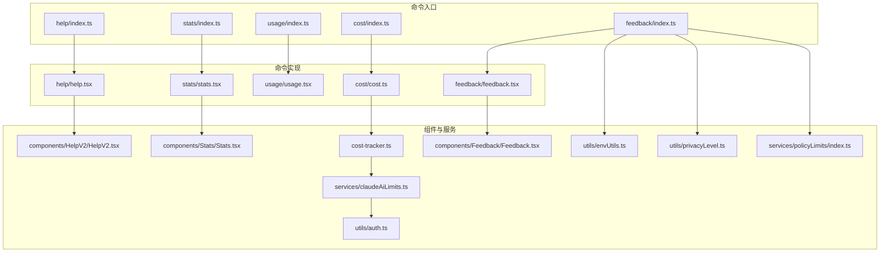
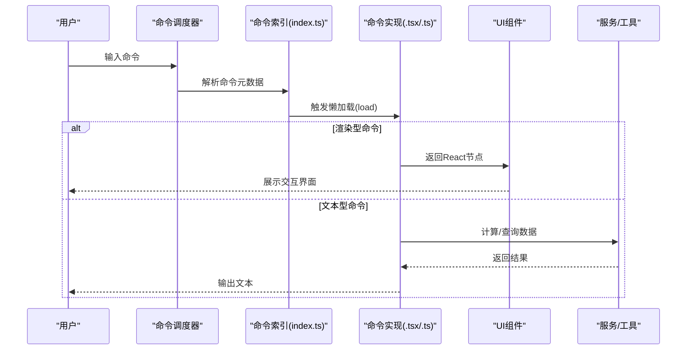
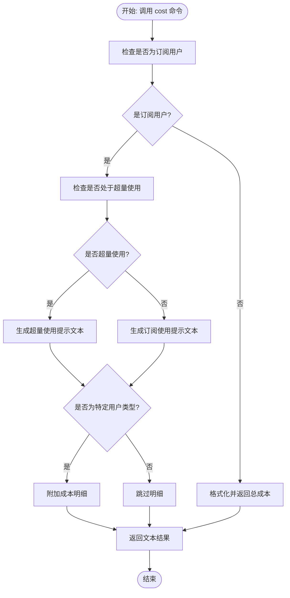
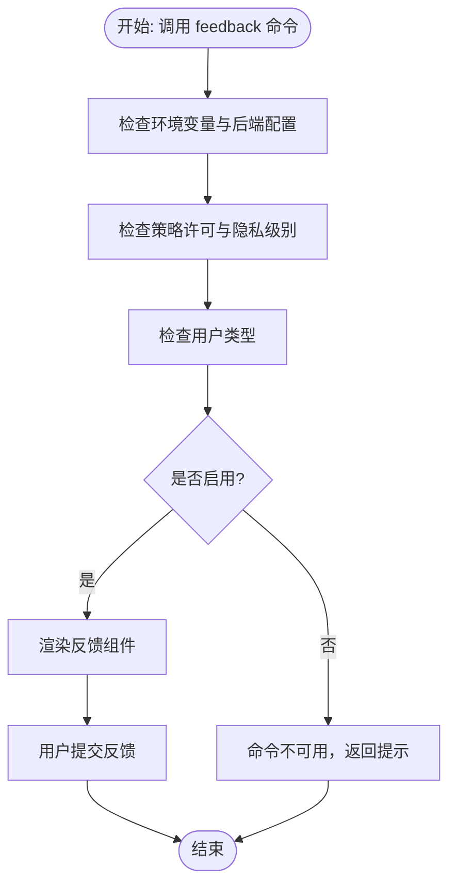
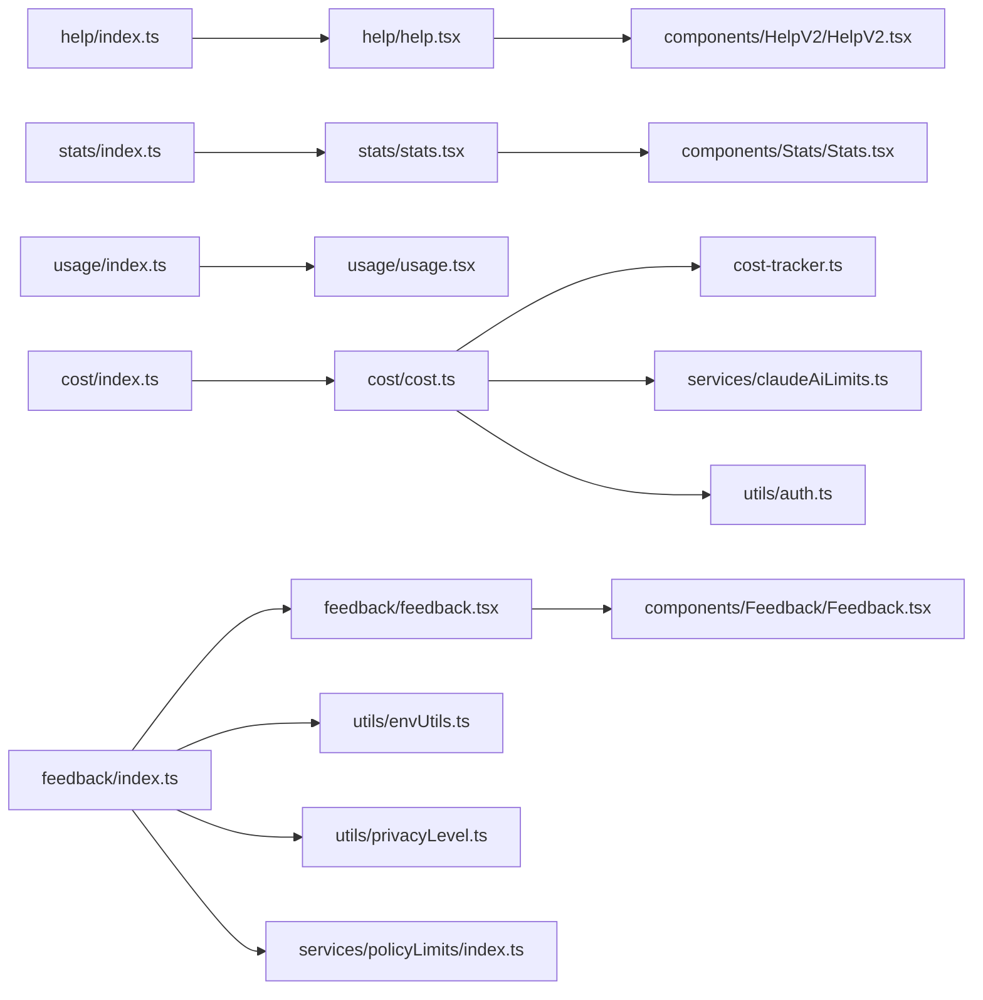

# 实用工具命令

<cite>
**本文引用的文件**
- [src/commands/help/help.tsx](file://src/commands/help/help.tsx)
- [src/commands/help/index.ts](file://src/commands/help/index.ts)
- [src/commands/stats/stats.tsx](file://src/commands/stats/stats.tsx)
- [src/commands/stats/index.ts](file://src/commands/stats/index.ts)
- [src/commands/usage/usage.tsx](file://src/commands/usage/usage.tsx)
- [src/commands/usage/index.ts](file://src/commands/usage/index.ts)
- [src/commands/cost/cost.ts](file://src/commands/cost/cost.ts)
- [src/commands/cost/index.ts](file://src/commands/cost/index.ts)
- [src/commands/feedback/feedback.tsx](file://src/commands/feedback/feedback.tsx)
- [src/commands/feedback/index.ts](file://src/commands/feedback/index.ts)
- [src/components/HelpV2/HelpV2.tsx](file://src/components/HelpV2/HelpV2.tsx)
- [src/components/Stats/Stats.tsx](file://src/components/Stats/Stats.tsx)
- [src/components/Feedback/Feedback.tsx](file://src/components/Feedback/Feedback.tsx)
- [src/services/claudeAiLimits.ts](file://src/services/claudeAiLimits.ts)
- [src/utils/auth.ts](file://src/utils/auth.ts)
- [src/utils/envUtils.ts](file://src/utils/envUtils.ts)
- [src/utils/privacyLevel.ts](file://src/utils/privacyLevel.ts)
- [src/services/policyLimits/index.ts](file://src/services/policyLimits/index.ts)
- [src/cost-tracker.ts](file://src/cost-tracker.ts)
</cite>

## 目录
1. [简介](#简介)
2. [项目结构](#项目结构)
3. [核心组件](#核心组件)
4. [架构总览](#架构总览)
5. [详细组件分析](#详细组件分析)
6. [依赖关系分析](#依赖关系分析)
7. [性能考量](#性能考量)
8. [故障排查指南](#故障排查指南)
9. [结论](#结论)
10. [附录](#附录)

## 简介
本文件聚焦于实用工具类命令，涵盖 help、version（通过 help 命令展示）、stats、usage、cost、feedback 等辅助功能。内容包括各命令的功能定位、输出形式与解读、适用场景与实际效果、数据分析要点，以及对系统性能的影响与使用建议。读者可据此快速掌握如何在不同运行环境中高效使用这些命令，并进行成本与用量的可视化分析。

## 项目结构
实用工具命令均以“命令定义 + 懒加载实现”的方式组织，遵循最小化启动开销的原则。命令元数据（名称、描述、可用性、是否隐藏等）集中定义在各命令目录下的 index.ts；具体实现按需异步加载，避免阻塞主流程。

图表来源
- [src/commands/help/index.ts:1-13](file://src/commands/help/index.ts#L1-L13)
- [src/commands/stats/index.ts:1-13](file://src/commands/stats/index.ts#L1-L13)
- [src/commands/usage/index.ts:1-12](file://src/commands/usage/index.ts#L1-L12)
- [src/commands/cost/index.ts:1-26](file://src/commands/cost/index.ts#L1-L26)
- [src/commands/feedback/index.ts:1-29](file://src/commands/feedback/index.ts#L1-L29)
- [src/commands/help/help.tsx:1-13](file://src/commands/help/help.tsx#L1-L13)
- [src/commands/stats/stats.tsx:1-9](file://src/commands/stats/stats.tsx#L1-L9)
- [src/commands/usage/usage.tsx:1-9](file://src/commands/usage/usage.tsx#L1-L9)
- [src/commands/cost/cost.ts:1-27](file://src/commands/cost/cost.ts#L1-L27)
- [src/commands/feedback/feedback.tsx:1-27](file://src/commands/feedback/feedback.tsx#L1-L27)

章节来源
- [src/commands/help/index.ts:1-13](file://src/commands/help/index.ts#L1-L13)
- [src/commands/stats/index.ts:1-13](file://src/commands/stats/index.ts#L1-L13)
- [src/commands/usage/index.ts:1-12](file://src/commands/usage/index.ts#L1-L12)
- [src/commands/cost/index.ts:1-26](file://src/commands/cost/index.ts#L1-L26)
- [src/commands/feedback/index.ts:1-29](file://src/commands/feedback/index.ts#L1-L29)

## 核心组件
- 命令元数据与懒加载：各命令在 index.ts 中声明类型、名称、描述、可用性、是否隐藏、是否支持非交互式执行，并通过 load 异步导入实现模块，降低启动时的内存与解析压力。
- 渲染型命令：help、stats、usage、feedback 通过 JSX 返回 UI 组件，用于在终端或界面中展示交互式视图。
- 文本型命令：cost 返回纯文本结果，用于快速查看当前会话的成本与持续时间信息。
- 权限与环境控制：feedback 命令受多项策略与环境变量限制，确保在特定部署或隐私级别下不被启用。

章节来源
- [src/commands/help/index.ts:1-13](file://src/commands/help/index.ts#L1-L13)
- [src/commands/stats/index.ts:1-13](file://src/commands/stats/index.ts#L1-L13)
- [src/commands/usage/index.ts:1-12](file://src/commands/usage/index.ts#L1-L12)
- [src/commands/cost/index.ts:1-26](file://src/commands/cost/index.ts#L1-L26)
- [src/commands/feedback/index.ts:1-29](file://src/commands/feedback/index.ts#L1-L29)

## 架构总览
以下序列图展示了“命令调用 → 元数据解析 → 懒加载实现 → 组件渲染/文本输出”的通用流程，以及 cost 命令特有的成本计算链路。

图表来源
- [src/commands/help/index.ts:1-13](file://src/commands/help/index.ts#L1-L13)
- [src/commands/help/help.tsx:1-13](file://src/commands/help/help.tsx#L1-L13)
- [src/commands/stats/index.ts:1-13](file://src/commands/stats/index.ts#L1-L13)
- [src/commands/stats/stats.tsx:1-9](file://src/commands/stats/stats.tsx#L1-L9)
- [src/commands/usage/index.ts:1-12](file://src/commands/usage/index.ts#L1-L12)
- [src/commands/usage/usage.tsx:1-9](file://src/commands/usage/usage.tsx#L1-L9)
- [src/commands/cost/index.ts:1-26](file://src/commands/cost/index.ts#L1-L26)
- [src/commands/cost/cost.ts:1-27](file://src/commands/cost/cost.ts#L1-L27)
- [src/commands/feedback/index.ts:1-29](file://src/commands/feedback/index.ts#L1-L29)
- [src/commands/feedback/feedback.tsx:1-27](file://src/commands/feedback/feedback.tsx#L1-L27)

## 详细组件分析

### 命令：help（帮助与可用命令）
- 功能概述
  - 提供可用命令列表与帮助信息的交互式视图，便于用户快速了解当前环境中的可用命令与使用方式。
- 输出形式
  - 渲染型输出，返回一个交互式帮助界面，支持浏览命令列表与简要说明。
- 使用场景
  - 初次使用或需要快速查阅命令清单时。
  - 在复杂插件生态中定位特定能力。
- 实际效果
  - 打开帮助界面后，用户可查看命令名称、描述与可用性提示，便于选择合适的工具。
- 性能影响与建议
  - 作为渲染型命令，仅在打开界面时占用资源；建议在需要时再调用，避免频繁切换界面导致的上下文切换开销。

章节来源
- [src/commands/help/index.ts:1-13](file://src/commands/help/index.ts#L1-L13)
- [src/commands/help/help.tsx:1-13](file://src/commands/help/help.tsx#L1-L13)
- [src/components/HelpV2/HelpV2.tsx](file://src/components/HelpV2/HelpV2.tsx)

### 命令：stats（统计信息）
- 功能概述
  - 展示用户的使用统计与活动概览，帮助用户从多维度了解使用行为与活跃度。
- 输出形式
  - 渲染型输出，返回一个统计面板，包含关键指标与趋势视图。
- 使用场景
  - 日常回顾使用情况、识别高峰时段或高产任务。
  - 结合团队协作场景，共享个人或团队的产出概览。
- 实际效果
  - 提供可视化的统计数据，辅助制定工作计划与优化效率。
- 性能影响与建议
  - 统计面板通常在本地聚合数据，渲染开销较低；建议定期查看，避免长时间驻留界面。

章节来源
- [src/commands/stats/index.ts:1-13](file://src/commands/stats/index.ts#L1-L13)
- [src/commands/stats/stats.tsx:1-9](file://src/commands/stats/stats.tsx#L1-L9)
- [src/components/Stats/Stats.tsx](file://src/components/Stats/Stats.tsx)

### 命令：usage（用量与限额）
- 功能概述
  - 显示当前账户的用量与限额信息，帮助用户了解配额状态与剩余空间。
- 输出形式
  - 渲染型输出，打开设置界面并默认选中“用量”标签页，展示配额与使用详情。
- 使用场景
  - 需要确认当前配额是否充足，或排查用量异常。
  - 团队管理员监控整体用量分布。
- 实际效果
  - 直观呈现订阅/配额状态、已用额度与重置周期，便于及时调整使用策略。
- 性能影响与建议
  - 仅在打开界面时加载数据；建议在必要时查看，避免频繁刷新造成无谓请求。

章节来源
- [src/commands/usage/index.ts:1-12](file://src/commands/usage/index.ts#L1-L12)
- [src/commands/usage/usage.tsx:1-9](file://src/commands/usage/usage.tsx#L1-L9)

### 命令：cost（成本计算）
- 功能概述
  - 报告当前会话的总成本与持续时间，区分订阅与超量使用场景，并在特定用户类型下提供额外成本明细。
- 输出形式
  - 文本型输出，返回一段描述性文本，包含成本状态与摘要信息。
- 使用场景
  - 财务归集与成本核算，识别高成本会话或模型使用模式。
  - 审计与预算控制，辅助制定成本优化策略。
- 实际效果
  - 快速获得成本摘要，结合订阅状态判断是否触发超量计费。
- 性能影响与建议
  - 文本输出开销极低；适合在会话结束时或定期检查时使用，避免频繁调用。
- 数据解读要点
  - 若提示使用超量，注意订阅配额重置时间点，以便在重置后自动切换回订阅速率。
  - 特定用户类型（如内部测试用户）可能显示额外成本明细，便于审计与核对。

图表来源
- [src/commands/cost/cost.ts:1-27](file://src/commands/cost/cost.ts#L1-L27)
- [src/utils/auth.ts](file://src/utils/auth.ts)
- [src/services/claudeAiLimits.ts](file://src/services/claudeAiLimits.ts)
- [src/cost-tracker.ts](file://src/cost-tracker.ts)

章节来源
- [src/commands/cost/index.ts:1-26](file://src/commands/cost/index.ts#L1-L26)
- [src/commands/cost/cost.ts:1-27](file://src/commands/cost/cost.ts#L1-L27)

### 命令：feedback（反馈与问题报告）
- 功能概述
  - 提交关于 Claude Code 的反馈或问题报告，支持附带上下文消息与后台任务信息，便于开发者复现与诊断。
- 输出形式
  - 渲染型输出，返回一个反馈表单组件，允许用户输入描述并选择附带上下文。
- 使用场景
  - 遇到功能异常、性能问题或改进建议时提交反馈。
  - 需要附带会话历史或后台任务状态以便定位问题。
- 实际效果
  - 将用户输入与上下文打包发送至反馈通道，提升问题处理效率。
- 性能影响与建议
  - 反馈界面仅在打开时占用资源；建议在问题复现后尽快提交，避免长时间滞留。
- 启用条件与限制
  - 受多项策略与环境变量限制，例如禁用反馈/问题命令、特定云服务后端、隐私级别为“仅必要流量”、特定用户类型等情况下不可用。
  - 建议在满足策略要求且网络与权限允许时使用。

图表来源
- [src/commands/feedback/index.ts:1-29](file://src/commands/feedback/index.ts#L1-L29)
- [src/commands/feedback/feedback.tsx:1-27](file://src/commands/feedback/feedback.tsx#L1-L27)
- [src/utils/envUtils.ts](file://src/utils/envUtils.ts)
- [src/utils/privacyLevel.ts](file://src/utils/privacyLevel.ts)
- [src/services/policyLimits/index.ts](file://src/services/policyLimits/index.ts)

章节来源
- [src/commands/feedback/index.ts:1-29](file://src/commands/feedback/index.ts#L1-L29)
- [src/commands/feedback/feedback.tsx:1-27](file://src/commands/feedback/feedback.tsx#L1-L27)

## 依赖关系分析
- 命令到实现的耦合
  - 各命令通过 index.ts 的元数据与懒加载机制解耦，实现模块独立更新与维护。
- 实现到组件/服务的依赖
  - help、stats、feedback 依赖对应 UI 组件；cost 依赖成本追踪与限额服务；feedback 依赖环境、隐私与策略服务。
- 可能的循环依赖
  - 当前结构采用单向依赖（命令 → 实现 → 组件/服务），未见明显循环依赖迹象。
- 外部集成点
  - 反馈命令与策略/环境/隐私模块集成，确保合规与安全；成本命令与订阅/限额模块集成，确保计费逻辑正确。

图表来源
- [src/commands/help/index.ts:1-13](file://src/commands/help/index.ts#L1-L13)
- [src/commands/help/help.tsx:1-13](file://src/commands/help/help.tsx#L1-L13)
- [src/commands/stats/index.ts:1-13](file://src/commands/stats/index.ts#L1-L13)
- [src/commands/stats/stats.tsx:1-9](file://src/commands/stats/stats.tsx#L1-L9)
- [src/commands/usage/index.ts:1-12](file://src/commands/usage/index.ts#L1-L12)
- [src/commands/usage/usage.tsx:1-9](file://src/commands/usage/usage.tsx#L1-L9)
- [src/commands/cost/index.ts:1-26](file://src/commands/cost/index.ts#L1-L26)
- [src/commands/cost/cost.ts:1-27](file://src/commands/cost/cost.ts#L1-L27)
- [src/commands/feedback/index.ts:1-29](file://src/commands/feedback/index.ts#L1-L29)
- [src/commands/feedback/feedback.tsx:1-27](file://src/commands/feedback/feedback.tsx#L1-L27)

## 性能考量
- 启动与加载
  - 通过懒加载减少初始包体与解析时间，命令在首次调用时才加载实现模块。
- 渲染型命令
  - help、stats、usage、feedback 在打开界面时产生渲染开销；建议在需要时再打开，避免长期驻留。
- 文本型命令
  - cost 仅进行轻量计算与格式化，几乎无性能负担。
- 环境与策略
  - feedback 命令在特定环境或策略下不可用，避免无效调用带来的资源浪费。

## 故障排查指南
- feedback 命令不可用
  - 检查是否启用了禁用反馈/问题命令的环境变量，或当前部署是否使用特定云服务后端。
  - 确认隐私级别是否为“仅必要流量”，以及用户类型是否受限。
  - 核对产品反馈策略许可是否允许该操作。
- cost 命令显示异常
  - 确认当前订阅状态与限额是否正常；若提示超量使用，请关注配额重置时间。
  - 某些用户类型可能显示额外成本明细，用于审计核对。
- stats/usage 界面卡顿
  - 关闭界面后再重新打开，避免长时间驻留导致的上下文堆积。
  - 减少同时打开多个渲染型命令的频率。

章节来源
- [src/commands/feedback/index.ts:1-29](file://src/commands/feedback/index.ts#L1-L29)
- [src/commands/cost/cost.ts:1-27](file://src/commands/cost/cost.ts#L1-L27)
- [src/utils/envUtils.ts](file://src/utils/envUtils.ts)
- [src/utils/privacyLevel.ts](file://src/utils/privacyLevel.ts)
- [src/services/policyLimits/index.ts](file://src/services/policyLimits/index.ts)

## 结论
实用工具命令围绕“帮助、统计、用量、成本、反馈”构建，既满足日常运维与审计需求，又兼顾性能与合规约束。通过懒加载与渲染型输出，系统在保证易用性的同时降低了启动与运行成本。建议在明确场景下使用相应命令，并结合策略与环境限制合理规划使用频率与时机。

## 附录
- 命令一览与特性对比
  - help：渲染型，提供命令列表与帮助信息。
  - stats：渲染型，展示使用统计与活动概览。
  - usage：渲染型，展示用量与限额详情。
  - cost：文本型，展示当前会话成本与持续时间。
  - feedback：渲染型，提交反馈与问题报告，受策略与环境限制。