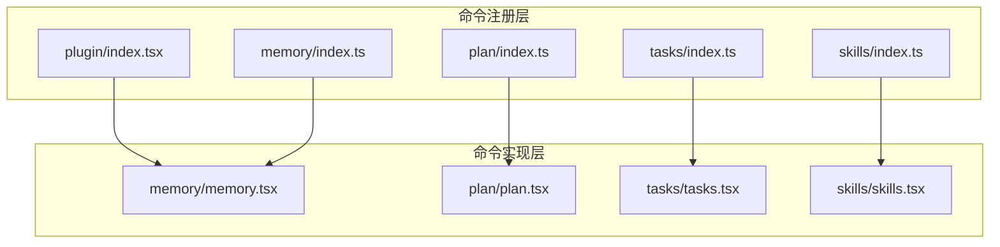
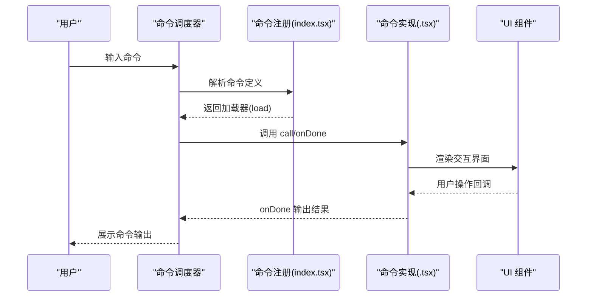
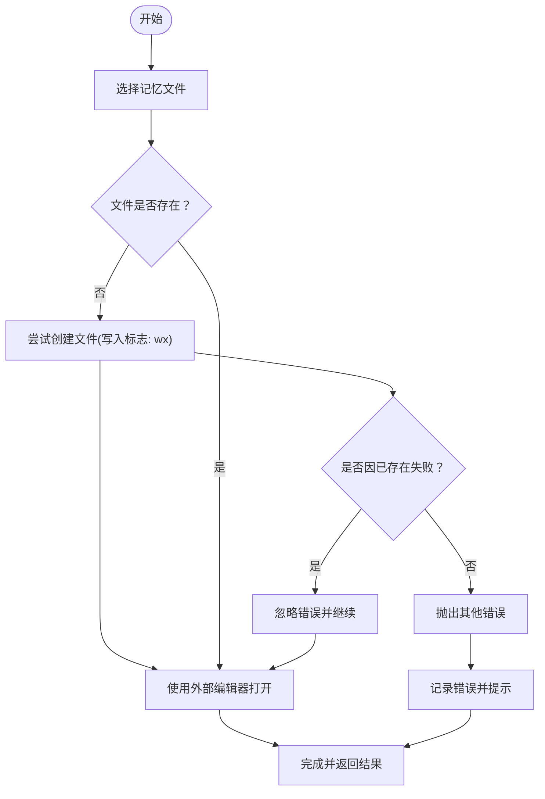
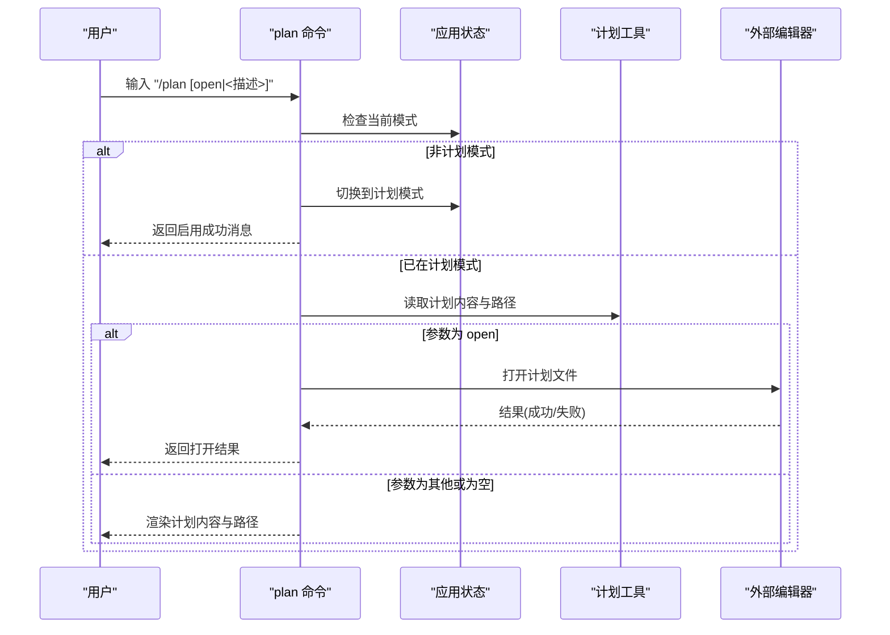
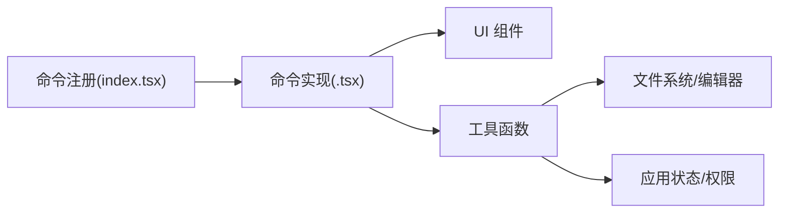

# 开发工具命令

<cite>
**本文引用的文件**
- [src/commands/plugin/index.tsx](file://src/commands/plugin/index.tsx)
- [src/commands/skills/index.ts](file://src/commands/skills/index.ts)
- [src/commands/tasks/index.ts](file://src/commands/tasks/index.ts)
- [src/commands/memory/index.ts](file://src/commands/memory/index.ts)
- [src/commands/plan/index.ts](file://src/commands/plan/index.ts)
- [src/commands/memory/memory.tsx](file://src/commands/memory/memory.tsx)
- [src/commands/plan/plan.tsx](file://src/commands/plan/plan.tsx)
- [src/commands/tasks/tasks.tsx](file://src/commands/tasks/tasks.tsx)
- [src/commands/skills/skills.tsx](file://src/commands/skills/skills.tsx)
</cite>

## 目录
1. [简介](#简介)
2. [项目结构](#项目结构)
3. [核心组件](#核心组件)
4. [架构总览](#架构总览)
5. [详细组件分析](#详细组件分析)
6. [依赖分析](#依赖分析)
7. [性能考虑](#性能考虑)
8. [故障排查指南](#故障排查指南)
9. [结论](#结论)
10. [附录](#附录)

## 简介
本文件面向开发工具命令的使用者与维护者，系统化梳理与说明以下开发辅助命令：plugin（插件）、skills（技能）、tasks（任务）、memory（记忆）、plan（计划）、review（代码审查）。内容涵盖命令功能、参数选项、典型使用场景与预期效果，并结合仓库中的实际实现进行说明。同时给出开发工作流最佳实践、效率提升技巧以及与开发环境的集成与自动化支持建议。

## 项目结构
这些命令均以“本地 JSX 命令”的形式注册在命令系统中，通过统一的命令类型接口导出，运行时由命令调度器加载对应的渲染函数或对话框组件，完成交互式体验。

图表来源
- [src/commands/plugin/index.tsx:1-13](file://src/commands/plugin/index.tsx#L1-L13)
- [src/commands/skills/index.ts:1-13](file://src/commands/skills/index.ts#L1-L13)
- [src/commands/tasks/index.ts:1-14](file://src/commands/tasks/index.ts#L1-L14)
- [src/commands/memory/index.ts:1-13](file://src/commands/memory/index.ts#L1-L13)
- [src/commands/plan/index.ts:1-14](file://src/commands/plan/index.ts#L1-L14)
- [src/commands/memory/memory.tsx:1-92](file://src/commands/memory/memory.tsx#L1-L92)
- [src/commands/plan/plan.tsx:1-124](file://src/commands/plan/plan.tsx#L1-L124)
- [src/commands/tasks/tasks.tsx:1-10](file://src/commands/tasks/tasks.tsx#L1-L10)
- [src/commands/skills/skills.tsx:1-10](file://src/commands/skills/skills.tsx#L1-L10)

章节来源
- [src/commands/plugin/index.tsx:1-13](file://src/commands/plugin/index.tsx#L1-L13)
- [src/commands/skills/index.ts:1-13](file://src/commands/skills/index.ts#L1-L13)
- [src/commands/tasks/index.ts:1-14](file://src/commands/tasks/index.ts#L1-L14)
- [src/commands/memory/index.ts:1-13](file://src/commands/memory/index.ts#L1-L13)
- [src/commands/plan/index.ts:1-14](file://src/commands/plan/index.ts#L1-L14)

## 核心组件
- plugin（插件）
  - 类型：本地 JSX 命令
  - 别名：plugins、marketplace
  - 特性：立即执行（immediate），用于管理 Claude Code 插件
  - 典型用法：打开插件管理界面，安装/卸载/启用/禁用插件
- skills（技能）
  - 类型：本地 JSX 命令
  - 功能：列出可用技能并提供交互式菜单
  - 典型用法：查看/选择技能，触发技能工具调用
- tasks（任务）
  - 类型：本地 JSX 命令
  - 别名：bashes
  - 功能：列出并管理后台任务
  - 典型用法：查看当前会话的后台任务状态与输出
- memory（记忆）
  - 类型：本地 JSX 命令
  - 功能：编辑 Claude 记忆文件（如长期记忆、上下文记忆）
  - 典型用法：快速打开记忆文件进行编辑，支持外部编辑器
- plan（计划）
  - 类型：本地 JSX 命令
  - 参数提示：[open|<描述>]
  - 功能：启用计划模式或查看当前会话计划；可直接打开计划文件
  - 典型用法：开启计划模式撰写计划；查看/编辑计划文件
- review（代码审查）
  - 说明：该命令在当前目录未发现同名文件，但存在 review 相关的工具与服务模块。建议通过 review 工具入口或相关命令进行代码审查工作流。

章节来源
- [src/commands/plugin/index.tsx:1-13](file://src/commands/plugin/index.tsx#L1-L13)
- [src/commands/skills/index.ts:1-13](file://src/commands/skills/index.ts#L1-L13)
- [src/commands/tasks/index.ts:1-14](file://src/commands/tasks/index.ts#L1-L14)
- [src/commands/memory/index.ts:1-13](file://src/commands/memory/index.ts#L1-L13)
- [src/commands/plan/index.ts:1-14](file://src/commands/plan/index.ts#L1-L14)

## 架构总览
命令系统采用“注册 + 实现分离”的设计：命令注册文件声明名称、别名、描述与加载方式；实现文件负责具体的 UI 交互与业务逻辑。命令通过统一的命令类型接口导出，运行时由命令调度器按需加载。

图表来源
- [src/commands/plugin/index.tsx:1-13](file://src/commands/plugin/index.tsx#L1-L13)
- [src/commands/skills/index.ts:1-13](file://src/commands/skills/index.ts#L1-L13)
- [src/commands/tasks/index.ts:1-14](file://src/commands/tasks/index.ts#L1-L14)
- [src/commands/memory/index.ts:1-13](file://src/commands/memory/index.ts#L1-L13)
- [src/commands/plan/index.ts:1-14](file://src/commands/plan/index.ts#L1-L14)
- [src/commands/memory/memory.tsx:1-92](file://src/commands/memory/memory.tsx#L1-L92)
- [src/commands/plan/plan.tsx:1-124](file://src/commands/plan/plan.tsx#L1-L124)
- [src/commands/tasks/tasks.tsx:1-10](file://src/commands/tasks/tasks.tsx#L1-L10)
- [src/commands/skills/skills.tsx:1-10](file://src/commands/skills/skills.tsx#L1-L10)

## 详细组件分析

### plugin 命令
- 功能概述
  - 管理 Claude Code 插件生态，支持插件列表、安装、启用/禁用、市场浏览等能力。
  - 作为本地 JSX 命令，具备立即执行特性，适合快速进入插件管理界面。
- 参数与行为
  - 名称：plugin
  - 别名：plugins、marketplace
  - 行为：立即加载实现模块，打开插件管理界面。
- 使用场景
  - 需要查找/安装新插件时
  - 需要切换插件启用状态时
  - 需要批量管理已安装插件时
- 实现要点
  - 注册文件声明 immediate 与 load 加载器
  - 实现文件负责渲染插件管理 UI 并处理用户操作

章节来源
- [src/commands/plugin/index.tsx:1-13](file://src/commands/plugin/index.tsx#L1-L13)

### skills 命令
- 功能概述
  - 列出可用技能并提供交互式菜单，便于选择与调用技能工具。
- 参数与行为
  - 名称：skills
  - 行为：渲染技能菜单，返回选中技能后的工具调用链
- 使用场景
  - 快速切换技能上下文
  - 在复杂任务中选择合适的技能组合
- 实现要点
  - 通过上下文提供的命令集合注入到菜单组件
  - 交互完成后回调 onDone，结束命令生命周期

章节来源
- [src/commands/skills/index.ts:1-13](file://src/commands/skills/index.ts#L1-L13)
- [src/commands/skills/skills.tsx:1-10](file://src/commands/skills/skills.tsx#L1-L10)

### tasks 命令
- 功能概述
  - 查看与管理后台任务，包括任务状态、输出与控制。
- 参数与行为
  - 名称：tasks
  - 别名：bashes
  - 行为：渲染后台任务对话框，展示任务列表与操作入口
- 使用场景
  - 运行长时间任务后需要查看进度与输出
  - 需要停止或重启某些后台任务
- 实现要点
  - 通过工具使用上下文传递给对话框组件
  - 交互结束后回调 onDone，返回命令结果

章节来源
- [src/commands/tasks/index.ts:1-14](file://src/commands/tasks/index.ts#L1-L14)
- [src/commands/tasks/tasks.tsx:1-10](file://src/commands/tasks/tasks.tsx#L1-L10)

### memory 命令
- 功能概述
  - 编辑 Claude 记忆文件，支持自动创建文件、选择编辑器、错误处理与用户提示。
- 参数与行为
  - 名称：memory
  - 行为：打开记忆文件选择器，选择目标文件后尝试创建并用外部编辑器打开
  - 编辑器选择优先级：$VISUAL > $EDITOR > 默认
- 使用场景
  - 需要长期记忆或上下文记忆参与对话时
  - 需要手动调整记忆内容以优化模型行为
- 实现要点
  - 通过缓存清理与预热避免首次渲染闪烁
  - 文件不存在时以安全方式创建，保留已有内容
  - 错误捕获与日志记录，向用户反馈编辑器配置建议

图表来源
- [src/commands/memory/memory.tsx:1-92](file://src/commands/memory/memory.tsx#L1-L92)

章节来源
- [src/commands/memory/index.ts:1-13](file://src/commands/memory/index.ts#L1-L13)
- [src/commands/memory/memory.tsx:1-92](file://src/commands/memory/memory.tsx#L1-L92)

### plan 命令
- 功能概述
  - 启用计划模式或查看当前会话计划；支持直接打开计划文件进行编辑。
- 参数与行为
  - 名称：plan
  - 参数提示：[open|<描述>]
  - 行为：
    - 非计划模式：启用计划模式并可传入描述
    - 已在计划模式：显示当前计划内容与路径；若参数为 open，则打开计划文件
- 使用场景
  - 需要在会话前明确工作计划
  - 需要将计划内容落地到文件以便后续回顾与协作
- 实现要点
  - 切换权限模式以启用计划模式
  - 支持渲染静态字符串输出与外部编辑器打开
  - 提供 IDE 显示名称与编辑器提示

图表来源
- [src/commands/plan/plan.tsx:1-124](file://src/commands/plan/plan.tsx#L1-L124)

章节来源
- [src/commands/plan/index.ts:1-14](file://src/commands/plan/index.ts#L1-L14)
- [src/commands/plan/plan.tsx:1-124](file://src/commands/plan/plan.tsx#L1-L124)

### review 命令
- 功能概述
  - 当前仓库未发现名为 review 的独立命令注册文件。但存在 review 相关的工具与服务模块，可用于代码审查工作流。
- 建议
  - 通过 review 工具入口或相关命令触发代码审查流程
  - 结合 plan 与 tasks 命令组织审查任务与输出

章节来源
- [src/commands/review.ts](file://src/commands/review.ts)

## 依赖分析
- 命令注册与实现的耦合关系
  - 注册文件仅负责声明命令元数据与加载器，实现文件承担具体交互逻辑，保持低耦合高内聚
- 外部依赖
  - UI 组件：基于内置设计系统与 Ink 渲染
  - 工具函数：编辑器选择、IDE 名称转换、权限更新、计划读取等
- 可能的循环依赖
  - 命令注册与实现之间无直接循环依赖；通过动态加载避免编译期环

图表来源
- [src/commands/plugin/index.tsx:1-13](file://src/commands/plugin/index.tsx#L1-L13)
- [src/commands/skills/index.ts:1-13](file://src/commands/skills/index.ts#L1-L13)
- [src/commands/tasks/index.ts:1-14](file://src/commands/tasks/index.ts#L1-L14)
- [src/commands/memory/index.ts:1-13](file://src/commands/memory/index.ts#L1-L13)
- [src/commands/plan/index.ts:1-14](file://src/commands/plan/index.ts#L1-L14)
- [src/commands/memory/memory.tsx:1-92](file://src/commands/memory/memory.tsx#L1-L92)
- [src/commands/plan/plan.tsx:1-124](file://src/commands/plan/plan.tsx#L1-L124)
- [src/commands/tasks/tasks.tsx:1-10](file://src/commands/tasks/tasks.tsx#L1-L10)
- [src/commands/skills/skills.tsx:1-10](file://src/commands/skills/skills.tsx#L1-L10)

## 性能考虑
- 首次渲染优化
  - memory 命令在渲染前清理并预热记忆文件缓存，减少首次渲染闪烁
- 异步加载
  - 各命令通过动态 import 加载实现模块，降低启动时的包体积与初始化成本
- UI 渲染
  - 使用静态渲染工具将组件输出转为字符串，减少不必要的虚拟 DOM 更新
- 编辑器选择
  - 优先使用环境变量指定的编辑器，避免额外探测开销

章节来源
- [src/commands/memory/memory.tsx:83-89](file://src/commands/memory/memory.tsx#L83-L89)
- [src/commands/plan/plan.tsx:118-119](file://src/commands/plan/plan.tsx#L118-L119)

## 故障排查指南
- memory 命令常见问题
  - 文件创建失败：检查目标路径权限与磁盘空间；确保使用安全的写入标志以避免覆盖现有内容
  - 编辑器未生效：确认 $VISUAL 或 $EDITOR 环境变量设置；命令会根据优先级选择编辑器
  - 缓存异常：清理内存文件缓存后重试，避免旧缓存导致的渲染问题
- plan 命令常见问题
  - 无法打开计划文件：检查计划文件路径与权限；确认外部编辑器可用
  - 权限模式未切换：确认已正确启用计划模式后再查看/编辑计划
- tasks/skills 命令
  - 无任务/技能：确认当前会话存在后台任务或已安装技能；检查命令上下文是否正确传递

章节来源
- [src/commands/memory/memory.tsx:21-63](file://src/commands/memory/memory.tsx#L21-L63)
- [src/commands/plan/plan.tsx:104-112](file://src/commands/plan/plan.tsx#L104-L112)

## 结论
上述开发工具命令围绕插件管理、技能选择、后台任务、记忆编辑、计划制定与代码审查构建了完整的开发辅助体系。通过本地 JSX 命令与统一的命令类型接口，实现了即插即用的交互体验。配合权限模式切换、外部编辑器集成与缓存优化，能够在保证性能的同时提供良好的开发效率。建议在日常工作中结合 plan 与 tasks 组织工作流，利用 skills 与 plugin 提升技能与工具的可发现性与易用性，并通过 memory 与 review 完善知识沉淀与质量保障。

## 附录
- 最佳实践
  - 使用 plan 命令在会话前明确目标与步骤，提高任务一致性
  - 将计划内容落地到文件并通过 review 流程进行交叉验证
  - 利用 tasks 命令监控后台任务状态，及时清理与重试
  - 通过 skills 与 plugin 命令定期评估与优化技能/工具集
  - 使用 memory 命令维护关键上下文与经验，提升对话质量
- 自动化支持
  - 结合 CI/CD 流水线在构建前后自动执行 review 与 plan 校验
  - 使用外部编辑器与快捷键提升记忆与计划的编辑效率
  - 通过命令别名与快捷键映射，减少重复输入成本