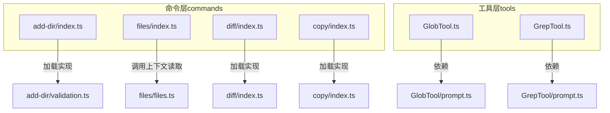
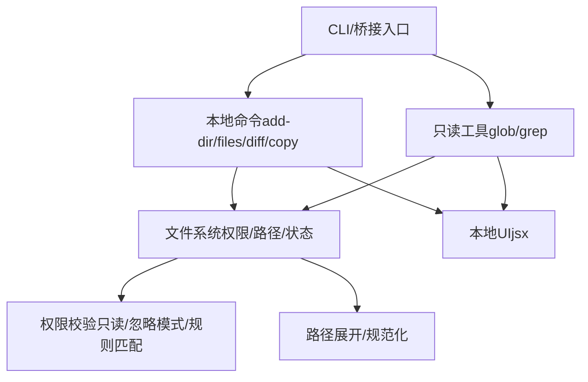
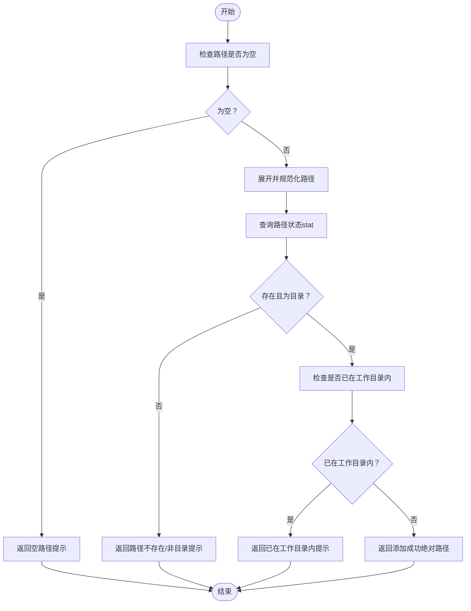
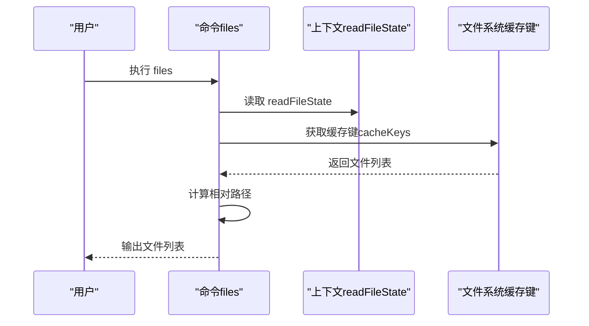
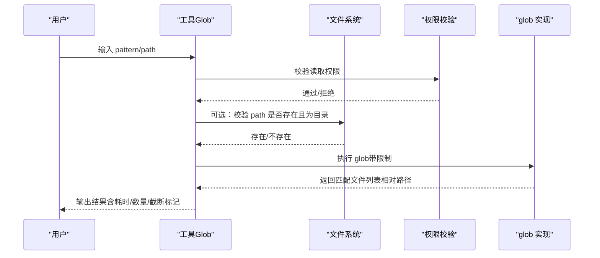
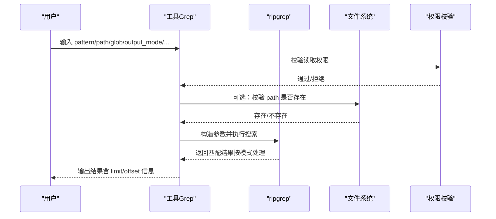
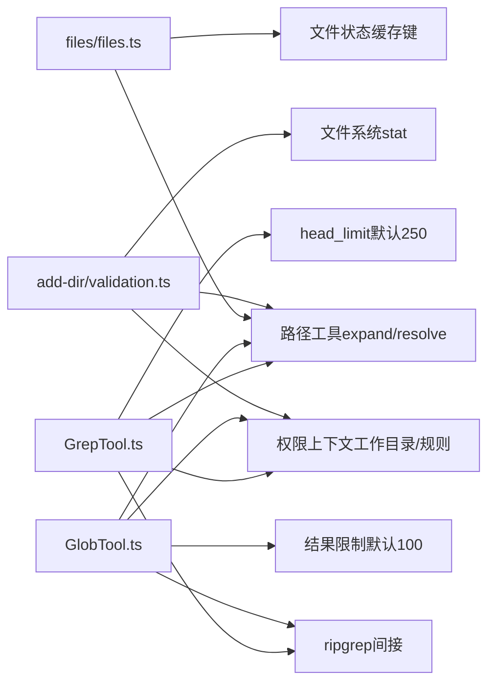

# 文件操作命令

<cite>
**本文引用的文件**
- [add-dir/index.ts](file://src/commands/add-dir/index.ts)
- [add-dir/validation.ts](file://src/commands/add-dir/validation.ts)
- [files/index.ts](file://src/commands/files/index.ts)
- [files/files.ts](file://src/commands/files/files.ts)
- [diff/index.ts](file://src/commands/diff/index.ts)
- [copy/index.ts](file://src/commands/copy/index.ts)
- [GlobTool.ts](file://src/tools/GlobTool/GlobTool.ts)
- [GlobTool/prompt.ts](file://src/tools/GlobTool/prompt.ts)
- [GrepTool.ts](file://src/tools/GrepTool/GrepTool.ts)
- [GrepTool/prompt.ts](file://src/tools/GrepTool/prompt.ts)
</cite>

## 目录
1. [简介](#简介)
2. [项目结构](#项目结构)
3. [核心组件](#核心组件)
4. [架构总览](#架构总览)
5. [详细组件分析](#详细组件分析)
6. [依赖关系分析](#依赖关系分析)
7. [性能考量](#性能考量)
8. [故障排查指南](#故障排查指南)
9. [结论](#结论)
10. [附录](#附录)

## 简介
本文件聚焦于与“文件操作”直接相关的命令与工具，包括：
- add-dir：添加工作目录（本地命令）
- files：列出当前上下文中的文件（本地命令）
- diff：查看未提交变更与按轮次的差异（本地命令）
- copy：复制 Claude 最近回复到剪贴板（本地命令）
- glob：基于通配符模式查找文件（工具）
- grep：基于正则表达式搜索文件内容（工具）

文档将从功能、参数、使用场景、实际效果、权限与安全、以及命令/工具组合使用等方面进行系统化说明，并提供最佳实践与排障建议。

## 项目结构
围绕文件操作的相关实现分布在两类位置：
- 命令层（commands）：以“本地命令”的形式提供，通常由 CLI 或桥接层触发，执行后返回文本或交互式 UI。
- 工具层（tools）：以“只读工具”形式提供，面向搜索与读取场景，具备严格的权限校验与输出格式化能力。

图表来源
- [add-dir/index.ts:1-14](file://src/commands/add-dir/index.ts#L1-L14)
- [add-dir/validation.ts:1-113](file://src/commands/add-dir/validation.ts#L1-L113)
- [files/index.ts:1-15](file://src/commands/files/index.ts#L1-L15)
- [files/files.ts:1-22](file://src/commands/files/files.ts#L1-L22)
- [diff/index.ts:1-11](file://src/commands/diff/index.ts#L1-L11)
- [copy/index.ts:1-18](file://src/commands/copy/index.ts#L1-L18)
- [GlobTool.ts:1-200](file://src/tools/GlobTool/GlobTool.ts#L1-L200)
- [GlobTool/prompt.ts:1-9](file://src/tools/GlobTool/prompt.ts#L1-L9)
- [GrepTool.ts:1-579](file://src/tools/GrepTool/GrepTool.ts#L1-L579)
- [GrepTool/prompt.ts:1-20](file://src/tools/GrepTool/prompt.ts#L1-L20)

章节来源
- [add-dir/index.ts:1-14](file://src/commands/add-dir/index.ts#L1-L14)
- [files/index.ts:1-15](file://src/commands/files/index.ts#L1-L15)
- [GlobTool.ts:1-200](file://src/tools/GlobTool/GlobTool.ts#L1-L200)
- [GrepTool.ts:1-579](file://src/tools/GrepTool/GrepTool.ts#L1-L579)

## 核心组件
本节对每个文件操作相关命令/工具进行要点梳理，便于快速定位与使用。

- add-dir
  - 类型：本地命令（local-jsx）
  - 功能：将一个目录加入工作空间作为“工作目录”
  - 关键点：路径解析、存在性与类型检查、是否已处于现有工作目录内、错误码与帮助消息
  - 典型用途：在多仓库或多子目录场景下，将目标目录纳入可访问范围
  - 权限与安全：涉及文件系统状态查询与路径展开，遵循统一的权限与错误处理策略

- files
  - 类型：本地命令（local）
  - 功能：列出当前“上下文”中已缓存的文件列表
  - 关键点：通过上下文读取文件状态缓存键，相对当前工作目录输出
  - 典型用途：快速确认当前会话关注了哪些文件，辅助后续 grep/glob 使用

- diff
  - 类型：本地命令（local-jsx）
  - 功能：查看未提交变更与按轮次的差异
  - 关键点：交互式展示，适合在 IDE/终端中审阅改动
  - 典型用途：代码编辑前后对比、批量修改后的回归检查

- copy
  - 类型：本地命令（local-jsx）
  - 功能：复制 Claude 的最近回复到剪贴板；支持指定第 N 轮回复
  - 关键点：轻量元数据命令，延迟加载实现以降低启动开销
  - 典型用途：快速复用模型生成的片段（如命令、配置、代码片段）

- glob
  - 类型：只读工具（readonly）
  - 功能：基于通配符模式查找文件，支持限制结果数量
  - 关键点：输入包含 pattern 与可选 path；默认使用当前工作目录；相对路径输出；可截断提示
  - 典型用途：在大型代码库中快速定位匹配文件，常与 grep 组合使用

- grep
  - 类型：只读工具（readonly）
  - 功能：基于正则表达式搜索文件内容，支持多种输出模式与分页
  - 关键点：支持 content/files_with_matches/count 三种模式；支持上下文行数、大小写不敏感、类型过滤、多行模式等
  - 典型用途：在代码库中检索特定逻辑、API 使用、配置项等

章节来源
- [add-dir/index.ts:1-14](file://src/commands/add-dir/index.ts#L1-L14)
- [add-dir/validation.ts:1-113](file://src/commands/add-dir/validation.ts#L1-L113)
- [files/index.ts:1-15](file://src/commands/files/index.ts#L1-L15)
- [files/files.ts:1-22](file://src/commands/files/files.ts#L1-L22)
- [diff/index.ts:1-11](file://src/commands/diff/index.ts#L1-L11)
- [copy/index.ts:1-18](file://src/commands/copy/index.ts#L1-L18)
- [GlobTool.ts:1-200](file://src/tools/GlobTool/GlobTool.ts#L1-L200)
- [GlobTool/prompt.ts:1-9](file://src/tools/GlobTool/prompt.ts#L1-L9)
- [GrepTool.ts:1-579](file://src/tools/GrepTool/GrepTool.ts#L1-L579)
- [GrepTool/prompt.ts:1-20](file://src/tools/GrepTool/prompt.ts#L1-L20)

## 架构总览
下图展示了文件操作命令/工具的整体交互关系与职责边界：

图表来源
- [add-dir/index.ts:1-14](file://src/commands/add-dir/index.ts#L1-L14)
- [files/index.ts:1-15](file://src/commands/files/index.ts#L1-L15)
- [GlobTool.ts:1-200](file://src/tools/GlobTool/GlobTool.ts#L1-L200)
- [GrepTool.ts:1-579](file://src/tools/GrepTool/GrepTool.ts#L1-L579)

## 详细组件分析

### add-dir：添加工作目录
- 功能概述
  - 将用户提供的目录路径加入工作空间，使其成为“工作目录”，从而允许后续读取与搜索该目录下的文件。
- 参数与行为
  - 输入：路径字符串（argumentHint 指示为 <path>）
  - 行为：路径展开与规范化；检查是否存在且为目录；判断是否已在现有工作目录范围内；返回成功/失败原因
- 错误与帮助
  - 支持空路径、路径不存在、非目录、已在工作目录内等多种情形，并给出明确提示
- 安全与权限
  - 对不可访问路径采用宽松错误处理策略，避免启动时崩溃；结合权限上下文进行判定
- 使用场景
  - 多模块项目、monorepo 子包切换、临时挂载外部目录
- 最佳实践
  - 优先使用绝对路径或与工作目录相关的相对路径
  - 若目标是文件，请先选择其父目录
  - 避免重复添加同一工作目录

图表来源
- [add-dir/validation.ts:31-93](file://src/commands/add-dir/validation.ts#L31-L93)

章节来源
- [add-dir/index.ts:1-14](file://src/commands/add-dir/index.ts#L1-L14)
- [add-dir/validation.ts:1-113](file://src/commands/add-dir/validation.ts#L1-L113)

### files：列出上下文文件
- 功能概述
  - 列出当前“上下文”中已缓存的文件集合，便于快速确认当前会话关注的文件范围。
- 参数与行为
  - 输入：无参数
  - 行为：从上下文读取文件状态缓存键，计算相对路径后输出
- 使用场景
  - 在执行 grep/glob 前，先用 files 确认上下文范围
  - 与其他工具组合，限定搜索范围
- 最佳实践
  - 结合 add-dir 合理划分工作目录，减少上下文膨胀

图表来源
- [files/files.ts:7-19](file://src/commands/files/files.ts#L7-L19)
- [files/index.ts:1-15](file://src/commands/files/index.ts#L1-L15)

章节来源
- [files/index.ts:1-15](file://src/commands/files/index.ts#L1-L15)
- [files/files.ts:1-22](file://src/commands/files/files.ts#L1-L22)

### diff：查看未提交变更与按轮次差异
- 功能概述
  - 提供本地差异查看能力，适合在终端或 IDE 中审阅未提交变更与按轮次的差异。
- 参数与行为
  - 输入：无参数（或由具体实现定义）
  - 行为：加载实现并渲染差异视图（本地 JSX）
- 使用场景
  - 编辑前后对比、批量修改后的回归检查、与文件编辑工具配合使用
- 最佳实践
  - 在执行文件编辑后及时查看 diff，确保改动符合预期

章节来源
- [diff/index.ts:1-11](file://src/commands/diff/index.ts#L1-L11)

### copy：复制 Claude 回复到剪贴板
- 功能概述
  - 将 Claude 的最近回复复制到剪贴板；支持指定第 N 轮回复。
- 参数与行为
  - 输入：无参数或指定轮次（由实现决定）
  - 行为：延迟加载实现，减少启动开销
- 使用场景
  - 快速复用模型生成的命令、配置、代码片段
- 最佳实践
  - 在需要复用历史回复时，明确指定轮次以避免混淆

章节来源
- [copy/index.ts:1-18](file://src/commands/copy/index.ts#L1-L18)

### glob：基于通配符查找文件
- 功能概述
  - 快速根据通配符模式查找文件，适用于任意规模的代码库；返回按修改时间排序的匹配文件路径。
- 输入参数
  - pattern：必填，通配符模式（如 "**/*.js"、"src/**/*.ts"）
  - path：可选，搜索目录，默认为当前工作目录
- 输出
  - 包含耗时、匹配文件数量、文件名数组、是否截断等字段
- 安全与权限
  - 对 UNC 路径跳过文件系统操作以避免凭据泄露
  - 严格只读，受权限上下文控制
- 使用场景
  - 定位特定类型文件、缩小搜索范围、与 grep 组合进行二次筛选
- 最佳实践
  - 使用更具体的 pattern 与 path 以减少结果集
  - 当结果被截断时，调整 pattern 或使用更精确的路径

图表来源
- [GlobTool.ts:26-176](file://src/tools/GlobTool/GlobTool.ts#L26-L176)
- [GlobTool/prompt.ts:1-9](file://src/tools/GlobTool/prompt.ts#L1-L9)

章节来源
- [GlobTool.ts:1-200](file://src/tools/GlobTool/GlobTool.ts#L1-L200)
- [GlobTool/prompt.ts:1-9](file://src/tools/GlobTool/prompt.ts#L1-L9)

### grep：基于正则表达式搜索文件内容
- 功能概述
  - 基于 ripgrep 的强大搜索能力，支持正则表达式、多种输出模式、上下文行数、大小写不敏感、类型过滤、多行模式等。
- 输入参数
  - pattern：必填，正则表达式
  - path：可选，文件或目录（默认当前工作目录）
  - glob：可选，文件过滤通配符（映射到 rg --glob）
  - output_mode：可选，content/files_with_matches/count，默认 files_with_matches
  - 上下文与行号：-B/-A/-C/context、-n
  - 大小写：-i
  - 类型：type（如 js、py、rust 等）
  - head_limit：限制输出条目数，默认 250，0 表示不限制
  - offset：偏移量，用于分页
  - multiline：启用跨行匹配
- 输出
  - 根据模式返回内容、文件列表或计数，并标注应用的 limit/offset
- 安全与权限
  - 对 UNC 路径跳过文件系统操作；严格只读；受权限上下文控制
- 使用场景
  - 定位特定逻辑、API 使用、配置项、错误模式等
- 最佳实践
  - 优先使用 grep 进行搜索，避免直接调用 bash 中的 grep/rg
  - 使用 type 或 glob 精确过滤文件类型或扩展名
  - content 模式下合理设置 head_limit 与上下文，避免上下文溢出
  - open-ended 的多轮探索建议使用 Agent 工具

图表来源
- [GrepTool.ts:33-576](file://src/tools/GrepTool/GrepTool.ts#L33-L576)
- [GrepTool/prompt.ts:1-20](file://src/tools/GrepTool/prompt.ts#L1-L20)

章节来源
- [GrepTool.ts:1-579](file://src/tools/GrepTool/GrepTool.ts#L1-L579)
- [GrepTool/prompt.ts:1-20](file://src/tools/GrepTool/prompt.ts#L1-L20)

## 依赖关系分析
- add-dir
  - 依赖路径展开与文件系统状态查询，结合权限上下文判断是否已在工作目录内
- files
  - 依赖上下文中的文件状态缓存键，计算相对路径输出
- glob/grep
  - 依赖 ripgrep、权限校验、忽略模式、通配符匹配、路径展开与相对化
  - glob 默认只读、可截断；grep 支持多种输出模式与分页

图表来源
- [add-dir/validation.ts:1-113](file://src/commands/add-dir/validation.ts#L1-L113)
- [files/files.ts:1-22](file://src/commands/files/files.ts#L1-L22)
- [GlobTool.ts:1-200](file://src/tools/GlobTool/GlobTool.ts#L1-L200)
- [GrepTool.ts:1-579](file://src/tools/GrepTool/GrepTool.ts#L1-L579)

章节来源
- [add-dir/validation.ts:1-113](file://src/commands/add-dir/validation.ts#L1-L113)
- [files/files.ts:1-22](file://src/commands/files/files.ts#L1-L22)
- [GlobTool.ts:1-200](file://src/tools/GlobTool/GlobTool.ts#L1-L200)
- [GrepTool.ts:1-579](file://src/tools/GrepTool/GrepTool.ts#L1-L579)

## 性能考量
- glob
  - 默认限制最多返回 100 个文件，避免大结果集导致上下文膨胀
  - 结果相对化以节省 token
- grep
  - 默认 head_limit 为 250，防止 content 模式下产生大量输出
  - 对超长行设置最大列宽，避免 base64/minified 内容污染输出
  - 多轮 open-ended 探索建议使用 Agent 工具，避免单次请求过大
- add-dir/files
  - add-dir 仅做一次 stat 检查；files 仅读取缓存键，开销极低

[本节为通用性能讨论，无需特定文件来源]

## 故障排查指南
- add-dir
  - 空路径：请提供有效路径
  - 路径不存在/非目录：确认路径是否正确；若为文件，请选择其父目录
  - 已在工作目录内：无需重复添加
- files
  - 上下文为空：尚未添加任何文件或未正确进入工作目录
- glob
  - 结果被截断：使用更具体的 pattern 或 path；或在后续调用中使用 offset 分页
  - UNC 路径：跳过文件系统操作，避免凭据泄露风险
- grep
  - head_limit 过小：适当提高 head_limit 或使用 offset 分页
  - 正则模式特殊字符：注意 ripgrep 的语法，必要时转义
  - 多行模式：当需要跨行匹配时启用 multiline
  - VCS 目录噪声：自动排除常见版本控制目录，避免干扰

章节来源
- [add-dir/validation.ts:95-110](file://src/commands/add-dir/validation.ts#L95-L110)
- [GlobTool.ts:154-176](file://src/tools/GlobTool/GlobTool.ts#L154-L176)
- [GrepTool.ts:104-128](file://src/tools/GrepTool/GrepTool.ts#L104-L128)
- [GrepTool.ts:330-343](file://src/tools/GrepTool/GrepTool.ts#L330-L343)

## 结论
- add-dir/files/diff/copy 属于“本地命令”，侧重于工作目录管理、上下文可视化与交互式差异查看
- glob/grep 属于“只读工具”，强调权限安全、结果可控与强大的搜索能力
- 建议在探索阶段优先使用 glob 缩小范围，再用 grep 精确定位；open-ended 场景使用 Agent 工具进行多轮迭代
- 注意权限与安全：UNC 路径跳过文件系统操作、严格只读、忽略模式与规则匹配贯穿工具链

[本节为总结性内容，无需特定文件来源]

## 附录
- 命令与工具组合使用示例思路
  - 定位：glob → 选择若干文件
  - 搜索：grep（content 模式）→ 定位关键逻辑
  - 审阅：diff → 查看改动
  - 复用：copy → 复制模型输出
- 权限与安全清单
  - 严格只读（glob/grep）
  - 权限上下文与忽略模式
  - UNC 路径安全处理
  - 错误码与帮助消息一致性

[本节为概念性内容，无需特定文件来源]