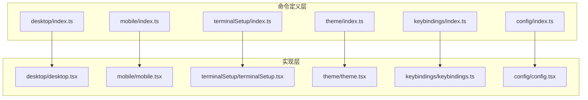
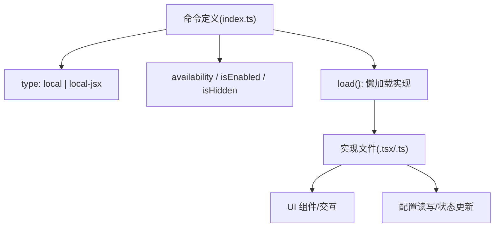
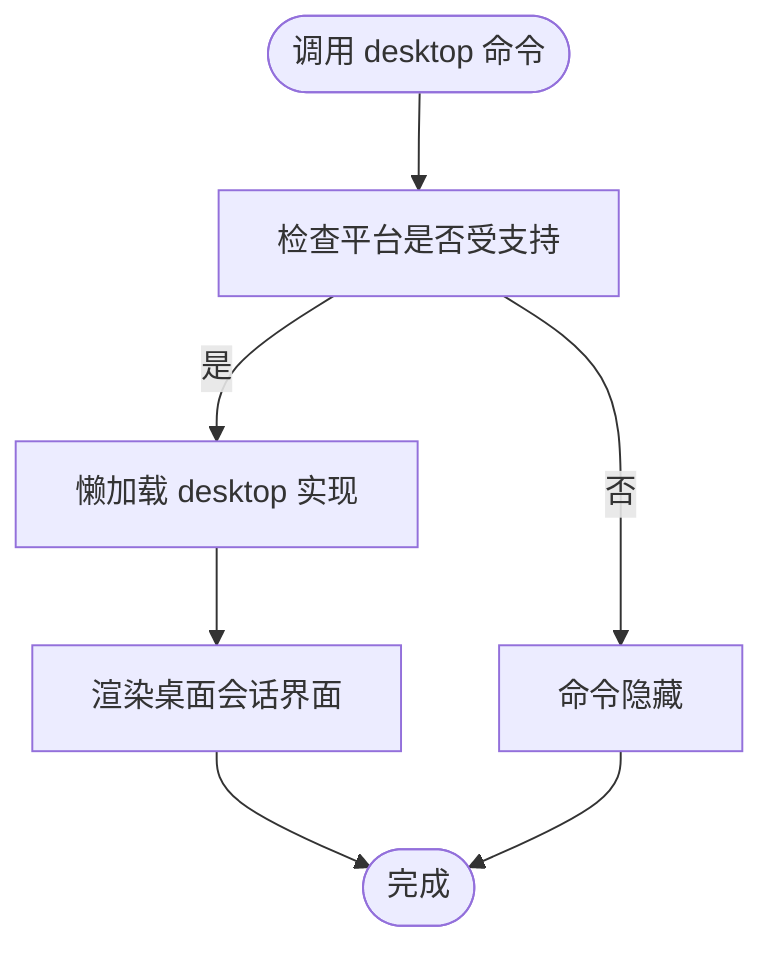
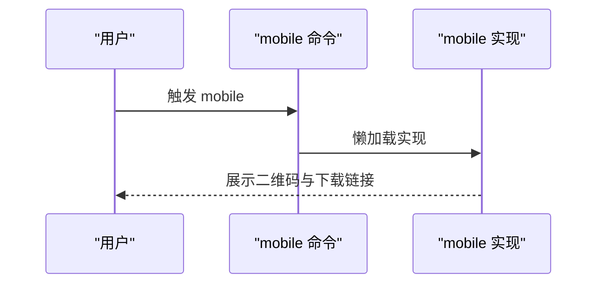
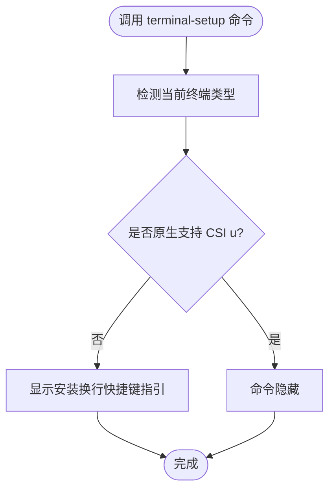
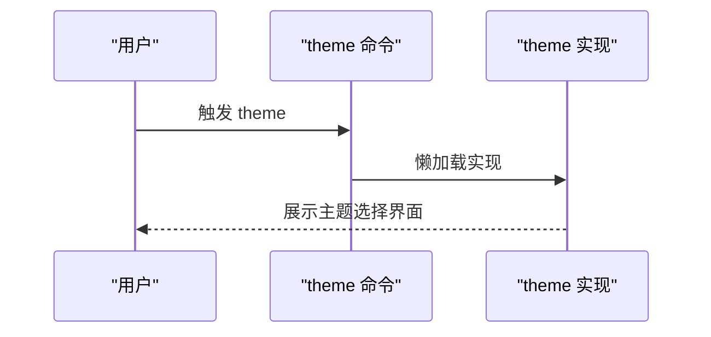
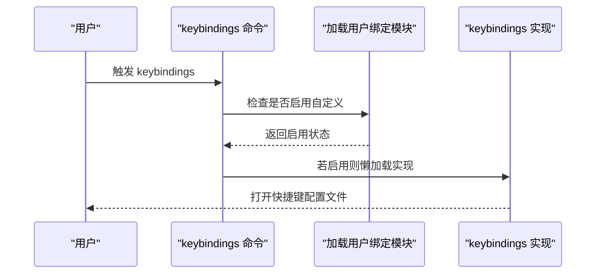
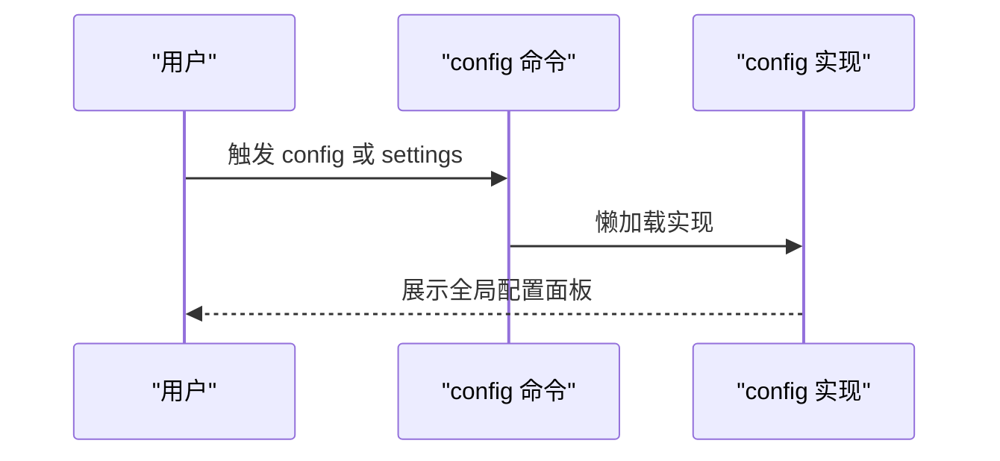
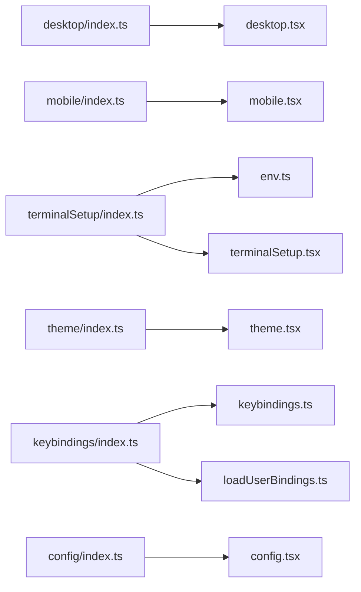

# 系统命令

<cite>
**本文引用的文件**
- [src/commands/desktop/index.ts](file://src/commands/desktop/index.ts)
- [src/commands/desktop/desktop.tsx](file://src/commands/desktop/desktop.tsx)
- [src/commands/mobile/index.ts](file://src/commands/mobile/index.ts)
- [src/commands/mobile/mobile.tsx](file://src/commands/mobile/mobile.tsx)
- [src/commands/terminalSetup/index.ts](file://src/commands/terminalSetup/index.ts)
- [src/commands/terminalSetup/terminalSetup.tsx](file://src/commands/terminalSetup/terminalSetup.tsx)
- [src/commands/theme/index.ts](file://src/commands/theme/index.ts)
- [src/commands/theme/theme.tsx](file://src/commands/theme/theme.tsx)
- [src/commands/keybindings/index.ts](file://src/commands/keybindings/index.ts)
- [src/commands/keybindings/keybindings.ts](file://src/commands/keybindings/keybindings.ts)
- [src/commands/config/index.ts](file://src/commands/config/index.ts)
- [src/commands/config/config.tsx](file://src/commands/config/config.tsx)
- [src/utils/env.ts](file://src/utils/env.ts)
- [src/keybindings/loadUserBindings.ts](file://src/keybindings/loadUserBindings.ts)
</cite>

## 目录
1. [简介](#简介)
2. [项目结构](#项目结构)
3. [核心组件](#核心组件)
4. [架构总览](#架构总览)
5. [详细组件分析](#详细组件分析)
6. [依赖关系分析](#依赖关系分析)
7. [性能考虑](#性能考虑)
8. [故障排除指南](#故障排除指南)
9. [结论](#结论)
10. [附录](#附录)

## 简介
本文件聚焦于系统配置相关的命令，包括 desktop（桌面）、mobile（移动）、terminal-setup（终端设置）、theme（主题）、keybindings（快捷键）与 config（全局配置）。我们将从功能、可用性、适用场景、实际效果、兼容性与故障排除等维度进行系统化说明，并通过图示展示命令与核心模块之间的关系。

## 项目结构
这些命令均位于 src/commands 下，采用“按命令分目录”的组织方式，每个命令在各自目录下提供一个 index.ts 暴露命令元数据（类型、名称、别名、描述、可用平台/环境检测、懒加载入口），并在同目录内提供对应实现文件（如 desktop.tsx、mobile.tsx 等）。

图表来源
- [src/commands/desktop/index.ts:1-29](file://src/commands/desktop/index.ts#L1-L29)
- [src/commands/mobile/index.ts:1-14](file://src/commands/mobile/index.ts#L1-L14)
- [src/commands/terminalSetup/index.ts:1-26](file://src/commands/terminalSetup/index.ts#L1-L26)
- [src/commands/theme/index.ts:1-13](file://src/commands/theme/index.ts#L1-L13)
- [src/commands/keybindings/index.ts:1-16](file://src/commands/keybindings/index.ts#L1-L16)
- [src/commands/config/index.ts:1-14](file://src/commands/config/index.ts#L1-L14)

章节来源
- [src/commands/desktop/index.ts:1-29](file://src/commands/desktop/index.ts#L1-L29)
- [src/commands/mobile/index.ts:1-14](file://src/commands/mobile/index.ts#L1-L14)
- [src/commands/terminalSetup/index.ts:1-26](file://src/commands/terminalSetup/index.ts#L1-L26)
- [src/commands/theme/index.ts:1-13](file://src/commands/theme/index.ts#L1-L13)
- [src/commands/keybindings/index.ts:1-16](file://src/commands/keybindings/index.ts#L1-L16)
- [src/commands/config/index.ts:1-14](file://src/commands/config/index.ts#L1-L14)

## 核心组件
- desktop：在受支持的桌面平台（macOS 或 Windows x64）上启用“在 Claude Desktop 继续会话”的能力，命令类型为本地 JSX，支持别名 app。
- mobile：显示用于下载 Claude 移动应用的二维码，支持别名 ios、android；命令类型为本地 JSX。
- terminal-setup：根据当前终端类型（如 iTerm2、Kitty、WezTerm、Ghostty）提示启用原生键盘协议支持或安装换行快捷键（Shift+Enter），命令类型为本地 JSX。
- theme：打开主题选择界面，命令类型为本地 JSX。
- keybindings：打开或创建用户快捷键配置文件，仅在启用快捷键自定义时可用，命令类型为本地。
- config：打开全局配置面板，命令类型为本地 JSX，支持别名 settings。

章节来源
- [src/commands/desktop/index.ts:13-24](file://src/commands/desktop/index.ts#L13-L24)
- [src/commands/mobile/index.ts:3-9](file://src/commands/mobile/index.ts#L3-L9)
- [src/commands/terminalSetup/index.ts:12-21](file://src/commands/terminalSetup/index.ts#L12-L21)
- [src/commands/theme/index.ts:3-8](file://src/commands/theme/index.ts#L3-L8)
- [src/commands/keybindings/index.ts:4-11](file://src/commands/keybindings/index.ts#L4-L11)
- [src/commands/config/index.ts:3-9](file://src/commands/config/index.ts#L3-L9)

## 架构总览
命令定义层通过 type 字段声明命令类型（local/local-jsx），通过 isEnabled/isHidden 等属性控制可用性与可见性，通过 load 懒加载具体实现。实现文件负责渲染 UI 或执行配置逻辑。

图表来源
- [src/commands/desktop/index.ts:13-24](file://src/commands/desktop/index.ts#L13-L24)
- [src/commands/terminalSetup/index.ts:12-21](file://src/commands/terminalSetup/index.ts#L12-L21)
- [src/commands/keybindings/index.ts:4-11](file://src/commands/keybindings/index.ts#L4-L11)
- [src/commands/config/index.ts:3-9](file://src/commands/config/index.ts#L3-L9)

## 详细组件分析

### desktop 命令
- 功能：在受支持的桌面平台上，提供“在 Claude Desktop 继续会话”的入口。
- 可用性与平台限制：
  - 仅在 macOS 或 Windows x64 上可用。
  - 通过平台检测函数控制 isEnabled 与 isHidden。
- 实际效果：加载 desktop 实现文件，呈现桌面端继续会话的交互界面。
- 兼容性要求：需要运行在受支持的操作系统与架构上；若不满足条件，命令将隐藏。
- 适用场景：希望在桌面应用中继续当前对话或任务的用户。

图表来源
- [src/commands/desktop/index.ts:3-24](file://src/commands/desktop/index.ts#L3-L24)

章节来源
- [src/commands/desktop/index.ts:3-24](file://src/commands/desktop/index.ts#L3-L24)
- [src/commands/desktop/desktop.tsx](file://src/commands/desktop/desktop.tsx)

### mobile 命令
- 功能：显示二维码以下载 Claude 移动应用，支持别名 ios、android。
- 可用性：无平台限制，始终可见。
- 实际效果：加载 mobile 实现文件，展示移动端下载入口。
- 适用场景：需要在移动设备上继续使用系统的用户。

图表来源
- [src/commands/mobile/index.ts:3-9](file://src/commands/mobile/index.ts#L3-L9)
- [src/commands/mobile/mobile.tsx](file://src/commands/mobile/mobile.tsx)

章节来源
- [src/commands/mobile/index.ts:3-9](file://src/commands/mobile/index.ts#L3-L9)
- [src/commands/mobile/mobile.tsx](file://src/commands/mobile/mobile.tsx)

### terminal-setup 命令
- 功能：根据当前终端类型提示启用原生键盘协议（CSI u/Kitty 键盘协议）或安装换行快捷键（Shift+Enter）。
- 终端识别：通过环境变量与预定义映射识别 Ghostty、Kitty、iTerm2、WezTerm。
- 可见性：当当前终端属于原生支持 CSI u 的终端时，命令会被隐藏（isHidden 为真）。
- 实际效果：加载 terminalSetup 实现文件，引导用户进行终端配置。
- 适用场景：在支持原生键盘协议的终端中优化输入体验；在不支持的终端中启用换行快捷键。

图表来源
- [src/commands/terminalSetup/index.ts:4-21](file://src/commands/terminalSetup/index.ts#L4-L21)
- [src/utils/env.ts](file://src/utils/env.ts)

章节来源
- [src/commands/terminalSetup/index.ts:4-21](file://src/commands/terminalSetup/index.ts#L4-L21)
- [src/commands/terminalSetup/terminalSetup.tsx](file://src/commands/terminalSetup/terminalSetup.tsx)
- [src/utils/env.ts](file://src/utils/env.ts)

### theme 命令
- 功能：打开主题选择界面，允许用户切换界面主题。
- 可用性：无特殊限制，命令类型为本地 JSX。
- 实际效果：加载 theme 实现文件，呈现主题选择 UI。
- 适用场景：个性化界面外观，提升使用体验。

图表来源
- [src/commands/theme/index.ts:3-8](file://src/commands/theme/index.ts#L3-L8)
- [src/commands/theme/theme.tsx](file://src/commands/theme/theme.tsx)

章节来源
- [src/commands/theme/index.ts:3-8](file://src/commands/theme/index.ts#L3-L8)
- [src/commands/theme/theme.tsx](file://src/commands/theme/theme.tsx)

### keybindings 命令
- 功能：打开或创建用户的快捷键配置文件。
- 启用条件：仅当启用快捷键自定义时可用（由加载用户绑定的模块判断）。
- 可用性：命令类型为本地，不支持非交互模式。
- 实际效果：加载 keybindings 实现文件，呈现快捷键编辑界面。
- 适用场景：需要自定义快捷键以提高操作效率的高级用户。

图表来源
- [src/commands/keybindings/index.ts:4-11](file://src/commands/keybindings/index.ts#L4-L11)
- [src/keybindings/loadUserBindings.ts](file://src/keybindings/loadUserBindings.ts)

章节来源
- [src/commands/keybindings/index.ts:4-11](file://src/commands/keybindings/index.ts#L4-L11)
- [src/commands/keybindings/keybindings.ts](file://src/commands/keybindings/keybindings.ts)
- [src/keybindings/loadUserBindings.ts](file://src/keybindings/loadUserBindings.ts)

### config 命令
- 功能：打开全局配置面板，集中管理各类设置。
- 别名：settings。
- 可用性：命令类型为本地 JSX。
- 实际效果：加载 config 实现文件，呈现全局配置界面。
- 适用场景：需要统一查看与调整系统配置的用户。

图表来源
- [src/commands/config/index.ts:3-9](file://src/commands/config/index.ts#L3-L9)
- [src/commands/config/config.tsx](file://src/commands/config/config.tsx)

章节来源
- [src/commands/config/index.ts:3-9](file://src/commands/config/index.ts#L3-L9)
- [src/commands/config/config.tsx](file://src/commands/config/config.tsx)

## 依赖关系分析
- 平台/环境检测：
  - desktop 依赖平台检测函数以决定可用性与可见性。
  - terminal-setup 依赖环境变量与预定义映射决定是否隐藏。
- 快捷键自定义：
  - keybindings 依赖用户绑定加载模块来判断是否启用自定义。
- 命令类型与懒加载：
  - 所有命令通过 type 字段声明类型，并通过 load 懒加载实现文件，降低启动时的初始化成本。

图表来源
- [src/commands/desktop/index.ts:1-29](file://src/commands/desktop/index.ts#L1-L29)
- [src/commands/mobile/index.ts:1-14](file://src/commands/mobile/index.ts#L1-L14)
- [src/commands/terminalSetup/index.ts:1-26](file://src/commands/terminalSetup/index.ts#L1-L26)
- [src/commands/theme/index.ts:1-13](file://src/commands/theme/index.ts#L1-L13)
- [src/commands/keybindings/index.ts:1-16](file://src/commands/keybindings/index.ts#L1-L16)
- [src/commands/config/index.ts:1-14](file://src/commands/config/index.ts#L1-L14)
- [src/utils/env.ts](file://src/utils/env.ts)
- [src/keybindings/loadUserBindings.ts](file://src/keybindings/loadUserBindings.ts)

章节来源
- [src/commands/desktop/index.ts:1-29](file://src/commands/desktop/index.ts#L1-L29)
- [src/commands/mobile/index.ts:1-14](file://src/commands/mobile/index.ts#L1-L14)
- [src/commands/terminalSetup/index.ts:1-26](file://src/commands/terminalSetup/index.ts#L1-L26)
- [src/commands/theme/index.ts:1-13](file://src/commands/theme/index.ts#L1-L13)
- [src/commands/keybindings/index.ts:1-16](file://src/commands/keybindings/index.ts#L1-L16)
- [src/commands/config/index.ts:1-14](file://src/commands/config/index.ts#L1-L14)
- [src/utils/env.ts](file://src/utils/env.ts)
- [src/keybindings/loadUserBindings.ts](file://src/keybindings/loadUserBindings.ts)

## 性能考虑
- 懒加载策略：所有命令均通过 load 进行懒加载，避免一次性加载全部实现，降低启动时内存与 CPU 开销。
- 条件渲染：desktop 与 keybindings 通过 isEnabled/isHidden 控制可见性，减少不必要的 UI 渲染。
- 终端设置：terminal-setup 在已知原生支持的终端中隐藏，避免重复提示与无效操作。

## 故障排除指南
- desktop 命令不可见或不可用
  - 检查操作系统与架构是否满足要求（macOS 或 Windows x64）。
  - 确认命令未被平台检测逻辑隐藏。
  - 参考路径：[desktop/index.ts:3-24](file://src/commands/desktop/index.ts#L3-L24)
- terminal-setup 命令被隐藏
  - 当前终端在原生支持 CSI u 的列表中时，命令将被隐藏，这是预期行为。
  - 如需启用换行快捷键，请确认终端不在原生支持列表中。
  - 参考路径：[terminalSetup/index.ts:4-21](file://src/commands/terminalSetup/index.ts#L4-L21)，[env.ts](file://src/utils/env.ts)
- keybindings 命令无法打开
  - 确认快捷键自定义功能已启用，否则命令将不可用。
  - 参考路径：[keybindings/index.ts:4-11](file://src/commands/keybindings/index.ts#L4-L11)，[loadUserBindings.ts](file://src/keybindings/loadUserBindings.ts)
- theme 与 config 命令无响应
  - 确认命令类型为本地 JSX，且实现文件存在。
  - 参考路径：[theme/index.ts:3-8](file://src/commands/theme/index.ts#L3-L8)，[config/index.ts:3-9](file://src/commands/config/index.ts#L3-L9)

章节来源
- [src/commands/desktop/index.ts:3-24](file://src/commands/desktop/index.ts#L3-L24)
- [src/commands/terminalSetup/index.ts:4-21](file://src/commands/terminalSetup/index.ts#L4-L21)
- [src/utils/env.ts](file://src/utils/env.ts)
- [src/commands/keybindings/index.ts:4-11](file://src/commands/keybindings/index.ts#L4-L11)
- [src/keybindings/loadUserBindings.ts](file://src/keybindings/loadUserBindings.ts)
- [src/commands/theme/index.ts:3-8](file://src/commands/theme/index.ts#L3-L8)
- [src/commands/config/index.ts:3-9](file://src/commands/config/index.ts#L3-L9)

## 结论
上述系统配置命令围绕“桌面、移动、终端、主题、快捷键、全局配置”六大方面构建，通过平台/环境检测、懒加载与条件可用性控制，确保在不同环境下提供一致且高效的用户体验。建议在实际使用中结合自身平台与终端特性，合理选择与配置相应命令，以获得最佳的使用效果。

## 附录
- 配置示例（步骤说明）
  - desktop：在 macOS 或 Windows x64 上触发命令，进入桌面会话界面。
  - mobile：触发命令后，扫描二维码下载移动应用。
  - terminal-setup：在原生支持的终端中无需额外配置；在其他终端中遵循指引启用换行快捷键。
  - theme：打开主题选择界面，选择偏好的主题样式。
  - keybindings：在启用自定义的情况下，打开快捷键配置文件进行编辑。
  - config：打开全局配置面板，统一管理各项设置。
- 兼容性清单
  - desktop：macOS、Windows x64。
  - mobile：跨平台（iOS、Android）。
  - terminal-setup：支持 Ghostty、Kitty、iTerm2、WezTerm 等原生 CSI u 终端；其他终端将提示安装换行快捷键。
  - theme：通用。
  - keybindings：需启用快捷键自定义。
  - config：通用。