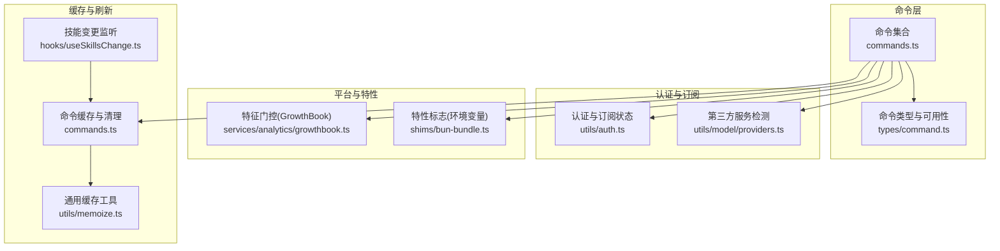
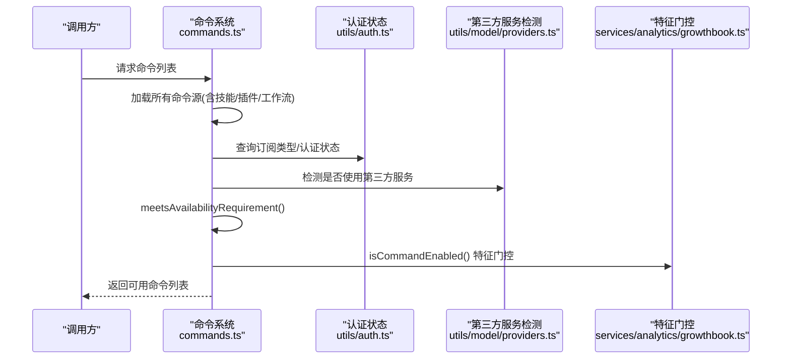
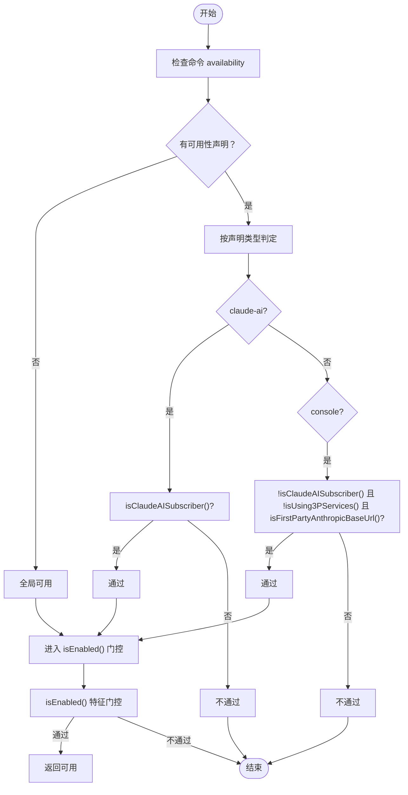
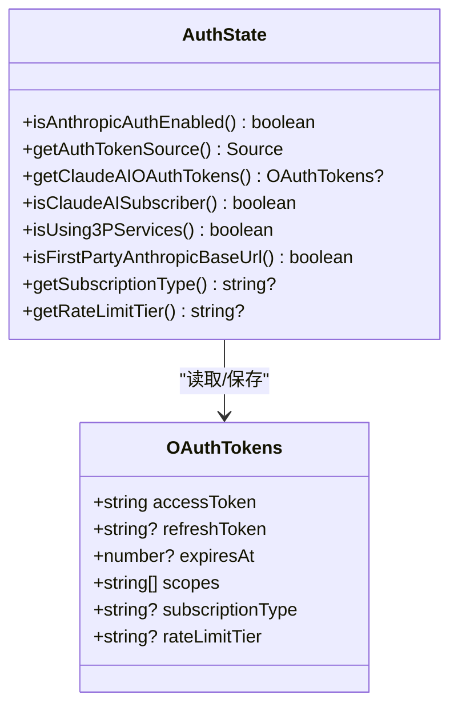
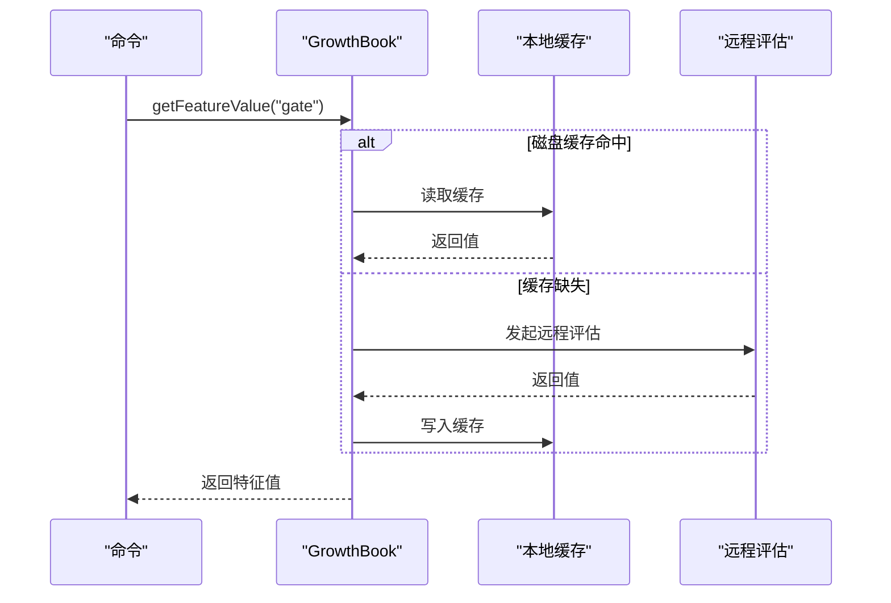
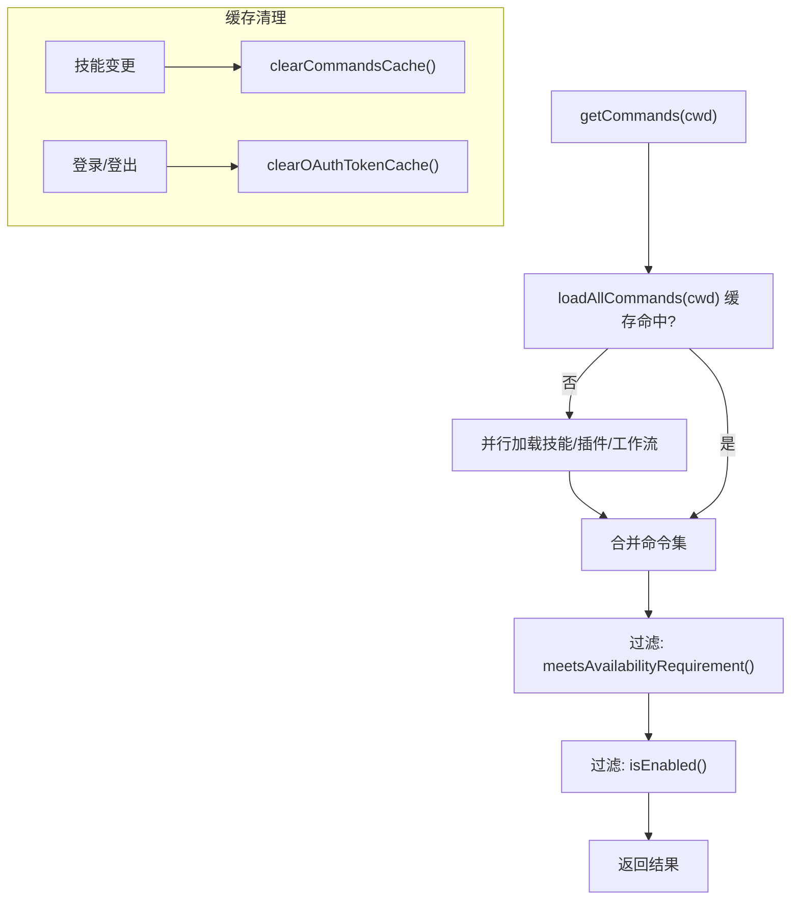
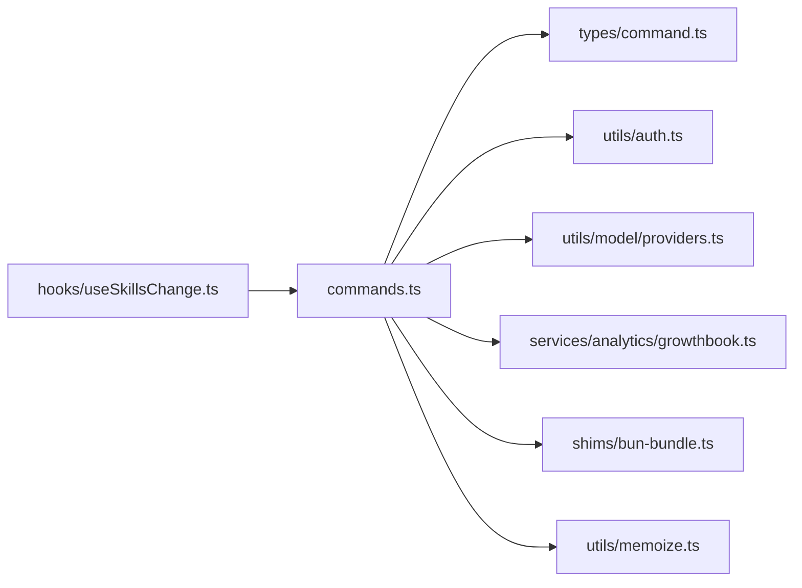

# 命令可用性管理

<cite>
**本文档引用的文件**
- [commands.ts](file://src/commands.ts)
- [command.ts](file://src/types/command.ts)
- [auth.ts](file://src/utils/auth.ts)
- [providers.ts](file://src/utils/model/providers.ts)
- [growthbook.ts](file://src/services/analytics/growthbook.ts)
- [useSkillsChange.ts](file://src/hooks/useSkillsChange.ts)
- [useMergedCommands.ts](file://src/hooks/useMergedCommands.ts)
- [bun-bundle.ts](file://src/shims/bun-bundle.ts)
- [state.ts](file://src/bootstrap/state.ts)
- [memoize.ts](file://src/utils/memoize.ts)
</cite>

## 目录
1. [简介](#简介)
2. [项目结构](#项目结构)
3. [核心组件](#核心组件)
4. [架构总览](#架构总览)
5. [详细组件分析](#详细组件分析)
6. [依赖关系分析](#依赖关系分析)
7. [性能考量](#性能考量)
8. [故障排查指南](#故障排查指南)
9. [结论](#结论)
10. [附录](#附录)

## 简介
本文件系统化阐述 Claude Code 命令可用性管理的设计与实现，覆盖以下关键主题：
- 命令可用性的多级判定：认证来源（claude-ai、console 等）、平台能力（第三方服务检测）、特征标志（feature flags）
- 动态可用性检查与缓存策略：按需计算、内存缓存、失效与刷新
- 条件加载与特性开关：基于环境变量与构建期特征标志的命令条件加载
- 诊断与排障：常见问题定位与修复建议
- 最佳实践：配置与运维建议

## 项目结构
命令可用性管理主要分布在以下模块：
- 命令定义与可用性：命令类型定义、可用性声明、可用性检查函数
- 认证与订阅状态：OAuth/API Key 源、订阅类型、第三方服务检测
- 特征与平台：GrowthBook 特征门控、环境变量特性开关
- 缓存与刷新：命令列表缓存、令牌与凭据缓存、技能变更触发刷新
- 条件加载：构建期特性标志、运行时特性检测

**图表来源**
- [commands.ts:419-445](file://src/commands.ts#L419-L445)
- [command.ts:169-173](file://src/types/command.ts#L169-L173)
- [auth.ts:1731-1738](file://src/utils/auth.ts#L1731-L1738)
- [providers.ts:1-40](file://src/utils/model/providers.ts#L1-L40)
- [growthbook.ts:917-935](file://src/services/analytics/growthbook.ts#L917-L935)
- [bun-bundle.ts:24-41](file://src/shims/bun-bundle.ts#L24-L41)
- [useSkillsChange.ts:1-43](file://src/hooks/useSkillsChange.ts#L1-L43)
- [memoize.ts:174-215](file://src/utils/memoize.ts#L174-L215)

**章节来源**
- [commands.ts:1-759](file://src/commands.ts#L1-L759)
- [command.ts:154-173](file://src/types/command.ts#L154-L173)
- [auth.ts:1731-1738](file://src/utils/auth.ts#L1731-L1738)
- [providers.ts:1-40](file://src/utils/model/providers.ts#L1-L40)
- [growthbook.ts:917-935](file://src/services/analytics/growthbook.ts#L917-L935)
- [bun-bundle.ts:24-41](file://src/shims/bun-bundle.ts#L24-L41)
- [useSkillsChange.ts:1-43](file://src/hooks/useSkillsChange.ts#L1-L43)
- [memoize.ts:174-215](file://src/utils/memoize.ts#L174-L215)

## 核心组件
- 命令可用性声明与检查
  - 可用性枚举：支持 claude-ai 与 console 两类认证来源
  - 可用性检查函数：根据当前认证状态与第三方服务检测结果动态判定
- 认证与订阅状态
  - OAuth/API Key 源解析、订阅类型与速率等级获取
  - 第三方服务检测：Bedrock/Vertex/Foundry
- 特征与平台
  - GrowthBook 特征门控：远程评估、本地缓存、刷新与覆盖
  - 构建期/运行时特性标志：feature() 与环境变量
- 缓存与刷新
  - 命令列表缓存：按工作目录 memoize
  - 技能变更触发全量缓存清理
  - 令牌与凭据缓存：TTL 与异步刷新

**章节来源**
- [command.ts:169-173](file://src/types/command.ts#L169-L173)
- [commands.ts:419-445](file://src/commands.ts#L419-L445)
- [auth.ts:1662-1738](file://src/utils/auth.ts#L1662-L1738)
- [growthbook.ts:194-232](file://src/services/analytics/growthbook.ts#L194-L232)
- [bun-bundle.ts:24-41](file://src/shims/bun-bundle.ts#L24-L41)
- [commands.ts:525-541](file://src/commands.ts#L525-L541)

## 架构总览
命令可用性管理遵循“静态可用性声明 + 动态可用性检查 + 平台/特性门控”的分层设计。命令在声明阶段通过 availability 字段限定可使用人群；在运行时，meetAvailabilityRequirement() 结合认证状态与第三方服务检测进行过滤；最终再叠加 isEnabled() 的特征门控。

**图表来源**
- [commands.ts:478-519](file://src/commands.ts#L478-L519)
- [commands.ts:419-445](file://src/commands.ts#L419-L445)
- [auth.ts:1662-1738](file://src/utils/auth.ts#L1662-L1738)
- [providers.ts:1-40](file://src/utils/model/providers.ts#L1-L40)
- [growthbook.ts:917-935](file://src/services/analytics/growthbook.ts#L917-L935)

## 详细组件分析

### 命令可用性声明与判定
- 可用性声明
  - availability 字段用于声明命令适用的认证来源，如 claude-ai、console
  - 未声明 availability 的命令默认视为全局可用
- 可用性判定流程
  - meetAvailabilityRequirement() 对每个命令逐一检查
  - claude-ai：要求 isClaudeAISubscriber() 为真
  - console：要求非 claude.ai 订阅者、非第三方服务用户、且使用第一方 Anthropic 基础地址
- isEnabled() 门控
  - 基于 GrowthBook 特征值与本地缓存，支持环境变量覆盖与运行时刷新

**图表来源**
- [commands.ts:419-445](file://src/commands.ts#L419-L445)
- [command.ts:169-173](file://src/types/command.ts#L169-L173)
- [auth.ts:1662-1738](file://src/utils/auth.ts#L1662-L1738)
- [providers.ts:25-40](file://src/utils/model/providers.ts#L25-L40)

**章节来源**
- [command.ts:154-173](file://src/types/command.ts#L154-L173)
- [commands.ts:419-445](file://src/commands.ts#L419-L445)
- [auth.ts:1662-1738](file://src/utils/auth.ts#L1662-L1738)
- [providers.ts:25-40](file://src/utils/model/providers.ts#L25-L40)

### 认证状态与订阅类型
- 认证来源与令牌
  - 支持环境变量、文件描述符、安全存储等多种来源
  - OAuth 令牌过期处理、并发刷新去重、磁盘变更感知
- 订阅类型与速率等级
  - 通过 OAuth 获取订阅类型（pro/max/team/enterprise/null）
  - 速率等级与订阅类型联动
- 第三方服务检测
  - 通过环境变量识别 Bedrock/Vertex/Foundry
  - 使用第一方 Anthropic 基础地址判断直连 1P 用户

**图表来源**
- [auth.ts:100-149](file://src/utils/auth.ts#L100-L149)
- [auth.ts:1255-1300](file://src/utils/auth.ts#L1255-L1300)
- [auth.ts:1564-1570](file://src/utils/auth.ts#L1564-L1570)
- [auth.ts:1731-1738](file://src/utils/auth.ts#L1731-L1738)
- [providers.ts:25-40](file://src/utils/model/providers.ts#L25-L40)

**章节来源**
- [auth.ts:100-149](file://src/utils/auth.ts#L100-L149)
- [auth.ts:1255-1300](file://src/utils/auth.ts#L1255-L1300)
- [auth.ts:1564-1570](file://src/utils/auth.ts#L1564-L1570)
- [auth.ts:1731-1738](file://src/utils/auth.ts#L1731-L1738)
- [providers.ts:25-40](file://src/utils/model/providers.ts#L25-L40)

### 特征门控与平台能力
- GrowthBook 远程评估与本地缓存
  - 首次命中磁盘缓存，随后走远程评估
  - 支持环境变量覆盖与运行时刷新
- 环境变量特性标志
  - 构建期与运行时通过 feature() 判断
  - 影响命令条件加载（如 KAIROS、VOICE_MODE 等）

**图表来源**
- [growthbook.ts:917-935](file://src/services/analytics/growthbook.ts#L917-L935)
- [growthbook.ts:194-232](file://src/services/analytics/growthbook.ts#L194-L232)
- [bun-bundle.ts:24-41](file://src/shims/bun-bundle.ts#L24-L41)

**章节来源**
- [growthbook.ts:917-935](file://src/services/analytics/growthbook.ts#L917-L935)
- [growthbook.ts:194-232](file://src/services/analytics/growthbook.ts#L194-L232)
- [bun-bundle.ts:24-41](file://src/shims/bun-bundle.ts#L24-L41)

### 动态可用性检查与缓存策略
- 命令列表缓存
  - loadAllCommands() 按工作目录 memoize，避免重复 I/O
  - getCommands() 在每次调用时重新评估 meetsAvailabilityRequirement() 与 isEnabled()
- 技能变更触发缓存清理
  - useSkillsChange() 监听技能文件变化，清空命令缓存并重新扫描
- 令牌与凭据缓存
  - memoizeWithTTLAsync 提供带 TTL 的异步缓存，支持后台刷新与错误回退
  - 命令可用性相关缓存（如 OAuth）在磁盘变更或 401 时失效

**图表来源**
- [commands.ts:451-471](file://src/commands.ts#L451-L471)
- [commands.ts:478-519](file://src/commands.ts#L478-L519)
- [useSkillsChange.ts:24-43](file://src/hooks/useSkillsChange.ts#L24-L43)
- [memoize.ts:174-215](file://src/utils/memoize.ts#L174-L215)

**章节来源**
- [commands.ts:451-519](file://src/commands.ts#L451-L519)
- [useSkillsChange.ts:24-43](file://src/hooks/useSkillsChange.ts#L24-L43)
- [memoize.ts:174-215](file://src/utils/memoize.ts#L174-L215)

### 条件加载与特征标志控制
- 构建期特性标志
  - feature() 由环境变量映射而来，影响命令模块的条件导入
- 运行时特性检测
  - 通过 GrowthBook 与环境变量覆盖实现动态开关
- 命令条件加载示例
  - 仅在满足特定 feature 或环境变量时加载命令模块

**章节来源**
- [bun-bundle.ts:24-41](file://src/shims/bun-bundle.ts#L24-L41)
- [commands.ts:48-123](file://src/commands.ts#L48-L123)

## 依赖关系分析
- 命令系统依赖认证与平台能力
  - availability 依赖 isClaudeAISubscriber() 与 isUsing3PServices()
  - isEnabled() 依赖 GrowthBook 特征门控
- 缓存层解耦
  - commands.ts 与 memoize.ts 解耦，便于替换缓存策略
- 条件加载与平台能力
  - feature() 与环境变量共同决定命令是否被编译进包

**图表来源**
- [commands.ts:1-759](file://src/commands.ts#L1-L759)
- [command.ts:1-218](file://src/types/command.ts#L1-L218)
- [auth.ts:1-2004](file://src/utils/auth.ts#L1-L2004)
- [providers.ts:1-40](file://src/utils/model/providers.ts#L1-L40)
- [growthbook.ts:1-1050](file://src/services/analytics/growthbook.ts#L1-L1050)
- [bun-bundle.ts:24-41](file://src/shims/bun-bundle.ts#L24-L41)
- [memoize.ts:174-215](file://src/utils/memoize.ts#L174-L215)
- [useSkillsChange.ts:1-17](file://src/hooks/useSkillsChange.ts#L1-L17)

**章节来源**
- [commands.ts:1-759](file://src/commands.ts#L1-L759)
- [command.ts:1-218](file://src/types/command.ts#L1-L218)
- [auth.ts:1-2004](file://src/utils/auth.ts#L1-L2004)
- [providers.ts:1-40](file://src/utils/model/providers.ts#L1-L40)
- [growthbook.ts:1-1050](file://src/services/analytics/growthbook.ts#L1-L1050)
- [bun-bundle.ts:24-41](file://src/shims/bun-bundle.ts#L24-L41)
- [memoize.ts:174-215](file://src/utils/memoize.ts#L174-L215)
- [useSkillsChange.ts:1-17](file://src/hooks/useSkillsChange.ts#L1-L17)

## 性能考量
- 命令加载成本高，采用按工作目录 memoize 缓存
- 技能扫描与动态命令构建并行化，减少等待时间
- 缓存 TTL 与后台刷新策略降低频繁 I/O 与网络请求
- 令牌与凭据缓存避免频繁 keychain/磁盘访问

[本节为通用指导，无需列出具体文件来源]

## 故障排查指南
- 命令不可见
  - 检查 availability 是否与当前认证来源匹配
  - 确认未使用第三方服务（Bedrock/Vertex/Foundry），且基础地址为第一方
  - 核实 isEnabled() 特征门控是否开启
- 登录后命令仍不可见
  - 触发技能变更监听以清理缓存并重新加载
  - 手动调用 clearCommandsCache() 清理缓存
- 认证状态异常
  - 检查 OAuth 令牌是否过期，必要时强制刷新
  - 确认磁盘凭据变更已触发缓存失效
- 特性开关问题
  - 确认环境变量与 feature() 设置正确
  - 如需绕过远程评估，使用环境变量覆盖功能

**章节来源**
- [commands.ts:525-541](file://src/commands.ts#L525-L541)
- [useSkillsChange.ts:24-43](file://src/hooks/useSkillsChange.ts#L24-L43)
- [growthbook.ts:194-232](file://src/services/analytics/growthbook.ts#L194-L232)
- [auth.ts:1308-1392](file://src/utils/auth.ts#L1308-L1392)

## 结论
命令可用性管理通过“静态声明 + 动态检查 + 特征门控”的组合，在保证灵活性的同时兼顾性能与一致性。认证状态与第三方服务检测确保命令面向正确的用户群体，GrowthBook 与环境变量提供强大的平台级控制能力，而完善的缓存与刷新机制则保障了用户体验与系统稳定性。

[本节为总结性内容，无需列出具体文件来源]

## 附录

### 命令可用性配置最佳实践
- 明确命令可用性范围
  - 优先使用 availability 精确限定目标用户
  - 对需要更细粒度控制的命令，结合 isEnabled() 门控
- 合理设置特性开关
  - 构建期通过 feature() 控制命令打包
  - 运行时通过环境变量与 GrowthBook 实现灰度与回滚
- 缓存与刷新策略
  - 保持命令列表缓存，避免重复 I/O
  - 监听技能变更，及时清理缓存并重建命令列表
  - 对认证与凭据缓存设置合理 TTL，并在关键事件（如 401）时主动失效

**章节来源**
- [command.ts:154-173](file://src/types/command.ts#L154-L173)
- [commands.ts:451-519](file://src/commands.ts#L451-L519)
- [useSkillsChange.ts:24-43](file://src/hooks/useSkillsChange.ts#L24-L43)
- [growthbook.ts:917-935](file://src/services/analytics/growthbook.ts#L917-L935)
- [memoize.ts:174-215](file://src/utils/memoize.ts#L174-L215)