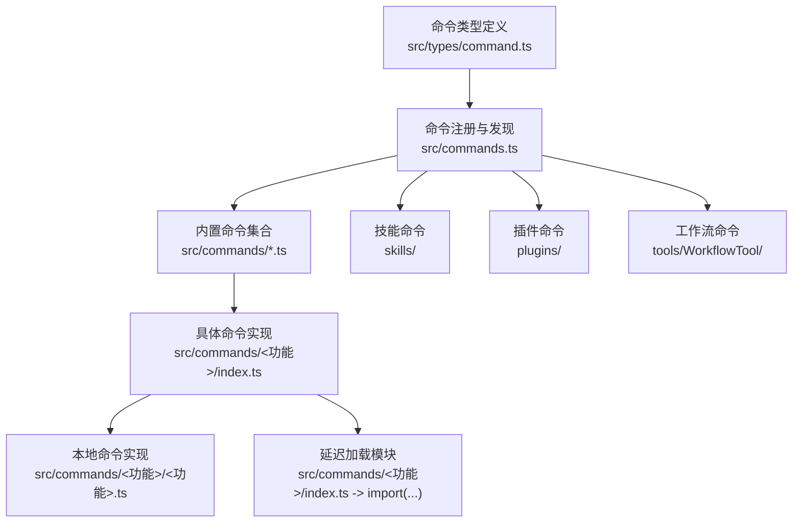
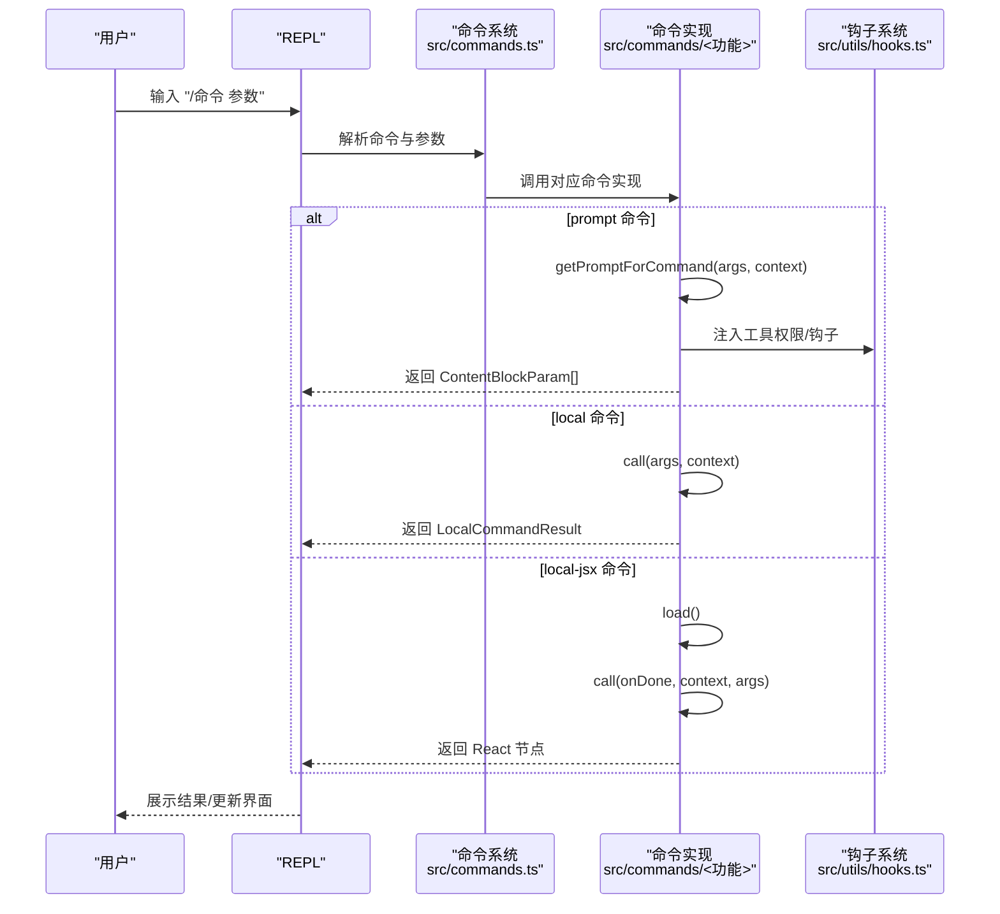
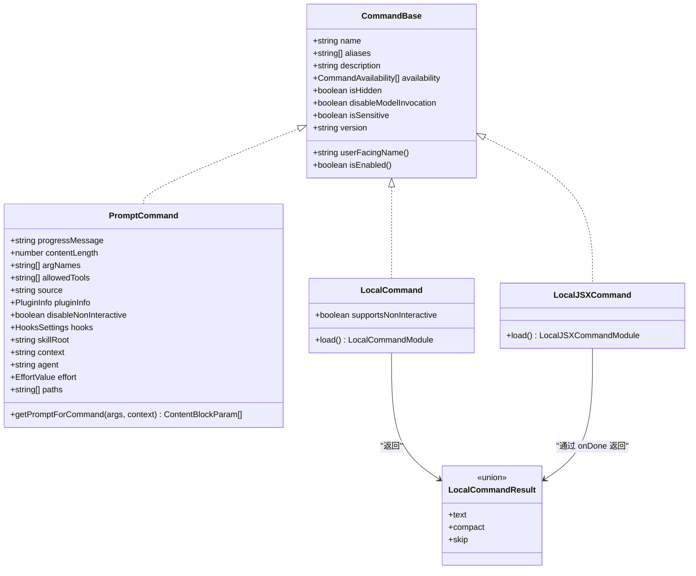
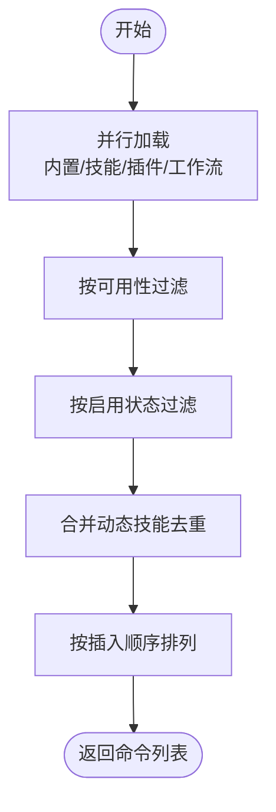
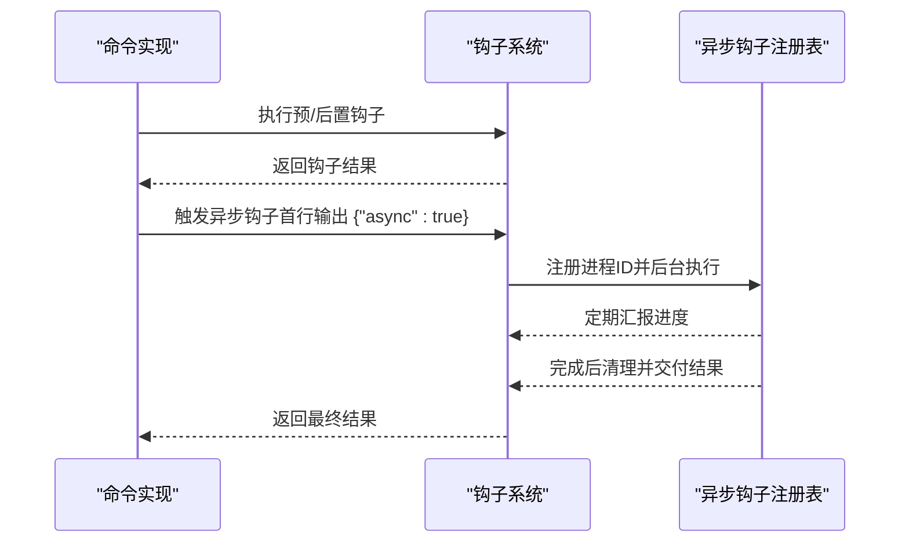
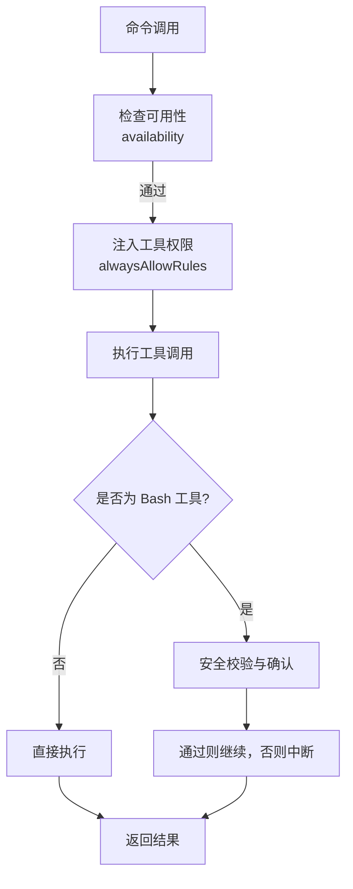
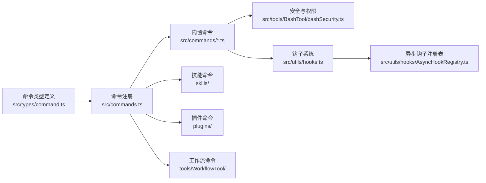

# 命令开发指南

<cite>
**本文引用的文件**
- [src/commands.ts](file://src/commands.ts)
- [src/types/command.ts](file://src/types/command.ts)
- [docs/commands.md](file://docs/commands.md)
- [src/commands/clear/index.ts](file://src/commands/clear/index.ts)
- [src/commands/clear/clear.ts](file://src/commands/clear/clear.ts)
- [src/commands/compact/compact.ts](file://src/commands/compact/compact.ts)
- [src/commands/commit.ts](file://src/commands/commit.ts)
- [src/commands/review.ts](file://src/commands/review.ts)
- [src/commands/init.ts](file://src/commands/init.ts)
- [src/commands/hooks/index.ts](file://src/commands/hooks/index.ts)
- [src/commands/permissions/index.ts](file://src/commands/permissions/index.ts)
- [src/utils/hooks.ts](file://src/utils/hooks.ts)
- [src/utils/hooks/AsyncHookRegistry.ts](file://src/utils/hooks/AsyncHookRegistry.ts)
- [src/tools/BashTool/bashSecurity.ts](file://src/tools/BashTool/bashSecurity.ts)
- [src/utils/debug.ts](file://src/utils/debug.ts)
- [scripts/package-npm.ts](file://scripts/package-npm.ts)
</cite>

## 目录
1. [简介](#简介)
2. [项目结构](#项目结构)
3. [核心组件](#核心组件)
4. [架构总览](#架构总览)
5. [详细组件分析](#详细组件分析)
6. [依赖关系分析](#依赖关系分析)
7. [性能考量](#性能考量)
8. [故障排查指南](#故障排查指南)
9. [结论](#结论)
10. [附录](#附录)

## 简介
本指南面向希望在 Claude Code 中创建自定义命令（slash commands）的开发者。内容涵盖命令接口定义、参数处理与返回值格式、生命周期钩子与异步处理机制、权限检查与安全考虑、最佳实践与常见陷阱、测试与调试方法，以及从简单命令到复杂交互命令的完整示例路径，并说明命令的打包、分发与版本管理。

## 项目结构
命令系统的核心由三部分组成：
- 命令类型与契约：位于类型定义文件中，统一约束命令的字段、调用签名与返回格式。
- 命令注册与发现：集中于命令入口文件，负责加载内置命令、技能、插件与工作流命令，并按可用性与启用状态过滤。
- 具体命令实现：位于 src/commands 下的各目录或文件，按功能域组织，支持 prompt、local、local-jsx 三种类型。

**图表来源**
- [src/types/command.ts:1-218](file://src/types/command.ts#L1-L218)
- [src/commands.ts:257-520](file://src/commands.ts#L257-L520)

**章节来源**
- [docs/commands.md:1-212](file://docs/commands.md#L1-L212)
- [src/commands.ts:257-520](file://src/commands.ts#L257-L520)

## 核心组件
- 命令类型与契约
  - 统一的 Command 接口，支持三种类型：prompt（发送提示词给模型）、local（本地纯文本输出）、local-jsx（渲染 React JSX）。
  - 返回值 LocalCommandResult 支持 text、compact、skip 三种形态；compact 类型可携带上下文压缩结果与显示文案。
  - 命令元信息包括名称、别名、描述、可用性限制、是否对模型可见、是否敏感参数等。
- 命令注册与发现
  - 内置命令通过集中导出与 memo 缓存加载，避免重复 I/O。
  - 动态技能、插件与工作流命令通过并行加载与去重策略整合。
  - 按可用性与启用状态进行过滤，支持远程模式与桥接模式的安全命令白名单。
- 命令生命周期与钩子
  - prompt 命令通过 getPromptForCommand(args, context) 生成 ContentBlockParam 列表。
  - local 命令通过 call(args, context) 执行并返回 LocalCommandResult。
  - local-jsx 命令通过 load() 延迟加载，返回 React 节点并在完成时回调 onDone。
  - 钩子系统支持预/后置事件与异步钩子，确保长任务不阻塞主线程。

**章节来源**
- [src/types/command.ts:16-218](file://src/types/command.ts#L16-L218)
- [src/commands.ts:257-520](file://src/commands.ts#L257-L520)
- [src/utils/hooks.ts:1112-1131](file://src/utils/hooks.ts#L1112-L1131)
- [src/utils/hooks/AsyncHookRegistry.ts:264-309](file://src/utils/hooks/AsyncHookRegistry.ts#L264-L309)

## 架构总览
命令系统在运行期的典型流程如下：
- REPL 解析用户输入，识别命令与参数。
- 查找命令定义（含别名），若存在则进入执行阶段。
- prompt 命令：构建提示词，注入工具权限，发送至模型；模型返回后按需插入消息或触发后续动作。
- local 命令：直接在本地执行，返回文本或压缩后的上下文。
- local-jsx 命令：延迟加载实现，渲染 UI 并在完成后回调 onDone。
- 钩子：在工具使用前后执行脚本，支持同步与异步两种模式。

**图表来源**
- [src/commands.ts:690-721](file://src/commands.ts#L690-L721)
- [src/types/command.ts:53-56](file://src/types/command.ts#L53-L56)
- [src/types/command.ts:62-65](file://src/types/command.ts#L62-L65)
- [src/types/command.ts:131-135](file://src/types/command.ts#L131-L135)

## 详细组件分析

### 命令接口与类型定义
- CommandBase：命令通用元信息，如名称、别名、描述、可用性、启用状态、是否隐藏、是否对模型可见、是否敏感参数等。
- PromptCommand：面向模型的命令，包含进度提示、内容长度估算、允许工具列表、源信息、上下文控制（inline/fork）、代理类型、努力级别、路径匹配等。
- LocalCommand：本地命令，支持非交互执行，通过 load() 延迟加载实现。
- LocalJSXCommand：本地 JSX 命令，通过 load() 延迟加载，返回 React 节点并在完成时回调 onDone。
- 返回值 LocalCommandResult：支持 text、compact、skip 三种类型；compact 类型可携带压缩结果与显示文案。

**图表来源**
- [src/types/command.ts:175-218](file://src/types/command.ts#L175-L218)
- [src/types/command.ts:25-57](file://src/types/command.ts#L25-L57)
- [src/types/command.ts:74-78](file://src/types/command.ts#L74-L78)
- [src/types/command.ts:144-152](file://src/types/command.ts#L144-L152)
- [src/types/command.ts:16-24](file://src/types/command.ts#L16-L24)

**章节来源**
- [src/types/command.ts:16-218](file://src/types/command.ts#L16-L218)

### 命令注册与发现
- 内置命令集合通过 memo 缓存加载，避免重复 I/O；动态技能、插件与工作流命令通过并行加载与去重策略整合。
- 可用性过滤：根据用户认证与提供商环境（claude.ai 订阅者、Console 直连用户等）决定命令是否展示。
- 启用状态过滤：结合 isEnabled() 与特性开关，动态控制命令是否可用。
- 远程模式安全：REMOTE_SAFE_COMMANDS 与 BRIDGE_SAFE_COMMANDS 白名单确保远程/移动端安全执行。

**图表来源**
- [src/commands.ts:451-520](file://src/commands.ts#L451-L520)
- [src/commands.ts:419-445](file://src/commands.ts#L419-L445)
- [src/commands.ts:621-688](file://src/commands.ts#L621-L688)

**章节来源**
- [src/commands.ts:451-520](file://src/commands.ts#L451-L520)
- [src/commands.ts:419-445](file://src/commands.ts#L419-L445)
- [src/commands.ts:621-688](file://src/commands.ts#L621-L688)

### 参数处理与返回值格式
- 参数处理
  - args 字符串传入命令实现，可在实现中解析为结构化参数。
  - 对于 prompt 命令，getPromptForCommand(args, context) 返回 ContentBlockParam[]，用于构建模型提示词。
  - 对于 local 命令，call(args, context) 返回 LocalCommandResult，支持 text、compact、skip。
  - 对于 local-jsx 命令，load() 返回包含 call 的模块，call(onDone, context, args) 渲染 UI。
- 返回值格式
  - text：纯文本结果，适合快速反馈。
  - compact：上下文压缩结果，适合大段对话后的空间回收。
  - skip：跳过消息插入，适合内部处理但不对外展示。
  - JSX：通过 onDone 回调传递结果与显示选项（显示位置、是否继续提问、元消息等）。

**章节来源**
- [src/types/command.ts:53-56](file://src/types/command.ts#L53-L56)
- [src/types/command.ts:62-65](file://src/types/command.ts#L62-L65)
- [src/types/command.ts:131-135](file://src/types/command.ts#L131-L135)
- [src/types/command.ts:16-24](file://src/types/command.ts#L16-L24)

### 生命周期钩子与异步处理
- 钩子类型
  - 预/后置事件：在工具使用前/后执行脚本，支持自定义行为（如格式化、校验、清理）。
  - 异步钩子：通过首行 JSON 协议检测“异步”标志，后台执行长任务并定期汇报进度，最终交付结果。
- 异步钩子协议
  - 首行输出包含 {"async": true, ...} 时，系统将其视为异步钩子，后台运行并记录进程 ID。
  - 完成后通过注册表清理并触发回调，确保 UI 不被阻塞。
- 本地命令中的钩子
  - 本地命令可调用钩子工具，例如在压缩前执行预处理指令，或在完成后执行收尾逻辑。

**图表来源**
- [src/utils/hooks.ts:1112-1131](file://src/utils/hooks.ts#L1112-L1131)
- [src/utils/hooks/AsyncHookRegistry.ts:264-309](file://src/utils/hooks/AsyncHookRegistry.ts#L264-L309)

**章节来源**
- [src/utils/hooks.ts:1112-1131](file://src/utils/hooks.ts#L1112-L1131)
- [src/utils/hooks/AsyncHookRegistry.ts:264-309](file://src/utils/hooks/AsyncHookRegistry.ts#L264-L309)

### 权限检查与安全考虑
- 工具权限
  - prompt 命令可通过上下文注入 alwaysAllowRules，限定允许使用的工具集合，避免越权操作。
  - Bash 工具具备严格的安全校验，防止注入与误用，必要时要求用户确认。
- 命令可用性
  - availability 字段限制命令对特定认证/提供商环境可见，避免在不适用场景暴露。
- 敏感参数
  - isSensitive 标记参数在会话历史中脱敏显示，保护隐私信息。

**图表来源**
- [src/commands/commit.ts:65-89](file://src/commands/commit.ts#L65-L89)
- [src/tools/BashTool/bashSecurity.ts:2571-2592](file://src/tools/BashTool/bashSecurity.ts#L2571-L2592)
- [src/commands.ts:419-445](file://src/commands.ts#L419-L445)

**章节来源**
- [src/commands/commit.ts:65-89](file://src/commands/commit.ts#L65-L89)
- [src/tools/BashTool/bashSecurity.ts:2571-2592](file://src/tools/BashTool/bashSecurity.ts#L2571-L2592)
- [src/commands.ts:419-445](file://src/commands.ts#L419-L445)

### 命令开发最佳实践与常见陷阱
- 最佳实践
  - 明确命令类型：需要模型参与的用 prompt，本地纯文本用 local，需要 UI 交互用 local-jsx。
  - 使用延迟加载：将重型实现放在 load() 中，减少启动时间。
  - 提供清晰的描述与别名：提升可发现性与易用性。
  - 控制工具权限：仅授予必要的工具，降低风险。
  - 处理异常与取消：尊重 abortController，及时响应用户取消。
  - 使用钩子：在关键节点插入预/后置逻辑，保持一致性。
- 常见陷阱
  - 忽略可用性与启用状态：导致命令在错误环境下出现或不可用。
  - 过度使用全局状态：影响缓存与并发安全性。
  - 忘记异步钩子协议：导致 UI 阻塞或结果丢失。
  - 暴露敏感参数：未标记 isSensitive 导致隐私泄露。

**章节来源**
- [src/commands.ts:451-520](file://src/commands.ts#L451-L520)
- [src/utils/hooks.ts:1112-1131](file://src/utils/hooks.ts#L1112-L1131)

### 测试与调试技巧
- 调试模式
  - 通过命令行参数或环境变量开启调试日志，支持过滤器与文件输出。
  - 运行时可启用调试以捕获中间态日志。
- 常用调试命令
  - /debug：临时开启调试模式。
  - /hooks：查看钩子配置，定位异步钩子问题。
  - /permissions：检查工具权限规则，验证命令权限注入是否正确。
- 单元测试建议
  - 对命令的参数解析与返回值进行断言。
  - 对 prompt 命令的 getPromptForCommand 输出进行快照测试。
  - 对 local 命令的 call 进行隔离测试，模拟 context 与 abortController。

**章节来源**
- [src/utils/debug.ts:42-83](file://src/utils/debug.ts#L42-L83)
- [src/commands/hooks/index.ts:1-14](file://src/commands/hooks/index.ts#L1-L14)
- [src/commands/permissions/index.ts:1-14](file://src/commands/permissions/index.ts#L1-L14)

### 完整命令开发示例（从简单到复杂）

#### 示例一：最小化本地命令（/clear）
- 定义：在命令索引文件中声明 type: 'local'，supportsNonInteractive，load() 延迟加载实现。
- 实现：在实现文件中编写 call(args, context)，执行清理逻辑并返回 LocalCommandResult。
- 关键点：懒加载减少启动开销；返回空文本表示无额外输出。

**章节来源**
- [src/commands/clear/index.ts:10-19](file://src/commands/clear/index.ts#L10-L19)
- [src/commands/clear/clear.ts:4-7](file://src/commands/clear/clear.ts#L4-L7)

#### 示例二：上下文压缩命令（/compact）
- 定义：prompt 命令，但实现为本地命令，返回 compact 结果。
- 实现：在 call 中先尝试会话记忆压缩，失败则走传统压缩路径；支持微压缩与反应式压缩。
- 关键点：合理处理异常与取消；在成功后清理缓存并抑制警告；构建友好的显示文案。

**章节来源**
- [src/commands/compact/compact.ts:40-137](file://src/commands/compact/compact.ts#L40-L137)
- [src/commands/compact/compact.ts:139-228](file://src/commands/compact/compact.ts#L139-L228)

#### 示例三：Git 提交命令（/commit）
- 定义：prompt 命令，注入 Bash 工具权限，生成包含 git 操作的提示词。
- 实现：在 getPromptForCommand 中构建提示词，注入 alwaysAllowRules，调用工具执行提交。
- 关键点：严格的安全协议与工具白名单；在无变更时不创建空提交；支持覆盖与脱敏。

**章节来源**
- [src/commands/commit.ts:57-90](file://src/commands/commit.ts#L57-L90)

#### 示例四：代码审查命令（/review 与 /ultrareview）
- 定义：/review 为 prompt 命令，/ultrareview 为 local-jsx 命令（远程专用）。
- 实现：/review 直接返回提示词；/ultrareview 通过延迟加载渲染权限对话框与远程执行流程。
- 关键点：区分本地与远程能力；在远程模式下仅允许安全命令。

**章节来源**
- [src/commands/review.ts:33-43](file://src/commands/review.ts#L33-L43)
- [src/commands/review.ts:48-54](file://src/commands/review.ts#L48-L54)

#### 示例五：初始化命令（/init）
- 定义：prompt 命令，根据特性开关选择新旧两套引导流程。
- 实现：在 getPromptForCommand 中返回不同提示词，引导用户完成 CLAUDE.md、技能与钩子的设置。
- 关键点：动态描述与进度提示；与项目引导状态联动。

**章节来源**
- [src/commands/init.ts:226-254](file://src/commands/init.ts#L226-L254)

### 权限检查与安全集成
- 工具权限注入
  - 在 prompt 命令中通过上下文 getAppState() 修改 toolPermissionContext，添加 alwaysAllowRules。
- Bash 安全校验
  - 对命令片段进行完整性与注入风险检查，必要时弹窗确认。
- 命令可用性
  - 通过 availability 限制命令在 claude.ai 订阅者或 Console 直连用户中可见。

**章节来源**
- [src/commands/commit.ts:75-83](file://src/commands/commit.ts#L75-L83)
- [src/tools/BashTool/bashSecurity.ts:244-259](file://src/tools/BashTool/bashSecurity.ts#L244-L259)
- [src/commands.ts:419-445](file://src/commands.ts#L419-L445)

## 依赖关系分析
- 命令类型定义被所有命令实现引用，确保一致的契约。
- 命令注册文件聚合所有来源（内置、技能、插件、工作流），并通过过滤与排序保证用户体验。
- 钩子系统贯穿工具使用前后，异步钩子注册表保障后台任务的生命周期管理。
- 安全与权限相关模块在命令执行链路中提供防护与审计。

**图表来源**
- [src/types/command.ts:1-218](file://src/types/command.ts#L1-L218)
- [src/commands.ts:257-520](file://src/commands.ts#L257-L520)
- [src/utils/hooks.ts:1112-1131](file://src/utils/hooks.ts#L1112-L1131)
- [src/utils/hooks/AsyncHookRegistry.ts:264-309](file://src/utils/hooks/AsyncHookRegistry.ts#L264-L309)
- [src/tools/BashTool/bashSecurity.ts:2571-2592](file://src/tools/BashTool/bashSecurity.ts#L2571-L2592)

**章节来源**
- [src/commands.ts:257-520](file://src/commands.ts#L257-L520)

## 性能考量
- 延迟加载：通过 load() 将重型实现推迟到首次调用，显著降低启动时间。
- 并行加载：命令来源（技能、插件、工作流）采用 Promise.all 并行加载，缩短准备时间。
- 缓存策略：命令列表与技能索引使用 memo 缓存，避免重复计算与磁盘 I/O。
- 上下文压缩：在大段对话后使用压缩命令回收空间，减少 token 消耗与延迟。

**章节来源**
- [src/commands.ts:451-471](file://src/commands.ts#L451-L471)
- [src/commands.ts:565-583](file://src/commands.ts#L565-L583)
- [src/commands/compact/compact.ts:159-165](file://src/commands/compact/compact.ts#L159-L165)

## 故障排查指南
- 命令未显示或不可用
  - 检查 availability 与 isEnabled 是否满足当前环境。
  - 确认命令是否被远程/桥接安全策略屏蔽。
- 命令执行卡住或阻塞
  - 检查是否存在异步钩子未正确声明或未完成。
  - 使用 /hooks 查看钩子状态，必要时终止或清理。
- 权限不足或工具被拒绝
  - 确认 prompt 命令是否正确注入 allowedTools 或 alwaysAllowRules。
  - 检查 Bash 安全校验是否触发确认对话。
- 调试日志
  - 使用 /debug 开启调试模式，结合命令行参数或环境变量设置过滤器。

**章节来源**
- [src/commands.ts:621-688](file://src/commands.ts#L621-L688)
- [src/utils/hooks.ts:1112-1131](file://src/utils/hooks.ts#L1112-L1131)
- [src/utils/debug.ts:42-83](file://src/utils/debug.ts#L42-L83)

## 结论
通过统一的命令类型定义、灵活的注册与发现机制、完善的生命周期钩子与异步处理、严格的权限与安全检查，Claude Code 的命令系统为开发者提供了强大的扩展能力。遵循本文的最佳实践与示例路径，可以高效地创建从简单到复杂的自定义命令，并确保其在生产环境中的稳定性与安全性。

## 附录

### 命令打包、分发与版本管理
- 打包
  - 使用脚本生成可发布的 npm 包，包含 CLI 入口与二进制映射。
- 分发
  - 通过 npm 发布，支持多平台与引擎版本要求。
- 版本管理
  - 命令可设置 version 字段，便于追踪与兼容性管理。

**章节来源**
- [scripts/package-npm.ts:22-92](file://scripts/package-npm.ts#L22-L92)