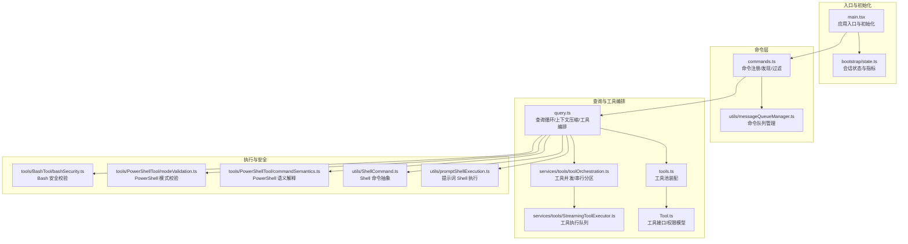
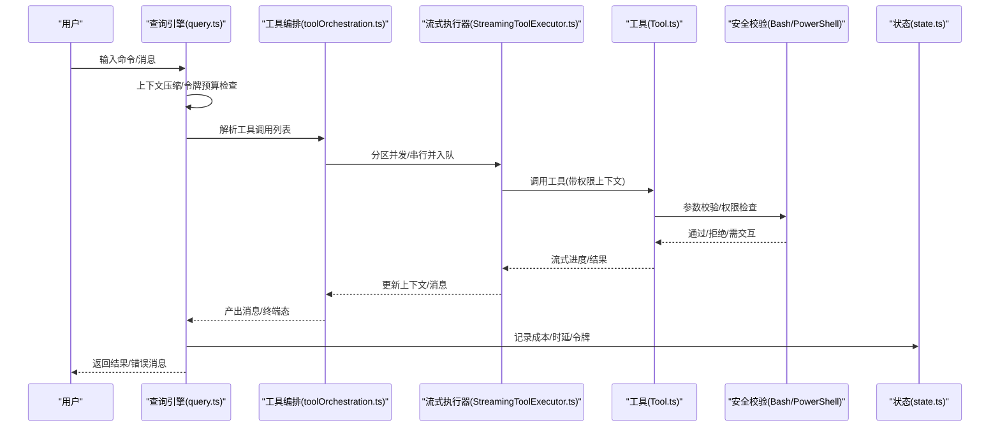
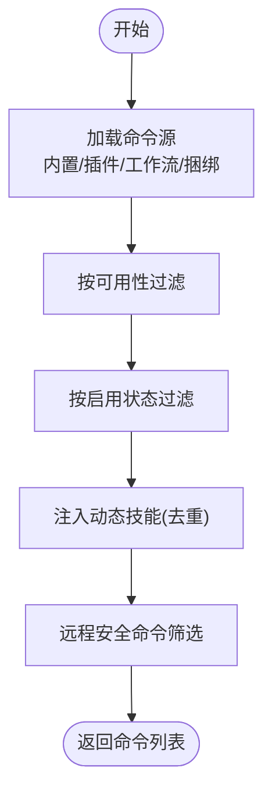
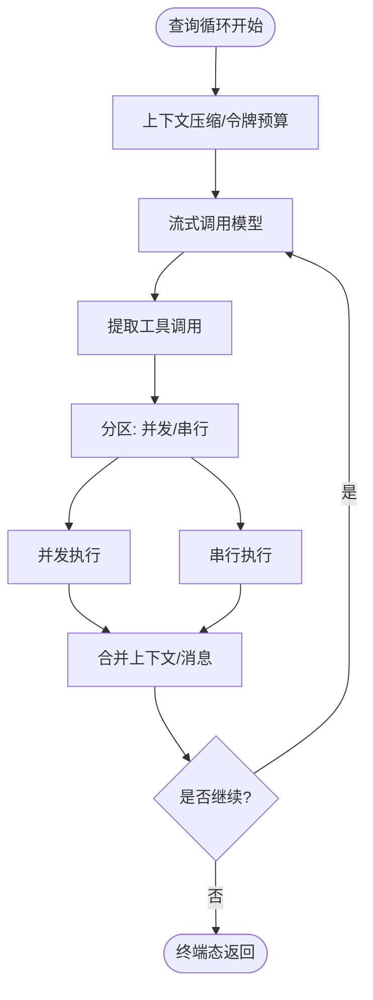
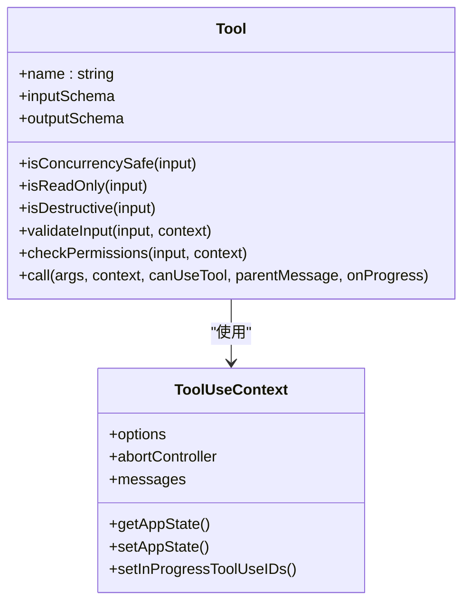
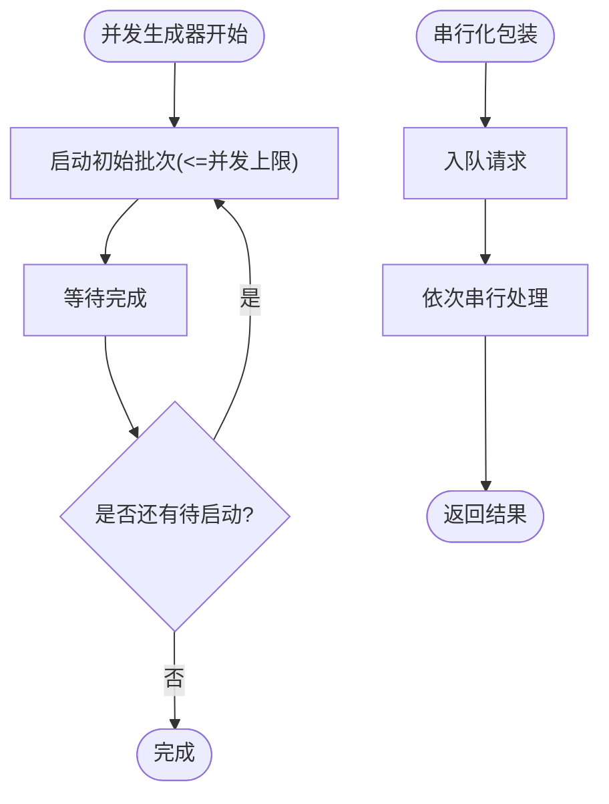
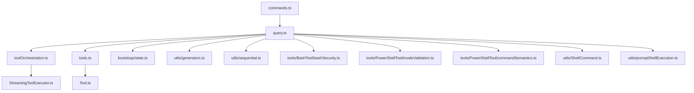

# 命令执行机制

<cite>
**本文档引用的文件**
- [src/commands.ts](file://src/commands.ts)
- [src/main.tsx](file://src/main.tsx)
- [src/query.ts](file://src/query.ts)
- [src/tools.ts](file://src/tools.ts)
- [src/Tool.ts](file://src/Tool.ts)
- [src/services/tools/toolOrchestration.ts](file://src/services/tools/toolOrchestration.ts)
- [src/services/tools/StreamingToolExecutor.ts](file://src/services/tools/StreamingToolExecutor.ts)
- [src/Task.ts](file://src/Task.ts)
- [src/bootstrap/state.ts](file://src/bootstrap/state.ts)
- [src/utils/sequential.ts](file://src/utils/sequential.ts)
- [src/utils/generators.ts](file://src/utils/generators.ts)
- [src/utils/messageQueueManager.ts](file://src/utils/messageQueueManager.ts)
- [src/tools/BashTool/bashSecurity.ts](file://src/tools/BashTool/bashSecurity.ts)
- [src/tools/PowerShellTool/modeValidation.ts](file://src/tools/PowerShellTool/modeValidation.ts)
- [src/tools/PowerShellTool/commandSemantics.ts](file://src/tools/PowerShellTool/commandSemantics.ts)
- [src/utils/ShellCommand.ts](file://src/utils/ShellCommand.ts)
- [src/utils/promptShellExecution.ts](file://src/utils/promptShellExecution.ts)
</cite>

## 目录
1. [简介](#简介)
2. [项目结构](#项目结构)
3. [核心组件](#核心组件)
4. [架构总览](#架构总览)
5. [详细组件分析](#详细组件分析)
6. [依赖关系分析](#依赖关系分析)
7. [性能考虑](#性能考虑)
8. [故障排除指南](#故障排除指南)
9. [结论](#结论)

## 简介
本文件系统性阐述 Claude Code 的命令执行机制，覆盖从用户输入到命令完成的全链路：命令解析、参数验证、权限检查、并发控制、异步执行模型、错误处理、与查询引擎的交互以及性能监控与调试方法。文档面向不同技术背景的读者，既提供高层概览也包含代码级细节与可视化图示。

## 项目结构
命令执行相关的核心模块分布如下：
- 命令注册与发现：commands.ts 负责命令清单加载、可用性过滤、动态技能注入与缓存管理
- 入口与生命周期：main.tsx 负责应用初始化、入口点选择、远程模式预过滤与启动阶段的延迟预取
- 查询与工具编排：query.ts 驱动对话循环、上下文压缩、工具调用与流式执行；tools.ts 提供工具池装配；Tool.ts 定义工具接口与权限模型
- 并发与队列：services/tools/toolOrchestration.ts 实现工具并发/串行分区执行；services/tools/StreamingToolExecutor.ts 控制工具执行队列；utils/generators.ts 提供并发生成器；utils/sequential.ts 提供串行化包装
- 安全与执行：tools/BashTool/bashSecurity.ts、tools/PowerShellTool/modeValidation.ts、tools/PowerShellTool/commandSemantics.ts 等负责命令安全校验与语义解释；utils/ShellCommand.ts、utils/promptShellExecution.ts 提供 Shell 执行抽象与错误格式化
- 状态与指标：bootstrap/state.ts 提供会话状态、统计计数器与性能指标；Task.ts 定义任务类型与生命周期

**图表来源**
- [src/main.tsx:585-800](file://src/main.tsx#L585-L800)
- [src/commands.ts:478-520](file://src/commands.ts#L478-L520)
- [src/query.ts:219-240](file://src/query.ts#L219-L240)
- [src/services/tools/toolOrchestration.ts:19-82](file://src/services/tools/toolOrchestration.ts#L19-L82)
- [src/services/tools/StreamingToolExecutor.ts:123-151](file://src/services/tools/StreamingToolExecutor.ts#L123-L151)
- [src/tools.ts:193-251](file://src/tools.ts#L193-L251)
- [src/Tool.ts:158-300](file://src/Tool.ts#L158-L300)

**章节来源**
- [src/main.tsx:585-800](file://src/main.tsx#L585-L800)
- [src/commands.ts:478-520](file://src/commands.ts#L478-L520)

## 核心组件
- 命令系统（commands.ts）
  - 统一命令注册与动态加载，支持插件技能、工作流脚本与内置命令
  - 可用性过滤（按订阅/提供商要求）、启用状态检查、动态技能去重插入
  - 远程/桥接安全命令白名单、描述来源标注
- 查询引擎（query.ts）
  - 对话循环驱动，包含自动/微/历史压缩、令牌预算、流式工具执行、停止钩子与恢复路径
  - 与工具编排协作，产出消息流与终端态
- 工具系统（tools.ts、Tool.ts）
  - 工具池装配与去重，内置工具与 MCP 工具合并
  - 权限上下文、并发安全判定、只读/破坏性标记、输入校验与权限检查
- 并发与队列（toolOrchestration.ts、StreamingToolExecutor.ts、generators.ts、sequential.ts）
  - 工具分区执行（并发/串行），并发度上限控制
  - 流式工具执行器队列，保证非并发工具顺序
  - 并发生成器与串行化包装，避免竞态
- 安全与执行（bashSecurity.ts、modeValidation.ts、commandSemantics.ts、ShellCommand.ts、promptShellExecution.ts）
  - Bash/PowerShell 命令安全校验、模式校验与语义解释
  - Shell 命令抽象与错误格式化，中断/失败场景处理
- 状态与指标（bootstrap/state.ts）
  - 会话状态、成本/时延统计、令牌使用、转轮计时与工具时延统计
- 任务系统（Task.ts）
  - 任务类型、状态机与输出文件管理

**章节来源**
- [src/commands.ts:478-520](file://src/commands.ts#L478-L520)
- [src/query.ts:219-240](file://src/query.ts#L219-L240)
- [src/tools.ts:193-251](file://src/tools.ts#L193-L251)
- [src/Tool.ts:158-300](file://src/Tool.ts#L158-L300)
- [src/services/tools/toolOrchestration.ts:19-82](file://src/services/tools/toolOrchestration.ts#L19-L82)
- [src/services/tools/StreamingToolExecutor.ts:123-151](file://src/services/tools/StreamingToolExecutor.ts#L123-L151)
- [src/utils/generators.ts:31-54](file://src/utils/generators.ts#L31-L54)
- [src/utils/sequential.ts:1-56](file://src/utils/sequential.ts#L1-L56)
- [src/tools/BashTool/bashSecurity.ts:2571-2592](file://src/tools/BashTool/bashSecurity.ts#L2571-L2592)
- [src/tools/PowerShellTool/modeValidation.ts:163-190](file://src/tools/PowerShellTool/modeValidation.ts#L163-L190)
- [src/tools/PowerShellTool/commandSemantics.ts:130-142](file://src/tools/PowerShellTool/commandSemantics.ts#L130-L142)
- [src/utils/ShellCommand.ts:413-465](file://src/utils/ShellCommand.ts#L413-L465)
- [src/utils/promptShellExecution.ts:164-183](file://src/utils/promptShellExecution.ts#L164-L183)
- [src/bootstrap/state.ts:431-450](file://src/bootstrap/state.ts#L431-L450)
- [src/Task.ts:69-106](file://src/Task.ts#L69-L106)

## 架构总览
命令执行从用户输入进入，经由命令解析与队列管理，进入查询循环。查询循环根据上下文压缩策略与令牌预算决定是否触发压缩或阻断；随后进入工具编排阶段，工具按并发/串行分区执行，并通过流式执行器进行调度。执行过程中进行权限检查与安全校验，错误被标准化并以消息形式回传。最终通过状态与指标记录执行结果与性能。

**图表来源**
- [src/query.ts:219-240](file://src/query.ts#L219-L240)
- [src/services/tools/toolOrchestration.ts:19-82](file://src/services/tools/toolOrchestration.ts#L19-L82)
- [src/services/tools/StreamingToolExecutor.ts:123-151](file://src/services/tools/StreamingToolExecutor.ts#L123-L151)
- [src/Tool.ts:158-300](file://src/Tool.ts#L158-L300)
- [src/tools/BashTool/bashSecurity.ts:2571-2592](file://src/tools/BashTool/bashSecurity.ts#L2571-L2592)
- [src/tools/PowerShellTool/modeValidation.ts:163-190](file://src/tools/PowerShellTool/modeValidation.ts#L163-L190)
- [src/bootstrap/state.ts:543-590](file://src/bootstrap/state.ts#L543-L590)

## 详细组件分析

### 命令解析与发现（commands.ts）
- 命令注册与动态加载
  - 内置命令、插件技能、工作流脚本与捆绑技能统一汇聚，支持条件特性开关
  - 动态技能在运行时发现并去重插入，确保不与内置命令冲突
- 可用性与启用过滤
  - 按订阅/提供商要求过滤命令（如 Claude AI 订阅者、控制台直连等）
  - 启用状态检查与缓存清理，支持远程模式预过滤
- 安全命令白名单
  - 远程/桥接安全命令集合，限定可远端执行的本地命令类型
- 描述来源标注
  - 为 UI 展示提供来源信息（插件/内置/捆绑）

**图表来源**
- [src/commands.ts:451-471](file://src/commands.ts#L451-L471)
- [src/commands.ts:478-520](file://src/commands.ts#L478-L520)
- [src/commands.ts:612-688](file://src/commands.ts#L612-L688)

**章节来源**
- [src/commands.ts:451-471](file://src/commands.ts#L451-L471)
- [src/commands.ts:478-520](file://src/commands.ts#L478-L520)
- [src/commands.ts:612-688](file://src/commands.ts#L612-L688)

### 查询循环与工具编排（query.ts、toolOrchestration.ts）
- 查询循环
  - 自动/微/历史压缩、令牌预算、最大输出令牌恢复、媒体恢复门控
  - 与工具编排协作，产出消息流与终端态
- 工具分区执行
  - 并发安全工具批内并发执行，非并发工具串行执行
  - 分区规则：单个非并发工具，或多连续只读工具
- 流式执行器
  - 基于队列的工具执行器，按并发条件择机启动
  - 非并发工具阻塞后续工具，保证顺序一致性

**图表来源**
- [src/query.ts:241-251](file://src/query.ts#L241-L251)
- [src/query.ts:560-580](file://src/query.ts#L560-L580)
- [src/services/tools/toolOrchestration.ts:84-116](file://src/services/tools/toolOrchestration.ts#L84-L116)
- [src/services/tools/StreamingToolExecutor.ts:123-151](file://src/services/tools/StreamingToolExecutor.ts#L123-L151)

**章节来源**
- [src/query.ts:241-251](file://src/query.ts#L241-L251)
- [src/query.ts:560-580](file://src/query.ts#L560-L580)
- [src/services/tools/toolOrchestration.ts:84-116](file://src/services/tools/toolOrchestration.ts#L84-L116)
- [src/services/tools/StreamingToolExecutor.ts:123-151](file://src/services/tools/StreamingToolExecutor.ts#L123-L151)

### 工具池与权限模型（tools.ts、Tool.ts）
- 工具池装配
  - 合并内置工具与 MCP 工具，去重并保持排序稳定性
  - 按权限上下文过滤，隐藏 REPL 专用工具
- 权限上下文
  - 模式、附加工作目录、允许/拒绝/询问规则、是否允许绕过权限等
- 并发安全与只读/破坏性
  - 工具声明并发安全、只读/破坏性属性，用于分区与安全策略
- 输入校验与权限检查
  - 工具定义输入模式，运行前进行参数校验与权限检查

**图表来源**
- [src/Tool.ts:362-499](file://src/Tool.ts#L362-L499)
- [src/Tool.ts:158-300](file://src/Tool.ts#L158-L300)
- [src/tools.ts:345-367](file://src/tools.ts#L345-L367)

**章节来源**
- [src/tools.ts:193-251](file://src/tools.ts#L193-L251)
- [src/tools.ts:345-367](file://src/tools.ts#L345-L367)
- [src/Tool.ts:158-300](file://src/Tool.ts#L158-L300)
- [src/Tool.ts:362-499](file://src/Tool.ts#L362-L499)

### 并发控制与资源管理（generators.ts、sequential.ts）
- 并发生成器
  - all(generator[], concurrencyCap) 并发消费多个生成器，按并发上限调度
- 串行化包装
  - sequential(fn) 将异步函数包装为串行执行，避免竞态（适用于文件写入等）
- 工具执行队列
  - StreamingToolExecutor 依据并发条件择机启动工具，非并发工具阻塞后续

**图表来源**
- [src/utils/generators.ts:31-54](file://src/utils/generators.ts#L31-L54)
- [src/utils/sequential.ts:1-56](file://src/utils/sequential.ts#L1-L56)
- [src/services/tools/StreamingToolExecutor.ts:123-151](file://src/services/tools/StreamingToolExecutor.ts#L123-L151)

**章节来源**
- [src/utils/generators.ts:31-54](file://src/utils/generators.ts#L31-L54)
- [src/utils/sequential.ts:1-56](file://src/utils/sequential.ts#L1-L56)
- [src/services/tools/StreamingToolExecutor.ts:123-151](file://src/services/tools/StreamingToolExecutor.ts#L123-L151)

### 命令与查询引擎的交互（messageQueueManager.ts）
- 命令队列管理
  - 支持按优先级获取命令、批量出队、移除指定命令
  - 通知订阅者队列变化，日志记录操作
- 与查询引擎的衔接
  - 命令在队列中等待，查询循环按优先级取出并执行

**章节来源**
- [src/utils/messageQueueManager.ts:240-292](file://src/utils/messageQueueManager.ts#L240-L292)

### 命令执行的安全与错误处理（bashSecurity.ts、modeValidation.ts、commandSemantics.ts、ShellCommand.ts、promptShellExecution.ts）
- Bash 安全校验
  - 多验证器链路，识别子表达式、脚本块、成员调用、赋值等高危模式
  - 对误解析场景进行延迟处理，最终给出放行或拦截结论
- PowerShell 模式校验
  - 识别子表达式、脚本块、成员调用、解包、赋值、停止解析、可展开字符串等
  - 无命令段时要求审批
- PowerShell 语义解释
  - 基于命令语义表解释退出码与输出，判断错误/异常
- Shell 命令抽象与错误格式化
  - 统一封装命令执行、中断与失败场景
  - 错误格式化为可读提示，便于用户理解

**章节来源**
- [src/tools/BashTool/bashSecurity.ts:2571-2592](file://src/tools/BashTool/bashSecurity.ts#L2571-L2592)
- [src/tools/PowerShellTool/modeValidation.ts:163-190](file://src/tools/PowerShellTool/modeValidation.ts#L163-L190)
- [src/tools/PowerShellTool/commandSemantics.ts:130-142](file://src/tools/PowerShellTool/commandSemantics.ts#L130-L142)
- [src/utils/ShellCommand.ts:413-465](file://src/utils/ShellCommand.ts#L413-L465)
- [src/utils/promptShellExecution.ts:164-183](file://src/utils/promptShellExecution.ts#L164-L183)

### 性能监控与调试（bootstrap/state.ts、query.ts）
- 性能指标
  - 会话成本、API 时延、工具时延、令牌用量、转轮时延与计数
  - 交互时间戳、慢操作记录、提示词缓存相关状态
- 调试与追踪
  - 查询关键节点打点（checkpoint），头像模式计时
  - 日志与诊断输出，错误格式化与堆栈追踪

**章节来源**
- [src/bootstrap/state.ts:543-590](file://src/bootstrap/state.ts#L543-L590)
- [src/query.ts:339-344](file://src/query.ts#L339-L344)
- [src/query.ts:652-658](file://src/query.ts#L652-L658)

## 依赖关系分析
- 命令系统依赖工具系统与查询引擎，通过 commands.ts 注册的命令在 query.ts 中被解析为工具调用
- 工具编排依赖工具定义与权限上下文，权限上下文来自 AppState，状态来自 bootstrap/state.ts
- 并发控制通过 generators.ts 与 sequential.ts 提供基础能力，StreamingToolExecutor 在其上构建队列调度
- 安全校验贯穿工具执行前后，Bash/PowerShell 的校验逻辑与 Shell 抽象紧密耦合

**图表来源**
- [src/commands.ts:478-520](file://src/commands.ts#L478-L520)
- [src/query.ts:219-240](file://src/query.ts#L219-L240)
- [src/services/tools/toolOrchestration.ts:19-82](file://src/services/tools/toolOrchestration.ts#L19-L82)
- [src/services/tools/StreamingToolExecutor.ts:123-151](file://src/services/tools/StreamingToolExecutor.ts#L123-L151)
- [src/tools.ts:193-251](file://src/tools.ts#L193-L251)
- [src/Tool.ts:158-300](file://src/Tool.ts#L158-L300)
- [src/bootstrap/state.ts:431-450](file://src/bootstrap/state.ts#L431-L450)
- [src/utils/generators.ts:31-54](file://src/utils/generators.ts#L31-L54)
- [src/utils/sequential.ts:1-56](file://src/utils/sequential.ts#L1-L56)
- [src/tools/BashTool/bashSecurity.ts:2571-2592](file://src/tools/BashTool/bashSecurity.ts#L2571-L2592)
- [src/tools/PowerShellTool/modeValidation.ts:163-190](file://src/tools/PowerShellTool/modeValidation.ts#L163-L190)
- [src/tools/PowerShellTool/commandSemantics.ts:130-142](file://src/tools/PowerShellTool/commandSemantics.ts#L130-L142)
- [src/utils/ShellCommand.ts:413-465](file://src/utils/ShellCommand.ts#L413-L465)
- [src/utils/promptShellExecution.ts:164-183](file://src/utils/promptShellExecution.ts#L164-L183)

**章节来源**
- [src/commands.ts:478-520](file://src/commands.ts#L478-L520)
- [src/query.ts:219-240](file://src/query.ts#L219-L240)
- [src/services/tools/toolOrchestration.ts:19-82](file://src/services/tools/toolOrchestration.ts#L19-L82)
- [src/services/tools/StreamingToolExecutor.ts:123-151](file://src/services/tools/StreamingToolExecutor.ts#L123-L151)
- [src/tools.ts:193-251](file://src/tools.ts#L193-L251)
- [src/Tool.ts:158-300](file://src/Tool.ts#L158-L300)
- [src/bootstrap/state.ts:431-450](file://src/bootstrap/state.ts#L431-L450)
- [src/utils/generators.ts:31-54](file://src/utils/generators.ts#L31-L54)
- [src/utils/sequential.ts:1-56](file://src/utils/sequential.ts#L1-L56)
- [src/tools/BashTool/bashSecurity.ts:2571-2592](file://src/tools/BashTool/bashSecurity.ts#L2571-L2592)
- [src/tools/PowerShellTool/modeValidation.ts:163-190](file://src/tools/PowerShellTool/modeValidation.ts#L163-L190)
- [src/tools/PowerShellTool/commandSemantics.ts:130-142](file://src/tools/PowerShellTool/commandSemantics.ts#L130-L142)
- [src/utils/ShellCommand.ts:413-465](file://src/utils/ShellCommand.ts#L413-L465)
- [src/utils/promptShellExecution.ts:164-183](file://src/utils/promptShellExecution.ts#L164-L183)

## 性能考虑
- 并发与吞吐
  - 工具并发分区与并发度上限控制，避免资源争用
  - 并发生成器限制同时活跃任务数量，提升整体吞吐
- 上下文压缩与令牌预算
  - 自动/微/历史压缩降低上下文长度，减少 API 成本与时延
  - 令牌预算与阻断阈值防止超长提示导致的失败
- 流式执行与中间态
  - 流式工具执行器与查询流式响应，缩短首包时延
- 缓存与预取
  - 启动阶段延迟预取与缓存，减少首次调用开销
- 指标与可观测性
  - 会话成本、API 时延、工具时延、令牌用量等指标用于性能评估

[本节为通用指导，无需特定文件引用]

## 故障排除指南
- 命令未找到
  - 使用命令查找与存在性检查，确认命令名/别名正确
- 权限被拒
  - 检查权限上下文与规则，必要时切换权限模式或手动批准
- 工具执行失败
  - 查看工具错误消息与进度消息，定位输入参数问题或资源访问问题
- Bash/PowerShell 安全拦截
  - 检查命令是否包含高危模式（子表达式、脚本块、成员调用等），调整命令或使用允许的变体
- Shell 执行中断/失败
  - 查看中断标志与错误输出，确认命令拼接与环境变量设置
- 并发冲突
  - 非并发工具串行执行，避免对共享资源的竞态；必要时降低并发度或调整工具分区
- 远程/桥接不可用
  - 确认命令在远程/桥接安全白名单中，否则仅可在本地执行

**章节来源**
- [src/commands.ts:690-721](file://src/commands.ts#L690-L721)
- [src/Tool.ts:500-503](file://src/Tool.ts#L500-L503)
- [src/tools/BashTool/bashSecurity.ts:2571-2592](file://src/tools/BashTool/bashSecurity.ts#L2571-L2592)
- [src/utils/ShellCommand.ts:413-465](file://src/utils/ShellCommand.ts#L413-L465)
- [src/services/tools/StreamingToolExecutor.ts:123-151](file://src/services/tools/StreamingToolExecutor.ts#L123-L151)
- [src/commands.ts:612-688](file://src/commands.ts#L612-L688)

## 结论
Claude Code 的命令执行机制通过“命令注册与发现—查询循环—工具编排—并发控制—安全校验—性能监控”的完整链路，实现了从用户输入到命令完成的可靠执行。系统在保证安全性与并发效率的同时，提供了丰富的权限控制、错误处理与可观测性能力，适合在复杂开发环境中稳定运行。