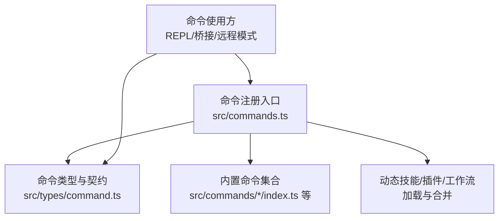
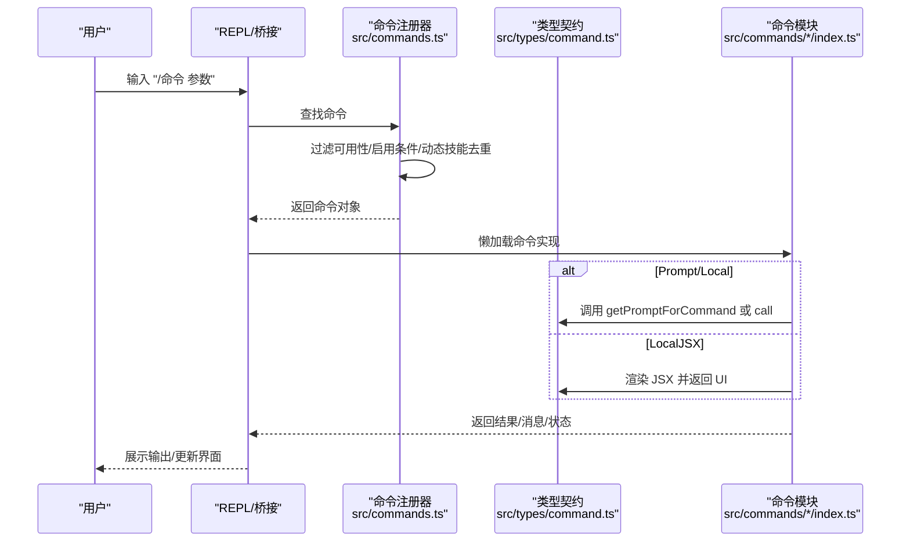
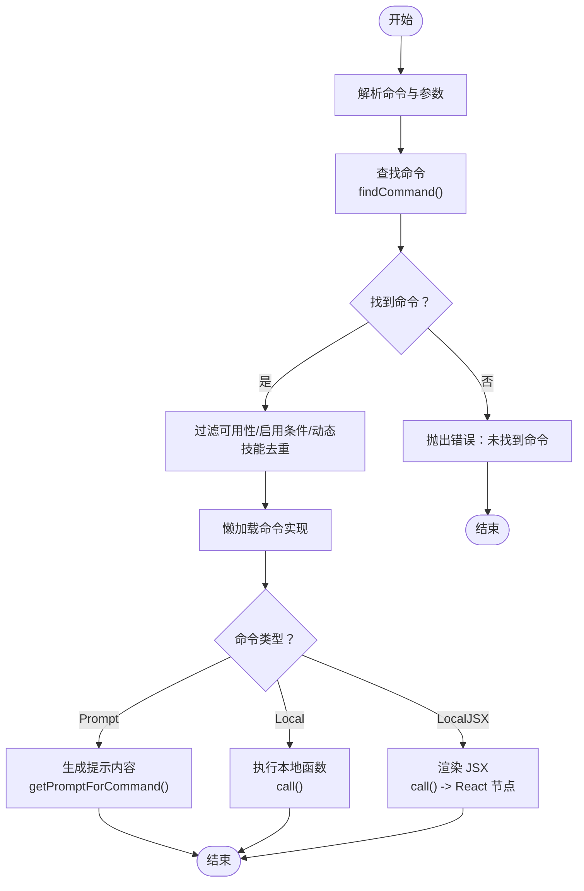
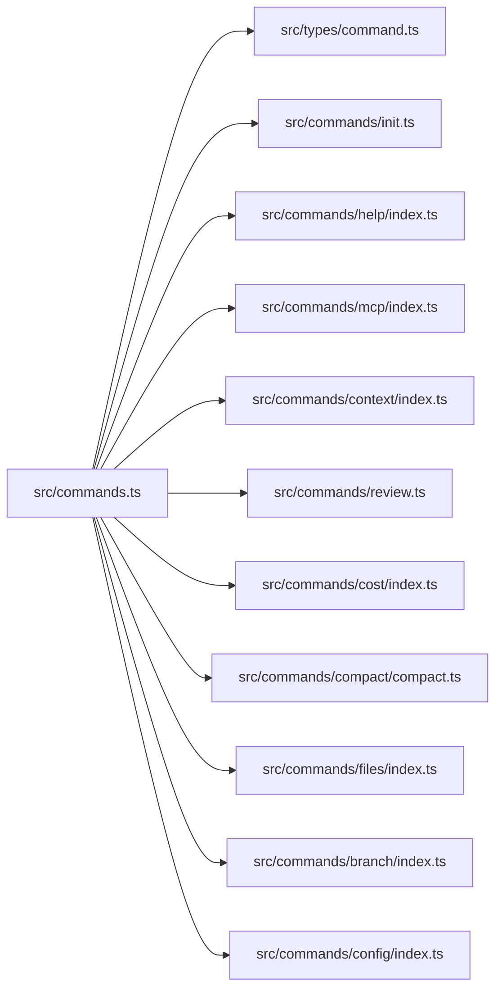

# 命令系统

<cite>
**本文引用的文件**
- [src/commands.ts](file://src/commands.ts)
- [src/types/command.ts](file://src/types/command.ts)
- [docs/commands.md](file://docs/commands.md)
- [src/commands/init.ts](file://src/commands/init.ts)
- [src/commands/help/index.ts](file://src/commands/help/index.ts)
- [src/commands/mcp/index.ts](file://src/commands/mcp/index.ts)
- [src/commands/context/index.ts](file://src/commands/context/index.ts)
- [src/commands/review.ts](file://src/commands/review.ts)
- [src/commands/cost/index.ts](file://src/commands/cost/index.ts)
- [src/commands/compact/compact.ts](file://src/commands/compact/compact.ts)
- [src/commands/files/index.ts](file://src/commands/files/index.ts)
- [src/commands/branch/index.ts](file://src/commands/branch/index.ts)
- [src/commands/config/index.ts](file://src/commands/config/index.ts)
</cite>

## 目录
1. [引言](#引言)
2. [项目结构](#项目结构)
3. [核心组件](#核心组件)
4. [架构总览](#架构总览)
5. [详细组件分析](#详细组件分析)
6. [依赖关系分析](#依赖关系分析)
7. [性能考量](#性能考量)
8. [故障排查指南](#故障排查指南)
9. [结论](#结论)
10. [附录](#附录)

## 引言
本文件系统性阐述 Claude Code 的 slash 命令体系：包括架构设计、注册机制、执行流程、内置命令分类与用法、生命周期、自定义命令开发指南、命令与工具的关系、权限与可用性控制等。目标是帮助开发者与使用者快速理解命令系统的工作原理，并安全高效地扩展与使用。

## 项目结构
命令系统的核心由“命令注册与聚合”“命令类型与契约”“具体命令实现”三部分组成：
- 命令注册与聚合：集中导出所有命令，按来源与可用性过滤，支持动态技能与插件注入。
- 命令类型与契约：统一的 Command 类型定义，区分 Prompt、Local、LocalJSX 三类命令及其上下文。
- 具体命令实现：位于 src/commands/ 下的各子目录，按功能域组织；部分命令通过懒加载减少启动开销。

图表来源
- [src/commands.ts:259-348](file://src/commands.ts#L259-L348)
- [src/types/command.ts:205-206](file://src/types/command.ts#L205-L206)

章节来源
- [src/commands.ts:259-348](file://src/commands.ts#L259-L348)
- [src/types/command.ts:16-218](file://src/types/command.ts#L16-L218)

## 核心组件
- 命令类型与契约
  - PromptCommand：面向模型的提示词命令，可注入工具、限制模型调用、携带描述与来源信息。
  - LocalCommand：本地执行命令，返回纯文本或压缩结果，支持非交互式。
  - LocalJSXCommand：本地渲染命令，返回 React JSX，用于 TUI 交互。
- 命令元数据
  - 名称、别名、描述、可用性（auth/provider）、启用条件、是否隐藏、是否敏感参数、来源（builtin/plugin/bundled/mcp）等。
- 命令注册与聚合
  - 统一导出内置命令，按来源与可用性过滤，支持动态技能与插件注入，提供查找与去重逻辑。
- 远程/桥接安全策略
  - 提供 REMOTE_SAFE_COMMANDS 与 BRIDGE_SAFE_COMMANDS，限定远程/移动端可执行的命令集。

章节来源
- [src/types/command.ts:16-218](file://src/types/command.ts#L16-L218)
- [src/commands.ts:621-678](file://src/commands.ts#L621-L678)

## 架构总览
命令系统采用“声明式注册 + 动态加载 + 可见性/可用性过滤”的架构。命令在构建期被集中导入并在运行时按需懒加载，以降低启动成本。命令来源包括内置命令、技能目录、插件技能、工作流脚本与 MCP 技能，最终统一进入命令列表并参与可用性与启用条件判断。

图表来源
- [src/commands.ts:478-519](file://src/commands.ts#L478-L519)
- [src/types/command.ts:25-152](file://src/types/command.ts#L25-L152)

章节来源
- [src/commands.ts:419-445](file://src/commands.ts#L419-L445)
- [src/commands.ts:478-519](file://src/commands.ts#L478-L519)
- [src/types/command.ts:25-152](file://src/types/command.ts#L25-L152)

## 详细组件分析

### 命令注册与聚合（commands.ts）
- 内置命令清单：集中导入各功能域命令，如 init、help、mcp、context、review、cost、compact、files、branch、config 等。
- 动态来源：技能目录、插件技能、工作流脚本、MCP 技能，均通过异步加载与合并，保证启动性能。
- 可用性与启用条件：
  - meetsAvailabilityRequirement：根据 auth/provider 要求过滤命令（如 claude-ai、console）。
  - isCommandEnabled：结合 feature flag、环境变量等动态启用。
- 去重与插入：动态技能仅在名称未冲突时插入，且插入位置在插件技能之后、内置命令之前。
- 远程/桥接安全：
  - REMOTE_SAFE_COMMANDS：远程模式下允许的命令集合。
  - BRIDGE_SAFE_COMMANDS：桥接（移动端/网页）安全命令集合，Prompt 命令默认安全，Local 需显式允许。
  - isBridgeSafeCommand：综合判断命令在桥接通道上的安全性。
- 工具技能索引：
  - getSkillToolCommands：筛选可用于模型调用的技能（Prompt 且非内置源）。
  - getSlashCommandToolSkills：筛选 slash 形式的技能（Prompt 且非内置源）。

章节来源
- [src/commands.ts:259-348](file://src/commands.ts#L259-L348)
- [src/commands.ts:419-445](file://src/commands.ts#L419-L445)
- [src/commands.ts:478-519](file://src/commands.ts#L478-L519)
- [src/commands.ts:621-678](file://src/commands.ts#L621-L678)
- [src/commands.ts:565-610](file://src/commands.ts#L565-L610)

### 命令类型与契约（types/command.ts）
- 命令类型
  - PromptCommand：包含 progressMessage、contentLength、allowedTools、source、hooks、context、agent、effort、paths 等字段，支持动态生成提示内容。
  - LocalCommand：supportsNonInteractive、load 懒加载、call 回调返回 LocalCommandResult（文本/压缩/跳过）。
  - LocalJSXCommand：load 懒加载、call 返回 React 节点，适合 TUI 交互。
- 上下文与回调
  - LocalJSXCommandOnDone：命令完成后的回调，支持显示方式、是否继续提问、附加 meta 消息、自动提交下一输入等。
  - LocalJSXCommandContext：扩展 ToolUseContext，提供 UI 更新、主题、IDE 安装状态、动态 MCP 配置等能力。
- 元数据与可用性
  - CommandBase：name、aliases、description、availability、isEnabled、isHidden、loadedFrom、kind、immediate、isSensitive、userFacingName 等。
  - getCommandName/isCommandEnabled：标准化解析命令可见名与启用状态。

章节来源
- [src/types/command.ts:16-218](file://src/types/command.ts#L16-L218)

### 内置命令功能分类与用法

#### Git 与版本控制
- /commit：创建带 AI 生成提交信息的 Git 提交。
- /commit-push-pr：一键提交、推送并创建 PR。
- /branch：基于当前会话创建分支（或切换），支持别名（如 fork）。
- /diff：查看暂存/未暂存/指定引用的变更。
- /pr_comments：查看并处理 PR 评审意见。
- /rewind：回退到历史状态。

章节来源
- [docs/commands.md:37-47](file://docs/commands.md#L37-L47)
- [src/commands/branch/index.ts:1-17](file://src/commands/branch/index.ts#L1-L17)

#### 代码质量
- /review：对暂存/未暂存变更进行 AI 代码审查。
- /security-review：安全导向的代码审查。
- /advisor：获取架构/设计建议。
- /bughunter：定位潜在问题。

章节来源
- [docs/commands.md:48-56](file://docs/commands.md#L48-L56)
- [src/commands/review.ts:1-60](file://src/commands/review.ts#L1-L60)

#### 会话与上下文
- /compact：压缩对话上下文，提升上下文窗口利用率。
- /context：可视化当前上下文占用（交互式/非交互式两套实现）。
- /resume：恢复之前的会话。
- /session：管理会话（列出/切换/删除）。
- /share：通过链接分享会话。
- /export：导出会话到文件。
- /summary：生成会话摘要。
- /clear：清空历史记录。

章节来源
- [docs/commands.md:57-69](file://docs/commands.md#L57-L69)
- [src/commands/context/index.ts:1-27](file://src/commands/context/index.ts#L1-L27)
- [src/commands/compact/compact.ts:1-290](file://src/commands/compact/compact.ts#L1-L290)

#### 配置与设置
- /config：打开配置面板（别名 settings）。
- /permissions：管理工具权限规则。
- /theme：切换终端主题。
- /output-style：切换输出样式。
- /color：切换颜色输出。
- /keybindings：查看/自定义快捷键。
- /vim：切换 Vim 输入模式。
- /effort：调整响应努力级别。
- /model：切换活跃模型。
- /privacy-settings：管理隐私/数据设置。
- /fast：切换快速模式。
- /brief：切换简要输出模式。

章节来源
- [docs/commands.md:70-86](file://docs/commands.md#L70-L86)
- [src/commands/config/index.ts:1-14](file://src/commands/config/index.ts#L1-L14)

#### 记忆与知识
- /memory：管理持久化记忆（CLAUDE.md 文件）。
- /add-dir：将目录加入项目上下文。
- /files：列出当前上下文中的文件（仅内部用户）。

章节来源
- [docs/commands.md:87-94](file://docs/commands.md#L87-L94)
- [src/commands/files/index.ts:1-15](file://src/commands/files/index.ts#L1-L15)

#### MCP 与插件
- /mcp：管理 MCP 服务器连接（即时执行，带参数提示）。
- /plugin：安装/移除/管理插件。
- /reload-plugins：重载所有已安装插件。
- /skills：查看与管理技能。

章节来源
- [docs/commands.md:95-103](file://docs/commands.md#L95-L103)
- [src/commands/mcp/index.ts:1-15](file://src/commands/mcp/index.ts#L1-L15)

#### 认证
- /login：使用 Anthropic 登录。
- /logout：登出。
- /oauth-refresh：刷新 OAuth 令牌。

章节来源
- [docs/commands.md:104-111](file://docs/commands.md#L104-L111)

#### 任务与代理
- /tasks：管理后台任务。
- /agents：管理子代理。
- /ultraplan：生成详细执行计划。
- /plan：进入规划模式。

章节来源
- [docs/commands.md:112-120](file://docs/commands.md#L112-L120)

#### 诊断与状态
- /doctor：运行环境诊断。
- /status：显示系统与会话状态。
- /stats：显示会话统计。
- /cost：显示当前会话的用量与费用。
- /version：显示 Claude Code 版本。
- /usage：显示详细 API 使用情况。
- /extra-usage：显示扩展用量详情。
- /rate-limit-options：查看限流配置。

章节来源
- [docs/commands.md:121-133](file://docs/commands.md#L121-L133)
- [src/commands/cost/index.ts:1-26](file://src/commands/cost/index.ts#L1-L26)

#### 安装与设置
- /install：安装或更新 Claude Code。
- /upgrade：升级到最新版本。
- /init：初始化项目（创建 CLAUDE.md）。
- /init-verifiers：设置验证钩子。
- /onboarding：运行首次设置向导。
- /terminalSetup：配置终端集成。

章节来源
- [docs/commands.md:134-144](file://docs/commands.md#L134-L144)
- [src/commands/init.ts:1-259](file://src/commands/init.ts#L1-L259)

#### IDE 与桌面集成
- /bridge：管理 IDE 桥接连接。
- /bridge-kick：强制重启 IDE 桥接。
- /ide：在 IDE 中打开。
- /desktop：移交到桌面应用。
- /mobile：移交到移动应用。
- /teleport：将会话转移到另一台设备。

章节来源
- [docs/commands.md:145-155](file://docs/commands.md#L145-L155)

#### 远程与环境
- /remote-env：配置远程环境。
- /remote-setup：设置远程会话。
- /env：查看环境变量。
- /sandbox-toggle：切换沙箱模式。

章节来源
- [docs/commands.md:156-164](file://docs/commands.md#L156-L164)

#### 杂项
- /help：显示帮助与可用命令。
- /exit：退出 Claude Code。
- /copy：复制内容到剪贴板。
- /feedback：向 Anthropic 发送反馈。
- /release-notes：查看发布说明。
- /rename：重命名当前会话。
- /tag：为当前会话打标签。
- /insights：生成会话分析报告。
- /stickers：彩蛋贴纸。
- /good-claude：赞美 Claude。
- /voice：切换语音输入模式。
- /chrome：Chrome 扩展集成。
- /issue：提交 GitHub Issue。
- /statusline：自定义状态栏。
- /thinkback：回放 Claude 的思考过程。
- /thinkback-play：动画化思考回放。
- /passes：多轮执行。
- /x402：x402 支付协议集成。

章节来源
- [docs/commands.md:165-187](file://docs/commands.md#L165-L187)

#### 内部/调试命令
- /ant-trace、/autofix-pr、/backfill-sessions、/break-cache、/btw、/ctx_viz、/debug-tool-call、/heapdump、/hooks、/mock-limits、/perf-issue、/reset-limits 等。

章节来源
- [docs/commands.md:188-204](file://docs/commands.md#L188-L204)

### 命令生命周期（从输入到执行）

图表来源
- [src/commands.ts:690-721](file://src/commands.ts#L690-L721)
- [src/commands.ts:478-519](file://src/commands.ts#L478-L519)
- [src/types/command.ts:25-152](file://src/types/command.ts#L25-L152)

章节来源
- [src/commands.ts:690-721](file://src/commands.ts#L690-L721)
- [src/commands.ts:478-519](file://src/commands.ts#L478-L519)
- [src/types/command.ts:25-152](file://src/types/command.ts#L25-L152)

### 自定义命令开发指南
- 选择命令类型
  - PromptCommand：需要向模型发送提示词，适合“一次性”或“可复用”的提示模板。
  - LocalCommand：需要在本地执行逻辑，返回文本或压缩结果，适合轻量级操作。
  - LocalJSXCommand：需要渲染 UI，适合复杂的交互式流程。
- 编写命令定义
  - 在 src/commands/your-category/ 下创建 index.ts，导出符合 Command 接口的对象。
  - 设置 name、description、type、argumentHint、aliases、isEnabled、isHidden、isSensitive、userFacingName 等元数据。
  - 对 PromptCommand：实现 getPromptForCommand(args, context) 返回 ContentBlockParam[]。
  - 对 LocalCommand：实现 supportsNonInteractive 与 load() 返回 { call }。
  - 对 LocalJSXCommand：实现 load() 返回 { call }，call(onDone, context, args) 返回 JSX。
- 注册命令
  - 在 src/commands.ts 中导入你的命令并加入 COMMANDS 列表。
  - 如需动态注入，可将其加入 getSkills()/getPluginCommands() 的返回路径。
- 安全与可用性
  - 若命令涉及外部工具或敏感参数，设置 isSensitive 并在 getPromptForCommand 中避免泄露。
  - 对于远程/桥接场景，若命令应允许在移动端执行，将其加入 BRIDGE_SAFE_COMMANDS。
- 最佳实践
  - 将重逻辑延迟到 load() 中，避免阻塞启动。
  - 为命令提供清晰的 description 与 argumentHint，便于用户理解。
  - 对 Prompt 命令，尽量明确 allowedTools 与 paths，减少无关工具调用。
  - 对 LocalJSX 命令，合理使用 LocalJSXCommandOnDone 控制后续行为。

章节来源
- [src/types/command.ts:25-152](file://src/types/command.ts#L25-L152)
- [src/commands.ts:259-348](file://src/commands.ts#L259-L348)
- [src/commands.ts:653-678](file://src/commands.ts#L653-L678)

### 命令与工具的关系
- 命令（slash）与工具（Agent Tools）的区别
  - 命令：用户通过 / 前缀触发，面向人机交互；可懒加载、可渲染 UI、可注入模型调用。
  - 工具：模型侧的原子能力（如 Bash、FileRead、FileWrite、WebSearch 等），由命令或技能在执行时按需调用。
- 命令如何使用工具
  - Prompt 命令通过 getPromptForCommand 返回的内容，间接驱动模型调用工具。
  - Local/LocalJSX 命令在 call 中直接或通过服务层调用工具，实现文件读写、系统命令、网络请求等。
- 权限与模型调用
  - Prompt 命令可设置 disableModelInvocation，限制模型直接调用该技能。
  - 工具权限由权限系统控制，命令在执行前通常会校验 canUseTool。

章节来源
- [src/types/command.ts:25-57](file://src/types/command.ts#L25-L57)
- [src/commands.ts:565-610](file://src/commands.ts#L565-L610)

### 权限检查与可用性控制
- 可用性（availability）
  - 通过 meetsAvailabilityRequirement 过滤命令，支持 claude-ai 与 console 两类用户。
- 启用条件（isEnabled）
  - 通过 isCommandEnabled 判断命令是否当前可用（feature flag、环境变量等）。
- 远程/桥接安全
  - REMOTE_SAFE_COMMANDS：远程模式下预过滤。
  - BRIDGE_SAFE_COMMANDS：移动端/网页端允许的命令白名单。
  - isBridgeSafeCommand：综合类型与白名单判定。

章节来源
- [src/commands.ts:419-445](file://src/commands.ts#L419-L445)
- [src/commands.ts:621-678](file://src/commands.ts#L621-L678)

## 依赖关系分析

图表来源
- [src/commands.ts:259-348](file://src/commands.ts#L259-L348)
- [src/commands/init.ts:1-259](file://src/commands/init.ts#L1-L259)
- [src/commands/help/index.ts:1-13](file://src/commands/help/index.ts#L1-L13)
- [src/commands/mcp/index.ts:1-15](file://src/commands/mcp/index.ts#L1-L15)
- [src/commands/context/index.ts:1-27](file://src/commands/context/index.ts#L1-L27)
- [src/commands/review.ts:1-60](file://src/commands/review.ts#L1-L60)
- [src/commands/cost/index.ts:1-26](file://src/commands/cost/index.ts#L1-L26)
- [src/commands/compact/compact.ts:1-290](file://src/commands/compact/compact.ts#L1-L290)
- [src/commands/files/index.ts:1-15](file://src/commands/files/index.ts#L1-L15)
- [src/commands/branch/index.ts:1-17](file://src/commands/branch/index.ts#L1-L17)
- [src/commands/config/index.ts:1-14](file://src/commands/config/index.ts#L1-L14)

章节来源
- [src/commands.ts:259-348](file://src/commands.ts#L259-L348)

## 性能考量
- 懒加载与缓存
  - 多数命令通过 load() 懒加载，减少启动时间。
  - getCommands/loadAllCommands 使用 memoize 缓存，避免重复磁盘 I/O 与动态导入。
- 动态技能与插件
  - 技能目录、插件技能、工作流脚本异步加载并合并，注意并发与失败兜底。
- 压缩与上下文优化
  - /compact 命令在本地执行，支持微压缩与传统压缩路径，减少 token 占用，提升吞吐。

章节来源
- [src/commands.ts:451-471](file://src/commands.ts#L451-L471)
- [src/commands.ts:525-541](file://src/commands.ts#L525-L541)
- [src/commands/compact/compact.ts:1-290](file://src/commands/compact/compact.ts#L1-L290)

## 故障排查指南
- 命令未找到
  - 检查命令名称与别名是否正确，确认 isHidden 是否导致未显示。
  - 使用 getCommandName 获取显示名称，核对帮助列表。
- 命令不可用
  - 检查 availability 与 isEnabled：是否满足 claude-ai/console 要求或 feature flag。
  - 在远程/桥接模式下，确认命令是否在 REMOTE_SAFE_COMMANDS/BRIDGE_SAFE_COMMANDS 中。
- 执行异常
  - Prompt 命令：检查 getPromptForCommand 的参数与工具注入是否正确。
  - Local 命令：关注 LocalCommandResult 的返回类型，必要时在 call 中捕获并记录错误。
  - LocalJSX 命令：检查渲染逻辑与 onDone 回调的调用时机。
- 动态技能未出现
  - 确认动态技能未与内置命令重名，检查 meetsAvailabilityRequirement 与 isCommandEnabled。
  - 清理缓存后重试：clearCommandMemoizationCaches/clearCommandsCache。

章节来源
- [src/commands.ts:690-721](file://src/commands.ts#L690-L721)
- [src/commands.ts:419-445](file://src/commands.ts#L419-L445)
- [src/commands.ts:621-678](file://src/commands.ts#L621-L678)
- [src/commands.ts:525-541](file://src/commands.ts#L525-L541)

## 结论
Claude Code 的命令系统以“声明式 + 懒加载 + 动态注入 + 安全过滤”为核心设计，既保证了启动性能，又提供了强大的扩展能力。通过统一的 Command 类型与严格的可用性/权限控制，系统在功能丰富与安全可控之间取得平衡。开发者可据此快速创建新命令，并将其无缝融入现有生态。

## 附录
- 快速参考
  - 命令类型：Prompt/Local/LocalJSX
  - 关键函数：getCommands/findCommand/isBridgeSafeCommand
  - 安全集合：REMOTE_SAFE_COMMANDS、BRIDGE_SAFE_COMMANDS
  - 动态技能：getSkillToolCommands/getSlashCommandToolSkills

章节来源
- [docs/commands.md:1-212](file://docs/commands.md#L1-L212)
- [src/commands.ts:478-519](file://src/commands.ts#L478-L519)
- [src/commands.ts:621-678](file://src/commands.ts#L621-L678)
- [src/commands.ts:565-610](file://src/commands.ts#L565-L610)