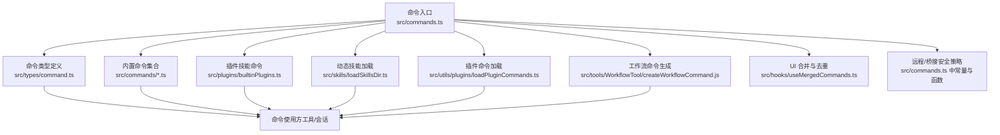
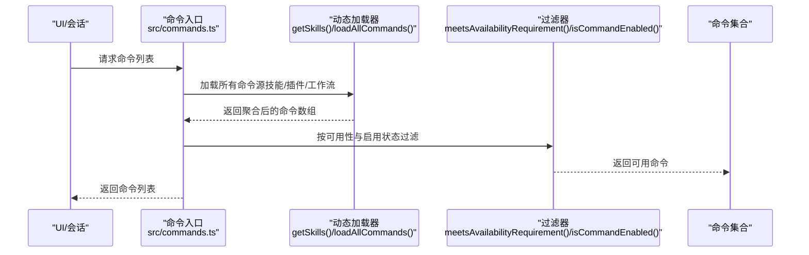
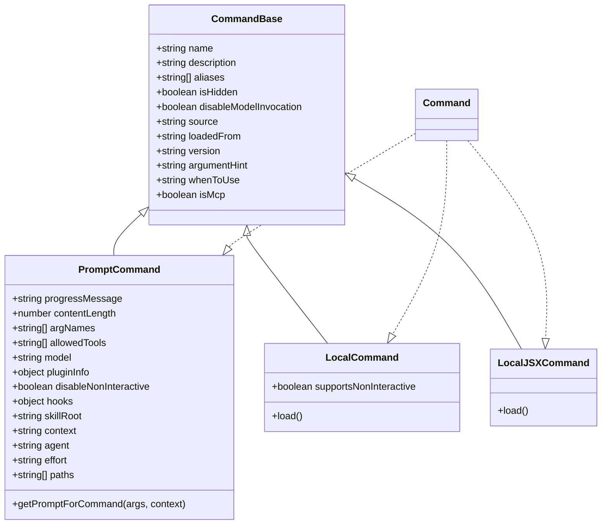
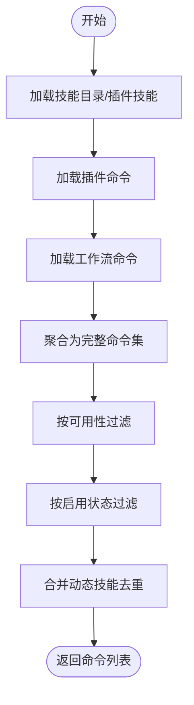
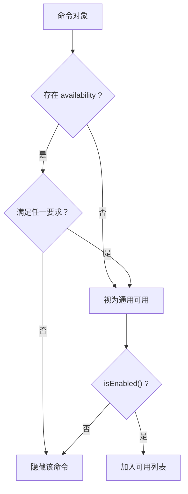
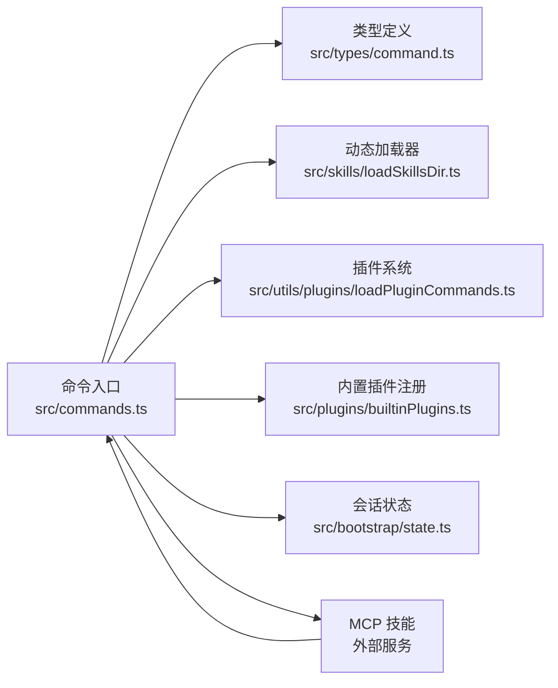

# 命令系统概览

<cite>
**本文引用的文件**
- [src/commands.ts](file://src/commands.ts)
- [src/types/command.ts](file://src/types/command.ts)
- [src/hooks/useMergedCommands.ts](file://src/hooks/useMergedCommands.ts)
- [src/bootstrap/state.ts](file://src/bootstrap/state.ts)
- [src/commands/init.ts](file://src/commands/init.ts)
- [src/commands/help/index.ts](file://src/commands/help/index.ts)
- [src/commands/context/index.ts](file://src/commands/context/index.ts)
- [src/commands/review.ts](file://src/commands/review.ts)
- [src/commands/insights.ts](file://src/commands/insights.ts)
- [src/plugins/builtinPlugins.ts](file://src/plugins/builtinPlugins.ts)
</cite>

## 目录
1. [简介](#简介)
2. [项目结构](#项目结构)
3. [核心组件](#核心组件)
4. [架构总览](#架构总览)
5. [详细组件分析](#详细组件分析)
6. [依赖分析](#依赖分析)
7. [性能考量](#性能考量)
8. [故障排查指南](#故障排查指南)
9. [结论](#结论)
10. [附录](#附录)

## 简介
本文件对 Claude Code 的命令系统进行综合概览，覆盖命令的生命周期、注册机制与执行流程；解释命令的基本类型（prompt、local、local-jsx）及其差异；说明命令可用性检查、权限控制与动态加载机制；介绍命令的别名系统、描述格式与来源标注；阐述命令系统的设计理念与与其他组件的交互关系，并总结性能优化策略与缓存机制。

## 项目结构
命令系统围绕统一的命令类型定义展开，通过集中入口聚合内置命令、插件技能、工作流脚本与动态技能，再按可用性与启用状态进行过滤与合并，最终向 UI 与模型暴露可调用的命令集合。

图示来源
- [src/commands.ts:259-520](file://src/commands.ts#L259-L520)
- [src/types/command.ts:16-206](file://src/types/command.ts#L16-L206)
- [src/hooks/useMergedCommands.ts:1-17](file://src/hooks/useMergedCommands.ts#L1-L17)

章节来源
- [src/commands.ts:259-520](file://src/commands.ts#L259-L520)
- [src/types/command.ts:16-206](file://src/types/command.ts#L16-L206)
- [src/hooks/useMergedCommands.ts:1-17](file://src/hooks/useMergedCommands.ts#L1-L17)

## 核心组件
- 命令类型与基元
  - 统一的命令类型定义涵盖三类命令：prompt（提示型）、local（本地文本输出）、local-jsx（本地 UI 渲染），并提供命令基础字段（名称、描述、别名、可用性、启用状态、来源等）。
- 命令入口与聚合
  - 集中导出命令列表、内置命令集合、动态技能与插件技能的聚合方法，以及命令可用性与启用状态的过滤逻辑。
- 远程/桥接安全策略
  - 定义远程模式与桥接模式下允许执行的命令集合，确保仅在本地状态变更或文本输出的命令被远端触发。
- 描述与来源标注
  - 提供面向用户的描述格式化函数，自动添加来源信息（如插件、内置、bundled、mcp 等），便于用户识别命令来源。

章节来源
- [src/types/command.ts:16-206](file://src/types/command.ts#L16-L206)
- [src/commands.ts:259-520](file://src/commands.ts#L259-L520)
- [src/commands.ts:611-756](file://src/commands.ts#L611-L756)

## 架构总览
命令系统采用“类型统一 + 动态聚合 + 可用性过滤”的架构。命令来源包括：
- 内置命令：由命令入口统一导入与导出。
- 插件技能：来自已启用的内置插件与外部插件。
- 动态技能：从用户工作目录扫描的技能目录与运行时发现的技能。
- 工作流脚本：基于特性开关生成的工作流命令。
- MCP 技能：从 MCP 服务动态加载的提示型命令。

图示来源
- [src/commands.ts:451-519](file://src/commands.ts#L451-L519)
- [src/commands.ts:419-445](file://src/commands.ts#L419-L445)
- [src/commands.ts:214-223](file://src/commands.ts#L214-L223)

## 详细组件分析

### 命令类型与生命周期
- 类型定义
  - prompt：面向模型的提示型命令，支持内容长度估算、进度消息、工具白名单、上下文执行策略（内联/分叉）等。
  - local：返回纯文本或紧凑结果的本地命令，适合非交互式场景。
  - local-jsx：延迟加载 UI 组件的本地命令，适合需要交互式界面的场景。
- 生命周期
  - 注册：在命令入口中以模块形式导入并统一导出。
  - 聚合：通过聚合函数收集内置、插件、动态与工作流命令。
  - 过滤：按可用性（provider/认证要求）与启用状态（特性开关/环境变量）筛选。
  - 执行：根据类型选择执行路径（prompt 展开为文本发送给模型；local 输出文本；local-jsx 渲染 UI）。

图示来源
- [src/types/command.ts:16-206](file://src/types/command.ts#L16-L206)

章节来源
- [src/types/command.ts:16-206](file://src/types/command.ts#L16-L206)

### 命令注册与聚合
- 内置命令注册
  - 命令入口以模块导入方式集中注册所有内置命令，并通过 memoized 缓存避免重复构建。
- 动态技能与插件技能
  - 通过异步加载器读取技能目录、插件技能与内置插件技能，失败时记录错误但不中断主流程。
- 工作流命令
  - 在开启特性开关时，动态生成工作流脚本对应的命令。
- 聚合顺序
  - 先聚合内置技能与插件技能，再加入动态技能，最后加入内置命令，保证动态技能优先级高于内置命令。

图示来源
- [src/commands.ts:451-519](file://src/commands.ts#L451-L519)
- [src/commands.ts:355-400](file://src/commands.ts#L355-L400)

章节来源
- [src/commands.ts:259-520](file://src/commands.ts#L259-L520)
- [src/commands.ts:355-400](file://src/commands.ts#L355-L400)

### 命令可用性检查与权限控制
- 可用性要求
  - 通过 meetsAvailabilityRequirement 对命令声明的 provider/认证要求进行判定（如 claude.ai 订阅者、Console 直连用户等）。
- 启用状态
  - 使用 isCommandEnabled 判定命令是否当前启用（默认启用，可通过 isEnabled 回调自定义）。
- 远程/桥接安全
  - 定义远程安全命令集合与桥接安全命令判定，确保仅允许无副作用或可安全回传文本的命令在远端执行。

图示来源
- [src/commands.ts:419-445](file://src/commands.ts#L419-L445)
- [src/commands.ts:214-223](file://src/commands.ts#L214-L223)
- [src/commands.ts:611-688](file://src/commands.ts#L611-L688)

章节来源
- [src/commands.ts:419-445](file://src/commands.ts#L419-L445)
- [src/commands.ts:214-223](file://src/commands.ts#L214-L223)
- [src/commands.ts:611-688](file://src/commands.ts#L611-L688)

### 命令类型详解：prompt、local、local-jsx
- prompt
  - 用于模型调用，通过 getPromptForCommand 生成内容块参数，支持进度消息、内容长度估算、工具白名单、上下文执行策略等。
- local
  - 适合非交互式场景，返回纯文本或紧凑结果，支持非交互式执行。
- local-jsx
  - 延迟加载 UI 组件，适合需要交互式界面的命令；在桥接模式下默认禁止，除非明确列入安全集合。

章节来源
- [src/types/command.ts:25-98](file://src/types/command.ts#L25-L98)
- [src/types/command.ts:144-152](file://src/types/command.ts#L144-L152)
- [src/commands.ts:674-678](file://src/commands.ts#L674-L678)

### 命令别名系统、描述格式与来源标注
- 别名系统
  - 命令支持 aliases 字段，查找时同时匹配 name、userFacingName 与别名。
- 描述格式
  - formatDescriptionWithSource 为用户界面提供带来源标注的描述，支持插件、内置、bundled、mcp 等来源的差异化展示。
- 来源标注
  - source 字段标识命令来源，loadedFrom 标识加载位置（如 skills、plugin、bundled、mcp 等）。

章节来源
- [src/commands.ts:690-721](file://src/commands.ts#L690-L721)
- [src/commands.ts:730-756](file://src/commands.ts#L730-L756)
- [src/types/command.ts:175-203](file://src/types/command.ts#L175-L203)

### 代表性命令示例
- init
  - prompt 类型，根据特性开关选择新旧初始化流程，生成相应提示内容。
- help
  - local-jsx 类型，延迟加载帮助 UI。
- context
  - 同名命令提供两个版本：交互式（local-jsx）与非交互式（local），分别在不同会话模式下启用。
- review / ultrareview
  - review 为本地 prompt 命令；ultrareview 为本地 JSX 命令，受特性开关控制。

章节来源
- [src/commands/init.ts:226-254](file://src/commands/init.ts#L226-L254)
- [src/commands/help/index.ts:3-10](file://src/commands/help/index.ts#L3-L10)
- [src/commands/context/index.ts:4-24](file://src/commands/context/index.ts#L4-L24)
- [src/commands/review.ts:33-54](file://src/commands/review.ts#L33-L54)

### 与 UI 和会话的交互
- 命令合并
  - useMergedCommands 将初始命令与 MCP 命令按名称去重合并，确保 UI 不重复显示。
- 会话状态
  - 命令系统与会话状态（如非交互式会话）结合，动态启用/隐藏部分命令。

章节来源
- [src/hooks/useMergedCommands.ts:1-17](file://src/hooks/useMergedCommands.ts#L1-L17)
- [src/commands/context/index.ts:7-22](file://src/commands/context/index.ts#L7-L22)
- [src/bootstrap/state.ts:277-426](file://src/bootstrap/state.ts#L277-L426)

## 依赖分析
- 命令入口依赖
  - 命令入口依赖类型定义、动态加载器、插件系统与内置插件注册表。
- 运行时依赖
  - 命令系统依赖会话状态（如非交互式模式）、认证状态（如 claude.ai 订阅者身份）、特性开关（feature flags）等。
- 外部集成
  - MCP 技能通过独立加载流程注入到命令集合中，最终与内置命令统一呈现。

图示来源
- [src/commands.ts:259-520](file://src/commands.ts#L259-L520)
- [src/plugins/builtinPlugins.ts:108-121](file://src/plugins/builtinPlugins.ts#L108-L121)

章节来源
- [src/commands.ts:259-520](file://src/commands.ts#L259-L520)
- [src/plugins/builtinPlugins.ts:108-121](file://src/plugins/builtinPlugins.ts#L108-L121)

## 性能考量
- 懒加载与延迟导入
  - usageReport 作为 prompt 命令，采用懒加载方式延迟加载实际实现，避免启动时加载重型模块。
- memoized 缓存
  - COMMANDS、builtInCommandNames、loadAllCommands、getSkillToolCommands、getSlashCommandToolSkills 等均使用 memoized 缓存，减少重复计算与磁盘 I/O。
- 并行加载
  - getSkills 与 loadAllCommands 使用 Promise.all 并行加载多类命令源，缩短聚合时间。
- 去重与插入策略
  - 动态技能与内置命令的合并采用去重与插入策略，避免重复项并保持顺序一致性。
- 远程/桥接预过滤
  - filterCommandsForRemoteMode 与 isBridgeSafeCommand 在远端渲染前进行预过滤，减少不必要的命令暴露与 UI 抖动。

章节来源
- [src/commands.ts:190-202](file://src/commands.ts#L190-L202)
- [src/commands.ts:259-520](file://src/commands.ts#L259-L520)
- [src/commands.ts:451-471](file://src/commands.ts#L451-L471)
- [src/commands.ts:565-610](file://src/commands.ts#L565-L610)
- [src/commands.ts:686-688](file://src/commands.ts#L686-L688)
- [src/commands.ts:674-678](file://src/commands.ts#L674-L678)

## 故障排查指南
- 命令未出现
  - 检查命令是否满足 meetsAvailabilityRequirement 与 isCommandEnabled；确认特性开关与认证状态。
  - 确认动态技能是否与内置命令重名导致被去重。
- 命令不可执行
  - 检查是否处于远程/桥接模式且命令不在安全集合中。
  - 确认命令类型是否与预期一致（prompt/local/local-jsx）。
- 描述来源异常
  - 使用 formatDescriptionWithSource 查看来源标注是否正确，确认 source/loadedFrom 字段设置。
- 动态加载失败
  - 查看日志中关于技能/插件加载失败的记录，确认目录权限与配置正确。

章节来源
- [src/commands.ts:419-445](file://src/commands.ts#L419-L445)
- [src/commands.ts:214-223](file://src/commands.ts#L214-L223)
- [src/commands.ts:674-678](file://src/commands.ts#L674-L678)
- [src/commands.ts:730-756](file://src/commands.ts#L730-L756)

## 结论
命令系统通过统一类型定义、动态聚合与严格过滤，实现了对多种来源命令的一致管理。其设计强调安全性（远程/桥接安全策略）、可扩展性（动态技能与插件）、可观测性（来源标注与描述格式化）与性能（memoized 缓存与并行加载）。该体系为 UI 与模型提供了稳定、可控且高效的命令调用体验。

## 附录
- 常用命令示例
  - init：prompt 类型，初始化 CLAUDE.md 与可选技能/钩子。
  - help：local-jsx 类型，显示帮助与可用命令。
  - context：同名命令提供交互式与非交互式两种实现。
  - review/ultrareview：本地与远程增强的代码审查命令。
- 关键实现参考
  - 命令入口与聚合：[src/commands.ts:259-520](file://src/commands.ts#L259-L520)
  - 类型定义：[src/types/command.ts:16-206](file://src/types/command.ts#L16-L206)
  - 描述格式化：[src/commands.ts:730-756](file://src/commands.ts#L730-L756)
  - 远程/桥接安全：[src/commands.ts:611-688](file://src/commands.ts#L611-L688)
  - 内置插件技能：[src/plugins/builtinPlugins.ts:108-121](file://src/plugins/builtinPlugins.ts#L108-L121)