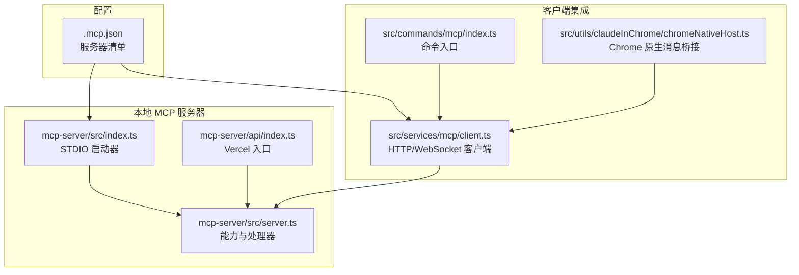
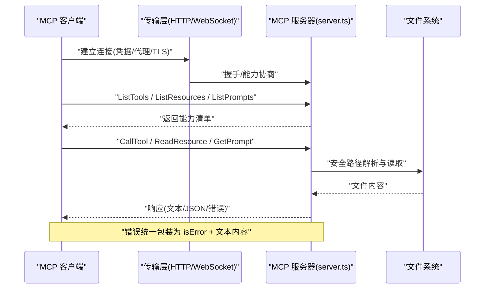
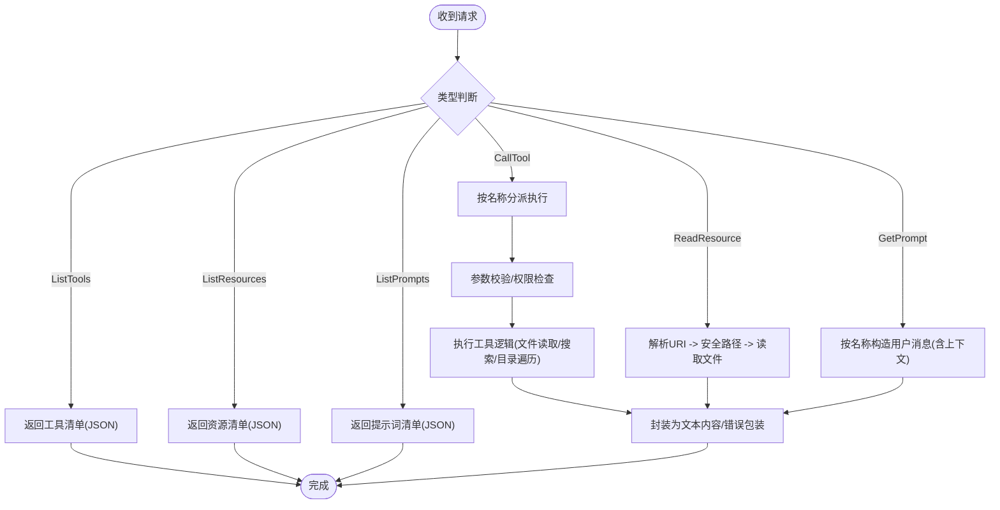
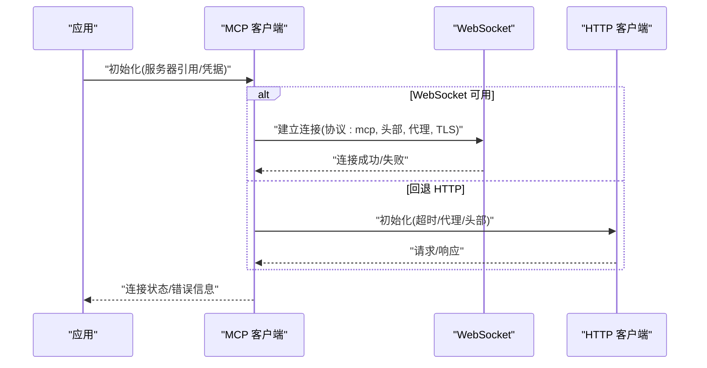
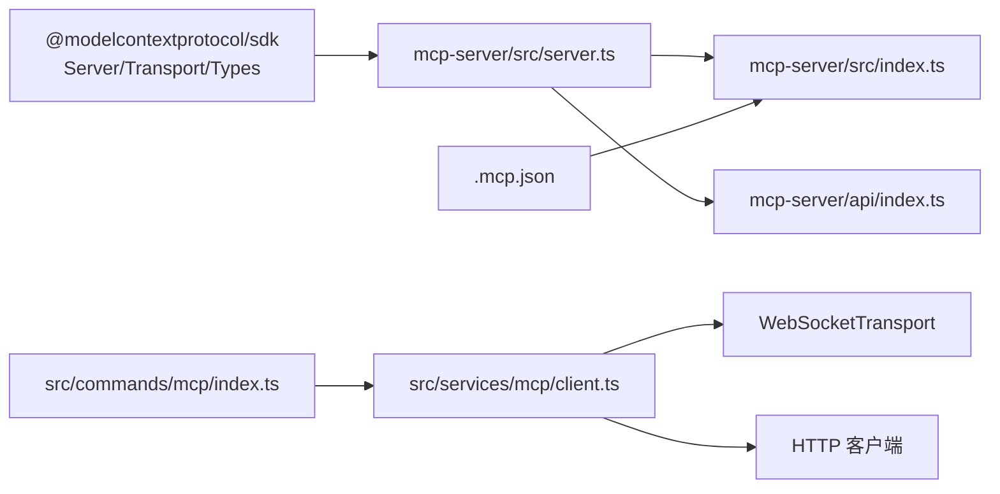

# MCP 协议集成

<cite>
**本文引用的文件**
- [mcp.ts](file://src/entrypoints/mcp.ts)
- [.mcp.json](file://.mcp.json)
- [index.ts](file://mcp-server/src/index.ts)
- [server.ts](file://mcp-server/src/server.ts)
- [index.ts](file://mcp-server/api/index.ts)
- [client.ts](file://src/services/mcp/client.ts)
- [index.ts](file://src/commands/mcp/index.ts)
- [chromeNativeHost.ts](file://src/utils/claudeInChrome/chromeNativeHost.ts)
</cite>

## 目录
1. [简介](#简介)
2. [项目结构](#项目结构)
3. [核心组件](#核心组件)
4. [架构总览](#架构总览)
5. [组件详解](#组件详解)
6. [依赖关系分析](#依赖关系分析)
7. [性能与可靠性](#性能与可靠性)
8. [故障排查指南](#故障排查指南)
9. [结论](#结论)
10. [附录：开发与集成指南](#附录开发与集成指南)

## 简介
本文件系统化梳理并文档化本仓库中 Model Context Protocol（MCP）的实现与集成方式，覆盖以下主题：
- MCP 协议的消息格式、能力声明与版本兼容性
- MCP 服务器的发现、连接与通信协议（STDIO、HTTP/WebSocket）
- 资源与提示词（Prompts）扩展机制、自定义工具与错误处理策略
- MCP 客户端生命周期管理、状态同步与断线重连
- 开发指南：如何实现 MCP 服务器、在客户端中集成以及调试技巧

## 项目结构
围绕 MCP 的相关模块主要分布在三处：
- 入口与运行时：src/entrypoints/mcp.ts 提供本地 STDIO 模式启动；mcp-server/src/index.ts 提供本地 STDIO 启动；mcp-server/api/index.ts 提供 Vercel 无服务器入口。
- MCP 服务器实现：mcp-server/src/server.ts 定义了能力（tools/resources/prompts）、请求处理器与资源读取逻辑。
- MCP 客户端集成：src/services/mcp/client.ts 负责 HTTP/WebSocket 连接、会话认证与传输层初始化；.mcp.json 描述本地 MCP 服务器配置；src/commands/mcp/index.ts 提供命令入口；src/utils/claudeInChrome/chromeNativeHost.ts 展示了通过 Chrome 原生消息通道桥接 MCP 的示例。

图表来源
- [server.ts:148-158](file://mcp-server/src/server.ts#L148-L158)
- [index.ts:13-19](file://mcp-server/src/index.ts#L13-L19)
- [index.ts:1-22](file://mcp-server/api/index.ts#L1-L22)
- [client.ts:741-799](file://src/services/mcp/client.ts#L741-L799)
- [.mcp.json:1-12](file://.mcp.json#L1-L12)

章节来源
- [server.ts:148-158](file://mcp-server/src/server.ts#L148-L158)
- [index.ts:13-19](file://mcp-server/src/index.ts#L13-L19)
- [index.ts:1-22](file://mcp-server/api/index.ts#L1-L22)
- [client.ts:741-799](file://src/services/mcp/client.ts#L741-L799)
- [.mcp.json:1-12](file://.mcp.json#L1-L12)

## 核心组件
- MCP 服务器（共享实现）：在 mcp-server/src/server.ts 中以 transport 无关的方式定义能力与处理器，支持 tools、resources、prompts 三大能力集。
- MCP 服务器入口：
  - STDIO：mcp-server/src/index.ts 使用 StdioServerTransport 启动。
  - Vercel：mcp-server/api/index.ts 将 Express 应用作为 Vercel 无服务器函数导出。
- MCP 客户端：src/services/mcp/client.ts 支持 HTTP 与 WebSocket 两种传输，负责建立连接、注入认证头、代理与 TLS 配置等。
- 本地启动入口：src/entrypoints/mcp.ts 提供本地 STDIO 模式，用于与桌面或 IDE 集成。
- 配置：.mcp.json 描述本地 MCP 服务器命令与环境变量。
- 命令入口：src/commands/mcp/index.ts 提供本地命令“mcp”，用于启用/禁用 MCP 服务器。
- Chrome 桥接：src/utils/claudeInChrome/chromeNativeHost.ts 展示了通过原生消息通道与外部 MCP 客户端交互的模式。

章节来源
- [server.ts:148-158](file://mcp-server/src/server.ts#L148-L158)
- [index.ts:13-19](file://mcp-server/src/index.ts#L13-L19)
- [index.ts:1-22](file://mcp-server/api/index.ts#L1-L22)
- [client.ts:741-799](file://src/services/mcp/client.ts#L741-L799)
- [mcp.ts:35-196](file://src/entrypoints/mcp.ts#L35-L196)
- [.mcp.json:1-12](file://.mcp.json#L1-L12)
- [index.ts:1-15](file://src/commands/mcp/index.ts#L1-L15)
- [chromeNativeHost.ts:331-385](file://src/utils/claudeInChrome/chromeNativeHost.ts#L331-L385)

## 架构总览
下图展示了 MCP 服务器与客户端之间的典型交互路径，涵盖能力声明、工具调用、资源读取与提示词获取。

图表来源
- [server.ts:162-253](file://mcp-server/src/server.ts#L162-L253)
- [server.ts:257-377](file://mcp-server/src/server.ts#L257-L377)
- [server.ts:707-705](file://mcp-server/src/server.ts#L707-L705)
- [client.ts:741-799](file://src/services/mcp/client.ts#L741-L799)

## 组件详解

### MCP 服务器（共享实现）
- 能力声明：tools、resources、prompts 三类能力均在 createServer 中声明。
- 工具（Tools）：
  - 列表：返回一组内置工具名称与描述。
  - 调用：根据工具名分派到具体实现，包含输入校验、路径安全检查、文件读取与结果封装。
- 资源（Resources）：
  - 列表：返回固定资源 URI（架构概览、工具注册表、命令注册表）与模板（源码文件读取）。
  - 读取：根据 URI 返回对应内容（Markdown/JSON/纯文本），并对相对路径进行安全解析。
- 提示词（Prompts）：
  - 列表：返回多条引导式提示词，如“解释工具”、“解释命令”、“架构总览”等。
  - 获取：按名称返回用户消息（含上下文与源码片段），便于模型生成解释。

图表来源
- [server.ts:257-377](file://mcp-server/src/server.ts#L257-L377)
- [server.ts:162-253](file://mcp-server/src/server.ts#L162-L253)
- [server.ts:707-705](file://mcp-server/src/server.ts#L707-L705)

章节来源
- [server.ts:148-158](file://mcp-server/src/server.ts#L148-L158)
- [server.ts:257-377](file://mcp-server/src/server.ts#L257-L377)
- [server.ts:162-253](file://mcp-server/src/server.ts#L162-L253)
- [server.ts:707-705](file://mcp-server/src/server.ts#L707-L705)

### MCP 客户端（HTTP/WebSocket）
- 传输选择：优先 WebSocket（mcp 协议），回退至 HTTP。
- 认证与头部：注入 User-Agent、会话令牌与合并后的自定义头部；敏感头信息在日志中脱敏。
- 代理与 TLS：支持代理与 TLS 选项，适配不同运行环境。
- 错误处理：对连接失败、超时、协议不匹配等情况进行降级与重试策略建议（见“故障排查指南”）。

图表来源
- [client.ts:741-799](file://src/services/mcp/client.ts#L741-L799)

章节来源
- [client.ts:741-799](file://src/services/mcp/client.ts#L741-L799)

### 本地 MCP 服务器（STDIO）
- 入口脚本：mcp-server/src/index.ts 通过 StdioServerTransport 启动，支持环境变量 CLAUDE_CODE_SRC_ROOT 指定源码根目录。
- 能力与处理器：复用 mcp-server/src/server.ts 的 createServer 实现。
- 启动日志：输出当前源码根目录，便于诊断。

章节来源
- [index.ts:13-19](file://mcp-server/src/index.ts#L13-L19)
- [server.ts:148-158](file://mcp-server/src/server.ts#L148-L158)

### 本地 MCP 服务器（Vercel）
- 入口：mcp-server/api/index.ts 导出 vercelApp 作为无服务器函数。
- 限制：由于函数无状态，基于会话的流式传输无法跨调用保持；但无状态工具调用与事件流仍可用。
- 环境变量：CLAUDE_CODE_SRC_ROOT（绝对路径）、MCP_API_KEY（可选）。

章节来源
- [index.ts:1-22](file://mcp-server/api/index.ts#L1-L22)

### 本地启动入口（本地 JS）
- src/entrypoints/mcp.ts 提供本地 STDIO 模式，用于与桌面或 IDE 集成。
- 特点：使用 Server/StdioServerTransport，暴露工具与资源能力，支持调试与详细日志。

章节来源
- [mcp.ts:35-196](file://src/entrypoints/mcp.ts#L35-L196)

### 配置与命令入口
- .mcp.json：定义本地 MCP 服务器清单，包含命令、参数与环境变量。
- 命令入口：src/commands/mcp/index.ts 提供“mcp”命令，用于启用/禁用 MCP 服务器。

章节来源
- [.mcp.json:1-12](file://.mcp.json#L1-L12)
- [index.ts:1-15](file://src/commands/mcp/index.ts#L1-L15)

### Chrome 原生消息桥接
- 展示了通过原生消息通道向外部 MCP 客户端广播通知的模式，包含连接管理、缓冲区处理与最大消息大小限制。

章节来源
- [chromeNativeHost.ts:331-385](file://src/utils/claudeInChrome/chromeNativeHost.ts#L331-L385)

## 依赖关系分析
- 服务器侧：
  - mcp-server/src/server.ts 依赖 @modelcontextprotocol/sdk 的 Server、请求模式与资源/提示词接口。
  - mcp-server/src/index.ts 依赖 server.ts 的 createServer 并通过 StdioServerTransport 启动。
  - mcp-server/api/index.ts 依赖 vercelApp（未在本节展开）。
- 客户端侧：
  - src/services/mcp/client.ts 依赖 WebSocketTransport 与 HTTP 客户端，负责传输层抽象与认证头注入。
- 配置与命令：
  - .mcp.json 与 src/commands/mcp/index.ts 协同控制本地 MCP 服务器的启用/禁用与运行参数。

图表来源
- [server.ts:8-17](file://mcp-server/src/server.ts#L8-L17)
- [index.ts:10-11](file://mcp-server/src/index.ts#L10-L11)
- [index.ts:20-21](file://mcp-server/api/index.ts#L20-L21)
- [client.ts:741-799](file://src/services/mcp/client.ts#L741-L799)
- [.mcp.json:1-12](file://.mcp.json#L1-L12)
- [index.ts:1-15](file://src/commands/mcp/index.ts#L1-L15)

章节来源
- [server.ts:8-17](file://mcp-server/src/server.ts#L8-L17)
- [index.ts:10-11](file://mcp-server/src/index.ts#L10-L11)
- [index.ts:20-21](file://mcp-server/api/index.ts#L20-L21)
- [client.ts:741-799](file://src/services/mcp/client.ts#L741-L799)
- [.mcp.json:1-12](file://.mcp.json#L1-L12)
- [index.ts:1-15](file://src/commands/mcp/index.ts#L1-L15)

## 性能与可靠性
- 文件访问与缓存
  - 服务器侧对资源读取采用安全路径解析与文件存在性检查，避免路径穿越与异常 IO。
  - 客户端侧对工具调用场景可结合内存缓存减少重复读取（参考本地入口中的文件状态缓存模式）。
- 传输层优化
  - WebSocket 优先，支持代理与 TLS，适合长连接与低延迟场景。
  - HTTP 适用于无状态或临时调用，注意超时与重试策略。
- 错误处理
  - 服务器对未知工具/资源抛出明确错误；客户端对连接失败与协议不匹配进行降级处理。
- 可观测性
  - 客户端在连接前打印关键头部与环境变量，便于问题定位。

章节来源
- [server.ts:84-88](file://mcp-server/src/server.ts#L84-L88)
- [server.ts:202-253](file://mcp-server/src/server.ts#L202-L253)
- [client.ts:741-799](file://src/services/mcp/client.ts#L741-L799)
- [mcp.ts:40-46](file://src/entrypoints/mcp.ts#L40-L46)

## 故障排查指南
- 服务器未启动或无法连接
  - 检查 CLAUDE_CODE_SRC_ROOT 是否正确设置，确保源码根目录存在且可读。
  - 查看 STDIO 启动日志输出的 src 路径是否符合预期。
- 工具调用失败
  - 确认工具名称拼写正确；检查输入参数是否满足要求；查看服务器返回的错误文本。
- 资源读取异常
  - 确认 URI 正确；检查相对路径是否越界；确认目标文件存在。
- WebSocket 连接问题
  - 检查代理与 TLS 设置；确认服务端支持 mcp 协议；关注客户端日志中的头部与 URL。
- Vercel 无状态限制
  - 若使用基于会话的流式传输，请改用有状态部署（如 Railway/Render/VPS）；无状态工具调用仍可用。

章节来源
- [index.ts:13-19](file://mcp-server/src/index.ts#L13-L19)
- [server.ts:202-253](file://mcp-server/src/server.ts#L202-L253)
- [client.ts:741-799](file://src/services/mcp/client.ts#L741-L799)
- [index.ts:14-18](file://mcp-server/api/index.ts#L14-L18)

## 结论
本仓库提供了完整的 MCP 服务器与客户端实现：服务器以 transport 无关的方式暴露工具、资源与提示词能力，客户端支持 HTTP/WebSocket 两种传输并具备完善的认证与代理配置。通过 .mcp.json 与命令入口，用户可以便捷地启用/禁用本地 MCP 服务器并与桌面/IDE 集成。整体设计兼顾易用性与安全性，适合在多种运行环境中部署与调试。

## 附录：开发与集成指南

### 服务器实现要点
- 能力声明
  - 在 createServer 中声明 capabilities：tools、resources、prompts。
- 工具实现
  - 使用 ListToolsRequestSchema 与 CallToolRequestSchema 注册处理器；对输入参数进行严格校验；对文件路径进行安全解析；将结果封装为文本内容。
- 资源实现
  - 使用 ListResourcesRequestSchema、ListResourceTemplatesRequestSchema 与 ReadResourceRequestSchema；对 URI 进行白名单与安全路径解析。
- 提示词实现
  - 使用 ListPromptsRequestSchema 与 GetPromptRequestSchema；按需构造用户消息与上下文。
- 错误处理
  - 对未知工具/资源抛出明确错误；客户端统一包装为 isError + 文本内容。

章节来源
- [server.ts:148-158](file://mcp-server/src/server.ts#L148-L158)
- [server.ts:257-377](file://mcp-server/src/server.ts#L257-L377)
- [server.ts:162-253](file://mcp-server/src/server.ts#L162-L253)
- [server.ts:707-705](file://mcp-server/src/server.ts#L707-L705)

### 客户端集成要点
- 传输选择
  - 优先 WebSocket（mcp 协议），必要时回退 HTTP。
- 认证与头部
  - 注入 User-Agent、会话令牌与自定义头部；在日志中脱敏敏感信息。
- 代理与 TLS
  - 根据运行环境配置代理与 TLS 选项。
- 生命周期管理
  - 建立连接后定期心跳/重连；对连接失败与协议不匹配进行降级处理。
- 状态同步
  - 对于需要会话状态的场景，避免使用无状态平台（如 Vercel 函数）承载流式传输。

章节来源
- [client.ts:741-799](file://src/services/mcp/client.ts#L741-L799)

### 调试技巧
- 本地调试
  - 使用 src/entrypoints/mcp.ts 启动本地 STDIO 服务器，观察详细日志与错误输出。
- 服务器端调试
  - 在 mcp-server/src/server.ts 中增加日志输出，定位工具调用与资源读取路径。
- 客户端调试
  - 打印连接 URL、头部与环境变量；在 WebSocket 与 HTTP 之间切换验证协议兼容性。
- 平台差异
  - Vercel 仅支持无状态工具调用与事件流；若需会话流式传输，使用有状态部署。

章节来源
- [mcp.ts:35-196](file://src/entrypoints/mcp.ts#L35-L196)
- [server.ts:257-377](file://mcp-server/src/server.ts#L257-L377)
- [client.ts:741-799](file://src/services/mcp/client.ts#L741-L799)
- [index.ts:14-18](file://mcp-server/api/index.ts#L14-L18)