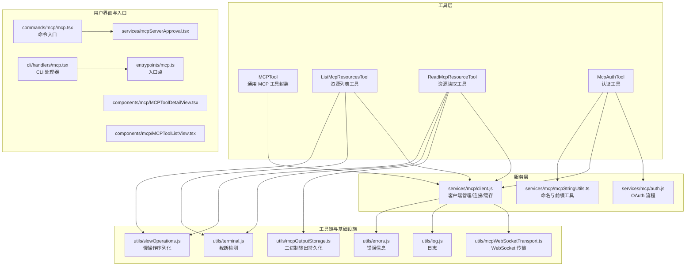
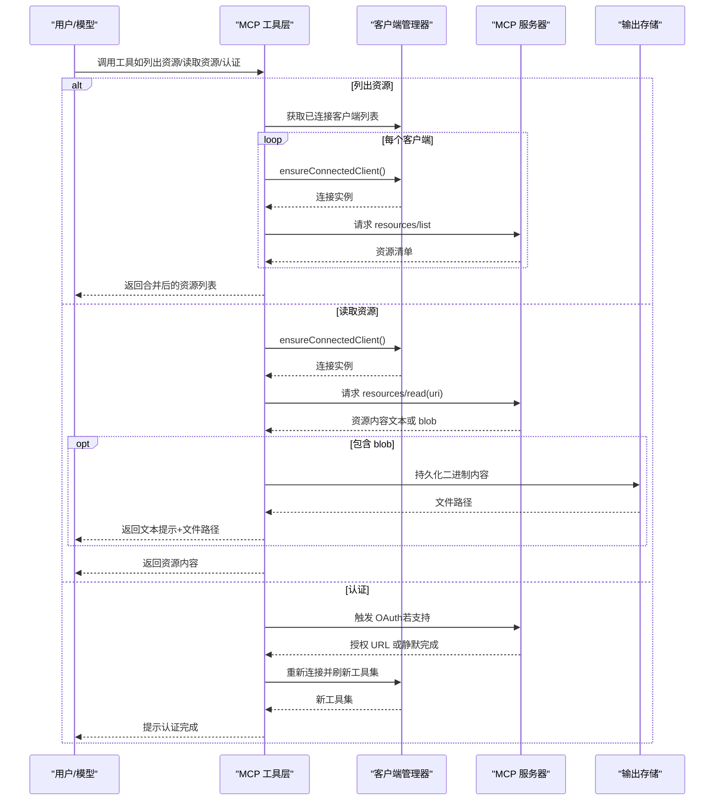
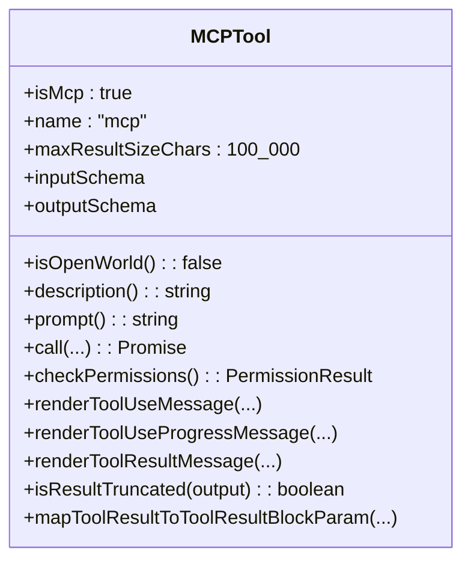
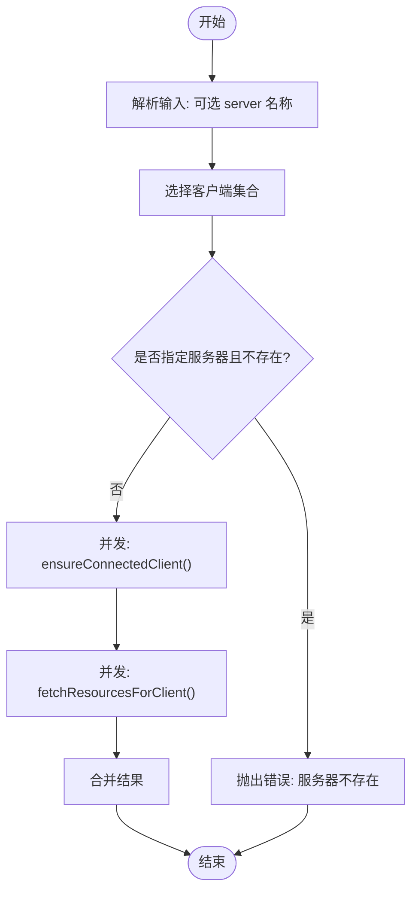
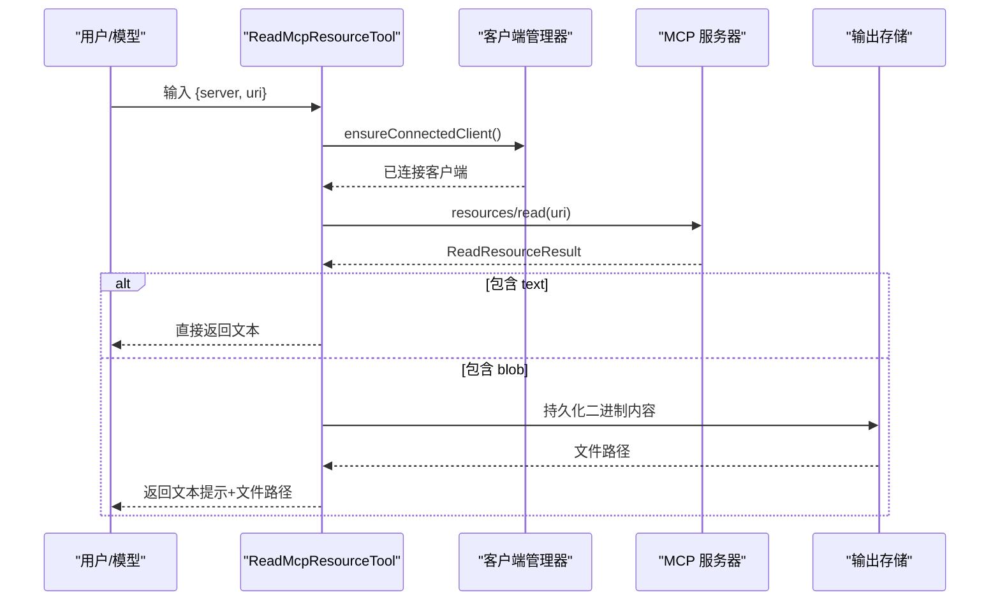
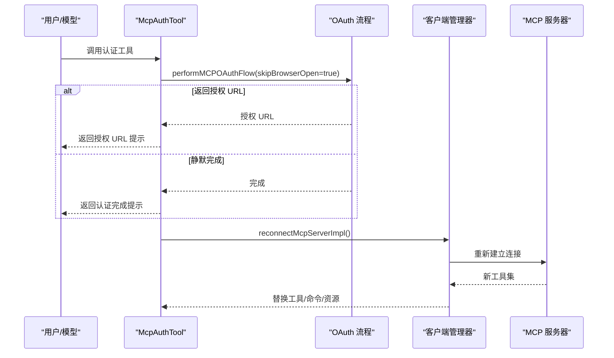
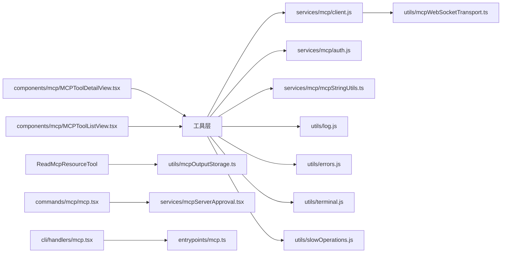

# MCP 工具

<cite>
**本文引用的文件**
- [src/tools/MCPTool/MCPTool.ts](file://src/tools/MCPTool/MCPTool.ts)
- [src/tools/ListMcpResourcesTool/ListMcpResourcesTool.ts](file://src/tools/ListMcpResourcesTool/ListMcpResourcesTool.ts)
- [src/tools/ReadMcpResourceTool/ReadMcpResourceTool.ts](file://src/tools/ReadMcpResourceTool/ReadMcpResourceTool.ts)
- [src/tools/McpAuthTool/McpAuthTool.ts](file://src/tools/McpAuthTool/McpAuthTool.ts)
- [src/services/mcp/client.js](file://src/services/mcp/client.js)
- [src/services/mcp/auth.js](file://src/services/mcp/auth.js)
- [src/services/mcp/mcpStringUtils.ts](file://src/services/mcp/mcpStringUtils.ts)
- [src/utils/mcpOutputStorage.ts](file://src/utils/mcpOutputStorage.ts)
- [src/utils/mcpWebSocketTransport.ts](file://src/utils/mcpWebSocketTransport.ts)
- [src/utils/mcpValidation.ts](file://src/utils/mcpValidation.ts)
- [src/utils/log.js](file://src/utils/log.js)
- [src/utils/errors.js](file://src/utils/errors.js)
- [src/utils/terminal.js](file://src/utils/terminal.js)
- [src/utils/slowOperations.js](file://src/utils/slowOperations.js)
- [src/commands/mcp/mcp.tsx](file://src/commands/mcp/mcp.tsx)
- [src/cli/handlers/mcp.tsx](file://src/cli/handlers/mcp.tsx)
- [src/entrypoints/mcp.ts](file://src/entrypoints/mcp.ts)
- [src/components/mcp/MCPToolDetailView.tsx](file://src/components/mcp/MCPToolDetailView.tsx)
- [src/components/mcp/MCPToolListView.tsx](file://src/components/mcp/MCPToolListView.tsx)
- [src/services/mcpServerApproval.tsx](file://src/services/mcpServerApproval.tsx)
- [src/skills/mcpSkillBuilders.ts](file://src/skills/mcpSkillBuilders.ts)
- [scripts/test-mcp.ts](file://scripts/test-mcp.ts)
</cite>

## 目录
1. [简介](#简介)
2. [项目结构](#项目结构)
3. [核心组件](#核心组件)
4. [架构总览](#架构总览)
5. [详细组件分析](#详细组件分析)
6. [依赖关系分析](#依赖关系分析)
7. [性能考量](#性能考量)
8. [故障排查指南](#故障排查指南)
9. [结论](#结论)
10. [附录](#附录)

## 简介
本文件系统性梳理 Claude Code 中的 MCP（Model Context Protocol）工具体系，重点覆盖以下方面：
- MCPTool 的模型上下文协议集成与外部工具连接能力
- 资源列表工具与资源读取工具的使用方式与数据流
- MCP 认证工具的授权流程与安全机制
- MCP 服务器的发现、连接与通信协议要点
- MCP 服务器开发指南（协议实现与错误处理）
- 实际集成案例与最佳实践

## 项目结构
围绕 MCP 的相关模块主要分布在 tools、services、utils、components、commands、cli、entrypoints 等目录中。下图给出与 MCP 工具相关的高层结构关系。

图表来源
- [src/tools/MCPTool/MCPTool.ts:1-79](file://src/tools/MCPTool/MCPTool.ts#L1-L79)
- [src/tools/ListMcpResourcesTool/ListMcpResourcesTool.ts:1-125](file://src/tools/ListMcpResourcesTool/ListMcpResourcesTool.ts#L1-L125)
- [src/tools/ReadMcpResourceTool/ReadMcpResourceTool.ts:1-160](file://src/tools/ReadMcpResourceTool/ReadMcpResourceTool.ts#L1-L160)
- [src/tools/McpAuthTool/McpAuthTool.ts:1-217](file://src/tools/McpAuthTool/McpAuthTool.ts#L1-L217)
- [src/services/mcp/client.js](file://src/services/mcp/client.js)
- [src/services/mcp/auth.js](file://src/services/mcp/auth.js)
- [src/services/mcp/mcpStringUtils.ts](file://src/services/mcp/mcpStringUtils.ts)
- [src/utils/mcpOutputStorage.ts](file://src/utils/mcpOutputStorage.ts)
- [src/utils/mcpWebSocketTransport.ts](file://src/utils/mcpWebSocketTransport.ts)
- [src/utils/log.js](file://src/utils/log.js)
- [src/utils/errors.js](file://src/utils/errors.js)
- [src/utils/terminal.js](file://src/utils/terminal.js)
- [src/utils/slowOperations.js](file://src/utils/slowOperations.js)
- [src/commands/mcp/mcp.tsx](file://src/commands/mcp/mcp.tsx)
- [src/cli/handlers/mcp.tsx](file://src/cli/handlers/mcp.tsx)
- [src/entrypoints/mcp.ts](file://src/entrypoints/mcp.ts)
- [src/components/mcp/MCPToolDetailView.tsx](file://src/components/mcp/MCPToolDetailView.tsx)
- [src/components/mcp/MCPToolListView.tsx](file://src/components/mcp/MCPToolListView.tsx)
- [src/services/mcpServerApproval.tsx](file://src/services/mcpServerApproval.tsx)

章节来源
- [src/tools/MCPTool/MCPTool.ts:1-79](file://src/tools/MCPTool/MCPTool.ts#L1-L79)
- [src/tools/ListMcpResourcesTool/ListMcpResourcesTool.ts:1-125](file://src/tools/ListMcpResourcesTool/ListMcpResourcesTool.ts#L1-L125)
- [src/tools/ReadMcpResourceTool/ReadMcpResourceTool.ts:1-160](file://src/tools/ReadMcpResourceTool/ReadMcpResourceTool.ts#L1-L160)
- [src/tools/McpAuthTool/McpAuthTool.ts:1-217](file://src/tools/McpAuthTool/McpAuthTool.ts#L1-L217)

## 核心组件
- MCPTool：作为通用的 MCP 工具定义，提供统一的输入/输出模式、权限检查钩子、UI 渲染与结果截断判定等能力，并在运行时由 MCP 客户端动态注入具体名称与参数。
- ListMcpResourcesTool：列举已连接 MCP 服务器提供的资源清单，支持按服务器过滤；内部对连接状态进行健康检查与重连，同时利用缓存避免陈旧数据。
- ReadMcpResourceTool：从指定 MCP 服务器读取资源内容，自动处理文本与二进制 blob，将二进制内容落盘并返回可读提示，确保不会把大体积二进制直接塞入上下文。
- McpAuthTool：为未认证的 MCP 服务器生成“伪工具”，触发 OAuth 授权流程并在完成后自动替换为真实工具集合，提供用户友好的引导与错误反馈。

章节来源
- [src/tools/MCPTool/MCPTool.ts:27-77](file://src/tools/MCPTool/MCPTool.ts#L27-L77)
- [src/tools/ListMcpResourcesTool/ListMcpResourcesTool.ts:40-123](file://src/tools/ListMcpResourcesTool/ListMcpResourcesTool.ts#L40-L123)
- [src/tools/ReadMcpResourceTool/ReadMcpResourceTool.ts:49-158](file://src/tools/ReadMcpResourceTool/ReadMcpResourceTool.ts#L49-L158)
- [src/tools/McpAuthTool/McpAuthTool.ts:49-215](file://src/tools/McpAuthTool/McpAuthTool.ts#L49-L215)

## 架构总览
下图展示 MCP 工具在应用中的整体交互：工具调用通过客户端管理器与 MCP 服务器通信，资源读取涉及二进制落盘与上下文安全；认证工具负责 OAuth 启动与工具集替换。

图表来源
- [src/tools/ListMcpResourcesTool/ListMcpResourcesTool.ts:66-101](file://src/tools/ListMcpResourcesTool/ListMcpResourcesTool.ts#L66-L101)
- [src/tools/ReadMcpResourceTool/ReadMcpResourceTool.ts:75-144](file://src/tools/ReadMcpResourceTool/ReadMcpResourceTool.ts#L75-L144)
- [src/tools/McpAuthTool/McpAuthTool.ts:85-206](file://src/tools/McpAuthTool/McpAuthTool.ts#L85-L206)
- [src/services/mcp/client.js](file://src/services/mcp/client.js)
- [src/utils/mcpOutputStorage.ts](file://src/utils/mcpOutputStorage.ts)

## 详细组件分析

### MCPTool（通用 MCP 工具封装）
- 设计要点
  - 以 buildTool 构建，标记 isMcp 并保留动态覆写字段（名称、描述、prompt、call 等），便于在运行时注入具体服务器与参数。
  - 输入 schema 放宽为 passthrough，允许 MCP 服务器自定义参数；输出 schema 统一为字符串结果。
  - 权限检查采用“透传”策略，交由上层决策。
  - 提供 UI 渲染与结果截断判定，保障终端输出可控。
- 关键行为
  - 动态覆写：name/description/prompt/call/userFacingName 等在 MCP 客户端侧被覆盖，以适配不同服务器与工具。
  - 结果映射：mapToolResultToToolResultBlockParam 将工具结果映射为消息块参数，用于对话上下文。

图表来源
- [src/tools/MCPTool/MCPTool.ts:27-77](file://src/tools/MCPTool/MCPTool.ts#L27-L77)

章节来源
- [src/tools/MCPTool/MCPTool.ts:1-79](file://src/tools/MCPTool/MCPTool.ts#L1-L79)

### 资源列表工具（ListMcpResourcesTool）
- 功能概述
  - 列举所有已连接 MCP 服务器的资源，支持按服务器名过滤。
  - 对每个客户端执行 ensureConnectedClient，保证连接健康；并发拉取各服务器资源并合并结果。
  - 使用 LRU 缓存（基于服务器名）预热资源列表，避免陈旧数据；在连接关闭或资源变更通知时失效缓存。
- 错误处理
  - 单个服务器连接失败不影响整体结果，记录错误并跳过该服务器。
  - 当目标服务器不存在时抛出明确错误，提示可用服务器列表。
- 输出与截断
  - 输出为资源数组，使用 JSON 序列化后进行截断检测；空结果时返回友好提示。

图表来源
- [src/tools/ListMcpResourcesTool/ListMcpResourcesTool.ts:66-101](file://src/tools/ListMcpResourcesTool/ListMcpResourcesTool.ts#L66-L101)

章节来源
- [src/tools/ListMcpResourcesTool/ListMcpResourcesTool.ts:1-125](file://src/tools/ListMcpResourcesTool/ListMcpResourcesTool.ts#L1-L125)

### 资源读取工具（ReadMcpResourceTool）
- 功能概述
  - 从指定服务器读取给定 URI 的资源内容。
  - 自动识别文本与二进制内容：文本直接返回；二进制通过持久化到本地文件并返回提示，避免将大体积二进制直接放入上下文。
  - 在调用前校验服务器连接状态与 capabilities 是否包含 resources。
- 数据流
  - 通过 ensureConnectedClient 获取已连接客户端。
  - 发送 resources/read 请求并使用 ReadResourceResultSchema 校验响应。
  - 对每个内容项进行类型判断与处理：文本原样返回；blob 解码后持久化并替换为文件路径提示。
- 截断与安全
  - 输出前进行 JSON 序列化与截断检测，防止超长输出影响性能与稳定性。

图表来源
- [src/tools/ReadMcpResourceTool/ReadMcpResourceTool.ts:75-144](file://src/tools/ReadMcpResourceTool/ReadMcpResourceTool.ts#L75-L144)
- [src/utils/mcpOutputStorage.ts](file://src/utils/mcpOutputStorage.ts)

章节来源
- [src/tools/ReadMcpResourceTool/ReadMcpResourceTool.ts:1-160](file://src/tools/ReadMcpResourceTool/ReadMcpResourceTool.ts#L1-L160)

### 认证工具（McpAuthTool）
- 功能概述
  - 为未认证的 MCP 服务器生成“伪工具”，用于引导用户启动 OAuth 授权。
  - 仅在 SSE/HTTP 传输类型下支持 OAuth；其他传输类型提示手动认证。
  - 支持 claude.ai-proxy 类型的特殊提示，引导用户通过 /mcp 页面完成认证。
- 流程与替换
  - 启动 performMCPOAuthFlow，捕获授权 URL 或等待静默完成。
  - OAuth 成功后清理认证缓存并重新连接服务器，使用前缀替换机制将“伪工具”替换为真实工具集（工具、命令、资源）。
- 安全与权限
  - 认证流程由服务层处理，工具层仅负责触发与提示；权限检查为允许行为，不修改输入。

图表来源
- [src/tools/McpAuthTool/McpAuthTool.ts:85-206](file://src/tools/McpAuthTool/McpAuthTool.ts#L85-L206)
- [src/services/mcp/auth.js](file://src/services/mcp/auth.js)
- [src/services/mcp/client.js](file://src/services/mcp/client.js)
- [src/services/mcp/mcpStringUtils.ts](file://src/services/mcp/mcpStringUtils.ts)

章节来源
- [src/tools/McpAuthTool/McpAuthTool.ts:1-217](file://src/tools/McpAuthTool/McpAuthTool.ts#L1-L217)

## 依赖关系分析
- 工具层依赖服务层与工具链：
  - ListMcpResourcesTool/ReadMcpResourceTool 依赖 services/mcp/client.js 进行连接与资源访问。
  - McpAuthTool 依赖 services/mcp/auth.js 与 services/mcp/client.js 完成 OAuth 与重连。
  - ReadMcpResourceTool 依赖 utils/mcpOutputStorage.ts 持久化二进制内容。
- 命令与入口：
  - commands/mcp/mcp.tsx 与 cli/handlers/mcp.tsx 提供用户交互入口；entrypoints/mcp.ts 作为应用入口。
- UI 层：
  - components/mcp/MCPToolDetailView.tsx 与 MCPToolListView.tsx 提供工具详情与列表视图。
- 其他支撑：
  - utils/mcpWebSocketTransport.ts 提供 WebSocket 传输；utils/log.js 与 utils/errors.js 提供日志与错误信息；utils/terminal.js 与 utils/slowOperations.js 提供截断与序列化能力。

图表来源
- [src/tools/ListMcpResourcesTool/ListMcpResourcesTool.ts](file://src/tools/ListMcpResourcesTool/ListMcpResourcesTool.ts)
- [src/tools/ReadMcpResourceTool/ReadMcpResourceTool.ts](file://src/tools/ReadMcpResourceTool/ReadMcpResourceTool.ts)
- [src/tools/McpAuthTool/McpAuthTool.ts](file://src/tools/McpAuthTool/McpAuthTool.ts)
- [src/services/mcp/client.js](file://src/services/mcp/client.js)
- [src/services/mcp/auth.js](file://src/services/mcp/auth.js)
- [src/services/mcp/mcpStringUtils.ts](file://src/services/mcp/mcpStringUtils.ts)
- [src/utils/mcpOutputStorage.ts](file://src/utils/mcpOutputStorage.ts)
- [src/utils/mcpWebSocketTransport.ts](file://src/utils/mcpWebSocketTransport.ts)
- [src/utils/log.js](file://src/utils/log.js)
- [src/utils/errors.js](file://src/utils/errors.js)
- [src/utils/terminal.js](file://src/utils/terminal.js)
- [src/utils/slowOperations.js](file://src/utils/slowOperations.js)
- [src/commands/mcp/mcp.tsx](file://src/commands/mcp/mcp.tsx)
- [src/cli/handlers/mcp.tsx](file://src/cli/handlers/mcp.tsx)
- [src/entrypoints/mcp.ts](file://src/entrypoints/mcp.ts)
- [src/components/mcp/MCPToolDetailView.tsx](file://src/components/mcp/MCPToolDetailView.tsx)
- [src/components/mcp/MCPToolListView.tsx](file://src/components/mcp/MCPToolListView.tsx)
- [src/services/mcpServerApproval.tsx](file://src/services/mcpServerApproval.tsx)

章节来源
- [src/tools/MCPTool/MCPTool.ts](file://src/tools/MCPTool/MCPTool.ts)
- [src/tools/ListMcpResourcesTool/ListMcpResourcesTool.ts](file://src/tools/ListMcpResourcesTool/ListMcpResourcesTool.ts)
- [src/tools/ReadMcpResourceTool/ReadMcpResourceTool.ts](file://src/tools/ReadMcpResourceTool/ReadMcpResourceTool.ts)
- [src/tools/McpAuthTool/McpAuthTool.ts](file://src/tools/McpAuthTool/McpAuthTool.ts)

## 性能考量
- 并发与缓存
  - 资源列表工具对多个客户端并发请求，显著降低总延迟；内部使用 LRU 缓存（按服务器名）避免陈旧数据，减少重复网络往返。
- 输出大小控制
  - 统一设置最大结果字符数，结合终端截断检测与 JSON 序列化后的长度判断，防止超大输出影响性能与稳定性。
- 二进制处理
  - 资源读取工具对二进制内容进行落盘并返回文件路径提示，避免将大体积二进制直接拼接到上下文中，提升上下文效率与安全性。
- 连接健康与重试
  - ensureConnectedClient 在健康状态下为无操作缓存命中，连接异常时返回新连接，配合资源变更通知使缓存失效，保证一致性。

## 故障排查指南
- 服务器未找到
  - 现象：指定 server 参数但找不到对应客户端。
  - 处理：检查服务器名称是否正确，或列出可用服务器后再试。
  - 参考：[src/tools/ListMcpResourcesTool/ListMcpResourcesTool.ts:73-77](file://src/tools/ListMcpResourcesTool/ListMcpResourcesTool.ts#L73-L77)、[src/tools/ReadMcpResourceTool/ReadMcpResourceTool.ts:80-84](file://src/tools/ReadMcpResourceTool/ReadMcpResourceTool.ts#L80-L84)
- 服务器未连接
  - 现象：目标服务器处于非连接状态。
  - 处理：先建立连接，再尝试读取资源。
  - 参考：[src/tools/ReadMcpResourceTool/ReadMcpResourceTool.ts:86-88](file://src/tools/ReadMcpResourceTool/ReadMcpResourceTool.ts#L86-L88)
- 不支持资源能力
  - 现象：服务器未声明 resources 能力。
  - 处理：确认服务器支持资源读取，或改用其他工具。
  - 参考：[src/tools/ReadMcpResourceTool/ReadMcpResourceTool.ts:90-92](file://src/tools/ReadMcpResourceTool/ReadMcpResourceTool.ts#L90-L92)
- OAuth 不支持的传输
  - 现象：当前传输类型不支持 OAuth。
  - 处理：切换到 SSE/HTTP 传输，或通过 /mcp 手动认证。
  - 参考：[src/tools/McpAuthTool/McpAuthTool.ts:101-108](file://src/tools/McpAuthTool/McpAuthTool.ts#L101-L108)
- OAuth 流程失败
  - 现象：工具触发 OAuth 后失败。
  - 处理：查看日志错误信息，确认网络与配置；建议通过 /mcp 页面手动完成认证。
  - 参考：[src/tools/McpAuthTool/McpAuthTool.ts:167-172](file://src/tools/McpAuthTool/McpAuthTool.ts#L167-L172)、[src/utils/log.js](file://src/utils/log.js)
- 二进制保存失败
  - 现象：二进制内容无法保存到磁盘。
  - 处理：检查磁盘空间与权限，重试或改用文本内容。
  - 参考：[src/tools/ReadMcpResourceTool/ReadMcpResourceTool.ts:120-126](file://src/tools/ReadMcpResourceTool/ReadMcpResourceTool.ts#L120-L126)、[src/utils/mcpOutputStorage.ts](file://src/utils/mcpOutputStorage.ts)

章节来源
- [src/tools/ListMcpResourcesTool/ListMcpResourcesTool.ts:66-101](file://src/tools/ListMcpResourcesTool/ListMcpResourcesTool.ts#L66-L101)
- [src/tools/ReadMcpResourceTool/ReadMcpResourceTool.ts:75-144](file://src/tools/ReadMcpResourceTool/ReadMcpResourceTool.ts#L75-L144)
- [src/tools/McpAuthTool/McpAuthTool.ts:85-206](file://src/tools/McpAuthTool/McpAuthTool.ts#L85-L206)
- [src/utils/log.js](file://src/utils/log.js)
- [src/utils/mcpOutputStorage.ts](file://src/utils/mcpOutputStorage.ts)

## 结论
本文件系统性梳理了 Claude Code 中 MCP 工具的架构与实现，涵盖通用封装、资源管理、认证流程与安全机制。通过并发连接、LRU 缓存、输出截断与二进制落盘等策略，既保证了性能，也提升了安全性与用户体验。对于开发者而言，遵循本文档的协议实现与错误处理建议，可快速构建稳定可靠的 MCP 服务器与工具集。

## 附录

### MCP 服务器开发指南（协议实现与错误处理）
- 协议实现要点
  - 资源能力：若提供 resources/read，请确保返回结构包含 text 或 blob 字段，并在 blob 场景下提供 MIME 类型以便正确处理。
  - 认证支持：若支持 OAuth，请在 401 未授权场景下返回可识别的错误，以便客户端触发授权流程。
  - 传输选择：优先支持 SSE/HTTP 传输，便于工具层发起 OAuth。
- 错误处理建议
  - 明确区分“服务器不可达/未连接”、“认证失败/未授权”、“能力不支持”三类错误，便于前端与工具层给出一致的用户提示。
  - 对于资源读取失败，返回可读的错误信息并尽量包含上下文（如 URI、服务器名）。
- 安全建议
  - 严格校验客户端来源与权限范围，避免越权访问。
  - 对二进制内容进行大小限制与类型校验，防止滥用。
- 开发测试
  - 使用脚本与命令入口进行联调验证，参考命令与 CLI 处理器的交互方式。
  - 参考：[src/commands/mcp/mcp.tsx](file://src/commands/mcp/mcp.tsx)、[src/cli/handlers/mcp.tsx](file://src/cli/handlers/mcp.tsx)、[scripts/test-mcp.ts](file://scripts/test-mcp.ts)

章节来源
- [src/commands/mcp/mcp.tsx](file://src/commands/mcp/mcp.tsx)
- [src/cli/handlers/mcp.tsx](file://src/cli/handlers/mcp.tsx)
- [scripts/test-mcp.ts](file://scripts/test-mcp.ts)

### MCP 工具集成的实际案例与最佳实践
- 案例一：批量枚举资源
  - 使用资源列表工具一次性获取所有已连接服务器的资源清单，随后根据需要筛选目标服务器。
  - 最佳实践：结合 UI 列表视图展示，支持按服务器过滤与排序。
  - 参考：[src/tools/ListMcpResourcesTool/ListMcpResourcesTool.ts:66-101](file://src/tools/ListMcpResourcesTool/ListMcpResourcesTool.ts#L66-L101)、[src/components/mcp/MCPToolListView.tsx](file://src/components/mcp/MCPToolListView.tsx)
- 案例二：读取特定资源
  - 指定服务器与 URI，读取资源内容；若为二进制内容，自动落盘并返回文件路径提示。
  - 最佳实践：在工具调用前检查服务器连接状态与 capabilities，避免不必要的错误。
  - 参考：[src/tools/ReadMcpResourceTool/ReadMcpResourceTool.ts:75-144](file://src/tools/ReadMcpResourceTool/ReadMcpResourceTool.ts#L75-L144)、[src/utils/mcpOutputStorage.ts](file://src/utils/mcpOutputStorage.ts)
- 案例三：触发 OAuth 认证
  - 对于未认证的服务器，使用认证工具生成授权 URL 或静默完成认证；认证成功后自动替换为真实工具集。
  - 最佳实践：在 UI 中提供清晰的提示与下一步操作指引，必要时回退到 /mcp 页面手动认证。
  - 参考：[src/tools/McpAuthTool/McpAuthTool.ts:85-206](file://src/tools/McpAuthTool/McpAuthTool.ts#L85-L206)、[src/services/mcpServerApproval.tsx](file://src/services/mcpServerApproval.tsx)

章节来源
- [src/tools/ListMcpResourcesTool/ListMcpResourcesTool.ts:1-125](file://src/tools/ListMcpResourcesTool/ListMcpResourcesTool.ts#L1-L125)
- [src/tools/ReadMcpResourceTool/ReadMcpResourceTool.ts:1-160](file://src/tools/ReadMcpResourceTool/ReadMcpResourceTool.ts#L1-L160)
- [src/tools/McpAuthTool/McpAuthTool.ts:1-217](file://src/tools/McpAuthTool/McpAuthTool.ts#L1-L217)
- [src/components/mcp/MCPToolDetailView.tsx](file://src/components/mcp/MCPToolDetailView.tsx)
- [src/components/mcp/MCPToolListView.tsx](file://src/components/mcp/MCPToolListView.tsx)
- [src/services/mcpServerApproval.tsx](file://src/services/mcpServerApproval.tsx)