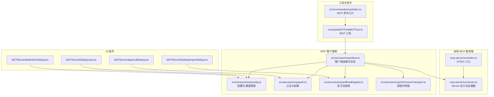
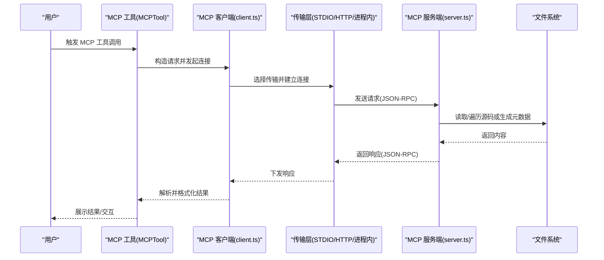
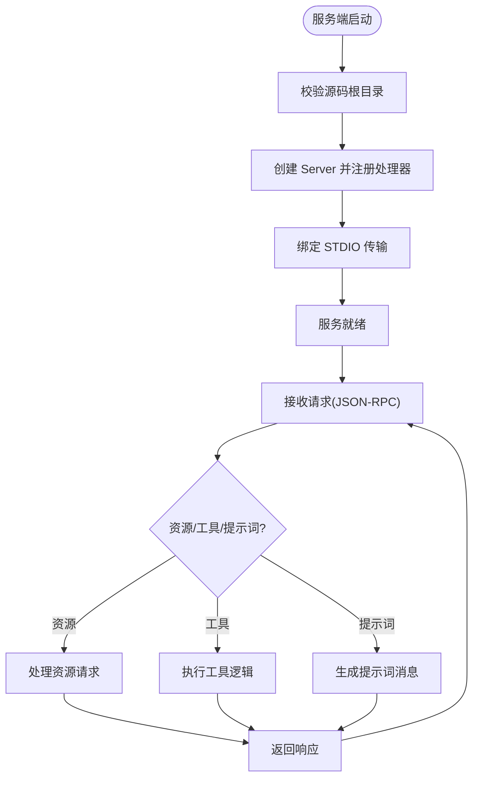
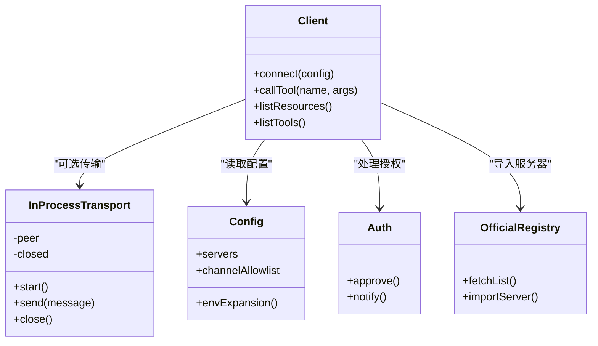
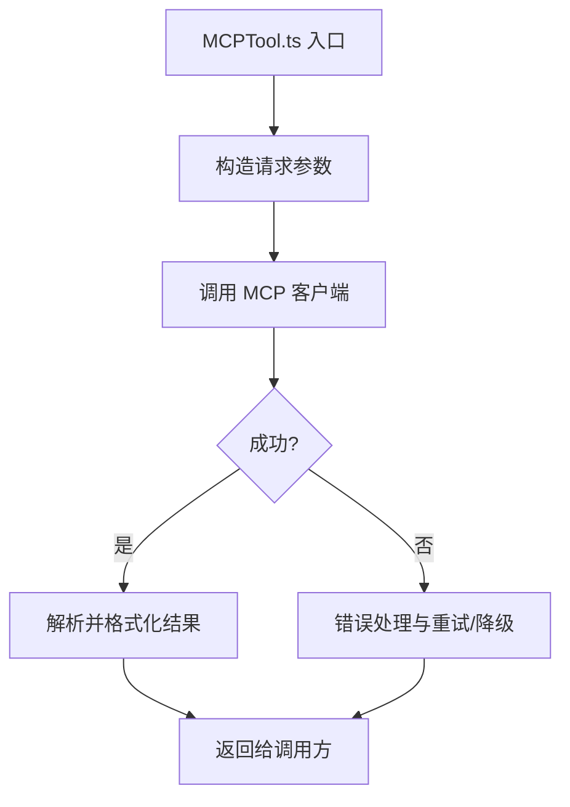
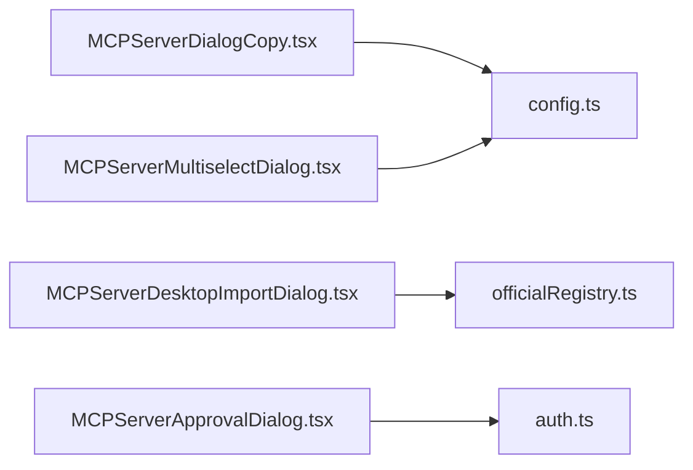
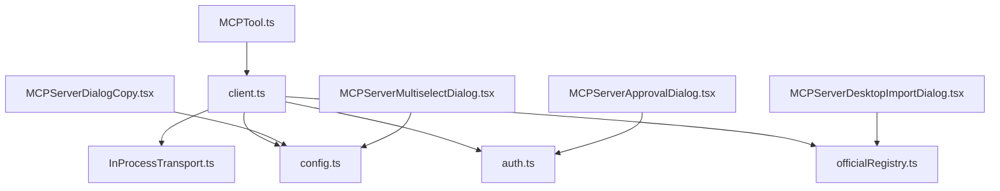

# MCP 工具核心

<cite>
**本文引用的文件**
- [mcp-server/src/index.ts](file://mcp-server/src/index.ts)
- [mcp-server/src/server.ts](file://mcp-server/src/server.ts)
- [scripts/test-mcp.ts](file://scripts/test-mcp.ts)
- [src/services/mcp/InProcessTransport.ts](file://src/services/mcp/InProcessTransport.ts)
- [src/services/mcp/client.ts](file://src/services/mcp/client.ts)
- [src/services/mcp/config.ts](file://src/services/mcp/config.ts)
- [src/services/mcp/auth.ts](file://src/services/mcp/auth.ts)
- [src/services/mcp/officialRegistry.ts](file://src/services/mcp/officialRegistry.ts)
- [src/tools/MCPTool/MCPTool.ts](file://src/tools/MCPTool/MCPTool.ts)
- [src/tools/MCPTool/prompt.ts](file://src/tools/MCPTool/prompt.ts)
- [src/tools/MCPTool/classifyForCollapse.ts](file://src/tools/MCPTool/classifyForCollapse.ts)
- [src/components/mcp/MCPServerDialogCopy.tsx](file://src/components/mcp/MCPServerDialogCopy.tsx)
- [src/components/mcp/MCPServerMultiselectDialog.tsx](file://src/components/mcp/MCPServerMultiselectDialog.tsx)
- [src/components/mcp/MCPServerDesktopImportDialog.tsx](file://src/components/mcp/MCPServerDesktopImportDialog.tsx)
- [src/components/mcp/MCPServerApprovalDialog.tsx](file://src/components/mcp/MCPServerApprovalDialog.tsx)
- [src/commands/mcp/index.ts](file://src/commands/mcp/index.ts)
- [src/commands/mcp/addCommand.ts](file://src/commands/mcp/addCommand.ts)
- [src/entrypoints/mcp.ts](file://src/entrypoints/mcp.ts)
</cite>

## 目录
1. [简介](#简介)
2. [项目结构](#项目结构)
3. [核心组件](#核心组件)
4. [架构总览](#架构总览)
5. [详细组件分析](#详细组件分析)
6. [依赖关系分析](#依赖关系分析)
7. [性能考量](#性能考量)
8. [故障排查指南](#故障排查指南)
9. [结论](#结论)
10. [附录](#附录)

## 简介
本文件聚焦于 MCP（Model Context Protocol）工具在本仓库中的核心实现与使用方式，系统性阐述以下主题：
- MCPTool 的核心实现原理与调用链路
- Model Context Protocol 的集成机制与外部工具连接流程
- MCP 客户端初始化、服务器发现与连接管理策略
- MCP 工具的 UI 组件设计与用户交互模式
- 配置项、参数传递与结果处理机制
- 实际使用示例与最佳实践

## 项目结构
围绕 MCP 的关键目录与文件分布如下：
- mcp-server：本地 MCP 服务端实现，支持 STDIO 传输，暴露资源、工具与提示词能力
- src/services/mcp：MCP 客户端侧实现，包含传输层、认证、配置、官方注册表等
- src/tools/MCPTool：MCP 工具入口，封装对远端 MCP 服务器的能力调用
- src/components/mcp：MCP 服务器选择、导入、授权等 UI 组件
- src/commands/mcp：MCP 相关命令入口与添加逻辑
- scripts/test-mcp.ts：本地测试脚本，演示客户端与内置 mcp-server 的连通性

**图表来源**
- [mcp-server/src/index.ts:1-25](file://mcp-server/src/index.ts#L1-L25)
- [mcp-server/src/server.ts:148-943](file://mcp-server/src/server.ts#L148-L943)
- [src/services/mcp/client.ts](file://src/services/mcp/client.ts)
- [src/services/mcp/config.ts](file://src/services/mcp/config.ts)
- [src/services/mcp/auth.ts](file://src/services/mcp/auth.ts)
- [src/services/mcp/officialRegistry.ts](file://src/services/mcp/officialRegistry.ts)
- [src/services/mcp/InProcessTransport.ts:57-63](file://src/services/mcp/InProcessTransport.ts#L57-L63)
- [src/tools/MCPTool/MCPTool.ts](file://src/tools/MCPTool/MCPTool.ts)
- [src/commands/mcp/index.ts](file://src/commands/mcp/index.ts)
- [src/components/mcp/MCPServerDialogCopy.tsx](file://src/components/mcp/MCPServerDialogCopy.tsx)
- [src/components/mcp/MCPServerMultiselectDialog.tsx](file://src/components/mcp/MCPServerMultiselectDialog.tsx)
- [src/components/mcp/MCPServerDesktopImportDialog.tsx](file://src/components/mcp/MCPServerDesktopImportDialog.tsx)
- [src/components/mcp/MCPServerApprovalDialog.tsx](file://src/components/mcp/MCPServerApprovalDialog.tsx)

**章节来源**
- [mcp-server/src/index.ts:1-25](file://mcp-server/src/index.ts#L1-L25)
- [mcp-server/src/server.ts:148-943](file://mcp-server/src/server.ts#L148-L943)
- [scripts/test-mcp.ts:1-39](file://scripts/test-mcp.ts#L1-L39)

## 核心组件
- MCP 服务端（mcp-server）
  - 提供 STDIO 传输入口，启动后绑定 Server 并接入传输层
  - 暴露资源（资源清单、模板、读取）、工具（列工具、读取源码、搜索等）、提示词（架构讲解、对比工具等）
- MCP 客户端（src/services/mcp）
  - 连接管理：通过不同传输层（STDIO、HTTP、进程内）建立连接
  - 配置与通道：维护服务器列表、通道白名单、环境变量扩展
  - 认证与权限：处理授权、通知与权限策略
  - 官方注册表：提供官方 MCP 服务器清单与导入能力
- MCP 工具（src/tools/MCPTool）
  - 封装对远端 MCP 能力的调用，统一参数与结果处理
- UI 组件（src/components/mcp）
  - 服务器复制、多选、桌面导入、授权弹窗等交互
- 命令入口（src/commands/mcp）
  - 提供 MCP 相关命令与添加逻辑

**章节来源**
- [mcp-server/src/index.ts:13-24](file://mcp-server/src/index.ts#L13-L24)
- [mcp-server/src/server.ts:148-943](file://mcp-server/src/server.ts#L148-L943)
- [src/services/mcp/client.ts](file://src/services/mcp/client.ts)
- [src/services/mcp/config.ts](file://src/services/mcp/config.ts)
- [src/services/mcp/auth.ts](file://src/services/mcp/auth.ts)
- [src/services/mcp/officialRegistry.ts](file://src/services/mcp/officialRegistry.ts)
- [src/tools/MCPTool/MCPTool.ts](file://src/tools/MCPTool/MCPTool.ts)
- [src/components/mcp/MCPServerDialogCopy.tsx](file://src/components/mcp/MCPServerDialogCopy.tsx)
- [src/components/mcp/MCPServerMultiselectDialog.tsx](file://src/components/mcp/MCPServerMultiselectDialog.tsx)
- [src/components/mcp/MCPServerDesktopImportDialog.tsx](file://src/components/mcp/MCPServerDesktopImportDialog.tsx)
- [src/components/mcp/MCPServerApprovalDialog.tsx](file://src/components/mcp/MCPServerApprovalDialog.tsx)
- [src/commands/mcp/index.ts](file://src/commands/mcp/index.ts)

## 架构总览
下图展示从 MCP 工具到服务端的典型调用链路，以及客户端侧的连接与配置管理。

**图表来源**
- [src/tools/MCPTool/MCPTool.ts](file://src/tools/MCPTool/MCPTool.ts)
- [src/services/mcp/client.ts](file://src/services/mcp/client.ts)
- [src/services/mcp/InProcessTransport.ts:57-63](file://src/services/mcp/InProcessTransport.ts#L57-L63)
- [mcp-server/src/server.ts:148-943](file://mcp-server/src/server.ts#L148-L943)

## 详细组件分析

### MCP 服务端（mcp-server）
- 启动流程
  - STDIO 入口负责校验源码根目录并创建 Server，随后绑定 STDIO 传输
- 资源与工具
  - 资源：架构概览、工具清单、命令清单、源码模板
  - 工具：列举工具/命令、读取工具/命令源码、读取任意源码文件、搜索源码、列出目录、获取架构
- 提示词
  - 针对工具、命令、架构、对比工具等场景提供提示词模板

**图表来源**
- [mcp-server/src/index.ts:13-24](file://mcp-server/src/index.ts#L13-L24)
- [mcp-server/src/server.ts:148-943](file://mcp-server/src/server.ts#L148-L943)

**章节来源**
- [mcp-server/src/index.ts:13-24](file://mcp-server/src/index.ts#L13-L24)
- [mcp-server/src/server.ts:148-943](file://mcp-server/src/server.ts#L148-L943)

### MCP 客户端（src/services/mcp）
- 连接与传输
  - 支持 STDIO、HTTP、进程内（InProcessTransport）等多种传输
  - 进程内传输通过双向链接实现零子进程开销的连通
- 配置与通道
  - 维护服务器配置、通道白名单、环境变量扩展
- 认证与权限
  - 授权流程、权限策略与通知机制
- 官方注册表
  - 提供官方 MCP 服务器清单与导入能力

**图表来源**
- [src/services/mcp/InProcessTransport.ts:11-63](file://src/services/mcp/InProcessTransport.ts#L11-L63)
- [src/services/mcp/client.ts](file://src/services/mcp/client.ts)
- [src/services/mcp/config.ts](file://src/services/mcp/config.ts)
- [src/services/mcp/auth.ts](file://src/services/mcp/auth.ts)
- [src/services/mcp/officialRegistry.ts](file://src/services/mcp/officialRegistry.ts)

**章节来源**
- [src/services/mcp/InProcessTransport.ts:11-63](file://src/services/mcp/InProcessTransport.ts#L11-L63)
- [src/services/mcp/client.ts](file://src/services/mcp/client.ts)
- [src/services/mcp/config.ts](file://src/services/mcp/config.ts)
- [src/services/mcp/auth.ts](file://src/services/mcp/auth.ts)
- [src/services/mcp/officialRegistry.ts](file://src/services/mcp/officialRegistry.ts)

### MCP 工具（src/tools/MCPTool）
- 功能定位
  - 将 MCP 服务器的能力以工具形式暴露给上层调用者
  - 统一参数校验、请求构造、结果解析与展示
- 关键文件
  - MCPTool.ts：工具主体
  - prompt.ts：提示词模板
  - classifyForCollapse.ts：折叠分类辅助

**图表来源**
- [src/tools/MCPTool/MCPTool.ts](file://src/tools/MCPTool/MCPTool.ts)
- [src/tools/MCPTool/prompt.ts](file://src/tools/MCPTool/prompt.ts)
- [src/tools/MCPTool/classifyForCollapse.ts](file://src/tools/MCPTool/classifyForCollapse.ts)

**章节来源**
- [src/tools/MCPTool/MCPTool.ts](file://src/tools/MCPTool/MCPTool.ts)
- [src/tools/MCPTool/prompt.ts](file://src/tools/MCPTool/prompt.ts)
- [src/tools/MCPTool/classifyForCollapse.ts](file://src/tools/MCPTool/classifyForCollapse.ts)

### UI 组件（src/components/mcp）
- 服务器复制、多选、桌面导入、授权弹窗等
- 与配置与认证模块联动，确保用户在使用前完成授权与通道设置

**图表来源**
- [src/components/mcp/MCPServerDialogCopy.tsx](file://src/components/mcp/MCPServerDialogCopy.tsx)
- [src/components/mcp/MCPServerMultiselectDialog.tsx](file://src/components/mcp/MCPServerMultiselectDialog.tsx)
- [src/components/mcp/MCPServerDesktopImportDialog.tsx](file://src/components/mcp/MCPServerDesktopImportDialog.tsx)
- [src/components/mcp/MCPServerApprovalDialog.tsx](file://src/components/mcp/MCPServerApprovalDialog.tsx)
- [src/services/mcp/config.ts](file://src/services/mcp/config.ts)
- [src/services/mcp/officialRegistry.ts](file://src/services/mcp/officialRegistry.ts)
- [src/services/mcp/auth.ts](file://src/services/mcp/auth.ts)

**章节来源**
- [src/components/mcp/MCPServerDialogCopy.tsx](file://src/components/mcp/MCPServerDialogCopy.tsx)
- [src/components/mcp/MCPServerMultiselectDialog.tsx](file://src/components/mcp/MCPServerMultiselectDialog.tsx)
- [src/components/mcp/MCPServerDesktopImportDialog.tsx](file://src/components/mcp/MCPServerDesktopImportDialog.tsx)
- [src/components/mcp/MCPServerApprovalDialog.tsx](file://src/components/mcp/MCPServerApprovalDialog.tsx)

### 命令入口（src/commands/mcp）
- 提供 MCP 相关命令与添加逻辑，作为用户触发工具的入口之一

**章节来源**
- [src/commands/mcp/index.ts](file://src/commands/mcp/index.ts)
- [src/commands/mcp/addCommand.ts](file://src/commands/mcp/addCommand.ts)

## 依赖关系分析
- 组件耦合
  - MCPTool 依赖 MCP 客户端；客户端依赖传输层、配置、认证与官方注册表
  - UI 组件依赖配置与认证模块，保障用户体验与安全
- 外部依赖
  - 使用 @modelcontextprotocol/sdk 的客户端/服务端实现
  - Node 内置 fs/path 用于文件系统操作
- 循环依赖
  - 当前结构以“服务端”“客户端”“工具/命令/UI”分层，未见明显循环依赖

**图表来源**
- [src/tools/MCPTool/MCPTool.ts](file://src/tools/MCPTool/MCPTool.ts)
- [src/services/mcp/client.ts](file://src/services/mcp/client.ts)
- [src/services/mcp/InProcessTransport.ts:57-63](file://src/services/mcp/InProcessTransport.ts#L57-L63)
- [src/services/mcp/config.ts](file://src/services/mcp/config.ts)
- [src/services/mcp/auth.ts](file://src/services/mcp/auth.ts)
- [src/services/mcp/officialRegistry.ts](file://src/services/mcp/officialRegistry.ts)
- [src/components/mcp/MCPServerDialogCopy.tsx](file://src/components/mcp/MCPServerDialogCopy.tsx)
- [src/components/mcp/MCPServerMultiselectDialog.tsx](file://src/components/mcp/MCPServerMultiselectDialog.tsx)
- [src/components/mcp/MCPServerDesktopImportDialog.tsx](file://src/components/mcp/MCPServerDesktopImportDialog.tsx)
- [src/components/mcp/MCPServerApprovalDialog.tsx](file://src/components/mcp/MCPServerApprovalDialog.tsx)

**章节来源**
- [src/tools/MCPTool/MCPTool.ts](file://src/tools/MCPTool/MCPTool.ts)
- [src/services/mcp/client.ts](file://src/services/mcp/client.ts)
- [src/services/mcp/InProcessTransport.ts:57-63](file://src/services/mcp/InProcessTransport.ts#L57-L63)
- [src/services/mcp/config.ts](file://src/services/mcp/config.ts)
- [src/services/mcp/auth.ts](file://src/services/mcp/auth.ts)
- [src/services/mcp/officialRegistry.ts](file://src/services/mcp/officialRegistry.ts)
- [src/components/mcp/MCPServerDialogCopy.tsx](file://src/components/mcp/MCPServerDialogCopy.tsx)
- [src/components/mcp/MCPServerMultiselectDialog.tsx](file://src/components/mcp/MCPServerMultiselectDialog.tsx)
- [src/components/mcp/MCPServerDesktopImportDialog.tsx](file://src/components/mcp/MCPServerDesktopImportDialog.tsx)
- [src/components/mcp/MCPServerApprovalDialog.tsx](file://src/components/mcp/MCPServerApprovalDialog.tsx)

## 性能考量
- 传输层选择
  - 进程内传输避免子进程开销，适合测试与内部集成
  - STDIO/HTTP 适合跨进程/远程场景，注意网络延迟与序列化成本
- 工具调用
  - 对大文件读取与全文搜索建议限制范围与行数，避免阻塞
  - 结果分页或流式输出可提升交互体验
- 缓存与复用
  - 复用已建立的连接，减少握手与鉴权次数
  - 对常用资源与工具结果进行轻量缓存

## 故障排查指南
- 服务端启动失败
  - 检查源码根目录是否正确设置与存在
  - 查看启动日志中的致命错误信息
- 连接失败
  - 确认传输类型与目标地址正确
  - 检查通道白名单与权限状态
- 工具调用异常
  - 校验输入参数与必填字段
  - 查看服务端返回的错误信息与堆栈
- 权限与授权
  - 确认授权弹窗已处理
  - 检查官方注册表导入是否成功

**章节来源**
- [mcp-server/src/index.ts:21-24](file://mcp-server/src/index.ts#L21-L24)
- [mcp-server/src/server.ts:946-956](file://mcp-server/src/server.ts#L946-L956)
- [src/services/mcp/auth.ts](file://src/services/mcp/auth.ts)
- [src/services/mcp/config.ts](file://src/services/mcp/config.ts)

## 结论
本仓库的 MCP 能力由“本地服务端 + 客户端 + 工具 + UI + 命令”构成完整闭环。通过标准化的传输层与协议实现，MCPTool 能稳定地调用远端能力；客户端侧的配置、认证与注册表进一步提升了可用性与安全性。结合 UI 与命令入口，用户可以便捷地发现、授权与使用 MCP 服务器。

## 附录

### 使用示例与最佳实践
- 示例脚本
  - 使用内置 mcp-server 与 SDK 客户端进行连通性测试
  - 步骤要点：构建服务端 → 启动服务端 → 创建客户端 → 列举工具/资源 → 调用工具 → 打印结果
- 最佳实践
  - 明确传输类型与目标，优先使用受信通道
  - 对工具输入进行严格校验，避免路径穿越与非法参数
  - 在 UI 中提供清晰的授权与导入流程，降低用户门槛
  - 对大结果进行分页或摘要展示，优化交互体验

**章节来源**
- [scripts/test-mcp.ts:1-39](file://scripts/test-mcp.ts#L1-L39)
- [mcp-server/src/server.ts:29-88](file://mcp-server/src/server.ts#L29-L88)
- [src/services/mcp/InProcessTransport.ts:57-63](file://src/services/mcp/InProcessTransport.ts#L57-L63)