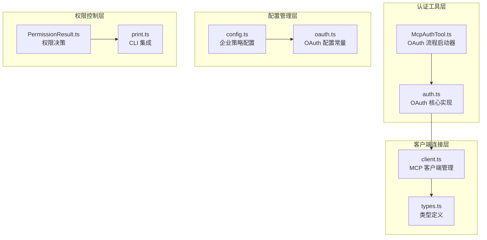
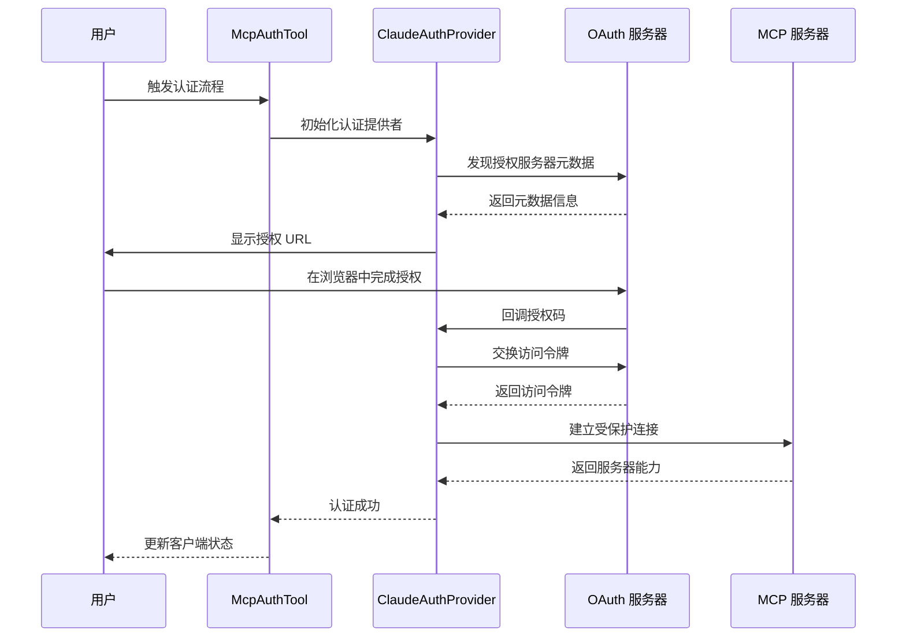
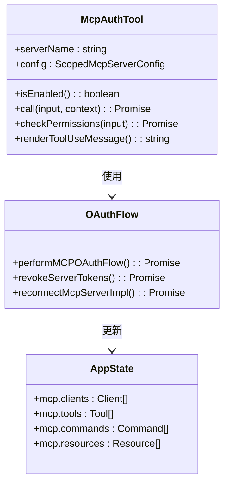
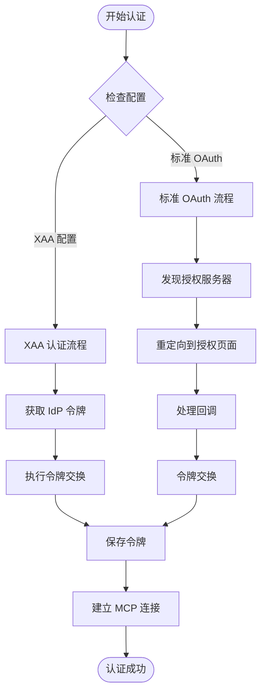
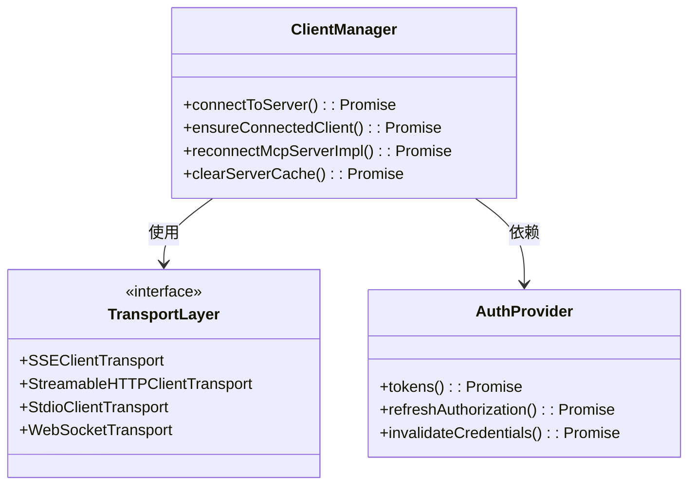
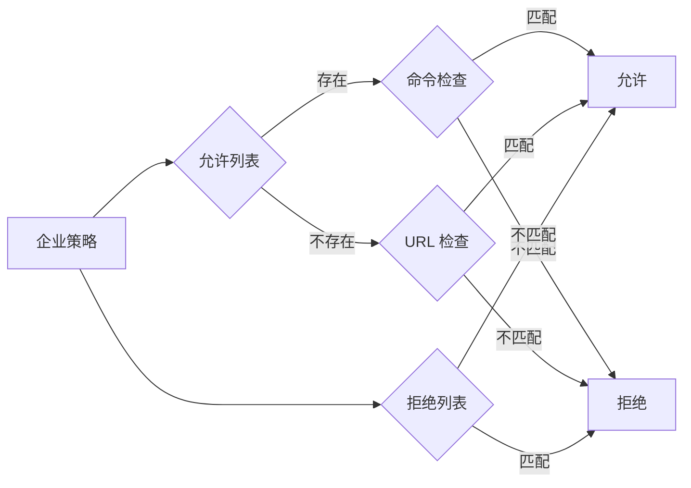

# MCP 认证与授权

<cite>
**本文档引用的文件**
- [McpAuthTool.ts](file://src/tools/McpAuthTool/McpAuthTool.ts)
- [auth.ts](file://src/services/mcp/auth.ts)
- [client.ts](file://src/services/mcp/client.ts)
- [types.ts](file://src/services/mcp/types.ts)
- [config.ts](file://src/services/mcp/config.ts)
- [oauth.ts](file://src/constants/oauth.ts)
- [PermissionResult.ts](file://src/utils/permissions/PermissionResult.ts)
- [print.ts](file://src/cli/print.ts)
</cite>

## 目录
1. [简介](#简介)
2. [项目结构](#项目结构)
3. [核心组件](#核心组件)
4. [架构概览](#架构概览)
5. [详细组件分析](#详细组件分析)
6. [依赖关系分析](#依赖关系分析)
7. [性能考虑](#性能考虑)
8. [故障排除指南](#故障排除指南)
9. [结论](#结论)

## 简介

MCP（Model Context Protocol）认证与授权系统是 Claude Code 中用于管理第三方 MCP 服务器连接的核心安全基础设施。该系统实现了完整的 OAuth 2.0/OIDC 流程，支持多种认证方式，包括标准 OAuth 授权码流程、API 密钥管理和跨应用访问（XAA）机制。

本系统提供了多层次的安全保障，包括令牌刷新策略、权限继承、访问控制机制，以及完善的错误处理和重试策略。系统设计注重用户体验，在保证安全性的前提下提供流畅的认证体验。

## 项目结构

MCP 认证与授权功能主要分布在以下模块中：



**图表来源**
- [McpAuthTool.ts:1-217](file://src/tools/McpAuthTool/McpAuthTool.ts#L1-L217)
- [auth.ts:1-2467](file://src/services/mcp/auth.ts#L1-L2467)
- [client.ts:1-3350](file://src/services/mcp/client.ts#L1-L3350)

**章节来源**
- [McpAuthTool.ts:1-217](file://src/tools/McpAuthTool/McpAuthTool.ts#L1-L217)
- [auth.ts:1-2467](file://src/services/mcp/auth.ts#L1-L2467)
- [client.ts:1-3350](file://src/services/mcp/client.ts#L1-L3350)

## 核心组件

### OAuth 认证流程引擎

OAuth 认证流程由 ClaudeAuthProvider 类实现，支持多种认证模式：

- **标准 OAuth 授权码流程**：适用于大多数 MCP 服务器
- **XAA（跨应用访问）**：支持通过单一 IdP 会话访问多个 MCP 服务器
- **API 密钥认证**：支持基于 API 密钥的认证方式

### MCP 客户端管理器

MCP 客户端管理器负责：
- 连接状态管理
- 令牌自动刷新
- 错误处理和重连机制
- 资源缓存和清理

### 企业策略配置

企业级 MCP 服务器配置支持：
- 允许列表和拒绝列表
- 命令行参数和 URL 模式匹配
- 动态策略评估

**章节来源**
- [auth.ts:1376-2360](file://src/services/mcp/auth.ts#L1376-L2360)
- [client.ts:1-800](file://src/services/mcp/client.ts#L1-L800)
- [config.ts:357-508](file://src/services/mcp/config.ts#L357-L508)

## 架构概览

MCP 认证与授权系统采用分层架构设计，确保了安全性、可扩展性和易维护性：



**图表来源**
- [McpAuthTool.ts:85-206](file://src/tools/McpAuthTool/McpAuthTool.ts#L85-L206)
- [auth.ts:847-1342](file://src/services/mcp/auth.ts#L847-L1342)

系统架构的关键特点：

1. **多层安全防护**：从网络传输到应用层的全方位安全保障
2. **灵活的认证策略**：支持多种认证方式的无缝切换
3. **智能令牌管理**：自动化的令牌刷新和失效处理
4. **企业级策略集成**：深度集成企业安全策略和合规要求

## 详细组件分析

### McpAuthTool 组件

McpAuthTool 是用户触发 OAuth 认证流程的入口点，具有以下特性：



**图表来源**
- [McpAuthTool.ts:49-214](file://src/tools/McpAuthTool/McpAuthTool.ts#L49-L214)

**章节来源**
- [McpAuthTool.ts:1-217](file://src/tools/McpAuthTool/McpAuthTool.ts#L1-L217)

### ClaudeAuthProvider 核心认证引擎

ClaudeAuthProvider 实现了完整的 OAuth 2.0/OIDC 认证流程：



**图表来源**
- [auth.ts:847-1342](file://src/services/mcp/auth.ts#L847-L1342)
- [auth.ts:1376-2360](file://src/services/mcp/auth.ts#L1376-L2360)

**章节来源**
- [auth.ts:1376-2360](file://src/services/mcp/auth.ts#L1376-L2360)

### MCP 客户端连接管理

MCP 客户端管理器负责处理各种传输类型的连接：



**图表来源**
- [client.ts:595-1641](file://src/services/mcp/client.ts#L595-L1641)

**章节来源**
- [client.ts:1-3350](file://src/services/mcp/client.ts#L1-L3350)

### 企业策略配置管理

企业级 MCP 服务器配置实现了细粒度的访问控制：



**图表来源**
- [config.ts:357-508](file://src/services/mcp/config.ts#L357-L508)

**章节来源**
- [config.ts:1-800](file://src/services/mcp/config.ts#L1-L800)

## 依赖关系分析

MCP 认证与授权系统的依赖关系体现了清晰的关注点分离：

```mermaid
graph TB
subgraph "外部依赖"
A[@modelcontextprotocol/sdk]
B[axios]
C[oauth-2.0]
D[oidc-client]
end
subgraph "内部模块"
E[McpAuthTool]
F[ClaudeAuthProvider]
G[ClientManager]
H[ConfigManager]
I[PermissionSystem]
end
subgraph "工具函数"
J[SecureStorage]
K[Lockfile]
L[BrowserUtils]
end
E --> F
F --> G
G --> H
I --> J
F --> A
F --> B
F --> C
F --> D
G --> J
G --> K
F --> L
```

**图表来源**
- [auth.ts:1-50](file://src/services/mcp/auth.ts#L1-L50)
- [client.ts:1-50](file://src/services/mcp/client.ts#L1-L50)

**章节来源**
- [auth.ts:1-2467](file://src/services/mcp/auth.ts#L1-L2467)
- [client.ts:1-3350](file://src/services/mcp/client.ts#L1-L3350)

## 性能考虑

### 令牌刷新优化

系统实现了智能的令牌刷新策略，避免不必要的网络请求：

- **预刷新机制**：在令牌过期前 5 分钟主动刷新
- **并发去重**：使用锁文件防止并发刷新操作
- **缓存策略**：合理利用内存缓存和持久化存储

### 连接池管理

MCP 客户端连接采用了高效的连接池管理：

- **批量连接**：支持并发连接多个 MCP 服务器
- **连接复用**：避免重复建立连接的开销
- **资源清理**：及时释放不再使用的连接资源

### 缓存策略

系统实现了多层次的缓存机制：

- **连接缓存**：缓存已建立的 MCP 连接
- **工具缓存**：缓存服务器工具和资源信息
- **令牌缓存**：缓存 OAuth 令牌以减少刷新频率

## 故障排除指南

### 常见认证问题

| 问题类型 | 症状 | 解决方案 |
|---------|------|----------|
| OAuth 状态不匹配 | "OAuth state mismatch" 错误 | 检查代理设置和防火墙规则 |
| 端口占用 | "端口已被占用" 错误 | 更换回调端口或关闭占用进程 |
| 令牌过期 | 401 未授权错误 | 手动重新认证或检查系统时间 |
| 服务器无响应 | 连接超时错误 | 检查网络连接和服务器状态 |

### 调试技巧

1. **启用详细日志**：设置 `DEBUG=MCP` 环境变量获取详细调试信息
2. **检查令牌存储**：验证密钥链中的 OAuth 令牌状态
3. **网络诊断**：使用 `curl` 或 `wget` 测试 MCP 服务器可达性
4. **浏览器开发者工具**：检查 OAuth 回调是否正确返回

### 安全最佳实践

1. **定期轮换令牌**：建立令牌轮换策略，避免长期使用同一令牌
2. **最小权限原则**：为 MCP 服务器配置最小必要的 OAuth 权限
3. **监控异常活动**：建立异常登录和认证失败的监控机制
4. **定期安全审计**：定期审查 MCP 服务器配置和访问日志

**章节来源**
- [auth.ts:1262-1341](file://src/services/mcp/auth.ts#L1262-L1341)
- [client.ts:1600-2399](file://src/services/mcp/client.ts#L1600-L2399)

## 结论

MCP 认证与授权系统通过精心设计的架构和实现，为 Claude Code 提供了强大而安全的第三方 MCP 服务器连接能力。系统不仅满足了基本的认证需求，还提供了企业级的安全保障和灵活的配置选项。

关键优势包括：

- **全面的安全保障**：从传输层到应用层的多层安全防护
- **灵活的认证策略**：支持多种认证方式的无缝集成
- **优秀的用户体验**：自动化处理复杂的认证流程
- **强大的企业支持**：深度集成企业安全策略和合规要求
- **高性能设计**：优化的缓存和连接管理机制

该系统为未来的扩展和改进奠定了坚实的基础，能够适应不断变化的安全需求和技术发展。